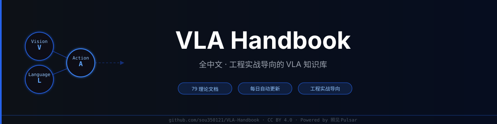

# VLA Handbook

📊 实时情报 → **[PULSAR 照见](https://sou350121.github.io/pulsar-web/)** — `sou350121.github.io/pulsar-web`

### 全中文 · 工程实战导向的 VLA 知识库

VLA 论文每天几十篇，真正能用的工程细节零散在 GitHub Issue 和论文附录里。
这个 Handbook 做一件事：**把"看懂论文"和"跑通代码"之间的坑，全部填平。**

> 70+ 理论文档 · 18+ Feb 2026 深度解析 · 每日自动 pipeline（⚡ 论文评分 · 深度拆解 · 社交情报）

---

## 三句话说清楚这个 Handbook 的价值

1. **不只是摘要**：每篇给出入口脚本、关键超参、shape 口径的 sanity-check——"看懂"和"跑通"之间的坑，都标出来了。
2. **Robotics 的脏活写清楚**：多模态同步、Sim2Real 断点、动作空间对齐、触觉/灵巧手硬件选型——这些在其他地方要么没有，要么藏在论文附录里。
3. **活的知识库**：自动 pipeline 每天抓最新 VLA 论文（⚡/🔧/📖 评级），精选后生成深度解析写入仓库，不是六个月没人维护的静态文档。

## 和这些方式相比

读 VLA 领域信息，大多数人用的是这三种方式——先说各自真正好在哪：

**看公众号**（机器之心 / 量子位 / PaperWeekly）：中文团队写的可读综述，编辑质量有保证，适合碎片时间、移动端阅读。
**查 GitHub Awesome 列表 / 公开综述**：整理好的资源书签，方便快速找到经典论文和开源项目。
**刷 X/Twitter 跟踪 VLA 作者**：第一时间看到作者反应和社区讨论，实时感强。

**选 VLA Handbook**：需要工程级深度——论文怎么跑通、部署怎么踩坑、Sim2Real 断在哪，而且每天自动更新，永久可查。

| 维度 | 公众号 ML 文章 | Awesome 列表 / 综述 | X/Twitter 速报 | **VLA Handbook** |
|------|-------------|-------------------|--------------|-----------------|
| **最擅长** | 可读中文综述，移动端友好 | 资源书签，快速入手 | 实时讨论，作者第一反应 | 工程实战 + 每日自动深度解析 |
| **工程细节** | ❌ 媒体视角 | ❌ 链接汇总 | ❌ 碎片化 | ✅ 入口脚本 · 关键超参 · shape 校验 |
| **更新频率** | 不定期 | 月 / 季度 | 实时 | 每日自动（09:15 北京时间）|
| **历史可查** | ❌ 90 天后限流失效 | ✅ 静态存档 | ❌ 算法埋没 | ✅ Git 永久记录，全文 grep |
| **生产踩坑** | ❌ | ❌ | ❌ | ✅ Sim2Real · 多模态同步 · 硬件选型 |
| **趋势预测验证** | ❌ 无追踪 | ❌ | ❌ | ✅ 双周 ✅/❌ 历史追踪 |

---

## 先看这几篇（30 分钟内建立正确框架）

**① [学习路线图](theory/README.md)** `10–20 min`
把"要学什么"降维成可走的路径，适合刚入门。

**② [Flow Matching 原理拆解](theory/pi0_flow_matching.md)** `15–30 min`
Flow Matching 原理 + 工程折中，可直接迁移到 VLA action head。

**③ [Spirit-v1.5 代码级解析](theory/spirit_v1_5_dissection.md)** `20–40 min`
Qwen3-VL + DiT + ODE/Euler，端到端复现入口，每步都有 shape 标注。

**④ [UnifolM 开源训练栈](theory/unifolm_vla_0_unitree_2026.md)** `30–60 min`
数据管线 + 部署要点 + 30 分钟验收清单，适合真机落地参考。

**⑤ [真机部署总入口](deployment/README.md)** `按需查阅`
硬件选型 · 多模态同步 · Sim-to-Real · 调参 checklist。

**⑥ [World Action Model 零样本策略迁移](theory/world_action_models_are_zero_shot_policies_dissection.md)** `20 min`
如何做到零样本策略迁移，Feb 2026 精选，适合了解最新方向。

---

## 自动更新时刻表（北京时间）

| 内容 | 更新时间 | 去哪看 |
|------|---------|--------|
| ⚡ 论文评分（⚡/🔧/📖/❌） | 每日 09:15–10:00 | [theory/](theory/) |
| 🛰️ VLA 社交情报 | 每日 09:30 | [vla-social-intel/ →](https://github.com/sou350121/VLA-Handbook/tree/main/memory/blog/archives/vla-social-intel) |
| 🔬 理论深度解析 | 周一 / 三 / 五 15:30 | [theory/](theory/) |
| 📋 周报 + 风向洞察 | 每周日 10:30 | [reports/weekly/](reports/weekly/README.md) |
| 📊 双周推理报告 | 每两周 | [reports/biweekly/](reports/biweekly/README.md) |

---

## 项目结构

| 目录 | 内容 |
|------|------|
| [`theory/`](theory/) | 70+ 篇理论文档 + 周一/三/五自动深度解析 |
| [`deployment/`](deployment/) | 真机部署：硬件选型 · 多模态同步 · Sim-to-Real |
| [`reports/biweekly/`](reports/biweekly/) | 双周推理报告（含预测回顾）|
| [`reports/weekly/`](reports/weekly/) | 周报 + SOTA + 风向洞察 |
| [`scripts/`](scripts/) | 自动化 pipeline（SCRIPTS.md 含完整 DAG）|
| [`question-bank/`](question-bank/) | 面试题库与代码实战 |
| [`companies/`](companies/) | 机器人公司与求职指南 |
| [`cheat-sheet/`](cheat-sheet/) | 速查表（时间线 · 核心公式）|
| [`book/`](book/) | 电子书版本 |

---

## 快速导航

| 目标 | 入口 | 说明 |
|---|---|---|
| 补理论 / 刷面试 | [`theory/README.md`](theory/README.md) | 路线图 + 核心概念索引 |
| 找论文 / 做综述 | [`theory/paper_index.md`](theory/paper_index.md) | 多维索引 + 发展史全景图 |
| 真机落地 | [`deployment/README.md`](deployment/README.md) | 硬件选型 · 多模态同步 · Sim-to-Real |
| 公司 / 求职 | [`companies/README.md`](companies/README.md) | 公司指南 + 产业报告 digest |
| 双周前沿报告 | [`reports/biweekly/README.md`](reports/biweekly/README.md) | VLA / 触觉 / 人形 · 含预测回顾 |
| 周报 + 风向洞察 | [`reports/weekly/README.md`](reports/weekly/README.md) | 每周论文精选 + SOTA + 趋势分析 |
| 变更记录 | [`CHANGELOG.md`](CHANGELOG.md) | 从 git 历史提炼 |

---

## Feb 2026 新增深度解析（自动 pipeline 生成）

> ⚡ = 战略必读  🔧 = 工程可用  每日持续更新中

| 论文 | 方向 |
|------|------|
| World Action Models are Zero-shot Policies | 零样本泛化 |
| TwinVLA: Data-Efficient Bimanual Manipulation | 双臂操作 |
| Scaling Verification > Scaling Policy Learning | Test-Time Compute |
| RoboGene: Diversity-Driven VLA Pre-training | 预训练数据 |
| Olaf-World: Latent Actions for Video WM | 视频世界模型 |
| MIND: Memory & Action Control Benchmark | World Model 评估 |
| Agent World Model: Infinity Synthetic Envs | 合成环境 |
| CausalGDP: Causality-Guided Diffusion Policy | 因果 + 扩散策略 |
| TaCo: Tactile Codec Benchmark | 触觉数据 |
| Spirit-v1.5: Qwen3-VL + DiT + ODE/Euler | 端到端 VLA |
| pi0.5 / pi0.6: Physical Intelligence | 策略学习 |
| GigaBrain: World Model RL Ramp | 强化学习 |
| LingBot: Pragmatic VLA Foundation Model | 语言引导 |
| StarVLA: LEGO-like VLA Codebase | 模块化架构 |
| GR-RL: Reinforcement Learning for VLA | 强化学习微调 |
| UnifolM: Open-source VLA Training Stack | 开源训练栈 |
| DreamZero: World Action Models Zero-shot | 零样本迁移 |

---

---

## 背后的系统：照见 Pulsar

VLA Handbook 的每日内容由 [照见 Pulsar](https://github.com/sou350121/Pulsar-KenVersion) 自动驱动。Pulsar 不只是一组定时脚本——它是一个**自我进化的系统**。

**自我进化**，是指它真的会改变自己的判断：系统维护 19 条 VLA 领域假设，每条带置信度分数。每个月，它统计哪些假设被真实数据反复触发、哪些长期没有支撑，然后自动调整置信度。判断偏了的假设进入 watch-list，下一周期系统会主动注入更多相关信号去验证它——不是人工干预，是系统在自己给自己补课。双周报告的每一条预测，下一期必须打分（✅ 已验证 / ❌ 落空 / ⏳ 待观察），正确率有完整历史记录。

在这之上：

- **自愈 Watchdog** — 15 项健康检查，RSS 中断 · 评分缺失 · LLM 超时，故障自动恢复，不会静默丢数据
- **评分前置** — 每天 30+ 篇论文先经 ⚡/🔧/📖/❌ 评级，精选才进 LLM，节省 80%+ 推理成本
- **全自动** — 33 个 cron job，每天 09:00 开始，无需人工触发

## 贡献

欢迎提 Issue 和 PR：补论文解读 · 真机经验 · 面试题。见 `CONTRIBUTING.md`。

## 许可证

[CC BY 4.0](https://creativecommons.org/licenses/by/4.0/deed.zh) · 由 [照见 Pulsar](https://github.com/sou350121/Pulsar-KenVersion) 系统自动驱动
