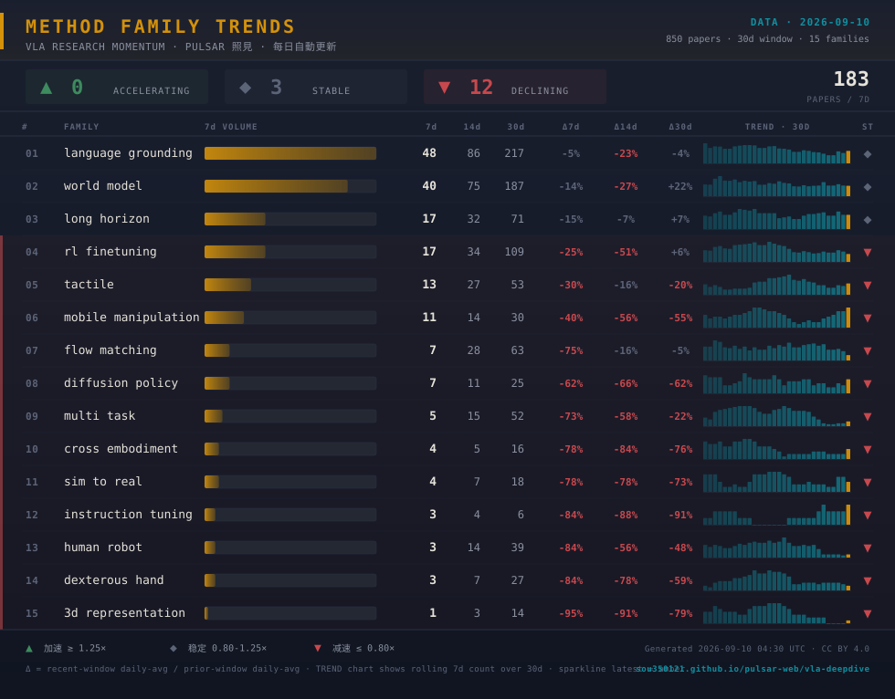

# Method Family Trends · VLA 方法族趋势

> 🖼️ **数据日期**: `2026-07-20` · **窗口**: 最近 `30` 天 · **累计论文**: `666` 篇 · **家族数**: `15`
>
> 每日自动生成 · 数据源 [pulsar-web vla-deepdive](https://sou350121.github.io/pulsar-web/vla-deepdive/)

---

## 📊 数据明细

| Family | 7d | 14d | 30d | Δ7d | Δ14d | Δ30d | Trend | Status |
|--------|:--:|:---:|:---:|:---:|:----:|:----:|:------|:------:|
| `language grounding` | 59 | 102 | 205 | 🟢 **+60%** | ·  -18% | ·  -7% | `▆▇▇▆▇▅▅▅▇▇▇█▆▆` | 🟢 ▲ |
| `rl finetuning` | 28 | 42 | 89 | 🟢 **+36%** | 🔴 **-28%** | ·  +8% | `▆▅▆▅▄▄▄▅▅▆▇█▇▇` | 🟢 ▲ |
| `world model` | 23 | 46 | 124 | ·  +12% | 🔴 **-53%** | 🟢 **+50%** | `▇▆▇█▆▅▅▅▆▅▆▅▅▅` | · ◆ |
| `multi task` | 18 | 35 | 67 | ·  -13% | 🔴 **-22%** | ·  -19% | `▅▅▆▇▇▅▅▆█▇██▆▆` | · ◆ |
| `tactile` | 14 | 27 | 49 | 🔴 **-32%** | 🔴 **-40%** | 🔴 **-41%** | `▆▇▇▆▅▅▅▇█▆▆▇▆▆` | 🔴 ▼ |
| `human robot` | 14 | 30 | 66 | 🔴 **-32%** | 🔴 **-33%** | 🔴 **-20%** | `▅▅▅▆▆▅▅▆▇▇█▆▅▅` | 🔴 ▼ |
| `long horizon` | 14 | 25 | 58 | 🔴 **-32%** | 🔴 **-44%** | 🔴 **-30%** | `▇▆▅▆▅▅▅▅▆▆█▆▆▆` | 🔴 ▼ |
| `flow matching` | 11 | 23 | 47 | 🔴 **-47%** | 🔴 **-48%** | 🔴 **-43%** | `▄▄▅▆▆▅▅▆█▇▆▆▅▅` | 🔴 ▼ |
| `dexterous hand` | 7 | 22 | 41 | 🔴 **-66%** | 🔴 **-51%** | 🔴 **-50%** | `▄▄▆▅▆▆▆██▇▆▆▃▃` | 🔴 ▼ |
| `diffusion policy` | 6 | 12 | 19 | 🔴 **-71%** | 🔴 **-73%** | 🔴 **-77%** | `▂▂▄▄▆▆▆▆██▆█▆▆` | 🔴 ▼ |
| `cross embodiment` | 4 | 8 | 18 | 🔴 **-81%** | 🔴 **-82%** | 🔴 **-78%** | `██▃▅▅▄▄▄▅▅▆▅▄▄` | 🔴 ▼ |
| `mobile manipulation` | 3 | 3 | 9 | 🔴 **-85%** | 🔴 **-93%** | 🔴 **-89%** | `█▅▅▅▃···▅▅▅███` | 🔴 ▼ |
| `sim to real` | 3 | 8 | 26 | 🔴 **-85%** | 🔴 **-82%** | 🔴 **-68%** | `▇▆█▆▇▅▅▆▇▇▅▅▃▃` | 🔴 ▼ |
| `3d representation` | 2 | 4 | 11 | 🔴 **-90%** | 🔴 **-91%** | 🔴 **-87%** | `▆█▆▅▃▃▃▃▃▂▂▃▃▃` | 🔴 ▼ |
| `instruction tuning` | 0 | 2 | 3 | 🔴 **-100%** | 🔴 **-96%** | 🔴 **-96%** | `▃▅█▅▅▅▅▅▅▃····` | 🔴 ▼ |

---

## 📖 图例说明

- **7d / 14d / 30d**：该家族近 7 / 14 / 30 天内出现的论文篇数
- **Δ7d / Δ14d / Δ30d**：近窗口与前一窗口每日平均的比值（>1.25 加速 / <0.80 减速）
- **Trend**：过去 14 天每天的 7 日滚动计数 sparkline
- **Status**：🟢 ▲ 加速 · · ◆ 稳定 · 🔴 ▼ 减速

## 🔗 相关资源

- 🌐 [Pulsar 照見 · VLA 深挖实时看板](https://sou350121.github.io/pulsar-web/vla-deepdive/)
- 📡 [RSS 订阅](https://sou350121.github.io/pulsar-web/subscribe/)
- 📊 [VLA 数据工程指南](../theory/foundation/vla_data_engineering_guide.md)

> 本快照由 `scripts/export-method-family-viz.py` 每日自动生成 · 最后更新 `2026-07-20 04:30 UTC` · CC BY 4.0
