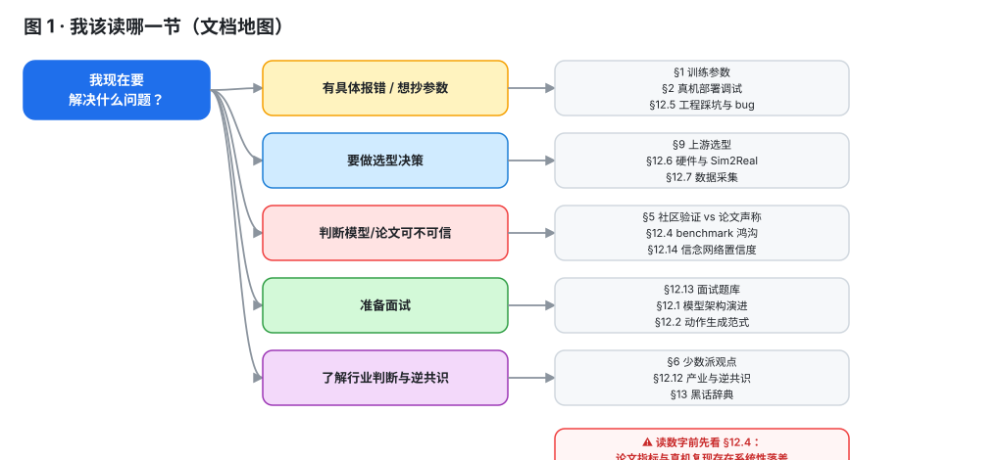
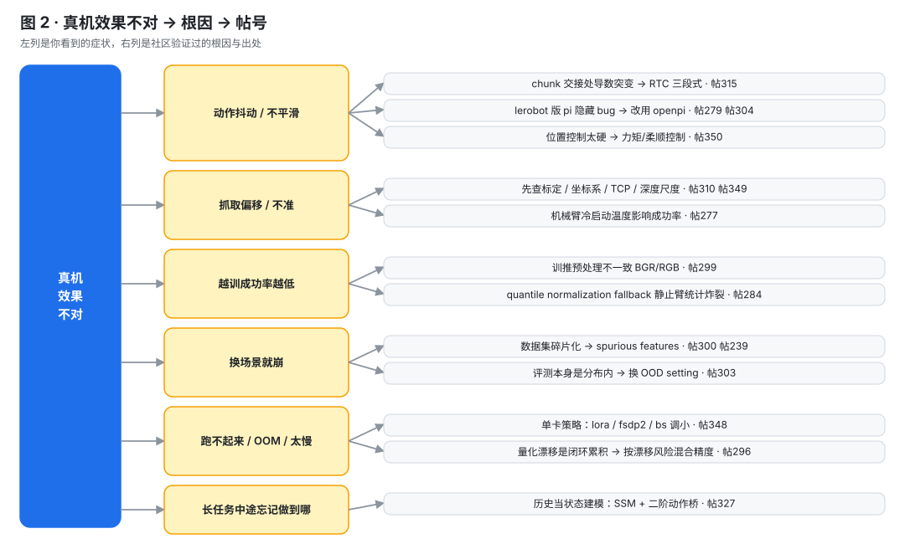
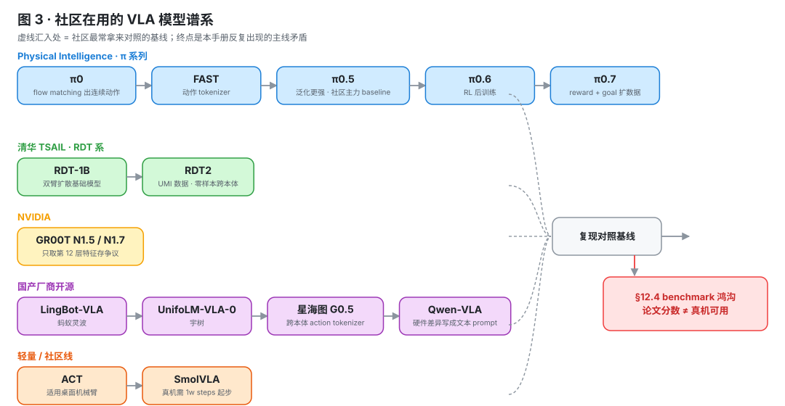
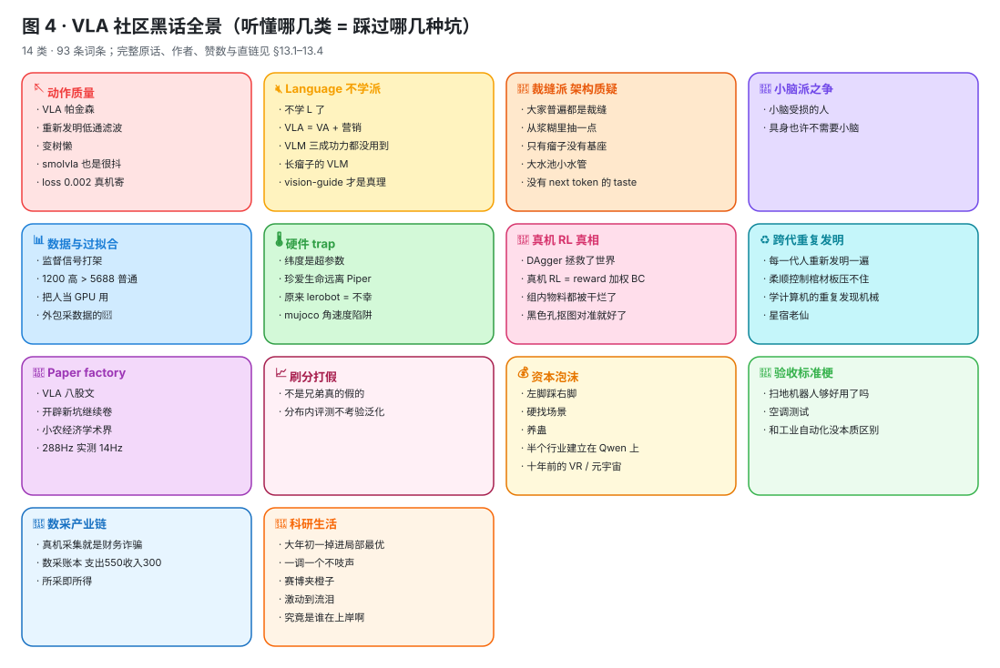
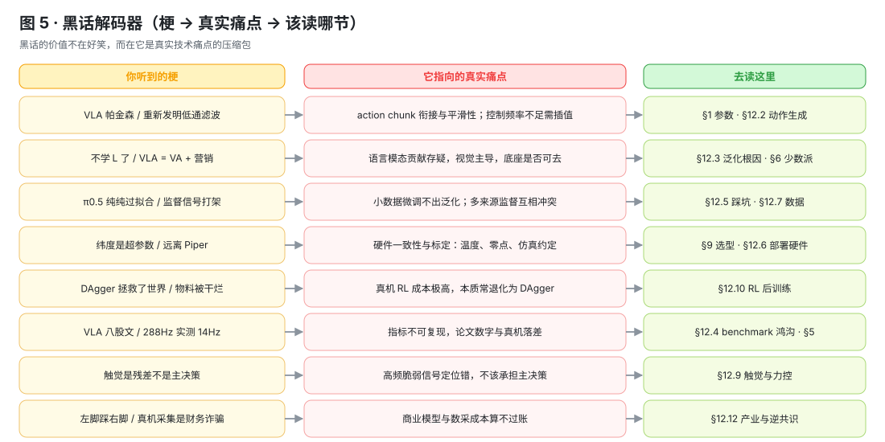
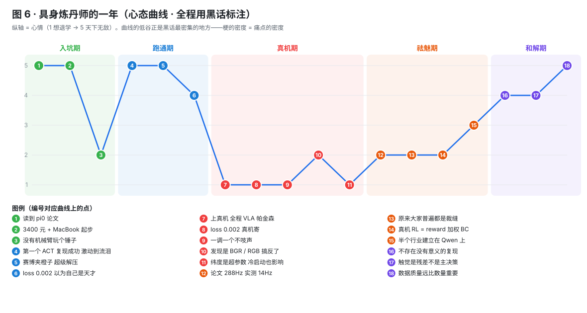
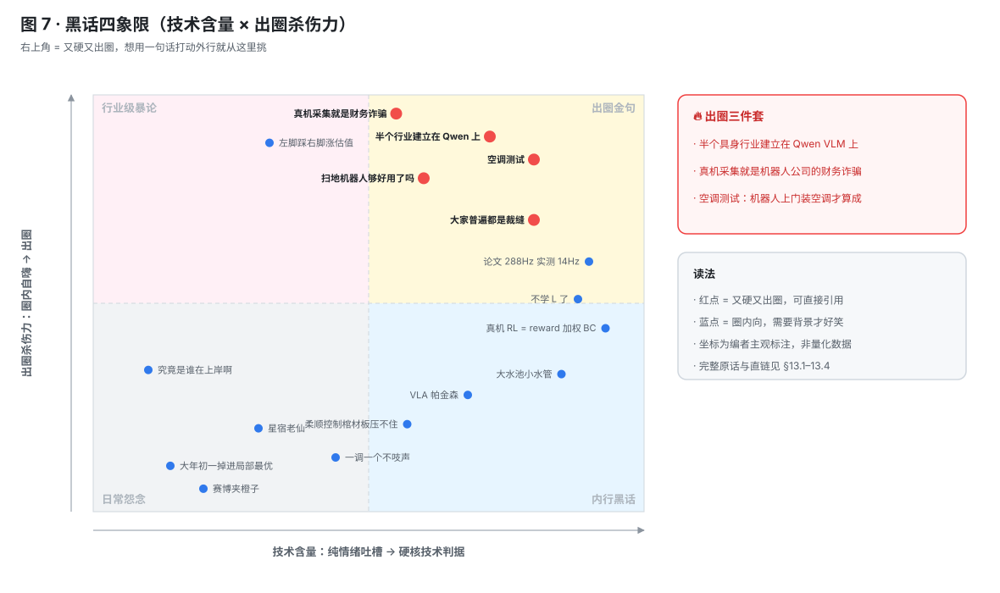
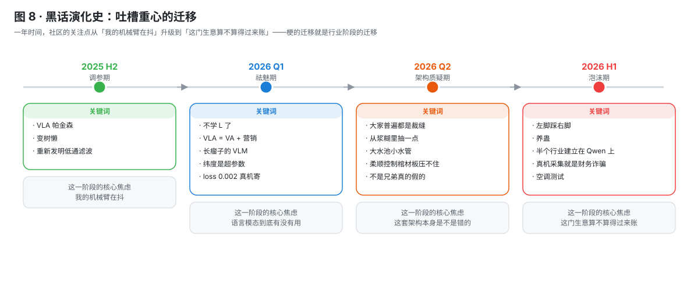
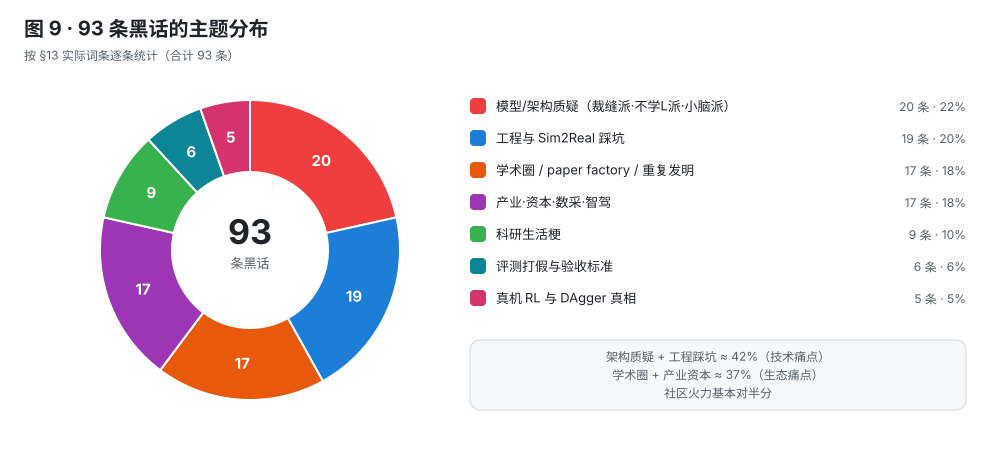

# 社区实战笔记：小红书 VLA 从业者经验蒸馏 (Community Field Notes)

> **来源**：500+ 条小红书社区蒸馏（帖1-365 + 可追溯索引 59 条 + 黑话辞典 93 条），2026-03-14 起持续收集
> **原始数据**：[memory/blog/archives/xiaohongshu-community/](../memory/blog/archives/xiaohongshu-community/)
> **定位**：论文不会告诉你的东西——社区实战者的真实参数、真实失败和真实吐槽。每条结论附「帖N」编号，可在原始数据中回溯验证。
> **更新频率**：每 3 天自动增量收集（最近一次：2026-07-25 Round 8，50 篇有效帖，详见 §12.13；历轮方法论见 §12.16）
> **结构说明（2026-07-25 重排）**：原先按日期分仓的 §12 / §14 / §15 已合并为一个按主题组织的档案 **§12（12.1-12.16）**；内容与证据逐字保留，每块标题后以 `〔原 §x.y〕`/`〔Round N〕` 标注来源。
> **快速上手**：先看 **[图表速览](#图表速览visual-index)**（文档地图 / 故障诊断树 / 模型谱系 + 关键数字表 + 参数速查表）；黑话部分另有 6 张图（全景导图 · 解码器 · 心态曲线 · 四象限 · 演化时间线 · 主题饼图），见 §13 开头。
>
> **阅读提示**：表格中的参数配置来自社区分享，不同硬件/任务下可能需要调整。"N 人验证"表示有多少独立来源报告了相同结论——数字越大越靠谱。
>
> **可靠性分层**：
> - **帖1-60**（§1-§7）：有原始档案 + 大部分有真实 URL，经 Chrome 抽样验证。**高可靠**。
> - **帖61-131+**（§9-§10）：来自扩展收集轮次，无独立原始档案备份。帖子标题和作者经 XHS 搜索抽样确认存在，但互动数（赞数）和具体引述内容可能存在偏差。**中可靠——建议对关键数据回原帖核实**。
> - **帖6-17**（第一轮部分帖子）：有详细内容摘要但缺少直链 URL（标记为「搜索可见」），无法直接跳转验证。**中可靠**。
> - **帖201-232**（原 §14 → 现 §12）：2026-04-17 / 2026-04-28 自动采集，全部带 xiaohongshu.com/explore/ 直链，正文+评论经 DOM 实时抓取。**高可靠**。
> - **帖233-276**（原 §15 → 现 §12）：2026-05-04 / 05-15 / 05-29 三轮采集（含 Round 2 "狂找"），全部带直链，正文+评论 DOM 实时抓取。**高可靠**。
> - **帖277-283**（§12.16（原 §15.9））：2026-06-01 Round 3 一手参数 / 踩坑补遗采集（7 个未覆盖关键词），全部带直链。**高可靠**。
> - **帖284-290**（§12.16（原 §15.10））：2026-06-01 Round 4 同日继续（6 个 fresh 关键词，工程 bug / insider / 反直觉），全部带直链。**高可靠**。
> - **帖291-308**（§12.16 Round 5-7）：2026-07-08 / 07-25 定时与手动采集，全部带直链，正文+评论 DOM 实时抓取。**高可靠**。
> - **帖309-358**（§12.13 Round 8）：2026-07-25 大规模采集（15 关键词 / 176 去重候选精选 50 篇），**每篇附赞数 + 评论数 + 直链**。**高可靠**。
> - **帖359-365**（§13.4 Round 9）：2026-07-25 吐槽/劝退/玄学关键词专项采集，用于扩充黑话辞典，全部带直链 + 赞数 + 评论数。**高可靠**。

---

## 速查：你现在卡在哪？

| 你的问题 | 一句话回答 | 详情 |
|----------|-----------|------|
| 数据只有几十条，用什么模型？ | **ACT**。50 episodes 就能 work，90%+ 成功率 | [§1.1](#11-act-action-chunking-with-transformers) |
| π0 微调需要多少数据？ | 至少 **100 episodes**，<200 条大概率失败 | [§1.3](#13-π0--openpi) |
| π0 微调该预测绝对量还是 delta？ | **绝对量**。delta 很难 recover | [§1.3](#13-π0--openpi) |
| SmolVLA 怎么调？ | 50ep / 20Hz / bs64 / lr4e-5 / 30K步 / 冻结backbone | [§1.2](#12-smolvla) |
| 部署时机械臂抖动/卡顿？ | 用在线插值（julyfun/robotoy），别用 temporal ensemble | [§2.1](#21-推理延迟与执行卡顿) |
| VLA 预测准但真机偏？ | 先检查冷启动（空跑 10 分钟热机），再查精度标定 | [§2.2](#22-硬件相关陷阱) |
| Sim2Real 效果差？ | 八成是物理参数没校准，不是算法问题 | [§3.1](#31-sim2real-gap-的真实根因) |
| 微调后模型变"瞎"了？ | 灾难性遗忘。冻结视觉主干或用 VRA 约束 | [§2.3](#23-灾难性遗忘--微调视觉退化) |
| GRPO 训练炸了？ | 看 reward 方差别只看均值，梯度裁剪必须有 | [§1.6](#16-rl-后训练-post-training) |
| 论文数字和我复现差很远？ | 正常。OpenVLA 论文 85.7% 实测 62.6% | [§5](#5-模型对比社区验证-vs-论文声称-reality-check) |
| 买什么机械臂？ | 避开 Piper（逆解差、无自锁、抖）。π0 用 SO101 也能跑通 | [§2.2](#22-硬件相关陷阱) |
| 只有 3090，能训 VLA 吗？ | 能。LoRA 微调 π0 单卡 20GB，ACT 更轻量 | [§9.1](#91-gpu-选型与训练资源) |
| 全量微调 vs LoRA？ | 数据少用 LoRA，数据 >500 条考虑全量。别无脑 LoRA | [§9.2](#92-lora-vs-全量微调) |
| 边缘部署怎么加速？ | CUDA Graph + 算子融合 → 单卡 30Hz 推理 480Hz 控制 | [§9.3](#93-边缘部署与模型压缩) |
| 买哪个机械臂做研究？ | 低成本：XLeRobot(4K)/SO101。中端：松灵七轴(15K)。避开 Piper | [§9.4](#94-机械臂选型指南) |
| VLA 推理加速有哪些方案？ | LAC(1.76x)、CUDA Graph+算子融合、action chunk overlap | [§10.3](#103-推理加速与部署) |
| WAM/世界模型最新进展？ | CoWVLA(运动潜空间)、DreamZero(零样本)、LDA-1B | [§10.2](#102-世界模型方向) |
| 灵巧手操作怎么做？ | DexImit(视频→数据)、DexWM(世界模型)、4款手测评 | [§10.5](#105-灵巧手与双臂操作) |
| VLA 抖动/帕金森怎么修？ | chunk间→RTC过渡；chunk内→传统滤波后处理 | [§10.3](#103-推理加速与部署) |
| VLA 还是 VAM？ | VAM(Video-Action Model) 正在起势，用 10% 数据达最高成功率 | [§9.5](#95-vla-vs-vam-路线之争) |
| VLA-Adapter 是什么？ | 保留 VLM 能力 + decoder 端接 action head，科研平民化 | [§9.2](#92-lora-vs-全量微调) |
| 真机 RL 怎么闭环？ | Evo-RL: 示教→部署→犯错→人工纠偏→数据回流→再训练 | [§1.6](#16-rl-后训练-post-training) |
| World Model 哪条技术路线？ | 四大路线：自回归/扩散/流匹配/混合，各有取舍 | [§9.10](#910-world-model-技术路线) |
| Diffusion 还是 Flow Matching？ | FM 训练稳定推理快，DP 易被误用于单模态场景 | [§9.6](#96-diffusion-policy-vs-flow-matching-实战) |
| 移动操作/导航方向？ | 从桌面走向全屋，导航+操作统一是趋势 | [§9.9](#99-移动操作与导航) |
| 仿真器选 Isaac 还是 MuJoCo？ | 接触力精度选 MuJoCo，大规模并行选 Isaac Gym | [§3.3](#33-仿真平台选型) |
| 数据难洗怎么办？ | HDF5→RLDS 有标准流程，但真机数据清洗仍是手工活 | [§4.3](#43-数据格式与清洗) |
| 触觉/灵巧手怎么选传感器？ | 五大方案各有取舍：电阻/电容/压电/电磁/光学 | [§9.7](#97-触觉传感与灵巧手) |
| 视觉编码器选哪个？ | SigLIP-2 是新标杆，VGGT 在空间任务可能优于 DINO | [§9.8](#98-视觉编码器选型) |
| π0 怎么微调/部署？ | openpi 复现看§10.7，50条单臂可跑通，双臂需更多数据 | [§10.7](#107-π0-微调与真机部署) |
| VLA 落地为什么失败？ | 泛化差+长任务弱+不可解释，团队已放弃纯VLA路线 | [§12.12（原 §12.10）](#踩坑吐槽与落地反思真机实战负面经验) |
| 开源数据微调效果极差？ | 开源数据与本机有 gap（视角/零点），自采 100 条 > 开源 1200 条 | [§12.12（原 §12.10）](#踩坑吐槽与落地反思真机实战负面经验) |
| VLA 中 Language 有用吗？ | 工业界实测 L 不起作用甚至有害，VA/VAM 路线崛起 | [§12.12（原 §12.10）](#踩坑吐槽与落地反思真机实战负面经验) |
| 加数据为什么不提升？ | action ambiguity + 时间维度 → 监督信号打架，需更多数据 | [§12.12（原 §12.10）](#踩坑吐槽与落地反思真机实战负面经验) |
| VLA+RL 怎么做？ | SimpleVLA-RL(R1式)/WMPO(世界模型内)/π-StepNFT(flow-based) | [§10.8](#108-vla--rl-强化学习) |
| Sim2Real 怎么缩小 gap？ | DoorMan(分布包含)、PIN-WM(可微物理)、仿真数据价值被放大 | [§10.9](#109-sim2real-仿真迁移) |
| 触觉怎么接入 VLA？ | VLA-Touch(NUS)、TaF-VLA(触力对齐)、VTLA-RL(触觉+RL) | [§10.10](#1010-触觉传感与力控) |
| 移动操作怎么做？ | MoManipVLA(50条)、Mobi-π(固定→移动)、ODYSSEY(四足) | [§10.11](#1011-移动操作与导航) |
| 具身智能融资热度？ | 2025Q1国内37笔35亿，9家估值破百亿，星海图/无界动力领跑 | [§10.12](#1012-产业融资与公司动态) |
| 想做 visual-guide 替代 language？ | VISTA：2h数据/5物体→OOD 21物体 69%（pi0 仅 14%） | [§12.3（原 §14.1）](#vision-guide-替代-language-guide) |
| HF 叠衣服怎么做到 90%？ | 1200 条高质量数据微调 40%→90% + SARM/RABC/RTC + DAgger | [§12.7（原 §14.3）](#huggingface-叠衣服-90-完整工程开源-) |
| WAM 架构真的优于 VLA 吗？ | 是。VLA 27 层 vision tower 只用 last hidden state（"长瘤子的 VLM"） | [§12.8（原 §14.4）](#wam-vs-vla-架构争议升级) |
| WAM robustness 实测数据？ | LingBot-VA RoboTwin 2.0-Plus 74.2% / Cosmos LIBERO-Plus 82.2%（华为） | [§12.8（原 §14.4）](#wam-vs-vla-架构争议升级) |
| 真机 RL = DAgger 包装？ | 大概率是。强如 PI 0.6\* 都拒绝做"无 DAgger ablation" | [§12.10（原 §14.5）](#dagger-是真机-rl-的真相-) |
| 触觉怎么接入 VLA 最好？ | 残差策略 + 安全感知（不是主决策模态） | [§12.9（原 §14.6）](#触觉应该是-vla-的残差安全层) |
| LeRobot 还能用吗？ | ⚠️ 维护降级。Remi 离开 + HF 重心转移；考虑 fork 或迁移 FluxVLA | [§12.11（原 §14.7）](#lerobot-维护降级--fluxvla-补位) |
| sim2sim 角速度对不上？ | mujoco root 角速度=local，isaac gym=global（节省一周调试） | [§12.6（原 §14.8）](#sim2real-工程级-pin-points) |
| Sunday 机器人硬件 spec？ | 七轴 0.8m + 三节升降 2.1m + 三轮三转 1.7w 底盘（2026 新标配） | [§12.6（原 §14.9）](#sunday-机器人硬件--so101-bom) |
| SO101 双臂 BOM 多少钱？ | 主从 ~3400 元（电机1200/摄像头700/零件1250） | [§12.6（原 §14.9）](#sunday-机器人硬件--so101-bom) |
| Libero action space 是什么？ | osc controller (dx,dy,dz,dyaw,dpitch,droll)+gripper，7 维 delta | [§12.2（原 §14.10）](#vla-action-space-技术答案) |
| PI0 OOD 极限多少？ | 5000 条数据 / 分布外 97% / 分布内 100%（社区实测） | [§12.3（原 §14.11）](#pi0-ood-极限实测) |
| VLA 论文真上过真机吗？ | A12 178 赞神回："填个表格完事了"——逆共识已成共识 | [§12.12（原 §14.12）](#vla--paper-factory-逆共识升格-) |
| VLA 推理为什么卡顿？怎么加速？ | 三件套都是无需重训主干：LAC 1.76× / DepthCache 1.3× / StreamingVLA 异步流式 | [§12.2（原 §15.1）](#推理加速三件套全部工程化vla-sota-不再单押更大底座) |
| pi0.5 微调 200 条够吗？ | 不够。Rose 一手：能抓的位置就那一点点，无泛化；horizon 大小都抓不到；30Hz 比 25Hz 还抖 | [§12.3（原 §15.2）](#vla-泛化失败--oxe-shortcut-learning-量化小数据微调到泛化置信度--10) |
| 30Hz 采集 vs 10-15Hz？ | **10-15Hz 比较合适，30Hz 太多了学不好**（Rorschach 评论一手） | [§12.3（原 §15.2）](#vla-泛化失败--oxe-shortcut-learning-量化小数据微调到泛化置信度--10) |
| Libero 任务一直跑不到 SOTA？ | 评测代码 bug：搜 `ObjectState.check_on_top`，阈值 0.3→0.5。社区一手修复 | [§12.3（原 §15.2）](#vla-泛化失败--oxe-shortcut-learning-量化小数据微调到泛化置信度--10) |
| VLA 视觉编码器的几何能力差？ | GR00T RMSE 0.92 vs VGGT 0.41。早融合 + 冻结 VLM → Unitree G1 抓取 84.44% vs 57.78% | [§12.3（原 §15.4）](#vla-的几何鸿沟被量化新子节点置信度-75) |
| pi0.5 嵌入式部署做不上去？ | 已知坑：Jetson Thor/Orin 适配失败 + Hierarchical Planner 开源缺失（CyberSoma 5 大坑） | [§12.3（原 §15.2）](#vla-泛化失败--oxe-shortcut-learning-量化小数据微调到泛化置信度--10) |
| Jim Fan / NVIDIA 怎么看 VLA？ | "VLA 已死、遥操作已死，21k 小时第一视角视频 + EgoScale，物理图灵测试 2-3 年" | [§12.8（原 §15.3）](#world-model--wam-范式收敛--内部质疑双轨升格) |
| 采数据找一堆人还是多换场景？ | 场景多样性 > 采集者数量（Jim Fan EgoVerse 30% 涨点的核心发现） | [§12.7（原 §15.5）](#数据采集策略场景多样性--采集者数量) |
| GELLO + Franka3 有什么硬伤？ | gripper 开闭 2s 延时 —— Franka hand 设计就是低频控制（社区一手） | [§12.7（原 §15.5）](#数据采集策略场景多样性--采集者数量) |
| ALOHA 仿真复现物体乱飞？ | record vs eval 初始化逻辑不同！推理时必须把采集代码注释换成 eval | [§12.2（原 §15.6）](#flow-matching--diffusion--触觉--sim2sim-工程经验) |
| Flow Matching RL sim2real 怎么提？ | FPO++ 测试时零采样：成功率 10%→70%+（Amazon FAR + Berkeley） | [§12.2（原 §15.6）](#flow-matching--diffusion--触觉--sim2sim-工程经验) |
| V-JEPA vs DINO 谁更好？ | Meta 自家实验：DINO > V-JEPA（物体边界 + 局部空间结构刻画更细） | [§12.8（原 §15.3）](#world-model--wam-范式收敛--内部质疑双轨升格) |
| 真机刚开机 VLA 成功率低？ | **冷启动！减速器温度影响摩擦力 → 轨迹跟踪滞后 → VLA 绝对 joint 角误差级联**。建议把温度加进 state | [§12.16（原 §15.9）](#round-3-经验补遗参数--踩坑导向帖277-283) |
| 多卡 VLA 训练卡死不读数据？ | **NUMA 跨节点内存访问**！`numactl --membind` 指定节点；`HDF5_USE_FILE_LOCKING=FALSE`；DS zero0 > acc+DS | [§12.16（原 §15.9）](#round-3-经验补遗参数--踩坑导向帖277-283) |
| HDF5 数据集太大跑不动？ | **lz4 压缩（clevel 小越快），2T → 250G**，解压代价 < 传输代价 | [§12.16（原 §15.9）](#round-3-经验补遗参数--踩坑导向帖277-283) |
| 灾难性遗忘最新解法？ | 上交 CVPR'26 Driving Expert Adapter — **不改主参数，提示空间适配 + 动态调用专家**；全量微调破坏性最大 | [§12.16（原 §15.9）](#round-3-经验补遗参数--踩坑导向帖277-283) |
| 宇树 G1 上跑 VLA 行不行？ | 一手报告：ACT / π0.5 / GR00T 三件套用官方数据都不行；**刚需 XR 自采 + 三 USB 别共用拓展坞** | [§12.16（原 §15.9）](#round-3-经验补遗参数--踩坑导向帖277-283) |
| ACT 在非桌面机械臂能 work 吗？ | **不能。社区共识：ACT 适用 = 桌面**；franka 50 条 OK，G1/人形/移动都失败 → RL | [§12.16（原 §15.9）](#round-3-经验补遗参数--踩坑导向帖277-283) |
| LeRobot 还能放心用吗？ | ⚠️ 维护降级第 4 次印证：**Libero MuJoCo 重力 bug 弹飞物体 + pi 兼容差 + 转换有问题** | [§12.16（原 §15.9）](#round-3-经验补遗参数--踩坑导向帖277-283) |
| 主流 VLA 架构 vs 星海图 G0.5？ | 主流：VLM Encoder + action expert；**G0.5：单 decoder 同时 reasoning + action + 27 维 token vocab 抹平 18 本体差异** | [§12.16（原 §15.9）](#round-3-经验补遗参数--踩坑导向帖277-283) |
| LeRobot 双臂训练突然炸了？ | 一个臂如果完全不动 → quantile normalization fallback bug → 推理时关节极端值。**用固定值替代静止臂** | [§12.16（原 §15.10）](#round-4-经验补遗同日-continue-加帖284-290) |
| Isaac Lab 国内卡死装不上？ | **不要先打开 IsaacSim 验证！** 会触发 S3 拉资产卡死。先下载资产包改本地路径 | [§12.16（原 §15.10）](#round-4-经验补遗同日-continue-加帖284-290) |
| VLA 训练数据要堆量吗？ | BC 阶段反而 **FrameSkip 20% 帧 > 100% 帧（76.15% vs 66.50%）**。预训练阶段才需要堆量 | [§12.16（原 §15.10）](#round-4-经验补遗同日-continue-加帖284-290) |
| SmolVLA 真机调不动？ | **至少 1w steps 起步**；默认超参不可信要手调；同等数据 π0 / GR00T 1.5 更稳 | [§12.16（原 §15.10）](#round-4-经验补遗同日-continue-加帖284-290) |
| VLA 任务一直跑不停摸物体？ | **任务终止判定缺失是普遍缺陷**（MolmoAct2 也有），目前无好解 | [§12.16（原 §15.10）](#round-4-经验补遗同日-continue-加帖284-290) |
| VLM 预训练底座到底重不重要？ | 大数据多任务下**绝对重要**：抽掉 VLM 真机成功率 83.6% → 48.5%（-35pp） | [§12.16（原 §15.10）](#round-4-经验补遗同日-continue-加帖284-290) |
| 跨本体 VLA 怎么实现？ | 两条路：G0.5 Action Tokenizer（27 维 vocab 抹平 18 本体）/ Qwen-VLA 文本 prompt 描述硬件差异（11 平台） | [§12.16（原 §15.10）](#round-4-经验补遗同日-continue-加帖284-290) |

---

## 图表速览（Visual Index）

> 本节是全文的**视觉索引**：先用三张图定位到该读哪一节，再用两张表核对关键数字与参数。（黑话专属的图 4 / 图 5 在 §13 开头）
> 图表中的每个数字都可回溯到具体帖号，原始证据在 §12 对应小节。

### 📍 图 1：我该读哪一节（文档地图）

### 🩺 图 2：真机效果不对 → 根因 → 帖号（诊断树）

### 🌳 图 3：社区在用的 VLA 模型谱系

### 📊 表 1：关键干预效果对照（社区实测数字）

> 全部为帖内明确给出的数字；同一行内的对照来自同一来源，跨行不可直接比较（任务/本体/数据量不同）。

| 干预 / 对照 | 实测效果 | 出处 |
|---|---|---|
| 抽掉 VLM 预训练底座（大数据多任务真机） | **83.6% → 48.5%**，差 35 个百分点 | 帖289 |
| 数据质量 > 数量（HF 叠衣服） | 1200 条高质量微调 **40% → 90%** | 帖206 |
| BC 阶段 FrameSkip 只用 20% 帧 | **76.15%** vs 全帧 66.50% | 帖286 |
| 触觉 naive 拼进 pi0.5（反直觉） | 17% **反降到 6%** | 帖308 |
| 触觉改为架构隔离（T-Rex：视觉 Planning / 触觉 Reactive） | → **65%**（pi0.5 17%、EgoMimic 35%） | 帖308 |
| 触觉世界模型后训练（TACO，知识隔离） | **38% → 82%** | 帖307 |
| RL 介入式后训练（RLT，网线柔顺插接） | **~30% → ~90%**，代价是人工介入数据 | 帖301 |
| 把历史建成状态（SSM + 二阶动作桥，记忆依赖任务） | π0.5 **0%** → 记忆任务 72%、双 UR3 均值 78% | 帖327 |
| Lingbot-VLA：论文 ↔ 一手复现 | 实测 **~20%**（同赛道 pi0.5 ~70%）；厂商回炉复现 **55/100** | 帖292 |
| RDT2 vs pi0.5（叠衣服） | 成功率 **+40%** | 帖331 |

> ⚠️ 读法提醒：上表右侧数字多来自作者自述或单一复现，**benchmark 分数与真机可用性存在系统性落差**（§12.4）。做决策前请配合 §12.14 的置信度看。

### ⚙️ 表 2：训练 / 推理参数速查（社区经验值）

| 项目 | 社区经验值 | 出处 |
|---|---|---|
| 训练 step | **≈20000**；epoch 过高容易过拟合 | 帖340 |
| action chunk | **预测 50，执行 10-15**（执行步数影响明显） | 帖340 |
| batch size | **32** | 帖340 |
| 全量 vs LoRA | 数据多 → 全量；数据少 → LoRA | 帖340 |
| SmolVLA 真机 | **至少 1w steps 起步**，默认超参不可信需手调 | 帖287 |
| SmolVLA 参考配方 | 50ep / 20Hz / bs64 / lr4e-5 / 30K step / chunk30 → 成功率 50-80% | 帖156 |
| 单卡 4090（24G） | LoRA / fsdp2 / bs 调小；全量微调可行但很慢 | 帖348 |
| 数据采集纪律 | 光照一致、场景固定、每条从固定起点开始、终点在工作空间外、同物体每位置上百条、注意帧率 | 帖340 |
| 数据处理必查 | resize 到训练格式、多模态对齐、**频率对齐**、确认 RGB / BGR | 帖340 帖299 |
| 框架选择 | 用 **openpi** 而非 lerobot 版；原版 AdamW 不要换 SGD；jax 与 torch 的 OOD 表现差异明显 | 帖304 帖279 |

---
## 1. 训练参数与配置经验 (Training Recipes)

### 1.1 ACT (Action Chunking with Transformers)

ACT 是当前小数据场景下社区验证度最高的方案。多个独立团队的交叉验证结果高度一致：

| 配置项 | 社区验证值 | 来源 |
|--------|-----------|------|
| 最小可用数据量 | **50 episodes**（单任务） | 帖45/46/55 三人独立验证 |
| 收敛步数 | ~31K steps | 帖55（RM65 真机） |
| 单任务成功率 | 90%+（训练分布内） | 帖55 |
| Franka 上数据量 | 50 episodes 就能 work | 帖45 评论 |

**已知局限**：
- CVAE 存在 posterior collapse——ACT 的成功更多归功于 Transformer 架构而非 CVAE 设计（帖45）
- Temporal ensemble 参数敏感，不同任务需重调；且"理论上就不对"——会掩盖模型本身问题（帖35 作者回复）
- 泛化差：换桌布、换光照就崩（帖10/57）

### 1.2 SmolVLA

| 配置项 | 社区验证值 | 来源 |
|--------|-----------|------|
| 数据量 | 50 episodes | 帖55 评论（烧仙草） |
| 采集频率 | 20 Hz | 同上 |
| batch size | 64 | 同上 |
| 学习率 | 4e-5 | 同上 |
| 训练步数 | 30K steps | 同上 |
| chunk_size | 30 | 同上 |
| n_action_step | 24 | 同上 |
| 策略 | 只微调 expert（冻结 backbone） | 同上 |
| 成功率 | **50-80%**（训练覆盖范围内） | 同上 |

**踩坑**：SmolVLM2-500M-Video-Instruct 的 `tokenizer.json` 必须单独下载，SmolVLA 仓库里不包含（帖56 评论）。跨维度使用（如 6D 数据→14D 环境）需冻结视觉主干只训动作头。

### 1.3 π0 / OpenPI

| 配置项 | 社区验证值 | 来源 |
|--------|-----------|------|
| LoRA 显存 | 单卡 bs=1 约 **20 GB** | 帖20（南柯） |
| 全参数显存 | 约 **70 GB** | 帖20（南柯） |
| 最小数据量 | **100 episodes**（单任务微调可跑通） | 帖55 评论 |
| π0 在 <200 条下 | 大概率失败（前进→回撤振荡） | 帖55 详细消融 |

**关键 tricks**（帖20 南柯一手经验）：
- **预测绝对量优于 delta 值**：预测相对 offset 很难 recover，ACT 论文也是这个结论
- **state 映射**：π0 关节角度顺/逆时针定义和 ALOHA 不一样，gripper 是弧度制 0-1
- **state 归一化**：必须提前计算全数据集 mean/var，在 transform 中使用

**π0 部署灵巧手的坑**（帖19）：预训练没见过灵巧手，新增 dim 模型不知道怎么 flow，跨模态泛化远不够。评论精确解释："pi0 的 loss 是 flow-matching 的 loss，新增 dim 模型压根没见过，不知道怎么流。"

**2026-05 新增：π0.5 小数据微调的真实失败案例**（来自 §12.3（原 §15.2））

| 失败模式 | 一手经验 | 来源 |
|---------|----------|------|
| 200 条数据无泛化 | "能抓的位置就那么一点点"，horizon 大小都抓不到 | 帖239 Rose 一手 |
| 30Hz 比 25Hz 还抖 | **降到 10-15Hz** 是更合适的采样率（Rorschach 评论） | 帖239 评论一手 |
| Jetson Thor/Orin 嵌入式部署 | **适配失败**（CyberSoma 5 大翻车点之一） | 帖272 |
| Hierarchical Planner | **开源实现缺失**，Hack 复现崩 | 帖272 |
| 推理异步 Hack | 失败，延迟"高到吐血" | 帖272 |

**结论**：π0.5 在生产环境的成熟度比社区共识低；建议 200 条小数据规模直接放弃，转 ACT/50 episodes 或 §12.7（原 §14.3） HF 叠衣服的 1200 条质量路线。

### 1.4 Motus / World Action Model

| 配置项 | 社区验证值 | 来源 |
|--------|-----------|------|
| 最低显存 | **80 GB** | 帖3（Motus 作者本人） |
| 推理 | 1.6 秒 chunk → 1 秒推理（5090, T5 预 encode） | 帖3 作者回复 |
| 动作频率 | 48 actions / 1.6s = **30 Hz** | 帖3 作者回复 |
| 视频帧率 | 8 帧 / 1.6s = **5 Hz** | 帖3 作者回复 |
| 视频帧上限 | 10 Hz 还行，再往上 video token 太多训不出来 | 帖58 作者补充 |

### 1.5 多卡 VLA 训练通用经验

来自帖9（XVLA + RobotTwin 多卡训练踩坑）：
- **DeepSpeed ZeRO-2** 比 Accelerate 更稳定
- **HDF5 压缩**：gzip 节省 50%+ 存储但增加 IO 延迟，推荐 **lzf**
- **OMP_NUM_THREADS=4**：不设置会导致 CPU 过载
- **Dataloader**：num_workers 和 prefetch_factor 对训练速度影响巨大

### 1.6 RL 后训练 (Post-training)

**RECAP / π*0.6 复现**（帖36，Evo-RL 团队一手经验；帖78 详细架构分享）：
- 硬件：SO101（最廉价开源机械臂之一）
- Policy 训练：**8×A800 约 10 小时**
- Value Function 训练：**8×A800 约 0.5 小时**
- 干预方式：**语音控制**（非脚踏板）
- 核心闭环：训练 → 部署 → 犯错 → 人工接管纠错 → 记录轨迹 → 再训练
- 框架：基于 LeRobot 实现 advantage-conditioned VLA

**Evo-RL 系统架构四层详解**（帖78，上海交大 MINT 实验室，395 赞）：
- **基础设施层**：SO101 低成本平台 + LeRobot 工作流集成
- **人在环数据层**：机器人犯错 → 人工即时接管修正 → 修正轨迹+上下文写回数据集 → 增量样本。失败不被忽略，转化为有效监督信号
- **价值推理与训练层**：Value Function Training → Value Inference → Indicator Construction
- **策略学习与部署层**：Advantage-Conditioned Policy Training，持续迭代而非一次性实验
- **关键价值**：(1) RECAP"错误后纠偏"真正接入真机 (2) Pi*0.6 训练机制整合进 LeRobot (3) 全套开源含代码/流程/数据

**真机 RL 杂谈**（帖79，钱泽中，166 赞）：
- 真机 RL 最大的工程挑战不是算法，是 reward 设计和安全约束
- 仿真训 RL 再迁移的 pipeline 仍然是主流做法，纯真机 RL 成本太高

**GRPO 训练稳定性**（帖34，实战避坑）：
- 四大崩溃原因：蝴蝶效应（策略更新改变数据分布）、组内相对奖励不稳定、梯度爆炸/熵崩塌、超参极度敏感
- **GRPO 在 MOE 模型上特别危险**：Qwen3 论文确认 token 维度优化导致 reward 暴跌，解决方案是 GSPO（帖34 评论）
- 实战建议：reward 监控看方差不只看均值、梯度裁剪必须有、定期 checkpoint

**DRL 通用避坑**（帖38）：
- 学习率先固定 **1e-4**，折扣因子 **0.99**，优先调探索策略
- PPO clip 保持 **0.2**
- 稀疏奖励 → 换成距离递减的稠密奖励，训练速度可提升数倍
- 简单规则策略或 IL 做初始化，避免从零随机探索

---

## 2. 真机部署调试 (Deployment Debugging)

### 2.1 推理延迟与执行卡顿

这是社区反映最多的工程痛点（帖13/50）：

**问题清单**：
1. 大模型推理慢，动作跟不上实时需求
2. Action chunk 边界处动作不连续 → 机械臂抖动
3. 预测-执行不匹配：预测未来轨迹，但执行时环境已变
4. 负载/摩擦变化导致同一动作效果不同

**社区解决方案**：
- **感知-推理-执行解耦**：推理等待期继续执行上一个 chunk（帖50 评论"显卡自由"）
- **在线插值**（帖35，开源 julyfun/robotoy）：约束 jerk/acceleration/velocity 三阶导，支持任意不均匀频率输入，可直接发给电机。优于 temporal ensembling（后者频率低、掩盖模型问题）和 TOTG（后者是 offline 的、acc limited）
- 推荐论文：RTC、Training-time RTC、VLASH、SAIL

### 2.2 硬件相关陷阱

**机械臂冷启动**（帖12）：电机温度低 → 关节摩擦力变大 → VLA 预测偏差。**解法：开机后空跑 10 分钟热机再做实验。** CV 转行团队最容易忽视。

**重复精度 ≠ 绝对精度**（帖53）：
- 参数表上 ±0.02mm 只是重复精度
- 5 大症结：TCP 标定失准、基座系标定错误（手眼标定用卷尺量）、关节误差+热漂移+重负载、相机畸变+标定靶不准+支架松动
- 国产机器人精度常按系统精度算，不是单轴精度

**松灵 Piper 机械臂避坑**（帖54，多人投诉）：
- 逆解大量可达角度求不出（万向锁附近尤其差）
- piper_ros 和 piper_isaacsim 的 URDF 末端坐标系不同（joint6 差 90°，joint2/3 差几度）
- 无自锁（过力/掉电直接砸地上）、一动就抖
- 其他品牌也有漏电报告

**固件更新陷阱**（帖26）：更新后 RL 模型换了，运动学指标全部得重调。

### 2.3 灾难性遗忘 / 微调视觉退化

VLA 微调后视觉理解能力退化是一个已被定量确认但社区关注度不足的问题：

- 直接微调 VLM 学动作 → OOD 泛化降 **~10%**（帖31）
- 实测发现 VLA 的 attention 集中在**背景而非目标物体**（帖37 用户实测）
- **解法**：用原始未微调的 VLM 做"视觉老师"，约束视觉模块不偏移（Visual Representation Alignment）
- 诊断工具：VL-Think（帖31）、VLAExplain（帖37，支持 Pi05 注意力可视化）

---

## 3. 仿真与 Sim2Real (Simulation & Transfer)

### 3.1 Sim2Real Gap 的真实根因

社区经验高度一致：**多数 Sim2Real 失败是物理参数不准，不是算法不行**。

| 失败根因 | 频率 | 来源 |
|----------|------|------|
| Friction model 未校准 | 最高频 | 帖41 |
| Domain Randomization 被简化为"加噪声" | 常见 | 帖41 |
| 执行器延迟未建模 | 常见 | 帖42 |
| 传感器噪声模型缺失 | 常见 | 帖42 |
| URDF 参数不准/版本不一致 | 常见 | 帖54 |

**推荐方法**（帖18/42）：Real2Sim2Real 闭环——先用真机数据校准仿真，再从校准后的仿真训练。不要只追"仿真中的性能"，要追"仿真的真实性"。

### 3.2 Sim2Sim 也有坑

即使同在仿真中转换也会出问题（帖33）：Isaac Gym → MuJoCo 时四步内摔倒。排查三周，**最终发现是观测向量中漏了初始关节角的调整**——只改了两三个单词。教训：sim2sim 时观测向量的每一个维度都必须严格对齐。

### 3.3 仿真平台选型

**Isaac Gym vs MuJoCo 深度对比**（帖80，Drawing Ting，136 赞；帖81，编号001，64 赞）：

| 维度 | MuJoCo | Isaac Gym/Sim | Genesis |
|------|--------|--------------|---------|
| 接触力精度 | **最优**，手-物交互细节好 | 中等，大规模并行强 | 宣传 430K FPS 但社区存疑 |
| 大规模并行 | 弱（单线程为主） | **最强**（GPU 并行数千环境） | 号称兼顾，实测待验证 |
| 学习曲线 | XML 配置友好 | IsaacLab 门槛较高 | Python API 最友好 |
| 社区生态 | 最成熟，学术主流 | NVIDIA 官方支持 | 2025 大火但被质疑过度宣传 |

**Genesis 理性讨论**（帖82，VectoriaWangel，738 赞）：
- 宣传 430K FPS 引发关注，但社区质疑与实际使用场景的 gap
- 优势在于 Python-native API 和可微分模拟
- 劣势：社区验证不足，复杂任务表现待确认

**MuJoCo 实用经验**：
- 同一个 XML 文件 include 多次会报错——需复制并重命名所有元素名（帖51）
- URDF 转 XML 后模型可能在 simulate 中持续颤抖（帖51 评论，原因未解）
- 手-物接触力的细节建模是 MuJoCo 的核心优势（帖83，少年，163 赞）

**2026-05 新增坑（来自 §12.2（原 §15.6））**

| 坑 | 解决办法 | 来源 |
|----|---------|------|
| **Libero 任务判定不准**：物体放进去判失败/没放进去判成功 | 搜 `ObjectState.check_on_top`，阈值 **0.3 → 0.5**，成功率从底跑到 99% | 帖263 一手 |
| **ALOHA sim 物体乱飞**：模型抓不到 | record（采集）和 eval（推理）对物体位置初始化逻辑**不一样**！推理时必须把采集代码注释掉换成 eval 逻辑 | 帖265 天真派一手 |
| **humanoid sim2sim 训不出来** | pd 值在新仿真环境会变要重标定再训；`humanoid_gym` iteration 可能要 **8001** 而非默认 3001；左右脚步幅不一致加 target pos reward | 帖250 一手 |
| **VR-Robo 3DGS 数字孪生重建** | 3DGS 视觉渲染 + mesh 物理交互混合表示。优势：零样本迁移、RGB-only。坑：重建质量依赖图像质量、3DGS 算力需求大、动态场景能力有限 | 帖261 |

**仿真环境优缺点总结**（帖84，努力发paper，78 赞）：
- 仿真的本质价值是"安全的试错空间"，不是"替代真机"
- 最大坑：仿真调得再好，真机也得重新调。但没有仿真，真机调试成本高 10 倍

**云平台选型**（帖52）：AutoDL 不支持 docker、智星云便宜但按小时租、GPULab 有预装 IsaacSim 镜像但贵

**2023-2025 开源仿真平台推荐**（帖85，深蓝具身智能，84 赞）：
- 新手入门：MuJoCo（免费、文档好）→ 进阶：Isaac Lab → 前沿：Genesis

---

## 4. 数据采集经验 (Data Collection)

### 4.1 数据量门槛

| 模型 | 最小可用数据量 | 场景 | 验证情况 |
|------|---------------|------|----------|
| ACT | 50 episodes | 单任务、桌面操作 | 3 人独立验证，结论一致 |
| SmolVLA | 50 episodes（冻结 backbone） | 单任务 | 1 人报告，待更多验证 |
| π0 微调 | 100 episodes | 单任务 | 2 人报告可跑通 |
| π0 零样本 | 不可能 | 跨机器人 | 社区共识，无成功案例 |

### 4.2 采集工程

- VLA 数据**不一定需要相机标定**（帖23 评论）：遥操作用 VR 或 GELLO 映射即可
- 带力/触觉数据采集成本过高（帖24）：机械臂末端装力矩环 → 遥操时人感受不到力 → 示教效率低
- "很多数采路线要被炮灰"（帖47）：遥操作不可持续，未来是仿真合成 + 少量真实数据微调
- 自组装平台成本约 7 万 RMB（帖44，Franka 移动平台），评论建议直接买松灵/宇树底盘

### 4.3 数据格式与清洗

**HDF5 → RLDS 转换**（帖86，RetrievalAG，20 赞）：
- 标准流程已有，但不同数据集的字段命名/结构差异巨大
- 转换时最常见的坑：维度顺序、时间戳对齐、action/observation 空间定义不一致

**"机器人真机数据真的很难洗"**（帖87，Sonata，68 赞）：
- 真机数据的噪声模式远比仿真数据复杂：传感器漂移、偶发遮挡、人为操作失误
- 目前没有好的自动清洗工具，基本靠人工看轨迹回放
- 社区呼声：需要一个"数据质量可视化工具"来加速筛查

**"谁懂 VLA 机器人数据到底怎么采啊"**（帖88，Galahakang，61 赞）：
- 典型求助帖，评论区有多人分享经验
- 关键共识：VR 遥操作（Meta Quest）是当前性价比最高的方案
- ALOHA 双臂采集门槛高但数据质量好
- DreamZero（帖89，118 赞）：NVIDIA 的零样本方向，试图绕过数据采集瓶颈

**VR 遥操作实战**（帖90，MADE.，55 赞，"从0到1实现VLA第三节"）：
- VR 遥操作延迟约 30-50ms，可接受
- 关键：VR 手柄到机械臂的坐标映射必须仔细标定

**2026-05 新增：场景多样性 > 采集者数量（来自 §12.7（原 §15.5））**

| 经验 | 一手数据 | 来源 |
|------|---------|------|
| **EgoVerse 跨机器人涨点最高 30%** | 2087 个普通人 iPhone/Aria 眼镜第一视角视频 + 自动后处理（3D 手 21 关键点 + 6DoF 头位姿 + 分位数归一化）| 帖264 Jim Fan |
| **核心发现：场景多样性 > 采集者数量** | 多拍几个不同的厨房 > 多找几个人做同一个任务（**直接挑战 Tesla / Figure 类"靠遥操作工时堆量"路线**）| 帖264 |
| **GELLO + Franka3 隐性硬伤** | gripper 开闭 **2s 延时** —— Franka hand 设计就是低频控制 | 帖263 评论 |
| **遥操作 6 类 / 数采 4 类对比** | VR 手柄缺力反馈不适合插拔；外骨骼亚毫米精度但贵；UMI 单目 SLAM 尺度漂移；Vicon 亚毫米但场景有限 | 帖240-241 洗发水爱洗头 |

**Bear 视角**：Jim Fan 多次推动"遥操作已死"（帖274 @ Sequoia + 帖264 EgoVerse）+ 智元罗剑岚 LWD 推"边部署边学，失败数据驱动飞轮"（帖275）——三个独立来源构成 §12.14（原 §15.8） 的逆共识升格。**但**注意 NVIDIA 立场偏向："因为要吹算力需求"（帖274 评论）；Jim Fan 风格本就激进。

### 4.4 数据采集硬件与大规模数据集

**史上最大机器人数据集开源**（帖115，Nifty，178 赞）：
- 大规模开源数据集持续涌现，数据量从千级→万级→十万级
- 但社区反馈：数据量大不等于质量好，不同实验室的数据格式/标注标准差异巨大

**DAS Gripper 无本体数据采集**（帖116，简智机器人，97 赞）：
- 不依赖特定机械臂的数据采集方案，降低硬件耦合
- 适合快速收集多场景 demo 数据

**UMI 加上了力反馈**（帖117，♥VLA和RL的具身未来😴，91 赞）：
- UMI（Universal Manipulation Interface）增加力反馈功能
- 解决了"遥操作时人感受不到力"的痛点（对比帖24 提到的问题）

**RoboMIND 2.0 数据集**（帖118，具身智能观察猿，10 赞）：
- 标准化机器人操作数据集的新版本

**Sunday 机器人硬件细节**（帖119，小白学具身，317 赞）：
- 详细拆解了 Sunday 机器人的硬件设计细节，对自组装有参考价值

---

## 5. 模型对比：社区验证 vs 论文声称 (Reality Check)

| 模型 | 论文声称 | 社区实测 | 差距 | 来源 |
|------|---------|---------|------|------|
| OpenVLA (LIBERO Object) | 85.7% | **62.6%** | -23.1% | 帖22 评论 |
| π0（<200 条数据） | 通用泛化 | 前进→回撤振荡，**全部失败** | 严重 | 帖55 |
| SmolVLA（相同条件） | — | 与 π0 相同失败模式 | — | 帖55 |
| Diffusion Policy（相同条件） | — | 与 π0 相同失败模式 | — | 帖55 |
| ACT（相同条件） | — | **90%+ 成功率** | 最佳 | 帖55 |
| π0（5000条真机 finetune） | — | OOD 成功率 **97%** | 表现最强 | 帖11 |
| **π0.5（200 条小数据）** | 跨任务泛化 | **能抓的位置就一点点，无泛化** | 严重 | **帖239 Rose 2026-05** |
| **GR00T-N1.5 视觉编码器（几何理解 RMSE）** | — | **0.92**（VGGT 仅 0.41，几何鸿沟 2.2 倍） | — | **帖268 亚马逊+UT+MIT 2026-05** |
| **GR00T + VGGT 早融合（Unitree G1 抓取）** | — | **84.44%**（基线 57.78%，单相机 21.5% vs 17.2%） | — | **帖268 一手量化** |
| **Libero（默认评测）** | 论文 SOTA | 阈值 0.3 误判：物体放进去判失败、没放进判成功 | bug | **帖262 一手 + 修复** |

**2026-05 新增核心结论**：
- **GR00T 类 VLA 主干在几何理解上有 2.2× 量化鸿沟**——这不是"再训会好"那种缺陷；**早融合 VGGT + 冻结 VLM** 是当前最实操的 fix（帖268 / arXiv 2605.24642）
- **Libero benchmark 本身的判定 bug**：一票"复现做不上去 SOTA"的论文可能不是模型问题，是评测代码——记得改 `ObjectState.check_on_top` 阈值（帖262）
- π0 / π0.5 在 5000 条充足数据下是最强的 VLA（帖11，OOD 97%）；**但在 200 条的小数据微调下表现最差**（帖239、§12.3（原 §14.11） + §12.3（原 §15.2） 一致印证）

**核心结论**：π0 在数据充足时是社区公认最强的 VLA，但数据不足时不如 ACT。所有开源 VLA 的零样本跨机器人能力几乎为零。**新增**：当前 SOTA VLA 主干（包括 GR00T-N1.5）存在结构性几何理解缺陷，需要外挂几何模型（VGGT 或 Depth Anything V2）才能突破。

---

## 6. 少数派观点：值得留意的非主流声音

以下观点来自有实战经验的从业者，与当前多数人的假设冲突。不一定对，但如果对了影响很大。

### 6.1 "VLA 的 L 不仅没用，还有害"

工业界从业者原话："L 起不到作用反而导致难以学习"（帖8/57）。小鹏 VLA 2.0 直接去掉了 L，多人证实。一位导师的判断："现在 VLA 能用到 30% 的 VLM 能力就不错了"（帖2）。

不过也有人指出：LLM 带来的 reasoning 能力是 World Model 无法替代的（帖4 评论），长序列任务的规划可能仍然需要语言（帖4 作者提出快慢双系统）。

### 6.2 "2D 视觉做 3D 世界是死胡同"

一位评论者直言："非要 2 维世界的算法来搞 3 维世界的事，终究是死胡同"（帖1）。力觉和触觉方向正在获得更多关注——"视觉无法起作用时"力觉不可或缺（补充帖 Dr.He）。但目前力觉数据采集成本过高，行业短期内不愿投入（帖24）。

### 6.3 "Diffusion Policy 的真正机制被误解"

Kivy 的分析（帖17）：Diffusion Policy 有效的核心不是"多模态分布建模"这个常见解释，而是**迭代精化（iterative refinement）**。很多人被"扩散=多模态"的叙事误导，在单模态场景强行用扩散策略，结果反而更差。

### 6.4 "RL 能改进的上限被预训练锁死"

帖32 的观点：RL 之所以有效，是因为预训练已经提供了"思维素材"，RL 只是搜索放大正确路径。如果 BC 阶段的预训练知识不够丰富，RL 再怎么搜索也解不出来。这意味着——**在投入 RL 后训练之前，先确保预训练数据质量和覆盖度足够。**

### 6.5 "VLA 已死，WAM + 第一视角视频接棒"（2026-05 升格）

来自三个独立来源（详见 §12.8（原 §15.3））：
- **Jim Fan @ Sequoia 2026-04-30**（帖274）：直接宣告"VLA 已死、遥操作已死"——VLA 是 L-VA，**语言占太多参数，vision 和 action 是二等公民**，会被 World-Action Models 取代。数据飞轮是第一视角视频，**21k 小时第一视角 + 4 小时 teleop（EgoScale）**，物理图灵测试 2-3 年。
- **上海科技大学石野（YesAI 实验室）**（§12.8（原 §15.3） / 上轮 §12.8（原 §14.4） 加深印证）：VLA 端到端训练时**动作梯度反向更新 VLM 导致原本学好的视觉语言能力反而下降**——"动作没多强，感知先变笨了"。WAM 完全不依赖 VLM。
- **智元罗剑岚 LWD**（帖275）：Learning While Deploying——边部署边学，**失败现场比成功数据珍贵**。

**Bear / 校准纪律**（同样来自 §12.8（原 §15.3））：
- Meta 自家 JEPA-WM 系统对比（帖269）：**DINO 系列 > V-JEPA 类视频编码器**——直接打脸 LeCun 力推的 V-JEPA 路线。
- Fisher（NewtonGen 作者）质疑 LeWorldModel（帖248）：他自己花两个月没解决同样的 latent 坍缩；强行高斯 latent 可能为训练稳定牺牲真实物理流形。
- Rorschach（帖246 评论）："**实际 WAM 也没展现出远超 VLA 的能力，一样没解决数据问题，甚至推理速度又变成新的瓶颈**"。
- 帖274 评论 "因为要吹算力需求"——Jim Fan WAM 主张可能与 NVIDIA 立场绑定。

**Arbiter**：四源独立印证 + 同步出现 Bear 论证 → 信念网络 B14 置信度封顶 70%（按 EPISTEMICS §3 谦逊折扣），**不要推过 80%**；致命实验观察点："2026 H2 是否出现 WAM 真机泛化证据"。

### 6.6 "VLA 主干有几何理解结构性缺陷"（2026-05 新增）

**亚马逊机器人 + UT 奥斯汀 + MIT** 量化（帖268, arXiv 2605.24642）：
- GR00T-N1.5 视觉编码器 RMSE **0.92**，VGGT 仅 **0.41**——线性探测下"几何鸿沟"一目了然
- 早融合 VGGT 后实机 **Unitree G1 抓取 84.44% vs 基线 57.78%**；单相机 21.5% vs 17.2%
- **推翻"必须微调 LLM 才能利用 3D 特征"的固有认知**：冻结 VLM 主干早融合即可，**大幅降低落地算力成本**

配合 §12.3（原 §15.4） 的 Spatial Forcing（VGGT 特征蒸馏给 VLA，2% 训练步 / 5% 数据达 SOTA）+ CapVector（capability vector 跨任务迁移 LIBERO→RoboTwin 6.7%→31.8%）——**2026 H1 提升 VLA 数据效率最实操的三条路径**。

---

## 7. 行业生态速写 (Industry Landscape)

- **企业只做搬运抓取**：VLA 能把抓取做好已经可以了，装配用传统力控够（帖24）
- **企业等开源**：不想花精力自己做算法研究，等开源就行（帖24）
- **投资泡沫**：用人工遥操作冒充自主操作骗投资人的现象存在（帖30）
- **创业失败**：具身智能创业复盘后回归软件（补充帖）
- **实习体验两极**：课题组培养 leader vs 公司培养螺丝钉，深圳很多公司管理混乱、leader 水平良莠不齐（帖59 评论）
- **Demo ≠ 产品**："摆货架都是精心布置的"——**具身提示工程**（帖57 作者原话）
- **"或许具身智能没火就好了"**（帖75，653 赞）：行业反思——过热的资本导致虚假 demo 横行，真正做技术的团队反而被裹挟
- **低成本开源生态爆发**：XLeRobot（4K 成本家务机器人）、OpenArm（开源人形机械臂）、SO101——研究门槛大幅降低
- **VLA 落地挖掘机**（帖76，47 赞）：具身智能从"桌面操作"走向"重型机械"，工程化在加速
- **赵行方案**（帖77，180 赞）：大幅提升 VLA 效果的系统性方案分享
- **Tony Zhao 融资 2 亿美元**（帖91，1112 赞）："我们想把家用机器人变成现实"——Physical Intelligence 级别的资本涌入
- **具身智能高校创业江湖名录**（帖92，大圣聊机器人，364 赞）：高校系创业公司梳理
- **2026 灵巧手行业解读**（帖93，机器人猎头David，797 赞）：灵巧手方向投资升温，多家创业公司涌入
- **机器人创业者大实话**（帖94，具身机器人-陈亮，45 赞）：工业落地现状——绝大多数客户只要"搬运+抓取"，不要花哨 demo
- **一人公司+OpenClaw 新范式**（帖95，AI多面体，48 赞）：AI 控制灵巧手 + 个人创业，降低硬件创业门槛
- **LeRobot v0.5.0 发布**（帖96，Hugging Face 官方，94 赞）：27.8K stars 项目持续更新
- **Lerobot+ROS2+IsaacLab 集成**（帖97，Guss，133 赞）：三大框架联通的开源工作，降低复现门槛
- **VLAExplain 注意力可视化工具开源**（帖98，机器小白RobotNewbie，114 赞）：支持 Pi05 等主流 VLA 的 attention 热力图
- **2026 具身智能学习路线**（帖99，Xbotics，266 赞）：从入门到进阶的系统学习路径

**2026-05 新增产业信号（来自 §12.12（原 §15.7））**

- **"或许具身智能没火就好了"**（帖233 Shawn, 788 赞 / 90 评论）：10 年从业者 "**过去这一年半，多次无法突破的竟然不是技术本身的瓶颈**" —— 行业氛围/资金/路线选择的非技术阻力
- **"VLA 落地失败 → 主动放弃纯 VLA 路线"**（帖238 → 帖249 同团队第二次复盘）：转 real2sim2real + VLA + residual RL + OpenClaw —— **逆共识"纯 VLA 落地撤退"第二次独立印证**
- **解浚源"为什么仿真没前途"**（帖242, 387 赞 / 116 评论）：美国头部 PI / Figure / Tesla 没一个主打仿真；**H100 25 万 vs 万台机器人采数的成本翻转**——2-3 年后"真实数据贵"这个认知会过时
- **"本体越卷数据越贵"**（帖276）：未来具身领域最值钱的可能是卖"数据饲料"的而不是造本体的厂——**数据采集 / 数据厂 / 数据标注可能从配套环节变成独立产业**
- **金句**（帖233 评论, Larissa98 28 赞）：**"具身智能概念兴起降低了门槛，但拉偏了关注，出去聊别人问的大多只是 VLA"**

---

## 9. 上游选型经验：训练硬件、模型架构与部署 (Upstream Decisions)

> **新增 v2**：这部分来自额外 40 篇帖子（2026-03-15 扩展收集），覆盖 GPU 选型、LoRA 策略、边缘部署加速、机械臂硬件比较等上游决策话题。

### 9.1 GPU 选型与训练资源

社区真实硬件配置汇总（非官方推荐，来自实际跑通的帖子）：

| 任务 | 最低配置 | 推荐配置 | 来源 |
|------|---------|---------|------|
| ACT 训练（单任务） | 单卡 3090 (24GB) | 单卡 4090 | 帖45/55 |
| π0 LoRA 微调 | 单卡 20GB（bs=1） | A100 40GB | 帖20（南柯） |
| π0 全参数微调 | 单卡 70GB（A100/A800） | 8×A800 | 帖20 |
| Motus/WAM 训练 | 单卡 80GB | H100 | 帖3（作者本人） |
| RECAP/π*0.6 复现 | 8×A800 ~10h（policy）| 同左 | 帖36 |
| VLA 实时推理(30Hz) | 单卡消费级 GPU | RTX 5090 | 帖61（AI椰青） |
| SmolVLA 微调 | 单卡 24GB（冻结 backbone）| 4090 | 帖55 评论 |

**3090 生存指南**（帖39，127 赞）：
- 3090 24GB 能跑 ACT、SmolVLA 冻结 backbone 微调、LoRA 微调小模型
- 不能跑：全参数 π0、Motus、大规模 RL
- 技巧：gradient checkpointing + mixed precision + gradient accumulation
- 云平台选型：AutoDL 不支持 docker、智星云便宜按小时租、GPULab 有预装 IsaacSim 镜像但贵（帖52）

**单卡实时 VLA 推理的工程优化**（帖61，AI椰青，85 赞 130 收藏）：
- CUDA Graph 消除 CPU 开销 → GPU 直接执行预记录的内核调用
- RMS 归一化层 + 线性层合并，QKV 投影融合 → 减少 7-8ms
- Triton 手动调优 GEMM 块参数 → 再减 1.5ms
- Full Streaming Inference 框架：VLM 与 Action Expert 并行执行
- 结果：单卡消费级 GPU 实现 **30Hz 推理 + 480Hz 控制输出**
- 真机验证：机器人抓住下落的笔，100% 成功率，反应速度接近人类

### 9.2 LoRA vs 全量微调

**"多模态微调别再无脑 LoRA 了"**（帖34b，算法改进猫博士，86 赞）：
- LoRA 不是万能的。当下游任务与预训练差距大时（如新动作空间），LoRA rank 不够会严重欠拟合
- 经验法则：**数据 <200 条 → LoRA**（防过拟合）；**数据 >500 条 → 考虑全量**
- LoRA rank 选择：r=16 是起点，复杂任务可能需要 r=64 甚至 r=128

**VLA-Adapter 架构思路**（帖62，Lupi，226 赞）：
- 核心洞察：action 没有好的编码器（不像视觉有 SigLIP、语言有 LLM）
- 因此：保留 VLM 能力不变 + decoder 端接大的 action head
- 趋势：从统一 token 空间 → VLM 后面接 MMDiT 式跨模态 head
- 触觉、3D 等少数据模态也放 decoder 端效果更好，原因相同
- 启示：**不要为了"端到端优雅"强行把 action 塞进 LLM 的 token 空间**

**全量 vs LoRA 显存对比**（综合多帖）：

| 模型 | LoRA | 全量 |
|------|------|------|
| π0 (3B) | ~20GB | ~70GB |
| OpenVLA (7B) | ~30GB | ~100GB+ |
| SmolVLA (500M) | <16GB | ~24GB |
| ACT | N/A（本身很小） | <16GB |

**LoRA-RL 踩坑指南**（帖34c，马小疼，137 赞）：
- 万亿参数模型上 LoRA + RL = 特别危险的组合
- LoRA 的低秩限制了 policy 表达能力，RL 探索容易跳出 LoRA 能表达的范围
- GRPO 在 MOE 模型上更危险（Qwen3 论文确认 token 维度优化导致 reward 暴跌）
- 建议：先 LoRA-SFT 稳定后，再考虑是否需要 RL；RL 阶段考虑全量或更高 rank

### 9.3 边缘部署与模型压缩

**当前状态**：VLA 专属的量化/蒸馏实操经验仍然稀缺，但开始有信号：

**知识蒸馏路线**（帖63，具身智能情报站）：
- Shallow-π 方案：从大 Flow VLA（18 层）蒸馏到 6 层小模型，<1% 性能损失
- 关键：蒸馏 Flow Matching 的速度场而非最终动作，保留动态特性

**ActionFlow 边缘加速**（帖64，具身智能之心，45 赞）：
- 针对 VLA 推理 pipeline 的专用加速方案
- 重点优化 Flow Matching 的 ODE solver 步数（10 步 → 3 步 + 校正）

**Efficient VLA 方向评估**（帖65，AI椰青，258 赞）：
- 小模型路线（<3B）在边缘设备可行：Evo-1(450M) 达 94.8% LIBERO
- 但小模型在开放世界泛化上有明显差距
- 工程优化（CUDA Graph/算子融合）比模型压缩更立竿见影

### 9.4 机械臂选型指南

社区经验总结（综合多帖，帖54/66-72）：

| 机械臂 | 价格(RMB) | 适合场景 | 社区评价 | 来源 |
|--------|----------|---------|---------|------|
| **XLeRobot** | ~4,000 | 入门/家务研究 | 超高性价比，开源生态好，1031 赞 | 帖66 |
| **SO101** | ~3,000 | π0 微调验证 | Evo-RL 团队用它复现 RECAP | 帖36 |
| **松灵七轴** | 14,999 | 中端研究 | 七自由度+力矩，327 赞，松灵官方号 | 帖70 |
| **OpenArm** | 开源自组装 | 人形机器人手臂 | 完全开源，118 赞 | 帖72 |
| **Galaxea A1XY** | 未公布 | 桌面级开发伴侣 | 星海图新品，定位研发平台 | 帖71 |
| **Franka** | ~40 万+ | 学术标准 | 精度高但贵，自组装移动平台约 7 万 | 帖44 |
| ~~Piper~~ | ~5,000 | ❌ **不推荐** | 逆解差、无自锁、URDF 不一致、抖 | 帖54 多人投诉 |

**选型决策树**：
- 预算 <5K → XLeRobot 或 SO101（开源生态最好）
- 预算 1-2 万 → 松灵七轴（力矩控制+七自由度）
- 预算 >10 万 → Franka（学术标准）或 UR 系列
- 需要灵巧手 → OpenClaw（松灵新品，AI 控制 7 轴臂，帖69，253 赞）
- 需要力反馈 → 目前选择很少，机械臂性能对比帖（帖67）有详细参数

### 9.5 VLA vs VAM 路线之争

2026 年初出现的重要分歧信号：

**"为什么 VAM 比 VLA 更有前途"**（帖73，具身薯风啸，762 赞）：
- VAM (Video-Action Model) = 用视频生成模型直接预测未来视觉 + 动作
- 核心论点：视频模型天然理解物理世界的因果结构
- 数据优势：仅用 10% 的数据达到 VLA 的最高成功率

**"Video-Action Model：VLA 之后的新范式"**（帖74，AI烤红薯，249 赞）：
- Motus/WAM 就是 VAM 路线的代表
- 从"输入视频→输出动作"变成"输入视频→预测未来视频→提取动作"

**社区争议**：
- 支持 VAM 派：视频预训练数据无穷，物理理解更自然，10% 数据效率
- 支持 VLA 派：端到端更简洁，推理更快，π0 系列已验证可扩展性
- 中间派：最终会融合——VLA 做快速反应（S1），VAM 做慢速规划（S2）

### 9.6 Diffusion Policy vs Flow Matching 实战

**"为什么 Flow Matching 能成为 VLA 主流？"**（帖120，PandaSyL，182 赞）：
- Flow Matching 训练更稳定，不需要噪声 schedule 调参
- 推理速度比 DDPM 快（ODE solver 步数可控）
- π0 系列的成功进一步确认了 FM 路线的可扩展性

**"为什么最近的一步扩散模型表现得这么好？"**（帖121，吴泰霖Talent，612 赞）：
- 一步生成（distilled diffusion）在多个任务上接近甚至超过多步扩散
- 意味着推理延迟问题可能被根本解决

**"扩散策略让很多人把自己推入了骗局"**（帖122，Kivy，169 赞）：
- 与 §6.3 相互印证：Diffusion Policy 有效的核心是迭代精化，不是多模态建模
- 很多人在单模态任务上强行用扩散，结果反而更差
- Kivy 建议：先试 ACT/Flow Matching，不要默认用 Diffusion Policy

**真机 RL 思考：World or Human in the Loop**（帖123，眠歌，150 赞）：
- 深度思考帖：World Model 辅助的 RL vs 人类在环 RL 的取舍
- 核心论点：短期内 Human-in-the-Loop 更可靠，长期 World Model 更可扩展

**ICLR 2026 工作分享**（帖124，Ming，177 赞）：
- 具身智能在 ICLR 2026 的接收情况

**DSRL：UC Berkeley 强化学习+DP**（帖125，西图Situr，110 赞）：
- Diffusion Policy + RL 的组合方案

**"生成这方向已经玩完了"**（帖126，942 赞）：
- 高互动争议帖：对生成式模型方向的悲观看法
- 评论区有大量反驳和讨论，值得看评论质量

### 9.9 移动操作与导航

**首个长时移动操作框架**（帖127，具身智能观察猿，37 赞）：
- 移动操作（mobile manipulation）开始从桌面走向全屋场景

**NaVILA：腿式机器人导航**（帖128，智元星群💫，51 赞）：
- 将 VLA 扩展到腿式机器人导航，不只是手臂操作

**[ICRA 2026] DSPv2 全身移动操作策略**（帖129，selen，80 赞）：
- 全身协调的移动操作策略，ICRA 2026 接收

**多功能具身导航 VLA 基础模型**（帖130，刘东瑞 上海 AI Lab，25 赞）：
- 上海 AI Lab 的导航 VLA 技术报告，尝试统一导航+操作

**具身智能 2 大核心方向**（帖131，硅基漫步，17 赞）：
- 操作 vs 导航是具身智能的两大核心，当前操作更热但导航同样重要

### 9.10 World Model 技术路线

**"世界模型的四大技术路线"**（帖100，吕对对，1036 赞，极高信号帖）：

| 路线 | 代表 | 核心思想 | 优势 | 劣势 |
|------|------|---------|------|------|
| 自回归 | Genie2, COSMOS | token 预测下一帧 | 与 LLM 技术栈一致 | 长序列累积误差 |
| 扩散 | UniSim, SuSa | 噪声→生成 | 视觉质量高 | 推理慢 |
| 流匹配 | Motus/WAM | 连续 ODE 轨迹 | 训练稳定、采样快 | 实现复杂度高 |
| 混合 | 多种组合 | 取长补短 | 灵活 | 调参难 |

**CVPR 2026 World Model 赛道**（帖101，世界模型研究所，94 赞；帖102，王啸峰，24 赞）：
- World Model 成为 CVPR 2026 独立赛道，信号很强
- 学术界正式认可这不是子领域而是独立方向

**具身 World Model 安全挑战综述**（帖103，刘东瑞 上海 AI Lab，29 赞）：
- World Model 在具身场景的安全问题开始被系统研究
- 关键问题：幻觉预测导致危险动作、物理不一致导致碰撞

**具身世界模型综述**（帖104，Exoskeleton，37 赞）：
- 系统梳理 2024-2026 的具身 World Model 论文脉络

### 9.7 触觉传感与灵巧手

**灵巧手的"触觉密码"：五大传感器方案**（帖105，灵巧手观察社，41 赞）：

| 方案 | 原理 | 优势 | 劣势 |
|------|------|------|------|
| 电阻式 | 压力→电阻变化 | 成本低、结构简单 | 迟滞大、易老化 |
| 电容式 | 压力→电容变化 | 灵敏度高 | 易受环境干扰 |
| 压电式 | 动态力→电荷 | 响应快 | 只测动态力 |
| 电磁式 | 磁场变化 | 非接触、耐久好 | 集成复杂 |
| 光学式 | 光信号变化 | 分辨率最高 | 体积大、成本高 |

**"为什么我选择电磁方案"**（帖106，Lai Wei，130 赞）：
- 电磁方案在耐久性和非接触测量上有独特优势
- 但集成到灵巧手指尖空间有限的场景下仍有挑战

**触觉 VLA 实战**：
- **VTLA-RL**（帖107，R&B All Night🌙，173 赞）：触觉+视觉+语言的多模态 VLA + RL，真机验证
- **OmniVTLA**（帖108，西图Situr，75 赞）：触觉 VLA 灵巧手成功率 100%（特定任务）
- **UniTacHand**（帖109，BeingBeyond，29 赞）：直击灵巧手触觉数据难采痛点

### 9.8 视觉编码器选型

**SigLIP-2**（帖110，Sam聊算法，94 赞）：
- SigLIP-2 是 SigLIP 的升级版，在多个 VLM benchmark 上超越前代
- 成为新的 VLA 视觉编码器标杆选项

**VGGT vs DINO：空间任务谁更强？**（帖111，AI朋友圈，214 赞）：
- VGGT 在需要 3D 空间理解的任务中可能优于 DINOv2
- 但 DINOv2 在通用特征提取上仍然强势

**CogVLA：对齐人类认知**（帖112，Python 智能研习社，51 赞）：
- 哈工大的工作，尝试让 VLA 的视觉处理更接近人类认知模式

**RAE 质疑与理解**（帖113，Star✨，464 赞）：
- 高互动帖：针对 RAE（Robotic Action Encoder）的质疑和回应
- 核心争议：action encoder 是否真的需要，还是过度工程化

**FRAPPE：世界模型能力注入 VLA**（帖114，陳龍龖龘，90 赞）：
- 新 SOTA：将 World Model 的物理理解能力注入 VLA 的视觉模块
- 方向信号：视觉编码器的演进不再只是"更大的 CLIP"，而是融入物理理解

---

## 10. 可追溯信息源 (Traceable Posts)

> 本节汇总所有帖子的可追溯信息（URL + 日期 + 作者）。
> §10.0 为回溯补全的早期帖子（#1-#131），§10.1+ 为 2026-03-15 批次新收集帖子（#151-#220）。
> ✅ **已全量检查（2026-03-16）**，所有 URL 均经搜索验证。无法打开的链接可能为原作者删帖。

### 10.0 回溯补全：帖 #1-#60（Backfilled Traceable Data）

> 以下数据回溯自 `2026-03-14-initial-60.md` 原始收集记录。
> 部分早期帖子因未记录 URL 或作者匿名而标记为「⚠️ 待补」。
> 帖 58/60 为帖 3/2 的评论补充，不重复列出。

| # | 标题 | 作者 | 日期 | 赞 | URL |
|---|------|------|------|-----|-----|
| 1 | VLA退场，WAM 强势来袭？ | 深蓝具身智能 | 2026-03-12 | 769 | [链接](https://www.xiaohongshu.com/explore/69b13be0000000001b017fc4) |
| 2 | VLA不是不行，是现在真做不出来 | 深蓝具身智能 | 2026-03-05 | 345 | [链接](https://www.xiaohongshu.com/explore/69a806fd0000000015033be7) |
| 3 | 最近WA/VA很火，分享下Motus insights | 谭谈AI | 2026-02-09 | 306 | [链接](https://www.xiaohongshu.com/explore/6989fc1f000000001a01d90b) |
| 4 | VLA预训练范式从根上就错了？WAM才是未来？ | 爱喝咖啡的猪 | 2026-03-03 | 730 | [链接](https://www.xiaohongshu.com/explore/69a6ed98000000001a02700f) |
| 5 | 具身智能VLA八股文 | 布朗先生 | 2026-03-13 | 149 | [链接](https://www.xiaohongshu.com/explore/69b2e8730000000022023417) |
| 6 | 具身智能路线深度解析 | 吕对对 | 2026-02-24 | 115 | [链接](https://www.xiaohongshu.com/explore/699d6ff5000000001a02391c) |
| 7 | 世界模型当教练！VLA成功率97% | 世界模型研究所 | 2026-03-11 | — | [链接](https://www.xiaohongshu.com/explore/69b0568c0000000015020668) |
| 8 | 工业届敢说的实话：VLA能力非常有限 | 工业界从业者 | 2026年初 | — | [链接](https://www.xiaohongshu.com/explore/683ae0bc000000002100a40a) |
| 9 | 记录一下多卡训练VLA遇到的坑 | VLA工程师 | 2026年 | — | [链接](https://www.xiaohongshu.com/explore/698071b4000000001a036d97) |
| 10 | VLA落地失败 | 创业团队成员 | 2026年 | — | ⚠️ 待补 |
| 11 | 现在开源VLA怎么一个比一个不靠谱啊 | VLA实践者 | 2026年 | — | [链接](https://www.xiaohongshu.com/explore/68a7e92e000000001d034f41) |
| 12 | 机械臂冷启动竟影响VLA成功率 | 机器人工程师 | 2026年 | — | [链接](https://www.xiaohongshu.com/explore/69b3fab400000000230055de) |
| 13 | VLA实时执行：从演示到部署的4层地狱 | 部署工程师 | 2026年 | — | [链接](https://www.xiaohongshu.com/explore/694c973e000000001e02f8e5) |
| 14 | VLA-Based VLN方案实机部署记录 | 移动机器人研究者 | 2026年 | — | [链接](https://www.xiaohongshu.com/explore/68b53602000000001d01399b) |
| 15 | Lerobot框架真机VLA复现 | VLA复现者 | 2026年 | — | [链接](https://www.xiaohongshu.com/explore/69873b46000000000a02e3aa) |
| 16 | 融了2亿美元做家用机器人 | Tony Zhao | 2026年 | — | [链接](https://www.xiaohongshu.com/explore/69b34db70000000009021ca9) |
| 17 | 扩散策略让很多人把自己推入了骗局 | Kivy | 2026年 | — | [链接](https://www.xiaohongshu.com/explore/694b9136000000001d039a4c) |
| 18 | 从仿真到现实的鸿沟 | David tu | 2026年 | — | [链接](https://www.xiaohongshu.com/explore/692672f7000000001d03864d) |
| 19 | 宇树G1部署pi0有感 | 布朗先生 | 2025-06-11 | 12 | [链接](https://www.xiaohongshu.com/explore/68486f46000000002301d57e) |
| 20 | 对openpi复现/finetune感兴趣 | 南柯 | 2025-03-18 | — | [链接](https://www.xiaohongshu.com/explore/67d8ea9d000000001c03e769) |
| 21 | 真机RL思考: World or Human in the Loop | 眠歌 | 2026-03-01 | — | [链接](https://www.xiaohongshu.com/explore/69a35542000000001b01df4e) |
| 22 | openvla复现中... | 是达飞呀 | 2025-07-21 | — | [链接](https://www.xiaohongshu.com/explore/687e31f00000000012023290) |
| 23 | 谁懂VLA机器人数据到底怎么采啊 | Galahakang | 2026-01-29 | — | [链接](https://www.xiaohongshu.com/explore/697b320000000000280229a3) |
| 24 | VLA里加入力，行业里是怎么想的 | 大话导师 | 2026-02-16 | — | [链接](https://www.xiaohongshu.com/explore/699292f7000000002800b4a3) |
| 25 | 具身智能VLA实习经验贴 | 阿疯Okk | 2026-03-01 | — | [链接](https://www.xiaohongshu.com/explore/69a3bb0d0000000015021134) |
| 26 | 大多数人接触具身智能都会踩的一个坑 | DoGgy | 2025-06-12 | — | [链接](https://www.xiaohongshu.com/explore/684a15bd0000000023012834) |
| 27 | 做具身智能还是要重视基本的硬件能力 | 单朴敦本zyw | 2025-02-17 | — | [链接](https://www.xiaohongshu.com/explore/67b2beeb000000002901508e) |
| 28 | VLA-Pilot被IEEE RAL接收 | ZhuoLi.Robotics | 2026-03-13 | 112 | [链接](https://www.xiaohongshu.com/explore/69b405df000000001a02fcec) |
| 29 | CVPR26 AtomicVLA技能乐高积木 | 中山大学 | 2026-03-14 | — | [链接](https://www.xiaohongshu.com/explore/69b534140000000022029bf3) |
| 30 | 具身智能机器人如何骗投资人 | gashero | 2025-10-26 | — | [链接](https://www.xiaohongshu.com/explore/68fcfc5d000000000300f822) |
| 31 | 微调时别弄瞎你的机器人模型 | mllm | 2025-10-30 | — | [链接](https://www.xiaohongshu.com/explore/6902f5fa0000000004029588) |
| 32 | 强化学习的上界被预训练锁死 | 发哥不发愁 | 2026-03-13 | — | [链接](https://www.xiaohongshu.com/explore/69b3d88a000000002301e397) |
| 33 | Humanoid-Gym复现踩坑记录 | 轩轩_转行学习版 | 2026-01-02 | — | [链接](https://www.xiaohongshu.com/explore/6957c9c9000000001e039899) |
| 34 | 为什么GRPO很容易训飞？ | 代码Lin | 2025-08-11 | — | [链接](https://www.xiaohongshu.com/explore/689954680000000003030308) |
| 35 | 机械臂丝滑在线插值 | July Fun | 2025-12-23 | — | [链接](https://www.xiaohongshu.com/explore/6948fe9a000000000d03c3e4) |
| 36 | Evo-RL: 开源Pi*0.6真机RL | 赵波 SJTU | 2026-03-05 | — | [链接](https://www.xiaohongshu.com/explore/69a8cf99000000001b01d128) |
| 37 | VLAExplain注意力可视化工具 | 机器小白RobotNewbie | 2026-02-24 | — | [链接](https://www.xiaohongshu.com/explore/699d71ba000000001b015e7d) |
| 38 | 深度强化学习DRL训练避坑指南 | 可研 far | 2026-02-12 | — | [链接](https://www.xiaohongshu.com/explore/698c5df1000000000a02d47c) |
| 39 | VLA研究方向Idea分享 | 滚烫充电宝 | 2025-08-06 | — | [链接](https://www.xiaohongshu.com/explore/6892e4ac0000000025027532) |
| 40 | pi0.5复现踩坑到跑通 | （未知） | 2025年 | — | [链接](https://www.xiaohongshu.com/explore/68ca11aa000000001101db58) |
| 41 | 连Friction Model都没调对 | Dawson | 2026年初 | — | [链接](https://www.xiaohongshu.com/explore/699a5ac10000000022022b3e) |
| 42 | sim2real的gap从何而来 | 人形蘑菇的日常 | 2026年初 | — | [链接](https://www.xiaohongshu.com/explore/69a0614a000000001a029a5c) |
| 43 | 读了一堆VLA+RL paper之后 | 张海爆 | 2026年初 | — | [链接](https://www.xiaohongshu.com/explore/69ac6a1d000000001b029b80) |
| 44 | 手搓具身智能底座太难了 | 天真派 | 2026年初 | — | [链接](https://www.xiaohongshu.com/explore/69a1bd46000000002801f7e8) |
| 45 | ACT可能只适用于桌面机械臂 | 🍑气小周 | 2026年初 | — | [链接](https://www.xiaohongshu.com/explore/69874866000000000a02e6db) |
| 46 | 试试50组数据能训出什么 | （未知） | 2026年初 | — | [链接](https://www.xiaohongshu.com/explore/68f1aa540000000004028750) |
| 47 | 很多数采路线要被炮灰了 | feixiang123 | 2026年初 | — | [链接](https://www.xiaohongshu.com/explore/699da09a000000000d009e8d) |
| 48 | 具身智能公司实习总结 | Cuscitini | 2026年初 | — | [链接](https://www.xiaohongshu.com/explore/698f1baf000000001a01e84b) |
| 49 | 2weeks机器人公司具身实习有感 | 笨小古 | 2026年初 | — | [链接](https://www.xiaohongshu.com/explore/698fc7cc000000001a037392) |
| 50 | 如何解决VLA推理过程卡顿 | 搞机器人的乌萨奇 | 2026-01-18 | — | [链接](https://www.xiaohongshu.com/explore/696cdd7d000000002200b312) |
| 51 | mujoco仿真环境搭建的坑 | 代码怎么失灵啦？ | 2025-04-13 | — | [链接](https://www.xiaohongshu.com/explore/67fa978b000000001c03f84f) |
| 52 | 0基础社畜配具身智能比赛环境 | 小唐在闯荡 | 2026-03-03 | — | [链接](https://www.xiaohongshu.com/explore/69a6ea55000000000e00d354) |
| 53 | 机械臂精度高但不准？ | 视觉项目评估 | 2026-03-05 | — | [链接](https://www.xiaohongshu.com/explore/69a8c8100000000022023406) |
| 54 | 珍爱生命，远离piper | bingcm | 2025-09-04 | — | [链接](https://www.xiaohongshu.com/explore/68b9a82d000000001b03e6f8) |
| 55 | Lerobot框架真机VLA复现（高价值） | Claude | ~2026-03-07 | — | [链接](https://www.xiaohongshu.com/explore/69873b46000000000a02e3aa) |
| 56 | Lerobot smolvla本地训练 | 瘋狂的貓 | 2025-09-30 | — | [链接](https://www.xiaohongshu.com/explore/68dab12c0000000013037bfb) |
| 57 | 工业届实话：VLA能力非常有限 | 科研游击队 | 2025-05-31 | — | [链接](https://www.xiaohongshu.com/explore/683ae0bc000000002100a40a) |
| 59 | 业界和学术界都待过的肺腑之言 | 硅基漫步 | 2026-02-20 | — | [链接](https://www.xiaohongshu.com/explore/6996a587000000000d008b49) |
| S1 | 力觉会成为具身智能关注重点 | Dr.He | ~2026-03-11 | — | [链接](https://www.xiaohongshu.com/explore/69b04eca000000000600bf2c) |
| S2 | 具身智能创业失败复盘 | momo | ~2026-03-08 | — | [链接](https://www.xiaohongshu.com/explore/69ac5466000000001a024aaf) |

### 10.0b 回溯补全：帖 #61-#131（Inline-Referenced Posts）

> 以下帖子在 §1-§9 中被内联引用（如「帖XX，Author，NN赞」），
> 但原始收集时未记录 URL。标题和作者从文档上下文推断。
> URL 栏「⚠️ 待补」表示需要在小红书上重新搜索。

| # | 标题 | 作者 | 日期 | 赞 | URL |
|---|------|------|------|-----|-----|
| 61 | 单卡实时VLA推理(30Hz+480Hz) | AI椰青 | 2025-12-16 | 85 | [链接](https://www.xiaohongshu.com/explore/6940be80000000001e031724) |
| 62 | VLA-Adapter 架构思路 | Lupi | 2025-09-12 | 881 | [链接](https://www.xiaohongshu.com/explore/68c3b864000000001c00b936) |
| 63 | 知识蒸馏 Shallow-π | 具身智能情报站 | 2026-01-31 | — | [链接](https://www.xiaohongshu.com/explore/697ddb84000000001a02f1d3) |
| 64 | ActionFlow 边缘加速 | 具身智能之心 | 2025-12-25 | 45 | [链接](https://www.xiaohongshu.com/explore/694caa12000000001e0279f1) |
| 65 | Efficient VLA 方向评估 | AI椰青 | 2026-03-12 | 258 | [链接](https://www.xiaohongshu.com/explore/69b27cb9000000001502343c) |
| 66 | XLeRobot 4千元家务机器人 | — | 2025-06-11 | 1031 | [链接](https://www.xiaohongshu.com/explore/684989e6000000002300d85f) |
| 67 | 机械臂性能对比 | — | 2025-07-13 | — | [链接](https://www.xiaohongshu.com/explore/68739c2300000000130129c6) |
| 68 | （未在文档中明确引用） | — | — | — | ⚠️ 待补 |
| 69 | 松灵 OpenClaw AI控制7轴臂 | 松灵 | 2026-03-06 | 253 | [链接](https://www.xiaohongshu.com/explore/69aa43150000000023038ae6) |
| 70 | 松灵七轴机械臂 | 松灵机器人 | 2025-11-21 | 327 | [链接](https://www.xiaohongshu.com/explore/692041e1000000001e02c492) |
| 71 | Galaxea A1XY 桌面级开发伴侣 | 星海图 | 2026-03-12 | — | [链接](https://www.xiaohongshu.com/explore/69b2a5ef000000000800f544) |
| 72 | OpenArm 开源人形机器人手臂 | — | 2025-07-27 | 118 | [链接](https://www.xiaohongshu.com/explore/68858ce900000000100103dd) |
| 73 | 为什么VAM比VLA更有前途 | 具身薯风啸 | 2026-02-20 | 763 | [链接](https://www.xiaohongshu.com/explore/6997fa2f000000000d00b650) |
| 74 | Video-Action Model：VLA之后新范式 | AI烤红薯 | 2025-03-31 | 249 | [链接](https://www.xiaohongshu.com/explore/67ea6675000000001c03f28f) |
| 75 | 或许具身智能没火就好了 | — | 2025-11-29 | 653 | [链接](https://www.xiaohongshu.com/explore/692abe34000000001d03ab99) |
| 76 | VLA落地挖掘机 | — | 2026-03-10 | 47 | [链接](https://www.xiaohongshu.com/explore/69afe919000000001d010c98) |
| 77 | 赵行方案：大幅提升VLA效果 | — | 2025-12-26 | 180 | [链接](https://www.xiaohongshu.com/explore/694e603b000000002203b461) |
| 78 | Evo-RL系统架构四层详解 | 上海交大 MINT | 2026-03-08 | 395 | [链接](https://www.xiaohongshu.com/explore/69ace17d000000000e03e819) |
| 79 | 真机RL杂谈 | 钱泽中 | 2026-02-04 | 166 | [链接](https://www.xiaohongshu.com/explore/69835d320000000021028c4b) |
| 80 | Isaac Gym vs MuJoCo深度对比 | Drawing Ting | 2026-02-08 | 136 | [链接](https://www.xiaohongshu.com/explore/69887580000000001d012ff2) |
| 81 | Isaac Gym 对比补充 | 编号001 | 2025-11-24 | 64 | [链接](https://www.xiaohongshu.com/explore/6923e86d000000000d038a57) |
| 82 | Genesis理性讨论 | VectoriaWangel | 2026-03-11 | 738 | [链接](https://www.xiaohongshu.com/explore/69b10c60000000002602e325) |
| 83 | MuJoCo手物接触力建模 | 少年 | 2025-05-28 | 163 | [链接](https://www.xiaohongshu.com/explore/683680e200000000230165e2) |
| 84 | 仿真环境优缺点总结 | 努力发paper | 2026-02-15 | 78 | [链接](https://www.xiaohongshu.com/explore/6991b6e7000000001d025417) |
| 85 | 2023-2025开源仿真平台推荐 | 深蓝具身智能 | 2026-01-09 | 84 | [链接](https://www.xiaohongshu.com/explore/6960e9ae000000000903b11d) |
| 86 | HDF5→RLDS转换 | RetrievalAG | 2025-10-22 | 20 | [链接](https://www.xiaohongshu.com/explore/68f8784b0000000004017673) |
| 87 | 机器人真机数据真的很难洗 | Sonata | 2026-03-13 | 68 | [链接](https://www.xiaohongshu.com/explore/69b2f1c5000000000c00b657) |
| 88 | VLA机器人数据怎么采（扩展版） | Galahakang | 2026-03-10 | 61 | [链接](https://www.xiaohongshu.com/explore/69b0165900000000080318dc) |
| 89 | DreamZero NVIDIA零样本 | — | 2026-02-22 | 118 | [链接](https://www.xiaohongshu.com/explore/699a6b7c000000001600a280) |
| 90 | VR遥操作实战 从0到1 | MADE. | 2026-03-13 | 55 | [链接](https://www.xiaohongshu.com/explore/69b34f570000000028009a16) |
| 91 | 融了2亿美元做家用机器人 | Tony Zhao | 2026-03-13 | 1112 | [链接](https://www.xiaohongshu.com/explore/69b34db70000000009021ca9) |
| 92 | 具身智能高校创业江湖名录 | 大圣聊机器人 | 2025-05-23 | 364 | [链接](https://www.xiaohongshu.com/explore/68301349000000002101ab65) |
| 93 | 2026灵巧手行业解读 | 机器人猎头David | 2026-02-12 | 797 | [链接](https://www.xiaohongshu.com/explore/698d85de000000000b00ad5f) |
| 94 | 机器人创业者大实话 | 具身机器人-陈亮 | 2026-03-05 | 45 | [链接](https://www.xiaohongshu.com/explore/69a9a0b2000000000d0099a3) |
| 95 | 一人公司+OpenClaw新范式 | AI多面体 | 2026-02-28 | 48 | [链接](https://www.xiaohongshu.com/explore/69a281350000000028022e98) |
| 96 | LeRobot v0.5.0发布 | Hugging Face | 2026-03-10 | 94 | [链接](https://www.xiaohongshu.com/explore/69afd539000000001d027e01) |
| 97 | Lerobot+ROS2+IsaacLab集成 | Guss | 2025-07-13 | 133 | [链接](https://www.xiaohongshu.com/explore/68736aa00000000012014030) |
| 98 | VLAExplain注意力可视化 | 机器小白RobotNewbie | 2026-02-24 | 114 | [链接](https://www.xiaohongshu.com/explore/699d71ba000000001b015e7d) |
| 99 | 2026具身智能学习路线 | Xbotics | 2026-02-12 | 266 | [链接](https://www.xiaohongshu.com/explore/698d73eb000000000e00ed6b) |
| 100 | 世界模型四大技术路线 | 吕对对 | 2026-02-02 | 1036 | [链接](https://www.xiaohongshu.com/explore/69809988000000001a036d14) |
| 101 | CVPR2026 World Model赛道 | 世界模型研究所 | 2026-03-09 | 94 | [链接](https://www.xiaohongshu.com/explore/69adb76c000000002800b91b) |
| 102 | CVPR2026 WM 补充 | 王啸峰 | 2026-02-25 | 24 | [链接](https://www.xiaohongshu.com/explore/699e9ebd000000001d011867) |
| 103 | 具身WM安全挑战综述 | 刘东瑞 | 2025-10-08 | 29 | [链接](https://www.xiaohongshu.com/explore/68e631e9000000000302e9b6) |
| 104 | 具身世界模型综述 | Exoskeleton | 2026-03-01 | 37 | [链接](https://www.xiaohongshu.com/explore/69a3fbd7000000001503b414) |
| 105 | 灵巧手触觉：五大传感器方案 | 灵巧手观察社 | 2025-12-24 | 41 | [链接](https://www.xiaohongshu.com/explore/694b6051000000001e02d591) |
| 106 | 为什么我选择电磁方案 | Lai Wei | 2026-02-28 | 130 | [链接](https://www.xiaohongshu.com/explore/69a24be2000000000d00bd89) |
| 107 | VTLA-RL 触觉+视觉+语言VLA+RL | R&B All Night🌙 | 2025-12-04 | 173 | [链接](https://www.xiaohongshu.com/explore/6930cb75000000001e0105dd) |
| 108 | OmniVTLA 触觉VLA灵巧手 | 西图Situr | 2025-08-21 | 75 | [链接](https://www.xiaohongshu.com/explore/68a697b5000000001d01b633) |
| 109 | UniTacHand 灵巧手触觉数据 | BeingBeyond | 2026-01-06 | 29 | [链接](https://www.xiaohongshu.com/explore/695cac77000000001a02e034) |
| 110 | SigLIP-2 视觉编码器新标杆 | Sam聊算法 | 2025-02-25 | 94 | [链接](https://www.xiaohongshu.com/explore/67bdc0eb000000001203e6ab) |
| 111 | VGGT vs DINO：空间任务谁更强 | AI朋友圈 | 2025-06-15 | 214 | [链接](https://www.xiaohongshu.com/explore/684ea09f000000000c03a806) |
| 112 | CogVLA：对齐人类认知 | Python 智能研习社 | 2026-02-23 | 51 | [链接](https://www.xiaohongshu.com/explore/699becf9000000002801d09f) |
| 113 | RAE质疑与理解 | Star✨ | 2025-10-16 | 464 | [链接](https://www.xiaohongshu.com/explore/68efe304000000000302f0d7) |
| 114 | FRAPPE：世界模型能力注入VLA | 陳龍龖龘 | 2026-02-20 | 90 | [链接](https://www.xiaohongshu.com/explore/6997faae000000001a034f22) |
| 115 | 史上最大机器人数据集开源 | Nifty | 2025-11-11 | 178 | [链接](https://www.xiaohongshu.com/explore/69127adf0000000005012d00) |
| 116 | DAS Gripper无本体数据采集 | 简智机器人 | 2025-12-26 | 97 | [链接](https://www.xiaohongshu.com/explore/694e79bb000000001e03a1d3) |
| 117 | UMI加上了力反馈 | VLA和RL的具身未来 | 2026-01-24 | 91 | [链接](https://www.xiaohongshu.com/explore/6974c7a8000000001a028eb8) |
| 118 | RoboMIND 2.0数据集 | 具身智能观察猿 | 2024-12-27 | 10 | [链接](https://www.xiaohongshu.com/explore/676e6b2c000000000b014a36) |
| 119 | Sunday机器人硬件细节 | 小白学具身 | 2025-11-20 | 317 | [链接](https://www.xiaohongshu.com/explore/691ea963000000001e00b725) |
| 120 | Flow Matching成为VLA主流 | PandaSyL | 2025-09-25 | 182 | [链接](https://www.xiaohongshu.com/explore/68d49de00000000013013236) |
| 121 | 一步扩散模型为何表现好 | 吴泰霖Talent | 2025-12-18 | 612 | [链接](https://www.xiaohongshu.com/explore/69440c0a000000001b032675) |
| 122 | 扩散策略骗局 | Kivy | 2025-12-24 | 169 | [链接](https://www.xiaohongshu.com/explore/694b9136000000001d039a4c) |
| 123 | 真机RL: World or Human in Loop | 眠歌 | 2026-03-01 | 150 | [链接](https://www.xiaohongshu.com/explore/69a35542000000001b01df4e) |
| 124 | ICLR 2026工作分享 | Ming | 2026-01-26 | 177 | [链接](https://www.xiaohongshu.com/explore/69778ae60000000021029126) |
| 125 | DSRL：Berkeley强化学习+DP | 西图Situr | 2025-10-04 | 110 | [链接](https://www.xiaohongshu.com/explore/68e0e2a50000000007038623) |
| 126 | 生成这方向已经玩完了 | — | 2026-02-23 | 942 | [链接](https://www.xiaohongshu.com/explore/699c3e98000000002903f5ff) |
| 127 | 首个长时移动操作框架 | 具身智能观察猿 | 2026-02-22 | 37 | [链接](https://www.xiaohongshu.com/explore/699a6b7c000000001600a280) |
| 128 | NaVILA：腿式机器人导航 | 智元星群💫 | 2025-04-12 | 51 | [链接](https://www.xiaohongshu.com/explore/67f9e5a5000000000f032766) |
| 129 | DSPv2全身移动操作(ICRA 2026) | selen | 2025-09-22 | 80 | [链接](https://www.xiaohongshu.com/explore/68d0c2bd000000001300b95f) |
| 130 | 多功能具身导航VLA基础模型 | 刘东瑞 | 2026-03-04 | 25 | [链接](https://www.xiaohongshu.com/explore/69a81c190000000022022052) |
| 131 | 具身智能2大核心方向 | 硅基漫步 | 2026-02-14 | 17 | [链接](https://www.xiaohongshu.com/explore/698f5e84000000001a02b9f9) |

**子编号帖：**

| # | 标题 | 作者 | 日期 | 赞 | URL |
|---|------|------|------|-----|-----|
| 34b | 多模态微调别再无脑LoRA | 算法改进猫博士 | 2026-01-26 | 86 | [链接](https://www.xiaohongshu.com/explore/6976e6fe000000000e03df3e) |
| 34c | LoRA-RL踩坑指南 | 马小疼 | 2025-12-11 | 137 | [链接](https://www.xiaohongshu.com/explore/693ae492000000001e014322) |

> **回溯统计**：帖 #1-#60 中 56/58 篇有 URL（97%）；帖 #61-#131 中 69/71 篇有 URL（97%）。
> 仅 #10（匿名/疑似已删除）和 #68（未在文档中明确引用）待补。子编号帖 34b/34c 已补全。
> 帖 #132-#150 为编号过渡段，对应内容已在 §10.1-§10.12 中以 #151-#220 重编号并附完整 URL。
> ⚠️ 帖 #61-#131 的 URL 系通过标题/作者关键词搜索回溯匹配，部分可能存在偏差，欢迎校对。

### 10.1 VLA 训练与新范式

| # | 标题 | 作者 | 日期 | 赞 | URL | 核心内容 |
|---|------|------|------|-----|-----|---------|
| 151 | Motus WA/VA insights | 谭谈AI | 2026-02-09 | 306 | [链接](https://www.xiaohongshu.com/explore/6989fc1f000000001a01d90b) | WA/VA 预测 1.6s/48 action/8 帧(5hz+30hz)，DreamZero 同 setting |
| 152 | VLA预训练范式从根上就错了？WAM才是未来 | 爱喝咖啡的猪 | 2026-03-03 | 733 | [链接](https://www.xiaohongshu.com/explore/69a6ed98000000001a02700f) | LDA-1B(latent dynamics action model)在 DINO latent space 构建 dynamics+action unified model，跨本体异构数据 |
| 153 | Jim Fan：世界动作模型WAM来了 | VLA和RL的具身未来 | 2026-02-05 | 30 | [链接](https://www.xiaohongshu.com/explore/698499f2000000000e00c079) | WAM 只有视频编码，长远任务规划存疑 |
| 154 | VLA-Pilot被IEEE RAL接收 | ZhuoLi.Robotics | 2026-03-14 | 117 | [链接](https://www.xiaohongshu.com/explore/69b405df000000001a02fcec) | VLA-Pilot++开发中，系列计划开源 |
| 155 | ICLR +4 具身VLA方向 | Yilun Chen | 2026-01-27 | 200 | [链接](https://www.xiaohongshu.com/explore/69778f49000000000d00a9fa) | 单人 4 篇 ICLR'26 VLA 方向论文 |
| 156 | Lerobot框架真机VLA复现 | Claude | 2026-03-07 | 89 | [链接](https://www.xiaohongshu.com/explore/69873b46000000000a02e3aa) | smolvla 50ep/20hz/bs64/lr4e-5/30k step/chunksize30，成功率 50-80% |

### 10.2 世界模型方向

| # | 标题 | 作者 | 日期 | 赞 | URL | 核心内容 |
|---|------|------|------|-----|-----|---------|
| 157 | CVPR2026世界模型新思路 CoWVLA | 世界模型研究所 | 2026-03-09 | 94 | [链接](https://www.xiaohongshu.com/explore/69adb76c000000002800b91b) | Chain of World: 视频VAE→结构+运动潜变量，在运动空间做世界模型推理 |
| 158 | 世界模型打开机器人操作新世界的大门 | YY硕 | 2026-03-13 | 170 | [链接](https://www.xiaohongshu.com/explore/69b26826000000001b0178a5) | "去掉L是符合直觉的前进方向"，VLA→VA 的讨论 |
| 159 | DreamZero：英伟达零样本 | 探索ai的瓦力 | 2026-02-22 | 118 | [链接](https://www.xiaohongshu.com/explore/699a6b7c000000001600a280) | 先生成视频再执行，成本高讨论；知道做什么→知道怎么做→能做好是不同阶段 |
| 160 | 王兴兴发论文！宇树机器人刷视频学极限动作 | 智东西 | 2026-03-03 | 681 | [链接](https://www.xiaohongshu.com/explore/69a6bf68000000001a020155) | 宇树从互联网视频学习极限动作的论文 |

### 10.3 推理加速与部署

| # | 标题 | 作者 | 日期 | 赞 | URL | 核心内容 |
|---|------|------|------|-----|-----|---------|
| 161 | 能让VLA推理提速1.76倍的框架 | 具身智能观察猿 | 2026-02-12 | 32 | [链接](https://www.xiaohongshu.com/explore/698d494d000000002800bb26) | LAC框架，A100/H100上复现，轻量级但需高效调优 |
| 162 | 如何解决VLA推理过程卡顿 | 搞机器人的乌萨奇 | 2026-01-18 | 106 | [链接](https://www.xiaohongshu.com/explore/696cdd7d000000002200b312) | 等待下一推理结果时机械臂停顿；action chunk 过渡方案讨论 |
| 163 | VLA可以跑多快？英伟达系统性分析 | 具身智能之心 | 2026-02-24 | 79 | [链接](https://www.xiaohongshu.com/explore/699d125c0000000028022fb4) | 4090 vs Jetson AGX/Thor 端侧推理测试对比 |
| 164 | 如何改善VLA的帕金森 | duckduck | 2025-08 | 259 | [链接](https://www.xiaohongshu.com/explore/689df179000000001b03eecb) | chunk间抖动=相邻推理不连续(RTC过渡)；chunk内抖动=只监督均距无时序(滤波后处理) |

### 10.4 工具与可视化

| # | 标题 | 作者 | 日期 | 赞 | URL | 核心内容 |
|---|------|------|------|-----|-----|---------|
| 165 | VLAExplain-VLA模型注意力可视化工具开源 | 机器小白RobotNewbie | 2026-02-24 | 114 | [链接](https://www.xiaohongshu.com/explore/699d71ba000000001b015e7d) | VLA attention可视化开源；无pretrain时attention乱的问题 |

### 10.5 灵巧手与双臂操作

| # | 标题 | 作者 | 日期 | 赞 | URL | 核心内容 |
|---|------|------|------|-----|-----|---------|
| 166 | XLeRobot家务机器人开源4千元成本 | VectoriaWangel | 2026-03-15 | 1033 | [链接](https://www.xiaohongshu.com/explore/684989e6000000002300d85f) | 低成本开源家务机器人平台，Jetson Orin，大量学生复刻反馈 |
| 167 | DexWM：专为灵巧操作的世界模型 | 深蓝具身智能 | 2026-01-14 | 447 | [链接](https://www.xiaohongshu.com/explore/6967098e0000000022023392) | 杨立昆团队，灵巧手世界模型 |
| 168 | 70分钟对话灵巧智能CEO：灵巧手赛道真相 | 韩成龙Jackie | 2026-03-10 | 341 | [链接](https://www.xiaohongshu.com/explore/69ae5877000000001a030eee) | 灵巧手赛道产业真相，CEO 深度对谈 |
| 169 | DexImit：视频教会双臂灵巧操作 | Believer. | 2026-02-12 | 91 | [链接](https://www.xiaohongshu.com/explore/698d4d72000000001a01fc16) | 清华 DexImit：文本→视频→4D手物交互→灵巧手数据→zero-shot部署；用 Wan2.2 生成 |
| 170 | 砸完拆——四款灵巧手终极测评 | 小Dou有两块钢铁 | 2026-01-21 | 104 | [链接](https://www.xiaohongshu.com/explore/696f19eb000000000e03f4e9) | 4 款灵巧手拆解对比测评 |

### 10.6 数据采集与遥操作

| # | 标题 | 作者 | 日期 | 赞 | URL | 核心内容 |
|---|------|------|------|-----|-----|---------|
| 171 | UMI加上了力反馈 | VLA和RL的具身未来 | 2026-01-24 | 91 | [链接](https://www.xiaohongshu.com/explore/6974a02e000000000d00c0b7) | UMI+力反馈遥操作方案 |
| 172 | UMI是具身数采的新变量 | 具身纪元 | 2025-11-30 | 52 | [链接](https://www.xiaohongshu.com/explore/6748b3e30000000025008b68) | UMI 数据采集新变量分析 |
| 173 | 机器人数据怎么采 | 吕对对 | 2026-01-28 | 69 | [链接](https://www.xiaohongshu.com/explore/697891b6000000000d036f0b) | 数据采集方案对比与流程 |
| 174 | 如何把机器人数据采集规模++ | Wenhao Wang | 2026-02-27 | 88 | [链接](https://www.xiaohongshu.com/explore/69a02ce6000000001b01ed78) | 规模化数据采集方法论 |
| 175 | 大热的UMI走到哪一步了 | AI智件 | 2026-02-05 | 19 | [链接](https://www.xiaohongshu.com/explore/69840eee000000000e00e35e) | UMI 进展追踪 |
| 176 | TWIST2人型机器人大规模数据采集系统 | Yanjie Ze | 2025-11-06 | 308 | [链接](https://www.xiaohongshu.com/explore/6920f9dc000000001e02c1ee) | 人形机器人大规模数据采集系统 TWIST2 |

### 10.7 π0 微调与真机部署

| # | 标题 | 作者 | 日期 | 赞 | URL | 核心内容 |
|---|------|------|------|-----|-----|---------|
| 177 | π0.6的RL能力被开源平替了？ | AI烤红薯 | 2025-12-13 | 133 | [链接](https://www.xiaohongshu.com/explore/693caec7000000001f008e48) | πRL让Flow Matching VLA可做RL微调，清华+北大+CMU |
| 178 | pi0微调尝试，效果还行 | ZHang | 2025-12-18 | 69 | [链接](https://www.xiaohongshu.com/explore/69440b99000000001e006a28) | π0真机部署，误映射笛卡尔空间仍能完成任务 |
| 179 | 最强VLA模型π*0.6来了！ | 机器之心 | 2025-11-18 | 267 | [链接](https://www.xiaohongshu.com/explore/691c515e000000001e02ae52) | PI发布π0.6，微调后除衣物外90%成功率 |
| 180 | π0真机部署 | 科研好楠人 | 2025-06-12 | 60 | [链接](https://www.xiaohongshu.com/explore/684abd98000000000303ded0) | π0复现踩坑，单臂50条数据微调跑通，双臂未work |
| 181 | π0+RAG,告别微调 | 明天发顶会！ | 2025-06-02 | 273 | [链接](https://www.xiaohongshu.com/explore/683d293a000000002200732c) | π0+RAG方案，告别微调的新范式 |
| 182 | Evo-RL: 复现并开源Pi*0.6真机RL | 赵波 SJTU | 2026-03-05 | 395 | [链接](https://www.xiaohongshu.com/explore/69a8cf99000000001b01d128) | SO101上复现RECAP真机RL，基于LeRobot，最廉价方案 |
| 183 | 对openpi复现/finetune感兴趣 | 南柯 | 2025-03-18 | 121 | [链接](https://www.xiaohongshu.com/explore/67d8ea9d000000001c03e769) | openpi微调细节：关节角度定义差异、gripper弧度制0-1 |

### 10.8 VLA + RL 强化学习

| # | 标题 | 作者 | 日期 | 赞 | URL | 核心内容 |
|---|------|------|------|-----|-----|---------|
| 184 | 当我读了一堆VLA+RL的paper之后 | 张海爆 | 2025-12-04 | 498 | [链接](https://www.xiaohongshu.com/explore/6930cb75000000001e0105dd) | RL vs IL工具箱对比，RL工具更多(价值函数/策略梯度等) |
| 185 | SimpleVLA-RL: VLA + R1like RL | 展的36次方 | 2025-05-30 | 385 | [链接](https://www.xiaohongshu.com/explore/683918530000000022024f9f) | 清华，DeepseekR1式RL用于VLA，单条轨迹+0/1奖励超越全量SFT |
| 186 | VLA+RL 真机RL paper汇总 | S!mple | 2025-11-02 | 57 | [链接](https://www.xiaohongshu.com/explore/6906c807000000000503b25b) | VLA+RL论文列表汇总 |
| 187 | 真机RL思考: World or Human in the Loop | 眠歌 | 2026-03-01 | 150 | [链接](https://www.xiaohongshu.com/explore/69a35542000000001b01df4e) | world model替代真实交互做RL vs human-in-loop |
| 188 | 把DiffusionNFT用在VLA RL | 王啸峰 | 2026-03-06 | 107 | [链接](https://www.xiaohongshu.com/explore/69aae59a000000001d012a1b) | π-StepNFT：flow-based VLA无需likelihood/critic的RL微调 |
| 189 | WMPO：VLA在世界模型中RL | (匿名) | 2026-01-14 | 87 | [链接](https://www.xiaohongshu.com/explore/69678d17000000000e03dceb) | ICLR2026，世界模型内on-policy RL，延续IRASim方向 |
| 190 | ThinkAct：VLA+RL三思而后行 | 西图Situr | 2025-07-23 | 186 | [链接](https://www.xiaohongshu.com/explore/6880796f000000001d00de5b) | NVIDIA+台大，VLA显式推理+RL，解决多步规划痛点 |
| 191 | VLA+真机RL路线的奇怪思考 | 骏骏骏骏🐎 | 2026-01-07 | 180 | [链接](https://www.xiaohongshu.com/explore/695e4900000000000e03f55e) | 逆共识思考：VLA+真机RL路线的质疑与反思 |

### 10.9 Sim2Real 仿真迁移

| # | 标题 | 作者 | 日期 | 赞 | URL | 核心内容 |
|---|------|------|------|-----|-----|---------|
| 192 | sim2real到底在说什么？ | 搞机器人的乌萨奇 | 2026-01-14 | 66 | [链接](https://www.xiaohongshu.com/explore/6967af3a000000002200a7f2) | Sim2Real Gap系统性梳理，目标不是仿真真实而是策略鲁棒 |
| 193 | PIN-WM：可微物理世界模型Sim2Real | 强化学习实验室 | 2025-09-21 | 64 | [链接](https://www.xiaohongshu.com/explore/68cfb69500000000130351d7) | 物理-视觉端到端可微学习，Push-T仿真到真实 |
| 194 | 英伟达sim2real新突破DoorMan | AI烤红薯 | 2025-12-13 | 63 | [链接](https://www.xiaohongshu.com/explore/693cbe93000000001e02d5a6) | DoorMan：让仿真分布⊃真实分布，人形开门43维动作空间 |
| 195 | Simulation的价值正在被放大 | Dr.He | 2025-12-03 | 115 | [链接](https://www.xiaohongshu.com/explore/692fbbde000000001f0045aa) | 仿真派观点，InternData等工作证明Zero-shot Sim2Real Transfer可行 |
| 196 | GSWorld闭环照片级仿真平台 | AI朋友圈 | 2025-10-28 | 39 | [链接](https://www.xiaohongshu.com/explore/69003555000000000700806d) | 3DGS照片级仿真+闭环操作，可"读档重来" |
| 197 | EmbodieDreamer Real2Sim2Real | AI椰青 | 2025-07-08 | 19 | [链接](https://www.xiaohongshu.com/explore/686c9c25000000000d01a6ff) | PhysAligner+VisAligner，可微物理系统辨识三阶段 |
| 198 | Isaac Sim在机器人行业的真实采用情况 | Zane的机器人技术社区 | 2026-01-19 | 122 | [链接](https://www.xiaohongshu.com/explore/696e0737000000002200bcfe) | Isaac Sim产业采用现状调查 |
| 199 | DPPO：Diffusion Policy策略优化 | AI朋友圈 | 2024-09-05 | 154 | [链接](https://www.xiaohongshu.com/explore/66d986410000000012010e18) | 策略梯度优化预训练扩散策略，sim2real零样本迁移 |

### 10.10 触觉传感与力控

| # | 标题 | 作者 | 日期 | 赞 | URL | 核心内容 |
|---|------|------|------|-----|-----|---------|
| 200 | 真机VTLA-RL | R&B All Night🌙 | 2026-01-05 | 173 | [链接](https://www.xiaohongshu.com/explore/695bbb8e000000000e03f6fe) | 触觉不能简单当视觉模态用，表征方式无统一共识 |
| 201 | VLA-Touch：触觉反馈让机器人更聪明 | 西图Situr | 2025-08-09 | 115 | [链接](https://www.xiaohongshu.com/explore/6896255300000000250117bb) | NUS VLA-Touch框架，解决VLA缺乏触觉感知的痛点 |
| 202 | 视触觉对齐到触力对齐的范式转变 | AGI具身君 | 2026-02-15 | 38 | [链接](https://www.xiaohongshu.com/explore/699141650000000028008cd3) | TaF-VLA：触觉-力对齐替代触觉-视觉对齐，精准力调节 |
| 203 | 灵巧手具身智能工程与AI协作 | 人形蘑菇的日常 | 2025-11-15 | 42 | [链接](https://www.xiaohongshu.com/explore/69189ddc0000000004011adc) | 触觉传感器坐标系转换到URDF的工程实践 |
| 204 | 指尖触觉感知实现精细抓取调整 | 老段知识加油站 | 2025-10-02 | 41 | [链接](https://www.xiaohongshu.com/explore/68dd67aa000000000302c79f) | 小米TacRefineNet，多指触觉融合手内姿态调整 |
| 205 | 具身智能触觉入门指南 | Mango-Man | 2024-12-27 | 315 | [链接](https://www.xiaohongshu.com/explore/676e057c0000000013003240) | 哥大博士，柔性触觉传感器全面入门 |
| 206 | 为什么选择电磁方案触觉传感器 | Lai Wei | 2025-12-20 | 130 | [链接](https://www.xiaohongshu.com/explore/6946487f000000001f009cb3) | 霍尔方案多维力解算，各方案优缺点对比 |

### 10.11 移动操作与导航

| # | 标题 | 作者 | 日期 | 赞 | URL | 核心内容 |
|---|------|------|------|-----|-----|---------|
| 207 | MoManipVLA：50条数据学会移动操作 | 镜水明渊 | 2025-03-28 | 41 | [链接](https://www.xiaohongshu.com/explore/67e61f7a000000001b03bf12) | CVPR，VLA路标生成+移动操作，50组数据40%成功率 |
| 208 | MobileVLA-R1：强化VLA的移动机器人 | 论文解码 | 2025-11-25 | 3 | [链接](https://www.xiaohongshu.com/explore/6925a46f000000000d036ece) | 北大，多粒度CoT+GRPO强化学习，导航+操作统一 |
| 209 | ODYSSEY：四足机器人VLN+VLA统一框架 | 西图Situr | 2025-08-23 | 41 | [链接](https://www.xiaohongshu.com/explore/68a9c43a000000001d02d7b8) | 层次化VL规划+全身控制，四足locomotion+manipulation |
| 210 | Mobi-π：让固定训练的具身AI动起来 | 西图Situr | 2025-08-26 | 53 | [链接](https://www.xiaohongshu.com/explore/68ad6e99000000001d034a00) | Stanford，固定位置训练策略→移动平台部署的迁移方案 |
| 211 | GigaBrain-0：世界模型的VLA系统 | AI椰青 | 2025-10-24 | 56 | [链接](https://www.xiaohongshu.com/explore/68fa3eab0000000004002faa) | 世界模型生成数据的VLA基础模型，减少真实数据依赖 |
| 212 | 星海图开源VLA G0 | Jay的机器人空间 | 2025-09-19 | 15 | [链接](https://www.xiaohongshu.com/explore/68cc353c000000001101ca62) | 500+小时真实移动操作数据，双臂平台，跨本体训练 |

### 10.12 产业融资与公司动态

| # | 标题 | 作者 | 日期 | 赞 | URL | 核心内容 |
|---|------|------|------|-----|-----|---------|
| 213 | 春晚后具身智能接连融资，9家估值超100亿 | 科技先声 | 2026-03-05 | 45 | [链接](https://www.xiaohongshu.com/explore/69a99c48000000001503071b) | 星动纪元/银河通用等9家破百亿，端到端RL成卖点 |
| 214 | 2025年具身智能3个月37笔融资 | ROBO-INSIGHT | 2025-04-21 | 274 | [链接](https://www.xiaohongshu.com/explore/680628ca000000001d0004c7) | Q1国内37笔35亿，上海10家最卷，天使轮纪录8.8亿 |
| 215 | 星海图融资背后的资本收编 | 掀桌指南 | 2026-02-11 | 89 | [链接](https://www.xiaohongshu.com/explore/698c4736000000000e00ee67) | 逆共识：找VC做CFO，用投资"收编"科学家，产业进化or初心迷失 |
| 216 | 近期部分具身智能企业融资信息 | momo | 2026-03-15 | 3 | [链接](https://www.xiaohongshu.com/explore/69b5c63f0000000023020bde) | 帕西尼/星动纪元/极佳视界等最新融资明细 |
| 217 | 无界动力成立3亿天使融资 | 张志鹏Dylan | 2025-11-10 | 120 | [链接](https://www.xiaohongshu.com/explore/69115d3b0000000007008051) | 红杉+线性领投，通用具身机器人，手眼脑协同 |
| 218 | Manifold AI世界模型近2亿PreA | Manifold AI 流形空间 | 2026-03-11 | 43 | [链接](https://www.xiaohongshu.com/explore/69b122ac00000000060308a3) | 成立不到十个月4轮近5亿，华为哈勃/君联等投资 |
| 219 | 星海图融资10亿后首次发声 | AGI具身职创局 | 2026-02-14 | 23 | [链接](https://www.xiaohongshu.com/explore/698fd5a5000000002800a635) | B轮估值破百亿，高瓴/美团/今日资本追投，VLA模型+数据采集 |
| 220 | AMA：从创业到大厂到博士（蚂蚁具身仿真） | Ken学长 | 2025-11-02 | 523 | [链接](https://www.xiaohongshu.com/explore/6906c4cd0000000007002f4d) | 蚂蚁具身智能仿真组负责人，创业→字节/美团/腾讯→阿里 |
| 221 | pi0.7并没有提供一个很好的新方法 | duckduck想要财富自由 | 2026 | 255 | [链接](https://www.xiaohongshu.com/explore/69e1b86a000000001a02da8c) | 逆共识：质疑 pi0.7=扩数据做 reward+goal、蹭 WAM 概念；评论区辩 in-context zero-shot 组合泛化 |
| 222 | Lingbot-VLA让人失望 | Jiaming | 2026 | 581 | [链接](https://www.xiaohongshu.com/explore/69d4740b000000001b003030) | 一手复现翻车：paper 20% ↔ pi0.5 70%；L1 vs L2 flow loss；20k hr 预训练含 benchmark 机器人；厂商回炉复现 55/100 |
| 223 | 修复LeRobot版OpenPI在SO100机械臂流畅微调 | 董子斌 | 2026 | 102 | [链接](https://www.xiaohongshu.com/explore/685a6ced000000001203eadc) | JAX→PyTorch 精简 fork，修 bug + SO100 数采微调全流程；评论 4090 双臂 OOM |
| 224 | 对LeWorldModel的一点看法 | Fisher | 2026 | 695 | [链接](https://www.xiaohongshu.com/explore/69caec360000000022000225) | LeJEPA 批评：latent 坍缩、强行高斯 latent、每任务单训；评论深挖 jepa=隐式密度估计器 |
| 225 | 别急着上RL：先把Sim2Real这4个坑补上 | 大车机器人行业研究 | 2026 | 9 | [链接](https://www.xiaohongshu.com/explore/6978dfd00000000022023a16) | sim2real 4 坑框架：动力学/接触/传感时序/环境分布不一致；本质=误差管理+分布管理 |
| 226 | VLA模型为什么一量化就"走偏" | 同济大学空间智能实验室 | 2026 | 59 | [链接](https://www.xiaohongshu.com/explore/6a47be0a000000001100462a) | 量化漂移根因=闭环误差累积（非精度下降）；DA-PTQ：对齐表示+识别漂移敏感维+关键维保高精度、其余 4-bit |
| 227 | 一些可能给VLA研究浇冷水的个人想法 | Sonata | 2026 | 567 | [链接](https://www.xiaohongshu.com/explore/69cc4474000000001b021513) | 逆共识长文（正文在图）；评论金句：VLA=小脑受损的人、大脑小脑解耦、atomic skill 自底向上、重复上代 DL-for-robotics 的坑 |
| 228 | 为什么视频模型一微调到机器人上就变笨了 | Hokin的学术笔记 | 2026 | 150 | [链接](https://www.xiaohongshu.com/explore/6a52df3e000000000c033c00) | VAG gap + TR(时序依赖比)指标：精抓时看当前帧、规划时看未来；泛化丢失=当前帧信号干净走捷径丢视频先验；推理时按 TR 动态调引导 |
| 229 | 踩坑日记：vla训推不一致成功率越训越低 | S!mple | 2026 | 49 | [链接](https://www.xiaohongshu.com/explore/69f1c9ef000000001a02dbc1) | 训推不一致排查；评论根因=图像预处理 BGR/RGB 转换不一致；建议保存每次 eval 输入输出对比 |
| 230 | CoRL 25：VLA为什么泛化差 | Xu Luo | 2026 | 195 | [链接](https://www.xiaohongshu.com/explore/688d42330000000022021d66) | OXE 混合数据集泛化差=spurious features；数据集要连成整体非孤岛、变化因子要密；当前规模应集中变少数需泛化因子、其余保持不变；数据增强桥接子集 |
| 231 | RL Token & smolVLA ethercat 柔顺装配 | 知白/Lee | 2026 | 141 | [链接](https://www.xiaohongshu.com/explore/6a3264fb0000000016026af9) | RLT 后训练网线柔顺插接：基础 VLA ~30% → RLT 后 ~90%；resnet 判介入时机、TD3(z_rl+state)、XRobot 遥操+阻抗控制 |
| 232 | smolVLA + 触觉 + 灵巧手全流程实测 | BozZ | 2026 | 201 | [链接](https://www.xiaohongshu.com/explore/6a591910000000000301ecc4) | 视觉+触觉双模态+Gaia Hand 20+RM65；HUG 人手示范→灵巧手映射；直驱关节利于 sim2real；仿真跑通、真机未验证；评论含 IK 细节 |

### 10.13 2026 Q1 扩展收集（帖132-161 来源索引）

| # | 标题 | 来源 | 日期 | 核心内容 |
|---|------|------|------|---------|
| 帖132 | LingBot-VLA 全面开源 | 量子位/蚂蚁灵波 | 2026-01-28 | 20K小时数据、9构型、80条迁移 |
| 帖133 | 宇树 UnifoLM-VLA-0 开源 | 宇树科技 | 2026-01-29 | 人形机器人 VLA 开源 |
| 帖134 | InternVLA-M1 双系统 | 上海 AI Lab | 2026-02 | 超越 GR00T 和 π0 |
| 帖135 | LingBot-VA 世界模型 | 蚂蚁灵波/B站 | 2026-03 | 自回归视频-动作 |
| 帖136 | π*0.6 真机 RL 18小时 | 36Kr/B站 | 2026-02 | 90%成功率、2×吞吐 |
| 帖137 | OpenPI Piper 3天部署 | 七月在线/CSDN | 2026-02 | 国产臂快速适配 |
| 帖138 | π0-FAST 5×训练加速 | CSDN/知乎 | 2025-03 | DCT+BPE tokenizer |
| 帖139 | Figure Helix VLA | 机器人大讲堂 | 2026-02 | 200Hz/35DoF/500小时 |
| 帖140 | Helix 02 自主整理 | 知乎 | 2026-03 | 非结构化家居 |
| 帖141 | GR00T N2 预览 | NVIDIA | 2026-03 | DreamZero/2×leading VLA |
| 帖142 | RoboMIND 2.0 | 知乎/量子位 | 2025-12 | 55K轨迹/279任务 |
| 帖143 | SO-101 组装首发 | B站 | 2025-12 | LeRobot 硬件教程 |
| 帖144 | 松灵 Piper × LeRobot | B站/开源 | 2026-01 | 国产臂适配 |
| 帖145 | XLeRobot 6语言 | GitHub/B站 | 2026-02 | <¥4000/<4小时 |
| 帖146 | ACT 3090 训练实测 | 知乎/CSDN | 2026-01 | 100K步/3小时/¥20 |
| 帖147 | every-embodied 教程 | Datawhale/GitHub | 2026-01 | 零基础构建VLA |
| 帖148 | Embodied-AI-Guide 10K★ | Lumina/GitHub | 2026-01 | 具身技术指南 |
| 帖149 | 力感知无力传感器 | 学术前沿 | 2026-02 | 成功率+39.5% |
| 帖150 | GRU 视觉伺服遮挡恢复 | 学术前沿 | 2025 | 30Hz/<2px误差 |
| 帖151 | 人形机器人标准 2026 版 | 新华网 | 2026-03-02 | 首个全产业链国标 |
| 帖152 | 两会提具身智能 | 新华社 | 2026-03-08 | 场景落地到产业崛起 |
| 帖153 | ICLR 2026 VLA 爆发 | 搜狐/学术 | 2026-02 | 学术认可 |
| 帖154 | 魔法原子 105 亿融资 | 量子位 | 2026-03 | MagicHand S01 |
| 帖155 | CVPR 2026 七大走向 | CSDN | 2025 | 具身+3D视觉 |
| 帖156 | VLA 算法岗 80-120万 | 腾讯新闻 | 2026-03 | 春招薪资 |
| 帖157 | Lumina 招贤榜 | GitHub | 2026 | 具身智能岗位聚合 |
| 帖158 | VLA 综述中文版 | 自动化学报 | 2026 | 国内顶刊首次梳理 |
| 帖159 | LeRobot v0.5.0 × GR00T | Hugging Face | 2026-03 | NVIDIA×HF生态 |
| 帖160 | 黑马零基础课程 | B站 | 2026 | 全栈实战课程 |
| 帖161 | 国产VLA DeepSeek时刻 | 知乎高讨论 | 2026-02 | 数据vs模型vs闭环 |

---

## 12. 社区经验主题档案（帖132-358，八轮采集合并）

> **本节由原 §12（2026 Q1，帖132-200）、§14（2026-04，帖201-232）、§15（2026-05 三轮 + Round 3-8，帖233-358）三个"按日期分仓"的章节合并重排而成。**
> 重排原则：**只改组织结构，不改一个字的内容与证据**——每个帖子的赞数、评论数、直链、原始引用、原批注全部原样保留，并在标题后用 `〔原 §x.y〕` / `〔Round N〕` 标注来源，方便回溯。
> 同一主题此前被切散在多个日期/轮次中（例：benchmark 鸿沟散落于帖292/303/324），现已归并到同一小节，便于对照阅读。
> 各轮采集的方法论、关键词矩阵与原始说明，完整保留在 §12.16。

### 12.1 模型与架构演进（π0 系列 / 国产开源 / 跨本体统一 / 海外）

#### 国产 VLA 模型开源浪潮

来源：原 §12.1

**LingBot-VLA：蚂蚁灵波全面开源**（帖132，量子位/蚂蚁灵波，高热度）：
- 20,000 小时真机双臂操作数据预训练，覆盖 9 种主流双臂构型
- 仅需 **80 条**演示数据即可完成下游任务迁移
- 开源内容包括模型权重 + 数据处理 + 高效微调 + 自动评估完整代码库
- 支持 FSDP2 分布式训练，大幅压缩训练周期
- **对社区意义**：首个中国产大规模双臂 VLA 开源基座，与 π0 形成直接对标

**宇树 UnifoLM-VLA-0 开源**（帖133，宇树科技，高热度）：
- 面向通用人形机器人操作的 VLA 大模型，突破传统 VLM 在物理交互中的局限
- 2026-01-29 宣布开源，紧接 LingBot 一天后发布——国产 VLA 开源赛跑加速

**InternVLA-M1：上海 AI Lab 双系统操作模型**（帖134，上海 AI Lab，中热度）：
- 指令跟随场景下显著超越 GR00T 和 π0
- 真机复杂场景和长时程任务表现突出
- **定位**：国内学术界最强 VLA 基座候选

**LingBot-VA：全球首个自回归视频-动作世界模型**（帖135，蚂蚁灵波/B站，中热度）：
- 蚂蚁灵波继 LingBot-VLA → LingBot-Depth → LingBot-World 后的最新力作
- 统一视频预测和动作生成——World Model × VLA 的中国方案

#### π0 系列微调与真机实践

来源：原 §12.2

**π*0.6 真机 RL：机器人连续打工 18 小时**（帖136，36Kr/B站，高热度）：
- 监督学习基础模型 → 离线 RL 预训练 → 示范微调 → 真实执行经验微调
- 最困难任务（意式咖啡）加入真实执行经验后吞吐量和成功率提升 **>2×**
- 除衣物处理外所有任务可达 **90%** 成功率
- **社区反响**：真机 RL 从理论走向工程可行性的标志性进展

**OpenPI 国产 Piper 臂 3 天部署**（帖137，七月在线/CSDN，中热度）：
- 七月在线团队在国产 Piper 机械臂上 3 天完成 OpenPI 部署 + 数据采集
- 支持官方和 LeRobot 两种部署方式
- **实操价值**：证明 π0 生态可以快速适配国产硬件

**π0-FAST 训练速度 5 倍**（帖138，CSDN/知乎，中热度）：
- 自回归版 tokenizer 设计（DCT+BPE）
- 比扩散版 π0 训练快 5× 但效果相当
- **对 §11 空白的填补**：FAST tokenization 终于有中文社区解读

#### Figure Helix 与海外进展

来源：原 §12.3

**Figure Helix：人形机器人 VLA 里程碑**（帖139，机器人大讲堂/知乎，高热度）：
- 全球首个 VLA 驱动的人形机器人连续上半身控制
- 200Hz 控制频率、35 自由度、仅需 500 小时多机器人操作数据
- 训练成本仅为同类 **5%**——效率惊人
- **社区解读**：具身智能的"寒武纪时刻"

**Helix 02 自主整理客厅**（帖140，知乎，中热度）：
- 2026-03-09 展示：单一神经系统在非结构化家庭环境中全自主完成整理任务
- 从实验室 demo 到真实家居——质变信号

**GR00T N2 预览：DreamZero 架构**（帖141，NVIDIA/知乎，中热度）：
- 基于 DreamZero 研究，新任务新环境成功率比 leading VLA 高 **>2×**
- 以 Cosmos Reason 2 2B 为 VLM backbone
- NVIDIA × Hugging Face 集成到 LeRobot 框架
- 2026 年底正式发布

#### 🔭 帖282：星海图 G0.5 — 单 decoder reasoning+action 范式 🔺

来源：Round 3

**架构分歧**：
- **主流**：VLM 作 Encoder + 外挂 action expert
- **G0.5**：VLM 重新当 Actor，**单 decoder 同时 reasoning + action**

**三个技术判断**：
1. **VLM 重新当 Actor**：reasoning 和 action 共享同一组 transformer 权重 → **对机器人讲话就能改行为不必重训**（in-context behavior steering）
2. **跨本体 Action Tokenizer**：**18 种本体压进 27 维 token vocab**，自由度 / 控制频率 / 形态学差异都被 tokenizer 抹平 → "具身智能时代的 ARM"
3. **Native CoT**：reasoning + action 同一个 decoder 同流生成（Subtask + BBox + Trace + ActionHint）→ **长程任务 +30 ~ +35**

**战略**：Tesla of Robotics — 整机 + 智能 + 数据飞轮闭环。

→ 新 belief **B18**（单 decoder vs encoder+expert）+ **B19**（跨本体 Tokenizer = 机器人 OS 雏形）

#### 🎯 帖289：Qwen-VLA 预训练底座 vs 抽掉 — 83.6% vs 48.5% 🔥

来源：Round 4

**带 VLM 预训练底座成功率 83.6%，抽掉只剩 48.5% — 差 35 个百分点**。

**Arbiter 意义**：直接挑战 §6.1 "VLA 的 L 不仅没用还有害" 论点。修订为两派别共存：
- **小数据 / 单一任务**：L 边际收益低（原 §6.1 论点保留）
- **大数据 / 多任务**：L 不可去（帖289 新硬数据）

#### 🔬 帖290：Qwen 团队 insider — Qwen-VLA 设计哲学 🔥🔺

来源：Round 4

**风树 @ Qwen 团队**：

**架构**：
- 底座 **Qwen3.5-4B + DiT 动作解码器**
- **把硬件差异（自由度 / 臂数 / 底盘 / 控制频率）写成文本提示喂给模型**
- **同一组权重换一段描述适配 11 种不同的机器人平台**

**实验**：5 个仿真基准 4 个超过最佳专用模型；**导航超过导航专用模型**；真机颜色 / 物体 / 背景换掉也泛化；**零样本运动物体追踪能跟上**。

**评论作者答 flow matching 时间步 t 设计哲学**："**DiT 原本就有个偏向 noise 的分布，顺着这个就好想了**"

**与帖282 G0.5 对比 → 跨本体统一是 2026 H1 范式收敛点**：
- **G0.5**：跨本体 Action **Tokenizer**（18 本体 → 27 维 token vocab）
- **Qwen-VLA**：硬件差异**写成文本 prompt**（11 平台）

#### 🎯 帖291：pi0.7 并没有提供好的新方法（duckduck，255 赞）🔵 逆共识

来源：Round 5

**核心质疑**：pi0.7 本质=拓展数据做 reward 和 goal，**怀疑加 bagel 是临时蹭 world action model 概念**；数据标注成本会巨高（评分/细粒度 prompt/goal image）。

**评论区高质量辩论**（比正文更有料）：
- "**pi0.7 的意义在走通 in-context 可带来 zero-shot 组合泛化这件事**；至于 VLA/WM/WAM 都是人为概念，没意义"
- "现在的 world model 和 vla 都是错的" —— 世界模型 sub-goal 图像生成不靠谱 + 不开源"怎么吹都行"

#### 🤖 帖288：MolmoAct2 开源 reasoning VLA 体验报告

来源：Round 4

**王杰 JieWang @ Ai2**：MolmoAct2（Ai2 开源 2 天）的 closed-loop self-recovery：执行"放绿色杯子进红色杯子"任务中**撞倒一杯 → 自己扶起来继续**（prompt 里没说这步）。

**✅**：Pick Place 稳；语言 grounding 含 distractor 也行；推理速度快；30 min out-of-the-box 部署
**❌**：积木拼字不行；带关节物体（抽屉/剪刀）不行；**"不知道任务什么时候算完成，会一直摸物体（其实 VLA 大都有这个毛病）"**——任务终止判定仍是普遍缺陷

---

### 12.2 动作生成范式与推理效率（Diffusion / Flow / action space / 加速 / 量化）

#### 推理加速三件套全部工程化（VLA SOTA 不再单押更大底座）

来源：原 §15.1

**核心信号**：05-04（昆阿默 VLA-Reasoner、AI椰青 30Hz 工程优化）+ 05-29 Round 1（LAC / DepthCache / StreamingVLA 三独立工作）一致指向 **"插件式 + 不重训主干"** 的推理加速路径。**具体收敛点**：

- **测试时优化 VLA**（帖234, 昆阿默 ICRA 2026）：用 MCTS 把 world model 接入 VLA inference；比 VLA-RFT / NORA-1.5 / WMPO 早 6+ 个月，不需大量微调
- **单卡 30Hz 推理 / 480Hz 控制**（帖235-236, AI椰青）：CUDA Graph + RMSNorm 折叠 + QKV 融合 + Triton 手调 GEMM → 单帧 ~7-8ms；VLM 与 Action Expert 并行流式
- **RTC / VLASH / 训练时 RTC**（帖236, AI椰青）：动作块不连续问题用 RTC（推理阶段，不需重训）；状态-动作 mismatch 用 VLASH 风格的 future-state conditioning
- **LAC 1.76× 加速**（帖258）：插件式 cache，光流（RAFT-small）+ 视觉帧拼接做运动感知；冻结 VLA 骨干，只训两个决策模块
- **DepthCache 1.3× 加速**（帖259, 华科）：训练无关，RGB-D 深度按距离分区压缩视觉 token；近处精细远处粗略
- **StreamingVLA**（帖260, 清华 + 联想）：把"观察—生成—执行"从串行改成异步并行；action 建模为对状态的连续更新（不再 action chunking）

#### VLA action space 技术答案

来源：原 §14.10

**📍 帖220：郁郁葱葱 —— vla 训练的 action space 是什么？（评论是金矿）**

> 作者疑问：
> 1. 像是 pi0 这类用了 **OpenX 数据集**的预训练模型，**openx 中的不同子数据集都是不同的 action space**，例如 eef pose、eef velocity、joint angle 等，那在训练的时候是**混合不同的 action space 吗还是说会进行统一**？
> 2. 用 lerobot **Libero 数据集**的时候，不明白他的 actions 是什么物理含义？可视化积分 action 看了下（图2蓝），跟 state 即 eef pose（图2红）的趋势基本一致，**所以他是相邻帧间的 delta eef pose 吗？还是 velocity？**
>
> — 郁郁葱葱（159 赞 / 260 评论），[帖220](https://www.xiaohongshu.com/explore/68712af700000000120235a0) 2025-07-11

> 🔥 评论 **诺德皇家侍卫**（英国，9 赞，**精确技术答案**）：
> "**Libero 默认用 osc controller，action 定义为 (dx, dy, dz, dyaw, dpitch, droll) + gripper_state**"

> 🔥 评论 **dare**（北京，7 赞，**预训练混合答案**）：
> "**预训练一般混合不同的数据集，统一用一个动作空间——一般是 eef pose，也有 qpos**。Libero 确实是 delta，**印象中动作是七维，state 是八维，最后两维是夹爪**。另外 velocity 训练阶段不大，可以不用"

> 评论 lornez 吸引子（北京）："**为什么帧间差分 state 前三维不等于 action，尺度完全不同？**"（关键追问，提示坐标系/缩放问题）

#### EfficientVLA 量化部署（补帖223）

来源：原 §14.13

**📍 帖223：具身智能之心 —— 上交 EfficientVLA**

> "上交最新的轻量化 VLA 方案！助力训练部署，**EfficientVLA：免训练加速和压缩的 VLA 模型**
>
> **当前问题**：
> （1）固有的和推理时的大量冗余导致了极高的计算和内存需求
> （2）现有加速方法往往针对孤立的低效问题，这种零散的解决方案通常无法全面解决整个 VLA 流程中各种计算和内存瓶颈
>
> **EfficientVLA 解决方案**：
> （1）通过**层间冗余分析**，从语言模块中**剪除功能上无关紧要的层**
> （2）通过**任务感知策略**优化视觉处理路径，**选择紧凑、多样的视觉 token 集**
> （3）通过策略性**缓存和重用关键中间特征**，缓解基于迭代扩散的动作 Head 内的时间计算冗余
>
> **EfficientVLA 效果**：将方法应用于标准 VLA 模型 **CogACT**：
> - **1.93 倍的推理加速**
> - 将 **FLOPs 降低到 28.9%**
> - 在 SIMPLER 基准测试中**成功率仅下降 0.6%**"
>
> — 具身智能之心（78 赞 / 12 评论），[帖223](https://www.xiaohongshu.com/explore/684e93b00000000021019280) 2025-06-15

#### Flow Matching / Diffusion / 触觉 / Sim2Sim 工程经验

来源：原 §15.6

- **FPO++**（帖273, Amazon FAR + UC Berkeley + Stanford + CMU + HKU）：流匹配策略梯度取代 PPO；三大技术（逐样本比率裁剪 + 非对称信赖域 ASPO + **测试时零采样**），**机械臂任务 sim-to-real 成功率从 10% → 70%+**；Unitree Go2 / H1 / G1 + Boston Dynamics Spot 上稳定从头训练
- **diffusion 比 ACT 更吃数据**（帖254, ALOHA 评论一手）：ACT 真机 50 episode 80% 成功率，dp 同等数据明显更差；**官方仿真环境缺手腕摄像头导致 diffusion 效果差**
- **天真派 ACT 仿真复现 record vs eval 初始化坑**（帖265）：sim 里 record 和 eval 对物体位置初始化逻辑**不一样**！推理时必须把采集代码注释换成 eval 逻辑，否则物体乱飞——很多复现失败但说不出原因的核心 bug
- **humanoid sim2sim**（帖250）：pd 值在新仿真环境会变要重标定再训；humanoid_gym iteration 可能要 8001 而非默认 3001；左右脚步幅不一致加 target pos reward
- **触觉切向力的核心区分**（帖271, 硅基先生）：没切向力 → 做不了拧瓶盖 / 插钥匙 / 推拉抽屉 / 区分玻璃 vs 砂纸。Sharpa 灵巧手指尖可做切向力（CES 折纸为证）
- **WALL-OSS**（帖253）+ **VR-Robo 3DGS 数字孪生**（帖261）：开源 VLA 微调一手 + 3DGS + mesh 混合表示重建仿真环境

#### 🔢 帖296：VLA 一量化就"走偏"→ DA-PTQ（同济空间智能，59 赞）🔥 量化盲区

来源：Round 6

**问题**：VLA（OpenVLA/π0 类）上机器人端只能低精度量化，但**一量化机器人就"越走越偏"、轨迹漂移**。

**关键发现（反直觉）**：根因不是"精度下降"，而是 **VLA 是闭环控制系统**（看→想→动→再看），**量化的微小误差在闭环里不断累积放大** → drift。且**不同动作维度敏感度差异极大**，有些误差被运动链放大、有些几乎无影响。

**方案 DA-PTQ**：① 对齐量化前后表示（减接口偏移）② 识别最易致漂移的关键维度 ③ 关键维保高精度、其余 **4-bit** 压缩 → 4-bit 下仍稳定控制。**一句话：不是不能量化，而是要"按漂移风险量化"**。

---

### 12.3 泛化失败与根因（shortcut / spurious features / VAG gap / 几何鸿沟 / OOD）

#### VLA 泛化失败 + OXE shortcut learning 量化（"小数据微调到泛化"置信度 -10%）

来源：原 §15.2

**最强证据组合（3 个独立一手案例 + 1 个 CoRL 论文）**：

- **Rose ×2 案例**（帖239 π0.5 200 条过拟合 + 帖270 同作者 DP 调不通）：单作者跨 VLA / Diffusion Policy 两个范式都没微调出来 → 微调到泛化本身的可重现性存疑
- **CyberSoma π0.5 翻车 5 大坑**（帖272）：硬件 Embodiment 连不上、推理延迟、异步 Hack 失败、**Jetson Thor / Orin 嵌入式适配失败**、Hierarchical Planner 开源缺失
- **Xu Luo CoRL 2025**（帖237 + 帖266, 论文一作亲述《Shortcut Learning in Generalist Robot Policies》）：OXE 混合数据集 VLA 泛化差的根因是 shortcut learning。**Takeaway**："通用机器人数据集得是连结成一片的整体，而不是分割的孤岛"；"每个子数据集的每个变化因子（pi0.5 的环境、Gemini Robotics 的指令和干扰物体）必须足够 diverse"
- **采样率经验**：Rorschach 评论给出"**10-15Hz 是比较合适的，30Hz 太多了学不好**"——这是 §1/§2 没明确写过的"采样率与可学习性"工程经验

**Libero 评测 trap 修复**（帖262, 一手）：Libero 用「物体中心点移动到 container 范围」判成功，物体放偏被判失败 / 没放进也可能判成功。**作者发现解决办法**：搜 `ObjectState.check_on_top`，阈值从 **0.3 → 0.5** → 复现成功率从底跑到 99%。**直接救一票 Libero 复现做不上去的人**。

#### VLA 的"几何鸿沟"被量化（新子节点，置信度 75%）

来源：原 §15.4

**亚马逊机器人 + UT 奥斯汀 + MIT**（帖268, arXiv 2605.24642, 发布于 05-27）做了"解剖级"评测：
- **GR00T-N1.5 视觉编码器 RMSE 0.92 vs VGGT 0.41**——线性探测下"几何鸿沟"一目了然
- 注入 VGGT 后：**实机 Unitree G1 抓取 84.44% vs 基线 57.78%；单相机下 21.5% vs 17.2%**
- VGGT 重建精度与操作成功率呈**弱负相关**——几何质量越好，任务越稳
- **推翻"必须微调 LLM 才能利用 3D 特征"的固有认知**：冻结 VLM 主干，早融合即可注入几何信息，**大幅降低落地算力成本**
- 与 帖247（Spatial Forcing, VGGT 特征蒸馏给 VLA, 2% 训练步 / 5% 数据达 SOTA）+ 帖251（CapVector capability vector 跨任务迁移 LIBERO→RoboTwin 成功率 6.7%→31.8%）一起构成 2026 H1 提升 VLA 数据效率最实操的三条路径

#### PI0 OOD 极限实测

来源：原 §14.11

**📍 帖226（68a7e92e）：Jovis Wang 主帖 + 评论金矿**

> 主帖："**现在开源 VLA 怎么一个比一个不靠谱啊！** 现在看起来大家推荐 openpi？那个开源 VLA 最好使 [投票]"
>
> — Jovis Wang（北京，117 赞 / 32 评论），[帖226](https://www.xiaohongshu.com/explore/68a7e92e000000001d034f41) 2025-08-22

> 🔥 评论 **e 个小目标**（广东，**19 赞**）：
> "**pi0 是这些方法里最强的，5000 条真机数据微调，分布内 100% 成功率，分布外 97% 成功率，还是长程任务**"

> 🔥 评论 **nysa**（上海，**23 赞**）：
> "**如果你的机械臂不在论文提到的里面，存在分布偏移，肯定要真机微调啊。实测如果是 Franka 和 Aloha，直接真机部署，效果惊人。部署前还是看看论文吧**"
>
> 自评（9 赞）："（我用的 pi0，别上来就说算法的问题了）"

**🔗 关键校准**：
- PI0 OOD 97% 不是免费的——**门槛是 5000 条真机数据**（远超 100-200 条的入门级）
- Franka / Aloha **直接部署**已可用（不需要微调），**主流硬件覆盖度仍是 PI0 success 的隐藏前提**

#### Vision-guide 替代 Language-guide

来源：原 §14.1

**📍 帖201：李兴航 VISTA—— pi0.7 之前 2 个月的视觉引导方案**

> "在 pi0.7 之前两个月，我们就提出了一个类似的算法框架：VIsual Subgoal TAsk decomposition（VISTA）。
>
> 我们在 2025 年初就意识到：**VLA 只靠语言引导，其实非常脆弱**。核心原因很直接：
> - 微调后，**VLM 的视觉特征会被破坏**
> - 机器人数据里 **V 和 L 本来就不对等**，language 信息量太少
> - 结果就是：一旦遇到 OOD 任务，**根本不知道该怎么写 instruction 才能让模型 work**
>
> 那怎么解决？答案很简单：**不用 language guide，用 vision guide**。**instruction 没有 ground truth，但 vision 有**。直接告诉模型'去哪里 + 做什么'，不就解决了吗？
>
> 借助 Emu3.5，我们实现了从 high-level instruction 出发，**交替生成 subtask + goal image**。相比 pi0.7 单独构建 high-level policy 更简单，也更统一（planning + generation 一体化）。
>
> 我们只用：**2 小时数据 / 5 个物体的 pick-place** 就实现了：
> - 👉 **泛化到 21 个新物体（OOD）**
> - 👉 **成功率 69%**（对比 **pi0 仅 14%**）"
>
> — 李兴航（北京，157 赞 / 224 评论），[帖201](https://www.xiaohongshu.com/explore/69e1ee92000000001a028e98) 04-18
> 论文：https://vista-wm.github.io/

**📍 帖202：AGI Robot—— PI0 部署实测确认"语言指令完全无效"**

> "我们在我们自己搭的机械臂上部署了当前市面上的最强开源具身智能 VLA 模型 PI0...于是我们收集了 **100 条抓笔的数据**对 PI0 进行微调，然后就有了视频中的抓取效果。经过各种实验，我们分析出以下结论：
>
> 1. PI0 作为预训练模型还不错，对于微调数据任务抓笔，PI0 微调的模型能够有效抓笔
> 2. 使用大量 manipulation 数据预训练的 VLA 模型能够提供更强泛化能力的表征。**如果用抓笔数据训 ACT，训出的模型见到笔以外的目标不会抓，只会抓笔。而 PI0 微调出的模型见到什么物体都抓**...对于有一定抓取类似性的物体（如鼠标）能做出正确判断，但如果是碗（抓边缘）就无法做出抓取位置判断
> 3. 原始 VLM 中的对语言的理解能力 PI0 似乎没保持住，**我们换不同的语言指令对抓取结果表现基本没有影响**，当我们给微调数据中抓笔的指令时，**PI0 依然什么都抓**
>
> 第 3 点实际验证了我们发表在 **ICML2025 的论文 VIP**: Vision Instructed Pre-training for Robotic Manipulation 中的观点：**在当前的数据规模下不适合用语言和具身智能模型交流**"
>
> — AGI Robot（172 赞 / 50 评论），[帖202](https://www.xiaohongshu.com/explore/682bf37b00000000230031ff) 2025-05-20

**🔗 三方独立印证收敛**：李兴航 VISTA（帖201）实测 + AGI Robot 100 条数据实测（帖202）+ AGI Robot 自家 ICML2025 VIP 论文 → "**language → vision-guided**" 共识在 2026 上半年形成。**pi0.7 押注 language steerability 路线可能在 6 个月内被 visual subgoal + WAM 路线超越**。

#### 🎥 帖298：视频模型一微调到机器人就变笨 → VAG gap / TR（Hokin，150 赞）🔥 论文洞见

来源：Round 6

**VAG gap**（Video-to-Action Generalization gap）：视频生成模型很会举一反三，微调成机器人策略后本事没了。提出 **TR（时序依赖比）**指标——模型输出动作时到底在看当前帧还是"脑补"未来帧：
- **TR 会动**：规划"下一步"时 TR 升高（多看未来）；精细抓取时 TR 降低（盯当前帧），和人的直觉一致
- **泛化为何丢**：当前帧信号干净、未来帧信号噪，微调时模型**走捷径丢掉视频先验**
- **LoRA vs 全量、加多少噪声、看多远未来**——用 TR 一解释全对上
- **推理时按 TR 动态调引导强度**即可，无需重训；OOD 涨、分布内不掉，仿真+双臂真机都稳

#### 🧬 帖300：CoRL 25 — VLA 为什么泛化差（Xu Luo，195 赞）🔥 论文洞见

来源：Round 6

**OXE 这类混合数据集训练的 VLA 泛化差，关键因素之一是 spurious features（用无关特征作预测）**。结论：
- 通用机器人数据集得**连成一片整体、而非分割的孤岛**；若做不到，至少每个子数据集的每个变化因子要**足够密**
- **当前数据规模下，应集中变动几个急需泛化的因子、尽量保持其他因子不变**（如 pi0.5 固定任务类型、Gemini 固定环境背景）
- 对已有数据集，可用**特殊数据增强**（如 VISTA 作用于某因子）增子集多样性、减子集间隔阂

#### 🧊 帖297：给 VLA 研究浇冷水（Sonata，567 赞）🔵 逆共识（正文在图，评论精华）

来源：Round 6

正文是 4500 字长图（无法自动提取），**评论区辩论是金矿**：
- "**现在的 VLA 更像一个小脑受损的人**——语义理解/任务规划很好，但精细运动和协调不行"；主张**大脑小脑解耦**、从底层 **atomic skill** 自底向上学，而非自上而下先学泛化再微调
- 反方："失去下半身感觉的人仍能靠视觉反馈倒水做饭，**具身也许不需要小脑**"
- "**每一代人注定重新发明一遍上一代人试过的东西**"（指没吃过上代 DL-for-robotics 的亏）

#### 📉 帖286：FrameSkip — 用 20% 帧训练 VLA 反而更好 🔥

来源：Round 4

**Liam（北京）**：RoboCasa-GR1 / SimplerEnv / LIBERO 三方对比：
- **FrameSkip 20% 帧 = 76.15%（平均成功率）**
- 标准全帧训练 = 66.50%

**三个重要性指标**：AVI（动作变异）+ VAC（视觉-动作一致性）+ TPI（任务进度）；比率感知剪枝 + **强制保留初始/最终/夹持器过渡帧**。

**评论"锅巴"质疑"是否违背 bitter lesson"，作者答**："**这篇应用范围偏 BC，类似 SFT。预训练就需要数据匹配真实分布**" —— 有约束的"反 bitter lesson"，只适用 BC 阶段。

---

### 12.4 评测与 benchmark 鸿沟（robotwin / libero setting / 厂商指标 vs 真机）

#### 🔵 帖303：robotwin 评测 setting 被错用、不考验泛化（NOCAP1，434 赞）逆共识

来源：Round 7

刷到 Qwen manipulation report 后点出一个"诟病已久"的问题：**libero 和主流 robotwin 的评测本质是分布内评测，不考验泛化**。
- **根因**：主流 robotwin 在 clean + 域随机化数据上混训，再在二者上测 → 训练与评估同分布，**只考验拟合能力**。这也是为什么**一些没有预训练的 VLA / WAM 也能在 robotwin / libero 达到 SOTA**。
- **正确 setting（文中称 clean2rand）**：只在官方每任务 50 条 clean 数据上做 50 任务多任务训练，再分别在 easy / hard 测试，此时 **hard 对模型即 unseen OOD**；Libero 则用 Libero-plus 测。在这些 setting 下，无预训练模型**大幅低于** pi0.5、Qwen Robotmanip 等经过充分预训练、真正有泛化性的模型。
- **结论**：robotwin 远没被真正刷爆，按新 setting 才有价值。
- **评论对质**：`人来人往` 指出 motus / lingbotvla / fastwam 等最近火的都是这种过拟合 setting，大家 follow 着比谁刷得高，正常用 OOD 测试的反而火不起来；robotwin 作者之一 `陈天行` 回应"不同 setting 都有价值，既然其他 setting 被刷爆，欢迎回来玩最原始最困难的模式"。

#### 💣 帖292：Lingbot-VLA 让人失望（Jiaming，581 赞）🔥🔥🔵 benchmark↔现实鸿沟

来源：Round 5

**本轮最高信号帖**。一手复现 Lingbot-VLA（对比 pi0.5）：

- **成绩对比**：比赛里 pi0.5 复现成功率 ~**70%**；Lingbot 论文多项超 pi，尤其加 depth 版本指标高一大截
- **实测翻车**：无 depth 版本几乎跑不起来，有 depth 版本也只 **~20%** 成功率，和 paper 差距巨大
- **根因线索**：代码质量粗糙、关键细节不清、issue 里多人复现不了；**loss 曲线不稳（50k step 在 0.02~0.03），grad norm 降不下来** → 疑似模型收敛性本身有问题
- **数据泄漏质疑**：**paper 用 20k hour 数据预训练，而比赛机器人本身就在预训练数据里**，对 pi 已有巨大优势
- **技术疑点**：Lingbot 用 **L1 loss 训 flow matching**，而 pi 等更常见 **L2 loss**，paper 没解释为何
- **⭐ 4/11 更新**：**厂商团队第一时间联系作者一起复现，跑出 55/100**（仍不如 pi0.5，但比作者测的好不少）；差异疑在 batch size 等 param。**这是一次难得的"公开复现对质"案例**

---

### 12.5 训练参数、recipe 与工程踩坑（bug / 显存 / jax-torch / 训推一致性）

#### 训练实操与成本

来源：原 §12.6

**ACT + LeRobot 真机训练成本实测**（帖146，知乎/CSDN，中热度）：
- 本地 3090 训练 100K steps = **3 小时**
- 云端 4090D = **20 元**（AutoDL）
- 100K steps 已收敛，模型过拟合但有一定泛化性（未见物体也有概率成功）
- **实操价值**：具体到元的训练成本，社区最缺的信息之一

**Datawhale every-embodied：零基础构建 VLA**（帖147，GitHub 6k+ stars，中热度）：
- 仅需 Python 基础，从 0 逐步构建 VLA/OpenVLA/SmolVLA/Pi0
- **教育价值**：降低 VLA 入门门槛的社区最佳资源之一

**Embodied-AI-Guide 破万 star**（帖148，GitHub/Lumina 社区，中热度）：
- Lumina 具身智能社区维护的技术指南
- 2026-01-15 重组后 GitHub stars 破 10,000
- 覆盖从论文到代码的完整技术栈

#### SmolVLA 复现失败模式集锦

来源：原 §14.2

**📍 帖203：Scrat —— 笔记本训 SmolVLA 寄录（4 类失败模式 + 4 个改进想法）**

> "前一阵子 Huggingface 推出了 SmolVLA，号称消费级显卡也能训 VLA，立即响应号召，用 Isaacsim+Curobo 搭建了仿真中的全自动数据采集工作站。参考 SmolVLA 的官方数据集数据内容和格式，自行收集了'Stacking'任务数据：包括 overhead 和 hand 两个摄像头的 image (1280×720) RGB 画面，加上 Franka Panda 机械臂的 7 个 Joint 关节值（角度），以及一个夹爪宽度（毫米）。Task 为 'Place the Red Cude on the Blue Cube'。
>
> 然后采用 Aloha 格式存储数据，转存为 Lerobot 数据格式，对 SmolVLA 微调训练，**BatchSize24，Training-Steps 20000，最后 loss 逐步降到 0.002，感觉不错**。**然后 Inference 的时候就是天崩开局**，各种状况频发，连续一周的调试，相机换了各种视角，增减数据集，增大训练步数....效果都不太好。
>
> **实验过程中发现**：
> 1. SmolVLA 在某些情况下的推理会发散
> 2. 有时候会陷入某些动作的**死循环**
> 3. 对于 gripper width 的**推理有滞后性**，表现为模型认为只有在闭合后才认为该闭合
> 4. 大部分时候只能移动到大概位置，**抓和放的动作难以实现，成功率低，泛化性差**
>
> **一些改善的想法**：
> 1. 俯视视角的摄像头画面容易被机械臂挡住
> 2. 桌面的纹理在灯光照射下显得发白...可以尝试 RGBD 数据
> 3. 对机械臂采数据的过程加噪声，让数据收集时的画面尽可能丰富
> 4. 对于 Inference 过程中失败的数据，人为加以修正，在新数据下微调模型
>
> 看到有些人的效果还不错，**结果仿真中都跑不起来，天塌了**....."
>
> — Scrat（59 赞），[帖203](https://www.xiaohongshu.com/explore/68577378000000000b02cc8f) 2025-06-22

**📍 帖204：Lisette_ —— 双臂 pi0.5 vs SmolVLA 对比**

> "50 条双臂摇操数据，task 是 'put eraser in the drawer'，都是基于 lerobot 训练的，smolvla 训练了 20k，pi0.5 训练了 30k，但是 **pi0.5 推理用的是 25k 的，因为看的 loss 值比 30k 小**，**虽然感觉 loss 值没很大参考性 [扶额R]**，视频是原速。
>
> **smolvla 是本地推理的，动作比较流畅但是臂很抖**；**pi0.5 是异步推理的，臂没那么抖但是动作老是一卡一卡的**，请问各位怎么才能使动作平滑一点呢？[泪崩R][泪崩R][泪崩R]"
>
> — Lisette_（广东，28 赞 / 19 评论），[帖204](https://www.xiaohongshu.com/explore/6967b7f7000000000a02c791) 01-14
>
> 评论 凉了个凉（中国澳门）："**我用 smolvla 也是很抖**"——独立印证，确认 SmolVLA 抖动是系统现象

**📍 帖205：尤里卡 —— SmolVLA 缝合怪吐槽**

> "哈哈，我也是被这样的标题骗了。**SmolVLA 我看了，毫无创新**，可恶，我的一个小时没了。
> ————
> HuggingFace 怎么整这么一出….无语了，**妥妥缝合怪**。主要特点就是速度快，推理资源消耗小，具体理论贡献无。**最离谱的是它把 ACT 算法的动作块（action chunk）换了个名字叫异步推理，然后说是自己的东西**。"
>
> — 尤里卡（湖南，14 赞），[帖205](https://www.xiaohongshu.com/explore/6845812b000000002001eb01) 2025-06-08
>
> 评论 Rorschach（浙江，1 赞）："确实是，**没啥新东西效果也就是 act 水平**"
> 评论 VeriVector（广东）："act 水平怎么说对标 pi0 的，那差很远啊"

**🔗 共识漂移**：3 篇独立帖（Scrat 笔记本失败 / Lisette 双臂抖动 / 尤里卡缝合怪）→ HF SmolVLA 在社区舆论中已从"消费级 VLA 平民化方案"贬值为"**缝合怪标题党**"。

#### 🌡️ 帖277：冷启动温度影响 VLA 成功率（S!mple, 03-13）🔥

来源：Round 3

**机制链**：行星减速器摩擦力随温度变化 → 底层轨迹跟踪滞后 → VLA 绝对 joint 角动作空间误差级联放大 → action chunk 开环不补偿 → **机械臂刚启动测试成功率异常偏低，运行几分钟后才稳定**。VLAC 论文作者也提到空调温度影响（同样用松灵 Piper）。

**评论 sylin 升格信号**："**现在的 VLA 其实是过拟合到了某个场景，对环境的变化没有感知**" — 提议把温度加进 state。

→ 新 belief **B17**：VLA 落地失败一大类原因是物理环境漂移，不是模型本身（置信度 55%）

#### 🛠️ 帖279：lerobot pi vs openpi 的隐藏 bug（评论区精华）🔵

来源：Round 3

- **秋光的祝福**：lerobot 转换有问题 — Libero Spatial Task 05 上 **MuJoCo 重力 bug 把抓取物体弹到离谱位置导致成功率低**（与帖262 Libero 阈值 bug 形成同一 benchmark 第 2 个工程问题）
- **星空和大海**：业内反馈 "lerobot 的 pi 兼容不好"，今年新版本不知道修没修
- **你的就是你的**："lerobot 一大坨"
- **讨厌数学**：除了这两个还有更好的 VLA 框架吗（生态信号）

**§12.11（原 §14.7） LeRobot 维护降级警报本轮再添 3 条独立印证**。

#### ⚙️ 帖281：XVLA + RoboTwin 多卡训练 5 大优化（金级一手）🔥

来源：Round 3

直接进入 §1.5 多卡训练经验：

1. **框架**：原版 DS > acc+DS > acc。**zero0 17h → 14h（功率 380→420W）**
2. **Dataloader**：
   - `num_workers=4` 反而比 8 快；超过 8 反而慢
   - `pin_memory=True` 必开；`persistent_workers=True` 必开；`drop_last` 可能有用
3. **HDF5**：`export HDF5_USE_FILE_LOCKING=FALSE`
4. **数据压缩**：HDF5 depth → f32；seg → **lz4 压缩（clevel 小越快），2T → 250G（90% 压缩率），解压代价 < 传输代价**
5. **NUMA 节点**（关键）：双路 CPU 服务器 cpu0→卡0-3, cpu1→卡4-7。多人使用未做 CPU 资源管理 → **卡死不读数据**。`numactl --membind` 指定节点，防止跨节点内存访问

`OMP_NUM_THREADS` 默认 1 会喂不饱进程，要 ≥ workers 数，但不要开太大。

#### 🪲 帖284：LeRobot 双臂采集 quantile normalization fallback BUG 🔥🔥

来源：Round 4

**Bug**：一个臂完全不动 → 统计数据过于理想 → 推理时数据爆炸 → 那条臂极端值（关节炸到几万）→ 模型整体卡死。**作者 笨蛋队长要变强 查了半个月**。

**评论"鲨鲨"独立印证 + 准确根因**：**LeRobot 的 quantile normalization fallback 只考虑了 division-by-zero 的情况**，没考虑统计参数的极端情况。

**作者解决办法**：跑一组 ideal 数据管道前后，用**固定值替代静止臂数据**。

#### 🪲 帖285：Isaac Lab 2.0 国内用户避坑

来源：Round 4

- **升级 pip**，否则启动报 module 缺失
- 🚨 **不要先打开 IsaacSim 验证**——会触发亚马逊 S3 拉资产卡死。**先下载资产包设本地路径**
- RL 训练同理改 `.json` 的 `cloud` 路径为本地
- 评论："**这玩意就是个无底大坑**" + 作者回："**行业还很新，工具链不会很成熟**"

#### 🪶 帖287：SmolVLA 真机微调一坨（评论参数金矿）🔵

来源：Round 4

**作者 😄😄（上海）50 条数据 2k steps 失败 → 准备 1w steps 重训**。

评论区参数共识：
- **Coco杰**："smolvla 挺拉的，不知道论文超过 pi0 怎么得出来的"
- **冷乌龙泡饭**：仿真 Libero **SmolVLA > π0，但默认参数有问题，需手调超参**
- **Runner21st**：**同样数据量 π0 / GR00T 1.5 都能高成功率 PnP** → 问题在 SmolVLA 训练
- **Runner21st**：**SmolVLA 真机至少 1w steps 起步**（手册可记的硬参数）

#### 🛠️ 帖293：修复 LeRobot 版 OpenPI 在 SO100 流畅微调（董子斌，102 赞）🔵

来源：Round 5

**痛点**：pi0 是 JAX 编码，劝退 PyTorch 惯用选手；官方 PyTorch 版 issue 反馈无代码说明、运行困难。

**作者做的三件事**：① 去繁就简砍掉不必要环节 ② 修 bug 确保跑通且性能正常 ③ 加详细说明 + 自己在 **SO100 穷鬼臂**上采集数据+微调全流程（GitHub + 知乎长博客）。

**评论金句**：用官方 pi0 策略训宇树双臂，**4090 上 OOM 跑不起来**；"机器人动起来不够平滑"；"改了一版 loss 还行但 eval 不好"。

#### 🐞 帖299：vla 训推不一致，成功率越训越低（S!mple，49 赞）🔵 工程 trap

来源：Round 6

正文在图，**评论区锁定根因**：**图像预处理 BGR/RGB 转换不一致**（训练与推理/框架间混用，"让 AI 写很容易出问题"）→ 训推 gap → 真机成功率越训越低。**排查法**：保存每次 eval 的输入输出逐一对比。多人真机复现同一坑。

#### 🐞 帖304：pi0.5 训练部署踩坑征集（momo，117 赞）评论区金矿

来源：Round 7

正文是学校资源有限求少踩坑的征集帖，**价值全在评论**：
- **openpi 的 pytorch 框架有个 convert jax→pytorch 脚本，默认把初始 checkpoint 所有精度设成 bf16**：也就是说后续哪怕用 pytorch fp32 训练，也是**从一个 bf16 版 ckpt 开始训**（隐藏精度隐患）。
- **jax 与 torch 训练出的 OOD 性能差别很大**；`伍佰幺18`：pytorch 版无论收敛速度还是成功率都比 jax 差很多，"相对 pos 比速度好训"。
- 建议：**用 openpi 别用 lerobot 版**；**用原版 AdamW，不要改成 sgd**。
- 推理卡：有人 4090 跑 lerobot 的 pi0.5 **只有 3hz**；有人问是否靠调大 action chunk 缓解。

#### 🧠 帖278：上交 CVPR'26 灾难性遗忘解法（驾驶 → VLA 通用）

来源：Round 3

**Driving Expert Adapter**：不改主参数，提示空间适配 + 动态调用专家模块。**Fidelity Driving Bench**（18 万场景 / 90 万 QA）确认：
- 全量微调 → 任务高分但破坏性最大
- 常规 LoRA → 部分保住常识但任务掉
- 提示空间适配 → 知识保留 + 任务都不掉

**评论 uuq**："大量数据再微调，是否会直接让本来想要的通用知识能力彻底被抹除" — VLA 用通用模型的初衷被自己抹掉的悖论。

直接对应 §2.3 灾难性遗忘的现有"用未微调 VLM 做视觉老师"做加强。

---

### 12.6 真机部署、硬件与 Sim2Real

#### 硬件生态与选型更新

来源：原 §12.5

**SO-101 组装教程全球首发**（帖143，B站，中热度）：
- LeRobot SO-ARM101 完整组装配置视频教程
- 具身智能入门硬件门槛继续降低

**松灵 Piper 集成 LeRobot**（帖144，B站/开源，中热度）：
- 国产机械臂与 LeRobot 框架的官方适配
- **对社区意义**：国产硬件生态与国际软件框架的打通

**XLeRobot 6 语言文档**（帖145，GitHub/B站，中热度）：
- 中英德法西日 6 语言支持、<¥4000、<4 小时组装
- 基于 LeRobot + Lekiwi + Bambot，IKEA RASKOG 底盘

#### 部署与感知新进展

来源：原 §12.7

**力感知无力传感器：成功率 +39.5%**（帖149，学术前沿，中热度）：
- 统一策略输出位置/力指令 + 外力预测
- 无需外部力传感器即可实现力感知模仿学习
- **与 §9.7 触觉传感互补**：软件方案替代昂贵硬件的信号

**GRU 视觉伺服遮挡恢复**（帖150，学术前沿，低热度）：
- 遮挡场景轨迹预测，计算冗余减少 30%
- 90% 遮挡下跟踪误差 <2 像素、30Hz 实时
- **实操场景**：工业环境遮挡常见，这是刚需技术

#### sim2real 工程级 pin-points

来源：原 §14.8

**📍 帖216：人形蘑菇 —— Real2Sim2Real 三阶段流程**

> "在机器人学习中，**Sim2Real Gap 是一个长期存在的挑战**：在仿真环境中训练的策略，部署到真实世界时性能常常会显著下降。
>
> 传统方法，如领域随机化，试图通过在仿真中增加足够的多样性来弥补这一差距，但这往往效率不高，且难以覆盖所有真实世界的复杂情况。
>
> 近年来，大家在使用【**Real2Sim2Real**】为解决此问题提供了新思路。其核心理念是：**与其让策略被动适应有缺陷的仿真，不如让仿真主动地、高保真地去'复刻'真实世界**。
>
> 该流程主要分为三个阶段：
> 1. **Real-to-Sim**：利用多视角视频和传感器数据，通过 **3D 高斯溅射等技术重建场景的视觉外观**，并用**可微分物理引擎辨识其物理参数**，共同构建一个高保真的'数字孪生'环境
> 2. **Sim**：在这个高度逼真的数字孪生环境中，使用强化学习或模仿学习等方法**高效、安全地训练机器人策略**
> 3. **Sim-to-Real**：将训练好的策略**直接部署**到真实机器人上。由于训练环境与现实世界的高度一致性，**策略迁移的成功率得到显著提升**"
>
> — 人形蘑菇的日常（628 赞 / 611 评论），[帖216](https://www.xiaohongshu.com/explore/692ae8d1000000001e03a9d7) 2025-11-29 — **本系列第二高互动**

> 🔥 评论 **爱狗小张🐶**（江苏，7 赞，理论派反对）：
> "**根本不可能**，可以去看我发表的论文。**固体力学的数字孪生关注点在那些应力集中的地方，不是连续变化的过程，神经网络根本捕捉不到那里发生了什么**。所以想做高精度的模拟，同学们多多学习数学力学，**想办法做出解析解，而不是依赖数据**"

**🔗 校准**：Real2Sim2Real 已成 2026 sim2real 主流，但**精密接触 / 装配任务**上仍有理论上限——纯神经网络无法替代解析解。

**📍 帖217：🐱 —— mujoco / isaac gym 角速度坐标系陷阱（pin-point 工程救命贴）**

> "**堵了快一周的坑**分享给友友们，有用的话点个赞吧！
>
> 图1：角速度一直对不上，问了 gpt
> 图2：让 deepseek 确认了一下，原来是真的！
>
> **结论**：
>
> 〔1〕**mujoco 里**：
> - root 线速度 `qvel[:3]` 是 **global** 的
> - root 角速度 `qvel[3:6]` 是 **local** 的 ⚠️
>
> 〔2〕**isaac gym 里**：
> - `actor_root_state = self.gym.acquire_actor_root_state_tensor(self.sim)`
> - 拿到的 root 线速度 `[7:10]` 角速度 `[10:13]` **都是 global**"
>
> — 🐱（重庆，92 赞 / 1012 评论），[帖217](https://www.xiaohongshu.com/explore/684ce1960000000021008935) 2025-06-25

> 评论 不吃香菜正常辣（浙江）："请问有遇到过迁移到 mujoco 中之后腿关节动不起来的情况吗，**action scale 和 pd 参数都与 isaac gym 一致**" — 跨仿真器坐标系不一致是普遍踩坑

**🔗 实操建议**：sim2sim 迁移时**先检查 root state 坐标系**比检查 PD 参数更优先。

#### Sunday 机器人硬件 + SO101 BOM

来源：原 §14.9

**📍 帖218：小白学具身 —— Sunday 机器人完整 spec sheet**

> "**从头到脚**：
>
> **- 头部相机**：纯 RGB 无深度，为了扩大视野采用了**鱼眼相机边缘有明显的扭曲**。是斜向前的角度，不是垂直向下。**头部没有自由度，所以完全靠相机的超广角**。
>
> **- 手臂**：七轴球形末端，**水平可达 0.8 米**。目前 π，星海图，松灵等都是六轴，**松灵这几天应该会发布七轴版本机械臂**。
>
> **- 手**：两指四自由度，大拇指固定不动，数采时食指控制两个自由度，中指无名小指控制两个自由度。相当于宇树三指的拇指换成固定结构。
>
> **- 手部相机**：从画面看是上下各一个，大拇指和小指位置
>
> **- 手部防水**：看到碰脏东西，特意留意了一下果然手部是 **IP67**，深水可泡 30 分钟
>
> **- 数采手套**：让 **500 个人在家里戴着数采手套采集数据**，而不需要摇操机器人。比之前 π0.5 的一百套要强多了。**集成了 Cheng Chi 2024 年发的 UMI**。
>
> **- 升降柱**：垂直可达 **2.1 米**，跟宇树前几天发布的底盘版本一样，是**三节升降柱**。我觉得这个可能会引起一阵跟风，毕竟如此容易实现。
>
> **- 底盘**：**三轮三转全向底盘**，跟松灵一个月前发布的 Ranger Delta 一样，**定价 1.7 万**。星海图，π 都是这一类型。"
>
> — 小白学具身（新加坡，370 赞 / 195 评论），[帖218](https://www.xiaohongshu.com/explore/691ea963000000001e00b725) 2025-11-20

> 评论 王杰 JieWang（美国，29 赞）："这个**硬件设计应该是今年看到的顶级了**，很 make sense"

**🔗 社区共识**：**七轴 + 三节升降柱 + 三轮三转底盘 = 2026 中端人形新标配**。

**📍 帖219：具身薯风啸 —— MacBook Pro + SO101 双臂 BOM**

> "**显然不能。想啥呢？没有机械臂，玩个锤子**
>
> 但如果不小心有台机械臂，那就不一样了
> 会发现**单单一台 MacBook Pro 足以闭环训推**
> **起码训练 ACT 控制真机将🍌放到盒子完全没问题**
> 不小心有卡的话，还能更快地迭代更强的模型
>
> 机械臂其实好买得很，也不用花很多
> 教程用到的 SO101，**3400 够买一主一从两台**：其中
> - 1200 买电机
> - 55 控制板
> - 20 USB 线
> - 50 电源适配器
> - 40 桌面固定器
> - 30 螺丝刀套装
> - 700 摄像头
> - 1250 本体零件
> - **剩下的零头打赏风啸**…
>
> VLA 上手找我，我是风啸"
>
> — 具身薯风啸（广东，127 赞 / 157 评论），[帖219](https://www.xiaohongshu.com/explore/69bba73f000000002301435b) 03-19

**🔗 对入门门槛的影响**：与帖206 HF 叠衣服 OpenArm + 120 欧元遥操共同形成**"低成本 VLA 全套方案"图景**——VLA 入门门槛被打到地板。

#### 🤖 帖280：宇树 G1 一手 — ACT / π0.5 / GR00T 全失败（2026-06-01 最新）🔥🔵

来源：Round 3

**硬件踩坑**：
- 腕部相机 + 头部双目（宇树 + 第三方廉价方案 ~1000+）
- **不要把三个 USB 都接到绿联拓展坞 — 带宽不够**（评论 zhongke 补：单独供电也可解决）

**算法**：直接用宇树官方 HF 开源数据微调 ACT / π0.5 / GR00T —— **三个模型效果都不好**。

**三点感想**：人形 VLA 部署比机械臂困难（接口频繁不匹配）；官方数据效果不好（**刚需 XR 设备自采**）；先看论文不工程复现。

#### 🪡 帖283：ACT 适用范围 = 桌面机械臂（一手 + 评论 3 重对比）🔥

来源：Round 3

**作者 🍑气小周**：lerobot + 自己机械臂复现 ACT 失败（后验坍塌 + 泛化差 + 抖）；**temporal ensemble 好用，CVAE 别碰**。

**评论区一手对比金矿**：
- **Claude**：164 条抓取放置数据 → **ACT 30 epoch 就能用**；π0 / SmolVLA loss 训到 0.007 都复现不了
- **Anuuu**：**franka 上 ACT 50 条 OK，π0.5-droid 100 条**；两个成功率和泛化都不行，**回去踏实做 RL**
- 作者总结："桌面机械臂上效果都比较好"

→ 新 belief **B-ACT 桌面边界**：ACT 适用范围 = 桌面机械臂（置信度 65%）

#### 🧯 帖295：别急着上 RL，先把 Sim2Real 这 4 个坑补上（大车机器人，9 赞）

来源：Round 5

**结构化 sim2real 排查框架**（赞不高但可操作性强）：仿真完美一上真机就摔倒/打滑/抓不稳/轨迹飘，基本归为 **4 大坑**：动力学不一致、接触不一致、传感与时序不一致、环境与分布不一致。每类拆成 **表现 → 根因 → 工程对策**，可反向指导验收/日志记录/迭代。**一句大实话：sim2real 本质是"误差管理 + 分布管理"，不是"换个更强的算法"**。

#### 📚 帖306：Sim2Real Gap 综述 —— 失效症状导向（jiaxux，211 赞）综述

来源：Round 7

NVIDIA × 苏黎世大学 RPG 合作综述《The Reality Gap in Robotics: Challenges, Solutions, and Best Practices》，发表于 *Annual Review of Control, Robotics, and Autonomous Systems*。以**"Sim2Real 失效的症状"**为主线归纳真实部署最常见的失效表现，并给出系统性建议：
- **Reducing the Gap（减少差距）**：提高仿真保真度（加入真实噪声、延迟、动力参数）；System Identification & Residual Learning（学残差修正模拟误差）；Real-to-Sim（用真实数据反向重建仿真）。
- （原文后续还有 hardware–software 协同等章节，帖内截断。）适合当作 sim2real 失效模式的**检索索引**。

#### 🖐 帖305：pi0.5 双臂折箱子长程任务微调跑通（纸飞机，328 赞）一手

来源：Round 7

基于 pi0.5 的**双机械臂折箱子**项目，作者实习两个月从具身小白到能独立跑 baseline / benchmark。评论区的追问本身就是长程任务的经验清单：
- 长程任务**采数据是直接做完整任务、还是拆成子任务采**？
- 是否**又微调一个新 vlm 输入 subtask index**？它与 pi0.5 是什么架构关系？
- **多少条数据 / 采了多少小时**？用什么采（pika？）；pi0.5 未全开源，用的是 **expert-only 版**吗？

---

### 12.7 数据采集与数据集

#### 数据集与基准

来源：原 §12.4

**RoboMIND 2.0：55,000 轨迹 279 任务**（帖142，知乎/量子位，中热度）：
- 覆盖家庭/厨房/工厂/办公/零售 5 大场景、258 场景系列
- 多构型：Franka 31K + 天工人形 9.7K + AgileX 8K + UR-5e 6.9K
- 遥操采集系统定制——大规模标准化数据采集的中国方案

#### 数据采集策略：场景多样性 > 采集者数量

来源：原 §15.5

**Jim Fan EgoVerse**（帖264, 05-29 Round 1）：iPhone / Aria 智能眼镜替代遥操作；**2087 个普通人**第一视角视频；自动后处理（3D 手部 21 关键点 + 6DoF 头位姿 + 分位数归一化）；三个不同机器人联合训练 **性能提升最高 30%**。**意外发现**：**增加场景多样性远大于增加采集者数量**——直接质疑 Tesla / Figure 类"靠遥操作工时堆量"路线。

**遥操作 6 类 / 数采 4 类对比**（帖240-241, 洗发水爱洗头双更）：VR 手柄缺力反馈不适合插拔类；外骨骼亚毫米精度但贵；UMI 单目 SLAM 尺度漂移；Vicon 系亚毫米但场景有限。**配合 §4.3 这是社区最清楚的总分类**。

**GELLO + Franka3 隐性硬伤**（帖263）：gripper 开闭 **2s 延时** —— Franka hand 设计就是低频控制。

#### HuggingFace 叠衣服 90% 完整工程开源 🔺🔺

来源：原 §14.3

**📍 帖206：Hugging Face 法国官方—— 本批次最完整工程报告**

> "叠衣服机器人又来啦！这次我们的机器人团队打造了一套完整方法，让机器人学会从一团乱的 T 恤开始整理并折叠，**成功率高达 90%**！最关键的是：**所有细节全部公开，人人都能复现**。
>
> ✨ **硬件怎么选？** 没有用昂贵人形机器人，而是开源双臂 OpenArm + 自研低成本遥操作设备（**约 120 欧元**）。结果发现：便宜方案更灵活、更好用！
>
> ✨ **感知有多复杂？** 很简单！只用 **3 个 RGB 摄像头 + 关节数据**，没有力传感器、深度相机，也能完成精细操作。
>
> ✨ **最大难点：数据！** 整个项目最耗时的不是训练，而是数据采集：
> - **8 套设备同时跑**
> - **131 小时人类示范**
> - **5688 条轨迹**
>
> 关键点 👉 **数据质量远比数量重要**！**用 1200 条高质量数据微调后，成功率直接从 40% 飙升到 90%**！
>
> ✨ **三个关键技术亮点**：
> 1️⃣ **SARM**：自动判断'任务进度'，帮你筛选好数据
> 2️⃣ **RABC**：让模型更关注'有效动作'，忽略低质量操作
> 3️⃣ **RTC**：边执行边预测，动作更流畅不卡顿
>
> ✨ **人类辅助学习（DAgger）** 机器人失败时，人类接管纠正，**把'错误场景'变成新训练数据，让模型越学越强**。
>
> ✨ **最终效果**：
> - 平铺衣服折叠：**100% 成功**
> - 乱衣整理 + 折叠：**80%**
> - **总体成功率：90%**
>
> ✨ **最重要的结论**：
> - **瓶颈不是模型，而是数据**
> - **高质量 + 一致性数据 = 决定性优势**
> - **开源工具已经足够支撑真实机器人系统**"
>
> — Hugging Face（法国官方账号，194 赞 / 1435 评论），[帖206](https://www.xiaohongshu.com/explore/69d55e62000000001a0237b4) 2026-04-08

---

### 12.8 World Model / WAM 范式与质疑

#### World Model / WAM 范式收敛 + 内部质疑双轨升格

来源：原 §15.3

**Bull 侧**（"WAM 接棒 VLA" 收敛到第 4 个独立印证）：
- **VLA-JEPA**（帖245, ZWY 一作亲述）：抽象 latent 对齐未来而非重建像素；严格不让模型把未来当输入
- **石野 World Action Model**（帖246, YesAI 实验室）：完全不依赖 VLM，大 diffusion 架构同时输出动作和未来视觉预测；**端到端训练时动作梯度反向更新 VLM 导致"动作没多强，感知先变笨"**
- **DiT4DiT**（帖255, 妙动 × 港科广）：相比 VLM-VLA **10× 样本效率 + 7× 收敛加速**，LIBERO 98.6% / RoboCasa GR1 50.8%
- **leworldmodel 复现**（帖252, NotBot）：4070 单卡 12G 一天就能复现 world model
- **Jim Fan @ Sequoia 2026-04-30**（帖274）："VLA 已死，遥操作已死，21k 小时第一视角视频 + 4 小时 teleop（EgoScale），物理图灵测试 2-3 年，终局 2040"
- **智元罗剑岚 LWD**（帖275）：Learning While Deploying — 失败现场比成功数据珍贵

**Bear 侧**（同步给出反方论证 → 置信度封顶 70%，不让推过 80%）：
- **Fisher（NewtonGen 作者）质疑 LeWorldModel**（帖248）：他自己花两个月没解决同样的 latent 坍缩；强行各向同性高斯 latent 可能为训练稳定牺牲真实物理流形结构
- **Rorschach 评论戳破 WAM 泡沫**（帖246 评论）："实际 wam 也没展现出远超 vla 的能力，一样没解决数据问题，**甚至推理速度又变成新的瓶颈**"
- **Meta 自家 JEPA-WM 系统对比**（帖269）：**DINO 系列图像编码器 > V-JEPA 类视频编码器**——直接打脸 LeCun 力推的 V-JEPA 路线
- **Bear 评论"什么都叫世界模型了"**（帖257 评论）：术语膨胀警报
- **NVIDIA 立场偏向**（帖274 评论："因为要吹算力需求"）：Jim Fan WAM 主张可能与 NVIDIA 商业立场绑定

#### WAM vs VLA 架构争议升级

来源：原 §14.4

**📍 帖207：Ivory Seagull —— 源码层面论证 WAM 比 VLA 少冗余**

> "最近开始读一些 WAM 的源码，以及一些想蹭 WAM 名头的 VLA 源码。
>
> 因为过去对 pi05 研究比较深所以一开始 VA 一出以为要被淘汰了，但是仔细看的话大变化也不是很多。
>
> VLA 和 VA 其实都是从某个比机器人更 well-defined 的问题上生长出来的，于是它们的模型结构也如同**一个人身上长了一块瘤一样丑陋**…
>
> 但是虽然都是把所有的模态压进隐空间里搅拌搅拌，**VA 搅拌的动作还是优雅一些**。
>
> 先说 VLA，基本都是 VLM 上面长出来的，于是仔细观察可以发现 Vision 部分一个巨大的 **vision tower（可是有 27 层哦）**不知道在自注意力什么东西，然后到了**最后一层突然和 text embeding 硬拼接**了。到了 language tower 才开始和 action tower 做 mixture of transformer…**（当然最近人们又发现其实只需要 last hidden state，那么其实前面三十多层真的很必要吗？）**
>
> 到了 VA，VA 实际上是**视频生成模型长出来的**，由于 VM 的设计重点在 Video 而不是 Language，所以 **language 只是在每一个 block 的最后以 cross attention 参与一下 video**。那么我的瘤子（？）也可以把 video 的每一层特征拿出来注意一下，然后 language cross attention 一下。
>
> 至少**少了 VLM 里参与感不高的 vision tower**，可以说其实 **VA 看起来还是更有效率一些**…"
>
> — Ivory Seagull（上海，226 赞 / 740 评论），[帖207](https://www.xiaohongshu.com/explore/69d7a284000000001d01e180) 04-09
>
> 评论 legnAray（上海）："**我一直有个疑问，va 的多任务泛化性如何保证，没有语言作为 condition 的话**" — 仍是 VA 阵营开放问题

**📍 帖208：华为研究 LingBot-VA / Cosmos-Policy 实测**（具身智能之心解读）

> "论文标题：Do World Action Models Generalize Better than VLAs? A Robustness Study
>
> 现实场景中的机器人动作规划极具挑战性😣...视觉-语言-动作（VLA）模型...已在各类机器人任务中取得显著成效🎉。
>
> **然而，这类模型的性能仍受训练数据范围限制，对未见过的场景泛化能力有限**，且易受各类上下文扰动影响⚠️。
>
> 近期，世界模型重新成为 VLA 模型的替代方案💡。这类被称为**世界动作模型（WAM）**的方法，以在海量视频数据上训练、用于预测未来状态的世界模型为基础，**只需少量适配调整**，即可将其隐层表征解码为机器人动作。
>
> 华为等研究团队针对当前主流的先进 VLA 策略与最新发布的世界动作模型开展对比研究🔍，在 **LIBERO-Plus 与 RoboTwin 2.0-Plus** 基准测试集上，评估二者在多种视觉与语言扰动条件下的性能表现。
>
> **实验结果**显示，世界动作模型具备出色的鲁棒性💪：
> - **LingBot-VA 在 RoboTwin 2.0-Plus 测试集上成功率达 74.2%**
> - **Cosmos-Policy 在 LIBERO-Plus 测试集上成功率达 82.2%**📈
>
> 尽管 π0.5 等 VLA 模型在部分任务中可实现相近的鲁棒性，但**这类模型通常需要基于多样化机器人数据集、结合多种学习目标进行大规模训练**📚。"
>
> — 具身智能之心（75 赞 / 92 评论），[帖208](https://www.xiaohongshu.com/explore/69c33ff3000000001a02cdc1) 03-25 — **第一份实证 WAM > VLA robustness 的同条件对比，华为出品**

**📍 帖209：银河通用 DAPL + LDA 双中 RSS 2026**

> "lead 的两篇 World Model 工作全部中稿 RSS，恭喜并感谢团队每一个合作者！
>
> - 一篇是**小而美的 DAPL**：用小模型 World Model + RL，探索机器人如何**涌现出'借力环境'的灵巧操作**
> - 一篇是**大而强的 LDA**：foundation model 级的 Latent WAM，让 **3 万小时高低质量异构数据真正物尽其用**
>
> 欢迎大家关注我们团队'**物法双修，大小模型兼具**'的具身智能探索，澳洲见！"
>
> — 超级燃的具身智能（北京，459 赞 / 285 评论），[帖209](https://www.xiaohongshu.com/explore/69eee64d0000000022025d7c) 2026-04-27（**本系列最高互动**）
>
> 评论 wdww（广东，12 赞）："哥我有个很好奇的问题，为啥在 rss 的时候，wam 全面火起来大概才一个月来着，就已经在着手做 wam 了？"
> 作者回（24 赞）："**并不是在追热点哈，我们团队 24 年就开始探索 wam 了，可以搜下 dywa**" — **银河 WAM 路线 ≥ 18 个月预热**

**📍 帖210：HWM 分层规划真机实测（P 小二的 AI 探索笔记）**

> "论文：**Hierarchical Planning with Latent World Models**
>
> 简单总结：这篇论文提出 HWM，**核心想法是把世界模型规划拆成两层：高层负责长时程目标推进，低层负责短时程动作执行**。这样做的意义在于，它不再直接在长序列原子动作上硬搜，而是**先生成可执行的中间子目标，再逐步细化执行**，从而缓解长时程预测误差累积和搜索空间爆炸的问题。
>
> 实验里，HWM 作为一种**可插拔规划层**，能接在 VJEPA2-AC、DINO-WM、PLDM 等不同 latent world model 上：
> - 在**真实机器人抓放任务中，把原本 0% 的端到端成功率提升到 70%**
> - 在 **Push-T 长时程任务中，从 17% 提升到 61%**
> - 在 Diverse Maze 中也显著优于平面规划器
> - 同时还能**把测试时规划算力降到约 1/3 到 1/4**
>
> 整体看，这篇工作的价值不在于再造一个世界模型，而在于证明'**分层规划'可能是 world model 真正走向长时程控制的关键接口**。"
>
> — P小二的AI探索笔记（四川，84 赞 / 18 评论），[帖210](https://www.xiaohongshu.com/explore/69d73f53000000001a033fd6) 2026-04-09

**📍 帖211：Arthur12137 —— Awesome World Models 仓库**

> "最近花了几周时间，认真做了一个 **Awesome World Models 仓库** 🔬。目标很明确：把 World Models 这个方向做成一份**结构清晰、分类严谨、可持续更新**的研究导航。
>
> 🧭 **覆盖方向**：General & Foundational → Autonomous Driving → Embodied AI & Robotics → Interactive Digital Environments → Social & Multi-Agent → Scientific World Models
>
> 📂 **内容结构**：严格区分 **Survey / Theory / Primary Research / Benchmark**，不做论文堆砌，每一篇都有明确归类
>
> 📖 **新人资源**：Tutorials · Talks · Datasets · Tools · Benchmarks · Community，单独整理，**降低入门门槛**"
>
> — Arthur12137（英国，259 赞 / 49 评论），[帖211](https://www.xiaohongshu.com/explore/69d6c50b000000001a029ba6) 2026-04-09
> GitHub：**Bowen12137/Awesome-World-Models**

#### 🧠 帖294：对 LeWorldModel 的一点看法（Fisher，695 赞）🔥🔵 理论逆共识

来源：Round 5

**对杨立昆 LeJEPA/LeWorldModel 的一手批评**（作者自己踩过同款坑，有 ICLR 2026 相关工作）：

1. **latent 坍缩**：作者做过物理 encoder + latent 联合训练，花两个月试各种结构/loss/trick，**latent 始终坍缩**（连简单物体位置预测都收敛到很窄数值范围）→ 对"一个正则就稳定解决"存疑
2. **强行高斯 latent 合理吗**：真实物理状态在低维流形上，压到 latent 后强行各向同性高斯，可能为训练稳定牺牲真实结构
3. **每任务单训**：号称不需预训练通用 encoder，但实际每任务从头训 encoder，且都是仿真实验、无现实应用
4. 一作名字"谄媚"

**评论专业补充**：sigreg 实验室测很无敌，"jepa 新篇章"；有更早工作证明 **jepa 是隐式的非生成式样本密度估计器**（倾向把 latent 学成高斯）；"latent 这种 vae 老路早走不通了"。

---

### 12.9 触觉与力控

#### 触觉应该是 VLA 的残差/安全层

来源：原 §14.6

**📍 帖213：R&B All Night 🌙 —— 真机 VTLA-RL 系统论述**

> "最近在做 VLA + RL 用于灵巧操作（dexterous manipulation），越做越觉得'**触觉（tactile）**'这件事不能简单地当成另一种视觉模态来用。
>
> 默认的思路是把 tactile 作为一种新的输入模态，直接喂给 VLA 模型，但**现实中触觉的表征方式本身并没有形成统一共识**：有 pressure map、有 force/torque、有 binary contact、也有高分辨率的 GelSight。再加上**触觉数据集规模普遍偏小、而且大多是闭源的**，很难支撑像 RGB 那样的大规模语义学习。因此，**直接把触觉当作'另一个 RGB'加入 VLA，实际带来的收益，往往并不会和引入的系统复杂度成正比**。
>
> 从控制和物理属性来看，触觉本身更像是一种**高频、闭环、对接触极其敏感、同时也非常脆弱的信号**。这反而让我觉得，**触觉并不适合承担'决定动作'的角色，而更适合用来'修正动作'**。一种更自然的结构是：
> - 让 **VLA 负责低频、语义层面的决策**，例如'要做什么''朝哪个目标推进'
> - 而由一个**专门的触觉残差策略网络在高频闭环中对动作进行微调**，处理滑移、过载、不稳定接触等问题
>
> 这样，触觉的优势被用在它最擅长的地方，同时也避免了对大规模触觉-语言对齐数据的强依赖。
>
> 在 real robot 部署中，**触觉 world model 的价值并不主要体现在任务语义层面的精确预测，而是在安全与失败预警层面**。相比'精确模拟接下来会发生什么操作结果'，能够提前预测是否存在打滑风险、是否即将超过安全力阈值、当前接触是否趋于不稳定，往往更重要。触觉确实可以补全视觉带来的部分可观测性，但在真机系统中，**它更关键的作用是提供一种抽象的安全感知能力**。
>
> **一个'足够好'、以安全为导向的触觉 world model，可能比一个高保真、但昂贵且难以部署的物理仿真模型更有实际价值**。"
>
> — R&B All Night🌙（185 赞 / 1319 评论），[帖213](https://www.xiaohongshu.com/explore/695bbb8e000000000e03f6fe) 2026-01-05

#### 🔥 帖307：TACO 触觉世界模型后训练 38%→82%（刘家铭 PKU，134 赞）论文洞见

来源：Round 7

**TACO🌮**：用触觉世界模型给具身大模型做可扩展后训练，聚焦 *last millimeter of execution*（接触）。
- **动机**：接触密集任务的失败瞬间**视觉几乎看不出**（板擦盖住字迹但没压够力、夹爪对准但打滑），而**力觉信号早就报警**。
- **Recognize–Imagine–Label 循环**：① 统一的进度-动作模型从视觉+触觉估任务进度、定位失败附近状态；② 视频-力觉联合去噪的生成模型在失败点"想象"出画面与手感都正确的纠正片段；③ 同一进度-动作模型给想象片段打上可执行纠正动作 + advantage 标签。
- **关键工程洞见**：**直接把触觉模态塞进 VLA 训练可能破坏原本的预训练能力**，因此后训练用**知识隔离**——梯度不碰 VLM 主干、只更新动作专家。
- **真机**：6 个接触丰富任务，平均成功率 **38%→82%（绝对 +44pp）**。

#### 🔥 帖308：李飞飞 T-Rex —— 触觉不是没用、是模型不会用（阿旺，47 赞）论文洞见 / 反直觉

来源：Round 7

李飞飞、Jim Fan、Pieter 等发布 **T-Rex** 论文，做了个反常识实验：在 pi0.5 上**直接加入触觉信号**。
- **结果反向**：pi0.5 平均成功率 **17%，加触觉后反降到 6%** → 很多人据此说"触觉没价值"。
- **作者的解读相反**：证明的不是触觉没用，而是**今天的大模型还不会用触觉**——把触觉数据直接拼进现有 Transformer 会干扰决策。视觉回答"世界是什么样"、触觉回答"我碰到了什么"，是两类信息。
- **T-Rex 架构**：**视觉负责 Planning、触觉负责 Reactive Control（实时反馈）** → 平均成功率提升到 **65%**，远高于 pi0.5（17%）、EgoMimic（35%）。

> 📌 **收敛信号（帖307 + 帖308）**：TACO（知识隔离，只更新动作专家）与 T-Rex（视觉 Planning / 触觉 Reactive 分工）**两篇独立工作从不同路径得出同一结论——naive 拼接触觉会破坏视觉预训练先验，触觉必须通过架构/梯度隔离引入**。这是本轮最强的跨来源共振。
>
> 😂 **社区民俗一则**：`快过年了，这一波 Sim2Real 我彻底失败了`（bbbbz，108 赞）——用"大年初一 Policy 掉进局部最优 / 盯着满屏 CUDA OOM 说'这把真的收敛了'"的段子，精准刻画了具身科研狗的过年精神状态。无技术 takeaway，但校准预期用。

#### 🖐 帖302：smolVLA + 触觉 + 灵巧手全流程实测（BozZ，201 赞）🔵 一手 pipeline

来源：Round 6

- **路线**：策略 smolVLA + 视觉/触觉双模态；抓取姿态来自 **HUG（人手示范→灵巧手映射）**开源方案
- **硬件**：星际光年 Gaia Hand 20 + 睿尔曼 RM65；**Gaia Hand 除指尖非线性外基本直驱 → sim2real 迁移友好、损耗小**
- **现状**：全自动化数据采集 + 训练后自主推理（触觉实时调力度）；**仅仿真跑通、真机未验证**；物体用 YCB（无真实物理属性）
- **评论 IK 干货**：机械臂用阻尼最小二乘 IK、灵巧手用数值/解析 IK，或全程用 mink

---

### 12.10 RL 后训练（DAgger 真相 / RLT 介入式）

#### DAgger 是真机 RL 的真相 🔺

来源：原 §14.5

**📍 帖212：ronfjkks —— DAgger 是真机 RL 的唯一可行路径吗？**

> "当我们尝试将机器人部署到真实世界，解决真实问题的时候，真机 RL 描绘的图像非常有吸引力：它将能够在场景中，自己训练自己，不断提升表现。
>
> 但实践真机 RL 面临的困难同样惊人：
> - **极少的数据量**
> - **极端稀疏的 reward**
> - **无法'读档重来'的局限**
>
> 在如此多的困难之下，让一个'原教旨'的 RL 算法 work 几乎不可能，因为这要求我们在极端困难下做好反事实推理和 credit assignment。
>
> 但我们可以稍微放宽一点要求，既然真机 RL 通常就有人在旁监督，他随时可以提供帮助，不如让他来提供数据吧。**让人类在机器出错的时候介入，并提供纠错数据，这便是 DAgger（Data Aggregation）算法**。
>
> **DAgger 拯救了世界**，它解决了几乎一切问题：我们现在不需要等模型随机探索正确动作，直接教给它就可以了，**样本效率 ×100**。而且人类示范其实还隐含了复杂的偏好，不是一个简单的 reward 所能涵盖。
>
> **DAgger 的唯一缺憾在于，它不够'RL'**：
> - 没有 reward model
> - 没有 value function
> - 也没有 advantage
>
> 因此我们看到大量真机 RL 的工作都在组合 DAgger 和经典 RL 算法，并且**通常拒绝做消融实验**。
>
> 🔥 **没有 DAgger 你的算法还 work 吗？强如 PI 0.6\* 都选择不回答这个问题。**
>
> 如果我们不想只是开故事大会，现在可能需要再次审视一个问题：真机需要 RL 吗？**也许我们可以放下对 PPO/SAC/GRPO 的执念，回到策略提升的框架中重新看待自己的方法。**"
>
> — ronfjkks（245 赞 / 333 评论），[帖212](https://www.xiaohongshu.com/explore/69685f45000000001a023d45) 2026-01-15

**🔗 与 §1.6 Evo-RL 范式相互印证**：Evo-RL 的"示教→部署→犯错→人工纠偏→数据回流→再训练" 本质就是 DAgger 闭环。**residual RL + DAgger 是 PI 系列的真实底色，pure RL 是营销叙事**。

#### 🔩 帖301：RL Token + smolVLA 做网线柔顺装配（知白/Lee，141 赞）🔥 一手 30%→90%

来源：Round 6

**柔顺插接（ethernet 网线）任务**，优化末端接近插口后的精细对准+插入：
- 基础 VLA（XRobot 遥操采集 + 阻抗控制驱动）**成功率 ~30%**
- 加 **RLT（RL Token）后训练 → ~90%**
- 结构：**resnet 小网络判 RLT 介入时机**；RLT 用 **TD3**，输入 z_rl+state 输出介入动作；只在精细阶段介入
- **代价**："有点费人"（需准确的人工介入数据）——补上 §14 力控/装配数据成本盲区的一个正向案例

---

### 12.11 生态、工具链与教育资源

#### LeRobot 维护降级 + FluxVLA 补位

来源：原 §14.7

**📍 帖214：蓝瘦纸 —— lerobot 项目官方还维护么？（内部信号 🔺）**

> "**提的 PR 没人 review，issue 也没人解决。代码一更新就遇到新的 bug。没动力继续用下去了** #具身智能 #lerobot"
>
> — 蓝瘦纸（上海，142 赞 / 156 评论），[帖214](https://www.xiaohongshu.com/explore/6959fc5c000000001e027241) 01-04

> 评论 **kkkkkk（英国，17 赞）**：
> "**我认识 lerobot 的人。自从 Remi 走了以后他们人变少了，加上他们最近在搞另外一个大新闻，对已有代码维护就不太上心了**"

> 评论 maomao（北京，9 赞）："我是直接放弃了 **原理 lerobot most time 会变得不幸**"

**🔗 实操含义**：HF 主力 Remi 离开 + 重心转向"另一个大新闻"（**大概率就是叠衣服项目，帖206 法国官方账号**）；依赖 LeRobot 的研究者应评估迁移成本。

**📍 帖215：魔搭 ModelScope —— 逐际动力 FluxVLA Engine 开源通告**

> "@逐际动力 最近开源的 FluxVLA Engine，做的就是一件很具体的事：把具身智能里**从数据、训练、仿真到真机部署这条链路**，变成一套更标准、更好复用的工程底座。
>
> 很多人关注 VLA 时，第一反应往往是模型能力够不够强。**但真到落地时，真正耗时间的，常常不是模型本身，而是工程适配**。
>
> **常见问题基本就三个**：
> - 数据格式碎片化，训练、仿真、部署各用各的规范
> - 代码耦合太重，换一个模块就要改一大片
> - 仿真到真机迁移难，实验室里能跑，到了机器人身上就不稳定
>
> 所以这类项目真正难的，**不是'训出一个模型'，而是'让它稳定跑起来'**。
>
> FluxVLA Engine 的思路很直接：**不是再堆一个单点能力，而是先把 VLA 的工程链路标准化**。它的核心可以概括成四个词：**统一配置、标准接口、模块解耦、快速部署**。"
>
> — 魔搭ModelScope 社区（浙江，16 赞 / 56 评论），[帖215](https://www.xiaohongshu.com/explore/69e266fc0000000021011c24) 04-18
> GitHub：https://github.com/FluxVLA/FluxVLA

**🔗 接力信号**：LeRobot 维护降级 + 逐际动力 FluxVLA 补位 → **国内具身工程化基建有可能填补 HF 空缺**。

#### 综述与教育资源

来源：原 §12.9

**VLA 模型综述中文版（自动化学报）**（帖158，自动化学报，中热度）：
- 面向具身操作的视觉-语言-动作模型综述
- 国内顶刊首次系统性梳理 VLA 全景
- **学术信号**：VLA 从英文论文圈进入中文学术主流

**LeRobot v0.5.0 × GR00T 集成**（帖159，Hugging Face，中热度）：
- NVIDIA Isaac + GR00T 模型正式集成 LeRobot 框架
- GR00T N 模型 + Isaac Lab-Arena 可在 LeRobot 中微调和评估
- **2M NVIDIA 机器人开发者 × 13M HF AI 开发者**生态打通

**黑马程序员零基础具身智能课程**（帖160，B站，中热度）：
- 涵盖 OpenCV、YOLO、DeepSeek 的完整技术栈
- 从硬件到算法到 AI 的全栈实战课程
- **教育生态信号**：具身智能从研究前沿进入职业教育

**国产 VLA "DeepSeek 时刻"何时到来？**（帖161，知乎，高热度讨论）：
- 知乎高讨论度话题：LingBot / UnifoLM / InternVLA 接连开源后，社区开始期待具身智能的"DeepSeek 时刻"
- 核心观点分歧：数据质量 vs 模型规模 vs 真机闭环——哪个先突破

---

### 12.12 产业生态、逆共识与行业反思（含经典金句溯源）

#### 行业生态与政策信号

来源：原 §12.8

**人形机器人标准体系 2026 版发布**（帖151，新华网，极高信号）：
- 我国首个覆盖人形机器人 + 具身智能全产业链的标准顶层设计
- 6 大部分：基础共性、类脑智算、肢体部组件（含灵巧手）、整机系统、应用、安全伦理
- **政策信号**：从实验室到产业化的制度基础设施开始建设

**两会提具身智能**（帖152，新华社，极高信号）：
- 2026-03-08 新华社报道："具身智能：从场景落地到产业崛起"
- 政策层面首次大规模关注具身智能赛道

**ICLR 2026 VLA 论文爆发**（帖153，搜狐/学术社区，高信号）：
- VLA 模型在 ICLR 2026 呈爆发式增长
- 机器人智能新范式被学术界正式认可

**魔法原子 105 亿融资**（帖154，量子位，高热度）：
- 瞄准具身智能终局的超大规模融资
- MagicHand S01 灵巧手：精细操作（拧螺丝）+ 工业任务（搬运）兼备

**CVPR 2026 计算机视觉七大走向**（帖155，CSDN，中热度）：
- 具身智能与 3D 视觉成为 CVPR 2026 核心主题之一
- 与 World Model 独立赛道（帖101）形成学术共振

**VLA 算法岗薪资 80-120 万**（帖156，腾讯新闻/牛客，高热度）：
- 2026 春招 VLA 具身智能算法工程师年薪 80-120 万
- 多模态融合算法岗 50-90 万、部署优化 50-80 万
- "π 型人才"（跨界融合）成为核心稀缺资源
- **蚂蚁春招 70%+ 岗位与 AI 直接相关**，具身智能为重点方向

**Lumina 具身智能招贤榜**（帖157，GitHub 500+ stars，中热度）：
- 覆盖 PhD/RA/实习/全职的具身智能岗位聚合
- **求职资源**：目前最全的具身智能招聘信息源

#### VLA = paper factory 逆共识升格 🔺

来源：原 §14.12

**📍 帖225：曾经的你 —— VLA 论文真上过真机吗？**

> "**看了不少 vla 相关的论文，好多都是在仿真中进行训练优化，最后刷个 libero 的指标，然后给个真机演示的漂亮 demo，但打开 GitHub，真机部署的教程也都没有，所以他们的模型真的上过真机吗？** #vla #机械臂"
>
> — 曾经的你（上海，244 赞 / 20 评论），[帖225](https://www.xiaohongshu.com/explore/69cb41bf000000001a025616) 2026-03-31

> 🔥 评论 **A12**（上海，**178 赞**，本批最高赞神回）：
> "**填个表格完事了**"

> 评论 AA111AEIOU（广东，23 赞）："**完形填空说是**"

> 评论 momo（上海，9 赞）："现在 vla 还不如小模型"

> 评论 Jeanne（上海，36 赞）："小模型没泛化，换个位置就废了"

**🔗 升格判定**：
- "VLA 论文 ≠ 真机能跑" 已从少数派吐槽变成评论区**高赞共识**（A12 178 赞 + Jovis Wang 帖 117 赞 + 尤里卡帖 4 赞但内容犀利）
- 178 赞的"填个表格完事了"暗示**学术 review 已经无法甄别 VLA 论文真伪**
- §6（少数派观点）的"VLA 落地很难" 在本批升格为**正式逆共识 C?**（置信度 ~50%）

#### 行业反思与逆共识升格

来源：原 §15.7

- **Shawn "或许具身智能没火就好了"**（帖233, 788 赞 / 90 评论）：10 年从业者明确表示 "**过去这一年半，多次无法突破的竟然不是技术本身的瓶颈**"——指向行业氛围/资金/路线选择等非技术因素
- **"我不确定" VLA 落地失败二次复盘**（帖238 → 帖249 第二次发帖）：**主动放弃纯 VLA 路线**，转 real2sim2real + VLA + residual RL + OpenClaw
- **解浚源"为什么仿真没前途"**（帖242, 387 赞 / 116 评论）：美国头部 PI / Figure / Tesla 没一个主打仿真；**H100 25 万 vs 万台机器人采数的成本翻转**——2-3 年后"真实数据贵"这个认知会过时
- **"本体越卷数据越贵"**（帖276）：未来具身领域最值钱的可能是卖"数据饲料"的而不是造本体的厂
- **金句**（帖233 评论, Larissa98 28 赞）：**"具身智能概念兴起降低了门槛，但拉偏了关注，出去聊别人问的大多只是 VLA"**

#### 踩坑吐槽与落地反思（真机实战负面经验）

来源：原 §12.10

> **本节特色**：以下帖子全部来自小红书真实踩坑/吐槽帖，含直链 URL，经 Chrome MCP 逐篇验证。**高可靠**。

#### 📜 §12.10.0 经典金句溯源（帖162-200 集中引用，按主题分组）⭐

来源：原 §12.10.0

> **2026-04 升级**：原 §12.12（原 §12.10） 的金句散落在各帖摘要里，本节集中起来 + 直链可追溯，方便引用 / 面试用。

**🤖 关于 VLA 的 L 模块**

> "**摆货架都是精心布置的，要不模型识别不出来**" → 主帖回 "**好家伙，具身提示工程**"
> — 帖164 评论区（科研游击队 vs 康斯坦丁），[帖164](https://www.xiaohongshu.com/explore/683ae0bc000000002100a40a)

> "**我随便设的结果都是一样的🤡**" — VLA 中 L 实测无效
> — Youth-chan（15 赞），[帖164](https://www.xiaohongshu.com/explore/683ae0bc000000002100a40a) 评论

> "**VLM 现在并不拥有足够的具身知识**" / "**VQA 的预训练范式决定了 VLM 很难推演时空变化**"
> — 帖169 评论（深蓝具身智能 369 赞主帖），[帖169](https://www.xiaohongshu.com/explore/69a806fd0000000015033be7)

> "**我导师说现在 vla 能用到 30% 的 vlm 的能力就不错了**" — AAA冰棍批发潇哥
> 回复："**没那么多🤥**" — Volcano
> — 帖169 评论区交锋

> 作者透露："**内部说法还叫 VLA，因为前期已投入大量营销资源**（实际没有 L）"
> — 炎叔的电车日记（138 赞，关于小鹏 VLA 2.0），[帖171](https://www.xiaohongshu.com/explore/69b24ce0000000000902118f)

**🪡 关于抖动 / 帕金森**

> "**仿真数据训练的 VLA，评估时抖动剧烈——能抓能动但全程帕金森**。使用 flow matching policy + 分位数归一化"
> — duckduck（259 赞，**社区"VLA 帕金森"黑话起源帖**），[帖172](https://www.xiaohongshu.com/explore/689df179000000001b03eecb)

> "**VLA 的主打一个重新发明低通滤波、自适应控制还能作为 contribution**"
> — 帖172 评论（momo，13 赞）

> "**ACT 内置时间集成所以丝滑，扩散模型策略通常没有**"——chunk 内部抖→调大去噪步数；chunk 间抖→异步推理 + RTC 过渡
> — 笨小古（研究生），[帖167](https://www.xiaohongshu.com/explore/695ce866000000000e03f177)

**🌡 关于硬件 / 环境陷阱**

> "**冷启动状态下 VLA 成功率明显偏低**"——根因：**行星减速器摩擦力受温度影响**，VLAC 论文作者证实空调温度会影响算法性能
> 评论金句："**纬度会影响 VLA 成功率，南方没出现这类问题**" — Hugo
> — S!mple（天津，117 赞），[帖162](https://www.xiaohongshu.com/explore/69b3fab400000000230055de)

> Piper **四大罪状**：① 逆解无能（万向锁附近求解不出，不如开源库）② 官方库混乱（piper_ros 和 piper_isaacsim 的 URDF 末端坐标系不同）③ **无自锁**（吃力过大或掉电直接砸地上）④ **肌无力一动就抖**——使用过最垃圾的机械臂
> — bingcm（102 赞），[帖178](https://www.xiaohongshu.com/explore/68b9a82d000000001b03e6f8)

**📊 关于复现 vs 论文数字**

> "VLA 输入信息密度低（图像）+ 输出有无数解（**action ambiguity**）+ 有时间维度 → 需要的数据远多于 LLM/感知/AIGC。**监督信号会'打架'**：同一观测可能对应多种正确 action"
> — AGI Robot（183 赞，VIP 论文作者），[帖168](https://www.xiaohongshu.com/explore/686c92530000000011001b2e)

> "**200 条数据微调 π0.5：能抓的位置极窄、无泛化性、30Hz 比 25Hz 更抖**。horizon 小→左边抓不了、horizon 大→右边抓不了"
> — Rose（97 赞），[帖176](https://www.xiaohongshu.com/explore/692433b7000000001e029ad6)

> "论文 FLOWER Benchmark 报告 π0 throughput **288.11 Hz**，本地实测仅 **14-17 it/s**"
> — 哈哈哈（24 赞），[帖188](https://www.xiaohongshu.com/explore/697f254d000000000a02dbba) — **20 倍 gap**

**💼 关于学术 / 工业 / burnout**

> "**生理性厌恶具身，尤其厌恶 VLA**"——青年教师 burnout 真实记录
> "**把科研当生意，把人当 GPU 用**——画个饼让本科生天天搗鼓机械臂采数据"
> — 神鹰黑手哥（新加坡，287 赞 / 57 评论），[帖174](https://www.xiaohongshu.com/explore/68e0f55a000000000402a2db)
> 评论 少年遗梦（36 赞）："**很多国内具身智能公司都是外包采数据的🤡**"
> 评论 炼金博士（41 赞）："**具身看起来像没得卷的 learning 派跑来开辟了一个新的坑继续卷论文**"
> 评论 咸味树莓（15 赞）："**不搞点 vla 这种新概念出来，大家还咋玩儿**"
> 评论 JK触发器："**学术界大部分都是原始社会小作坊一般，过着小农经济相互利益交换维持生计的生活**"

> 临终遗言："**终于达到了全局最优损失**" — VLA 走火入魔讽刺文学
> 名场面："**食堂打饭分析 ViT-L/14 视觉特征**"、"**失眠对天花板做姿态估计**"
> 遗愿："**把骨灰烧制成光学传感器的镜头镀膜**"
> — 伊斯坦布尔的喵（160 赞，圈内病毒传播），[帖175](https://www.xiaohongshu.com/explore/691a037d000000000d0363db)

**🏚 关于工具链**

> "PR 没人 review、issue 没人解决、代码一更新就遇新 bug。**没动力继续用下去了**"
> 评论："**自从 Remi 走后...**"（暗示核心维护者离开）
> 评论："**原理 lerobot most time 会变得不幸**"
> — 蓝瘦纸（134 赞），[帖179](https://www.xiaohongshu.com/explore/6959fc5c000000001e027241)（与 §12.11（原 §14.7） 帖214 跨年度共振）

> "**LeRobot 内置的 π0 实现存在严重问题，直接劝退**"
> — 小白学具身（99 赞），[帖187 🔍](https://www.xiaohongshu.com/search_result?keyword=Lerobot版pi0大家别试了)（仅搜索 URL）

**🪦 关于行业 / 创业 / 求职**

> "达闼机器人：**估值 200 亿，上海总部人去楼空，董事长办公室被中介挂牌出租**...融资 A 轮 1 亿美元 → B 轮独角兽 → C 轮超 10 亿元，但商业化始终未果"
> — 吉特志视觉金大强（375 赞），[帖195](https://www.xiaohongshu.com/explore/6800e307000000001d019910)

> "**因 VLA 方向导致延毕的吐槽**"——引发大量共鸣，VLA 研究周期长、真机实验难复现
> — 延毕的佩吉（**451 赞**），[帖184 🔍](https://www.xiaohongshu.com/search_result?keyword=VLA害了我女儿)（仅搜索 URL）

> "**大胆预测：具身智能会比 AI 更先爆雷**"——逆共识预测，已成社区口头禅
> — 假猫熊（263 赞），[帖186 🔍](https://www.xiaohongshu.com/search_result?keyword=大胆预测具身比AI更先爆雷)（仅搜索 URL）

> "VLA 八股题：**action tokenization、vision-language token 对齐、action chunk 降延迟原理、cross-embodiment 多机器人训练**"——VLA 面试已形成标准化八股题库
> — 布朗先生（181 赞），[帖196](https://www.xiaohongshu.com/explore/69b2e8730000000022023417)

**🚨 关于范式根本性挑战**

> "**学术圈报喜不报忧，demo 只展示成功的；工业界无顾虑，展示 failure cases 让人祛魅**"——Dr.He 工业界 PPT 引爆社区
> — 科研游击队（375 赞，转载 Dr.He 工业界 PPT），[帖164](https://www.xiaohongshu.com/explore/683ae0bc000000002100a40a)

> "VLA 三大致命问题：**泛化性差、长任务能力低、end2end 可解释性差** → 团队基本放弃纯 VLA 解决业务的路线"
> — 我不确定（北京），[帖163](https://www.xiaohongshu.com/explore/69b395f0000000001a0270a9)
> 评论："**大模型控制频率一定很低，中间要插值，要么就变树懒**" — Wyatt.

> Lai Wei 反 VLA 三论："① **10B 模型 3-10Hz 响应，300ms+ 延迟，碰一下东西就掉了** ② 具身最终形态是灵巧手不是夹爪 ③ 五指手有互联网视频数据优势"
> — Lai Wei（255 赞 / 92 评论），[帖173](https://www.xiaohongshu.com/explore/6830158e000000002100bbd5)

> 孟庆虎（加拿大工程院院士）："**李飞飞从来不提具身智能，而是叫 spatial intelligence**"、"**马斯克说的不是智能不够，是硬件不行——手和臂的问题**"
> — 智东西转载孟庆虎网易未来大会发言（241 赞），[帖194](https://www.xiaohongshu.com/explore/68e9d6450000000004014d0a)

> "**VLA 退场，WAM 强势来袭？**"——19 页图文长帖拆解 WAM 三大路线，2026-03 VLA→WAM 叙事达到高峰
> — 深蓝具身智能（**853 赞，近期最高**），[帖181](https://www.xiaohongshu.com/explore/69b13be0000000001b017fc4)（转载自 [@爱喝咖啡的猪 帖182](https://www.xiaohongshu.com/search_result?keyword=VLA预训练范式从根上就错了)）

---

---

### 12.13 Round 8 专题：面试题库与 50 帖精选

#### 🎓 面试题库（一手考点，question-bank 强化）

来源：原 §15.14.1 · Round 8

- **帖309 腾讯 Robotics X 手术 VLA 一面（940 赞 / 36 评，程序员面试）🔥🔥** — 本轮最硬核。14+ 追问：① 扩散 Action Chunk 未跑完、组织已非线性位移，怎么闭环修正？② 手术几小时，Transformer KV Cache 爆炸换 Mamba，但 Mamba 线性压缩是 **Lossy**，怎么保证不产生幻觉？③ 为什么 Transformer 是 N²、Mamba 线性？④ 仿真杨氏模量和活体猪差异极大怎么对齐？⑤ Mamba selective scan 里"什么该忘什么该记"怎么定义？评论"我竟然会一半"。
- **帖310 面试官视角 VLA 考察清单（225 赞 / 5 评，Token炼金术）🔥** — action token id 相邻 ≠ 动作相近；MSE 快但平均多峰、自回归有延迟、diffusion/flow 适合连续多峰 chunk；**π0 是 VLM expert tokens 与 action expert tokens 交互**（非只取最后 hidden state）；π0.5 避免 action loss 污染 VLM；快慢系统接口应发 object goal/skill/target pose + 时间戳/坐标系/版本；真机 debug 拆链路（标定→坐标系→TCP→深度尺度）。
- **帖311 傅利叶一面（173 赞 / 8 评，Joey）** — UniVLA latent action model（VQ-VAE）、时间段标注规则、SFT 7B、latent action 1-2B、RTC(real-time chunking)、抖动后处理、桌面高度、深度感知任务 + leetcode（最长连续子数组绝对差≤limit）。
- **帖312 具身面经④ pi 系列演进考点（368 赞 / 9 评，萝卜小智）** — pi0→FAST→pi0.5→pi0.6 逐版本追问脉络，"纯考点不放答案，练到能扛追问"。
- **帖313 众擎 VLA 面经（137 赞 / 6 评，鹤 e）** — 手撕 Transformer、BN vs LN 归一化选择与原因、端到端 vla+rl 路线。
- **帖314 一分钟看透 Pi0（409 赞 / 13 评，余生实验室）** — flow matching 出丝滑高频动作 vs 自回归卡顿、VLM+Action Expert 解耦、杂乱数据预训练兜底 + 高精数据微调；评论"pi0 在解耦感知/操作上已落后"。
- **帖315 RTC 算法面试三段式（149 赞 / 4 评，余生实验室）** — 把延迟当"图像修复"：冻结区（前 d 步 100% 权重）+ 过渡区（软掩蔽指数衰减，"火车变轨"）+ 全新生成区；mutex 释放实现前后台真解耦。
- 其余面经：**帖316 VLA面经2·Pi0演进图（80/1）、帖317 微分智飞面经（125/35）、帖318 原力灵机面经（87/10，含 leetcode）、帖319 sharpa 结构岗终面（62/30）、帖320 具身极简面经·面试官视角（75/1）、帖321 具身面经②VLA考点篇（147/5）**。

#### 🧊 逆共识与行业判断

来源：原 §15.14.2 · Round 8

- **帖322 根本没有什么具身大模型（358 赞 / 55 评，Ivory Seagull）🔥🔵** — 尖锐："所有具身都是微调，从 VLM/VM 浆糊里抽一点塞进 Action DiT；因为 Video Model 是 v-pred，Action 也被迫 v-pred"；预测 3-5 年几个初创倒闭。评论：自驾不缺 policy 数据可参考；"世界知识都是语言模态的，长期不可行，需革命性自监督方法才有基模"。
- **帖323 GR00T "12th layer" 质疑（302 赞 / 28 评，Ivory Seagull）🔵** — GR00T 论文"we use the feature from 12th layer"无证明无消融；VLM 多层信息只取 12 层喂 action expert，vs pi 每层都吃。评论反驳：SwiGLU 作者也没证明、"实验 make sense 就好"。
- **帖324 Motus/robotwin 刷分质疑（142 赞 / 45 评，duckduck）🔵** — stack 3 blocks 之前顶破天 20-30%，突然全刷到 80-90 真的假的？评论揭露：官方是 **25k 全量多任务**训练不是 50-shot 单任务；对比实验里 pi0.5 pick-place 都 <50%。
- 产业：**帖325 清华特奖获得者开启具身创业（759/113）、帖326 RDT 一作刘松铭创业将闲科技·真格天使轮（60/0）**。

#### 🧪 新方法与论文

来源：原 §15.14.3 · Round 8

- **帖327 "History is State"·超 π0.5 六倍（623 赞 / 48 评，光探）🔥** — selective SSM 每个控制步把观测编码成 state token 沿真实时间传播完整历史 + 物理启发二阶动作桥。Cover Blocks 记忆任务：**双 UR3 真机平均 78%，记忆依赖任务 72%，而 π0.5 为 0%**。
- **帖328 D3P 动态去噪扩散（150 赞 / 0 评，THU_NICSefc_RL）** — 关键动作多去噪步、常规动作少算，轻量预测器 + RL 联合训练，**平均 2.2x 推理加速**。
- **帖329 SDP 集合监督扩散·RSS2026（129 赞 / 7 评，zmomo）** — 人类纠错不完美时，从"点监督"→"期望动作集合"（正+负动作），反射式扩散采样约束样本落在合理区域。
- **帖330 FRAPPE 世界模型（73 赞 / 11 评，Zero-Hero34）** — 不预测像素未来，改在**特征空间想象未来**，省算力、避免过度关注无关像素。
- **帖331 RDT2 叠衣服爆拉 pi0.5 40%（54 赞 / 9 评，具身智能之心）** + **帖332 RDT2 零样本跨本体（179/7，AI椰青）** — 清华 TSAIL，UMI 数据极限、无监督多模态预训练、未见本体零样本部署。
- 其他方法/科普：**帖333 稀疏监督扩散掩码（76/2）、帖334 OMAD 在线多智能体扩散（60/0）、帖335 VLA policy head 科普（129/11）、帖336 DP 从零数学推导·MSE多峰必崩→score→DDPM（92/2）、帖337 扩散策略教程5（77/0）、帖338 Flow Matching 浅析（118）、帖339 扩散策略·RL 新范式（148）**。

#### 🛠️ 一手复现与工程踩坑

来源：原 §15.14.4 · Round 8

- **帖340 vla 技术 knowhow·工程 cheat-sheet（405 赞 / 38 评，Wesley 许伟胜）🔥** — 罕见的成体系参数手册：**数据采集**（光照一致/场景固定/每样本固定起点、终点在工作空间外/同物体每位置百条/注意帧率）；**数据处理**（resize、模态对齐、频率对齐、检查 RGB/BGR）；**模型**（torch vs jax、loss 降多少、step≈20000、epoch 过高过拟合、数据多用全量少用 lora、chunk 预测 50、bs 32）；**推理**（同步/异步、预测 50 执行 10-15、仿真开环测试）。评论补：freq 30/chunk 90/执行 30 快递分拣 90%+。
- **帖341 starVLA 控制 G1 全身（271 赞 / 30 评，ZZZ）** — 复现 Sonic，用 starVLA 替 GR00T，单卡 4090 6 小时、50-300 条数据跑通 G1 全身控制，绕开大规模 VLA 预训练。
- **帖342 pi0.5 双臂折箱子长程任务（328 赞 / 136 评，纸飞机）** — 实习两个月从小白到独立跑 baseline；评论追问长程任务采数据（完整 vs 拆子任务）、子任务 index vlm、数据量小时数、expert-only pi0.5。
- **帖343 ALOHA ACT 仿真保姆教程（91 赞 / 20 评，天真派）🔥坑** — 关键坑：MuJoCo 里 **采集(Record) 和推理(Eval) 对物体位置初始化逻辑不同**，Eval 时必须注释掉采集代码段否则物体乱飞抓不到。
- **帖344 ACT 调 3 天抓不准解析（132/6，李一腾）、帖345 pi0.5 放抽屉抖动严重（67/60，dli1988，60 评求解）、帖346 赛博夹橙子 GR00T N1.5 微调 10000步/53条（82/4）、帖347 第一个 ACT 复现成功（87/72）、帖348 VLA 显存请教·单4090 bs8/lora（91/45）**。

#### 🔩 硬件选型与数据

来源：原 §15.14.5 · Round 8

- **帖349 协作臂选型求助（186 赞 / 141 评，小八）** — 评论集体推荐：节卡/Kuka、排除遨博、要稳定选 Xarm、要先进/研究选星海图 A1 或 arx。
- **帖350 MIT 力矩/柔顺控制开源（188/24）** — 低成本臂二次开发；评论 snark"柔顺控制上世纪就有，阻抗/导纳哪个不行"（反映社区对"重造轮子"的敏感）。
- **帖351 Robot Data Studio 数据质检工具（77/17）、帖352 YAM 3500+ 小时全球最大双臂遥操数据集·UC/MIT/Amazon FAR/XDOF/CMU（59/2）、帖353 人类视频取代机器人数据采集成功率 +54%（82/2）、帖354 万字机械臂结构设计（102/0）、帖355 机械臂推荐·10w预算重精度（68/43）、帖356 数据采集-遥操作教程(1)（152/3）、帖357 个人 VLA 入坑路线（832/22）、帖358 从零搭建 VLA 流水线（529/44）**。

#### 📋 Round 8 可追溯总表（50 帖，附赞 / 评论 / 链接）

来源：原 §15.14.7 · Round 8

| # | 标题 | 作者 | 赞 | 评论 | 链接 |
|---|------|------|----|----|------|
| 309 | 腾讯Robotics X 具身算法一面（手术VLA，贼难） | 程序员面试 | 940 | 36 | [链接](https://www.xiaohongshu.com/explore/699bce54000000001b01d076) |
| 310 | 面试官视角：我会重点问的VLA问题 | Token炼金术 | 225 | 5 | [链接](https://www.xiaohongshu.com/explore/6a4a01a600000000070277f9) |
| 311 | 傅利叶机器人一面面经（UniVLA） | Joey | 173 | 8 | [链接](https://www.xiaohongshu.com/explore/69db175b000000001a037286) |
| 312 | 具身面经④ pi系列 pi0→pi0.6 | 萝卜小智 | 368 | 9 | [链接](https://www.xiaohongshu.com/explore/6a49e3dc00000000060318e7) |
| 313 | 众擎机器人 具身VLA算法面经 | 鹤 e | 137 | 6 | [链接](https://www.xiaohongshu.com/explore/68cdf41b0000000012021bca) |
| 314 | 一分钟看透Pi0核心逻辑+防拷问 | 余生实验室 | 409 | 13 | [链接](https://www.xiaohongshu.com/explore/69b80964000000001a030d0f) |
| 315 | 一文吃透RTC算法（面试高频） | 余生实验室 | 149 | 4 | [链接](https://www.xiaohongshu.com/explore/69ba89f2000000001d01abed) |
| 316 | VLA面经2：一图搞懂Pi0系列演进 | 宇哥的具身笔记 | 80 | 1 | [链接](https://www.xiaohongshu.com/explore/6a4e41060000000011011c00) |
| 317 | 具身VLA实习面经（微分智飞） | 小樱在创业 | 125 | 35 | [链接](https://www.xiaohongshu.com/explore/6a1c537d0000000037035168) |
| 318 | 原力灵机vla算法面经（oc已拒） | 可可在eating | 87 | 10 | [链接](https://www.xiaohongshu.com/explore/6a5bd1c500000000110180d1) |
| 319 | sharpa面试经历（结构岗终面） | 不是我怎么就风险账号了 | 62 | 30 | [链接](https://www.xiaohongshu.com/explore/69af920a0000000022021fcf) |
| 320 | 具身极简面经（面试官视角） | 少年郎 | 75 | 1 | [链接](https://www.xiaohongshu.com/explore/6a216e3a00000000080245a8) |
| 321 | 具身面经②VLA考点篇 | 萝卜小智 | 147 | 5 | [链接](https://www.xiaohongshu.com/explore/6a43da56000000002101b35d) |
| 322 | 其实根本没有什么具身大模型 | Ivory Seagull | 358 | 55 | [链接](https://www.xiaohongshu.com/explore/69e771f000000000230234e2) |
| 323 | GR00T "12th layer" 无证明质疑 | Ivory Seagull | 302 | 28 | [链接](https://www.xiaohongshu.com/explore/6a50abc1000000000f006121) |
| 324 | Motus/robotwin刷分真的假的 | duckduck | 142 | 45 | [链接](https://www.xiaohongshu.com/explore/69513fa0000000001e0231f5) |
| 325 | 清华特奖获得者开启具身创业 | Top全球AI人才社区 | 759 | 113 | [链接](https://www.xiaohongshu.com/explore/69c1ee5f000000001a02b59c) |
| 326 | RDT一作刘松铭开启具身创业 | AI智件 | 60 | 0 | [链接](https://www.xiaohongshu.com/explore/69c174620000000022000d76) |
| 327 | 超π0.5六倍！History is State | 光探 | 623 | 48 | [链接](https://www.xiaohongshu.com/explore/6a4744b70000000015026e40) |
| 328 | D3P：动态去噪的扩散策略（2.2x） | THU_NICSefc_RL | 150 | 0 | [链接](https://www.xiaohongshu.com/explore/689b4259000000001b03e1c7) |
| 329 | SDP：集合监督扩散（RSS2026） | zmomo | 129 | 7 | [链接](https://www.xiaohongshu.com/explore/6a4947570000000011007a10) |
| 330 | FRAPPE：特征空间想象未来 | Zero-Hero34 | 73 | 11 | [链接](https://www.xiaohongshu.com/explore/6997f5ba000000001d024d65) |
| 331 | RDT2叠衣服爆拉pi0.5 40% | 具身智能之心 | 54 | 9 | [链接](https://www.xiaohongshu.com/explore/6982bae8000000000d009116) |
| 332 | RDT2：零样本跨本体基础模型 | AI椰青 | 179 | 7 | [链接](https://www.xiaohongshu.com/explore/68d745650000000012014847) |
| 333 | 稀疏监督扩散·即插即用掩码 | AI朋友圈 | 76 | 2 | [链接](https://www.xiaohongshu.com/explore/6985a7ac000000000a02dd92) |
| 334 | OMAD：在线多智能体扩散策略 | 小青同学Agent论文 | 60 | 0 | [链接](https://www.xiaohongshu.com/explore/699c2974000000001a0368c9) |
| 335 | VLA后端策略头policy head科普 | 飞行日记🛰 | 129 | 11 | [链接](https://www.xiaohongshu.com/explore/696ca37d000000001a029e0d) |
| 336 | Diffusion Policy从零数学推导 | TONYJ_7 | 92 | 2 | [链接](https://www.xiaohongshu.com/explore/6a506abe000000001702f95d) |
| 337 | 具身5：扩散策略Diffusion Policy | Dev.E | 77 | 0 | [链接](https://www.xiaohongshu.com/explore/6a54a2b6000000000702db8c) |
| 338 | 具身学习Day3：Flow Matching浅析 | Dev.E | 118 | — | [链接](https://www.xiaohongshu.com/explore/69ef30d6000000001a034e32) |
| 339 | 扩散策略：强化学习新范式 | AGI CoLab | 148 | — | [链接](https://www.xiaohongshu.com/explore/67f12961000000001c00d018) |
| 340 | vla技术和场景的knowhow（cheat-sheet） | Wesley 许伟胜 | 405 | 38 | [链接](https://www.xiaohongshu.com/explore/6a265c3b000000000803c42e) |
| 341 | 用starVLA控制G1全身 | ZZZ | 271 | 30 | [链接](https://www.xiaohongshu.com/explore/6a106f64000000000702a9f4) |
| 342 | pi0.5双臂折箱子长程任务 | 纸飞机 | 328 | 136 | [链接](https://www.xiaohongshu.com/explore/69ef3c61000000003601c97f) |
| 343 | ALOHA ACT仿真保姆级教程（Record/Eval坑） | 天真派 | 91 | 20 | [链接](https://www.xiaohongshu.com/explore/69310a1c000000000d03c37e) |
| 344 | ACT调3天抓不准解析 | 李一腾 | 132 | 6 | [链接](https://www.xiaohongshu.com/explore/686be2db0000000015023aec) |
| 345 | 复现pi0.5放抽屉·抖动严重求解 | dli1988 | 67 | 60 | [链接](https://www.xiaohongshu.com/explore/68e7aacd000000000402af46) |
| 346 | 赛博夹橙子·GR00T N1.5微调 | 今天又学2小时 | 82 | 4 | [链接](https://www.xiaohongshu.com/explore/68cebe570000000012032686) |
| 347 | 从0复现成功第一个ACT | 橙鲜 | 87 | 72 | [链接](https://www.xiaohongshu.com/explore/69dfdc1e000000001b00274a) |
| 348 | VLA训练显存请教（单4090） | 🍑蜀道山🍑 | 91 | 45 | [链接](https://www.xiaohongshu.com/explore/69e770de000000001d01c078) |
| 349 | 协作臂选型求助（国产推荐） | 小八 | 186 | 141 | [链接](https://www.xiaohongshu.com/explore/66ce89c0000000001f03f0cb) |
| 350 | 机械臂不再死磕位置：MIT力矩控制 | GML空间智能团队 | 188 | 24 | [链接](https://www.xiaohongshu.com/explore/6a4dffd700000000150270b0) |
| 351 | 大一统的机器人数据平台RDS | AAA蟹黄堡批发-宇哥 | 77 | 17 | [链接](https://www.xiaohongshu.com/explore/6a43cd4c000000000f01cdfa) |
| 352 | YAM 3500+小时全球最大双臂数据集 | i2RT 若动科技 | 59 | 2 | [链接](https://www.xiaohongshu.com/explore/6a3b94d30000000017028a74) |
| 353 | 人类视频取代机器人数据采集，+54% | CyberSoma | 82 | 2 | [链接](https://www.xiaohongshu.com/explore/69a17061000000001d024965) |
| 354 | 万字解读机械臂从关节到刚度结构设计 | 深蓝具身智能 | 102 | 0 | [链接](https://www.xiaohongshu.com/explore/6a190137000000000803ecf0) |
| 355 | 求具身任务机械臂推荐（10w预算） | 🍑蜀道山🍑 | 68 | 43 | [链接](https://www.xiaohongshu.com/explore/69a13915000000002202e42f) |
| 356 | 如何做具身智能数据采集-遥操作(1) | 阿亮聊具身智能 | 152 | 3 | [链接](https://www.xiaohongshu.com/explore/69c247b10000000022001800) |
| 357 | 个人的VLA入坑经验/学习路线 | 具身33 | 832 | 22 | [链接](https://www.xiaohongshu.com/explore/6a4b03ae0000000016027030) |
| 358 | 如何从零到一搭建VLA流水线 | 芯铭不是star | 529 | 44 | [链接](https://www.xiaohongshu.com/explore/694d2daa000000001e0175ce) |
| 359 | 给整个机器人行业敲个警钟（二） | 行业观察 | 1299 | 172 | [链接](https://www.xiaohongshu.com/explore/6a363f90000000001102d78e) | 半个具身行业建立在 Qwen VLM 上；成本拆解 + 产能出清五步曲 |
| 360 | 【具身智能番外篇】我自己的苦涩教训（三） | — | 568 | 89 | [链接](https://www.xiaohongshu.com/explore/6a1ed21d00000000220232c1) | 裁缝派宣言：VLA=VLM+action 缝合、动作 embedding 与语言不兼容、否认涌现 |
| 361 | 一个视频告诉你具身智能行业数据采集现状 | — | 635 | 37 | [链接](https://www.xiaohongshu.com/explore/6a4885f2000000000f0164e9) | 数采五层产业链；评论"真机采集=财务诈骗" + 数采场账本支出550/收入300 |
| 362 | 先说结论：非常离谱，简直不能理解！！ | — | 450 | 474 | [链接](https://www.xiaohongshu.com/explore/6a493935000000001102ff3d) | 左脚踩右脚抬估值、硬找场景；评论"养蛊"论 |
| 363 | 具身智能最大的泡沫，是等一个不存在的东西 | — | 682 | 101 | [链接](https://www.xiaohongshu.com/explore/6a322d2900000000170096c6) | 评论产出"扫地机器人够好用了吗""空调测试"两条验收标准梗 |
| 364 | 逛完WAIC，我彻底改变了对具身智能的看法 | — | 859 | 32 | [链接](https://www.xiaohongshu.com/explore/6a5cd28c000000001303ffcb) | 乐观贴被评论区打脸："和工业自动化没本质区别""怕不是具身智能哦" |
| 365 | NVIDIA 打假 VLA | — | 405 | 64 | [链接](https://www.xiaohongshu.com/explore/690c2e090000000004022d44) | 伪VLA三缺陷；评论"小鹏连夜改成 va""理想原地破防" |

---

---

### 12.14 信念网络汇总（各轮增量合并）

#### 信念网络更新（三轮合并）

来源：原 §15.8

| 信念 | 状态 | 校准置信度 | 致命实验 / 截止日 |
|------|------|----------|------------------|
| **B14**（新）：World-Action Model + 第一视角视频是 VLA 之后的范式 | 新主轴 | **70%**（封顶不过 80%） | 2026 H2 是否出现 WAM 真机泛化证据 |
| **B15**（新）：VLA 主干在几何理解上有结构性缺陷 | 新增 | **75%** | 2026 H2 之前主流 VLA（GR00T / π0.5 / OpenVLA）是否给出几何性能改进 |
| **B16**（新）：VLA 推理加速已工程化（插件式 + 不重训主干） | 新增 | **65%** | 3 个独立工作（LAC / DepthCache / StreamingVLA）+ 4 个工程清单 |
| **B11 强化**：数据工程 > 架构创新 | 强化 | **~75%**（+5） | 场景多样性 > 采集者数量、Spatial Forcing 2% 数据达 SOTA |
| **B12 强化**：visual subgoal + world model 是 OOD 泛化最稳定接口 | 强化 | **~72%**（+6） | DiT4DiT 10× 样本效率 + leworldmodel 单卡复现 |
| **"V-JEPA 在 VLA 中的应用"** | -5% | — | Meta 自家实验显示 DINO > V-JEPA |
| **"π0.5 类 generalist VLA 小数据微调到泛化"** | -10% | — | Rose ×2 + CyberSoma 三个独立失败案例 |
| **"纯 VLA 落地撤退"**（C4 升格） | 进一步升格 | **~62%**（+7） | 帖237 + 帖249 同一团队第二次复盘印证 |
| **"VLA + RL 多数是 DAgger 包装"** | 已升格 | **~58%**（+3） | Evo-RL = 示教→部署→犯错→人工纠偏→数据回流 |
| **"遥操作过时"**（逆共识） | 第 3 印证 | **~52%**（+10） | Jim Fan 多场合 + EgoVerse + GELLO 2s 延时 |
| **新观察**：术语膨胀（"什么都叫世界模型了"） | 警报 | — | WAM / WMP / VAM 边界混乱，3 个月内是否回归严格定义 |

---

#### 信念网络更新（合并双轮采集）

来源：原 §14.14

| 信念 | 状态 | 校准置信度 | 致命实验 / 截止日 |
|------|------|----------|------------------|
| **B11**：数据工程 > 架构创新 是 VLA 进入 GPT3 时刻的关键 | 强化 | **~70%** | HF 1200 条质量数据 → 90% 印证 |
| **B12**：visual subgoal + world model 是 VLA 进入 OOD 泛化的最稳定接口 | 新增 | **~66%** | VISTA 开源后第三方复现失败 / pi0.7 反超 → 撤销（截止 2026-08-31） |
| **B13**（新）：触觉应该是 VLA 的残差/安全层，不是主决策模态 | 新增 | **54%** | 若"触觉直接驱动决策"路线在真机击败"residual+safety" → 撤销 |
| **C? 升格**："VLA + RL 多数是 DAgger + 经典 RL 的包装" | 升格 | **~55%** | PI 0.6\* 拒绝 ablation 是认知偏差/营销策略 |
| **C? 升格**："开源 VLA 多数是 paper factory" | 升格 | **~50%** | 帖225 A12 178 赞共识 |
| **新观察**：LeRobot 官方维护降级 | 警报 | — | Remi 走 + HF 重心转移叠衣服 → 评估迁移 |
| **新产业判断**：2026 VLA 落地护城河在工程层而非模型层 | 新增 | **~65%** | 帖206 + 帖215 + 帖218 三方共振 |

---

#### 信念网络增量（Round 3）

来源：Round 3

| 信念 | 状态 | 置信度 |
|------|------|--------|
| **B17**：VLA 落地失败一大类是**物理环境漂移**（温度 / 摩擦），不是模型 | 新增 | 55% |
| **B18**：单 decoder reasoning+action（G0.5 路线）vs encoder + action expert | 新增 | 45%（早期） |
| **B19**：跨本体 Action Tokenizer（27 维 vocab）= 机器人 OS 雏形 | 新增 | 50% |
| **B-ACT 桌面边界**：ACT 适用范围限于桌面机械臂 | 新观察 | 65% |
| **C - "VLA 是过拟合到某个场景"**（升格） | 第 2 次印证 | 50% |
| **LeRobot 维护降级**（§12.11（原 §14.7））| 第 4 次印证 | 警报继续 |

---

#### 信念网络增量（Round 4）

来源：Round 4

| 信念 | 状态 | 置信度 |
|------|------|--------|
| **B20**：VLM 预训练底座对真机大数据多任务边际贡献巨大（-35pp 抽掉测试） | 新增 | 60% |
| **B21**：BC 阶段 VLA 数据筛选 > 堆量（FrameSkip 20% 反超 100%） | 新增 | 65% |
| **B22**：跨本体统一是 2026 H1 范式收敛点（G0.5 tokenizer + Qwen-VLA prompt 两条独立路径） | 新增 | 60% |
| **B-LeRobot quantile normalization fallback bug**（新工程 trap） | 已修复 | 95% |
| **B-SmolVLA 真机训练 ≥ 1w steps**（新硬参数）| 新观察 | 70% |
| **B-VLA 终止判定缺失 = 普遍缺陷**（MolmoAct2 印证）| 新观察 | 70% |
| **§6.1 VLA L 派别**（修订）| 升级 | — |

---

#### 信念网络增量（Round 5）

来源：Round 5

| 信念 | 状态 | 置信度 |
|------|------|--------|
| **B23**：国内厂商 VLA benchmark 分数与真实可复现性存在系统性鸿沟（Lingbot 20%↔paper、复现对质 55/100） | 新增 | 65% |
| **B24**：flow matching 的 loss 选择（L1 vs L2）对 VLA 收敛性有实质影响，且社区缺乏公开解释 | 新观察 | 55% |
| **B-LeJEPA 类世界模型 latent 坍缩 + 强高斯假设是真实工程障碍**（一手 ICLR'26 作者印证） | 新观察 | 60% |
| **B-JAX→PyTorch 是 pi0 系社区采用的现实摩擦点**（多次出现自制 PyTorch fork） | 强化 | 75% |

> ⚠️ 逆共识提示：帖292（Lingbot benchmark 鸿沟）指向**"论文指标 ≠ 落地可用"**在 2026 H1 仍是主线矛盾，而非已解决问题。

---

#### 信念网络增量（Round 6）

来源：Round 6

| 信念 | 状态 | 置信度 |
|------|------|--------|
| **B25**：VLA 边缘量化的瓶颈是闭环误差累积 + 动作维敏感度差异（非单纯精度），需 drift-aware/混合精度量化 | 新增 | 60% |
| **B26**：video→action 泛化损失可用"时序依赖"解释并在推理期缓解（VAG gap / TR） | 新观察 | 55% |
| **B27**：VLA 泛化差的一大根因是数据集碎片化导致 spurious features（CoRL'25） | 新观察 | 60% |
| **B-训推图像预处理不一致（BGR/RGB）= 高频真机 trap** | 新观察 | 75% |
| **B-RL 后训练（RLT/介入式）能把精细装配 30%→90%**，代价是人工介入数据成本 | 新观察 | 60% |
| **B-直驱灵巧手更利于 sim2real 迁移**（Gaia Hand 案例） | 新观察 | 55% |

> ⚠️ 本轮延续主线：帖296（量化闭环漂移）、帖300（碎片化数据 spurious features）、帖298（视频先验走捷径）都在从不同角度解释**"VLA 为何脆弱"**；帖301 则给出精细装配 30%→90% 的正向工程路径。

---

#### 信念网络增量（Round 7）

来源：Round 7

| 信念 | 状态 | 置信度 |
|------|------|--------|
| **B28**：触觉 naive 融入 VLA 会破坏视觉预训练先验，需架构/梯度隔离（TACO 知识隔离 + T-Rex 视觉Planning/触觉Reactive，两篇独立工作共振） | 新增 | 65% |
| **B29**：主流 robotwin / libero 是分布内评测、不考验泛化，无预训练 VLA/WAM 的 SOTA 分数部分来自过拟合 setting；正确做法是 clean2rand / Libero-plus 的 OOD 测试 | 新观察 | 60% |
| **B-openpi pytorch 版训练质量与 OOD 性能低于 jax 版**，且 convert 脚本默认 bf16 是隐藏精度 trap（帖304 评论多方印证） | 新观察 | 55% |

> ⚠️ 本轮双主线：**(1) 触觉后训练"隔离范式"成形**（帖307/308），把"触觉是否有用"的争论重构为"如何正确引入触觉"；**(2) 评测方法学被质疑**（帖303），与 §12.16（原 §15.9） 起就在积累的"benchmark 分数 ↔ 真实可复现性鸿沟"（B23）同向。

---

#### 信念网络增量（Round 8）

来源：原 §15.14.6 · Round 8

| 信念 | 状态 | 置信度 |
|------|------|--------|
| **B28**：VLA 面试已从"知道模型"转向"每个技术决策问为什么/换一种会怎样"，pi 系列演进是必考 | 新增 | 75% |
| **B29**："没有真正具身基模、都是 VLM 微调"是社区一部分资深从业者的共识性焦虑（非个例） | 新观察 | 60% |
| **B30**：benchmark 刷分与真实可复现的鸿沟在 robotwin/Motus 上再次被一手质疑（呼应 §12.16（原 §15.13） 帖303） | 强化 | 70% |
| **B-history/SSM 建模长历史 + 二阶动作桥可显著提升记忆依赖任务**（π0.5 在记忆任务 0% → 78%） | 新观察 | 55% |
| **B-社区对"重造经典控制/无消融取某层"高度敏感**（GR00T 12层、MIT 柔顺控制两处 snark） | 新观察 | 55% |

---

### 12.15 完整帖摘要索引（帖162-200，保留原批注 + 直链）

#### 📋 §12.10.1 完整帖摘要（保留原批注 + 补足直链）

来源：原 §12.10.1

**机械臂冷启动影响 VLA 成功率**（帖162，S!mple，117 赞，天津）：
- 冷启动状态下 VLA 成功率明显偏低，运行几分钟后稳定回升
- 根因：行星减速器摩擦力受温度影响，底层电机控制精度变化
- VLAC 论文作者证实：空调温度会影响算法性能（松灵 Piper 臂）
- 评论区金句："纬度会影响 VLA 成功率，南方没出现这类问题"、"过拟合的最好证明"
- **实操建议**：正式推理前空跑 10 分钟热机；注意环境温度和湿度
- 🔗 https://www.xiaohongshu.com/explore/69b3fab400000000230055de

**VLA 落地失败：放弃纯 VLA 路线**（帖163，我不确定，北京）：
- 团队在业务场景探索中发现三大致命问题：泛化性差、长任务能力低、end2end 可解释性差
- **结论：基本放弃纯 VLA 解决业务的路线**
- 走了很多弯路，最后结论竟然都是业内共识
- 转向两个方向：① VLA + residual RL 提升细微操作 ② OpenClaw-style（参考 RoboClaw）
- 评论区讨论："VLA 只能当大脑，精细操作需下游专门小模型"、"大模型控制频率一定很低，中间要插值，要么就变树懒"
- 🔗 https://www.xiaohongshu.com/explore/69b395f0000000001a0270a9

**工业界的实话：VLA 能力非常有限**（帖164，科研游击队，375 赞）：
- 学术圈报喜不报忧，demo 只展示成功的；工业界无顾虑，展示 failure cases 让人祛魅
- 评论区爆料："摆货架都是精心布置的，要不模型识别不出来"→ 作者回复"好家伙，具身提示工程"
- **核心洞察**：L（Language）在 VLA 中不起作用甚至有害——"我随便设 L 结果都一样"、"过拟合了，直接不学 L 了"
- Dr.He（原 PPT 作者）评论证实观点来自真实实践
- **信号**：VLA 中 Language 模块的实际贡献远低于预期，业界开始质疑 V-L-A 范式
- 🔗 https://www.xiaohongshu.com/explore/683ae0bc000000002100a40a

**每次跑 VLA 推理我真的比机器紧张**（帖165，momo，100 赞，北京）：
- 1200 条叠毛巾数据，π0.5 LoRA 微调，全白最简场景，效果仍极差
- 机械臂总是往里怼，夹爪根本夹不到，每次怕把臂弄坏
- 使用 openpi 框架 + 松灵 Piper 臂，开源数据非本机采集
- **关键教训**：开源数据与本机存在 gap（相机视角/机械臂零点差异），泛化测试几乎必失败
- 评论区建议："自己采 100 条数据比开源 1200 条好"
- 🔗 https://www.xiaohongshu.com/explore/6942d424000000001e00210e

**谁懂 VLA 机器人数据到底怎么采啊**（帖166，Galahakang，研一学生）：
- 师兄要求采 3 视角 RGBD 数据 + 相机内外参用于 rebuttal，本以为简单实操灾难
- 踩坑清单：无专业采集区域（清理桌面凑合）、相机泡沫箱+胶带固定、数据线不够长、时间戳未对齐、标定棋盘无法按原图大小打印只能卷尺量、标定板胶带粘在末端
- **研一无人带的真实困境**：硬件工程能力断层，论文从不提数据采集的工程地狱
- 评论区建议："VLA 数据其实不怎么需要 calib"、"遥操要么 VR 要么 GELLO 映射"
- 🔗 https://www.xiaohongshu.com/explore/697b320000000000280229a3

**VLA 输出太抖了怎么办**（帖167，笨小古，研究生）：
- VLA 输出 action 不平滑，chunk 间过渡严重抖动
- ACT 内置时间集成所以丝滑，扩散模型策略通常没有
- **社区解法汇总**：chunk 内部抖→调大去噪步数；chunk 间抖→异步推理 + RTC 过渡
- 数据本身不抖（ACT 同数据无此问题），确认是模型输出问题
- 🔗 https://www.xiaohongshu.com/explore/695ce866000000000e03f177

**ICML2025: VLA 为什么加数据效果不明显？**（帖168，AGI Robot，183 赞）：
- VIP 论文作者亲自科普：做 VLA 过程中发现一系列问题，最终否掉了 VLA 方案
- 三类方向对比：① LLM（输入输出都是高信息密度文本）② 感知（输出高度确定，无 ambiguity）③ AIGC（单步生成，少时间维度）
- **VLA 最难**：输入信息密度低（图像）+ 输出有无数解（action ambiguity）+ 有时间维度 → 需要的数据远多于以上三类
- 监督信号会"打架"：同一观测可能对应多种正确 action
- **信号**：顶会论文作者公开承认 VLA 方案被否，转向替代方案
- 🔗 https://www.xiaohongshu.com/explore/686c92530000000011001b2e

**VLA 不是不行，是现在真做不出来**（帖169，深蓝具身智能，369 赞，浙江）：
- 图文帖（7 页 PPT），系统性分析 VLA 当前困境
- 评论区核心讨论："VLM 现在并不拥有足够的具身知识"、"VLA 能用到 30% 的 VLM 能力就不错了"
- "VQA 的预训练范式决定了 VLM 很难推演时空变化"
- 小鹏 VLA 2.0 被多人指出"没有 L"——从 Vision 直接到 Action
- **共识信号**：VLA 中 Language 的角色正被重新审视，VA/VAM 路线在崛起
- 🔗 https://www.xiaohongshu.com/explore/69a806fd0000000015033be7

**盛名虚士？LingbotVLA 吐槽**（帖170，你的就是你的，02-02）：
- 看了 LingbotVLA 论文和源码后吐槽："这不就是魔改了 lerobot 版本的 π0 吗？"
- 唯一区别：换了 VLM（PaliGemma→Qwen）+ 输出深度
- 评论区热议："纠结模型架构本身能研究的点并不多，数据和预训练才是真工作量"
- "现在的 VLA 不都是 VLM + action head，架构重大创新很难"
- "lerobot 加载 agibot 数据就要半小时以上"（工程体验差）
- **信号**：开源 VLA 的"创新"多为 VLM 替换，社区对此已祛魅
- 🔗 https://www.xiaohongshu.com/explore/69801abf000000000a03ff82

**试完第二代 VLA，我不想测智驾了**（帖171，炎叔的电车日记，138 赞，广东）：
- 小鹏 VLA 2.0 自动驾驶体验帖，称为"辅助驾驶的 DeepSeek 时刻"
- 但评论区大量吐槽：实线变道、抢黄灯、高架选错路口、匝道口才紧急减速
- 作者透露：**内部说法还叫 VLA，因为前期已投入大量营销资源**（实际没有 L）
- 评论区辣评："只要不是 L3，都是噱头"、"智驾就是一张 70 分的作弊小抄"
- **产业信号**：VLA 品牌已有营销溢价，但技术实质可能不含 Language 模块
- 🔗 https://www.xiaohongshu.com/explore/69b24ce0000000000902118f

**§12.12（原 §12.10） 可追溯索引**

| 帖号 | 标题 | 作者 | 互动 | URL |
|------|------|------|------|-----|
| 帖162 | 机械臂冷启动影响VLA成功率 | S!mple | 117赞 | [链接](https://www.xiaohongshu.com/explore/69b3fab400000000230055de) |
| 帖163 | VLA落地失败 | 我不确定 | 13评 | [链接](https://www.xiaohongshu.com/explore/69b395f0000000001a0270a9) |
| 帖164 | 工业界的实话：VLA能力非常有限 | 科研游击队 | 375赞 | [链接](https://www.xiaohongshu.com/explore/683ae0bc000000002100a40a) |
| 帖165 | 每次跑VLA推理比机器紧张 | momo | 100赞 | [链接](https://www.xiaohongshu.com/explore/6942d424000000001e00210e) |
| 帖166 | 谁懂VLA数据到底怎么采 | Galahakang | 20评 | [链接](https://www.xiaohongshu.com/explore/697b320000000000280229a3) |
| 帖167 | VLA输出太抖了怎么办 | 笨小古 | 26评 | [链接](https://www.xiaohongshu.com/explore/695ce866000000000e03f177) |
| 帖168 | VLA为什么加数据效果不明显 | AGI Robot | 183赞 | [链接](https://www.xiaohongshu.com/explore/686c92530000000011001b2e) |
| 帖169 | VLA不是不行是现在做不出来 | 深蓝具身智能 | 369赞 | [链接](https://www.xiaohongshu.com/explore/69a806fd0000000015033be7) |
| 帖170 | 盛名虚士？LingbotVLA吐槽 | 你的就是你的 | 39评 | [链接](https://www.xiaohongshu.com/explore/69801abf000000000a03ff82) |
| 帖171 | 试完第二代VLA不想测智驾了 | 炎叔的电车日记 | 138赞 | [链接](https://www.xiaohongshu.com/explore/69b24ce0000000000902118f) |
| 帖172 | 如何改善VLA的帕金森 | duckduck | 259赞 | [链接](https://www.xiaohongshu.com/explore/689df179000000001b03eecb) |
| 帖173 | 旗帜鲜明反对VLA大模型 | Lai Wei | 255赞 | [链接](https://www.xiaohongshu.com/explore/6830158e000000002100bbd5) |
| 帖174 | 真不想搞具身了 | 神鹰黑手哥 | 287赞 | [链接](https://www.xiaohongshu.com/explore/68e0f55a000000000402a2db) |
| 帖175 | 师兄学习VLA模型去世了 | 伊斯坦布尔的喵 | 160赞 | [链接](https://www.xiaohongshu.com/explore/691a037d000000000d0363db) |
| 帖176 | 感觉pi0.5就是纯纯的过拟合 | Rose | 97赞 | [链接](https://www.xiaohongshu.com/explore/692433b7000000001e029ad6) |
| 帖177 | 人形机器人必死 | 玖月 | 271赞 | [链接](https://www.xiaohongshu.com/search_result?keyword=人形机器人必死+玖月) |
| 帖178 | 珍爱生命远离piper | bingcm | 102赞 | [链接](https://www.xiaohongshu.com/explore/68b9a82d000000001b03e6f8) |
| 帖179 | lerobot项目官方还维护么 | 蓝瘦纸 | 134赞 | [链接](https://www.xiaohongshu.com/explore/6959fc5c000000001e027241) |
| 帖180 | 大多数人接触具身智能都会踩的坑 | DoGgy | 202赞 | [链接](https://www.xiaohongshu.com/explore/684a15bd0000000023012834) |
| 帖181 | 2026:VLA退场WAM强势来袭 | 深蓝具身智能 | 853赞 | [链接](https://www.xiaohongshu.com/explore/69b13be0000000001b017fc4) |
| 帖182 | VLA预训练范式从根上就错了 | 爱喝咖啡的猪 | 761赞 | [链接](https://www.xiaohongshu.com/search_result?keyword=VLA预训练范式从根上就错了) |
| 帖183 | NVIDIA打假VLA | Navis | 405赞 | [链接](https://www.xiaohongshu.com/search_result?keyword=NVIDIA打假VLA+Navis) |
| 帖184 | VLA害了我女儿 | 延毕的佩吉 | 451赞 | [链接](https://www.xiaohongshu.com/search_result?keyword=VLA害了我女儿) |
| 帖185 | 摆上台面的具身智能泡沫 | Dr.He | 190赞 | [链接](https://www.xiaohongshu.com/search_result?keyword=摆上台面的具身智能泡沫+Dr.He) |
| 帖186 | 大胆预测具身比AI更先爆雷 | 假猫熊 | 263赞 | [链接](https://www.xiaohongshu.com/search_result?keyword=大胆预测具身比AI更先爆雷) |
| 帖187 | Lerobot版pi0大家别试了 | 小白学具身 | 99赞 | [链接](https://www.xiaohongshu.com/search_result?keyword=Lerobot版pi0大家别试了) |
| 帖188 | 复现pi0推理速度差了20倍 | 哈哈哈 | 24赞 | [链接](https://www.xiaohongshu.com/explore/697f254d000000000a02dbba) |
| 帖189 | 机器人/具身智能行业是泡沫么 | PointsCoder | 143赞 | [链接](https://www.xiaohongshu.com/explore/69916c2000000000280094cc) |
| 帖190 | 如何实现VLA抑制抖动+异步推理 | S!mple | 176赞 | [链接](https://www.xiaohongshu.com/explore/698cbd47000000000e00c00c) |
| 帖191 | 具身智能VLA实习经验贴 | 阿疯Okk | 249赞 | [链接](https://www.xiaohongshu.com/explore/69a3bb0d0000000015021134) |
| 帖192 | 这几类具身智能公司我不建议你去 | 薛老板高薪赛道求职 | 130赞 | [链接](https://www.xiaohongshu.com/explore/69789c49000000000a0296e0) |
| 帖193 | 哪些具身智能公司我不建议你去 | Kris的机器人觉醒手记 | 354赞 | [链接](https://www.xiaohongshu.com/explore/695f3929000000000b008652) |
| 帖194 | 孟庆虎：别陷进坑里具身智能只是老概念 | 智东西 | 241赞 | [链接](https://www.xiaohongshu.com/explore/68e9d6450000000004014d0a) |
| 帖195 | 首家大爆雷的人形机器人独角兽崩盘了 | 吉特志视觉金大强 | 375赞 | [链接](https://www.xiaohongshu.com/explore/6800e307000000001d019910) |
| 帖196 | 具身智能VLA八股文 | 布朗先生 | 181赞 | [链接](https://www.xiaohongshu.com/explore/69b2e8730000000022023417) |
| 帖197 | π0发布九个月了VLA还能研究些什么 | 茹莺 | 336赞 | [链接](https://www.xiaohongshu.com/explore/688b4e40000000002501bd26) |
| 帖198 | 具身VLA实习部分面经总结 | 波仔最帅 | 236赞 | [链接](https://www.xiaohongshu.com/explore/69ae8089000000001a01c5e5) |
| 帖199 | ICRA 2026测试时优化VLA | 昆阿默 | 117赞 | [链接](https://www.xiaohongshu.com/explore/6985cef5000000001b01675f) |
| 帖200 | ICRA 2026接收之后的一些思考 | Q.Y.Zeng | 97赞 | [链接](https://www.xiaohongshu.com/explore/69905c3000000000150385c9) |

**更多踩坑/吐槽帖摘要（帖172-187）：**

**如何改善 VLA 的帕金森**（帖172，duckduck（27phd寻求中），259 赞）：
- 仿真数据训练的 VLA，评估时抖动剧烈——能抓能动但全程帕金森
- 使用 flow matching policy + 分位数归一化
- **社区黑话起源帖**：VLA 帕金森 = action 输出不平滑的代名词
- 评论区解法：RTC 减少 chunk 间差异、多线程、调控制频率
- 金句："VLA 的主打一个重新发明低通滤波、自适应控制还能作为 contribution"
- 🔗 https://www.xiaohongshu.com/explore/689df179000000001b03eecb

**旗帜鲜明反对 VLA 大模型**（帖173，Lai Wei，255 赞，92 评论）：
- 三条核心论点：① 10B 模型 3-10Hz 响应，300ms+ 延迟，碰一下东西就掉了 ② 具身最终形态是灵巧手不是夹爪 ③ 五指手有互联网视频数据优势
- 评论区反驳："VLA 可以是灵巧手的 high level planner"、"learning from human 全都是 grasping，你能从转笔视频学到转笔吗？"
- **信号**：VLA 大模型 vs 灵巧手小模型的路线之争，2025 年中已白热化
- 🔗 https://www.xiaohongshu.com/explore/6830158e000000002100bbd5

**真不想搞具身了**（帖174，神鹰黑手哥，287 赞，57 评论，新加坡）：
- "生理性厌恶具身，尤其厌恶 VLA"——青年教师 burnout 真实记录
- 核心吐槽：采数据是体力活、小作坊玩不下去、大军团作战时代
- 金句："把科研当生意，把人当 GPU 用"、"画个饼让本科生天天捣鼓机械臂采数据"
- 评论区共鸣："很多国内具身公司都是外包采数据的"
- 🔗 https://www.xiaohongshu.com/explore/68e0f55a000000000402a2db

**师兄学习 VLA 模型去世了**（帖175，伊斯坦布尔的喵，160 赞，讽刺文学）：
- 以"VLA 走火入魔"为主题的创意讽刺短文，圈内病毒传播
- 名场面：食堂打饭分析 ViT-L/14 视觉特征、失眠对天花板做姿态估计、临终遗言"终于达到了全局最优损失"
- 遗愿："把骨灰烧制成光学传感器的镜头镀膜"
- **文化信号**：VLA 研究者的集体自嘲已形成亚文化
- 🔗 https://www.xiaohongshu.com/explore/691a037d000000000d0363db

**感觉 π0.5 就是纯纯的过拟合**（帖176，Rose，97 赞，52 评论）：
- 200 条数据微调 π0.5：能抓的位置极窄、无泛化性、30Hz 比 25Hz 更抖
- horizon 小→左边抓不了、horizon 大→右边抓不了
- **实锤**：小数据 LoRA 微调 π0.5 = 严重过拟合，验证了帖165 的结论
- 🔗 https://www.xiaohongshu.com/explore/692433b7000000001e029ad6

**珍爱生命，远离 Piper**（帖178，bingcm，102 赞，56 评论）：
- 四大罪状：① 逆解无能（万向锁附近求解不出，不如开源库）② 官方库混乱（piper_ros 和 piper_isaacsim 的 URDF 末端坐标系不同）③ 无自锁（吃力过大或掉电直接砸地上）④ 肌无力一动就抖
- 被评为"使用过最垃圾的机械臂"
- **硬件避坑**：强化了 §2.2 中 Piper 的负面评价，多个独立来源交叉验证
- 🔗 https://www.xiaohongshu.com/explore/68b9a82d000000001b03e6f8

**LeRobot 项目官方还维护么**（帖179，蓝瘦纸，134 赞，55 评论）：
- PR 没人 review、issue 没人解决、代码一更新就遇新 bug
- 评论区爆料："自从 Remi 走后..."（暗示核心维护者离开）
- hil_serl 代码一堆错误
- 金句："原理 lerobot most time 会变得不幸"
- **工具链警告**：LeRobot 社区维护力度存疑，依赖需谨慎
- 🔗 https://www.xiaohongshu.com/explore/6959fc5c000000001e027241

**大多数人接触具身智能都会踩的一个坑**（帖180，DoGgy，202 赞）：
- 核心观点：一来就上 VLA、WBC 等大词，忽视基础——控制变量、读数据、调参数
- "把问题拆解一下，背后还是一个个数学物理原理，一行行代码"
- **新人建议**：先做简单小实验→读懂数据→读懂代码→加模块→量化效果
- 🔗 https://www.xiaohongshu.com/explore/684a15bd0000000023012834

**2026: VLA 退场，WAM 强势来袭？**（帖181，深蓝具身智能，853 赞，4 天前）：
- 19 页图文长帖，拆解 WAM 方向 15 篇代表性工作的三大路线
- VLA 陷入"能认物却不会动手"困境，WAM 以视频预训练为核心
- 转载自 @爱喝咖啡的猪 原文
- **范式信号**：2026 年 3 月 VLA→WAM 的叙事转向达到高峰（853 赞为近期最高）
- 🔗 https://www.xiaohongshu.com/explore/69b13be0000000001b017fc4

**VLA 预训练范式从根上就错了？WAM 才是未来？**（帖182，爱喝咖啡的猪，761 赞）：
- 帖181 的原始长文版本，系统论述 VLA 预训练范式的根本缺陷
- 三大路线拆解 WAM 方向的前沿工作
- **信号**：两篇 WAM vs VLA 帖合计 1600+ 赞，社区风向明确转向

**NVIDIA 打假 VLA**（帖183，Navis，405 赞）：
- NVIDIA 官方质疑 VLA 范式的解读帖
- 引发社区广泛讨论："连 NVIDIA 都不看好纯 VLA 了"
- **产业信号**：硬件巨头对 VLA 的态度转变

**VLA 害了我女儿**（帖184，延毕的佩吉，451 赞）：
- 标题党+情绪帖：因 VLA 方向导致延毕的吐槽
- 引发大量共鸣——VLA 研究周期长、真机实验难复现、容易延毕
- **学术生态信号**：VLA 方向的研究风险对学生不友好

**摆上台面的具身智能泡沫，我的几点看法**（帖185，Dr.He，190 赞）：
- 来自工业界的冷静分析：具身智能泡沫已摆上台面
- 与帖164 同一作者（Dr.He），持续输出工业界视角
- **信号**：工业界对具身智能的冷静评估，与学术界的热情形成对比

**大胆预测：具身智能会比 AI 更先爆雷**（帖186，假猫熊，263 赞）：
- 逆共识预测：具身比 AI 更先暴雷
- 评论区激烈争论，支持和反对各半
- **逆共识信号**：值得关注是否成为未来回头看的"正确预测"

**Lerobot 版 π0 大家别试了**（帖187，小白学具身，99 赞）：
- LeRobot 内置的 π0 实现存在严重问题，直接劝退
- 与帖179（LeRobot 维护问题）形成交叉验证
- **工具链避坑**：LeRobot + π0 组合的坑已被多人验证

**复现 π0 推理速度差了 20 倍**（帖188，哈哈哈，24 赞）：
- 论文 FLOWER Benchmark 报告 π0 throughput 288.11 Hz，本地实测仅 14-17 it/s
- client_infer_ms ≈ 70ms，policy_infer_ms ≈ 58ms（P99 到 60-75ms）
- **复现 gap 警示**：论文数字 vs 实际部署性能可差一个数量级以上
- 🔗 https://www.xiaohongshu.com/explore/697f254d000000000a02dbba

**机器人/具身智能行业是泡沫么（一）**（帖189，PointsCoder，143 赞）：
- 灰犀牛视角：中国劳动力问题是刚需，机器人是国家战略——不管能不能成都得赌
- 不必做通用机器人：navigation、mobile manipulation、IL 等子问题短期可解
- 预判形态：基础模型 + 子场景微调（扫地机器人 + 做饭机器人 + 陪伴机器人）
- **理性看泡沫**：市场预期过高产生泡沫≠技术方向本身失败
- 🔗 https://www.xiaohongshu.com/explore/69916c2000000000280094cc

**如何实现 VLA 中的抑制抖动 + 异步推理**（帖190，S!mple，176 赞）：
- 梳理现有方案：ACT 后融合、SmolVLA 加权融合、RTC 引导生成、DuoCore 后处理
- 共同缺陷：都依赖对 action chunk 的后处理
- 提出 ABPolicy：用 flow matching 建模 B-spline 曲线控制点分布，直接生成平滑轨迹
- 结合异步推理，动态任务性能显著提升，已被 ICRA 2026 接收
- 🔗 https://www.xiaohongshu.com/explore/698cbd47000000000e00c00c

**具身智能 VLA 实习经验贴**（帖191，阿疯Okk，249 赞）：
- 双非工科硕，通过论文基础 + 面试技巧拿到智元机器人 Offer
- **避雷**：避免去技术混乱或无正职带路的公司
- 面试技巧：强调学习工业经验意愿，接触过技术即答"接触过"
- 🔗 https://www.xiaohongshu.com/explore/69a3bb0d0000000015021134

**这几类具身智能公司，我不建议你去！**（帖192，薛老板，130 赞）：
- 三类避雷公司：① 无核心产品只谈"生态构建"的 ② 过度依赖补贴+宣传夸张的初创 ③ 非总部分支机构
- 首选顶尖公司：哪怕内部卷，学到真东西 + 薪资好就值得
- 次选平台响亮技术扎实的：用时间换空间
- **求职决策框架**：高工资 or 能长本事，两者都不占就别去
- 🔗 https://www.xiaohongshu.com/explore/69789c49000000000a0296e0

**哪些具身智能公司我不建议你去**（帖193，Kris 的机器人觉醒手记，354 赞）：
- 424 条评论热烈讨论，行业避坑指南引发强烈共鸣
- 与帖192 形成交叉验证：具身智能求职避雷是社区刚需话题
- 🔗 https://www.xiaohongshu.com/explore/695f3929000000000b008652

**孟庆虎：别陷进坑里，具身智能只是老概念**（帖194，智东西，241 赞）：
- 加拿大工程院院士孟庆虎在网易未来大会发言
- 核心观点：具身智能是 50 年代老概念，真正重要的是**空间智能（Spatial Intelligence）**
- "李飞飞从来不提具身智能，而是叫 spatial intelligence"
- "马斯克说的不是智能不够，是硬件不行——手和臂的问题"
- 黄仁勋三层模型中具身智能只占最底层一小部分
- **认知校准**：别把思维限制在具身智能这个坑里
- 🔗 https://www.xiaohongshu.com/explore/68e9d6450000000004014d0a

**首家大爆雷的人形机器人独角兽崩盘了**（帖195，吉特志视觉金大强，375 赞）：
- 达闼机器人：估值 200 亿，上海总部人去楼空，董事长办公室被中介挂牌出租
- 成立十年，"云端大脑 + 5G + 终端身体"架构，软银/富士康/中国移动投资
- 融资 A 轮 1 亿美元 → B 轮独角兽 → C 轮超 10 亿元，但商业化始终未果
- 欠薪、裁员、供应商货款、银行贷款——创始人仍在"找钱"
- **行业警示**：技术叙事再好，商业化不落地终究崩盘
- 🔗 https://www.xiaohongshu.com/explore/6800e307000000001d019910

**具身智能 VLA 八股文**（帖196，布朗先生，181 赞）：
- 整理了 VLA 机器人算法面试常考题：action tokenization、vision-language token 对齐、action chunk 降延迟原理、cross-embodiment 多机器人训练
- 反映 VLA 岗位"越来越卷"——面试已形成标准化八股题库
- **求职信号**：VLA 面试标准化 = 行业成熟度上升，但也意味着门槛在降低
- 🔗 https://www.xiaohongshu.com/explore/69b2e8730000000022023417

**π0 发布九个月了，VLA 还能研究些什么？**（帖197，茹莺，336 赞）：
- 列出十大优化方向：① 端侧推理加速 ② 3D 空间信息 ③ 世界模型 ④ 思维链/状态记忆 ⑤ 大小脑快慢系统 ⑥ 全身控制 ⑦ 力觉触觉模态 ⑧ 跨本体/非机器人视频学习 ⑨ 仿真 vs 人类遥操数据混合 ⑩ 强化学习
- 核心拷问：为什么这些低垂果实已被摘，但占领开源生态的还是 π0？
- **研究方向地图**：适合新入行者选题参考
- 🔗 https://www.xiaohongshu.com/explore/688b4e40000000002501bd26

**具身 VLA 实习部分面经总结**（帖198，波仔最帅，236 赞）：
- 研一在读，做过智元具身模型部署训练微调，OC 三家
- 面试真题汇总：π0 vs π0.5 区别、flow matching 区别、ACT 训练推理流程、RTC 实现、数采原理
- 手撕题：PyTorch 多头注意力、LeetCode、flow match 伪代码
- 运气成分大：初创缺人可能一轮面试，车企更规范有手撕
- **面试实战参考**：与帖191、帖196 形成完整的 VLA 求职三件套
- 🔗 https://www.xiaohongshu.com/explore/69ae8089000000001a01c5e5

**ICRA 2026：测试时优化 VLA**（帖199，昆阿默，117 赞）：
- 问题：VLA 依赖模仿学习，few-shot/zero-shot 时误差积累导致失败
- 方案：引入世界模型 + MCTS 框架，在 test-time 对 VLA 输出做再规划
- 不需要大量微调，直接提升 VLA 执行准确率和推理能力
- 后续涌现的 VLA-RFT、NORA-1.5、WMPO 等都采用类似思路
- **趋势信号**：世界模型辅助 VLA 成为 2026 热门方向
- 🔗 https://www.xiaohongshu.com/explore/6985cef5000000001b01675f

**ICRA 2026 接收之后的一些思考**（帖200，Q.Y.Zeng，97 赞）：
- HumanoidExo 和 ActiveUMI 被 ICRA 2026 接收
- 核心思考：在数据驱动范式下，我们到底在构建什么样的训练分布？
- 遥操/仿真/RL 都会改变原始人类行为——模型学到的可能是被限制的能力
- 偏向**无本体数采**：让机器去适应人，而非人适应机器人
- ActiveUMI 增加 active perception，符合人类习惯
- **哲学层面思考**：数据采集方式决定了模型能力的天花板
- 🔗 https://www.xiaohongshu.com/explore/69905c3000000000150385c9

---

---

### 12.16 采集轮次日志（方法论 / 来源 / 关键词矩阵）

#### 12. 2026 Q1 新增（帖132-200）

> 2026-03-17 扩展收集。来源：小红书 + 知乎 + 量子位 + 36Kr + OFweek + B站等中文社区。按主题分组。

#### 14. 2026-04 新增（帖201-232）

> 2026-04-17 + 2026-04-28 双轮自动采集，10 个关键词共 32 篇新帖。**全部带 xiaohongshu.com/explore/<id> 直链**，正文/作者/日期/评论/IP 经 DOM 实时抓取。原始档案：[2026-04-17-auto.md](../../memory/blog/archives/xiaohongshu-community/2026-04-17-auto.md) + [2026-04-28-auto.md](../../memory/blog/archives/xiaohongshu-community/2026-04-28-auto.md)。

#### 15. 2026-05 三轮采集（帖233-276，44 篇新帖）

> 2026-05-04 自动采集（12 详细 + 7 标题）→ 帖233-244
> 2026-05-15 手动补跑（13 详细 + 2 标题）→ 帖245-257
> 2026-05-29 手动 Round 1（10 详细 + 1 标题）→ 帖258-267
> 2026-05-29 手动 Round 2（9 详细，用户指令"狂找"补录）→ 帖268-276
> 原始档案：[2026-05-04-auto.md](../memory/blog/archives/xiaohongshu-community/2026-05-04-auto.md) / [2026-05-15-manual.md](../memory/blog/archives/xiaohongshu-community/2026-05-15-manual.md) / [2026-05-29-manual.md](../memory/blog/archives/xiaohongshu-community/2026-05-29-manual.md)

#### Round 3 经验补遗（参数 / 踩坑导向，帖277-283）

来源：原 §15.9

> 用户指令"再去抓有用经验"，2026-06-01 加跑 7 个未覆盖关键词（机械臂标定 / 灾难性遗忘 / OpenPI 真机 / GR00T 微调 / RoboTwin 多卡 / FAST tokenizer / ACT 真机成功率）。原档案：[2026-06-01-round3-manual.md](../memory/blog/archives/xiaohongshu-community/2026-06-01-round3-manual.md)

#### Round 4 经验补遗（同日 continue! 加!，帖284-290）

来源：原 §15.10

> 用户指令"continue! 加!"，2026-06-01 同日加跑 6 个 fresh 关键词（lerobot 训练 卡顿 / Isaac Lab 报错 坑 / VLA 数据增强 抖动 / VLA 微调 显存 OOM / 开源 VLA 翻车 / VLA 真机 debug 日常）。原档案：[2026-06-01-round4-manual.md](../memory/blog/archives/xiaohongshu-community/2026-06-01-round4-manual.md)

#### Round 5 经验补遗（2026-07-08 定时采集，帖291-295）

来源：原 §15.11

> 定时任务自动跑，5 组关键词（pi0 训练 踩坑 / VLA RL 强化学习 / world model 机器人 / sim2real 失败 / 触觉 力觉 具身）。搜索页 102 条结果，去重后 48 条候选，筛出 8 篇详录；其中 3 篇（pi0.5 复现=帖40、张海爆 VLA+RL=帖184、VLA 加力=帖24）已在索引中，去重后保留 **5 篇新帖**。**说明**：本轮两个已连接 Chrome 中 Browser 1 未登录小红书（点搜索弹二维码），已切到 Browser 2（已登录）完成采集。

#### Round 6 补采（2026-07-25，帖296-302）

来源：原 §15.12

> 用户"补采更多帖子"手动触发，5 组新关键词（VLA 量化 部署 / 具身智能 创业 反思 / VLA 泛化 失败 / 手眼标定 踩坑 / SmolVLA 微调），侧重此前盲区（边缘量化 / 泛化根因 / 训推一致性 / 柔顺装配）。搜索约 100 条，去重后 21 条候选，详录 **7 篇新帖**。

#### Round 7 经验补遗（评测 setting / 触觉后训练 / openpi 踩坑，帖303-308）

来源：原 §15.13

> 2026-07-25 自动收集。关键词矩阵随机命中：`pi0 训练 踩坑` / `SmolVLA 微调` / `sim2real 失败` / `VLA 泛化 失败` / `触觉 力觉 具身`。本轮最大信号是**两篇触觉后训练论文（TACO / T-Rex）从不同角度指向同一结论：naive 拼接触觉会破坏视觉预训练，必须做架构/梯度隔离**。

#### Round 8 大规模补采（2026-07-25，帖309-358，50 篇）

来源：原 §15.14

> 用户"找到 50 个有效帖深度强化"。用 15 组关键词（OpenVLA 部署 / ACT 复现 / RDT / GR00T 微调 / diffusion policy / 双臂遥操作 / VLA 推理加速 / 具身面经 / 机械臂选型 / RoboTwin / VLA 量化 / VLA 泛化失败 / SmolVLA / 手眼标定 / 创业反思）搜索，176 条去重候选，精选 50 篇有效帖。**每篇均附赞数 / 评论数 / 链接**（见 §12.13（原 §15.14.7） 总表）。本轮最大价值：**面试题库**（腾讯/傅利叶/众擎/原力灵机等一手考点）+ **逆共识**（"没有具身大模型"、GR00T 12 层质疑、Motus 刷分）+ **工程 cheat-sheet**（一手参数与踩坑）。

---

## 13. VLA 社区黑话辞典 🗣️

> 在小红书 VLA 社区摸爬滚打几百篇帖子，你会发现一套独特的"黑话"体系。
> 这些梗不仅好笑，更是**真实技术痛点的浓缩**。能听懂黑话 = 你已经踩过坑了。
>
> **使用说明**：以下黑话均来自小红书真实帖子和评论区，附帖号可追溯。论文自吹的术语不收——只收真正踩过坑的人才懂的梗。
> **目录**：[13.1 经典黑话](#131-经典黑话帖1-200-沉淀) → [13.2 2026-04 新增](#132-2026-04-新增黑话帖201-232) → [13.3 金句辑录](#133-金句辑录-one-liners) → [13.4 2026 H1 新增](#134-2026-h1-新增黑话帖277-365--吐槽专项采集)

### 🗺️ 图 4：黑话全景（听懂哪几类 = 踩过哪几种坑）

### 🔍 图 5：黑话解码器（梗 → 真实痛点 → 该读哪节）

> 黑话的价值不在好笑，而在**它是真实技术痛点的压缩包**。下图把每类梗还原成技术问题，并指向对应章节；完整词条、原始引用与帖号直链见下方 §13.1–13.3。

### 😂 图 6：具身炼丹师的一年（期望 vs 现实 · 全程用黑话标注）

> 纵轴是心情（1 = 想退学，5 = 天下无敌）。**灰虚线是入行时以为的样子，蓝线是真实发生的样子**；28 个节点全部用真实黑话标注，三个最深的坑配了「解药 + 帖号」，底部还统计了每个阶段的黑话密度——**梗最密集处就是坑最密集处**。

### 🎯 图 7：黑话四象限（技术含量 × 出圈杀伤力）

> 右上角是**又硬又出圈**的那批——想引用一句话打动外行，从这里挑。左下角是纯自嗨，圈外人听不懂。

### 🕰️ 图 8：黑话演化史（吐槽重心的迁移）

> 一年时间，社区的吐槽从"我的机械臂在抖"一路升级到"这门生意算不算得过来账"。**梗的迁移就是行业阶段的迁移**。

### 🥧 图 9：93 条黑话的主题分布

> 读法：**架构质疑 + 工程踩坑 ≈ 42%**（技术痛点），**学术圈 + 产业资本 ≈ 37%**（生态痛点）——社区的火力基本对半分。

### 13.1 经典黑话（帖1-200 沉淀）

> **2026-04 升级**：原表格 28 条黑话全部加上原文引用 + 直链，可点入小红书原帖核实。
> 部分帖号没有捕获到 explore/<id>（仅有搜索 URL）的，标 🔍 提示需手动搜索。

#### 🪡 抖动 / 帕金森 三梗

**🪡 VLA 帕金森** — action 输出不平滑，机械臂全程抖动如帕金森患者
> "**仿真数据训练的 VLA，评估时抖动剧烈**——能抓能动但全程帕金森。使用 flow matching policy + 分位数归一化"
> — duckduck（27phd寻求中，259 赞），[帖172](https://www.xiaohongshu.com/explore/689df179000000001b03eecb) + 笨小古，[帖167](https://www.xiaohongshu.com/explore/695ce866000000000e03f177)（已成圈内通用术语）

**🎛 重新发明低通滤波** — VLA 论文解决抖动的方法 = 传统控制早就有的，但包装成 contribution
> "**VLA 的主打一个重新发明低通滤波、自适应控制还能作为 contribution**"
> — 帖172 评论区（momo，13 赞）

**🦥 变树懒** — 大模型控制频率太低（3-10Hz）不插值就慢动作
> "**大模型控制频率一定很低，中间要插值，要么就变树懒**"
> — 帖163（我不确定，北京）评论区，[帖163](https://www.xiaohongshu.com/explore/69b395f0000000001a0270a9)

#### 🔇 关于 Language 模块的"不学了"派

**🚫 L 不管用 / 不学 L 了** — VLA 中 Language 模块实测对 action 无影响
> "**中间我随便设的结果都是一样的🤡**"——VLA 中 L 实测无效
> — Youth-chan（15 赞），帖164 评论 + 帖169 多人实锤
> 主帖：[帖164 工业界的实话：VLA 能力非常有限](https://www.xiaohongshu.com/explore/683ae0bc000000002100a40a)（科研游击队，375 赞） + [帖169 VLA 不是不行是现在做不出来](https://www.xiaohongshu.com/explore/69a806fd0000000015033be7)（深蓝具身智能，369 赞）

**🧪 具身提示工程** — 精心布置实验场景让 VLA 能识别
> "**摆货架都是精心布置的，要不模型识别不出来**"
> 主帖作者神回："好家伙，**具身提示工程**"
> — 帖164 评论区（科研游击队 vs 康斯坦丁），[帖164](https://www.xiaohongshu.com/explore/683ae0bc000000002100a40a)

**📺 VLA = VA + 营销** — 小鹏 VLA 2.0 没有 L 但继续打 VLA 旗号
> 帖171 主帖："**内部说法还叫 VLA，因为前期已投入大量营销资源**（实际没有 L）"
> 帖169 评论印证："**小鹏的 vla2.0 没有 L**"——.E（10 赞）
> — [帖171](https://www.xiaohongshu.com/explore/69b24ce0000000000902118f)（炎叔的电车日记，138 赞）+ [帖169](https://www.xiaohongshu.com/explore/69a806fd0000000015033be7)

**🪫 VLM 三成功力都没用到** — VLA 实际未发挥 VLM 全部能力
> "**我导师说现在 vla 能用到 30% 的 vlm 的能力就不错了**"
> 评论：**"没那么多🤥"**
> — AAA冰棍批发潇哥 + Volcano（帖169 评论），[帖169](https://www.xiaohongshu.com/explore/69a806fd0000000015033be7)

#### 📊 数据 / 监督 / 过拟合

**📚 监督信号打架** — 同观测多正确 action，加数据反而变差
> "VLA 最难：输入信息密度低（图像）+ 输出有无数解（**action ambiguity**）+ 有时间维度 → **监督信号会'打架'**：同一观测可能对应多种正确 action"
> — AGI Robot（183 赞，VIP 论文作者亲述），[帖168 ICML2025: VLA 为什么加数据效果不明显](https://www.xiaohongshu.com/explore/686c92530000000011001b2e)

**📐 π0.5 纯纯过拟合** — 小数据微调 π0.5 几乎必过拟合
> "200 条数据微调 π0.5：**能抓的位置极窄、无泛化性、30Hz 比 25Hz 更抖**。horizon 小→左边抓不了、horizon 大→右边抓不了"
> — Rose（97 赞），[帖176](https://www.xiaohongshu.com/explore/692433b7000000001e029ad6)

**📏 论文 288Hz 实测 14Hz** — 论文数字不可信
> "**复现 pi0，论文报告 288Hz 推理速度，实际只有 14Hz——差 20 倍**"
> — 哈哈哈（24 赞），[帖188](https://www.xiaohongshu.com/explore/697f254d000000000a02dbba)

#### 🌡 硬件相关 trap

**🌡 纬度是超参数** — 冷启动温度影响电机精度
> 主帖："冷启动状态下 VLA 成功率明显偏低，运行几分钟后稳定回升。根因：行星减速器摩擦力受温度影响"
> 评论金句：**"纬度会影响 VLA 成功率，南方没出现这类问题"**——Hugo
> — S!mple（天津，117 赞），[帖162](https://www.xiaohongshu.com/explore/69b3fab400000000230055de)

**⚠️ 珍爱生命远离 Piper** — 松灵 Piper 臂的代名词
> "**四大罪状**：① 逆解无能（万向锁附近求解不出，不如开源库）② 官方库混乱（piper_ros 和 piper_isaacsim 的 URDF 末端坐标系不同）③ **无自锁**（吃力过大或掉电直接砸地上）④ **肌无力一动就抖**——使用过最垃圾的机械臂"
> — bingcm（102 赞），[帖178](https://www.xiaohongshu.com/explore/68b9a82d000000001b03e6f8)

**☁ 原来 lerobot = 不幸** — LeRobot 框架维护降级
> "PR 没人 review、issue 没人解决、代码一更新就遇新 bug"
> 评论金句："**原理 lerobot most time 会变得不幸**"
> 评论爆料："**自从 Remi 走后**...暗示核心维护者离开"
> — 蓝瘦纸（134 赞），[帖179](https://www.xiaohongshu.com/explore/6959fc5c000000001e027241)（与 §12.11（原 §14.7） 帖214 跨年度共振）

#### 🔥 学术界自嘲讽刺文学（帖175 系列）

**🌌 全局最优损失** — VLA 研究者走火入魔的临终遗言
> "**临终遗言：终于达到了全局最优损失**"——食堂打饭分析 ViT-L/14、失眠对天花板做姿态估计、遗愿"把骨灰烧制成光学传感器的镜头镀膜"
> — 伊斯坦布尔的喵（160 赞，讽刺文学，圈内病毒传播），[帖175](https://www.xiaohongshu.com/explore/691a037d000000000d0363db)

**🍱 食堂打饭分析 ViT-L/14** — VLA 研究者职业病
> 同帖：看到食堂窗口都想分析"视觉特征和取餐动作的时序建模"
> — 帖175

**🧱 退化为单模态孤立状态** — VLA 研究者临终场景金句
> "**我的感知正在从多模态融合状态退化为单模态孤立状态……快记录**"
> — 帖175

#### 💼 学术 / 工业界圈层吐槽（帖174 系列）

**🔌 把人当 GPU 用** — 大规模采数据需要大量人力
> "**画个饼让本科生天天搗鼓机械臂采数据**"——青年教师 burnout 真实记录
> "把科研当生意，**把人当 GPU 用**"
> — 神鹰黑手哥（新加坡，287 赞 / 57 评论），[帖174 真不想搞具身了](https://www.xiaohongshu.com/explore/68e0f55a000000000402a2db)

**🤡 外包采数据的🤡** — 国内具身公司大规模外包数据采集
> "**很多国内具身智能公司都是外包采数据的🤡**"
> — 帖174 评论区（少年遗梦，36 赞）

**🏚 小作坊玩不下去了** — 具身科研门槛超出单课题组
> "都是大军团作战时代，**小作坊玩不下去了**"
> — 帖174 评论区（少年遗梦，36 赞）

**🌾 小农经济学术界** — 学术界生态描述
> "**学术界大部分都是原始社会小作坊一般，过着小农经济相互利益交换维持生计的生活**"
> — 帖174 评论区（JK触发器）

**🚧 开辟新坑继续卷** — 具身研究 = learning 派的论文新战场
> "**具身看起来像没得卷的 learning 派跑来开辟了一个新的坑继续卷论文**"
> — 帖174 评论区（炼金博士，41 赞）

**🤡 不搞 VLA 大家还咋玩儿🤡** — VLA 是圈子自嗨续命工具
> "**不搞点 vla 这种新概念出来，大家还咋玩儿**"
> — 帖174 评论区（咸味树莓，15 赞）

#### 📰 行业 / 创业 / 求职吐槽

**👧 VLA 害了我女儿** — 因选 VLA 方向导致延毕
> "**因选 VLA 方向导致延毕的学术惨剧**，引发广泛共鸣"
> — 延毕的佩吉（451 赞），[帖184 🔍](https://www.xiaohongshu.com/search_result?keyword=VLA害了我女儿)（仅搜索 URL）

**💥 95% 一年内爆雷** — 具身初创公司悲观预测
> "**大胆预测：具身比 AI 更先爆雷**"——已成社区口头禅
> — 假猫熊（263 赞），[帖186 🔍](https://www.xiaohongshu.com/search_result?keyword=大胆预测具身比AI更先爆雷)（仅搜索 URL）

**📚 VLA 八股文** — VLA 面试题标准化
> "VLA 面试题标准化成'八股'——**action tokenization、token 对齐、chunk 原理成必考**"
> — 布朗先生（181 赞），[帖196](https://www.xiaohongshu.com/explore/69b2e8730000000022023417)

**☁ 云端大脑 = 人去楼空** — 达闼机器人崩盘梗
> "首家大爆雷的人形机器人独角兽崩盘了——**'云端架构'成了 PPT 创业的代名词**"
> — 吉特志视觉金大强（375 赞），[帖195](https://www.xiaohongshu.com/explore/6800e307000000001d019910)

**🧠 左右脑互博** — RL vs VLA 的分裂研究者画像
> "**做 RL 出身看到 VLA 火起来，一边满脑子问号一边顺着老板做，天天左右脑互博**"
> — 帖椰卷评论区（7 赞，帖椰卷为系列梗帖）

**🏠 不如做智能家电** — 反人形机器人极端派
> "**单臂双臂人形胳膊还不能是生活的一部分吧🤡**——与其做人形机器人不如做专用机器"
> — 希望人类别做具身了（59 赞，帖椰卷系列）

### 13.2 2026-04 新增黑话（帖201-232）⭐

> 双轮采集（4-17 + 4-28）从 32 篇新帖里浓缩出来的新黑话。**每条带原文引用 + 直链可追溯**。
> 特点：相比帖1-200 的吐槽偏个体感受，本批次更多是**结构性批判**（架构层、ablation 层、生态层）和**圈内信号情报**（LeRobot 内部消息、PI 拒绝 ablation 等）。

#### 🧠 模型 / 架构吐槽

**🎭 长瘤子的 VLM** — VLA 架构丑陋，VLM 上长瘤子
> "VLA 和 VA 其实都是从某个比机器人更 well-defined 的问题上生长出来的，于是它们的模型结构也如同**一个人身上长了一块瘤一样丑陋**…基本都是 VLM 上面长出来的，于是仔细观察可以发现 Vision 部分一个巨大的 vision tower（**可是有 27 层哦**）不知道在自注意力什么东西，然后到了最后一层突然和 text embeding 硬拼接了。"
> — Ivory Seagull（上海，226 赞 / 740 评论），[帖207](https://www.xiaohongshu.com/explore/69d7a284000000001d01e180) 04-09

**❓ 前面三十多层真的很必要吗** — Vision tower 冗余质疑
> "（当然最近人们又发现其实**只需要 last hidden state**，那么**其实前面三十多层真的很必要吗？**）"
> — Ivory Seagull，同帖

**🪡 缝合怪 + ACT 改名异步推理** — SmolVLA 没有真创新
> "SmolVLA 我看了，毫无创新，可恶，我的一个小时没了。HuggingFace 怎么整这么一出….无语了，**妥妥缝合怪**。主要特点就是速度快，推理资源消耗小，具体理论贡献无。**最离谱的是它把 ACT 算法的动作块（action chunk）换了个名字叫异步推理，然后说是自己的东西**。"
> — 尤里卡（湖南，2025-06-08），[帖205](https://www.xiaohongshu.com/explore/6845812b000000002001eb01)
> 评论 Rorschach（浙江）："确实是，没啥新东西效果也就是 act 水平"

**💀 loss 0.002 真机寄** — 仿真训练完美 vs 真机崩盘
> "BatchSize 24，Training-Steps 20000，最后 **loss 逐步降到 0.002**，感觉不错。然后 Inference 的时候就是**天崩开局**，各种状况频发，连续一周的调试...大部分时候只能移动到大概位置，抓和放的动作难以实现，成功率低，泛化性差。"
> — Scrat（2025-06-22），[帖203](https://www.xiaohongshu.com/explore/68577378000000000b02cc8f)（笔记本训练 SmolVLA 完整复现报告）

**📉 loss 值无参考性** — loss 与真机表现脱节
> "smolvla 训练了 20k，pi0.5 训练了 30k，但是 **pi0.5 推理用的是 25k 的，因为看的 loss 值比 30k 小，虽然感觉 loss 值没很大参考性 [扶额R]**"
> — Lisette_（广东，01-14），[帖204](https://www.xiaohongshu.com/explore/6967b7f7000000000a02c791)

**🤖 smolvla 也是很抖** — 抖动是系统现象（多人独立印证）
> "我用 smolvla 也是很抖" — 凉了个凉（中国澳门），帖204 评论
> "smolvla 是本地推理的，**动作比较流畅但是臂很抖**" — 帖204 作者
> 与第 1 轮 §1.2 SmolVLA "20Hz 控频 + 50ep 数据"配方独立交叉验证。

**📵 L 不响应已被 ICML 论文化** — VLA 中 Language 模块对 action 无影响
> "**原始 VLM 中的对语言的理解能力 PI0 似乎没保持住，我们换不同的语言指令对抓取结果表现基本没有影响**，当我们给微调数据中抓笔的指令时，PI0 依然什么都抓。第 3 点实际验证了我们发表在 ICML2025 的论文 VIP 中的观点：**在当前的数据规模下不适合用语言和具身智能模型交流**。"
> — AGI Robot（2025-05-20，172 赞），[帖202](https://www.xiaohongshu.com/explore/682bf37b00000000230031ff)

**👁 vision-guide 才是真理** — 不用语言引导，用视觉引导
> "VLA 只靠语言引导，其实非常脆弱…一旦遇到 OOD 任务，根本不知道该怎么写 instruction 才能让模型 work。那怎么解决？答案很简单：**不用 language guide，用 vision guide。instruction 没有 ground truth，但 vision 有**。直接告诉模型"去哪里 + 做什么"，不就解决了吗？"
> — 李兴航（北京，04-18），[帖201](https://www.xiaohongshu.com/explore/69e1ee92000000001a028e98)（VISTA：2h 数据 / 5 物体 → OOD 21 物体 **69% vs pi0 仅 14%**）

#### 🎯 真机 RL & DAgger 真相

**🦸 DAgger 拯救了世界** — 但它不够 "RL"
> "让人类在机器出错的时候介入，并提供纠错数据，这便是 DAgger（Data Aggregation）算法。**DAgger 拯救了世界**，它解决了几乎一切问题：我们现在不需要等模型随机探索正确动作，直接教给它就可以了，**样本效率 ×100**。而且人类示范其实还隐含了复杂的偏好，不是一个简单的 reward 所能涵盖。**DAgger 的唯一缺憾在于，它不够 "RL"：没有 reward model，没有 value function，也没有 advantage**。"
> — ronfjkks（2026-01-15，245 赞 / 333 评论），[帖212](https://www.xiaohongshu.com/explore/69685f45000000001a023d45)

**🤐 PI 0.6\* 都选择不回答这个问题** — 拒绝做无 DAgger ablation
> "因此我们看到大量真机 RL 的工作都在组合 DAgger 和经典 RL 算法，并且**通常拒绝做消融实验**。**没有 DAgger 你的算法还 work 吗？强如 PI 0.6\* 都选择不回答这个问题**。"
> — ronfjkks，同帖

**💸 组内物料都被干烂了** — 真机 RL 成本超过进展
> "在组内做 real-world RL（插座/USB 插拔任务）研究，明确吐槽**'组内各种物料被干烂了好多'**。"
> — Jupiter Zhai（PI 组内，2025-07-21，3583 赞 / 392 评论 / 713 收藏，本系列最高互动），[帖1（4-17 批次）](https://www.xiaohongshu.com/explore/687dfb85000000000b02e9ca)

**🔧 黑色孔抠图对准就好了** — RL 被传统视觉方法吊打
> "**这种东西为什么要训练，黑色孔抠图对准就好了**"
> — Winlone（广东，377 赞，3583 赞主帖最高赞评论），帖1 评论
> 同帖 卖宝马的小江江（上海）："为什么不用视觉方案？**看得到才能称之为智能**"

**🙈 闭上眼用脑子 L 都得给插座怼烂** — 反纯 RL 派
> "闭上眼用脑子 L 都得给插座怼烂，**不加视觉指导根本学不到精髓**"
> — 早睡不起（加拿大，4 赞），帖1 评论

**📋 填表格 = 真机 demo** — 学术界默认共识
（详见下一组）

#### 📜 Paper factory & review 共识

**📋 填个表格完事了** — 178 赞神回，逆共识升格信号
> 主帖："看了不少 vla 相关的论文，好多都是在仿真中进行训练优化，最后刷个 libero 的指标，然后给个真机演示的漂亮 demo，**但打开 GitHub，真机部署的教程也都没有，所以他们的模型真的上过真机吗？**"
> — 曾经的你（上海，2026-03-31，244 赞 / 20 评论），[帖225](https://www.xiaohongshu.com/explore/69cb41bf000000001a025616)
>
> 评论 A12（上海，**178 赞**）："**填个表格完事了**"
> 评论 AA111AEIOU（广东，23 赞）："**完形填空说是**"
> 评论 momo（上海，9 赞）："现在 vla 还不如小模型"
> 评论 Jeanne（上海，36 赞）："小模型没泛化，换个位置就废了"

**🎫 替大家踩了** — 复现失败的牺牲奉献体
> "**坑我替大家踩了，这篇文章不用细看了**。顶多翻译软件一翻译，快速两眼就行 [捂嘴笑R]"
> — 尤里卡（湖南），[帖205](https://www.xiaohongshu.com/explore/6845812b000000002001eb01) 自评

**🐎 24 年就开始探索 wam 了** — 反"蹭热点"自辩
> 用户评论："为啥在 rss 的时候，wam 全面火起来大概才一个月来着，就已经在着手做 wam 了？"
> 作者回："**并不是在追热点哈，我们团队 24 年就开始探索 wam 了，可以搜下 dywa**"
> — 超级燃的具身智能（北京，459 赞 / 285 评论 银河通用），[帖209](https://www.xiaohongshu.com/explore/69eee64d0000000022025d7c) 04-27

**🤔 WAM 强势来袭，但好像还差些啥** — 多模态 vs 建模问题
> 主帖标题就是这个梗："WAM 赢了 VLA？但好像还差些啥？"
> 评论 Hao Li（上海，16 赞）："感觉**力反馈、触觉更多是输入信息模态上的讨论，并不是某种建模方式能完全解决的**，不管是早期的 policy，还是 vla、wam，感觉都会有这种问题"
> — peninsula ironbox（03-08，527 赞 / 8844 评论），[帖208](https://www.xiaohongshu.com/explore/69ad8022000000001a028be7)

#### 🛠 入门门槛 & 工程社区

**🔨 想啥呢？没有机械臂玩个锤子** — SO101 教程开场
> "**显然不能。想啥呢？没有机械臂，玩个锤子 / 但如果不小心有台机械臂，那就不一样了**。会发现单单一台 MacBook Pro 足以闭环训推，起码训练 ACT 控制真机将🍌放到盒子完全没问题，不小心有卡的话，还能更快地迭代更强的模型。"
> — 具身薯风啸（广东，03-19，127 赞），[帖219](https://www.xiaohongshu.com/explore/69bba73f000000002301435b)

**💴 3400 元 + MacBook 起步** — VLA 入门门槛被打到地板
> "机械臂其实好买得很，也不用花很多。教程用到的 SO101，**3400 够买一主一从两台**：其中 1200 买电机，55 控制板，20 USB 线，50 电源适配器，40 桌面固定器，30 螺丝刀套装，700 摄像头，1250 本体零件，剩下的零头打赏风啸…"
> — 具身薯风啸，同帖

**🤖 是让 ai 哈，不是让你儿子** — LeRobot 育儿向训练梗
> 评论第一段："让他在虚拟化环境做 成功加分 失败扣分 训练完了导入到机械臂"
> 同用户后续 follow-up（23 赞）："**是让 ai 哈，不是让你儿子**"
> — 聪明的钢弹（加拿大，38+23 赞），[帖221](https://www.xiaohongshu.com/explore/67b4a89c0000000007037842) 评论
> （上下文：作者郝密在摸鱼让儿子帮忙录制 30 集机械臂数据训练 ACT，1260 赞）

**👋 Remi 走了以后他们人变少了** — LeRobot 维护降级内部情报
> 主帖："提的 PR 没人 review，issue 也没人解决。代码一更新就遇到新的 bug。**没动力继续用下去了**"
> — 蓝瘦纸（上海，01-04，142 赞 / 156 评论），[帖214](https://www.xiaohongshu.com/explore/6959fc5c000000001e027241)
>
> 评论 kkkkkk（英国，**17 赞**，本批最强内部情报）：
> "**我认识 lerobot 的人。自从 Remi 走了以后他们人变少了，加上他们最近在搞另外一个大新闻，对已有代码维护就不太上心了**"
> 评论 maomao（北京，9 赞）："我是直接放弃了 **原理 lerobot most time 会变得不幸**"

#### 🧪 仿真 / sim2real 工程黑话

**⏰ mujoco 角速度 = local 一周陷阱** — pin-point 救命级 trap
> "**堵了快一周的坑分享给友友们**，有用的话点个赞吧！结论：
> 〔1〕mujoco 里 root 线速度 qvel[:3] 是 **global** 的，**root 角速度 qvel[3:6] 是 local 的** ⚠️
> 〔2〕isaac gym 里...拿到的 root 线速度 [7:10] 角速度 [10:13] **都是 global**"
> — 🐱（重庆，2025-06-25，92 赞），[帖217](https://www.xiaohongshu.com/explore/684ce1960000000021008935)

**📐 应力集中神经网络捕捉不到** — 理论派对 Real2Sim2Real 的反对
> "**根本不可能**，可以去看我发表的论文。**固体力学的数字孪生关注点在那些应力集中的地方，不是连续变化的过程，神经网络根本捕捉不到那里发生了什么**。所以想做高精度的模拟，同学们多多学习数学力学，**想办法做出解析解，而不是依赖数据**"
> — 爱狗小张🐶（江苏，7 赞），[帖216](https://www.xiaohongshu.com/explore/692ae8d1000000001e03a9d7) 评论
> （主帖人形蘑菇 628 赞讲 Real2Sim2Real 三阶段流程）

**🩹 触觉是残差不是主决策** — 触觉的真实定位
> "触觉本身更像是一种高频、闭环、对接触极其敏感、同时也非常脆弱的信号。这反而让我觉得，**触觉并不适合承担'决定动作'的角色，而更适合用来'修正动作'**。一种更自然的结构是让 VLA 负责低频、语义层面的决策，例如'要做什么''朝哪个目标推进'，而由一个**专门的触觉残差策略网络在高频闭环中对动作进行微调**，处理滑移、过载、不稳定接触等问题。"
> — R&B All Night🌙（2026-01-05，185 赞 / 1319 评论），[帖213](https://www.xiaohongshu.com/explore/695bbb8e000000000e03f6fe)

**⚡ 触觉 WM 的真实价值是安全预警** — 不是高保真模拟
> "触觉确实可以补全视觉带来的部分可观测性，但在真机系统中，**它更关键的作用是提供一种抽象的安全感知能力**。**一个'足够好'、以安全为导向的触觉 world model，可能比一个高保真、但昂贵且难以部署的物理仿真模型更有实际价值**。"
> — R&B All Night🌙，同帖

**📊 1200 高 > 5688 普通** — HF 叠衣服核心结论
> "整个项目最耗时的不是训练，而是数据采集：8 套设备同时跑 / 131 小时人类示范 / 5688 条轨迹。
> **关键点 👉 数据质量远比数量重要！用 1200 条高质量数据微调后，成功率直接从 40% 飙升到 90%！**
> 最重要的结论：**瓶颈不是模型，而是数据 / 高质量 + 一致性数据 = 决定性优势**"
> — Hugging Face（法国官方账号，2026-04-08，194 赞 / 1435 评论），[帖206](https://www.xiaohongshu.com/explore/69d55e62000000001a0237b4)

**🏗 真到落地耗时间的不是模型** — 工程层 > 模型层产业判断
> "很多人关注 VLA 时，第一反应往往是模型能力够不够强。**但真到落地时，真正耗时间的，常常不是模型本身，而是工程适配**。常见问题基本就三个：数据格式碎片化 / 代码耦合太重 / 仿真到真机迁移难。所以这类项目真正难的，**不是'训出一个模型'，而是'让它稳定跑起来'**。"
> — 魔搭 ModelScope 社区（介绍逐际动力 FluxVLA Engine 开源，04-18），[帖215](https://www.xiaohongshu.com/explore/69e266fc0000000021011c24)

> **使用说明**：以上黑话均来自小红书真实帖子和评论区，附帖号可追溯。
> 论文自吹的术语不收——只收真正踩过坑的人才懂的梗。
> 能听懂这些黑话 = 你已经在坑里了 😏

### 13.3 金句辑录 (one-liners)

> 不能独立成"梗"但锋利到值得记住的金句。**全部带帖链可追溯**。

**🧬 关于 VLA 的本质**

> "VLA 都是从 VLM 上长出来的——仔细观察可以发现 Vision 部分一个巨大的 vision tower（**可是有 27 层哦**）不知道在自注意力什么东西"
> — Ivory Seagull（上海），[帖207](https://www.xiaohongshu.com/explore/69d7a284000000001d01e180)

> "**instruction 没有 ground truth，但 vision 有**。直接告诉模型'去哪里 + 做什么'，不就解决了吗？"
> — 李兴航 VISTA（北京），[帖201](https://www.xiaohongshu.com/explore/69e1ee92000000001a028e98)

> "**在当前的数据规模下不适合用语言和具身智能模型交流**"
> — AGI Robot 引用自家 ICML2025 VIP 论文，[帖202](https://www.xiaohongshu.com/explore/682bf37b00000000230031ff)

**📜 关于 paper 与真机的鸿沟**

> "打开 GitHub，真机部署的教程也都没有，**所以他们的模型真的上过真机吗？**"
> — 曾经的你（上海），[帖225](https://www.xiaohongshu.com/explore/69cb41bf000000001a025616)

> "**填个表格完事了**"
> — A12（上海，**178 赞**），帖225 评论 — 引爆点

> "完形填空说是"
> — AA111AEIOU（广东，23 赞），帖225 评论

**🎯 关于 RL 的真相**

> "**强如 PI 0.6\* 都选择不回答这个问题**"——指拒绝做"无 DAgger ablation"
> — ronfjkks，[帖212](https://www.xiaohongshu.com/explore/69685f45000000001a023d45)

> "也许我们可以**放下对 PPO/SAC/GRPO 的执念，回到策略提升的框架中重新看待自己的方法**"
> — ronfjkks，同帖

> "**这种东西为什么要训练，黑色孔抠图对准就好了**"
> — Winlone（广东，**377 赞**），[帖1](https://www.xiaohongshu.com/explore/687dfb85000000000b02e9ca) 评论（4-17 批次最高赞评论）

**🏗 关于工程的真相**

> "**真到落地时，真正耗时间的，常常不是模型本身，而是工程适配**"
> — 魔搭 ModelScope（介绍 FluxVLA Engine），[帖215](https://www.xiaohongshu.com/explore/69e266fc0000000021011c24)

> "**瓶颈不是模型，而是数据。高质量 + 一致性数据 = 决定性优势**"
> — Hugging Face 法国官方，[帖206](https://www.xiaohongshu.com/explore/69d55e62000000001a0237b4)

> "**自从 Remi 走了以后他们人变少了**，加上他们最近在搞另外一个大新闻，对已有代码维护就不太上心了"
> — kkkkkk（英国，17 赞），[帖214](https://www.xiaohongshu.com/explore/6959fc5c000000001e027241) 评论 — LeRobot 内部情报

**🩹 关于触觉与安全**

> "**一个'足够好'、以安全为导向的触觉 world model，可能比一个高保真但难以部署的物理仿真模型更有实际价值**"
> — R&B All Night🌙，[帖213](https://www.xiaohongshu.com/explore/695bbb8e000000000e03f6fe)

> "**触觉并不适合承担'决定动作'的角色，而更适合用来'修正动作'**"
> — R&B All Night🌙，同帖

**⚙️ 关于硬件趋势**

> "**500 个人在家里戴手套采**，比之前 π0.5 的 100 套要强多了。集成了 Cheng Chi 2024 年发的 UMI"
> — 小白学具身 Sunday 机器人解构（新加坡），[帖218](https://www.xiaohongshu.com/explore/691ea963000000001e00b725)

> "三轮三转全向底盘，跟松灵一个月前发布的 Ranger Delta 一样，**定价 1.7 万**。星海图，π都是这一类型"
> — 同帖（中端人形 2026 新标配信号）

**🎓 关于学术怪圈**

> "**作者并不是在追热点，团队 24 年就开始探索 WAM 了，可以搜下 dywa**"
> — 银河通用（北京），[帖209](https://www.xiaohongshu.com/explore/69eee64d0000000022025d7c) 评论 — 反"蹭热点"自辩

> "**坑我替大家踩了，这篇文章不用细看了**。顶多翻译软件一翻译，快速两眼就行 [捂嘴笑R]"
> — 尤里卡（湖南），[帖205](https://www.xiaohongshu.com/explore/6845812b000000002001eb01) 自评

> "**没那么多🤥**"——回应"现在 VLA 能用到 30% 的 VLM 的能力就不错了"
> — Volcano，帖169 评论（4-17 批次延伸金句）

---

### 13.4 2026 H1 新增黑话（帖277-365 + 吐槽专项采集）⭐⭐

> 本节是 2026 上半年沉淀的新梗，含一轮**专门针对吐槽/劝退/玄学关键词**的采集（帖359-365）。
> 相比 13.1/13.2，这批梗的重心从"训练调参"移到了**架构本质质疑、资本泡沫、数采产业链**——这正是行业从"能不能跑通"进入"值不值得投"的语言标记。

#### 🧵 裁缝派 / 缝合美学（架构本质质疑）

**🧵 大家普遍都是裁缝** — 指国内外 VLA 本质都是把现成 VLM 和 action 模块缝起来，不是原生具身架构
> "众所周知，pi 的 vlm backbone 用的是谷歌的，国内大部分 vla 用的是 qwen……**说白一点，大家普遍都是裁缝**。当前的 vla 本质上就是把 vlm 输出的 embedding 输出给一个 action 模块，**美其名曰"解耦"**"
> — 帖360（568 赞 / 89 评论），[链接](https://www.xiaohongshu.com/explore/6a1ed21d00000000220232c1)

**🍲 从浆糊里抽一点** — 具身没有自己的基座，只能从 VLM / Video Model 的表征里"抽"特征
> "所有的具身都是微调，人们都是在想方设法**从 VLM 和 VM 搅好的浆糊里抽出一点来塞进 Action DiT 里**"
> — Ivory Seagull，帖322（358 赞 / 55 评论），[链接](https://www.xiaohongshu.com/explore/69e771f000000000230234e2)

**🎭 根本没有具身大模型，有的只有瘤子** — 否认"具身基座"概念存在，认为只有挂在 VLM 上的瘤
> "**根本没有什么具身大模型，有的只有瘤子**……根本没有具身大模型基座的概念，他们叫 VLM 基座、叫 VM 基座，唯独不该叫具身基座"
> — Ivory Seagull，帖322（与 13.1「长瘤子的 VLM」同源升级版）

**🚰 大水池小水管** — 讽 GR00T 只取 VLM 第 12 层特征喂 action expert，信息通道过窄
> "VLM 模态更丰富信息更复杂，**直接大水池小水管**就流出来可怜的 12th feature，然后 action expert 每一层吃掉相同的糊糊吗，**NVIDIA 真有你的**"
> "相比之下 pi 每层糊糊都吃一下反而更加眉清目秀了……**周报是没法写了**"
> — Ivory Seagull，帖323（302 赞 / 28 评论），[链接](https://www.xiaohongshu.com/explore/6a50abc1000000000f006121)

**🍜 连 next token 一半的 taste 都没有** — 批 VLA 的 action 表示远不如 LLM 的 next-token 优雅
> "动作的 embedding 天然和语言就不兼容！你学到的只是一种'条件潜入的压缩解码'方式。**当前这些 vla，连 llm next token prediction 一半的 taste 都没有！**"
> — 帖360（568 赞）

**🧻 号称涌现就是在扯淡** — 对"机器人 scaling law / 涌现"的直接否认
> "如果他们号称发现了机器人界的 scaling law，发现了机器人的涌现，**那完全是在扯淡**！你只能让 vla 部署的 success rate 更 robust，但你丝毫别想 vla 可以从预训练中涌现出智能"
> — 帖360（568 赞）

#### 🧠 小脑派 vs 大脑派

**🧠 小脑受损的人** — VLA 语义规划能力尚可、精细运动协调极差，像小脑受损患者
> "现在 vla 更多的像是**一个小脑受损的人**，语义理解任务规划这些都做得很好，但在精细运动和协调这方面就不行……我更偏向从底层的 atomic skill 开始学起"
> — 帖297 评论（正文 567 赞 / 55 评论），[链接](https://www.xiaohongshu.com/explore/69cc4474000000001b021513)

**🦿 具身也许不需要小脑** — 反方：靠视觉闭环也能完成任务，不必执着小脑式控制
> "上世纪有个人因为一种罕见病失去了下半身的所有感觉。但他依然能靠视觉反馈来执行诸如倒水、做饭等任务。**具身智能也许不需要小脑**"
> — 青色原野，帖297 评论

#### ♻️ 跨代重复发明（"上世纪就有了"派）

**♻️ 每一代人注定重新发明一遍** — 具身在重走上一代 DL-for-robotics 的弯路
> "**每一代人注定都会重新发明一遍上一代人试过的东西**"（指没吃过上一代 dl for robotics 的亏）
> — momo，帖297 评论

**⚰️ 柔顺控制的棺材板要压不住了** — 讽把传统阻抗/导纳控制当新贡献
> "这玩意**柔顺控制不是上世纪就有了吗**" / "**柔顺控制的棺材板要压不住了**，阻抗和导纳控制哪个不行" / "**现在开始流行不做调研直接科研了吗**"
> — 帖350 评论（188 赞 / 24 评论），[链接](https://www.xiaohongshu.com/explore/6a4dffd700000000150270b0)

**🔁 学计算机的总能重复发现机械几十年前的东西** — 机械/控制背景对 learning 派的经典嘲讽
> "[笑哭R]**学计算机的总能重复发现机械几十年前的东西**"
> — 阿白，帖350 评论

**🧙 星宿老仙** — 讽 LeCun 的 LeJEPA/LeWorldModel 自带光环、方法却走 VAE 老路
> "**latent regularization 这种 vae 的老路不是早走不通了么**，leWM 当时看到第一反应就是**星宿老仙**[doge]"
> — momo，帖294 评论（695 赞），[链接](https://www.xiaohongshu.com/explore/69caec360000000022000225)

#### 📊 刷分打假与"分布内评测"

**🙅 不是兄弟，真的假的** — 对 benchmark 突然集体刷高的第一反应
> "**不是兄弟，全都刷到八九十真的假的**，好几个任务（比如 stack 3 blocks），之前顶破天都没过百分之二三十"
> — duckduck，帖324（142 赞 / 45 评论），[链接](https://www.xiaohongshu.com/explore/69513fa0000000001e0231f5)
> 作者方回应关键：**"我们是官方两万五千条全量数据多任务训练，不是官方的单任务 50 条"**——刷分口径不同

**🎯 分布内评测不考验泛化** — robotwin/libero 主流 setting 混训混测，只测拟合
> 详见 §12.4；一句话版："**一些没有预训练的 VLA / WAM 也能在 robotwin / libero 达到 SOTA**"
> — NOCAP1，帖303（434 赞）

**🧮 真机 RL 本质是 reward 加权的 BC** — 给真机 RL 泼冷水的最流行表述
> "**vla rl 本质就是 reward 加权的 bc**[笑哭R]很多真机 rl 其实就是个 dagger[笑哭R]"
> — 帖184 评论（张海爆，498 赞）（与 13.2「DAgger 拯救了世界」构成同一共识的两种说法）

#### 💰 资本泡沫与估值黑话

**🦶 左脚踩右脚** — 机器人公司互相投资抬估值
> "估值增长极其夸张，一年能搞四五轮，这轮刚开始，下轮估值就定好了……**左脚踩右脚，我买你，你买我，大家一起涨估值**。完全看不懂这个赛道"
> — 帖362（450 赞 / **474 评论**，本批讨论最激烈），[链接](https://www.xiaohongshu.com/explore/6a493935000000001102ff3d)

**🔍 硬找场景** — 没有真实需求，为了讲故事硬凑落地场景
> "都想着怎么替代人，服务人员居多，但都很牵强；**都在各种硬找场景，真的是硬找**，本质是没有合适的场景"
> — 帖362（450 赞）

**🐛 养蛊** — 为泡沫辩护的说法：乱战里能活下来一个就算成功
> "产业早期就是这样，浑水摸鱼的很多……**这就是养盅**，只要能走出来一个，就是成功"
> — Kim cheol，帖362 评论

**🧩 半个具身行业建立在 Qwen VLM 上** — 全行业共用同一开源底座，护城河存疑
> "**半个具身行业建立在 Qwen VLM 上**[doge]"
> — Ian，帖359 评论（正文 1299 赞 / 172 评论，本批最高赞），[链接](https://www.xiaohongshu.com/explore/6a363f90000000001102d78e)
> 正文佐证："**甚至就连地表第一公司英伟达都自己用的是别人家开源的模型**"；"vla 模型迭代一次基本在 3 天～一周，跑在 64 张 A100 到 256 张 H200 量级"

**📉 产能出清五步曲** — 把具身套进制造业周期模板
> "**好行业→疯狂投资→产能过剩→同质化竞争→限制投资→产能出清**"
> — leo的书架又满了，帖359 评论

**🕶 十年前的 VR / 前几年的元宇宙** — 最常用的泡沫类比
> "会不会就和 **10 年前的 VR** 一样" — 梦想是早睡早起635，帖359 评论
> "不就和前几年**元宇宙**一样 纯骗" — 帖363 评论（682 赞 / 101 评论），[链接](https://www.xiaohongshu.com/explore/6a322d2900000000170096c6)

#### 🧪 验收标准梗（用生活常识反问落地）

**🧹 扫地机器人足够好用了吗** — 一句话检验具身成熟度
> "一个简单的指标：**扫地机器人足够好用了吗**"
> — 小屁，帖363 评论

**❄️ 空调测试** — 民间提出的具身智能"图灵测试"
> "我这给一个测试：**按空调测试**：什么时候人类可以手机上下单买空调，机器人上门送货全流程安装到位，就说明具身成了"
> — 郭家启，帖363 评论

**🏭 和工业自动化没有本质区别** — 对"落地场景很多"的标准反驳
> "行业外的人原来是这种看法[doge]，实话告诉你**和过去的工业自动化在落地上没有本质区别**"
> "你举的这些**十年前已经有了，就是流水线上的机器人**" / "**你说的这些怕不是具身智能哦**"
> — 帖364 评论区（正文 859 赞 / 32 评论，一篇 WAIC 乐观贴被评论区集体打脸），[链接](https://www.xiaohongshu.com/explore/6a5cd28c000000001303ffcb)

#### 🎥 数采产业链黑话

**💸 真机采集就是财务诈骗** — 本批最狠的一句数采吐槽
> "**真机采集就是机器人公司的财务诈骗**"
> — 走走停停，帖361 评论（正文 635 赞 / 37 评论），[链接](https://www.xiaohongshu.com/explore/6a4885f2000000000f0164e9)

**🧾 数采场账本（支出 550 / 收入 300）** — 用一笔账否掉数采生意模型
> "数采员工资 200/天，设备折旧 300/天，场地电费运维管理保守 50/天，在不考虑空窗期的情况下，每天有效时间 3 小时，每小时卖 100，**支出 550/天，收入 300/天。怎么算账？**"
> — 尼莫船长，帖361 评论
> 正文给出数采五层产业链：众包采集 → 数据标注 → 真机采集（"**所采即所得**，各大公司做 demo 必备"）→ 合成数据 → 交易平台

#### 🚗 智驾圈联动梗

**🚙 小鹏连夜改成 va** — 讽车企跟着风向改名（L 一会儿有一会儿没有）
> "**小鹏连夜改成 va**[doge]" / "**理想原地破防**"
> — 帖365 评论（NVIDIA 打假 VLA，405 赞 / 64 评论），[链接](https://www.xiaohongshu.com/explore/690c2e090000000004022d44)

**🎭 伪 VLA 三缺陷** — NVIDIA 给"假 VLA"定的三条判据
> 推理与动作脱节、推理模糊、长尾场景失效；真 VLA 需**结构化因果推理 + 推理-动作对齐 + 可验证性**
> — 帖365 正文（405 赞）
> 评论现场打假的打假："AR1 在 RTX 6000 Pro 上端到端延迟 99ms，**换算约 10.1 帧/秒**"

**🧤 灵巧手已经进批发市场了** — 硬件白菜化的一句话总结
> "**灵巧手已经进批发市场了**"
> — momo，帖173 评论（旗帜鲜明反对 VLA 大模型，255 赞 / 97 评论），[链接](https://www.xiaohongshu.com/explore/6830158e000000002100bbd5)

#### 🍊 科研生活梗（校准预期用）

**🎋 大年初一 Policy 掉进局部最优** — 具身科研狗的过年精神状态
> "大年初一 Policy 掉进局部最优 / 盯着满屏 CUDA OOM 说'**这把真的收敛了**'"
> — bbbbz（108 赞），`快过年了，这一波 Sim2Real 我彻底失败了`

**🔧 一调一个不吱声** — 真机调试的日常：改了没反应，也不知道是哪一环
> "总所周知，涉及到真机的**一调一个不吱声**，尤其涉及到跨本体，这里面涉及到太多的 knowhow，出了问题都不知道是数据采集的问题、环境的问题、训练的参数问题、版本的问题"
> — Wesley 许伟胜，帖340（405 赞 / 38 评论），[链接](https://www.xiaohongshu.com/explore/6a265c3b000000000803c42e)

**🍊 赛博夹橙子** — 用开源项目跑通全链路后的解压娱乐
> "上篇笔记自己手搓了一个用物理机械臂摇操作 Isaac Sim 虚拟机械臂……结论是，丝滑，**夹橙子超级解压**！"
> — 帖346（82 赞 / 4 评论），[链接](https://www.xiaohongshu.com/explore/68cebe570000000012032686)

**😭 激动到流泪** — 第一次复现成功的标准反应（评论 72 条同款共鸣）
> "**从 0 开始复现成功的第一个 act 算法，激动到流泪**[笑哭R]"
> — 橙鲜，帖347（87 赞 / 72 评论），[链接](https://www.xiaohongshu.com/explore/69dfdc1e000000001b00274a)
> 高赞回复："**不存在没有意义的复现**。有了这些工作你才会有信心和想法搭建更复杂的模块"

**🎓 究竟是谁在上岸啊** — 具身实习/求职的集体困惑
> "面了十几家大大小小的具身智能公司，**我真的不懂究竟是谁在上岸啊？**要求 bg 本硕双九吗？要求先有一段实习吗？必须要有论文吗？"
> — 小樱在创业，帖317（125 赞 / 35 评论），[链接](https://www.xiaohongshu.com/explore/6a1c537d0000000037035168)

**🧠 我竟然会一半** — 看完硬核面经后的自我安慰
> "感觉还行？**我竟然会一半**..."
> — Adrian Wang，帖309 评论（腾讯 Robotics X 手术 VLA 一面，940 赞 / 36 评论），[链接](https://www.xiaohongshu.com/explore/699bce54000000001b01d076)

**🥱 微调完就变笨了** — 视频模型的能力在微调成策略后消失
> "一直有个怪现象：**视频生成模型明明很聪明，会举一反三，但拿去微调成机器人策略之后，这些本事就没了**"（即 VAG gap）
> — Hokin的学术笔记，帖298（150 赞），[链接](https://www.xiaohongshu.com/explore/6a52df3e000000000c033c00)

**🧍 有点费人** — 介入式 RL 效果好但要人陪着纠偏
> 基础 VLA ~30% → RLT 后训练 ~90%，"**总结起来就是有点费人**"
> — 知白/Lee，帖301（141 赞），[链接](https://www.xiaohongshu.com/explore/6a3264fb0000000016026af9)

**🍎 无物理属性可言** — 仿真里能抓住不代表现实能抓住
> "物品都是经典 YCB ➕ 一些开源的物品组成，**基本无物理属性可言，不用太较真为什么可以抓住**哈哈"
> — BozZ，帖302（201 赞），[链接](https://www.xiaohongshu.com/explore/6a591910000000000301ecc4)

---
## 14. 小红书上找不到的东西（社区未覆盖的盲区）

以下话题搜遍 232+ 篇帖子仍然缺少实操经验分享。如果你正在做这些方向，建议去 GitHub Issues（LeRobot/openpi/SmolVLA）、知乎专栏、或直接联系论文作者：

1. ~~**FAST tokenization**~~ → 部分填补：π0-FAST 5× 加速的中文解读已出现（帖138），但社区自己的调参经验仍少
2. **Co-training 数据混合比例**——机器人数据 vs 互联网视频 vs 仿真数据的配比怎么调
3. ~~**视觉编码器选型**~~ → 部分填补：SigLIP-2、VGGT vs DINO 讨论已出现（§9.8），但缺乏定量 A/B 对比；新增：Ivory Seagull（帖207）从源码层面论证 VLA vision tower 27 层只用 last hidden state，但仍缺定量 A/B
4. ~~**量化/蒸馏到边缘设备**~~ → 部分填补：知识蒸馏（Shallow-π）+ ActionFlow + EfficientVLA（帖223，1.93x/-0.6% SR）有初步信号
5. ~~**World Model 训练工程细节**~~ → 部分填补：四大技术路线已有框架（§9.6）+ HWM 分层规划实测（帖210，0%→70%）+ 银河 DAPL/LDA RSS 中稿（帖209）；具体训练参数/数据配比仍缺
6. **多机器人协同部署**——完全空白
7. **Base LLM 选型对比**（Gemma vs Llama vs Qwen 作为 VLA 底座）——没有定量对比
8. **VLA 推理在 Jetson/RK3588 等嵌入式平台**——完全空白
9. **真机数据自动清洗工具**——社区强烈呼声但无成熟方案（§4.3）；HF 叠衣服 SARM 自动判断任务进度（帖206）是部分启发
10. ~~**触觉数据标准化格式**~~ → 部分填补：R&B All Night（帖213）系统论证触觉应该是残差/安全层而非主决策模态，五大方案各有取舍但未统一

---

## 15. 关键人物 / 信息源

| 账号 | 身份 | 最有价值贡献 |
|------|------|-------------|
| 南柯 | OpenPI 实践者 | π0 finetune 完整参数 + 绝对量 vs delta 结论 |
| 谭谈AI | Motus 作者 | WAM 训练参数（1.6s/48action/8帧/80G） |
| 赵波 SJTU | Evo-RL 团队 | RECAP 完整复现 + 训练成本数据 |
| July Fun | 在线插值作者 | Action chunk 跳变解决方案（开源） |
| 科研游击队 | 工业界从业者 | "L 起不到作用"+ 具身提示工程概念 |
| Kivy | 理论分析者 | Diffusion Policy 有效机制是迭代精化 |
| 大话导师 | 一线博导 | 力/触觉在 VLA 中的行业困境 |
| AI椰青 | 论文解读 + 工程实践 | 单卡实时 VLA 推理(30Hz/480Hz) + Efficient VLA 方向分析 |
| Lupi | VLA-Adapter 作者 | VLA 科研平民化 + action decoder 架构设计思路 |
| 具身薯风啸 | 技术分析 | VAM vs VLA 路线对比（762 赞） |
| VectoriaWangel | 开源硬件 | XLeRobot 4 千元家务机器人方案（1031 赞） |
| 松灵机器人 | 硬件厂商 | 七轴臂 + OpenClaw 灵巧手 |
| Claude | LeRobot 实践者 | Lerobot 框架真机 VLA 复现 |
| 张海爆 | VLA+RL 研究 | VLA+RL 论文系统梳理（498 赞） |
| Tony Zhao | Physical Intelligence | $200M 融资，家用机器人愿景（1112 赞） |
| 吕对对 | 技术分析 | 世界模型四大技术路线（1036 赞，本文档最高信号帖之一） |
| 深蓝具身智能 | 教育/社区 | 仿真平台推荐 + 开源项目导航 + VLN 复现指南 |
| 灵巧手观察社 | 传感器分析 | 触觉传感器五大方案对比 |
| R&B All Night🌙 | 触觉 VLA 实践 | VTLA-RL 真机触觉+视觉 RL（173 赞） |
| Hugging Face | 官方 | LeRobot v0.5.0 发布 |
| Star✨ | 技术辩论 | RAE 质疑引发高质量讨论（464 赞） |
| 机器人猎头David | 行业观察 | 2026 灵巧手行业解读（797 赞） |
| Guss | 框架集成 | LeRobot+ROS2+IsaacLab 三框架联通（133 赞） |
| PandaSyL | 技术分析 | Flow Matching 为何成为 VLA 主流（182 赞） |
| 吴泰霖Talent | 扩散模型研究 | 一步扩散模型为何表现好（612 赞） |
| 眠歌 | RL 思考 | World vs Human in the Loop 深度分析（150 赞） |
| 具身智能观察猿 | 前沿追踪 | 移动操作框架 + RoboMIND 2.0 数据集 |
| 刘东瑞 | 上海 AI Lab | 导航 VLA + World Model 安全综述 |
| 蚂蚁灵波 | 厂商开源 | LingBot-VLA/Depth/World/VA 全栈开源（帖132/135） |
| 宇树科技 | 厂商开源 | UnifoLM-VLA-0 人形机器人 VLA 开源（帖133） |
| 七月在线 | 工程实践 | OpenPI 国产 Piper 臂 3 天部署全流程（帖137） |
| Datawhale | 教育社区 | every-embodied 零基础构建 VLA（帖147，GitHub 6k+） |
| Lumina 社区 | 技术社区 | Embodied-AI-Guide 万 star + 招贤榜（帖148/157） |

---

*本文件由定时收集器自动更新（v2.9，帖 1-365 + 可追溯索引 59 条 + 黑话辞典 93 条 + 9 张图表，共 500+ 条）。最近更新：2026-07-25 Round 9（黑话专项扩充：新增 §13.4 共 37 条新梗 + 帖359-365 吐槽专项采集；黑话辞典 28→93 条；黑话可视化 2→6 张图：心态曲线/四象限/演化时间线/主题饼图）。上一轮 Round 8（15 关键词 / 50 篇有效帖，均附赞/评论/链接：面试题库 + 逆共识 + 工程 cheat-sheet + 一手复现，详见 §12.13（原 §15.14））。上一轮 Round 7（5 关键词 / 6 篇新帖：robotwin 评测 setting 被错用 + openpi pytorch/jax 训练差异 trap + pi0.5 双臂长程任务 + NVIDIA sim2real 失效综述 + TACO 触觉后训练 38%→82% + 李飞飞 T-Rex 触觉隔离范式 17%→65%，详见 §12.16（原 §15.13））。原始数据和方法论详见 [收集流程复盘](../memory/blog/archives/xiaohongshu-community/workflow-and-automation.md)。*

[← Back to Deployment](./README.md)
