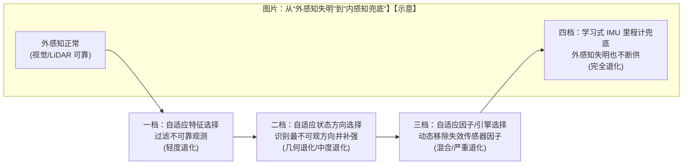

# Super Odometry：退化场景“自动升档”的分层自适应里程计 (Resilient Odometry via Hierarchical Adaptation)

> **发布时间**：2025  
> **论文题目**：Resilient odometry via hierarchical adaptation  
> **核心定位**：不是“更强融合”，而是**按退化程度动态换挡**：轻度退化先过滤不可靠观测，中度退化补强不可观方向，严重退化动态剔除失效因子，极端退化由**学习式 IMU 里程计**兜底接管。  
> **一句话 takeaway**：把里程计从“固定配方”变成“会自诊断、会降级、会兜底”的系统——外感知失明时，内感知保证轨迹不断供。

本文基于你提供的中文整理 + 项目主页公开信息撰写；涉及数字与结论以论文/项目页为准，未能核对处会明确标注 `TODO/待证`。

---

## 0. 退化到底意味着什么：不是“差一点”，而是“突然崩”

现实部署里，退化常见并且会叠加：

- **视觉退化**：低光、模糊、遮挡、强眩光、玻璃反光等。
- **几何退化**：长走廊/空旷区域导致约束不足（典型是“前进方向”不可观/弱可观）。
- **混合退化**：视觉与几何线索间歇性同时变差。
- **完全退化**：烟雾/极端条件导致视觉与 LiDAR 同时失效（外感知“失明”）。

关键工程事实是：里程计一旦进入失效链条，往往不是“漂一点”，而是**前端崩溃 → 后端被错误因子拖死 → 任务中断/安全事故**。

---

## 1. 核心架构/方法总览 (Overview / Architecture)

### 1.1 “自动升档”的四级结构（分层自适应）

把“退化→策略”写成一条梯子：

直觉上，它像“自动变速箱”：

- 先用**最便宜**的动作稳住系统（过滤坏观测）。
- 不够再上“更重但更稳”的动作（补强不可观方向、动态重构因子图）。
- 真不行就把主导权交给**内感知**（IMU 学习模型）兜底。

### 1.2 四个模块的职责（你应该如何理解它们）

| 模块 | 触发条件（直觉） | 它在做什么 | 风险/代价 |
|---|---|---|---|
| 自适应特征选择 | 视觉退化/局部特征不稳定 | 估计观测不确定性，优先保留更可信的特征 | 仍依赖外感知；退化过重时不够 |
| 自适应状态方向选择 | 走廊/空旷导致几何约束不足 | 识别“最虚”的状态方向（弱可观/不可观），在这些方向引入更可信先验/约束 | 需要正确识别退化方向；先验设置不当会引入偏差 |
| 自适应因子/引擎选择 | 多模态开始“互相拖死” | 动态移除失效或低贡献因子，避免错误信息持续放大 | 结构切换策略若生硬，会造成不连续/震荡 |
| 学习式 IMU 里程计 | 外感知几乎不可用 | 用学习到的运动先验持续输出位姿（内感知兜底） | 长时漂移不可避免；域偏移/在线适配策略决定上限 |

---

## 2. 数学核心：为什么“退化方向”会决定你会不会崩 (Math Core)

### 2.1 “哪一轴最虚”：从可观性直觉到可操作对象

在因子图/状态估计里，你可以把“信息量”抽象到一个信息矩阵（示意）：

$$
\mathbf{\Lambda} \approx \mathbf{J}^\top \mathbf{W}\mathbf{J}
$$

- \(\mathbf{J}\)：观测对状态的雅可比
- \(\mathbf{W}\)：观测权重/协方差的逆（质量越差，权重越小）

当环境进入几何退化（例如长走廊），会出现一种典型现象：

- 某些方向（常见是前进方向的平移、或某一转角）约束显著变弱  
  \(\Rightarrow\) \(\mathbf{\Lambda}\) 在对应方向的“信息”变小，协方差变大。

最简化地，你可以把“最虚的方向”理解为：

$$
v^*=\arg\min_{\|v\|=1} v^\top \mathbf{\Lambda}\, v
$$

也就是信息最小（不确定性最大）的方向。

**工程含义**：与其“平均用力融合”，不如**盯住最虚的那一轴**，在那一轴补上更可信的约束/先验，避免漂移沿着退化方向被放大，最终滑向崩溃。

### 2.2 “动态移除因子”为什么能救命

把后端目标写成加权最小二乘（示意）：

$$
\min_{\mathbf{x}} \sum_i \|r_i(\mathbf{x})\|_{\Sigma_i^{-1}}^2
$$

当某类传感器退化时，常见失败不是“它没贡献”，而是：

- 它产生**系统性错误残差**，并且错误被持续喂给后端  
  \(\Rightarrow\) 优化器被“错误强约束”拖偏甚至发散。

因此“自适应因子/引擎选择”的实质是：

- 识别 \(\Sigma_i\) 已不可信或残差统计异常的因子  
- 将其从优化里**降权/剔除**，让系统回到“较少但更可靠”的约束集

---

## 3. 带数字走一遍：为什么 4–5 m/s 的长走廊很刁钻 (Worked Example)

你给的材料里提到一个很典型的 stress test：

- “完全黑 + 结构贫乏 + 强反光”的长走廊
- 连续运行约 668 m
- 速度多数维持 4 m/s，最高约 5 m/s（来自材料口径，论文为准）

这个场景对传统 LiDAR 配准的刁钻点在于：

- 走廊几何重复/对称  
  \(\Rightarrow\) 扫描匹配在某些方向上容易出现“多个解释都差不多”的情况  
  \(\Rightarrow\) 对应方向的约束变弱（可观性下降）

这时“状态方向选择”的价值是把问题变成可执行动作：

- 先判断：哪一轴的置信度在掉（最虚方向）  
- 再补强：在该方向引入更可信的先验/约束（例如更依赖惯性/运动先验或其他可用模态）

**面试版一句话**：退化不是“加融合权重”能救的，关键是“找出不可观方向并补上约束”，否则漂移沿着退化方向会指数式变坏。

---

## 4. 工程视角：按需融合 vs 固定配方 (Engineering View)

### 4.1 为什么“升档”比“一次性强融合”更像产品化

固定配方的问题是：你永远在做最贵的事，但仍可能在最坏的场景崩。

分层机制的工程收益在于：

- **算力/延迟可控**：正常时跑低档位，退化时才升档（把重计算留给真正需要的时候）。
- **风险可控**：外感知坏了不会继续喂“毒数据”，而是主动降级/剔除/切换兜底。

### 4.2 “切换”比“算法”更决定部署体验

真正落地时，最难的常是两点：

- **何时切**：触发条件（退化检测、置信度估计）要稳定，否则会抖动。
- **怎么切**：硬切会造成不连续；更希望是“基于置信度的软切换/平滑融合”。

项目页也明确提到：更好的在线学习与切换策略仍是未来工作（见文末引用）。

---

## 5. 数据与评测 (Data & Eval)

从项目主页公开信息提炼的关键评测信号：

- **单次运行覆盖 13+ 种退化**：视觉/几何/混合/完全退化连续切换。
- **长距离连续跑**：总距离约 2966 m、约 46 分钟（腿式机器人），无回环优化下终点漂移约 0.2 m（项目页口径；以论文为准）。
- **学习式 IMU 训练数据**：跨平台多机器人数据累计 100+ 小时，并提到可进行较快在线适配（细节以论文为准）。

建议你在自己的系统里复刻的最小评测集合：

- **长走廊几何退化**：前进方向弱可观
- **黑暗/低纹理**：视觉退化
- **烟雾/粉尘**：外感知大面积失效
- **玻璃/强反光走廊**：反光导致视觉+激光同时不稳定（常见于真实商业空间）

---

## 6. 能力与失败模式 (Capabilities & Failure Modes)

### 6.1 它擅长什么

- **退化连续切换场景**：不是单点鲁棒，而是能“不断供”地跨阶段适配。
- **外感知失效时的兜底**：把 IMU 从“辅助项”提升到“可接管”的内感知支柱。
- **避免错误因子拖死后端**：动态剔除失效因子，减少发散概率。

### 6.2 可能怎么失败（以及为什么）

- **退化检测/置信度估计不可靠**：错误切换会导致系统抖动或进入错误档位。
- **IMU 兜底不可避免漂移**：兜底强调“稳与连续”，但长时准确性受限，需要外感知恢复后及时回收误差。
- **标定与时间同步是硬前提**：多传感器系统如果时间对齐差，退化时会被放大（与部署类文档的常识一致）。
- **域偏移与在线适配风险**：新平台/新动态模型若与训练分布差异大，IMU 学习模型可能需要更稳健的在线学习策略（项目页也将其列为限制/未来工作）。

---

## 7. 与相关路线对比 (Comparison)

| 路线 | 典型策略 | 退化时常见问题 | Super Odometry 的差异 |
|---|---|---|---|
| 固定融合（VIO/LIO/多传感器固定配方） | 融合结构不变，权重微调 | 退化时“错误信息”持续喂入，后端被拖死 | 结构可动态重构：可剔除失效因子、可升档兜底 |
| 纯 LiDAR 里程计 | 靠几何配准 | 走廊/空旷弱可观、反光/烟尘直接失效 | 退化时能切到内感知优先路径 |
| 纯 IMU/惯导 | 内感知连续 | 长时漂移累积快 | 作为极端兜底而非全程唯一来源；并强调外感知恢复后的回归 |

**面试 Tip（一句话）**：被问“退化场景如何保证里程计不断供”——不要只答“多传感器融合”，要答“**退化检测 + 可观性方向补强 + 动态因子图重构 + 学习式 IMU 兜底**”。

---

## 8. 局限与待证（来自项目页 + 工程常识）

项目主页给出的限制/未来工作（要点摘录）：

- **IMU 学习模型对新域仍需要更快适配**：训练/测试分布差异会影响泛化。
- **在线学习与自适应切换仍偏启发式**：需要更系统的策略，避免过拟合与灾难性遗忘。

本文额外补充两条部署视角的“常见硬约束”（需要你在系统里验证）：

- **时间同步/标定误差在退化场景会被放大**（建议与 `multimodal_data_synchronization.md` 一起读）。
- **兜底策略必须配合安全策略**：例如速度限制、碰撞缓冲、重定位/重建流程（本文未展开，TODO）。

---

## 参考链接

- 项目主页（含方法图/视频/引用信息）：`https://superodometry.com/`
- 代码（项目页入口）：`https://github.com/superxslam/SuperOdom`
- 论文 DOI（项目页给出）：`https://doi.org/10.1126/scirobotics.adv1818`
- 论文期刊页（项目页给出）：`https://www.science.org/doi/abs/10.1126/scirobotics.adv1818`
- 论文 PDF（项目页给出）：`https://www.science.org/doi/pdf/10.1126/scirobotics.adv1818`

---
[← Back to Perception Index](./README.md)

