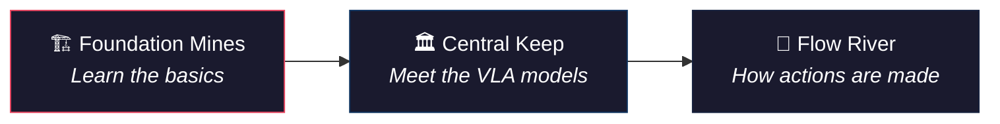
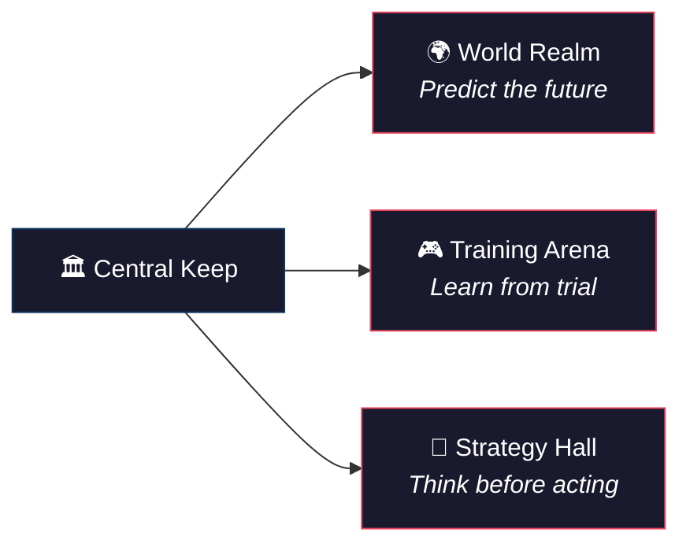
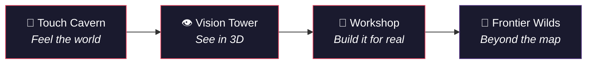

# 🗺️ VLA Theory — Explorer's Map

> *"The world of embodied AI is vast. Choose your path wisely."*
>
> **VLA（Vision-Language-Action）** 是让机器人"看懂世界、听懂指令、做出动作"的端到端模型。这个目录收录了 203 篇深度解析，覆盖从基础数学到前沿神经科学的完整光谱。下面的地图帮你找到最适合的起点。

```
                          ┌─────────────────────────────────┐
                          │         🔬 FRONTIER WILDS       │
                          │    Neuroscience · Cross-domain   │
                          │         (9 scrolls)              │
                          └──────────────┬──────────────────┘
                                         │
              ┌──────────────────────────┼──────────────────────────┐
              │                          │                          │
    ┌─────────┴─────────┐    ┌──────────┴──────────┐    ┌─────────┴─────────┐
    │  🔧 WORKSHOP      │    │  🧠 STRATEGY HALL   │    │  🤚 TOUCH CAVERN  │
    │  Sim2Real · HW    │    │  Planning · Safety   │    │  Tactile · Force  │
    │  (18 blueprints)  │    │  (27 war plans)      │    │  (21 relics)      │
    └─────────┬─────────┘    └──────────┬──────────┘    └─────────┬─────────┘
              │                          │                          │
              └──────────────────────────┼──────────────────────────┘
                                         │
         ┌───────────────┬───────────────┼───────────────┬───────────────┐
         │               │               │               │               │
  ┌──────┴──────┐ ┌──────┴──────┐ ┌──────┴──────┐ ┌──────┴──────┐ ┌──────┴──────┐
  │🌊 FLOW RIVER│ │🌍 WORLD    │ │🎮 TRAINING  │ │👁️ VISION   │ │🏗️ FOUNDATION│
  │ Diffusion   │ │  REALM     │ │   ARENA     │ │   TOWER    │ │   MINES    │
  │ Flow Match  │ │ World Model│ │ RL · Reward │ │ 3D · SLAM  │ │ Scale·Data │
  │ (12 spells) │ │(23 oracles)│ │ (15 trials) │ │(15 lenses) │ │(30 ores)   │
  └──────┬──────┘ └──────┬──────┘ └──────┬──────┘ └──────┬──────┘ └──────┬──────┘
         │               │               │               │               │
         └───────────────┴───────────────┼───────────────┴───────────────┘
                                         │
                              ┌──────────┴──────────┐
                              │   🏛️ CENTRAL KEEP   │
                              │  VLA Core · Models  │
                              │   (33 artifacts)    │
                              └──────────┬──────────┘
                                         │
                                    ⚔️ START
```

**读图方式**：从底部 ⚔️ START 出发，越往上越进阶。每个区域是一个研究主题，括号里是文章数量。区域之间有依赖关系——掌握下层才能理解上层。

---

## 🏛️ The Ten Zones

> 每个区域是一个独立的研究主题，有自己的核心问题和关键技术。

### [🏛️ Central Keep — VLA 核心架构](vla-core/) `33 artifacts`

**核心问题**：怎么把"看到的画面"和"听到的指令"变成"机器人的动作"？

这是整个地图的起点。收录了所有主流 VLA 模型的深度解析：Physical Intelligence 的 **π0** 系列（从 π0 到 π0.6）、Google DeepMind 的 **RT** 系列、NVIDIA 的 **GR00T**、Tony Zhao 的 **ACT** 等。如果你只读一个区域，读这个。

**入口文章**：[VLA 核心架构总览](vla-core/vla_arch.md) — 一张图看懂所有 VLA 的共同设计模式

---

### [🌊 Flow River — 扩散与 Flow Matching](diffusion-flow/) `12 spells`

**核心问题**：机器人的动作序列应该怎么"生成"出来？

VLA 模型的最后一步不是分类或回归，而是**生成**——像画画一样，从噪声中逐步"去噪"出一条动作轨迹。这里解析了两大技术路线：**Diffusion Policy**（从图像生成借来的扩散模型）和 **Flow Matching**（π0 使用的更高效替代方案），以及它们在 VLA 中的具体实现。

**入口文章**：[Diffusion Policy 详解](diffusion-flow/diffusion_policy.md) — 从 DDPM 到机器人：为什么"去噪"能生成动作

---

### [🌍 World Realm — 世界模型](world-model/) `23 oracles`

**核心问题**：机器人能不能在脑子里"模拟"行动的后果，然后再决定怎么做？

人类做事之前会"想象"结果——倒水会洒、推门会开。世界模型让机器人也拥有这种能力：用视频预测未来帧，在"心理仿真"中试错，而不需要真的去碰。这里覆盖了从 **DreamZero**（世界动作模型 = 零样本策略）到 **EgoSim**（第一人称闭环世界模拟器）的最新进展。

**入口文章**：[World Model 主线总纲](world-model/world_model_mainline.md) — 从 evaluator 到 planner，再到 world action model 的演进路线

---

### [🎮 Training Arena — 强化学习](rl/) `15 trials`

**核心问题**：VLA 模型学完模仿之后，怎么通过"试错"变得更强？

模仿学习（SFT）让机器人学会基本动作，但要超越示范者，需要 RL 微调。这个区域解析了 VLA 专用的 RL 技术：如何设计奖励函数、如何在真实机器人上安全地做在线 RL、如何用 offline RL 利用已有数据。**GR-RL** 和 **VLA-OPD** 是两个具代表性的案例研究。

**入口文章**：[强化学习基础](rl/reinforcement_learning.md) → [VLA+RL 实战教程](rl/vla_rl_practical_guide.md)

---

### [🤚 Touch Cavern — 触觉感知](tactile/) `21 relics`

**核心问题**：光靠"看"够吗？机器人需不需要"摸"？

当机器人需要判断握力大小、检测物体滑动、操作柔软物体时，视觉不够用——需要触觉。这里是 VLA 研究中最"硬件化"的区域，从触觉传感器（TacMamba、GenForce）到力-视觉融合策略（FAVLA、OmniVTA），系统性地解析了怎么让机器人"用手指感受世界"。

**入口文章**：[触觉感知与 VLA](tactile/tactile_vla.md) — 为什么触觉是 VLA 的"最后一公里"

---

### [👁️ Vision Tower — 视觉与 3D 感知](perception/) `15 lenses`

**核心问题**：机器人怎么"看懂"三维世界？

VLA 的 "V" 代表 Vision，但视觉远不止"看图识物"。机器人需要理解深度、构建点云地图（SLAM）、从单张图推断 3D 结构、在动态场景中跟踪物体。这里收录了从 Flash Attention（让视觉模型更快）到 Zero-1-to-3（单图生成 3D）的感知技术栈。

**入口文章**：[视觉与多模态感知技术](perception/perception_techniques.md) — VLA 的"眼睛"是怎么工作的

---

### [🧠 Strategy Hall — 推理、规划与安全](planning/) `27 war plans`

**核心问题**：机器人怎么"想清楚再行动"，而且不伤害人？

这是 VLA 研究中最"认知科学"的区域。涵盖三大主题：**推理**（思维链 CoT、GenieReasoner）、**规划**（运动规划、长程任务分解）、**安全**（对齐约束、对抗攻击防御、不确定性感知）。Benchmark 论文（BEHAVIOR-1K、IS-Bench）也在这里，因为它们定义了"什么才算智能"。

**入口文章**：[思维链推理](planning/chain_of_thought.md) — 让 VLA 先"想"再"做"

---

### [🏗️ Foundation Mines — 基础理论与训练](foundation/) `30 ores`

**核心问题**：VLA 模型的底层"工具箱"有什么？

如果其他区域是"用工具做事"，这里就是"造工具"。收录了所有跨领域通用的 ML 基础技术：LoRA/DoRA 微调、知识蒸馏、量化推理、自监督学习、KV Cache 优化。还有 VLA 专用的损失函数手册和数学入门。**不需要按顺序读**——当你在其他区域遇到"这个技术是什么？"时，回来查。

**入口文章**：[VLA 数学必备](foundation/math_for_vla.md) — 从直觉到实作

---

### [🔧 Workshop — 部署与硬件](deployment/) `18 blueprints`

**核心问题**：研究做出来的模型，怎么放到真实机器人上跑？

从仿真到真实（Sim2Real）是 VLA 落地的最大鸿沟。这里解析了灵巧手机械学、抓取算法、仿真平台（Isaac Lab）、零样本跨本体部署（RDT2-UMI），以及产业界的视角（NVIDIA Physical AI、Physical Intelligence Layer）。

**入口文章**：[机械臂控制](deployment/robot_control.md) — 运动学、动力学与控制的工程入门

---

### [🔬 Frontier Wilds — 前沿与跨域](frontier/) `9 scrolls`

**核心问题**：VLA 的灵感还可以从哪里来？

这是地图边缘的未探索地带。收录了跨领域的灵感来源：鸽子的磁感导航机制（神经科学 → 具身感知）、皮层下行为控制（认知科学 → 机器人本能反射）、GNN 基线（图论 → 结构化推理）、Physics of AI（物理学 → 神经网络理论）。没有固定的阅读顺序——跟随你的好奇心。

---

## 🎭 Choose Your Class

> *Every adventurer has a background. Yours shapes the fastest path through the map.*

| Class | Background | Recommended Start | Superpower | Weakness |
|:-----:|-----------|-------------------|-----------|----------|
| 🧙 **Mage** | ML/DL researcher | Foundation → Central Keep | 你已经知道 Transformer 和 loss function | 可能低估硬件和物理约束 |
| 📖 **Scholar** | NLP / LLM 从业者 | Central Keep → Strategy Hall | VLA 的"Language"部分对你来说是母语 | "Action"和"3D"是新世界 |
| ⚙️ **Engineer** | 机器人/控制工程师 | Workshop → Central Keep | 你知道真实机器人的物理限制 | 可能不熟悉 Diffusion 等生成模型 |
| 🎨 **Artist** | CV / 视觉研究者 | Vision Tower → Flow River | 你理解 image generation 的 backbone | 需要补上 action space 和 RL |
| 🗡️ **Warrior** | 学生 / 新手 | Foundation (Step 1) → 按顺序走 | 没有包袱，可以系统性学习 | 需要多花时间在数学基础 |

---

## ⚔️ Quest Lines

### 🟢 Beginner — "First Steps in VLA"

> *你听说过"让机器人听懂话、看懂世界、自己动手"，想知道这到底怎么实现。*



| Step | Zone | Start With | What You'll Learn |
|:----:|------|-----------|-------------------|
| 1 | [🏗️ Foundation](foundation/) | [VLA 数学必备](foundation/math_for_vla.md) / [Loss Functions](foundation/vla_loss_functions_handbook.md) | 张量、旋转矩阵、训练目标——VLA 的数学语言 |
| 2 | [🏛️ Central Keep](vla-core/) | [VLA 核心架构](vla-core/vla_arch.md) / [研究主线](vla-core/vla_research_mainline.md) | 从 ACT/DP 基线到 π0：VLA 模型长什么样、为什么这么设计 |
| 3 | [🌊 Flow River](diffusion-flow/) | [Diffusion Policy](diffusion-flow/diffusion_policy.md) / [动作生成](diffusion-flow/action_representations.md) | 扩散模型怎么"画出"机器人动作、Flow Matching 为什么更快 |

**通关标准**：能看懂 π0 的论文，理解"VLM backbone + action head + diffusion denoising"的基本架构。

---

### 🟡 Intermediate — "The Model Architect"

> *你理解了 VLA 的基本架构，现在想知道怎么让它"更聪明"——预测未来、从试错中学习、安全地规划。*



| Step | Zone | Start With | What You'll Learn |
|:----:|------|-----------|-------------------|
| 4 | [🌍 World Realm](world-model/) | [World Model 主线](world-model/world_model_mainline.md) / [DreamZero](world-model/dreamzero_world_action_models_zero_shot_policies_2026.md) | "在脑中模拟"：世界模型如何让机器人不用真的试错就能做决策 |
| 5 | [🎮 Training Arena](rl/) | [强化学习基础](rl/reinforcement_learning.md) / [VLA+RL 实战](rl/vla_rl_practical_guide.md) | 模仿学习的天花板在哪、RL 微调怎么突破它、奖励函数怎么设计 |
| 6 | [🧠 Strategy Hall](planning/) | [思维链](planning/chain_of_thought.md) / [运动规划](planning/motion_planning.md) | 让机器人"先想再做"：CoT 推理、安全约束、长程任务分解 |

**这三条路可以并行探索**——它们是 VLA 的三个独立进化方向，选你最感兴趣的先读。

---

### 🔴 Advanced — "The Embodied Master"

> *你想让机器人"用手指感受世界"、把模型部署到真实硬件上、或者从神经科学中找灵感。*



| Step | Zone | Start With | What You'll Learn |
|:----:|------|-----------|-------------------|
| 7 | [🤚 Touch Cavern](tactile/) | [触觉 VLA](tactile/tactile_vla.md) | 触觉传感器原理、力-视觉融合、为什么"光看不够" |
| 8 | [👁️ Vision Tower](perception/) | [视觉感知技术](perception/perception_techniques.md) / [点云SLAM](perception/pointcloud_slam.md) | 3D 重建、深度估计、空间理解——机器人的"立体视觉" |
| 9 | [🔧 Workshop](deployment/) | [机械臂控制](deployment/robot_control.md) / [Isaac Lab](deployment/isaac_lab.md) | Sim2Real 落地、灵巧手硬件选型、仿真平台搭建 |
| 10 | [🔬 Frontier Wilds](frontier/) | Pick any scroll | 鸽子导航 → 具身感知、皮层下反射 → 机器人本能、AI 的物理学 |

---

## 🗂️ Zone Directory

| Zone | Articles | Theme | Boss Monster (hardest read) | Drop Item (key takeaway) |
|------|:--------:|-------|---------------------------|-----------------------|
| [🏛️ Central Keep](vla-core/) | 33 | VLA 架构与模型 | [π0.6 解剖](vla-core/pi0_6_dissection.md) | VLA = VLM + Action Head |
| [🏗️ Foundation](foundation/) | 30 | 基础理论与训练 | [DCP 凸优化](foundation/dcp_convexity_rules.md) | 工具箱，按需查阅 |
| [🧠 Strategy Hall](planning/) | 27 | 推理、规划与安全 | [BEHAVIOR-1K](planning/behavior_1k_human_centered_embodied_ai_benchmark_omnigibson_2024.md) | 先想再做，安全第一 |
| [🌍 World Realm](world-model/) | 23 | 世界模型与仿真 | [Simulation Distillation](world-model/simulation_distillation_pretraining_world_models_in_simulati_dissection.md) | 在脑中模拟，不试错 |
| [🤚 Touch Cavern](tactile/) | 21 | 触觉感知 | [OmniVTA](tactile/omnivta_visuo_tactile_world_modeling_for_contact_rich_roboti_dissection.md) | 光看不够，要摸 |
| [🔧 Workshop](deployment/) | 18 | 部署与硬件 | [House of Dextra](deployment/house_of_dextra_cross_embodied_co_design_for_dexterous_hands_dissection.md) | Sim2Real 是最后一公里 |
| [👁️ Vision Tower](perception/) | 15 | 视觉与 3D | [DVGT-2](perception/dvgt_2_vision_geometry_action_model_for_autonomous_driving_a_dissection.md) | 3D 理解是空间智能的基础 |
| [🎮 Training Arena](rl/) | 15 | 强化学习 | [GigaBrain-0.5M*](rl/gigabrain_0_5m_star_world_model_based_rl_ramp_2026.md) | RL 让 VLA 超越人类示范 |
| [🌊 Flow River](diffusion-flow/) | 12 | 扩散与 Flow | [Compression Gap](diffusion-flow/the_compression_gap_why_discrete_tokenization_limits_vision_dissection.md) | 动作是"生成"的，不是"预测"的 |
| [🔬 Frontier Wilds](frontier/) | 9 | 前沿与跨域 | [Physics of AI](frontier/physics_of_ai_liuziming.md) | 灵感无边界 |

---

## 🧭 Special Quests

### ⚡ Speed Run — "I just want to build a VLA"

> 5 篇文章，从零到能跑代码。

[VLA 核心架构](vla-core/vla_arch.md) → [π0 代码解析](vla-core/pi0_code_analysis.md) → [Diffusion Policy](diffusion-flow/diffusion_policy.md) → [VLA+RL 实战](rl/vla_rl_practical_guide.md) → [Isaac Lab](deployment/isaac_lab.md)

### 🔍 Lore Run — "I want to understand the theory deeply"

> 5 篇文章，建立完整的理论框架。

[数学基础](foundation/math_for_vla.md) → [Loss Functions](foundation/vla_loss_functions_handbook.md) → [World Model 总纲](world-model/world_model_mainline.md) → [思维链](planning/chain_of_thought.md) → [VLA 十大挑战](planning/vla_challenges.md)

### 🤖 Hardware Run — "I want to make a robot touch things"

> 4 篇文章，从传感器选型到仿真验证。

[触觉 VLA](tactile/tactile_vla.md) → [灵巧手机械学](deployment/dexterous_hand_mechanics.md) → [抓取算法](deployment/grasp_algorithms.md) → [Sim2Real HOI](deployment/pam_a_pose_appearance_motion_engine_for_sim_to_real_hoi_vide_dissection.md)

### 🧬 Crossover Run — "I come from another field"

> 从你的领域出发，看 VLA 借鉴了什么。

**NLP/LLM 背景**：[VLA 核心架构](vla-core/vla_arch.md)（VLA 就是 LLM + 眼睛 + 手）→ [思维链](planning/chain_of_thought.md)（CoT 在机器人里怎么用）→ [Compression Gap](diffusion-flow/the_compression_gap_why_discrete_tokenization_limits_vision_dissection.md)（为什么不能直接用 token 做动作）

**CV 背景**：[视觉感知技术](perception/perception_techniques.md) → [点云 SLAM](perception/pointcloud_slam.md) → [World Model 总纲](world-model/world_model_mainline.md)（视频生成 → 世界模型）

**控制/机器人背景**：[机械臂控制](deployment/robot_control.md)（你已经知道的）→ [动作生成](diffusion-flow/action_representations.md)（VLA 怎么替代传统控制）→ [VLA+RL 实战](rl/vla_rl_practical_guide.md)（RL 怎么补上 gap）

---

## 🏆 Achievements

> *解锁条件：读完对应文章并能向队友解释核心思想。*

| Badge | Name | Condition |
|:-----:|------|-----------|
| 🥉 | **First Blood** | 读完任意 1 篇 theory 文章 |
| 🎓 | **Orientation Complete** | 完成 Beginner Quest Line (3 篇) |
| 🏅 | **Triple Threat** | 完成 World Realm + Training Arena + Strategy Hall 各 1 篇 |
| 💎 | **Full Clear** | 每个 Zone 至少读 1 篇 |
| 🐉 | **Boss Hunter** | 读完 3 个 Zone 的 Boss Monster |
| ⚡ | **Speed Runner** | 完成 Speed Run Quest (5 篇) |
| 🧬 | **Cross-Pollinator** | 读完 Frontier Wilds 的 3 篇跨域文章 |
| 👑 | **Embodied Master** | 完成全部 3 条 Quest Lines (10 steps) |
| 🌟 | **Cartographer** | 读完 50+ 篇并能画出自己的领域地图 |

---

## 💡 Lore Notes

> *冒险者们在旅途中留下的笔记。*

<details>
<summary>🔮 为什么 VLA 用 Diffusion 而不是直接输出坐标？</summary>

机器人动作是**多模态**的——同一个任务可能有多种正确做法（从左边绕过去或从右边绕过去）。如果用 MSE 回归，模型会输出"两条路的平均值"——撞上去。Diffusion/Flow Matching 能建模多峰分布，生成**其中一条**合理路径。
→ 详见 [Diffusion Policy](diffusion-flow/diffusion_policy.md) 和 [Compression Gap](diffusion-flow/the_compression_gap_why_discrete_tokenization_limits_vision_dissection.md)
</details>

<details>
<summary>🔮 World Model 和 VLA 的关系是什么？</summary>

把 VLA 想象成"反射弧"——看到 → 做出。World Model 则是"大脑皮层"——看到 → 想象 → 预测 → 再做出。两者可以独立使用，也可以组合：World Model 当规划器，VLA 当执行器。DreamZero 证明了**纯 World Model 也能零样本做策略**。
→ 详见 [World Model 总纲](world-model/world_model_mainline.md)
</details>

<details>
<summary>🔮 为什么触觉对机器人这么重要？</summary>

人类闭上眼睛也能系鞋带——因为手指的触觉提供了足够的信息。当机器人需要操作柔软、透明、或遮挡的物体时（倒水、剥皮、拧螺丝），视觉信号不够。触觉传感器提供接触力、滑动检测、形状估计——这是机器人操作的"最后一公里"。
→ 详见 [触觉 VLA](tactile/tactile_vla.md)
</details>

<details>
<summary>🔮 Sim2Real 为什么这么难？</summary>

仿真器里的物理是理想化的——没有摩擦力误差、传感器噪声、执行器延迟。在仿真里成功率 95% 的策略，到了真机可能只有 30%。这个 gap 叫 "Reality Gap"。Workshop 区域的文章讲了各种弥合方法：domain randomization、system identification、progressive transfer。
→ 详见 [Isaac Lab](deployment/isaac_lab.md) 和 [House of Dextra](deployment/house_of_dextra_cross_embodied_co_design_for_dexterous_hands_dissection.md)
</details>

---

<details>
<summary>📊 Stats & Meta</summary>

- **Total scrolls**: 203 articles across 10 zones
- **Auto-classified** by [Pulsar](https://github.com/sou350121/Pulsar-KenVersion) pipeline using 15 method-family keywords
- **Updated**: New articles added daily by automated deep dive system
- **Explore online**: [VLA Deep Dive](https://sou350121.github.io/pulsar-web/vla-deepdive/) — with sparklines, method family trends, and SOTA leaderboards
- **Structure**: Reorganized 2026-04-08 from flat 212 files → 10 thematic directories

</details>
