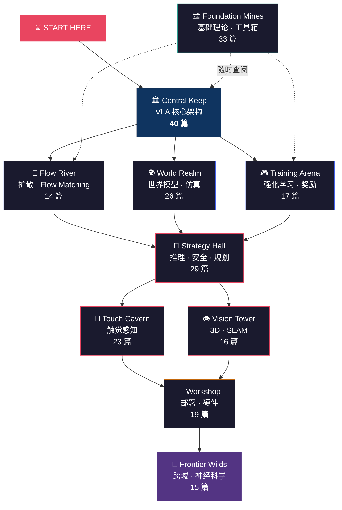

# 🗺️ VLA Theory — Explorer's Map

> **VLA（Vision-Language-Action）** 让机器人"看懂世界、听懂指令、做出动作"。
> 这里有 **232 篇深度解析**，是中文世界最完整的 VLA 理论库。
>
> 不知道从哪开始？先选你的角色 ↓

&nbsp;

## 🎭 你是谁？

| | 角色 | 你的背景 | 👉 推荐起点 |
|:---:|------|---------|-----------|
| 🧙 | **ML 研究者** | 熟悉 Transformer、训练流程 | → [VLA 核心架构](vla-core/vla_arch.md)，直接看模型怎么拼 |
| 📖 | **LLM 从业者** | 做过 ChatGPT / Agent 相关 | → [研究主线](vla-core/vla_research_mainline.md)，VLA 就是"LLM 长了手" |
| ⚙️ | **机器人工程师** | 写过 ROS、调过 PID | → [VLA+RL 实战](rl/vla_rl_practical_guide.md)，从你熟悉的地方切入 |
| 🗡️ | **学生 / 新手** | 刚开始接触 | → [VLA 数学必备](foundation/math_for_vla.md)，打好地基再盖楼 |

&nbsp;

---

&nbsp;

## 🌍 世界地图



> **读图方式**：实线 = 建议学习顺序。虚线 = Foundation 是工具箱，遇到不懂的概念随时回来查。

&nbsp;

---

&nbsp;

## 🏛️ 十大区域

&nbsp;

<details open>
<summary><h3>🏛️ Central Keep — VLA 核心架构 &nbsp;<code>39 篇</code></h3></summary>

**一句话**：所有 VLA 模型的"解剖室"。

VLA 的核心思想很简单：拿一个视觉语言模型（VLM），给它装上"手"——一个动作生成头（Action Head）。但魔鬼在细节：怎么编码动作？怎么处理多帧输入？怎么让模型既能聊天又能操作？

这里收录了所有你听过名字的 VLA 模型：Physical Intelligence 的 **π0 系列**、Google 的 **RT 系列**、NVIDIA 的 **GR00T**、Tony Zhao 的 **ACT**、Unitree 的 **UnifoLM-VLA** 等。

| 推荐入口 | 说明 |
|---------|------|
| [VLA 核心架构总览](vla-core/vla_arch.md) | 一篇看完所有 VLA 的共同设计模式 |
| [π0 代码深度解析](vla-core/pi0_code_analysis.md) | 跟着代码理解 Flow Matching VLA |
| [研究主线梳理](vla-core/vla_research_mainline.md) | 从 ACT/DP 到 π0：历史脉络 |

</details>

&nbsp;

<details>
<summary><h3>🌊 Flow River — 扩散策略与 Flow Matching &nbsp;<code>14 篇</code></h3></summary>

**一句话**：机器人的动作是"画"出来的，不是"算"出来的。

为什么不能让模型直接输出一个坐标？因为同一个任务往往有多条正确路径——从左边绕和从右边绕都行。如果用回归，模型会输出两条路的平均值（撞上去）。**Diffusion Policy** 从图像生成领域借来了去噪扩散模型，能从噪声中"画"出一条合理的动作轨迹。**Flow Matching**（π0 采用的方案）则更快更稳。

| 推荐入口 | 说明 |
|---------|------|
| [**主线总纲**](diffusion-flow/diffusion_flow_mainline.md) | 动作生成的完整研究地图 |
| [Diffusion Policy 详解](diffusion-flow/diffusion_policy.md) | 从 DDPM 到机器人动作生成 |
| [动作生成范式详解](diffusion-flow/action_representations.md) | 离散 vs 连续、分块 vs 流式 |

</details>

&nbsp;

<details>
<summary><h3>🌍 World Realm — 世界模型与仿真 &nbsp;<code>26 篇</code></h3></summary>

**一句话**：让机器人在"脑子里"先试一遍，再决定怎么做。

人类做事之前会想象后果——倒水会洒、推门会开。世界模型（World Model）让机器人也有这种能力：用视频预测未来画面，在"心理仿真"中试错。**DreamZero** 甚至证明了纯世界模型就能直接当策略用，不需要额外的 policy 网络。

| 推荐入口 | 说明 |
|---------|------|
| [**主线总纲**](world-model/world_model_mainline.md) | 从 evaluator 到 planner 到 world action model |
| [DreamZero](world-model/dreamzero_world_action_models_zero_shot_policies_2026.md) | 世界模型 = 零样本策略 |
| [EgoSim](world-model/egosim_egocentric_world_simulator_for_embodied_interaction_g_dissection.md) | 第一人称闭环世界模拟器 |

</details>

&nbsp;

<details>
<summary><h3>🎮 Training Arena — 强化学习 &nbsp;<code>17 篇</code></h3></summary>

**一句话**：模仿学习有天花板，RL 帮 VLA 突破它。

模仿学习（SFT）让机器人学会"像人一样做"，但不会比示范者更好。强化学习（RL）通过试错和奖励信号，让模型发现人类没想到的更优策略。难点在于：真实机器人上做 RL 很贵（每次试错都可能摔坏），奖励函数很难设计（什么算"做得好"？）。

| 推荐入口 | 说明 |
|---------|------|
| [**主线总纲**](rl/rl_mainline.md) | RL for VLA 的完整研究地图 |
| [强化学习基础](rl/reinforcement_learning.md) | RL 的核心概念和 VLA 特有的挑战 |
| [VLA+RL 实战教程](rl/vla_rl_practical_guide.md) | 架构选型、算法选择、工具链搭建 |
| [π0.6 / RECAP](rl/pi0_6_recap_rl_as_supervised_learning.md) | 披着 RL 外衣的 Supervised Learning？ |

</details>

&nbsp;

<details>
<summary><h3>🤚 Touch Cavern — 触觉感知 &nbsp;<code>23 篇</code></h3></summary>

**一句话**：闭上眼睛你也能系鞋带——因为手指在"看"。

视觉能告诉机器人"杯子在哪"，但不能告诉它"握多紧才不会捏碎"。触觉传感器弥补了这个缺口：检测接触力、滑动、形状。从传感器硬件（TacMamba、GenForce）到力-视觉融合策略（FAVLA、OmniVTA），这里系统性地解析了触觉如何让 VLA 完成"光看不够"的任务。

| 推荐入口 | 说明 |
|---------|------|
| [**主线总纲**](tactile/tactile_mainline.md) | 触觉研究的完整地图 |
| [触觉感知与 VLA](tactile/tactile_vla.md) | 为什么触觉是 VLA 的"最后一公里" |

</details>

&nbsp;

<details>
<summary><h3>👁️ Vision Tower — 视觉与 3D 感知 &nbsp;<code>17 篇</code></h3></summary>

**一句话**：机器人的"眼睛"不只是拍照——要理解深度、空间和运动。

VLA 的 V 代表 Vision，但机器人视觉远不止图像分类。需要从 2D 图像推断 3D 结构、在动态场景中建图定位（SLAM）、跟踪移动物体、估计自身位姿。这些能力决定了机器人能不能在真实世界中"不迷路、不撞墙"。

| 推荐入口 | 说明 |
|---------|------|
| [**主线总纲**](perception/perception_mainline.md) | 感知研究的完整地图 |
| [视觉与多模态感知](perception/perception_techniques.md) | VLA 的眼睛怎么工作 |

</details>

&nbsp;

<details>
<summary><h3>🧠 Strategy Hall — 推理、规划与安全 &nbsp;<code>29 篇</code></h3></summary>

**一句话**：让机器人"先想再做"，而且不伤害人。

三大主题交织在这里：**推理**（思维链 CoT——让 VLA 输出中间推理步骤）、**规划**（把"做一顿饭"分解成"开冰箱→拿鸡蛋→打蛋→开火"）、**安全**（机器人在厨房拿刀时怎么确保不伤人）。Benchmark 论文也在这里，因为它们定义了"什么才算智能"。

| 推荐入口 | 说明 |
|---------|------|
| [Benchmark 主线](planning/benchmark_mainline.md) | 评测体系的演进 |
| [思维链推理](planning/chain_of_thought.md) | 让 VLA 先"想清楚"再动手 |
| [VLA 十大挑战](planning/vla_challenges.md) | 目前还没解决的 10 个难题 |

</details>

&nbsp;

<details>
<summary><h3>🏗️ Foundation Mines — 基础理论 &nbsp;<code>32 篇</code></h3></summary>

**一句话**：不按顺序读——当你在其他区域遇到"这是什么？"时，回来查。

这是一个**工具箱**，不是教科书。收录了 VLA 背后的通用 ML 技术：LoRA/DoRA 高效微调、知识蒸馏、量化推理、KV Cache 优化、自监督学习。还有 VLA 专用的损失函数手册和数学入门。

| 推荐入口 | 说明 |
|---------|------|
| [**主线总纲**](foundation/foundation_mainline.md) | 基础技术工具箱地图 |
| [VLA 数学必备](foundation/math_for_vla.md) | 张量、旋转矩阵、SE(3)——VLA 的数学语言 |
| [Loss Functions 手册](foundation/vla_loss_functions_handbook.md) | 每种训练目标的直觉解释 |

</details>

&nbsp;

<details>
<summary><h3>🔧 Workshop — 部署与硬件 &nbsp;<code>19 篇</code></h3></summary>

**一句话**：仿真里成功率 95% 的模型，到真机上可能只有 30%。

这个 gap 叫 **Reality Gap**，是 VLA 落地的最大障碍。仿真器的物理是理想化的——没有摩擦力误差、传感器噪声、执行器延迟。这里解析了各种弥合方法（Domain Randomization、System Identification），以及灵巧手机械学、仿真平台（Isaac Lab）和产业界的部署经验。

| 推荐入口 | 说明 |
|---------|------|
| [**主线总纲**](deployment/deployment_mainline.md) | 部署与硬件的完整地图 |
| [机械臂控制](deployment/robot_control.md) | 运动学、动力学与控制的工程入门 |
| [Isaac Lab](deployment/isaac_lab.md) | NVIDIA 的 GPU 加速仿真平台 |

</details>

&nbsp;

<details>
<summary><h3>🔬 Frontier Wilds — 前沿与跨域 &nbsp;<code>11 篇</code></h3></summary>

**一句话**：VLA 的下一步灵感，可能来自鸽子的内耳。

地图边缘的未探索地带。鸽子用内耳前庭系统感应地磁场（→ 机器人导航）、皮层下神经回路控制本能行为（→ 机器人反射机制）、Physics of AI 把神经网络当物理系统研究（→ 理论突破的方向）。没有固定顺序——跟随好奇心。

| 推荐入口 | 说明 |
|---------|------|
| [**主线总纲**](frontier/frontier_mainline.md) | 跨域灵感的完整地图 |
| [Physics of AI](frontier/physics_of_ai_liuziming.md) | 不赌规模，把神经网络当物理系统 |

</details>

&nbsp;

---

&nbsp;

## ⚡ Speed Runs

> *没时间读 203 篇？选一条最短路线。*

&nbsp;

### 🏃 "我就想跑通一个 VLA"（5 篇）

```
VLA 架构总览 → π0 代码解析 → Diffusion Policy → VLA+RL 实战 → Isaac Lab
```

[开始 →](vla-core/vla_arch.md)

&nbsp;

### 🎓 "我想搞懂原理"（5 篇）

```
VLA 数学 → Loss Functions → World Model 总纲 → 思维链 → VLA 十大挑战
```

[开始 →](foundation/math_for_vla.md)

&nbsp;

### 🤖 "我要做触觉操作"（4 篇）

```
触觉 VLA → 灵巧手机械学 → 抓取算法 → Sim2Real
```

[开始 →](tactile/tactile_vla.md)

&nbsp;

### 🧬 "我从其他领域来"

**NLP / LLM →** [VLA 架构](vla-core/vla_arch.md)（VLA 就是 LLM + 手）→ [Compression Gap](diffusion-flow/the_compression_gap_why_discrete_tokenization_limits_vision_dissection.md)（为什么不能用 token 做动作）

**CV →** [视觉感知](perception/perception_techniques.md) → [World Model](world-model/world_model_mainline.md)（视频生成 → 世界模型）

**控制 →** [机械臂控制](deployment/robot_control.md)（你已知的）→ [动作生成](diffusion-flow/action_representations.md)（VLA 怎么替代传统控制）

&nbsp;

---

&nbsp;

## 🏆 Achievements

读完一篇就算解锁。看看你能拿几个？

| | 成就 | 解锁条件 |
|:---:|------|---------|
| 🥉 | **First Blood** | 读完任意 1 篇 |
| 🎓 | **Orientation** | 读完 VLA 架构 + Diffusion Policy + 数学入门 |
| 💎 | **Full Map** | 10 个区域各读至少 1 篇 |
| 🐉 | **Boss Hunter** | 读完 3 篇 "最难"文章（见下表） |
| ⚡ | **Speed Runner** | 完成任意一条 Speed Run |
| 👑 | **Embodied Master** | 10 个区域各读 3+ 篇 |

<details>
<summary>🐉 Boss Monsters（每区最硬的一篇）</summary>

| Zone | Boss | Why It's Hard |
|------|------|---------------|
| 🏛️ Central Keep | [π0.6 解剖](vla-core/pi0_6_dissection.md) | RECAP RL + 双系统架构 |
| 🌊 Flow River | [Compression Gap](diffusion-flow/the_compression_gap_why_discrete_tokenization_limits_vision_dissection.md) | 信息论 + VLA scaling 的深层矛盾 |
| 🌍 World Realm | [Simulation Distillation](world-model/simulation_distillation_pretraining_world_models_in_simulati_dissection.md) | 仿真→真实的世界模型蒸馏 |
| 🎮 Training Arena | [GigaBrain-0.5M*](rl/gigabrain_0_5m_star_world_model_based_rl_ramp_2026.md) | 世界模型原生 RL |
| 🤚 Touch Cavern | [OmniVTA](tactile/omnivta_visuo_tactile_world_modeling_for_contact_rich_roboti_dissection.md) | 视触觉世界模型 |
| 🧠 Strategy Hall | [BEHAVIOR-1K](planning/behavior_1k_human_centered_embodied_ai_benchmark_omnigibson_2024.md) | 1000 任务 benchmark |
| 🏗️ Foundation | [DCP 凸优化](foundation/dcp_convexity_rules.md) | 纯数学，但非常实用 |
| 👁️ Vision Tower | [DVGT-2](perception/dvgt_2_vision_geometry_action_model_for_autonomous_driving_a_dissection.md) | 几何感知的自动驾驶新范式 |
| 🔧 Workshop | [House of Dextra](deployment/house_of_dextra_cross_embodied_co_design_for_dexterous_hands_dissection.md) | 灵巧手形态-控制协同设计 |
| 🔬 Frontier | [Physics of AI](frontier/physics_of_ai_liuziming.md) | 用统计力学理解神经网络 |

</details>

&nbsp;

---

&nbsp;

<details>
<summary>📊 Stats</summary>

&nbsp;

**232** articles · **10** zones · Auto-classified by [Pulsar](https://github.com/sou350121/Pulsar-KenVersion) using 15 method-family keywords

New articles added daily. Explore with sparklines and trends at [VLA Deep Dive](https://sou350121.github.io/pulsar-web/vla-deepdive/).

</details>
