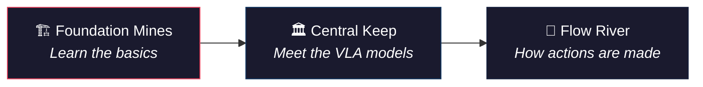
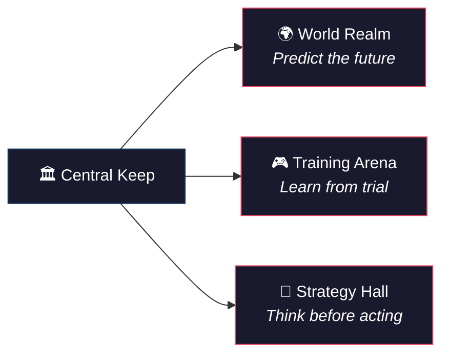
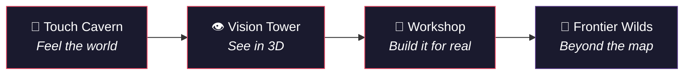

# 🗺️ VLA Theory — Explorer's Map

> *"The world of embodied AI is vast. Choose your path wisely."*

```
                          ┌─────────────────────────────────┐
                          │         🔬 FRONTIER WILDS       │
                          │    Neuroscience · Cross-domain   │
                          │         (9 scrolls)              │
                          └──────────────┬──────────────────┘
                                         │
              ┌──────────────────────────┼──────────────────────────┐
              │                          │                          │
    ┌─────────┴─────────┐    ┌──────────┴──────────┐    ┌─────────┴─────────┐
    │  🔧 WORKSHOP      │    │  🧠 STRATEGY HALL   │    │  🤚 TOUCH CAVERN  │
    │  Sim2Real · HW    │    │  Planning · Safety   │    │  Tactile · Force  │
    │  (18 blueprints)  │    │  (27 war plans)      │    │  (21 relics)      │
    └─────────┬─────────┘    └──────────┬──────────┘    └─────────┬─────────┘
              │                          │                          │
              └──────────────────────────┼──────────────────────────┘
                                         │
         ┌───────────────┬───────────────┼───────────────┬───────────────┐
         │               │               │               │               │
  ┌──────┴──────┐ ┌──────┴──────┐ ┌──────┴──────┐ ┌──────┴──────┐ ┌──────┴──────┐
  │🌊 FLOW RIVER│ │🌍 WORLD    │ │🎮 TRAINING  │ │👁️ VISION   │ │🏗️ FOUNDATION│
  │ Diffusion   │ │  REALM     │ │   ARENA     │ │   TOWER    │ │   MINES    │
  │ Flow Match  │ │ World Model│ │ RL · Reward │ │ 3D · SLAM  │ │ Scale·Data │
  │ (12 spells) │ │(23 oracles)│ │ (15 trials) │ │(15 lenses) │ │(30 ores)   │
  └──────┬──────┘ └──────┬──────┘ └──────┬──────┘ └──────┬──────┘ └──────┬──────┘
         │               │               │               │               │
         └───────────────┴───────────────┼───────────────┴───────────────┘
                                         │
                              ┌──────────┴──────────┐
                              │   🏛️ CENTRAL KEEP   │
                              │  VLA Core · Models  │
                              │   (33 artifacts)    │
                              └──────────┬──────────┘
                                         │
                                    ⚔️ START
```

---

## ⚔️ Quest Lines

### 🟢 Beginner — "First Steps in VLA"

> *You've heard whispers of robots that understand language and see the world. Begin here.*



| Step | Zone | Start With | What You'll Learn |
|:----:|------|-----------|-------------------|
| 1 | [🏗️ Foundation](foundation/) | [VLA 数学必备](foundation/math_for_vla.md) / [Loss Functions](foundation/vla_loss_functions_handbook.md) | 基础数学、训练目标、评估方法 |
| 2 | [🏛️ Central Keep](vla-core/) | [VLA 核心架构](vla-core/vla_arch.md) / [研究主线](vla-core/vla_research_mainline.md) | VLA 是什么、主流模型总览 |
| 3 | [🌊 Flow River](diffusion-flow/) | [Diffusion Policy](diffusion-flow/diffusion_policy.md) / [动作生成](diffusion-flow/action_representations.md) | 扩散策略如何生成机器人动作 |

---

### 🟡 Intermediate — "The Model Architect"

> *You understand the basics. Now learn how the world is modeled and decisions are made.*



| Step | Zone | Start With | What You'll Learn |
|:----:|------|-----------|-------------------|
| 4 | [🌍 World Realm](world-model/) | [World Model 主线](world-model/world_model_mainline.md) / [DreamZero](world-model/dreamzero_world_action_models_zero_shot_policies_2026.md) | 世界模型如何预测未来、辅助决策 |
| 5 | [🎮 Training Arena](rl/) | [强化学习基础](rl/reinforcement_learning.md) / [VLA+RL 实战](rl/vla_rl_practical_guide.md) | RL 如何微调 VLA、奖励设计 |
| 6 | [🧠 Strategy Hall](planning/) | [思维链](planning/chain_of_thought.md) / [运动规划](planning/motion_planning.md) | 推理、安全约束、长程规划 |

---

### 🔴 Advanced — "The Embodied Master"

> *You seek to touch, deploy, and push the boundaries of what's known.*



| Step | Zone | Start With | What You'll Learn |
|:----:|------|-----------|-------------------|
| 7 | [🤚 Touch Cavern](tactile/) | [触觉 VLA](tactile/tactile_vla.md) | 触觉感知、力反馈、接触操作 |
| 8 | [👁️ Vision Tower](perception/) | [视觉感知技术](perception/perception_techniques.md) / [点云SLAM](perception/pointcloud_slam.md) | 3D 视觉、多模态感知、空间理解 |
| 9 | [🔧 Workshop](deployment/) | [机械臂控制](deployment/robot_control.md) / [Isaac Lab](deployment/isaac_lab.md) | Sim2Real、灵巧手、硬件部署 |
| 10 | [🔬 Frontier Wilds](frontier/) | Pick any scroll | 神经科学启示、跨域迁移、产业洞察 |

---

## 🗂️ Zone Directory

| Zone | Articles | Theme | Boss Monster (hardest read) |
|------|:--------:|-------|---------------------------|
| [🏛️ Central Keep](vla-core/) | 33 | VLA 架构与模型 | [π0.6 解剖](vla-core/pi0_6_dissection.md) |
| [🏗️ Foundation Mines](foundation/) | 30 | 基础理论与训练 | [DCP 凸优化](foundation/dcp_convexity_rules.md) |
| [🧠 Strategy Hall](planning/) | 27 | 推理、规划与安全 | [BEHAVIOR-1K](planning/behavior_1k_human_centered_embodied_ai_benchmark_omnigibson_2024.md) |
| [🌍 World Realm](world-model/) | 23 | 世界模型与仿真 | [Simulation Distillation](world-model/simulation_distillation_pretraining_world_models_in_simulati_dissection.md) |
| [🤚 Touch Cavern](tactile/) | 21 | 触觉感知 | [OmniVTA](tactile/omnivta_visuo_tactile_world_modeling_for_contact_rich_roboti_dissection.md) |
| [🔧 Workshop](deployment/) | 18 | 部署与硬件 | [House of Dextra](deployment/house_of_dextra_cross_embodied_co_design_for_dexterous_hands_dissection.md) |
| [👁️ Vision Tower](perception/) | 15 | 视觉与 3D | [DVGT-2](perception/dvgt_2_vision_geometry_action_model_for_autonomous_driving_a_dissection.md) |
| [🎮 Training Arena](rl/) | 15 | 强化学习 | [GigaBrain-0.5M*](rl/gigabrain_0_5m_star_world_model_based_rl_ramp_2026.md) |
| [🌊 Flow River](diffusion-flow/) | 12 | 扩散与 Flow | [Compression Gap](diffusion-flow/the_compression_gap_why_discrete_tokenization_limits_vision_dissection.md) |
| [🔬 Frontier Wilds](frontier/) | 9 | 前沿与跨域 | [Physics of AI](frontier/physics_of_ai_liuziming.md) |

---

## 🧭 Special Quests

### ⚡ Speed Run — "I just want to build a VLA"
> [VLA 核心架构](vla-core/vla_arch.md) → [π0 代码解析](vla-core/pi0_code_analysis.md) → [Diffusion Policy](diffusion-flow/diffusion_policy.md) → [VLA+RL 实战](rl/vla_rl_practical_guide.md) → [Isaac Lab](deployment/isaac_lab.md)

### 🔍 Lore Run — "I want to understand the theory deeply"
> [数学基础](foundation/math_for_vla.md) → [Loss Functions](foundation/vla_loss_functions_handbook.md) → [World Model 总纲](world-model/world_model_mainline.md) → [思维链](planning/chain_of_thought.md) → [VLA 十大挑战](planning/vla_challenges.md)

### 🤖 Hardware Run — "I want to make a robot touch things"
> [触觉 VLA](tactile/tactile_vla.md) → [灵巧手](deployment/dexterous_hand_mechanics.md) → [抓取算法](deployment/grasp_algorithms.md) → [Sim2Real](deployment/pam_a_pose_appearance_motion_engine_for_sim_to_real_hoi_vide_dissection.md)

---

<details>
<summary>📊 Stats & Meta</summary>

- **Total scrolls**: 203 articles across 10 zones
- **Auto-classified** by [Pulsar](https://github.com/sou350121/Pulsar-KenVersion) pipeline
- **Updated**: Articles added daily by automated deep dive system
- **Explore online**: [VLA Deep Dive](https://sou350121.github.io/pulsar-web/vla-deepdive/) (with sparklines & method family trends)

</details>
