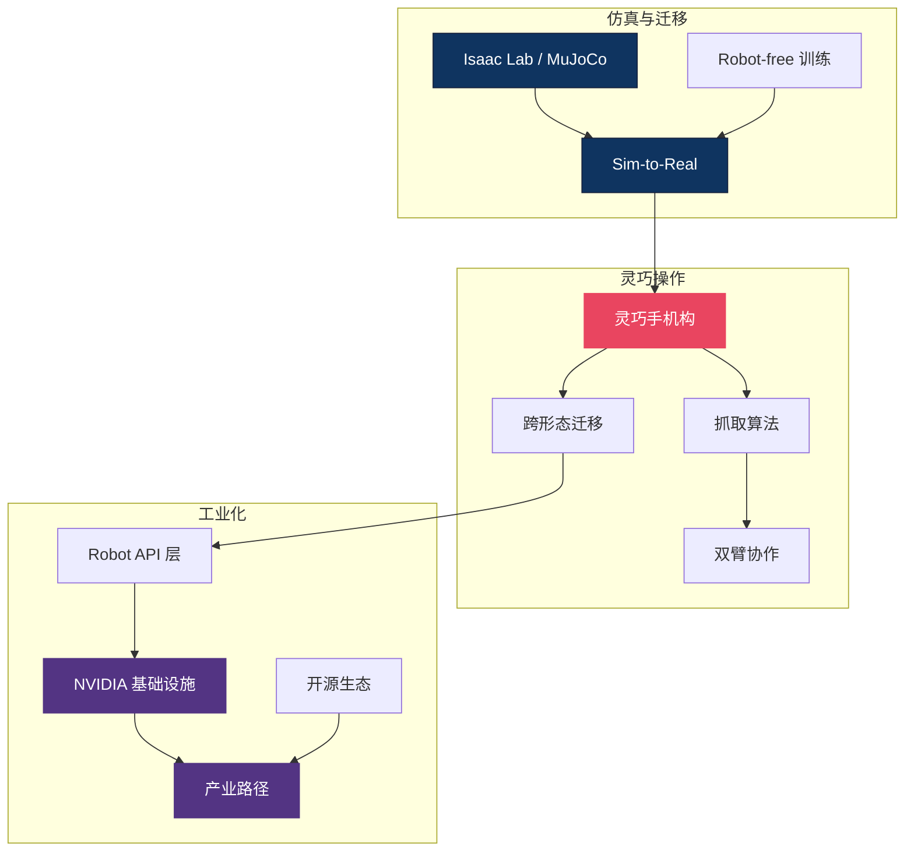

# 🔧 部署与硬件 — 实战落地主线总纲

> **论文里的 VLA 跑在 A100 上，真实的机器人只有一块边缘芯片。** 这个区域聚焦从仿真到真机的"最后一跃"：灵巧手如何抓握、Sim-to-Real 如何弥合域差距、硬件平台如何选型、工业场景如何规模化部署。18 篇文章覆盖了 VLA 落地的完整工程链——研究再好，不能上真机就是纸上谈兵。

---

## 概念关系图

---

## 研究主线

### 1. 灵巧操作 — 手、抓取与双臂

灵巧手是通用操作的物理基础。从机构设计到抓取规划到双臂协调，这条线覆盖了"手"的全栈。DexGrasp-Zero 实现零样本跨形态抓取，GR-Dexter 展示双臂灵巧手 VLA。

- [灵巧手机构原理](dexterous_hand_mechanics.md)
- [抓取算法](grasp_algorithms.md)
- [DexGrasp-Zero — 零样本跨形态抓取](dexgrasp_zero_a_morphology_aligned_policy_for_zero_shot_cros_dissection.md)
- [GR-Dexter — 双臂灵巧 VLA](gr_dexter_bimanual_dexterous_vla.md)
- [House of Dextra — 跨形态协同设计](house_of_dextra_cross_embodied_co_design_for_dexterous_hands_dissection.md)
- [Lightning Grasp — 接触场程序化抓取](lightning_grasp_contact_fields_procedural_dexterous_grasp_synthesis_2025.md)
- [灵巧手产业分析 (CICC)](dexterous_hand_industry_cicc_05.md)
- [灵巧手开罐头/数据金字塔](dexterous_hands_open_can_cards_data_pyramid.md)
- [EquiBIM — 对称等变双臂操作](equibim_learning_symmetry_equivariant_policy_for_bimanual_ma_dissection.md)

### 2. 仿真与 Sim-to-Real — 弥合域差距

在仿真器里无限生成数据，迁移到真机时仍面临巨大的域差距。Isaac Lab 和 domain randomization 是当前主流方案，RoboPocket 甚至探索了无需真机的纯手机训练。

- [Isaac Lab 详解](isaac_lab.md)
- [机器人控制基础](robot_control.md)
- [机器人动力学分类](robot_dynamics_classification.md)
- [RoboPocket — 手机即策略迭代器](robopocket_robot_free_instant_policy_iteration_phone_2026.md)

### 3. 硬件平台与基础设施

NVIDIA 的"五层蛋糕"（GPU→仿真→模型→部署→应用）定义了物理 AI 的基础设施栈。

- [NVIDIA AI 五层蛋糕](nvidia_ai_5_layer_cake_infrastructure_2026.md)
- [NVIDIA 物理 AI 与自动驾驶](nvidia_physical_ai_autonomous_driving_2026.md)
- [Physical Intelligence Layer — Robot API](physical_intelligence_layer_robot_api_2026.md)

### 4. 工业部署与开源生态

从实验室到工厂，VLA 需要跨越工程化鸿沟。产业路径分析和开源基础设施地图帮助理解当前的可行路线。

- [产业泛化路径](industry_paths_to_generalization.md)
- [机器人开源基础设施](robotics_open_source_infrastructure.md)

---

## 硬件平台速查

| 平台 | 类型 | 自由度 | 适用场景 | 生态成熟度 |
|------|------|--------|---------|-----------|
| Franka Panda | 单臂 | 7 DoF | 学术标准 | ⭐⭐⭐⭐⭐ |
| ALOHA / Mobile ALOHA | 双臂 | 2×7 DoF | 双臂操作研究 | ⭐⭐⭐⭐ |
| SO-100 / Koch | 低成本臂 | 6 DoF | 入门/教育 | ⭐⭐⭐ |
| LEAP Hand / Allegro | 灵巧手 | 16-22 DoF | 灵巧操作 | ⭐⭐⭐ |
| 人形机器人 (GR系列) | 全身 | 30+ DoF | 通用具身 | ⭐⭐ |

---

## 开放问题

1. **Sim-to-Real 的可靠性上限** — Domain randomization 能弥合多大的域差距？对于触觉、柔性物体等难以仿真的现象，是否必须依赖真机数据？
2. **灵巧手的 cost-performance 拐点** — 当前灵巧手昂贵且脆弱，何时能达到工业级可靠性和消费级价格？
3. **跨形态策略的统一框架** — 一个在 Franka 上训练的策略能否零样本迁移到 UR5？当前跨形态方法（RDT2-UMI, DexGrasp-Zero）仍有较大局限。

---

## 延伸阅读

- 🤚 [触觉感知区](../tactile/) — 灵巧操作的触觉反馈
- 🎮 [强化学习区](../rl/) — 策略的后训练优化
- 🌍 [世界模型区](../world-model/) — 仿真器 vs 学习的世界模型
- 🗺️ [返回 Explorer's Map](../theory-readme.md)
