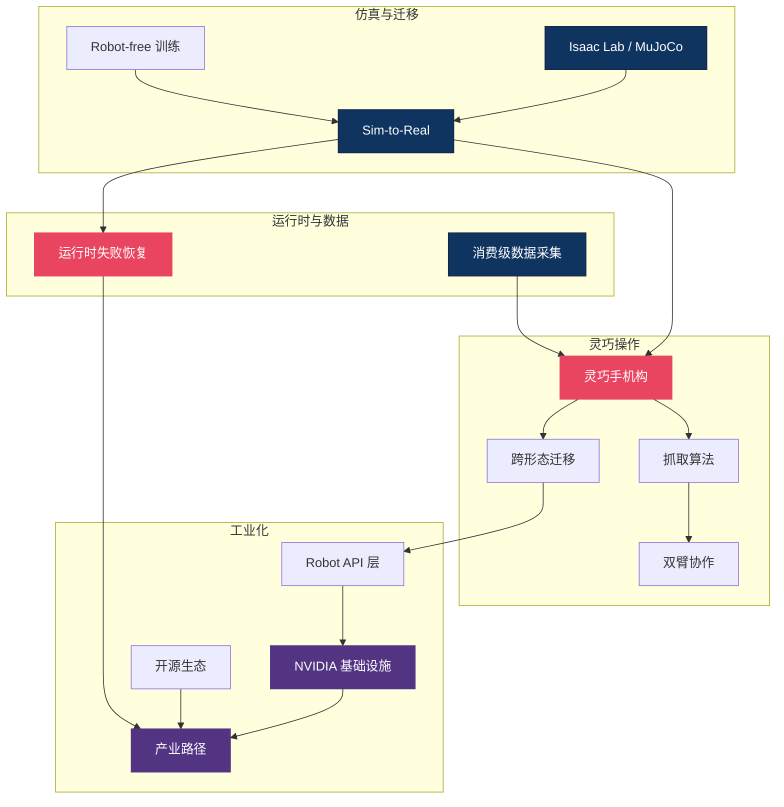

# 🔧 部署与硬件 — 实战落地主线总纲

> **论文里的 VLA 跑在 A100 上，真实的机器人只有一块边缘芯片。** 这个区域聚焦从仿真到真机的"最后一跃"：灵巧手如何抓握、Sim-to-Real 如何弥合域差距、硬件平台如何选型、工业场景如何规模化部署。22 篇文章覆盖了 VLA 落地的完整工程链——研究再好，不能上真机就是纸上谈兵。
>
> 最后更新：2026-06-10。本轮新增主题：运行时失败恢复（从"检测失败"走向"恢复失败"）、数据采集的消费级化（手机即数据基础设施）。

---

## 概念关系图

---

## 研究主线

### 1. 灵巧操作 — 手、抓取与双臂

灵巧手是通用操作的物理基础。从机构设计到抓取规划到双臂协调，这条线覆盖了"手"的全栈。DexGrasp-Zero 实现零样本跨形态抓取，GR-Dexter 展示双臂灵巧手 VLA。

5-6 月的两条新证据把这条线推向"部署后闭环改进"：HandITL 证明在 56-DoF 双臂灵巧手上，人类校正可以作为**残差注入**而非"接管"进入策略执行流（消除干预瞬间的手势跳变，命令跳变降低 99.8%），仅 1 小时校正数据就让长视界任务完成率平均提升约 19%——干预接口的设计本身成为校正数据质量的杠杆，DAgger 类方法终于在高 DoF 灵巧手上跑通。另一条线走向极简：本体感知 Transformer 证明仅凭关节编码器（约 $50 传感器成本）即可在腱驱动手上实现连续手内旋转（11.83 RPM、零掉落），比依赖相机的基线快 3.8 倍——"砍掉视觉栈"在受限任务上已经可行，关节追踪误差本身就编码了物体信息。

- [灵巧手机构原理](dexterous_hand_mechanics.md)
- [抓取算法](grasp_algorithms.md)
- [DexGrasp-Zero — 零样本跨形态抓取](dexgrasp_zero_a_morphology_aligned_policy_for_zero_shot_cros_dissection.md)
- [GR-Dexter — 双臂灵巧 VLA](gr_dexter_bimanual_dexterous_vla.md)
- [House of Dextra — 跨形态协同设计](house_of_dextra_cross_embodied_co_design_for_dexterous_hands_dissection.md)
- [Lightning Grasp — 接触场程序化抓取](lightning_grasp_contact_fields_procedural_dexterous_grasp_synthesis_2025.md)
- [灵巧手产业分析 (CICC)](dexterous_hand_industry_cicc_05.md)
- [灵巧手开罐头/数据金字塔](dexterous_hands_open_can_cards_data_pyramid.md)
- [EquiBIM — 对称等变双臂操作](equibim_learning_symmetry_equivariant_policy_for_bimanual_ma_dissection.md)
- [HandITL — 无缝手-臂干预改善灵巧 VLA](hand_in_the_loop_improving_vla_policies_for_dexterous_manipu_dissection.md)
- [本体感知 Transformer — 仅凭关节传感器的手内操作](learning_robust_dexterous_in_hand_manipulation_from_joint_se_dissection.md)

### 2. 仿真与 Sim-to-Real — 弥合域差距

在仿真器里无限生成数据，迁移到真机时仍面临巨大的域差距。Isaac Lab 和 domain randomization 是当前主流方案，RoboPocket 甚至探索了无需真机的纯手机训练。

"手机即基础设施"在 5 月从策略侧延伸到了数据侧：MobileEgo Anywhere 证明 iPhone Pro + ARKit 的 VIO 精度（漂移 <0.1% 轨迹长度）足以支撑小时级第一人称采集——200 小时、单段最长 108 分钟的长视界 RGBD + 6DoF + 3D 手部数据，全栈开源。判断：数据采集的消费级化正在成为与仿真生成并行的第二条扩数据路线，长视界（小时级 episode）是它相对 Ego4D/UMI 一代的差异化筹码；但 16 位贡献者的多样性撑不起 "Anywhere" 的主张，且尚无"训练 VLA 后闭环验证"的下游证据。

- [Isaac Lab 详解](isaac_lab.md)
- [机器人控制基础](robot_control.md)
- [机器人动力学分类](robot_dynamics_classification.md)
- [RoboPocket — 手机即策略迭代器](robopocket_robot_free_instant_policy_iteration_phone_2026.md)
- [MobileEgo Anywhere — 消费级手机的长视界 egocentric 数据](mobileego_anywhere_open_infrastructure_for_long_horizon_egoc_dissection.md)

### 3. 硬件平台与基础设施

NVIDIA 的"五层蛋糕"（GPU→仿真→模型→部署→应用）定义了物理 AI 的基础设施栈。

- [NVIDIA AI 五层蛋糕](nvidia_ai_5_layer_cake_infrastructure_2026.md)
- [NVIDIA 物理 AI 与自动驾驶](nvidia_physical_ai_autonomous_driving_2026.md)
- [Physical Intelligence Layer — Robot API](physical_intelligence_layer_robot_api_2026.md)

### 4. 工业部署与开源生态

从实验室到工厂，VLA 需要跨越工程化鸿沟。产业路径分析和开源基础设施地图帮助理解当前的可行路线。

- [产业泛化路径](industry_paths_to_generalization.md)
- [机器人开源基础设施](robotics_open_source_infrastructure.md)

### 5. 运行时失败恢复 — 从"检测失败"到"恢复失败" 🆕

长视角操作的失败很少瞬间崩溃，而是渐进螺旋：一步错、状态偏移、越过不可逆临界点。2026 上半年这条线完成了从纯检测（SAFE 一代只报警不救火）到恢复的跨越，并分化出两条互补路径——**机器自救**：AEGIS 用弱策略自身的 frozen 内部激活做早期失败预警（仅需一个 2 层 MLP 探针，AUROC 0.764），按需切换到更强策略，以 38% 的强策略占用恢复 10.1% 的失败轨迹，是同等计算预算下盲目升级的 2.2 倍；**人类共驾**：HandITL 把人类校正作为残差注入执行流，干预数据再反哺微调（见第 1 节）。核心判断：失败恢复正在成为独立于策略训练的**部署层组件**——不动策略权重、即插即用，与本区"边缘算力有限"的现实天然契合（强模型只在需要时上场）。但证据仍很薄：AEGIS 仅在 LIBERO-Spatial 验证、探针每个新场景需重新校准、且要求双模型同时驻留内存（对 Jetson 级边缘设备不友好），离"标准部署组件"还有距离。

- [AEGIS — 物理 AI 的备份反射机制](aegis_a_backup_reflex_for_physical_ai_dissection.md)
- [HandITL — 无缝手-臂干预改善灵巧 VLA](hand_in_the_loop_improving_vla_policies_for_dexterous_manipu_dissection.md)

---

## 硬件平台速查

| 平台 | 类型 | 自由度 | 适用场景 | 生态成熟度 |
|------|------|--------|---------|-----------|
| Franka Panda | 单臂 | 7 DoF | 学术标准 | ⭐⭐⭐⭐⭐ |
| ALOHA / Mobile ALOHA | 双臂 | 2×7 DoF | 双臂操作研究 | ⭐⭐⭐⭐ |
| SO-100 / Koch | 低成本臂 | 6 DoF | 入门/教育 | ⭐⭐⭐ |
| LEAP Hand / Allegro | 灵巧手 | 16-22 DoF | 灵巧操作 | ⭐⭐⭐ |
| 人形机器人 (GR系列) | 全身 | 30+ DoF | 通用具身 | ⭐⭐ |

---

## 开放问题

1. **Sim-to-Real 的可靠性上限** — Domain randomization 能弥合多大的域差距？对于触觉、柔性物体等难以仿真的现象，是否必须依赖真机数据？4 月时的判断倾向"难仿真现象必须靠真机数据"；5 月的[本体感知 Transformer](learning_robust_dexterous_in_hand_manipulation_from_joint_se_dissection.md) 表明至少在手内旋转任务上，关节编码器 + 域随机化即可零样本迁移、且优于带相机的方案——但它只验证了单轴旋转和两种立方体，张力尚未解除。
2. **灵巧手的 cost-performance 拐点** — 当前灵巧手昂贵且脆弱，何时能达到工业级可靠性和消费级价格？感知侧已出现降本信号（约 $50 的关节编码器替代整个视觉栈），但机构与执行器成本仍是大头。
3. **跨形态策略的统一框架** — 一个在 Franka 上训练的策略能否零样本迁移到 UR5？当前跨形态方法（RDT2-UMI, DexGrasp-Zero）仍有较大局限。
4. **失败恢复层的泛化** — [AEGIS](aegis_a_backup_reflex_for_physical_ai_dissection.md) 的激活探针在单一基准上训练、每个新场景需重新校准；恢复层能否摆脱"每任务一探针"，成为跨任务/跨机器人的标准部署组件？人类干预（HandITL）与机器升级（AEGIS）两条路径会融合还是分工？

---

## 延伸阅读

- 🤚 [触觉感知区](../tactile/) — 灵巧操作的触觉反馈
- 🎮 [强化学习区](../rl/) — 策略的后训练优化
- 🌍 [世界模型区](../world-model/) — 仿真器 vs 学习的世界模型
- 🗺️ [返回 Explorer's Map](../README.md)
