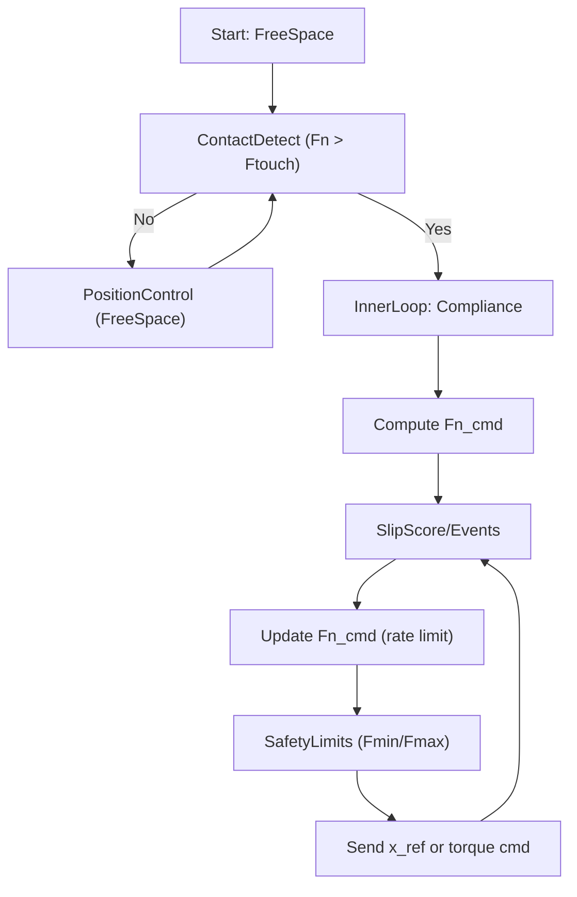
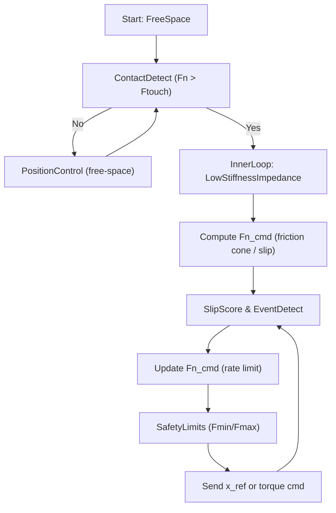

# 灵巧手机械学深度解析 (Dexterous Hand Mechanics) — 修订整合版 v2

灵巧手是机械电子工程中集成度最高的部件之一。要在接近人手尺寸的体积内实现 20+ 自由度，需要同时解决：**构型/传动/可观测性/稳定性/制造维护**的系统耦合问题。

---

## 1. 机构学：构型与自由度 (Mechanism & DOF)

### 1.1 自由度分配 (Degrees of Freedom)

#### 1.1.1 运动学自由度（机构层）

- **计算公式（Leonhard Grubler 判据）**：三维空间机构自由度 $M$：

$$
M = 6(n - j - 1) + \sum_{i=1}^{j} f_i
$$

- $n$：连杆总数（含机架）  
- $j$：关节总数  
- $f_i$：第 $i$ 个关节自由度

#### 1.1.2 可控自由度（控制层，欠驱动必须补这一句）

> 工程里真正决定难度的，不只是机构 DOF ($M$)，而是**输入维度**（执行器数）$m$ 与接触约束共同决定的“可控子空间”。

- **欠驱动 (Under-actuated)** 不等于 DOF 少，而是 **$m < M$**：一个输入驱动多个关节，控制从“逐关节”变为“在接触约束下的形状/力分配”。  
- 抓住物体后，环境约束会让系统 DOF **塌缩**（例如沿法向/切向的限制），控制目标也随之改变（位置 → 力/内力/阻抗）。

#### 1.1.3 仿生构型（工程常见）

- 主流灵巧手对齐人手 21–27 DOF  
  - 手指：常见 3–4 DOF（屈伸 + 侧摆/外展）  
  - 拇指：关键在对掌（Opponency），常需 4–5 DOF 才能覆盖抓取空间

### 1.2 全驱动 vs 欠驱动（Under-actuated）

- **全驱动**：每关节独立电机（优势：控制可分解；代价：重量、成本、热与线束复杂度）  
- **欠驱动**：滑轮/腱绳/弹簧耦合（优势：结构柔顺性与自适应包络；代价：可辨识性差、迟滞与一致性挑战更大）

---

## 2. 传动学：动力输出的艺术 (Transmission)

### 2.1 精密减速器 (Reducers)

物理关系：

$$
\tau_{out} = G \cdot \eta \cdot \tau_{in}, \quad \omega_{out} = \frac{\omega_{in}}{G}
$$

#### 2.1.1 关键指标：减速比不是越大越好

- **反驱性 (Backdrivability)**：$G$ 大 + 摩擦大 → 难反驱 → 力/触觉“软控制”困难  
- **反射惯量 (Reflected Inertia)**：

$$
J_{ref} \approx J_m \cdot G^2
$$

- **透明度 (Transparency)**：摩擦/背隙/弹性 → “力矩→接触力”映射不可预测  
- **热与效率**：$\eta$ 下降意味着更大电流与热漂移（影响标定与一致性）

> 折中原则：自由空间要速度与带宽；接触相位要可控柔顺性。单一极端 $G$ 很难两全。

### 2.2 驱动流派对比 (Actuation Lineages)

- **直驱/齿轮派**：链路短、易做 torque/impedance；但指端惯量、热与冲击寿命压力大  
- **线驱动派（Tendon-driven）**：指端轻、易做包络；但摩擦迟滞/蠕变让“可控性”成为上限  
- **液压派**：功率密度高、抗冲击；但微型化、密封、维护与噪声/效率是系统门槛  
  - 代表性路径可参考 Sanctuary AI 的相关系统思路（工程取舍维度：功率密度 vs 维护）

### 2.3 工程现实：产能/装配/维护会“强制收敛”驱动方案

- 装配复杂度（走线/公差/张紧）决定一致性上限  
- 维护成本（蠕变、背隙、弹性体磨损、齿面寿命）决定长期迭代速度  
- 一致性决定：同一策略能否跨多台手复现（数据闭环能否成立）

相关工程视角可参考：`./frontier/dexterous_hands_open_can_cards_data_pyramid.md`

### 2.4 腱绳工程细节：走线、张紧、材料、滑轮（决定长期一致性）

#### 2.4.1 单向 vs 双向腱绳

- **双向腱绳**：屈伸都主动（可控性强；张紧/漂移/装配成本高）  
- **单向 + 回弹**：更简单更稳（缺少主动伸展；弹簧力吃掉有效抓力/带宽）

#### 2.4.2 必须补的最小硬模型：绕包摩擦（Capstan）

> 这一条能把“迟滞/不可逆/同位不同力”说清楚。

$$
T_{out} = T_{in} e^{\mu \theta}
$$

- $\mu$：等效摩擦系数，$\theta$：包角  
- 含义：导向越多/包角越大 → 张力不确定性**指数级放大** → 标定难、复现难

#### 2.4.3 等效刚度链路（决定力控带宽上限）

腱绳系统的“软”往往不是你想要的那种软，而是不可控的弹性与松弛叠加：

$$
K_{eq}^{-1} = K_{tendon}^{-1} + K_{routing}^{-1} + K_{structure}^{-1}
$$

- $K_{eq}$ 低 → 力控带宽上限低、相位延迟更敏感、微动任务更难复现

#### 2.4.4 张紧机构（Tensioning）是产品级差异点

目标不是“一次张紧”，而是**可维护的长期张紧**：

- 机械张紧（螺纹/偏心轮/棘轮）：可维护但占空间  
- 弹性补偿：可自动补漂移但引入能量损耗与额外柔度  
- 闭环张力控制：需要张力传感或可辨识模型，否则容易“越控越飘”

#### 2.4.5 材料与滑轮半径（寿命 + 一致性）

- UHMWPE（Dyneema/Spectra）：轻强但蠕变/磨损要评估  
- 钢丝：稳定但对滑轮半径与导向磨损敏感  
- 芳纶：耐热强但弯折疲劳与磨损要关注

> 选择原则：若系统依赖精确闭环，更应偏向**可预测与耐久**。

### 2.5 传感与可观测性：没有“可观测”，就没有可靠控制

- 本体：编码器/电流/力矩估计（注意齿隙/弹性导致“电机角度 ≠ 关节角度”）  
- 接触：指尖触觉（位置、面积、剪切、滑移）、腕部 F/T（整体敏感但难分辨局部）

工程判断：

> 如果目标是“发牌/拧瓶盖/开可乐”这类接触窗口任务，只靠电流 proxy 很难稳定最后 1cm。

参见补充：`tactile_vla.md`

### 2.6 背隙、顺应性与“软硬切换”

- 背隙：接触相位抖动/微动失真/力控不稳的直接来源  
- 顺应性：太硬 → 碰撞风险与插入失败；太软 → 定位与力传递差  
- 常见做法：自由空间高刚度；接触相位切阻抗/导纳降低等效刚度（吸收微误差）

### 2.7 线束与封装：从 demo 到长期运行的第一杀手

- 可动线束疲劳与应力释放  
- 连接器接触不良导致丢帧 → 策略偶发翻车  
- 皮肤封装的可更换性决定维护成本与寿命

---

## 3. 运动学与空间计算 (Kinematics)

### 3.1 坐标系映射 (Coordinate Mapping)

- FK：电机/关节角 → 指尖位姿  
- IK：抓取点/姿态 → 关节角

### 3.2 雅可比矩阵 (Jacobian)

- 速度映射：

$$
\dot{x} = J(q)\dot{q}
$$

- 静力学对偶性：

$$
\tau = J^T(q) f_{ext}
$$

- **奇异性（更精确说法）**：并非总是 $\det(J)=0$（很多手指链条 $J$ 非方阵），工程上判断是：
  - $J$ **秩下降**（rank deficient）→ 某些方向速度/力传递能力塌缩  
  - 直接后果：某些方向“动不了/撑不住”，控制会变得异常敏感

### 3.3 抓取力学桥接层：从接触力到物体 wrench（补强新增）

> 这一节是把“手指内部 ($J$)”与“物体层 ($G$)”连起来的桥。没有它，力控/捏力只能停留在“概念正确”。

#### 3.3.1 抓取映射（Grasp Map）

$$
w = G f
$$

- $f$：所有接触点的力（含法向/切向）  
- $w$：物体受到的合力/合力矩（wrench）  
- $G$ 决定 **wrench closure**：能不能稳定施加你想要的扭矩（拧/旋/撬）

#### 3.3.2 内力分解（多指推广的核心）

$$
f = f_{task} + f_{int}, \qquad G f_{int}=0
$$

- $f_{task}$：实现任务 wrench 的那部分接触力  
- $f_{int}$：不改变物体 wrench，但提升接触稳定性（捏力本质是内力）

#### 3.3.3 摩擦锥约束（不滑的硬条件）

$$
|f_t| \le \mu f_n
$$

这条把“可控性”与“材料/表面状态”绑定在一起（也是为什么触觉很关键）。

#### 3.3.4 脆物必须加的压力约束（从论文到产品的分界线）

$$
p_{\max} \le p_{\max,cap}, \qquad F_n \le p_{cap}\,A
$$

- $A$：接触面积（触觉可测）  
- $p_{\max}$：局部峰值压力（触觉可测）

> 工程含义：若 $A$ 小，允许的 $F_n$ 必须更小；先“铺开接触斑”，再谈加力。

---

## 4. 动力学与控制特性 (Dynamics & Control)

### 4.1 动力学基本方程 (Equations of Motion)

$$
M(q)\ddot{q} + C(q, \dot{q})\dot{q} + G(q) = \tau - J^T f_{ext}
$$

### 4.2 阻抗控制 (Impedance Control)

任务空间阻抗：

$$
f_{ext} = M_d(\ddot{x}_d - \ddot{x}) + D_d(\dot{x}_d - \dot{x}) + K_d(x_d - x)
$$

关节输出：

$$
\tau = J^T(q)\big[M_d(\Delta\ddot{x}) + D_d(\Delta\dot{x}) + K_d(\Delta x)\big] + \hat{G}(q)
$$

> **接口澄清（必须写清楚）**
>
> - 有 torque interface：阻抗更自然（直接塑形“力—位移”关系）  
> - 只有 position interface：更常用导纳（Admittance）：把力变成位移/速度参考，再交给内部位置环

### 4.3 捏力控制（Pinch Force Control）— 脆物增强版（关键修订）

> 核心不变：你控制的不是“力本身”，而是接触约束下的能量与稳定性。  
> **对脆物的升级**：从只控 $F_n$ 升级为 **联控 $(F_n, A, p_{\max})$**，并把“姿态/接触斑”纳入闭环。

#### 4.3.1 你到底要控什么（脆物版本）

两指捏取的目标分四层：

1. 接触稳定（不抖/不弹/不穿透）  
2. 最小不滑法向力（$F_n$ 尽可能小）  
3. 峰值压力不超限（$p_{\max}$）  
4. 面积/接触斑可控（$A$ 与压力分布形状）

#### 4.3.2 内环：顺从接触（法向阻抗/导纳）

$$
M_d \ddot{x}_n + B_d \dot{x}_n + K_d(x_n - x_{n,d}) = F_{n,cmd} - F_{n,meas}
$$

目的：让接触“软”，避免刚碰刚导致的力暴冲。

#### 4.3.3 外环：摩擦锥给出最低不滑捏力（但受压力上限裁切）

$$
F_{n,req} \ge \frac{|F_t|}{\hat{\mu}}(1+\text{margin})
$$

并引入脆物硬约束：

$$
F_{n,cmd} \le \min(F_{max}, p_{cap}A), \qquad p_{\max}\le p_{\max,cap}
$$

#### 4.3.4 防滑：事件驱动增力 + 稳定后慢释放（找最低不滑力）

$$
F_{n,cmd} \leftarrow \text{clip}\Big(F_{n,req} + k_s \cdot \text{slip}, [F_{min}, F_{cap}(A,p)]\Big)
$$

- 快增力：仅在 micro-slip onset  
- 慢释放：无 slip 持续 $T$ 秒后，以低速率下调 $F_n$ 寻找极小稳定值  
- 关键护栏：$|\dot{F}_{n,cmd}| \le r_{cap}$（脆物必须限斜率）

#### 4.3.5 滑移反推摩擦（在线更新 $\hat{\mu}$）

$$
\hat{\mu} \leftarrow \text{lowpass}\Big(\frac{|F_t|}{F_n}\Big)
$$

（在滑移 onset 时更新最有效，能显著减少过度加力）

#### 4.3.6 脆物“必加”的两条策略

- **先扩接触斑，再加力**：若 $p_{\max}$ 过高，优先做微滚动/微姿态调整扩大 $A$，再谈 $F_n$  
- **运动规划参与（降低 $F_t$）**：限制加速度/jerk（S-curve），通常比“更聪明的增力律”更能避免压碎

#### 4.3.7 稳定性兜底：被动性/能量视角

> 延迟 + 刚环境是力控的天敌。工程上最可靠的底层原则是：**让交互保持被动（不凭空注入能量）**。

- **虚拟耦合 (Virtual Coupling)**：在控制命令与真实末端之间加虚拟弹簧阻尼  
- **能量罐 (Energy Tank)**：只允许系统在“有足够能量预算”时输出强动作  
- **PO-PC (Passivity Observer/Controller)**：在线观察能量是否变“主动”，一旦主动就自动加阻尼/限幅

工程要点：触觉丢帧、延迟抖动、接触切换瞬间，必须触发更保守的能量限制。

#### 4.3.8 最小可用流程（可部署模板）

1) **接触检测**：$F_n > F_{touch}$ 才进入捏力模式（100–300ms 平滑切换）  
2) **顺从接触**：法向低刚度阻抗先稳住  
3) **抬起/操作**：摩擦锥或 slip 自适应计算 $F_{n,cmd}$  
4) **滑移事件**：快增力、慢降力  
5) **安全护栏**：$F_{max}$ 硬限制 + 速度/位移限幅 + 异常卸力/急停

**流程图（可直接落地的控制回路）**：

---

## 5. 总结：DexHand 的三大工程悖论

1. 高自由度 vs 有限空间：DoF、线束、热、封装的几何极限  
2. 大抓取力 vs 极小自重：力矩密度 + 反射惯量 + 冲击寿命的三角矛盾  
3. 高精度控制 vs 物理鲁棒性：微动插装与撞击桌面必须共存

---

## 6. 工程落地 Checklist（硬件视角）

- **驱动与减速**：目标指尖力/扭矩是否可达；反驱性是否足够；背隙与摩擦是否满足微动任务  
- **腱绳**：张紧是否可维护；Capstan 指数摩擦是否会压垮一致性；等效刚度是否支撑所需带宽  
- **传感**：触觉能否提供滑移/接触斑/压力峰值；多模态时间同步是否可靠  
- **可靠性**：线束疲劳、连接器、皮肤封装是否支撑长期运行  
- **可制造/可维护**：装配与标定流程能否量产；易损件能否快速更换

---

## 7. 验证路线图（新增：让它像“产品规格书”一样可执行）

> 目标：把“概念正确”变成“系统可复现”。

### 7.1 关节/传动层

- 反驱力矩曲线（静摩擦/动摩擦、温升后的漂移）  
- 背隙与死区（微动下的位置-力畸变）  
- 等效刚度与频响（小扰动扫频得到带宽上限）

### 7.2 触觉层

- 压力标定：$p \rightarrow F_n$，剪切标定：$s \rightarrow F_t$  
- 滑移 onset 检测延迟与误报率  
- 丢帧/延迟抖动注入测试（看控制是否仍稳定）

### 7.3 抓取/任务层

- 最小不滑捏力曲线（不同材质/姿态/速度）  
- 脆物损伤阈值：$p_{\max}$ vs 损伤（得到 $p_{\max,cap}$ 数据依据）  
- 成功率 vs 动作速度（验证“规划参与”的收益）

---

## 8. 产业视角补充：中金《人机系列05（灵巧手）》工程化要点（保留）

> 行业观点参考：中国国际金融股份有限公司（中金）相关报告摘录整理（用户粘贴文本）。  
> 理论侧抽象：`./frontier/dexterous_hand_industry_cicc_05.md`  
> 产业侧 digest：`../companies/industry_reports/cicc_dexterous_hand_05.md`

- 传动：复合传动主流；直线传动中微型滚珠丝杠渗透  
- 驱动：电驱为主，功率密度提升引出重量/散热瓶颈  
- 感知：视觉+触觉多模态；电子皮肤趋势明确但量产一致性待验证  
- 系统瓶颈：工程化/量产、热管理、感知—驱动—传动闭环协同

---
[← 返回理论目录](./README.md)
# 灵巧手机械学深度解析 (Dexterous Hand Mechanics)

灵巧手是机械电子工程中集成度最高的部件之一。要在接近人手尺寸的体积内实现 20+ 自由度，需要综合运用多种机械原理。

---

## 1. 机构学：构型与自由度 (Mechanism & DOF)

### 1.1 自由度分配 (Degrees of Freedom)

*   **计算公式 (Grubler's Criterion)**：
    对于三维空间的机构，自由度 $M$ 的计算如下：

    $$
    M = 6(n - j - 1) + \sum_{i=1}^{j} f_i
    $$

    - $n$: 连杆总数（含机架）
    - $j$: 关节总数
    - $f_i$: 第 $i$ 个关节的自由度

*   **仿生构型**：主流灵巧手模仿人手的 21-27 个自由度。
    *   **手指 (Fingers)**：通常为 3-4 自由度（弯曲、侧摆）。
    *   **拇指 (Thumb)**：最为关键，通常需要 4-5 自由度以实现**对掌 (Opponency)**。

*   **全驱动 vs. 欠驱动 (Under-actuated)**：
    *   **全驱动**：每个关节由独立电机驱动（如 Wuji, Sharpa）。优势是控制绝对精准，劣势是重量大、成本极高。
    *   **欠驱动**：利用滑轮、拉索或弹簧使一个电机带动多个关节。优势是具备**结构柔顺性 (Structural Compliance)**，能自动包络物体。

---

## 2. 传动学：动力输出的艺术 (Transmission)

### 2.1 精密减速器 (Reducers)

*   **物理关系**：减速比 $G$ 直接决定了输出扭矩 $\tau_{out}$ 与电机扭矩 $\tau_{in}$ 的关系：

    $$
    \tau_{out} = G \cdot \eta \cdot \tau_{in}, \quad \omega_{out} = \frac{\omega_{in}}{G}
    $$

    - $G$: 减速比 (Gear Ratio)
    - $\eta$: 传动效率 (Efficiency)

*   **行星减速器 (Planetary Gear)**：高功率密度，结构紧凑。
*   **齿轮传动 (Gear Train)**：
    *   **锥齿轮 (Bevel Gear)**：用于 90 度转角传动。
    *   **蜗轮蜗杆 (Worm Gear)**：具有自锁功能，但效率较低。

#### 2.1.1 关键指标：减速比不是越大越好

减速比 \(G\) 的代价通常会体现在下面几个硬约束上：

- **反驱性 (Backdrivability)**：减速比/摩擦越大越难反驱，触觉/力控更难做“软”。
- **反射惯量 (Reflected Inertia)**：手指末端看到的等效惯量会被 \(G^2\) 放大，导致“又重又笨”：

$$
J_{ref} \approx J_m \cdot G^2
$$

- **传动透明度 (Transparency)**：高摩擦/间隙会让“力矩→接触力”的映射变得不可预测（尤其在接触相位）。
- **热与效率**：效率 \(\eta\) 下降意味着同样输出扭矩会带来更大电流与发热。

工程上常见的折中是：**自由空间需要速度与带宽**，接触相位需要**可控的柔顺性**；两者很难用一个极端的 \(G\) 同时满足。

### 2.2 驱动流派对比 (Actuation Lineages)

*   **直驱/齿轮派 (Direct-Drive / Gear)**：电机直接集成在关节（如 **Wuji**, **RealerHand**, **Sharpa**）。透明度高，响应快，无拉索迟滞。
*   **线驱动派 (Tendon-driven)**：通过高强拉索远程牵引（如 **Shadow**, **LEAP**）。手指惯性极小，但存在非线性摩擦。
*   **液压派 (Hydraulic)**：微型液压系统（如 **Sanctuary Phoenix**）。功率密度极高，天然抗冲击。

### 2.2.1 直驱/齿轮派：你真正买到的是什么？

- **你买到的优点**
  - **低延迟**：电机→关节的链路短，控制带宽更高。
  - **建模更线性**：没有腱绳摩擦、绕线半径变化等强非线性。
  - **更容易做 torque/impedance**：尤其当关节摩擦低、齿隙可控时。
- **你承担的代价**
  - **重量/惯量在指端堆积**：对高速精细动作（发牌、捏薄片）会立刻显形。
  - **线束与散热**：电机与驱动器密度高，热设计与线束可靠性变成一等公民问题。
  - **撞击与寿命**：高减速比 + 刚性结构，冲击载荷更容易传到齿面/轴承。

### 2.2.2 Tendon-driven：决定你上限的不是“拉力”，而是“可控性”

腱绳驱动的核心难点不在能不能拉动，而在能不能把“拉力”稳定地变成你想要的关节力矩/接触力：

- **摩擦与迟滞 (Hysteresis)**：路径越长、弯曲越多、包角越大，迟滞越明显；同一个电机位置可能对应多种指尖力。
- **蠕变/松弛 (Creep & Relaxation)**：材料与结构会随时间漂移，导致“标定越用越不准”。
- **张紧与走线**：高 DoF 的走线空间利用率非常差，装配与维护会快速成为瓶颈。

### 2.3 工程现实：产能/装配/维护会“强制收敛”驱动方案

> 这点在真实产品里经常比“纸面性能”更早成为瓶颈：当你把 DoF、触觉、线束、标定都堆上去，系统是否还能规模化装配与维护，会反过来决定你能不能持续迭代数据与算法。

- **装配复杂度**：走线/张紧/公差堆叠越复杂，越难规模化一致性。
- **维护成本**：腱绳蠕变/松弛、弹性体磨损、减速器背隙与齿损都会带来长期漂移。
- **一致性**：同一“策略”在不同手之间能否复现，往往取决于传动链和传感链的一致性。

相关工程视角可参考：[`./frontier/dexterous_hands_open_can_cards_data_pyramid.md`](./frontier/dexterous_hands_open_can_cards_data_pyramid.md)

### 2.4 腱绳工程细节：走线、张紧、材料、滑轮（决定长期一致性）

#### 2.4.1 单向 vs 双向腱绳

- **双向腱绳**：屈伸都由腱绳主动驱动  
  - **优势**：可控性更强（尤其是“主动伸展/推”在某些精细操作中很关键）
  - **代价**：张紧与蠕变问题加倍；装配复杂度高
- **单向腱绳 + 弹簧回弹**：屈曲主动，伸展被动  
  - **优势**：对蠕变不那么敏感、结构更简单
  - **代价**：缺少主动伸展力；弹簧力会“吃掉”一部分有效抓力与控制带宽

#### 2.4.2 张紧机构（Tensioning）是产品级差异点

张紧的目标不是“一次张紧”，而是**可维护的长期张紧**：

- **机械张紧**：棘轮/螺纹微调/偏心轮（优点：可维护；缺点：结构空间）
- **弹性补偿**：弹簧/弹性体预紧（优点：自动补偿小漂移；缺点：引入额外柔度与能量损耗）
- **闭环张力控制（更难）**：需要张力传感或可辨识的力矩模型，否则容易“越控越飘”

#### 2.4.3 腱绳材料（只给工程上常见的 trade-off）

- **超高分子量聚乙烯 (UHMWPE, Dyneema/Spectra 类)**：轻、强度高；但对长期蠕变/磨损要谨慎评估。
- **钢丝绳**：蠕变小、稳定；但柔性差、滑轮半径要求更高，且易磨损导向件。
- **芳纶 (Kevlar 类)**：强度高、耐热；但弯折疲劳与磨损需要关注。

选择原则：你的系统如果依赖“精准的力/位置闭环”，更应该偏向**可预测与耐久**，而不是“单次拉力最大”。

#### 2.4.4 滑轮与包角（绕一圈就会产生一圈的非线性）

- **小半径滑轮**：省空间，但会增大弯折疲劳与摩擦；长期一致性更差。
- **大包角/多级导向**：走线更灵活，但迟滞更大、标定更难。

### 2.5 传感与可观测性：没有“可观测”，就没有可靠控制

硬件传感栈通常由“本体 + 接触”两层组成：

- **本体传感（Proprioception）**
  - 编码器：关节/电机侧位置（注意齿隙与传动弹性会让“电机角度 ≠ 关节角度”）
  - 电流/力矩估计：作为接触事件、卡死、过载的廉价 proxy
- **接触传感（Contact / Tactile）**
  - 指尖/指腹触觉：接触位置、接触面积、剪切/滑移、局部几何
  - 腕部 F/T：对整体外力敏感，但对多指局部接触的可分辨性不足

一个非常实用的工程判断：如果你要做“发牌/拧瓶盖/开可乐”这种接触窗口任务，**只靠电流 proxy 很难做出稳定的最后 1cm**（见 `tactile_vla.md` 的补充段落）。

### 2.6 背隙、顺应性与“软硬切换”

- **背隙 (Backlash)**：会直接体现在接触相位的抖动、微动失真、力控不稳定。
- **结构顺应性 (Compliance)**：
  - 太硬：碰撞风险高、装配/插入任务难
  - 太软：定位与力传递困难、响应慢
- **产品常见做法**：通过控制做“软硬切换”
  - 自由空间：高刚度/高带宽
  - 接触相位：阻抗/导纳降低刚度，允许微误差被“吸收”

### 2.7 线束与封装：从 demo 到长期运行的第一杀手

灵巧手的线束不是“配件”，而是高故障率来源之一：

- **可动线束疲劳**：手指与腕部反复弯折，必须有应力释放与合理的弯折半径
- **连接器可靠性**：微小接触不良就会造成触觉/编码器丢帧，进而让策略“偶发翻车”
- **防尘/防水与皮肤封装**：皮肤层材料、粘接与可更换性直接影响维护成本

---

## 3. 运动学与空间计算 (Kinematics)

### 3.1 坐标系映射 (Coordinate Mapping)

*   **正向运动学 (FK)**：从电机角度计算指尖坐标 ($x, y, z$)。
*   **逆向运动学 (IK)**：给定目标抓取点，计算各个电机的转角。

### 3.2 雅可比矩阵 (Jacobian)

雅可比矩阵是关节空间 $q$ 与笛卡尔空间 $x$ 之间的差分映射：

*   **速度映射**：

    $$
    \dot{x} = J(q)\dot{q}
    $$

*   **静力学对偶性 (Statics Duality)**：
    这是触觉反馈控制的核心公式。它将末端接触力 $f_{ext}$ 转换为关节力矩 $\tau$：

    $$
    \tau = J^T(q)f_{ext}
    $$

*   **物理意义**：
    - $J(q)$：决定了手指在当前姿态下各方向的运动灵敏度。
    - $J^T$：决定了各关节电机需要输出多少力矩来维持指尖的抓取力。
    - **奇异状态 (Singularity)**：当 $det(J) = 0$ 时，手指在某些方向失去自由度。

---

## 4. 动力学与控制特性 (Dynamics & Control)

### 4.1 动力学基本方程 (Equations of Motion)

灵巧手的运动遵循欧拉-拉格朗日方程：

$$
M(q)\ddot{q} + C(q, \dot{q})\dot{q} + G(q) = \tau - J^T f_{ext}
$$

- $M(q)$: 惯性矩阵 (Inertia Matrix)
- $C(q, \dot{q})$: 离心力与科氏力 (Coriolis & Centrifugal)
- $G(q)$: 重力项 (Gravity)

### 4.2 阻抗控制 (Impedance Control)

为了实现“柔顺抓取”，通常在任务空间建立二阶阻抗模型：

$$
f_{ext} = M_d(\ddot{x}_d - \ddot{x}) + D_d(\dot{x}_d - \dot{x}) + K_d(x_d - x)
$$

其对应的关节控制输出 $\tau$ 为：

$$
\tau = J^T(q)[M_d(\Delta\ddot{x}) + D_d(\Delta\dot{x}) + K_d(\Delta x)] + \hat{G}(q)
$$

- $K_d, D_d$: 期望刚度和阻尼，决定了手指的“弹性”程度。

---

### 4.3 捏力控制（Pinch Force Control）

> **核心观点**：你要控制的不是“力本身”，而是“机器人–环境互动物理约束下的能量流”。  
> **难点**：接触/摩擦不确定 + 噪声/延迟导致不稳定。

#### 4.3.1 你到底要控什么

对两指捏取，目标通常分三层：
1. **接触稳定**：不抖、不弹、不穿透。  
2. **法向力调节**：$F_n \\rightarrow F_{n,cmd}$（夹得刚刚好）。  
3. **防滑自适应**：有滑移征兆时快速增力；稳定后缓慢下降到最低安全力。

典型法向接触模型（粗略）：

$$
F \\approx K_e x + B_e \\dot{x}
$$

环境刚性 $K_e$ 越大、延迟越大，越容易不稳定。

#### 4.3.2 传感条件决定方案

- **有指尖触觉（压力 + 剪切/滑移）**：可估 $F_n$、$F_t$、接触面积、微滑移，最稳。  
- **只有关节力矩/电流估计**：能控内力但难分解切向/滑移，需更保守。  
- **只有位置接口**：用导纳控制外挂（力→位移），事件驱动增力。

#### 4.3.3 内环：顺从接触（Impedance/Admittance）

在接触法向 $n$ 上做 1D 阻抗：

$$
M_d \\ddot{x}_n + B_d \\dot{x}_n + K_d(x_n - x_{n,d}) = F_{n,cmd} - F_{n,meas}
$$

- 输出为位移/速度命令（位置伺服），或输出力矩（torque interface）。  
- **目的**：让接触“变软”，上层才能稳定调力。

#### 4.3.4 外环：摩擦锥计算最低安全捏力

两指捏取的安全条件：

$$
F_n \\ge \\frac{\\lVert F_t \\rVert}{\\mu} + \\text{margin}
$$

- $F_t$：切向载荷（重力、加速度、扰动引起）  
- $\\mu$：摩擦系数（未知且随时间变化）  
- margin：安全裕度（通常 10–40%）

若可测 $F_t$，即可把捏力压到“刚好不滑”；若不可测，则依赖滑移事件估计。

#### 4.3.5 防滑：事件驱动增力

滑移指标（slip score）来源：
- 触觉剪切快速变化、接触斑点位移、微振动能量  
- 指尖相对物体的微速度（视觉/触觉融合）  
- 位置残差：你没动但物体在动（弱触觉替代）

控制律（示意）：

$$
F_{n,cmd} \\leftarrow \\text{clip}\\big(F_{n,base} + k_s\\,\\text{slip} + k_l\\,\\widehat{\\lVert F_t\\rVert}/\\hat{\\mu},\\ [F_{min},F_{max}]\\big)
$$

工程护栏：
- **rate limit**：$|\\dot{F}_{n,cmd}| \\le r_{max}$（避免暴冲）  
- **release policy**：无滑移持续 $T$ 秒后缓慢降力（寻找最低不滑力）

**滑移反推摩擦**（micro-slip onset）：

$$
\\hat{\\mu} \\leftarrow \\text{lowpass}\\Big(\\frac{\\lVert F_t\\rVert}{F_n}\\Big)
$$

#### 4.3.6 内力视角（多指推广）

捏力是**内力**：不改变物体合力矩，但提升摩擦裕度。

$$
w = G f,\\quad f = f_{task} + f_{int},\\quad G f_{int} = 0
$$

工程上记住：**捏力由“防滑/摩擦裕度”决定，而不是靠位置刚度硬撑**。

#### 4.3.7 最小可用流程（可部署模板）

1) **接触检测**：$F_n > F_{touch}$ 才进入捏力模式（100–300ms 平滑切换）  
2) **顺从接触**：法向低刚度阻抗先稳住  
3) **抬起/操作**：摩擦锥或 slip 自适应计算 $F_{n,cmd}$  
4) **滑移事件**：快增力、慢降力  
5) **安全护栏**：$F_{max}$ 硬限制 + 速度/位移限幅 + 异常卸力/急停

**流程图（可直接落地的控制回路）**：

---

## 5. 总结：DexHand 的三大工程悖论

1.  **高自由度 vs. 有限空间**：如何在成人手指粗细的管内塞进电机和减速器。
2.  **大抓取力 vs. 极小自重**：力矩密度 ($Torque Density$) 的极限挑战。
3.  **高精度控制 vs. 物理鲁棒性**：如何保证手指既能穿针引线，又在撞击桌面时不崩齿。

---

## 6. 工程落地 Checklist（硬件视角，面试/设计都能用）

你可以用这份清单快速对齐“硬件是否准备好支撑算法迭代”：

- **驱动与减速**
  - 目标任务需要的 **指尖力/扭矩** 是否可达？（含安全余量）
  - 反驱性是否满足接触相位的柔顺控制？
  - 背隙与摩擦是否在可接受范围（尤其是重复微动任务：发牌/插拔）？
- **腱绳（如果使用）**
  - 张紧是否可维护？蠕变补偿策略是什么？
  - 走线包角/滑轮半径是否会导致迟滞过大、寿命过短？
- **传感**
  - 本体（编码器/电流）能否可靠检测：接触、卡死、过载？
  - 触觉能否提供：滑移、接触位置/方向、接触面积变化？
  - 多模态时间同步是否可靠（否则数据回放不可复现）？
- **可靠性**
  - 线束疲劳、连接器、封装是否支持长期运行？
  - 热设计是否在高占空任务下稳定（不过热降额/漂移）？
- **可制造/可维护**
  - 装配工艺是否可规模化？标定流程是否可量产？
  - 易损件（皮肤、弹性体、腱绳）是否可快速更换？

---

## 7. 产业视角补充：中金《人机系列05（灵巧手）》的工程化要点（摘录整理）

> **来源状态**：下述要点基于用户粘贴的报告文字摘录整理，未附原文链接/页码，默认作为“行业观点”参考。  
> 详细整理见：理论侧抽象 [`./frontier/dexterous_hand_industry_cicc_05.md`](./frontier/dexterous_hand_industry_cicc_05.md)，产业侧 digest [`../companies/industry_reports/cicc_dexterous_hand_05.md`](../companies/industry_reports/cicc_dexterous_hand_05.md)

- **传动**：复合传动成为主流；旋转传动多路线并行（齿轮/连杆/腱绳/链条），直线传动中 **微型滚珠丝杠**渗透加速。
- **驱动**：电驱为主，多电机方案并存（BLDC/空心杯/无框力矩）；功率密度提升会迅速引出 **重量与散热** 瓶颈。
- **感知**：从单一力觉走向“视觉+触觉”多模态；电子皮肤作为标准载体趋势明确，但可靠性/成本/量产一致性仍待验证。
- **系统级瓶颈**：工程化与量产、热管理、感知—驱动—传动闭环协同，是从“原理可行”到“工程可用”的关键门槛。

---
[← 返回理论目录](./README.md)
