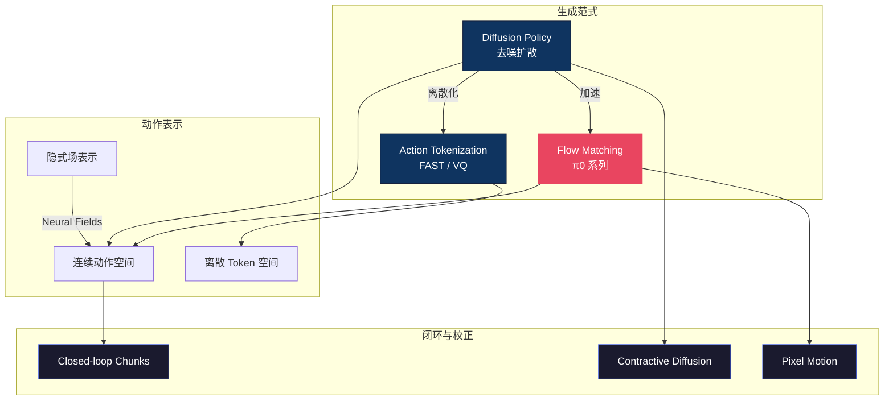

# 🌊 扩散与流匹配 — 动作生成主线总纲

> **机器人动作从哪里"生出来"？** 这个区域回答 VLA 最核心的工程问题：给定视觉观测和语言指令，如何把连续的机械臂轨迹"生成"出来。从 Diffusion Policy 开辟去噪范式，到 π0 的 Flow Matching 实现工业级速度，再到 FAST 式离散 tokenization 与 VLM 无缝对接——动作生成是 VLA 的"最后一公里"，决定了模型能不能真正驱动真实机器人。
>
> **最后更新**: 2026-06-10

---

## 概念关系图

---

## 研究主线

### 1. Diffusion Policy 家族 — 去噪生成动作

扩散策略将动作生成建模为"从噪声中逐步去噪"的过程，天然支持多模态动作分布（同一任务可能有多条有效轨迹）。这条路线奠定了 VLA 动作生成的基础范式。

- [Diffusion Policy 全面解析](diffusion_policy.md)
- [Contractive Diffusion — 鲁棒性改进](contractive_diffusion_policies_robust_action_diffusion_via_c_dissection.md)
- [CoMo — 从视频学连续运动](como_learning_continuous_latent_motion_from_internet_videos_dissection.md)

**2026-06 动向**：监督信号本身开始被改造。SDP 把人类干预中天然成对的"机器人错误动作 / 人类修正动作"转成可接受集合监督，训练策略生成集合内任意动作而非精确模仿单点——对噪声修正数据显著更鲁棒，且推理零额外开销。判断：在数据聚合与微调场景，BC 式"单点模仿"将逐步让位于集合/对比式监督；负信号（机器人原本想做什么）从被丢弃的副产品变成训练资产。

- [Set-Supervised Diffusion Policy — 从修正学集合监督](set_supervised_diffusion_policy_learning_action_chunking_dif_dissection.md)

### 2. Flow Matching 家族 — π0 的加速之道

Flow Matching 用确定性 ODE 取代随机 SDE，采样速度快 5-10 倍，π0 系列以此为核心实现了实时控制。

- [π0 Flow Matching 深度解析](pi0_flow_matching.md)
- [Pixel Motion Diffusion — 像素空间流](pixel_motion_diffusion_is_what_we_need_for_robot_control_dissection.md)

**2026-06 动向**：Flow Matching 开始"一网两用"。ForesightFlow 在流端点上附加成功势函数坐标，同一网络既生成动作块又预测成功概率，靠解耦优势加权训练（动作坐标加权、势函数坐标均匀监督）消除"价值幻觉"，无需独立 Critic 即可 best-of-K 自引导改进——相比 IDQL 节省 38% 训练计算，额外参数仅 ~1K（vs ~500M Critic）。判断：VLA 后训练正从"独立 Critic"走向"自引导生成"，价值信号内生于策略网络是值得押注的方向；代价是依赖阶段级成功标注。

- [Potential-Guided Flow Matching — 自引导策略改进](potential_guided_flow_matching_for_vision_language_action_po_dissection.md)

### 3. Action Tokenization — 离散 vs 连续

将连续动作量化为离散 token，可以直接复用 LLM 的 next-token 架构。但 tokenization 会引入"压缩间隙"，影响精细操作精度。

- [动作表示方法综述](action_representations.md)
- [统一 Token 空间](vla_unified_token_space.md)
- [The Compression Gap — 离散化的代价](the_compression_gap_why_discrete_tokenization_limits_vision_dissection.md)
- [传统动作生成回顾](traditional_action_generation.md)

### 4. 闭环校正 — 执行中的实时修正

开环生成一段动作再执行容易累积误差；闭环方法在执行过程中持续观测、动态修正 action chunks。

- [Closed-loop Action Chunks](closed_loop_action_chunks_with_dynamic_corrections_for_train_dissection.md)
- [VLA 模型特性解剖](characterizing_vla_models_identifying_the_action_generation_dissection.md)

**2026-05 动向**：校正的发生点正在前移——从"执行中观测-修正"移入生成过程本身。AsyncVLA 打破流匹配的刚性同步时间调度，先同步生成一轮，再对低置信度动作 token 异步返工（消融显示去掉统一训练成功率从 70.8% 崩到 7.3%，单纯加倍采样步数远不如加修正轮）。噪声归因工作则证明 chunk 边界伪影不是执行端随机误差，而是潜噪声空间中可定向操控的机制变量——DDIM/Flow Matching 下可控、DDPM 下不可控（信息路径完整性是前提），且最优方向上下文依赖、同一任务内可反转（低伪影不总是更好）。判断：temporal ensembling 之类的边界平滑只是治标，生成时修正与噪声空间干预才是机制层杠杆；但"何时干预、选哪个方向、预算多少"的调度问题尚无人解决。

- [AsyncVLA — 异步流匹配与置信度自我修正](asyncvla_asynchronous_flow_matching_for_vision_language_acti_dissection.md)
- [噪声空间归因与 chunk 边界伪影控制](noise_space_attribution_and_control_of_chunk_boundary_artifa_dissection.md)

### 5. 替代表示 — 隐式场与像素运动

不直接输出关节角，而是用 Neural Implicit Fields 或像素级运动场间接表达动作意图，适合形态无关的迁移。

- [Neural Implicit Action Fields](neural_implicit_action_fields_from_discrete_waypoints_to_con_dissection.md)
- [Pixel Motion Diffusion](pixel_motion_diffusion_is_what_we_need_for_robot_control_dissection.md)

### 6. 推理加速 — 单步/两步生成成为新基线（2026-05/06 新增）

4-6 月最密集的主题：四条互不依赖的路线同时证明，"重解码器 + 多步采样"是从图像生成继承来的设计错配——机器人动作有图像没有的结构先验（物理连续性、低频主导、特征时序冗余），利用它们就能把推理压到 1-2 步而不损失成功率。A2A 用历史本体感受动作替代高斯噪声作流起点，把"噪声→动作"的长征缩成"过去→未来"的短途，单步 0.56ms；STEP 用 0.98M 参数预测器热启动扩散，2 步打平 100 步 DDPM，边缘设备 211× 加速；Hyper-DP3 从频域证明轨迹能量 98.5% 集中在前 2 个 DCT 模态，2 步 DDIM + 2.52M 解码器（DP3 的 <1% 参数）反而刷新 SOTA；BAC 走 training-free 路线，分块自适应缓存把现有 DiT 策略无损加速 3.4×，即插即用。判断：扩散/流策略的推理延迟已不再是 VLA 部署的根本瓶颈，竞争焦点转向"哪种先验更通用"——历史动作先验对离散动作（夹爪开/关）失效，低频假设在高动态场景未验证，这是下一轮分化点。

- [A2A — 历史动作为流起点的单步生成](action_to_action_flow_matching_dissection.md)
- [STEP — 时空一致性预测热启动](step_warm_started_visuomotor_policies_with_spatiotemporal_co_dissection.md)
- [Hyper-DP3 — 频域视角的轻量化重构](hyper_dp3_frequency_aware_right_sizing_of_3d_diffusion_polic_dissection.md)
- [BAC — 分块自适应缓存](block_wise_adaptive_caching_for_accelerating_diffusion_polic_dissection.md)

### 7. 长程一致性 — 全历史编码与分层子目标（2026-05/06 新增）

针对长时域任务的连贯性难题，出现两条互补路线。往里走：DSSP 用 Mamba 同时做全历史编码器和扩散去噪骨干，动力学辅助目标强制历史压缩保留对未来有预测力的信息，解决"两个视觉上几乎相同的时刻对应不同任务进度"的混淆——长程任务 +21.4%、真机平均 +133%，且线性复杂度让历史长度不再是内存/延迟负担。往上走：WorldDP 用对象中心世界模型做高层子目标规划（粒子滤波保留多模态解）、扩散策略做低层短程执行，多阶段任务全面超越纯 DP 与 patch-level 世界模型——但单阶段任务上分层反而吃亏（72% vs DP100 的 98%）。判断：长程问题不会被单一 chunk 内优化解决，"记忆进架构 + 规划出子目标"的组合是当前最可信的路径；代价是工程链路变长（SAM2 预标注、Mamba 生态依赖），且两条路线都还停在桌面操作/仿真验证。

- [DSSP — Mamba 全历史编码的扩散状态空间策略](dssp_diffusion_state_space_policy_with_full_history_encoding_dissection.md)
- [WorldDP — 对象中心世界模型与扩散策略的分层统一](unifying_object_centric_world_models_and_diffusion_policy_a_dissection.md)

---

## 方法对比速查

| 方法 | 采样速度 | 多模态支持 | VLM 兼容性 | 精度 |
|------|---------|-----------|-----------|------|
| Diffusion Policy | 慢（~100步） | ✅ 天然支持 | ❌ 需额外 head | 高 |
| Flow Matching (π0) | 快（~10步） | ✅ 支持 | ❌ 需额外 head | 高 |
| 离散 Token (FAST) | 最快（1步） | ⚠️ 受限于码本 | ✅ next-token | 中 |
| Neural Implicit Fields | 中 | ✅ 连续场 | ❌ 独立架构 | 高 |

> **2026-06 注**：上表的"采样速度"列正在过时——历史动作起点（A2A）、热启动（STEP）、频域轻量化（Hyper-DP3）、分块缓存（BAC）已把 Diffusion/Flow 路线压到 1-2 步等效推理，"扩散慢、Token 快"的传统对比对部署决策的权重显著下降（见研究主线 §6）。

---

## 开放问题

1. **速度 vs 精度的 Pareto 前沿** — Flow Matching 和 Token 方案都在逼近，但精细操作（如穿针引线）仍暴露压缩间隙，最优的"混合生成"策略尚未找到。
   - **2026-06 更新**：4 月时判断前沿"正在逼近"；5-6 月的 A2A/STEP/Hyper-DP3/BAC 表明，利用动作信号的结构先验即可在 1-2 步内逼近多步质量，前沿已大幅前移。但旧判断的另一半依然成立：A2A 明确承认对离散动作（夹爪开/关）效果有限，混合连续-离散动作空间仍无人解决——"压缩间隙"换了个形态继续存在。
2. **长时域动作一致性** — 现有方法多在 1-2 秒 chunk 内优化，如何保证 30 秒以上任务的全局轨迹连贯性仍是难题。
   - **2026-06 更新**：DSSP（全历史编码进架构）与 WorldDP（分层子目标规划）从两端逼近，长程收益显著；但全局连贯性仍靠任务分解实现，单模型端到端的长时域方案未出现，旧判断未被推翻。另外噪声归因工作揭示 chunk 边界本身就是长时域不连贯的一个机制源头，且最优干预方向上下文依赖——这比"边界越平滑越好"的直觉更复杂。
3. **跨形态动作空间统一** — 不同机器人的自由度差异巨大，统一 token 空间还是统一隐式场？社区尚无定论。
4. **推理时干预的调度**（2026-06 新增）— AsyncVLA 的置信度阈值、ForesightFlow 的 best-of-K、噪声空间的方向操控都证明了"生成后再挑/再修"有效，但何时干预、往哪个方向、分配多少预算，全部依赖手调超参或在线搜索；这一层调度问题可能是下一个机制研究热点。

---

## 延伸阅读

- 🏛️ [VLA 核心架构](../vla-core/) — 动作生成在整体架构中的位置
- 🎮 [强化学习区](../rl/) — 用 RL 优化 Diffusion Policy 的后训练
- 🏗️ [基础理论区](../foundation/) — 扩散模型的数学基础
- 🗺️ [返回 Explorer's Map](../README.md)
