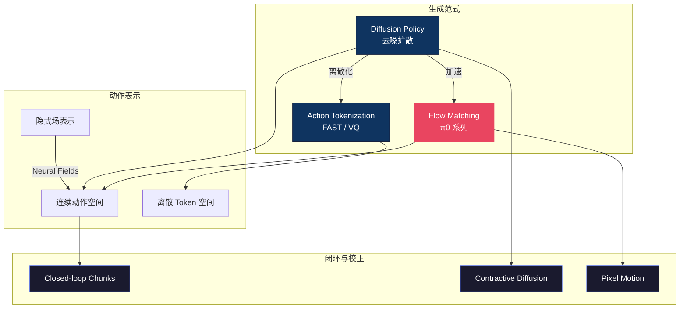

# 🌊 扩散与流匹配 — 动作生成主线总纲

> **机器人动作从哪里"生出来"？** 这个区域回答 VLA 最核心的工程问题：给定视觉观测和语言指令，如何把连续的机械臂轨迹"生成"出来。从 Diffusion Policy 开辟去噪范式，到 π0 的 Flow Matching 实现工业级速度，再到 FAST 式离散 tokenization 与 VLM 无缝对接——动作生成是 VLA 的"最后一公里"，决定了模型能不能真正驱动真实机器人。

---

## 概念关系图

---

## 研究主线

### 1. Diffusion Policy 家族 — 去噪生成动作

扩散策略将动作生成建模为"从噪声中逐步去噪"的过程，天然支持多模态动作分布（同一任务可能有多条有效轨迹）。这条路线奠定了 VLA 动作生成的基础范式。

- [Diffusion Policy 全面解析](diffusion_policy.md)
- [Contractive Diffusion — 鲁棒性改进](contractive_diffusion_policies_robust_action_diffusion_via_c_dissection.md)
- [CoMo — 从视频学连续运动](como_learning_continuous_latent_motion_from_internet_videos_dissection.md)

### 2. Flow Matching 家族 — π0 的加速之道

Flow Matching 用确定性 ODE 取代随机 SDE，采样速度快 5-10 倍，π0 系列以此为核心实现了实时控制。

- [π0 Flow Matching 深度解析](pi0_flow_matching.md)
- [Pixel Motion Diffusion — 像素空间流](pixel_motion_diffusion_is_what_we_need_for_robot_control_dissection.md)

### 3. Action Tokenization — 离散 vs 连续

将连续动作量化为离散 token，可以直接复用 LLM 的 next-token 架构。但 tokenization 会引入"压缩间隙"，影响精细操作精度。

- [动作表示方法综述](action_representations.md)
- [统一 Token 空间](vla_unified_token_space.md)
- [The Compression Gap — 离散化的代价](the_compression_gap_why_discrete_tokenization_limits_vision_dissection.md)
- [传统动作生成回顾](traditional_action_generation.md)

### 4. 闭环校正 — 执行中的实时修正

开环生成一段动作再执行容易累积误差；闭环方法在执行过程中持续观测、动态修正 action chunks。

- [Closed-loop Action Chunks](closed_loop_action_chunks_with_dynamic_corrections_for_train_dissection.md)
- [VLA 模型特性解剖](characterizing_vla_models_identifying_the_action_generation_dissection.md)

### 5. 替代表示 — 隐式场与像素运动

不直接输出关节角，而是用 Neural Implicit Fields 或像素级运动场间接表达动作意图，适合形态无关的迁移。

- [Neural Implicit Action Fields](neural_implicit_action_fields_from_discrete_waypoints_to_con_dissection.md)
- [Pixel Motion Diffusion](pixel_motion_diffusion_is_what_we_need_for_robot_control_dissection.md)

---

## 方法对比速查

| 方法 | 采样速度 | 多模态支持 | VLM 兼容性 | 精度 |
|------|---------|-----------|-----------|------|
| Diffusion Policy | 慢（~100步） | ✅ 天然支持 | ❌ 需额外 head | 高 |
| Flow Matching (π0) | 快（~10步） | ✅ 支持 | ❌ 需额外 head | 高 |
| 离散 Token (FAST) | 最快（1步） | ⚠️ 受限于码本 | ✅ next-token | 中 |
| Neural Implicit Fields | 中 | ✅ 连续场 | ❌ 独立架构 | 高 |

---

## 开放问题

1. **速度 vs 精度的 Pareto 前沿** — Flow Matching 和 Token 方案都在逼近，但精细操作（如穿针引线）仍暴露压缩间隙，最优的"混合生成"策略尚未找到。
2. **长时域动作一致性** — 现有方法多在 1-2 秒 chunk 内优化，如何保证 30 秒以上任务的全局轨迹连贯性仍是难题。
3. **跨形态动作空间统一** — 不同机器人的自由度差异巨大，统一 token 空间还是统一隐式场？社区尚无定论。

---

## 延伸阅读

- 🏛️ [VLA 核心架构](../vla-core/) — 动作生成在整体架构中的位置
- 🎮 [强化学习区](../rl/) — 用 RL 优化 Diffusion Policy 的后训练
- 🏗️ [基础理论区](../foundation/) — 扩散模型的数学基础
- 🗺️ [返回 Explorer's Map](../theory-readme.md)
