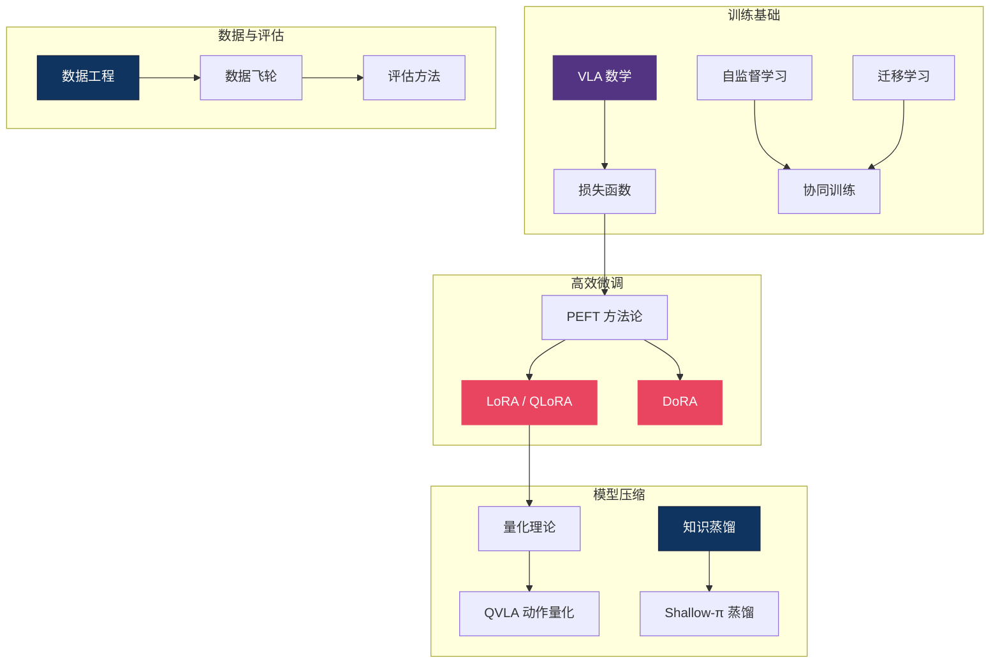

# 🏗️ 基础理论 — ML 工具箱主线总纲

> **VLA 不是从零发明的，它站在整个深度学习的肩膀上。** 这个区域是 VLA 研究者的"工具箱"：LoRA/DoRA 让你用 1% 的参数微调 7B 模型，量化让你在消费级 GPU 上跑推理，知识蒸馏让你把大模型装进机器人的边缘芯片。30 篇文章覆盖了从数学基础到评估方法的全栈，是其他所有区域的共同地基。

---

## 概念关系图

---

## 研究主线

### 1. 高效微调 — LoRA / DoRA / QLoRA

全量微调 7B+ 模型需要 8×A100，但 LoRA 系列方法只训练低秩增量矩阵，单卡即可。DoRA 进一步分解权重方向和幅度，在 VLA 任务上展现更好的泛化。

- [PEFT 与 LoRA 详解](peft_lora.md)
- [DoRA — 权重分解低秩适配](dora_weight_decomposed_low_rank_adaptation.md)
- [Instant LLM Updates — Doc-to-LoRA](instant_llm_updates_cost_amortization_doc_to_lora_text_to_lora_2026.md)

### 2. 模型压缩 — 蒸馏与量化

VLA 模型需要在机器人上实时运行（<100ms），知识蒸馏和量化是两条核心路线。Shallow-π 将 Flow VLA 蒸馏到浅层网络，QVLA 专门针对动作 head 做量化。

- [知识蒸馏](knowledge_distillation.md)
- [量化理论](quantization_theory.md)
- [QVLA — 动作中心量化](qvla_action_centric_quantization_2026.md)
- [Shallow-π — Flow VLA 蒸馏](shallow_pi_knowledge_distillation_flow_vla_2026.md)
- [Knowledge Insulation](knowledge_insulation.md)

### 3. 数据工程 — VLA 的燃料

数据质量决定 VLA 性能上限。数据飞轮（data flywheel）、跨模态数据利用（视频→动作标注）、RoboGene 的多样性驱动数据生成都在扩大可用数据池。

- [数据工程](data.md)
- [数据飞轮与跨模态](data_flywheel_and_cross_modal.md)
- [RoboGene — 多样性驱动的 VLA 预训练](robogene_boosting_vla_pre_training_via_diversity_driven_agen_dissection.md)
- [Point Bridge — 3D 表征跨域迁移](point_bridge_3d_representations_for_cross_domain_policy_lear_dissection.md)

### 4. 训练基础设施 — 数学、损失函数与注意力

理解 VLA 需要的数学背景、损失函数设计、注意力机制优化。

- [VLA 数学必备](math_for_vla.md)
- [VLA 损失函数手册](vla_loss_functions_handbook.md)
- [Flash Attention](flash_attention.md)
- [KV Cache 推理优化](kv_cache_llm_inference.md)
- [Transformer vs CNN](transformer_vs_cnn.md)
- [DCP — 凸性规则](dcp_convexity_rules.md)

### 5. 学习范式与评估

自监督学习、协同训练、迁移学习——这些范式决定了 VLA 如何利用异构数据。评估方法则确保我们在正确的维度上衡量进步。

- [自监督学习](self_supervised_learning.md)
- [协同训练](co_training.md)
- [迁移学习](transfer_learning.md)
- [评估方法](evaluation.md)
- [Lifelong Imitation Learning](lifelong_imitation_learning_with_multimodal_latent_replay_an_dissection.md)
- [RDT2-UMI — 零样本跨形态](rdt2_umi_zero_shot_cross_embodiment_2026.md)
- [NeurIPS 2025 洞察](neurips_2025_insights.md)
- [文献综述](literature_review.md)
- [论文索引](paper_index.md)
- [模块化 Pipeline 表格生成](modular_pipeline_table_generator.md)
- [统一相机位置编码](unified_camera_positional_encoding_for_controlled_video_gene_dissection.md)
- [VideoWeaver — 多视角视频迁移](videoweaver_multimodal_multi_view_video_to_video_transfer_fo_dissection.md)

---

## 微调/压缩方法速查

| 方法 | 可训练参数 | 显存需求 | 推理加速 | VLA 适用性 |
|------|-----------|---------|---------|-----------|
| Full Fine-tuning | 100% | 8×A100 | — | 仅大厂 |
| LoRA (r=16) | ~0.5% | 1×A100 | — | ✅ 最常用 |
| QLoRA (4-bit) | ~0.5% | 1×RTX4090 | — | ✅ 学术友好 |
| DoRA | ~0.6% | 1×A100 | — | ✅ 更好泛化 |
| 知识蒸馏 | 100% (学生) | 取决于学生 | ✅ 2-5× | ✅ 部署必备 |
| INT8 量化 | 0% | 50%↓ | ✅ 1.5-2× | ✅ 边缘部署 |

---

## 开放问题

1. **VLA 特异的 PEFT** — LoRA 为 NLP 设计，VLA 的动作 head（扩散/流匹配）与语言 head 结构不同。是否需要为动作生成定制低秩适配方法？
2. **数据 Scaling Law** — LLM 有 Chinchilla 定律，VLA 的数据-参数-性能关系仍不清楚。尤其是跨形态数据的"有效数据量"如何定义？
3. **评估的 ground truth** — 模拟器评估和真机评估的相关性低，社区缺乏公认的 VLA benchmark。

---

## 延伸阅读

- 🌊 [扩散与流匹配区](../diffusion-flow/) — 损失函数和数学在动作生成中的应用
- 🎮 [强化学习区](../rl/) — 训练范式的另一半
- 🏛️ [VLA 核心架构](../vla-core/) — 这些工具如何组装成完整模型
- 🗺️ [返回 Explorer's Map](../theory-readme.md)
