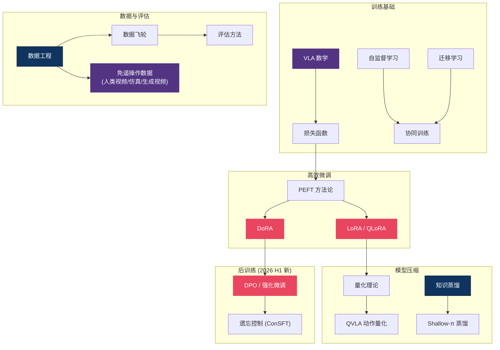

# 🏗️ 基础理论 — ML 工具箱主线总纲

> **VLA 不是从零发明的，它站在整个深度学习的肩膀上。** 这个区域是 VLA 研究者的"工具箱"：LoRA/DoRA 让你用 1% 的参数微调 7B 模型，量化让你在消费级 GPU 上跑推理，知识蒸馏让你把大模型装进机器人的边缘芯片。58 篇文章覆盖了从数学基础到评估方法的全栈，是其他所有区域的共同地基。

> **最后更新：2026-06-10。** 本次综合 4-6 月新进的 26 篇文章。两条线变化最大：**后训练**（SFT 正在被 RL 化、保守化的微调取代，见 §6）与**数据来源**（人类视频 / 仿真合成 / 生成视频三条免遥操作路线同时成势，见 §3）。同时新增 §7：跨具身的几何对齐。

---

## 概念关系图

---

## 研究主线

### 1. 高效微调 — LoRA / DoRA / QLoRA

全量微调 7B+ 模型需要 8×A100，但 LoRA 系列方法只训练低秩增量矩阵，单卡即可。DoRA 进一步分解权重方向和幅度，在 VLA 任务上展现更好的泛化。

**2026-06 更新**：DoRA 在 VLA 上终于有了首个系统性评估——CrossVLA 在 OpenVLA 上测得 DoRA+DPO 相对 SFT 平均 +10.4pp（LIBERO 4-suite），并用 surrogate log-prob 把 DPO 打通到流匹配范式（π0.5），意味着同一套后训练协议可以跨离散 AR 与连续流匹配两大架构使用。PEFT 的故事正在从"省参数"延伸到"作为后训练的载体"（详见 §6）。

- [PEFT 与 LoRA 详解](peft_lora.md)
- [DoRA — 权重分解低秩适配](dora_weight_decomposed_low_rank_adaptation.md)
- [Instant LLM Updates — Doc-to-LoRA](instant_llm_updates_cost_amortization_doc_to_lora_text_to_lora_2026.md)
- [CrossVLA — 跨范式后训练与推理优化](crossvla_cross_paradigm_post_training_and_inference_optimiza_dissection.md)

### 2. 模型压缩 — 蒸馏与量化

VLA 模型需要在机器人上实时运行（<100ms），知识蒸馏和量化是两条核心路线。Shallow-π 将 Flow VLA 蒸馏到浅层网络，QVLA 专门针对动作 head 做量化。

**2026-06 更新：压缩的对象从"权重"扩展到"语义监督"与"推理系统"。** 蒸馏不必只模仿动作数值——VLA-AD 用 VLM 离线标注的阶段锚点与方向信号做语义引导，把 OpenVLA-7B 蒸馏成 158M 学生（缩小 44×、推理快 3.28×，LIBERO 平均仅差 0.27%）。系统层面，OxyGen 把 KV Cache 改造成跨任务/跨帧的统一共享资源，在边缘设备上对 MoT VLA 多任务并行推理实现最高 3.7× 加速。但注意一个张力：本区旧文以 LLM 式 KV Cache 优化为主线，而 CrossVLA 的延迟解剖表明**前缀 KV 缓存对流匹配 VLA 基本无效**（denoise loop 占 78.6% 延迟）——流匹配架构的加速主战场在去噪步数与调度，不在缓存。基础模型侧，腾讯 HY-Embodied-0.5 证明 MoT 架构 + 视觉 latent tokens 可让 2B 模型在 22 个具身基准中 16 个超越 4B-7B 同侪，edge-ready 的"小脑"已可直接取用。

- [知识蒸馏](knowledge_distillation.md)
- [量化理论](quantization_theory.md)
- [QVLA — 动作中心量化](qvla_action_centric_quantization_2026.md)
- [Shallow-π — Flow VLA 蒸馏](shallow_pi_knowledge_distillation_flow_vla_2026.md)
- [Knowledge Insulation](knowledge_insulation.md)
- [VLA-AD — 离线语义引导蒸馏](offline_semantic_guidance_for_efficient_vision_language_acti_dissection.md)
- [OxyGen — VLA 统一 KV Cache 管理](oxygen_unified_kv_cache_management_for_vla_inference_under_m_dissection.md)
- [HY-Embodied-0.5 — 2B 具身基础模型](hy_embodied_05_embodied_foundation_models_for_real_world_age_dissection.md)

### 3. 数据工程 — VLA 的燃料

数据质量决定 VLA 性能上限。数据飞轮（data flywheel）、跨模态数据利用（视频→动作标注）、RoboGene 的多样性驱动数据生成都在扩大可用数据池。

**2026-06 更新：主叙事从"飞轮+多样性"转向"免遥操作"。** 4 月时本节的隐含假设是数据主要来自遥操作采集；4-6 月的证据把三条绕开遥操作的路线同时推成现实：

1. **人类视频路线**：Danfei Xu 把人类数据重新定义为"伪装成另一种形式的机器人数据"——核心标准只有可规模化与是否真实捕捉决策过程；EgoScale 用 20K+ 小时第一人称视频证明了 log-linear scaling law（R²=0.9983）。注意张力：loss 的 scaling 已证，但 loss→真机成功率这一环的斜率仍未量化。
2. **逼真仿真路线**：LEGS 用 3DGS 背景 + 物理网格前景生成免遥操作的人形数据，成本约为遥操作的 1/15，在 Unitree G1 上匹配甚至超越遥操作数据训练的 VLA；SimuScene 把物理仿真从"事后验证器"变成"诊断探针"，从单张照片重建仿真就绪的 3D 场景。
3. **生成视频路线**：RIGVid 证明仅靠 Kling 生成 + GPT-4o 过滤的视频（零真实演示）配合 6D 位姿追踪，可在真机上以 85% 成功率完成操作任务，与真实人类视频表现相当。

工程全链路（采集/格式/质量/规模/F1-F6 失效模式分类）现已沉淀为一篇枢纽指南，是本节的首选入口。

- [VLA 数据工程指南 — 从采集到训练的完整链路](vla_data_engineering_guide.md) ← 枢纽文章
- [人类数据是伪装的机器人数据 — Danfei Xu 访谈](human_data_sensorimotor_ghost_danfei_xu_interview_2026.md)
- [LEGS — 高斯泼溅世界中免遥操作微调人形 VLA](legs_fine_tuning_teleop_free_vlas_for_humanoid_loco_manipula_dissection.md)
- [SimuScene — 单图重建仿真就绪 3D 场景](simuscene_simulation_ready_compositional_3d_scene_reconstruc_dissection.md)
- [RIGVid — 模仿生成视频实现机器人操作](robotic_manipulation_by_imitating_generated_videos_without_p_dissection.md)
- [数据工程](data.md)
- [数据飞轮与跨模态](data_flywheel_and_cross_modal.md)
- [RoboGene — 多样性驱动的 VLA 预训练](robogene_boosting_vla_pre_training_via_diversity_driven_agen_dissection.md)
- [Point Bridge — 3D 表征跨域迁移](point_bridge_3d_representations_for_cross_domain_policy_lear_dissection.md)

### 4. 训练基础设施 — 数学、损失函数与注意力

理解 VLA 需要的数学背景、损失函数设计、注意力机制优化。

**2026-06 更新：两篇文章在动摇"理所当然"的数学假设。** 潜空间综述（500+ 文献）系统论证离散 token 是连续计算的信息瓶颈——VLA 的演进本质上是从语言空间向潜空间的迁移，这为理解"动作 token 化精度差、推理慢"的共同根因提供了统一框架。GeCO 则证明流匹配的时间条件可以去掉：学习稳态速度场后，推理从固定步数积分变成自适应优化（简单状态 NFE≈1），且场范数天然就是零成本的 OOD 检测信号——可即插即用替换 π0 系的 action head（注意：目前仅仿真验证）。

- [VLA 数学必备](math_for_vla.md)
- [VLA 损失函数手册](vla_loss_functions_handbook.md)
- [Flash Attention](flash_attention.md)
- [KV Cache 推理优化](kv_cache_llm_inference.md)
- [Transformer vs CNN](transformer_vs_cnn.md)
- [DCP — 凸性规则](dcp_convexity_rules.md)
- [潜空间综述 — 基础、演化、机制与能力](latent_space_survey_foundation_evolution_mechanism_ability_2026.md)
- [GeCO — 时间无条件流匹配](../diffusion-flow/generative_control_as_optimization_time_unconditional_flow_m_dissection.md)

### 5. 学习范式与评估

自监督学习、协同训练、迁移学习——这些范式决定了 VLA 如何利用异构数据。评估方法则确保我们在正确的维度上衡量进步。

**2026-06 更新（范式）**：三个值得记住的判断。其一，StarVLA-α 的系统性 ablation 对本区的"工具箱叙事"构成直接张力——当 VLM backbone 足够强（4B+）时，复杂 action head、大规模机器人预训练、本体感知输入的收益微乎其微且场景依赖（MLP head 即可拿下 LIBERO 98.8%）；工具箱仍然有用，但"只在有明确理由时才添加复杂性"应成为默认姿势。其二，表征学习的"预测目标"成为新变量：UniJEPA 证明连续未来特征预测 + 离散语言理解可在同一 MoT 架构中统一（无需 VQ 量化），MWM 证明世界模型预测语义掩码比预测 RGB 像素更利于策略鲁棒性——预测什么可能与架构选择同样重要。其三，in-context 模仿学习开始落地：Instant-Fold 用单个演示视频（零梯度更新）驱动柔性物体折叠并零样本迁移真机。

**2026-06 更新（评估）**：4 月开放问题里写"社区缺乏公认的 VLA benchmark"，RoboEval 给出部分回应——用 13 个行为指标（平滑度/协调性/碰撞率）+ 阶段进度替代单一成功率，且证明这些指标能在成功率饱和时区分策略质量。模拟-真机相关性问题仍未解决。

- [自监督学习](self_supervised_learning.md)
- [协同训练](co_training.md)
- [迁移学习](transfer_learning.md)
- [评估方法](evaluation.md)
- [StarVLA-α — 简化 VLA 系统的强基线](starvla_alpha_reducing_complexity_in_vision_language_action_dissection.md)
- [UniJEPA — 统一连续与离散表征学习](unijepa_enhancing_robot_policy_via_unified_continuous_and_di_dissection.md)
- [Mask World Model — 预测语义掩码而非像素](../world-model/mask_world_model_predicting_what_matters_for_robust_robot_po_dissection.md)
- [Instant-Fold — 柔性物体的 In-Context 模仿学习](instant_fold_in_context_imitation_learning_for_deformable_ob_dissection.md)
- [RoboEval — 结构化可扩展的操作评估](roboeval_where_robotic_manipulation_meets_structured_and_sca_dissection.md)
- [Lifelong Imitation Learning](lifelong_imitation_learning_with_multimodal_latent_replay_an_dissection.md)
- [RDT2-UMI — 零样本跨形态](rdt2_umi_zero_shot_cross_embodiment_2026.md)
- [NeurIPS 2025 洞察](neurips_2025_insights.md)
- [文献综述](literature_review.md)
- [论文索引](paper_index.md)
- [模块化 Pipeline 表格生成](modular_pipeline_table_generator.md)
- [统一相机位置编码](unified_camera_positional_encoding_for_controlled_video_gene_dissection.md)
- [VideoWeaver — 多视角视频迁移](videoweaver_multimodal_multi_view_video_to_video_transfer_fo_dissection.md)

### 6. 后训练 — 从 SFT 走向 RL 化与遗忘控制（2026 H1 新增）

4-6 月有六篇文章指向同一个判断：**VLA 后训练的默认范式正在从"SFT 适配下游任务"转向"RL 化 + 保守化"，核心矛盾是学新与忘旧**。三条子线：

- **遗忘控制**：ConSFT 发现 RL trust-region 中真正起作用的是 clipping 而非 advantage weighting，用 per-sample 置信度加权 loss 即可零数据、零额外网络地把流匹配 VLA 的基础能力保留率从 9% 提到 34%（π0）。LifeLong-RFT 走得更远——用 GRPO + 三维过程奖励替代 SFT，无需环境交互即可持续学习，LIBERO 上较 SFT +22%，20% 数据达到 SFT 全量效果（局限：仅离散动作模型，且奖励设计敏感）。
- **多样性保留**：BMD（ICML 2026）指出 RL 微调扩散/流策略会把多模态行为坍缩为单一奖励最大化模式，预训练策略的潜在噪声空间已"免费"编码多种行为模式，用互信息内在奖励即可在提升成功率的同时保留多样性（仅仿真验证）。
- **真实世界闭环**：LWD 首批在真实世界关闭"离线预训练→部署→持续改进"闭环——16 台机器人车队的 offline-to-online RL 在数小时交互后把平均成功率从 ~0.79 提到 0.95。RLFP 则把基础模型解耦为策略/价值/成功奖励三个正交先验注入 Actor-Critic，1 小时真实交互达 86% 成功率。

加上 §1 提到的 CrossVLA（跨范式 DPO），后训练的工具链已经覆盖偏好对齐、遗忘控制、多样性保留与在线改进四个象限——但它们彼此尚未组合验证，"标准后训练配方"仍未收敛。

- [ConSFT — 保守 SFT 保护流匹配 VLA 基础能力](preserving_foundational_capabilities_in_flow_matching_vlas_t_dissection.md)
- [LifeLong-RFT — 强化微调实现 VLA 持续学习](towards_long_lived_robots_continual_learning_vla_models_via_dissection.md)
- [BMD — 行为模式发现防止微调模式坍塌](behavioral_mode_discovery_for_fine_tuning_multimodal_generat_dissection.md)
- [LWD — 车队规模强化学习](learning_while_deploying_fleet_scale_reinforcement_learning_dissection.md)
- [RLFP — 基础模型先验驱动的 RL](reinforcement_learning_with_foundation_priors_let_the_embodi_dissection.md)

### 7. 跨具身的几何对齐 — 把动作放回 3D 世界（2026 H1 新增）

跨具身学习的瓶颈正在从"网络设计"（多 action head、潜在动作空间）**下沉到数据层的几何语义**：与其让网络绕过坐标系不一致，不如从源头统一。三个层次：

- **动作坐标系**：Unify Robot Actions in Camera Frame 把异构机器人动作统一转换到相机坐标系（动作与观测天然共享同一几何参考系），配合 CalibAll 自动外参标定，跨具身预训练达 SOTA。Dexterity-BEV 把自动驾驶的 BEV 表示引入 VLA——多视角 RGB-D 投影到共享鸟瞰坐标系后，同一模型权重可跨本体部署，且对相机位姿变化鲁棒；这条"2D VLM + 3D 对齐表示"路线比纯点云/体素更能继承 web-scale 预训练。
- **3D 表征预训练**：CLAMP（RSS 2026）用图像-文本-动作三模态对比学习 + 点云质心驱动的 STRING 相对位置编码，让跨视图 token 自动按 3D 空间邻近性关联，显著提升精密操作微调的样本效率。
- **全身/人形**：对齐从坐标系扩展到身体部位。HEX 用类人对齐的 9 槽位状态表示 + MoE 本体预测（先预测未来身体状态、再生成动作），在全尺寸人形上超越 π0.5 与 GR00T N1.5。MotionWAM 用 SONIC 统一全身运动潜变量 + Video DiT 单步中间去噪特征，把 WAM 推到 4.9 Hz 实时，9 个真实 G1 任务上较最强 VLA 基线 +32% 绝对成功率——双腿从"保持平衡的配角"变成任务参与者。

共同警示：这批工作几乎都只在少数平台验证（HEX 两种自研平台、MotionWAM 仅 G1），"几何对齐换泛化"的承诺还需要跨场景规模验证。

- [Unify Robot Actions in Camera Frame](unify_robot_actions_in_camera_frame_dissection.md)
- [Dexterity-BEV — BEV 对齐 3D 世界与动作](dexterity_bev_aligning_3d_world_and_actions_for_generalizabl_dissection.md)
- [CLAMP — 3D 多视图动作条件对比预训练](clamp_contrastive_learning_for_3d_multi_view_action_conditio_dissection.md)
- [HEX — 跨具身全身操控的类人对齐专家](hex_humanoid_aligned_experts_for_cross_embodiment_whole_body_dissection.md)
- [MotionWAM — 实时人形世界动作模型](../world-model/motionwam_towards_foundation_world_action_models_for_real_ti_dissection.md)

---

## 微调/压缩方法速查

| 方法 | 可训练参数 | 显存需求 | 推理加速 | VLA 适用性 |
|------|-----------|---------|---------|-----------|
| Full Fine-tuning | 100% | 8×A100 | — | 仅大厂 |
| LoRA (r=16) | ~0.5% | 1×A100 | — | ✅ 最常用 |
| QLoRA (4-bit) | ~0.5% | 1×RTX4090 | — | ✅ 学术友好 |
| DoRA | ~0.6% | 1×A100 | — | ✅ 更好泛化 |
| 知识蒸馏 | 100% (学生) | 取决于学生 | ✅ 2-5× | ✅ 部署必备 |
| INT8 量化 | 0% | 50%↓ | ✅ 1.5-2× | ✅ 边缘部署 |
| 语义引导蒸馏 (VLA-AD) | 100% (158M 学生) | 低 | ✅ 3.28× | ✅ 边缘部署，性能几乎无损 |
| DoRA + DPO (CrossVLA) | ~0.6% | 1×A100 | — | ✅ 后训练对齐，+10.4pp |
| ConSFT | 同 SFT | 同 SFT | — | ✅ 微调防遗忘，零额外开销 |

---

## 开放问题

1. **VLA 特异的 PEFT** — LoRA 为 NLP 设计，VLA 的动作 head（扩散/流匹配）与语言 head 结构不同。是否需要为动作生成定制低秩适配方法？*（2026-06 进展：[CrossVLA](crossvla_cross_paradigm_post_training_and_inference_optimiza_dissection.md) 给出 DoRA 在 VLA 上首个系统评估，但"为动作 head 定制的低秩适配"仍是空白；[GeCO](../diffusion-flow/generative_control_as_optimization_time_unconditional_flow_m_dissection.md) 提示 head 本身的结构假设——时间条件——都可以重新审视。）*
2. **数据 Scaling Law** — LLM 有 Chinchilla 定律，VLA 的数据-参数-性能关系仍不清楚。尤其是跨形态数据的"有效数据量"如何定义？*（2026-06 进展：EgoScale 证明人类第一人称视频遵循 log-linear scaling law（R²=0.9983），把成本瓶颈从机器人小时数转移到视频小时数——但"loss 下降→真机成功率提高"这一环的斜率仍未量化，见[数据工程指南](vla_data_engineering_guide.md)与 [Danfei Xu 访谈](human_data_sensorimotor_ghost_danfei_xu_interview_2026.md)。）*
3. **评估的 ground truth** — 模拟器评估和真机评估的相关性低，社区缺乏公认的 VLA benchmark。*（2026-06 进展：[RoboEval](roboeval_where_robotic_manipulation_meets_structured_and_sca_dissection.md) 用行为指标回应了"单一成功率不够"，但 sim-real 相关性仍未解决。）*
4. **复杂性的必要性**（新）— [StarVLA-α](starvla_alpha_reducing_complexity_in_vision_language_action_dissection.md) 的最小充分性假设（强 VLM + MLP head 即 SOTA）如果在更大范围成立，本区一半工具的适用边界都要重新标定。它的结论依赖 Qwen3-VL 强度与数据充足（>1000 条演示）——小模型、低数据场景下复杂性仍有价值，边界在哪里？
5. **世界模型该预测什么**（新）— [MWM](../world-model/mask_world_model_predicting_what_matters_for_robust_robot_po_dissection.md)（语义掩码）、[MotionWAM](../world-model/motionwam_towards_foundation_world_action_models_for_real_ti_dissection.md)（单步中间去噪特征）、[潜空间综述](latent_space_survey_foundation_evolution_mechanism_ability_2026.md)（连续潜表征）从三个方向同时否定"预测 RGB 像素"——但"控制最优的预测目标"还没有统一答案。

---

## 延伸阅读

- 🌊 [扩散与流匹配区](../diffusion-flow/) — 损失函数和数学在动作生成中的应用
- 🎮 [强化学习区](../rl/) — 训练范式的另一半
- 🏛️ [VLA 核心架构](../vla-core/) — 这些工具如何组装成完整模型
- 🗺️ [返回 Explorer's Map](../README.md)
