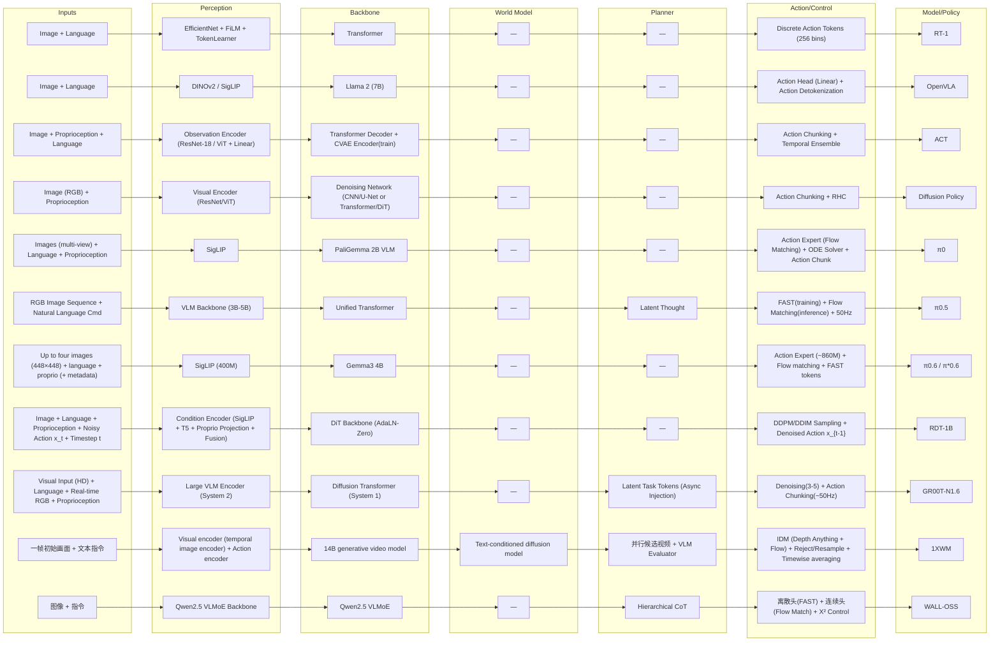

# 弹性模组化架构 Table 生成器（VLA Modular Pipelines）

这份文档的作用是：把 `theory/` 中**分散且格式不统一**的架构描述，抽象成一张“可拼装”的 **pipeline 表**与一张**路径图**，用来快速对齐不同 VLA/具身模型的模块分工与组合方式。

使用方式（建议）：
- **先看 `Stages`**：它是默认的可组合阶段集合（4–6 段）。如果你在读某个模型时发现它强调了 Memory / Safety / Tooling 等，可以把它拆成独立 stage（但不要过细到实现细节）。
- **再看 Table**：每一行代表一条“从输入到动作”的可运行路径；同一模型若有明显不同装配方式，最多保留 1–3 行代表路径。
- **最后看 Mermaid**：只画 Table 里出现过的节点与连线，用来肉眼检查“是否真的是一条端到端管线”，以及不同路径在哪个 stage 分叉。

重要约束（避免误导）：
- **禁止脑补**：只有当 `theory/` 文本（同段落/同图）明确写出模块名或强指向时才填写；否则用 `—`，并在 `Missing Info` 里列出需要补的字段与检索关键词。
- **节点命名尽量保留原文**：例如 `π0`、`PaliGemma 2B VLM`、`Action Expert` 等，不随意改名为同义词，避免丢失可追溯性。

**A) Stages + Table**

**Stages:** `Inputs → Perception → Backbone → World Model → Planner → Action/Control`

| Inputs | Perception | Backbone | World Model | Planner | Action/Control | Model/Policy | Notes |
|---|---|---|---|---|---|---|---|
| Image Language | EfficientNet + FiLM TokenLearner | Transformer | — | — | Discrete Action Tokens (256 bins) | RT-1 | 经典 token 化控制路径，强调离散动作与高效推理。 |
| Image Language | DINOv2 / SigLIP | Llama 2 (7B) | — | — | Action Head (Linear) Action Detokenization | OpenVLA | VLM 主干 + 专用动作头，非 diffusion/flow。 |
| Image Proprioception Language | Observation Encoder (ResNet-18 / ViT + Linear) | Transformer Decoder CVAE Encoder (train) | — | — | Action Chunking Temporal Ensemble | ACT | CVAE + chunk 方案，低延迟、闭环友好。 |
| Image (RGB) Proprioception | Visual Encoder (ResNet/ViT) | Denoising Network (CNN/U-Net or Transformer/DiT) | — | — | Action Chunking Horizon Control (RHC) | Diffusion Policy | 扩散生成动作，强多峰分布表达。 |
| Images (multi-view) Language Proprioception | SigLIP | PaliGemma 2B VLM | — | — | Action Expert (Flow Matching) ODE Solver (Euler/RK4) Action Chunk | π0 | VLM 条件 + Flow/ODE 动作生成。 |
| RGB Image Sequence Natural Language Cmd | VLM Backbone (3B-5B) | Unified Transformer | — | Latent Thought | FAST Tokenizer (training) Flow Matching (inference) 50Hz Action Output | π0.5 | 训练离散、推理连续的混合架构。 |
| Up to four images (448×448): base camera + up to two wrist cameras + optional backward camera tokenized language prompt tokenized proprioceptive states (optional) conditioning metadata | SigLIP (400M) | Gemma3 4B | — | Language subtasks (high-level subtask prediction) | Action Expert (~860M) Flow matching (continuous actions) FAST action tokens (discretized actions) | π0.6 / π*0.6 | Hierarchical（subtasks + action）；π*0.6 通过 RECAP 学习“从经验变强”。 |
| Image Language Proprioception Noisy Action x_t Timestep t | Condition Encoder (SigLIP + T5 + Proprio Projection + Fusion) | DiT Backbone (AdaLN-Zero Transformer) | — | — | DDPM/DDIM Denoising Sampling Denoised Action x_{t-1} | RDT-1B | 条件编码 + DiT 扩散基础模型路径。 |
| Visual Input (HD) Language Instruction Real-time RGB Proprioception/Joint States | Large VLM Encoder (System 2) | Diffusion Transformer (System 1, AdaLN-Zero) | — | Latent Task Tokens (Asynchronous Injection) | Denoising Process (3-5 Steps) Action Chunking Output (~50Hz) | GR00T-N1.6 | 异步双系统（慢语义 + 快控制）。 |
| 一帧初始画面 文本指令 | Visual encoder (temporal image encoder) Action encoder | 14B generative video model | Text-conditioned diffusion model | 并行候选视频 + VLM Evaluator 选优 | IDM (two-image predictor, sliding window W=8) Depth Anything backbone + flow matching head rejection sampling + timewise averaging | 1XWM | 世界模型生成未来视频 → IDM 像素到动作；best-of-N 可选优。 |
| 图像 指令 | Qwen2.5 VLMoE Backbone | Qwen2.5 VLMoE | — | Hierarchical CoT (Reasoning → Sub-goal → Action Synthesis) | 离散头 (FAST Token) 连续头 (Flow Match) X² Control | WALL-OSS | 分层 CoT + 双 head（离散规划/连续控制）。 |

**B) Mermaid**

**C) Missing Info**

- **RT-1 — World Model**：无显式 world model；RT-1 是端到端 policy（images + instruction → tokenized actions）。来源：[`rt1.pdf`](https://robotics-transformer1.github.io/assets/rt1.pdf)
- **OpenVLA — Planner**：无显式 planner/sub-goal 模块；fused visual encoder（SigLIP + DINOv2）+ projector + Llama 2 7B，预测 tokenized actions 并解码执行。来源：[OpenVLA 项目页](https://openvla.github.io/) / [arXiv:2406.09246](https://arxiv.org/abs/2406.09246)
- **π0.6 / π*0.6 — Inputs / Perception / Planner**：最多四路 448×448 相机 + tokenized language + tokenized proprio（可选 metadata）；SigLIP (400M)；骨干初始化自 Gemma3 4B；保留 high-level subtask prediction。来源：[`π0.6 Model Card`](https://website.pi-asset.com/pi06star/PI06_model_card.pdf)
- **RDT-1B — Planner**：未描述显式 planner；扩散去噪生成 denoised action chunk，条件为 image + language。来源：[RDT 项目页（Framework）](https://rdt-robotics.github.io/rdt-robotics/) / [arXiv:2410.07864](https://arxiv.org/abs/2410.07864)
- **1XWM — Perception / Backbone / World Model / IDM**：visual+action encoder（temporal image encoder）；world model backbone 为 text-conditioned diffusion model（built upon 14B generative video model）；IDM 为 Depth Anything backbone + flow matching head（W=8 sliding window），并用于 rejection sampling 与 timewise averaging。来源：[1X 技术报告 (PDF)](https://www.1x.tech/1x-world-model.pdf) / [1X 官方博客](https://www.1x.tech/discover/world-model-self-learning)
