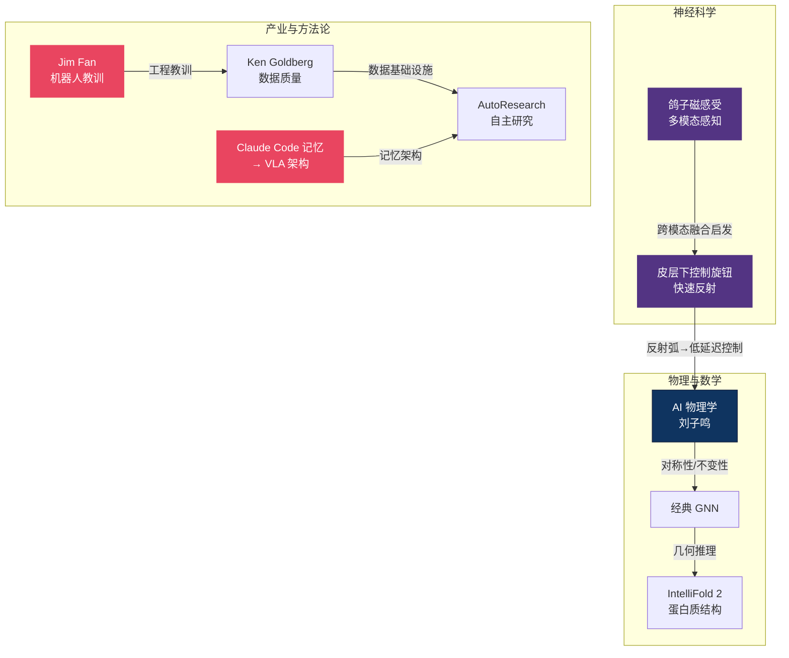

# 🔬 前沿跨域 — 灵感之源主线总纲

> **VLA 的下一个突破可能不在机器人论文里，而在鸽子的磁感导航或蛋白质折叠的几何推理中。** 这个区域收集了来自神经科学、物理学、产业洞察和跨学科架构的灵感种子。9 篇文章不追求直接的工程应用，而是提供"换一个角度想问题"的思维工具——当 VLA 主流方法遇到瓶颈时，答案往往在跨域。

---

## 概念关系图

---

## 研究主线

### 1. 神经科学 → 具身 AI

生物体如何处理多模态感知和快速运动控制？鸽子用前庭-电感系统实现磁场导航，人类皮层下系统实现 <50ms 的反射——这些机制对 VLA 的低延迟控制和多模态融合有直接启发。

- [鸽子磁感受 — 前庭-电感多模态](pigeon_magnetoreception_vestibular_electrosense.md)
- [皮层下控制旋钮 — 神经肽与时序性](subcortical_control_knobs_neuropeptides_temporality.md)

### 2. AI 物理学 — 对称性与不变性

刘子鸣的"AI 物理学"论纲提出：深度学习的成功可以用物理学的语言解释（对称性、重正化群、相变）。这套框架对理解 VLA 的 scaling law 和泛化边界有理论价值。

- [AI 物理学 — 刘子鸣](physics_of_ai_liuziming.md)
- [经典 GNN 强基线 — 节点分类](classic_gnns_strong_baselines_node_classification_2024.md)
- [IntelliFold 2 — 超越 AlphaFold3](intellifold_2_surpassing_alphafold3_structural_consistency_2026.md)

### 3. 产业洞察 — 从失败中学习

Jim Fan 的 2025 机器人教训和 Ken Goldberg 对数据质量基础设施的强调，代表了产业界的务实视角：不是模型不够大，而是数据不够好、工程不够实。

- [Jim Fan — 2025 机器人教训](jim_fan_2025_robotics_lessons.md)
- [Ken Goldberg — 数据质量与基础设施](ken_goldberg_data_quality_infrastructure.md)

### 4. 跨域架构迁移

其他 AI 领域的架构设计可以直接启发 VLA。Claude Code 的记忆架构对 VLA 的长期记忆有参考价值，AutoResearch 的自主研究范式可能改变 VLA 的实验方法论。

- [Claude Code 记忆架构 → VLA 应用](claude_code_memory_architecture_applied_to_vla_2026.md)
- [AutoResearch — 自主研究组织](autoresearch_agentic_research_org_single_gpu_llm_training_2026.md)

---

## 跨域灵感速查

| 来源领域 | 核心启发 | VLA 映射 | 代表文章 |
|---------|---------|---------|---------|
| 神经科学 · 前庭系统 | 多感官融合的生物方案 | 触觉-视觉-本体感知融合 | 鸽子磁感受 |
| 神经科学 · 皮层下 | <50ms 反射控制 | 低延迟安全反射层 | 皮层下控制旋钮 |
| 理论物理 | 对称性 → 泛化 | VLA 的不变性归纳偏置 | AI 物理学 |
| 蛋白质折叠 | 几何一致性推理 | 3D 空间推理 | IntelliFold 2 |
| LLM Agent | 层级记忆架构 | VLA 长期任务记忆 | Claude Code 记忆 |
| 产业实战 | 数据 > 模型 | 数据飞轮工程 | Ken Goldberg |

---

## 开放问题

1. **生物学启发的可操作性** — 神经科学的发现很"酷"，但如何系统性地将其转化为可实现的 VLA 模块？目前多停留在类比层面。
2. **AI 的统一物理理论** — 对称性和 scaling law 能否预测 VLA 的性能边界？目前缺乏针对 VLA 的实证验证。
3. **跨域知识的自动化迁移** — 能否用 AI agent（如 AutoResearch）自动发现其他领域对 VLA 有价值的论文和方法？

---

## 延伸阅读

- 🏛️ [VLA 核心架构](../vla-core/) — 跨域灵感如何融入主线架构
- 🤚 [触觉感知区](../tactile/) — 生物触觉 → 机器人触觉
- 🧠 [推理与规划区](../reasoning/) — 层级控制与神经科学的连接
- 🏗️ [基础理论区](../foundation/) — GNN、对称性的数学基础
- 🗺️ [返回 Explorer's Map](../theory-readme.md)
