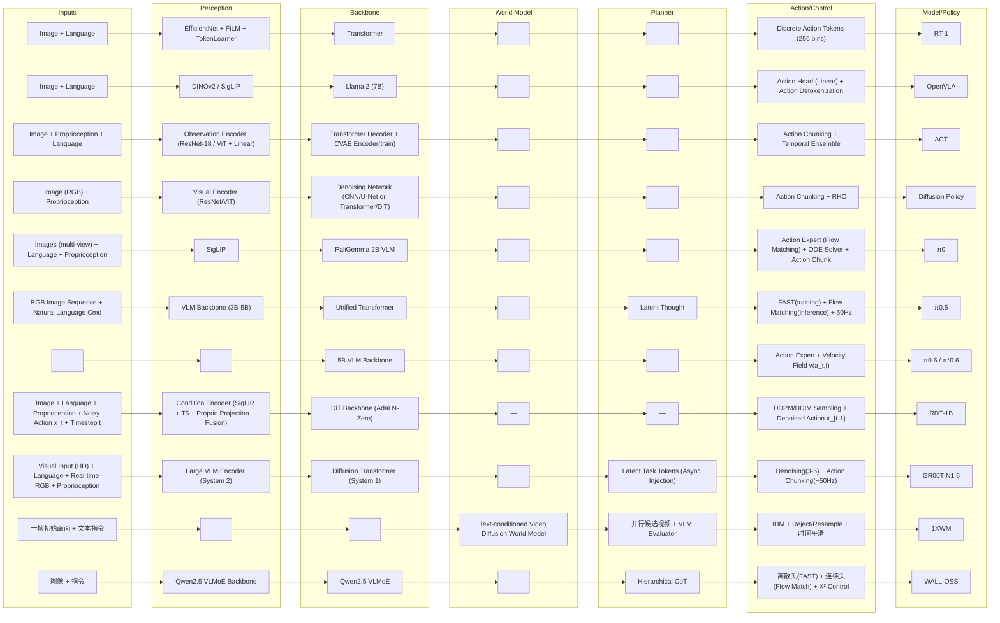

# 弹性模组化架构 Table 生成器（VLA Modular Pipelines）

**A) Stages + Table**

**Stages:** `Inputs → Perception → Backbone → World Model → Planner → Action/Control`

| Inputs | Perception | Backbone | World Model | Planner | Action/Control | Model/Policy | Notes |
|---|---|---|---|---|---|---|---|
| Image Language | EfficientNet + FiLM TokenLearner | Transformer | — | — | Discrete Action Tokens (256 bins) | RT-1 | 经典 token 化控制路径，强调离散动作与高效推理。 |
| Image Language | DINOv2 / SigLIP | Llama 2 (7B) | — | — | Action Head (Linear) Action Detokenization | OpenVLA | VLM 主干 + 专用动作头，非 diffusion/flow。 |
| Image Proprioception Language | Observation Encoder (ResNet-18 / ViT + Linear) | Transformer Decoder CVAE Encoder (train) | — | — | Action Chunking Temporal Ensemble | ACT | CVAE + chunk 方案，低延迟、闭环友好。 |
| Image (RGB) Proprioception | Visual Encoder (ResNet/ViT) | Denoising Network (CNN/U-Net or Transformer/DiT) | — | — | Action Chunking Horizon Control (RHC) | Diffusion Policy | 扩散生成动作，强多峰分布表达。 |
| Images (multi-view) Language Proprioception | SigLIP | PaliGemma 2B VLM | — | — | Action Expert (Flow Matching) ODE Solver (Euler/RK4) Action Chunk | π0 | VLM 条件 + Flow/ODE 动作生成。 |
| RGB Image Sequence Natural Language Cmd | VLM Backbone (3B-5B) | Unified Transformer | — | Latent Thought | FAST Tokenizer (training) Flow Matching (inference) 50Hz Action Output | π0.5 | 训练离散、推理连续的混合架构。 |
| — | — | 5B VLM Backbone | — | — | Action Expert Velocity Field v(a_t,t) | π0.6 / π*0.6 | 引入 Action Expert 与 Recap（offline RL）后训练。 |
| Image Language Proprioception Noisy Action x_t Timestep t | Condition Encoder (SigLIP + T5 + Proprio Projection + Fusion) | DiT Backbone (AdaLN-Zero Transformer) | — | — | DDPM/DDIM Denoising Sampling Denoised Action x_{t-1} | RDT-1B | 条件编码 + DiT 扩散基础模型路径。 |
| Visual Input (HD) Language Instruction Real-time RGB Proprioception/Joint States | Large VLM Encoder (System 2) | Diffusion Transformer (System 1, AdaLN-Zero) | — | Latent Task Tokens (Asynchronous Injection) | Denoising Process (3-5 Steps) Action Chunking Output (~50Hz) | GR00T-N1.6 | 异步双系统（慢语义 + 快控制）。 |
| 一帧初始画面 文本指令 | — | — | Text-conditioned Video Diffusion World Model | 并行候选视频 + VLM Evaluator 选优 | Inverse Dynamics Model (IDM) Reject/Resample 时间平滑 | 1XWM | 先“想象未来视频”，再逆动力学映射动作。 |
| 图像 指令 | Qwen2.5 VLMoE Backbone | Qwen2.5 VLMoE | — | Hierarchical CoT (Reasoning → Sub-goal → Action Synthesis) | 离散头 (FAST Token) 连续头 (Flow Match) X² Control | WALL-OSS | 分层 CoT + 双 head（离散规划/连续控制）。 |

**B) Mermaid**

**C) Missing Info**

- `RT-1` 缺 `World Model`：需要在 `theory/` 中找到其是否包含显式环境动态建模（关键词：world model / latent dynamics / predictive model）。\n+- `OpenVLA` 缺 `Planner`：需要在 `theory/vla_arch.md` 或 OpenVLA 专文中找到显式任务分解/规划模块描述（关键词：planner / sub-goal / reasoning chain）。\n+- `π0.6 / π*0.6` 缺 `Inputs`：需要在 `theory/pi0_6_dissection.md` 或 `theory/pi0_code_analysis.md` 找到完整输入模态定义（图像/语言/本体感知）。\n+- `π0.6 / π*0.6` 缺 `Perception`：需要补充其具体视觉编码器或条件编码器名称（关键词：vision encoder / SigLIP / tokenizer / condition encoder）。\n+- `RDT-1B` 缺 `Planner`：需要在 `theory/rdt.md` 或 `theory/frontier/rdt2_umi_zero_shot_cross_embodiment_2026.md` 查找是否有显式规划层（关键词：planner / hierarchical / sub-goal）。\n+- `1XWM` 缺 `Perception`：需要在 `theory/frontier/one_x_world_model.md` 补充世界模型前端编码器细节（关键词：vision encoder / text encoder / tokenizer）。\n+- `1XWM` 缺 `Backbone`：需要补充世界模型主干的具体网络命名（关键词：video diffusion backbone / transformer / U-Net）。\n+
