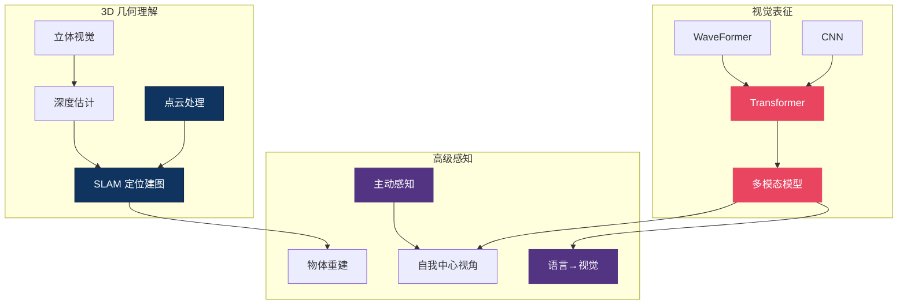

# 👁️ 视觉感知 — 3D 理解主线总纲

> **机器人要操作物体，首先得知道物体在哪、长什么样、离自己多远。** 这个区域覆盖 VLA 的"眼睛"：从点云和 SLAM 的几何理解，到 Transformer 和 CNN 的视觉表征，再到语言如何反过来塑造感知。20 篇文章构成了 VLA 感知层的完整技术栈——没有好的感知，再强的策略也是"盲人摸象"。
>
> **最后更新：2026-06-10。** 4-6 月最大的变化：感知层从"工具箱"升格为"第一性原理战场"——3D 表征被论证为具身智能的真正瓶颈（见新增第 5 节），静态预训练编码器（SigLIP/DINOv2）的统治地位首次受到动力学感知预训练的系统性挑战（见第 2 节）。

---

## 概念关系图

---

## 研究主线

### 1. 3D 理解 — 点云、SLAM 与立体视觉

机器人操作发生在 3D 空间，仅靠 2D 图像不够。点云提供精确几何，SLAM 提供全局定位，立体匹配提供实时深度。

- [感知技术综述](perception_techniques.md)
- [点云与 SLAM](pointcloud_slam.md)
- [空间数学基础](spatial_math.md)
- [Fast Foundation Stereo — 实时零样本立体匹配](fast_foundation_stereo_real_time_zero_shot_stereo_matching_2026.md)
- [状态估计](state_estimation.md)

### 2. 视觉表征 — 给 VLA 选择正确的"眼睛"

Transformer 已成为 VLA 视觉编码器的主流（ViT、SigLIP），但 CNN 在速度和局部特征上仍有优势。WaveFormer 和 Flash Attention 代表了架构创新的两个方向。

**4 月时的判断是"VLA 直接借用 VLM 的视觉编码器"；5 月底的 DynaFLIP 表明这正是短板**：静态预训练的 CLIP/DINOv2/SigLIP 擅长回答"画面里有什么"，却不编码"动作会让画面怎么变"。DynaFLIP 用图像跃迁 + 语言 + 3D 流的三模态单纯形对齐预训练编码器，推理时仅需单帧——冻结编码器在 LIBERO frozen 设置下 41.5% vs SigLIP 30.5%，真实世界 OOD 语义扰动下 75% vs 30%。"训练时多模态、推理时单帧"的不对称设计，让动力学感知不增加任何部署成本。判断：把运动理解推回感知层，是比换更大 VLM backbone 更划算的路线，但其 260K 轨迹的预训练规模与百万级图像预训练相比仍是早期证据。

- [DynaFLIP — 三模态动力学引导表征](dynaflip_rethinking_robotics_perception_via_tri_modal_dynami_dissection.md)

- [Transformer vs CNN](../foundation/transformer_vs_cnn.md)
- [多模态模型](multimodal_models.md)
- [WaveFormer — 波动方程视觉](waveformer_wave_equation_vision_2026.md)
- [Flash Attention](../foundation/flash_attention.md)
- [DVGT-2 — 视觉几何动作模型](dvgt_2_vision_geometry_action_model_for_autonomous_driving_a_dissection.md)

### 3. 主动与自适应感知 — 机器人的"眼球运动"

人类不是被动接收视觉信息，而是主动移动眼睛和头部聚焦关键区域。Look-Zoom-Understand 和 EgoDemoGen 探索了这种能力。

5-6 月这条线沿两个方向同时延伸。**硬件端**，FingerViP 把"眼球"直接长到指尖：5 个指尖嵌入式相机 + 关节电流，把相机放进遮挡源内部，接触附近感知（contact-proximal）取代全局感知，4 个重度遮挡/狭小空间真实任务总成功率 80.8%——核心洞见是"不是更多相机，而是更聪明的相机位置"。**推理端**，SceneDiver 证明"一步聚焦"无效：有效聚焦本身需要先用场景图理解全局、再逐子场景自主探索验证的两阶段推理，在操作/导航上带来 10-16pp 提升，且蒸馏成适配器后开销仅 2.64%。判断：主动感知正在从"额外的相机自由度"泛化为"感知即推理"——聚焦是认知过程而非注意力机制。

- [Look-Zoom-Understand — 机器人眼球](look_zoom_understand_the_robotic_eyeball_for_embodied_percep_dissection.md)
- [FingerViP — 指尖视觉灵巧操作](fingervip_learning_real_world_dexterous_manipulation_with_fi_dissection.md)
- [SceneDiver — 场景图引导的焦点计划](dive_into_the_scene_breaking_the_perceptual_bottleneck_in_vi_dissection.md)
- [EgoDemoGen — 自我中心示教生成](egodemogen_egocentric_demonstration_generation_for_viewpoint_dissection.md)
- [PAM — 姿态外观运动引擎](pam_a_pose_appearance_motion_engine_for_sim_to_real_hoi_vide_dissection.md)
- [ArtPro — 关节物体自监督重建](artpro_self_supervised_articulated_object_reconstruction_wit_dissection.md)

### 4. 跨模态效应 — 语言如何塑造视觉

语言指令不仅驱动动作，还会反过来调制视觉注意力——"拿红色的杯子"会让感知系统"看到"红色物体。这种 top-down 效应对 VLA 的 grounding 至关重要。

- [Language Shapes Perception](language_shapes_perception.md)
- [Zero-1-to-3 — 单图到 3D](zero_1_to_3_zero_shot_one_image_to_3d_object_2023.md)
- [DKT — 透明物体感知](dkt_transparency_perception.md)

### 5. 3D 表征优先 — 从工具箱到第一性原理（2026 Q2 新主线）

4 月 14 日 VGA 与 Spark 2.0 同日发布，从"智能端"和"基础设施端"指向同一个结论：**具身智能的瓶颈不在策略，在 3D 表征**——语言表征（GPT）和图像表征（CLIP/DINOv2）已经解决，"3D 世界的 GPT-3"还没出现。最强的证据是 VGA 的消融：random init 6.4% vs VGGT 3D 预训练 98.1%，92 个百分点的差距说明 3D 预训练不是锦上添花、它就是全部——与 BERT 时代"预训练即一切"的发现同构。基础设施端，Spark 2.0（World Labs，MIT 开源）用 LoD 泼溅树 + .RAD 流式格式 + 虚拟显存分页，让 1 亿+ 泼溅的 3DGS 场景在手机浏览器（WebGL2）上实时渲染——它对 3D 的意义类似 HTTP 对文本：内容能流动，数据才会爆炸，基础模型才有粮草。

判断：这条主线把本总纲此前分散的点云/SLAM/立体匹配"工具箱"统一成一个赌注——**赌 3D 几何 backbone 最终替代（或至少并列于）VLM 作为 VLA 的感知核心**。最大的未知是 3D scaling law：VGA 只有 36K 场景一个数据点，百万级 3D 场景从哪来（Spark 用户扫描？仿真生成？自动驾驶 LiDAR？）仍是开放问题；语义/常识推理是否会随语言降格为条件输入而被牺牲，也未有答案。

- [3D 优先 — VGA × Spark 2.0 的表征革命](3d_first_principle_vga_spark_embodied_representation_revolution.md)
- [Spark 2.0 — 3DGS 网页渲染基础设施](spark_2_0_3dgs_web_renderer_world_labs_2026.md)

---

## 感知方法速查

| 方法 | 输入 | 输出 | 实时性 | 适用场景 |
|------|------|------|--------|---------|
| 点云 + SLAM | RGB-D / LiDAR | 3D 地图 + 位姿 | ⚠️ 中 | 导航、场景级操作 |
| 立体匹配 | 双目 RGB | 深度图 | ✅ 快 | 桌面级操作 |
| ViT 编码器 | RGB | 语义特征 | ✅ 快 | VLA 视觉 backbone |
| 主动感知 | RGB + 相机控制 | 自适应视角 | ⚠️ 需额外自由度 | 遮挡/精细操作 |
| 动力学感知编码器 | 单帧 RGB（训练时三模态） | 含动力学先验的特征 | ✅ 与 CLIP/DINOv2 同 | OOD 泛化/控制相关表征 |
| 指尖相机阵列 | 5× 指尖 RGB + 关节电流 | 接触附近多视角 | ✅ 30Hz 视觉 / 100Hz 控制 | 重度遮挡/狭小空间灵巧操作 |
| 3DGS 流式渲染 | 3DGS 场景（.RAD） | 网页端实时 3D 可视化 | ✅ 手机可跑 | 大场景地图部署/远程审查 |

---

## 开放问题

1. **视觉表征的 VLA 特异性** — 当前 VLA 多直接借用 VLM 的视觉编码器（如 SigLIP），但机器人操作对空间精度的要求远高于图文匹配。是否需要 robotics-native 的视觉预训练？
   **6 月更新**：答案正在收敛为"需要，且已有两条可行路线"——DynaFLIP 的动力学感知预训练（冻结编码器系统性超过 SigLIP/DINOv2）与 VGA 的 3D 几何预训练（random init 6.4% → 98.1%）。问题从"是否需要"变成"数据从哪来、scaling law 是什么"。
2. **动态场景的实时 3D** — 家庭环境中物体频繁移动，传统 SLAM 假设静态场景。动态 SLAM 和 neural scene representation 能否达到操作所需的速度和精度？
3. **遮挡推理** — 物体被遮挡时如何感知？人类靠经验"补全"，VLA 缺乏这种 3D 常识推理能力。
   **6 月更新**：出现了两个互补的局部解——FingerViP 的硬件解（把相机放进遮挡源内部）和 SceneDiver 的推理解（先全局场景图、再自主探索的焦点计划）。但"完全遮挡 + 经验补全"仍未解决：SceneDiver 在目标完全被遮挡时失效，FingerViP 在物体被手心完全包裹时全部视角失明。
4. **3D 预训练的数据与 scaling law** — 3D 表征若是下一个突破口（第 5 节），百万到十亿级 3D 场景从哪来？3D 是否存在类似语言的 scaling law？目前只有 VGA 的 36K 场景单点，第一个测出曲线的团队将获得巨大先发优势。

---

## 延伸阅读

- 🤚 [触觉感知区](../tactile/) — 视觉看不到的信息，触觉来补
- 🌍 [世界模型区](../world-model/) — 从感知到预测
- 🏗️ [基础理论区](../foundation/) — Transformer / Attention 机制详解
- 🗺️ [返回 Explorer's Map](../README.md)
