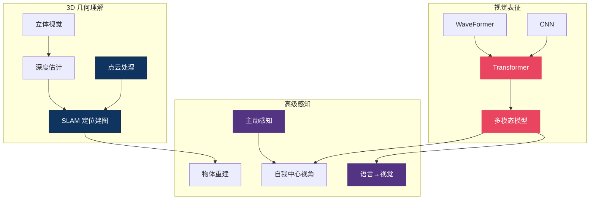

# 👁️ 视觉感知 — 3D 理解主线总纲

> **机器人要操作物体，首先得知道物体在哪、长什么样、离自己多远。** 这个区域覆盖 VLA 的"眼睛"：从点云和 SLAM 的几何理解，到 Transformer 和 CNN 的视觉表征，再到语言如何反过来塑造感知。15 篇文章构成了 VLA 感知层的完整技术栈——没有好的感知，再强的策略也是"盲人摸象"。

---

## 概念关系图

---

## 研究主线

### 1. 3D 理解 — 点云、SLAM 与立体视觉

机器人操作发生在 3D 空间，仅靠 2D 图像不够。点云提供精确几何，SLAM 提供全局定位，立体匹配提供实时深度。

- [感知技术综述](perception_techniques.md)
- [点云与 SLAM](pointcloud_slam.md)
- [空间数学基础](spatial_math.md)
- [Fast Foundation Stereo — 实时零样本立体匹配](fast_foundation_stereo_real_time_zero_shot_stereo_matching_2026.md)
- [状态估计](state_estimation.md)

### 2. 视觉表征 — 给 VLA 选择正确的"眼睛"

Transformer 已成为 VLA 视觉编码器的主流（ViT、SigLIP），但 CNN 在速度和局部特征上仍有优势。WaveFormer 和 Flash Attention 代表了架构创新的两个方向。

- [Transformer vs CNN](../foundation/transformer_vs_cnn.md)
- [多模态模型](multimodal_models.md)
- [WaveFormer — 波动方程视觉](waveformer_wave_equation_vision_2026.md)
- [Flash Attention](../foundation/flash_attention.md)
- [DVGT-2 — 视觉几何动作模型](dvgt_2_vision_geometry_action_model_for_autonomous_driving_a_dissection.md)

### 3. 主动与自适应感知 — 机器人的"眼球运动"

人类不是被动接收视觉信息，而是主动移动眼睛和头部聚焦关键区域。Look-Zoom-Understand 和 EgoDemoGen 探索了这种能力。

- [Look-Zoom-Understand — 机器人眼球](look_zoom_understand_the_robotic_eyeball_for_embodied_percep_dissection.md)
- [EgoDemoGen — 自我中心示教生成](egodemogen_egocentric_demonstration_generation_for_viewpoint_dissection.md)
- [PAM — 姿态外观运动引擎](pam_a_pose_appearance_motion_engine_for_sim_to_real_hoi_vide_dissection.md)
- [ArtPro — 关节物体自监督重建](artpro_self_supervised_articulated_object_reconstruction_wit_dissection.md)

### 4. 跨模态效应 — 语言如何塑造视觉

语言指令不仅驱动动作，还会反过来调制视觉注意力——"拿红色的杯子"会让感知系统"看到"红色物体。这种 top-down 效应对 VLA 的 grounding 至关重要。

- [Language Shapes Perception](language_shapes_perception.md)
- [Zero-1-to-3 — 单图到 3D](zero_1_to_3_zero_shot_one_image_to_3d_object_2023.md)
- [DKT — 透明物体感知](dkt_transparency_perception.md)

---

## 感知方法速查

| 方法 | 输入 | 输出 | 实时性 | 适用场景 |
|------|------|------|--------|---------|
| 点云 + SLAM | RGB-D / LiDAR | 3D 地图 + 位姿 | ⚠️ 中 | 导航、场景级操作 |
| 立体匹配 | 双目 RGB | 深度图 | ✅ 快 | 桌面级操作 |
| ViT 编码器 | RGB | 语义特征 | ✅ 快 | VLA 视觉 backbone |
| 主动感知 | RGB + 相机控制 | 自适应视角 | ⚠️ 需额外自由度 | 遮挡/精细操作 |

---

## 开放问题

1. **视觉表征的 VLA 特异性** — 当前 VLA 多直接借用 VLM 的视觉编码器（如 SigLIP），但机器人操作对空间精度的要求远高于图文匹配。是否需要 robotics-native 的视觉预训练？
2. **动态场景的实时 3D** — 家庭环境中物体频繁移动，传统 SLAM 假设静态场景。动态 SLAM 和 neural scene representation 能否达到操作所需的速度和精度？
3. **遮挡推理** — 物体被遮挡时如何感知？人类靠经验"补全"，VLA 缺乏这种 3D 常识推理能力。

---

## 延伸阅读

- 🤚 [触觉感知区](../tactile/) — 视觉看不到的信息，触觉来补
- 🌍 [世界模型区](../world-model/) — 从感知到预测
- 🏗️ [基础理论区](../foundation/) — Transformer / Attention 机制详解
- 🗺️ [返回 Explorer's Map](../theory-readme.md)
