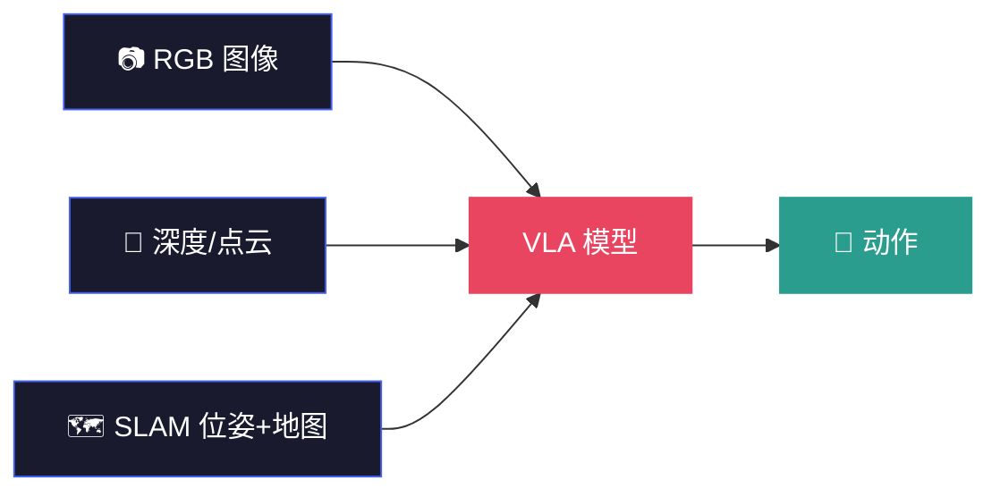
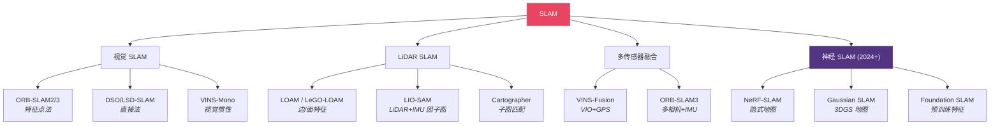
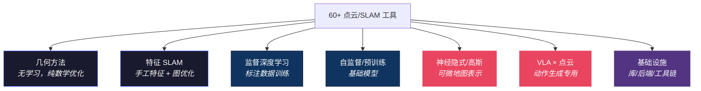

# 点云理解与 SLAM (Point Cloud Intelligence & SLAM)

> **面试场景**: "请比较 Visual SLAM 与 LiDAR SLAM 的区别；点云特征网络有哪些？实际工程如何选择？"
>
> **VLA 场景**: 机器人需要在未知环境中建图定位、理解 3D 空间、规划无碰撞路径——点云和 SLAM 是这一切的基础。

<table><tr><td>

**上次更新**：2026-04-09 · Claude Opus 4.6 × [Pulsar 照见](https://github.com/sou350121/Pulsar-KenVersion)

</td></tr></table>

---

## 0. 为什么 VLA 需要点云和 SLAM

VLA 模型的 "V" 通常是 2D 图像。但机器人操作发生在 **3D 空间**——抓取需要知道深度，避障需要知道占据，规划需要知道自身位置。



**三种用法**：
1. **操作空间感知**：点云告诉 VLA "物体在哪、形状是什么" → 抓取规划
2. **导航定位**：SLAM 告诉 VLA "我在哪、周围有什么" → 移动操作
3. **3D 世界模型输入**：点云是 [VLOA](../world-model/vloa_embodied_world_model_3d_point_cloud_trajectory_2026.md) 等 3D 世界模型的原生输入

→ 也见 [视觉感知技术](perception_techniques.md) · [空间数学](spatial_math.md) · [状态估计](state_estimation.md)

---

## 1. 数学核心

> **第一性原理**: **Consistency Maximization (一致性最大化)**

如果世界是静止的，那么无论机器人怎么动，观测到的环境特征之间的相对几何关系应该保持不变。SLAM 的本质就是寻找一条轨迹，使得所有观测数据在几何上**最自洽**。

**配准（Registration）**：

$$
T^* = \arg\min_T \sum_{i} \|p_i - T \cdot q_i\|^2
$$

寻找变换矩阵 T，使两个点云重合度最高（ICP 的核心）。

**图优化（Graph Optimization）**：

$$
x^* = \arg\min_x \sum_{(i,j)} \|z_{ij} - f(x_i, x_j)\|^2_{\Sigma_{ij}}
$$

将机器人位姿作为节点、观测约束作为边，构建因子图，迭代求解消除累积误差。

→ 数学细节见 [VLA 数学必备](../foundation/math_for_vla.md)（SE(3) 变换、Jacobian）

---

## 2. 点云表示与特征提取

### 2.1 常用表示

| 表示 | 描述 | 优势 | 劣势 | 代表网络 |
|------|------|------|------|---------|
| 原始点云 | 无结构 (x,y,z,r,g,b) 集合 | 完整保留几何 | 不规则，不能直接用 CNN | PointNet |
| 体素 | 3D 网格 | 结构化，可用 3D CNN | 高维稀疏 | VoxelNet |
| 点柱 | 沿 z 轴积分为柱 | 兼顾稀疏+结构 | z 信息损失 | PointPillars |
| Range Image | 极坐标投影到 2D | 适合 LiDAR | 有失真 | RangeNet++ |
| BEV | 鸟瞰投影 | 规划友好 | 高度信息损失 | BEVFusion |
| **3D Gaussian** | 各向异性高斯椭球 | 可微渲染、高质量 | 计算量大 | 3DGS (2024+) |

### 2.2 特征提取网络演进

```
2017  PointNet (MLP + 全局 pooling)
  ↓
2017  PointNet++ (局部区域层级聚合)
  ↓
2019  KPConv (可变形点卷积核)
  ↓
2020  MinkowskiNet (稀疏卷积，大规模点云)
  ↓
2022  Point Transformer (自注意力)
  ↓
2023  Point-BERT / Point-MAE (自监督预训练)
  ↓
2024+ 3D Foundation Models (统一 3D 表征)
```

**VLA 里用哪种？** 大多数 VLA 不直接处理点云——而是用 RGB-D 相机获取深度，投影到 3D 后做几何推理。但 [DP3 (3D Diffusion Policy)](https://arxiv.org/abs/2403.03954) 证明了**直接在点云上做 action prediction** 比 2D 方法泛化更好。

---

## 3. 点云语义理解

### 3D 目标检测

| 算法 | 输入 | 特点 | 适用场景 |
|------|------|------|---------|
| PointRCNN | 点云 | Two-stage，精度高 | 室内 |
| PV-RCNN | 体素+点 | 混合特征 | 自动驾驶 |
| CenterPoint | BEV | Anchor-free，快速 | 自动驾驶 |

### 3D 语义分割

- **RangeNet++**：LiDAR → range image → 2D CNN
- **MinkowskiNet**：稀疏卷积，多任务
- **PolarNet**：极坐标分割，速度与精度兼顾

### 场景流（动态理解）

- **FlowNet3D**：学习帧间点云速度场
- **BEVFlow**：BEV 中估计场景流（自动驾驶主流）

---

## 4. 点云配准

| 方法 | 类型 | 核心思想 | 优缺点 |
|------|------|---------|--------|
| ICP | 经典 | 最近邻对齐 + 最小二乘 | 简单但需好初始化 |
| G-ICP | 经典 | 高斯分布 ICP | 精度更好 |
| NDT | 经典 | 高斯体素建模 | 收敛范围大 |
| TEASER++ | 鲁棒 | 鲁棒估计，抗离群点 | 计算开销大 |
| DCP | 学习 | Deep Closest Point | 端到端 |
| Predator | 学习 | 重叠区域检测 | 低重叠场景 |
| **GeoTransformer** | 学习 | 几何 Transformer 配准 | 2024 SOTA |

---

## 5. SLAM 技术谱系



### 5.1 视觉 SLAM 流程

```
图像 → 特征提取 (ORB) → 匹配 → 位姿估计 (PnP+RANSAC) →
滑动窗口 BA → 回环检测 (DBoW2) → 图优化 (g2o)
```

### 5.2 LiDAR SLAM

| 系统 | 传感器 | 特点 |
|------|--------|------|
| LOAM | LiDAR | 边/面特征分离 |
| LeGO-LOAM | LiDAR | 地面分割优化 |
| LIO-SAM | LiDAR + IMU (+GPS) | 因子图后端 (GTSAM)，高精度，开源标杆 |
| Cartographer | LiDAR + IMU + Wheel | Google 开源，子图匹配 |

### 5.3 神经 SLAM（2024-2026 新方向）

传统 SLAM 用显式几何（点、线、面）建图。神经 SLAM 用**神经隐式表示**建图——地图存在网络权重里。

| 方法 | 地图表示 | 核心优势 | VLA 相关性 |
|------|---------|---------|-----------|
| **iMAP / NICE-SLAM** | NeRF (MLP) | 稠密光滑重建 | 可生成任意视角的虚拟观测 |
| **SplaTAM** | 3D Gaussian | 高质量实时渲染 | 可微渲染 → 可端到端训练 |
| **GS-SLAM** | 3D Gaussian | 大规模场景 | 与 VLA 的 3D 表征兼容 |
| **Foundation SLAM** | 预训练特征 | 语义 + 几何统一 | 与 VLM 特征共享 |

**为什么神经 SLAM 对 VLA 重要？** 因为隐式地图是**可微的**——可以作为 VLA 训练的一部分参与梯度优化。传统 SLAM 的显式地图（点云/占据栅格）不可微，只能作为 VLA 的外部输入。

### 5.4 深入：OmniMap — 光学 × 几何 × 语义的统一建图

> **论文**：OmniMap: A General Mapping Framework Integrating Optics, Geometry, and Semantics
> **发表**：IEEE Transactions on Robotics (TRO) 2025 · [arXiv](https://arxiv.org/abs/2509.07500) · [GitHub](https://github.com/BIT-DYN/omnimap) · [项目页](https://omni-map.github.io/)

OmniMap 是目前最完整的神经建图框架——它不只做"看起来像"（光学），也做"形状对"（几何），还做"知道是什么"（语义），而且三者**同时在线运行**。

**为什么值得单独讲？** 因为之前的方法只做其中一两项：

| 方法 | 光学（渲染质量） | 几何（深度/网格） | 语义（物体理解） |
|------|:---:|:---:|:---:|
| MonoGS / SplaTAM | ✅ | ✅ | ❌ |
| ConceptFusion | ❌ | ❌ | ✅ |
| **OmniMap** | **✅** | **✅** | **✅** |

**核心架构：3DGS-Voxel 混合表示**

```
RGB-D 序列输入
      ↓
┌─────────────────────────────────────────────┐
│  2D 语言特征提取器                           │
│  (YOLO-World 检测 + TAP 分割 + SBERT 描述)  │
└──────────────┬──────────────────────────────┘
               ↓
┌─────────────────────────────────────────────┐
│  概率体素重建器                              │
│  · 体素 = 基本单元（结构稳定、增量更新）      │
│  · 每个体素存：概率语义 + 实例嵌入 + 几何     │
│  · 新体素 → 初始化高斯原语                   │
└──────────────┬──────────────────────────────┘
               ↓
┌─────────────────────────────────────────────┐
│  运动鲁棒 3DGS 增量重建器                    │
│  · 高斯原语：精细光学 + 几何重建              │
│  · 自适应相机建模：运动模糊 + 曝光补偿        │
│  · 法线约束：提升几何精度                     │
└──────────────┬──────────────────────────────┘
               ↓
      输出：RGB 渲染 + 深度图 + 3D 网格 + 零样本语义分割
```

**关键设计思想**：

1. **体素 = 骨架，高斯 = 皮肤**。体素提供结构稳定性和增量更新能力（不会随新帧漂移），高斯提供精细的光学和几何建模。两者紧耦合——新体素自动生成对应的高斯。

2. **概率语义融合**。不是简单地给每个点贴标签，而是在体素级别维护概率分布（"这个体素有 80% 是杯子、15% 是瓶子"）。随着更多帧观测，概率逐步收敛。

3. **自适应相机建模**。真实世界的图像有运动模糊和曝光变化——OmniMap 显式建模这些，不假设完美输入。

**对 VLA 的独特价值**：

OmniMap 输出的地图同时包含三种信息：
- **光学**（渲染）→ VLA 可以从任意视角生成虚拟观测（数据增强）
- **几何**（网格/深度）→ 碰撞检测、可达性规划
- **语义**（零样本分割）→ "哪个是杯子、哪个是盘子"

这意味着一个 OmniMap 地图可以同时服务 VLA 的**感知**（"看到什么"）、**规划**（"怎么走"）和**推理**（"这是什么"）三个需求。之前需要三个独立模块才能做到的事，现在一个框架搞定。

**已验证的机器人应用**：
- 感知引导的机械臂操作（"拿起红色杯子"→ 语义定位 → 抓取规划）
- 地图辅助的移动机器人导航

**局限**：
- 需要 RGB-D 输入（不能纯 RGB）
- 依赖 YOLO-World 等外部模型做 2D 语义
- 145 stars，社区还在早期

**❓ 待追问的问题**：

1. **实时性到底多"实时"？** 论文说"real-time"，但同时跑 YOLO-World + TAP + SBERT + 3DGS 渲染 + 体素更新，在什么硬件上能达到多少 FPS？如果需要 H100 才能实时，对机器人部署的意义就大打折扣。

2. **语义模块的级联误差**。语义来自 YOLO-World 检测 → TAP 分割 → SBERT 描述的三级 pipeline。任何一级出错都会传递到体素语义。尤其是遮挡和小物体——YOLO-World 漏检了，后面再怎么概率融合也救不回来。这个级联鲁棒性有多强？

3. **动态场景能力**。论文主要在 Replica（静态场景）和 ScanNet（缓慢变化）上验证。如果机器人在操作物体（物体被移动、被抓起），地图怎么更新？已放入体素的旧语义怎么失效？这是操作场景最核心的需求，但 OmniMap 似乎还没验证。

4. **与 VLA 的实际集成路径不清楚**。论文展示了"感知引导机械臂操作"的应用，但具体怎么把 OmniMap 的输出接入 VLA 模型？是把渲染图喂给 VLA 的 vision encoder？还是把体素语义作为额外 token？这个 interface 没有被明确定义。

5. **体素分辨率 vs 精度的 tradeoff**。体素越细 → 语义越精确但计算量爆炸；体素越粗 → 快但丢失小物体。这个分辨率怎么选？是手动调还是自适应的？对于不同任务（桌面操作 vs 房间导航）需要的分辨率差异很大。

6. **"三合一"是否真的比"三个专用模型"好？** 统一框架的优势是一致性和效率，但劣势是每个模态的精度可能不如专用方案。渲染不如纯 3DGS（MonoGS），语义不如纯语义 SLAM（ConceptGraphs），几何不如纯几何方案（LIO-SAM）。什么场景下"三合一"的一致性优势压过精度劣势？

**💬 为什么 TRO 顶刊却只有 145 stars？**

这个反差值得分析，因为它揭示了"学术评价"和"社区采纳"之间的鸿沟：

| 因素 | 分析 |
|------|------|
| **复现门槛极高** | 同时依赖 YOLO-World + TAP + SBERT + diff-gaussian-rasterization + lietorch + mmcv + flash-attn。光配环境就能劝退大部分人。MonoGS（2K stars）之所以火，部分原因是它只需要一个摄像头 + 简单依赖。 |
| **RGB-D 限制** | 学术社区近年热衷"纯单目"方法（更通用、更便宜）。OmniMap 要求 RGB-D 输入，直接排除了没有深度相机的研究者。MonoGS 支持纯单目，吸引力大得多。 |
| **先发优势被占** | MonoGS（CVPR'24 Best Demo）、SplaTAM、GS-SLAM 都在 2024 年初就发布了。到 OmniMap 2025 年出来时，3DGS-SLAM 的"新鲜感红利"已经被前面的方法消耗了。 |
| **语义增量不够"显眼"** | OmniMap 的核心增量是加了语义。但对大多数 SLAM 用户来说，"地图能看"已经够了，"地图能懂"是锦上添花——不是刚需，不足以驱动他们换框架。 |
| **机器人 demo 不够震撼** | 展示的操作应用是"拿起红色杯子"级别——用 Grounded SAM + 任意 SLAM 也能做到类似效果，没有让人觉得"非 OmniMap 不可"的场景。 |
| **TRO 读者 ≠ GitHub 用户** | TRO 的读者主要是机器人控制/规划方向的研究者，不是 3D 视觉社区。而 GitHub stars 主要来自 CV/3D 视觉社区。存在"论文发对了期刊，但社区不对口"的错位。 |

**这对 VLA 研究者的启示**：一个工具的学术影响力（TRO 发表）和工程实用性（GitHub 采纳）是两回事。选工具时不要只看期刊级别，也要看：复现难度、依赖链长度、社区活跃度、是否有"非它不可"的杀手级应用。OmniMap 的技术方向是对的（统一建图），但在当前阶段，用 MonoGS/SplaTAM + SAM 3.1 的组合可能更实际。

---

## 6. 多传感器融合策略

| 融合方式 | 描述 | 代表 | 适用 |
|---------|------|------|------|
| 松耦合 | 分别估计，EKF 融合 | robot_localization | 实时性优先 |
| 紧耦合 | 同一优化框架联合估计 | VINS-Fusion, LIO-SAM | 高精度 |
| 因子图 | 所有约束统一建模 | GTSAM 系列 | 多传感器冗余 |

---

## 7. 与 VLA 研究的深层连接

### 连接 1：DP3 — 直接在点云上做 Diffusion Policy

DP3 (3D Diffusion Policy) 证明了在点云空间做动作生成比 2D 图像空间泛化更好——因为 3D 表示消除了视角依赖、尺度模糊和遮挡歧义。

**含义**：VLA 的 Vision Encoder 可能应该输出 3D 点云特征，而不只是 2D 图像特征。

### 连接 2：VLOA — 3D 点云轨迹作为世界模型输出

[VLOA 具身世界模型](../world-model/vloa_embodied_world_model_3d_point_cloud_trajectory_2026.md)的输出就是 **3D 点云运动轨迹**——物体未来在三维空间中的运动路径。这直接建立在点云理解的基础上。

### 连接 3：自模型 — 从视频重建自身 3D 结构

[Lipson 的自模型](../world-model/teaching_robots_build_simulations_of_themselves_self_model_dissection.md)从单目视频重建机器人自身的 3D 运动学模型——本质是一种"自身的 3D 重建 + SLAM"。

### 连接 4：Sim2Real 的桥梁

仿真器（Isaac Lab）输出的是完美的点云/深度。真实世界的深度传感器有噪声、遮挡、反射。SLAM 提供的位姿精度直接决定了 Sim2Real 标定的质量。

→ 详见 [Isaac Lab](../deployment/isaac_lab.md) · [Fast-FoundationStereo](fast_foundation_stereo_real_time_zero_shot_stereo_matching_2026.md)

---

## 8. 工程落地 Checklist

- [ ] **时间同步**：硬件触发 / PTP / 时戳对齐
- [ ] **传感器标定**：外参 (Hand-eye)，内参 (LiDAR-to-Camera)
- [ ] **地图管理**：关键帧稀疏化、循环检测
- [ ] **动态物体**：语义分割剔除行人/车辆
- [ ] **异常检测**：监控轨迹残差、速度跳变
- [ ] **回环策略**：Scan Context / OverlapNet / 学习型场景识别
- [ ] **深度质量**：对透明/反光物体做补洞（[DKT](dkt_transparency_perception.md) 方向）

---

## 9. 工具原理分类 × 微调支持总览

> 60+ 工具按底层原理分成 7 大类。**是否支持微调/训练**是 VLA 研究者最关心的属性——决定了工具能否融入端到端 pipeline。

### 原理分类全景



### 分类详表

| 类别 | 原理 | 代表工具 | 可微？ | 可微调/训练？ | VLA 融入方式 |
|------|------|---------|:------:|:----------:|------------|
| **几何配准** | 最近邻迭代 (ICP) / 鲁棒估计 | small_gicp · Fast-GICP · TEASER++ · SANDRO | ❌ | ❌ 参数调节 | 预处理：点云对齐后喂给 VLA |
| **特征 SLAM** | 手工特征（ORB/边/面）+ 因子图优化 | ORB-SLAM3 · LIO-SAM · FAST-LIO2 · Point-LIO · KISS-SLAM · Cartographer · VINS-Fusion | ❌ | ❌ 参数调节 | 提供位姿/地图作为 VLA 外部输入 |
| **监督 3D DL** | 点级 MLP / 稀疏卷积 / 注意力 | PointNet++ · KPConv · MinkowskiEngine · Point Transformer V3 | ✅ | ✅ **支持微调** | 提取 3D 特征 → 作为 VLA 的 vision token |
| **3D 基础模型** | 自监督预训练 + 跨模态对齐 | Uni3D · UniPre3D · PonderV2 · Depth Anything V3 | ✅ | ✅ **支持微调** | 预训练 3D 表征 → LoRA 适配到 VLA |
| **神经 SLAM** | NeRF/3DGS 隐式地图 + 位姿优化 | MonoGS · SplaTAM · GS-SLAM · OpenGS-SLAM · Photo-SLAM | ✅ | ⚠️ 逐场景优化（非传统微调） | 可微地图 → 可端到端联合训练 |
| **VLA × 点云** | 3D 世界模型 / 点云注入 VLA | PointWorld · PointVLA · ParticleFormer | ✅ | ✅ **支持微调** | **原生设计**就是给 VLA 用的 |
| **基础设施** | 处理库 / 优化后端 / 渲染引擎 | Open3D · PCL · PyTorch3D · Kaolin · GTSAM · g2o · Ceres · Nerfstudio · gsplat | 部分 | N/A（库级工具） | 构建 pipeline 的积木 |

### 微调支持详情

<details>
<summary><b>展开：每个可微调工具的具体支持情况</b></summary>

&nbsp;

| 工具 | 预训练权重 | 微调脚本 | 微调方式 | 训练数据需求 |
|------|:---------:|:-------:|---------|------------|
| **PointNet++** | ✅ ModelNet/ShapeNet | ✅ PyTorch | 全参数 / 冻结 backbone | 中（~1K 样本起步） |
| **KPConv** | ✅ S3DIS/ScanNet | ✅ PyTorch | 全参数 | 中 |
| **MinkowskiEngine** | ✅ ScanNet/S3DIS | ✅ PyTorch | 稀疏卷积层微调 | 中 |
| **Point Transformer V3** | ✅ ScanNet/nuScenes | ✅ Pointcept 框架 | 全参数 / 解冻 head | 中 |
| **Uni3D** | ✅ **1B 参数预训练** | ✅ | 对齐 CLIP → zero-shot 或 linear probe | 低（zero-shot 可用） |
| **UniPre3D** | ✅ 3DGS 跨模态 | ✅ | 预训练 + 下游微调 | 中 |
| **PonderV2** | ✅ 多任务预训练 | ✅ | 统一预训练 → 多任务微调 | 中 |
| **Depth Anything V3** | ✅ 多个变体 | ✅ 官方提供 | 冻结 encoder / 全微调 / metric 适配 | 低-中 |
| **SAM 3.1** | ✅ 4M+ 概念 | ✅ Meta 提供 | LoRA / adapter / prompt tuning | 低（few-shot 可用） |
| **PointWorld** | ✅ 2M 轨迹预训练 | ⚠️ MPC 框架（非传统微调） | 预训练后直接 MPC，无需任务特定微调 | 低（zero-shot） |
| **PointVLA** | ✅ 复用已有 VLA | ⚠️ **未开源** | 不重训 VLA，只训点云注入模块（论文方法） | 低 |
| **ParticleFormer** | ✅ | ✅ | 3D 世界模型端到端训练 | 中-高 |

&nbsp;

**VLA 研究者选择指南**：
- 想**不训练**就用 → PointWorld (zero-shot MPC) 或 PointVLA (注入现有 VLA)
- 想**轻量微调** → Uni3D (linear probe) 或 SAM 3.1 (LoRA)
- 想**端到端训练** → Point Transformer V3 (Pointcept) 或 ParticleFormer
- 想**替代 LiDAR** → Depth Anything V3 (单目深度) + 上述任一 3D 方法

</details>

---

## 10. 开源工具详细列表

> 按用途分类，附 GitHub 链接和推荐场景。

### 10.1 点云处理库

| 工具 | 语言 | 核心优势 | 适用场景 | 链接 |
|------|------|---------|---------|------|
| **Open3D** | C++/Python | 可视化强、API 干净、ICP/配准/重建一站式 | 研究原型 + 生产 | [open3d.org](https://www.open3d.org/) |
| **PCL** | C++ | 算法最全（滤波/特征/分割/配准/重建） | 高性能 C++ 部署 | [pointcloudlibrary.github.io](https://pointcloudlibrary.github.io/) |
| **PyTorch3D** | Python | **可微**点云操作 + 可微渲染 | 3D 深度学习训练 | [github/facebookresearch/pytorch3d](https://github.com/facebookresearch/pytorch3d) |
| **Kaolin** | Python | NVIDIA GPU 加速 + 可微渲染 | 大规模 3D DL | [github/NVIDIAGameWorks/kaolin](https://github.com/NVIDIAGameWorks/kaolin) |
| **Cupoch** | C++/Python | Open3D 的 GPU 加速版 | 实时处理 | [github/neka-nat/cupoch](https://github.com/neka-nat/cupoch) |
| **Open3D-ML** | Python | Open3D + ML 扩展（语义分割等） | 3D 感知 pipeline | [github/isl-org/Open3D-ML](https://github.com/isl-org/Open3D-ML) |

**VLA 推荐**：研究阶段用 Open3D（快速原型）；训练阶段用 PyTorch3D（可微）；部署阶段用 PCL 或 Cupoch（性能）。

### 10.2 点云深度学习框架

| 框架 | 核心方法 | 任务 | 链接 |
|------|---------|------|------|
| **PointNet / PointNet++** | MLP + 层级聚合 | 分类 / 分割 | [github/charlesq34/pointnet2](https://github.com/charlesq34/pointnet2) · [PyTorch 版](https://github.com/yanx27/Pointnet_Pointnet2_pytorch) |
| **MinkowskiEngine** | 稀疏卷积 | 大规模语义分割 | [github/NVIDIA/MinkowskiEngine](https://github.com/NVIDIA/MinkowskiEngine) |
| **KPConv** | 可变形点核卷积 | 密集点云分割 | [github/HuguesTHOMAS/KPConv-PyTorch](https://github.com/HuguesTHOMAS/KPConv-PyTorch) |
| **Point Transformer V3** | Transformer + 序列化注意力 | 通用 3D 理解 · CVPR'24 Oral | [github/Pointcept/PointTransformerV3](https://github.com/Pointcept/PointTransformerV3) |
| **Pointcept** | 统一点云感知框架 | 分割 / 检测 / 预训练 | [github/Pointcept/Pointcept](https://github.com/Pointcept/Pointcept) |
| **Torch-Points3D** | 模块化 3D DL 框架 | 多任务可复现 | [github/torch-points3d](https://github.com/torch-points3d/torch-points3d) |
| **Uni3D** | 3D 基础模型 · ICLR'24 Spotlight · 1B 参数 | 3D 表征对齐 CLIP | [github/baaivision/Uni3D](https://github.com/baaivision/Uni3D) |
| **UniPre3D** | CVPR'25 · 3DGS 跨模态预训练 | 统一 3D 预训练 | [github/wangzy22/UniPre3D](https://github.com/wangzy22/UniPre3D) |
| **PonderV2** | T-PAMI'25 · 通用 3D 预训练范式 | 3D 基础模型 | [github/OpenGVLab/PonderV2](https://github.com/OpenGVLab/PonderV2) |
| **learning3d** | 点云 DL 方法合集（含预训练权重） | 快速复现 | [github/vinits5/learning3d](https://github.com/vinits5/learning3d) |

### 10.3 SLAM 系统

| 系统 | 类型 | 传感器 | 亮点 | 链接 |
|------|------|--------|------|------|
| **ORB-SLAM3** | 视觉 | Mono/Stereo/RGB-D + IMU | 最成熟的视觉 SLAM | [github/UZ-SLAMLab/ORB_SLAM3](https://github.com/UZ-SLAMLab/ORB_SLAM3) |
| **VINS-Fusion** | VIO | Stereo + IMU + GPS | 多传感器松/紧耦合 | [github/HKUST-Aerial-Robotics/VINS-Fusion](https://github.com/HKUST-Aerial-Robotics/VINS-Fusion) |
| **LIO-SAM** | LiDAR | LiDAR + IMU + GPS | 因子图后端，高精度标杆 | [github/TixiaoShan/LIO-SAM](https://github.com/TixiaoShan/LIO-SAM) |
| **Cartographer** | LiDAR | LiDAR + IMU + Wheel | Google 开源，子图匹配 | [github/cartographer-project](https://github.com/cartographer-project/cartographer) |
| **RTAB-Map** | 多模态 | RGB-D / Stereo / LiDAR | 大规模回环 + 多传感器支持 | [github/introlab/rtabmap](https://github.com/introlab/rtabmap) |
| **SLAM Toolbox** | 2D | LiDAR | ROS2 官方推荐，lifelong mapping | [github/SteveMacenski/slam_toolbox](https://github.com/SteveMacenski/slam_toolbox) |
| **hdl_graph_slam** | LiDAR | 3D LiDAR | 基于图的 3D SLAM | [github/koide3/hdl_graph_slam](https://github.com/koide3/hdl_graph_slam) |
| **KISS-SLAM** | LiDAR | 3D LiDAR | IROS 2025 · "just works"，基于 KISS-ICP + MapClosures | [github/PRBonn/kiss-slam](https://github.com/PRBonn/kiss-slam) |
| **FAST-LIO2** | LiDAR + IMU | LiDAR-Inertial | ikd-Tree 增量建图，HKU MARS Lab | [github/hku-mars/FAST_LIO](https://github.com/hku-mars/FAST_LIO) |
| **Point-LIO** | LiDAR + IMU | LiDAR-Inertial | 高带宽紧耦合，剧烈运动下最稳 | [github/hku-mars/Point-LIO](https://github.com/hku-mars/Point-LIO) |

### 10.4 神经 SLAM / 3DGS-SLAM（2024-2026 前沿）

| 系统 | 地图表示 | 输入 | 亮点 | 链接 |
|------|---------|------|------|------|
| **MonoGS** | 3D Gaussian | Mono/Stereo/RGB-D | CVPR'24 Highlight + Best Demo · 单目 GS-SLAM | [github/muskie82/MonoGS](https://github.com/muskie82/MonoGS) |
| **SplaTAM** | 3D Gaussian | RGB-D | 稠密重建 + 位姿估计 2x 提升 | [spla-tam.github.io](https://spla-tam.github.io/) |
| **GS-SLAM** | 3D Gaussian | RGB-D | CVPR'24 · 实时稠密建图 | [gs-slam.github.io](https://gs-slam.github.io/) |
| **OpenGS-SLAM** | 3D Gaussian | RGB only | ICRA 2025 · 户外无界场景 | [github/3DAgentWorld/OpenGS-SLAM](https://github.com/3DAgentWorld/OpenGS-SLAM) |
| **Photo-SLAM** | 3D Gaussian | Mono/Stereo/RGB-D | CVPR'24 · 实时光照真实建图 | [github/HuajianUP/Photo-SLAM](https://github.com/HuajianUP/Photo-SLAM) |
| **OmniMap** | 3DGS-Voxel 混合 | RGB-D | TRO'25 · 光学+几何+语义统一 · 机器人操作 | [github/BIT-DYN/omnimap](https://github.com/BIT-DYN/omnimap) |

### 10.5 优化后端 / 配准工具

| 工具 | 用途 | 链接 |
|------|------|------|
| **GTSAM** | 因子图优化（LIO-SAM 的后端） | [github/borglab/gtsam](https://github.com/borglab/gtsam) |
| **g2o** | 通用图优化（ORB-SLAM 的后端） | [github/RainerKuemmerle/g2o](https://github.com/RainerKuemmerle/g2o) |
| **Ceres Solver** | 非线性最小二乘（BA / 标定） | [github/ceres-solver/ceres-solver](https://github.com/ceres-solver/ceres-solver) |
| **TEASER++** | 鲁棒全局点云配准（抗离群点） | [github/MIT-SPARK/TEASER-plusplus](https://github.com/MIT-SPARK/TEASER-plusplus) |
| **small_gicp** | 快速 ICP/GICP/VGICP（nangicp 后继） | [github/koide3/small_gicp](https://github.com/koide3/small_gicp) |
| **Fast-GICP** | GPU 加速 GICP | [github/SMRT-AIST/fast_gicp](https://github.com/SMRT-AIST/fast_gicp) |
| **SANDRO** | RANSAC-free 鲁棒配准（IRLS + 分裂策略） | [github/iit-DLSLab/SANDRO](https://github.com/iit-DLSLab/SANDRO) |

### 10.6 3D 渲染与重建框架

| 工具 | 核心能力 | 适用 | 链接 |
|------|---------|------|------|
| **Nerfstudio** | 统一 NeRF + 3DGS 训练框架 · Apache 2.0 | 场景重建、导航地图 | [github/nerfstudio-project/nerfstudio](https://github.com/nerfstudio-project/nerfstudio) |
| **gsplat** | CUDA 加速 3DGS 光栅化 · 60+ FPS 实时渲染 | GS-SLAM 后端 | [github/nerfstudio-project/gsplat](https://github.com/nerfstudio-project/gsplat) |
| **CloudCompare** | 点云可视化/编辑/配准/比较 · GUI 工具 | 数据检查、质量评估 | [cloudcompare.org](https://www.cloudcompare.org/) |

### 10.7 VLA × 点云专用工具（2025-2026 前沿）

| 工具 | 核心能力 | 链接 |
|------|---------|------|
| **PointWorld** | 3D 世界模型——点云流预测 + MPC 操作 · NVIDIA · 2M 轨迹预训练 | [github/NVlabs/PointWorld](https://github.com/NVlabs/PointWorld) |
| **PointVLA** | 向已有 VLA 注入点云输入（无需重训）· 超越 OpenVLA/DiffusionPolicy · ⚠️ **未开源** | [论文](https://arxiv.org/abs/2503.07511) · [项目页](https://pointvla.github.io/) |
| **ParticleFormer** | 3D 点云世界模型 · 多物体多材质操作 | [arxiv/2506.23126](https://arxiv.org/abs/2506.23126) |
| **Depth Anything V3** | 单目/多目/视频统一深度估计 · ETH3D 比 V2 +10% | [github/ByteDance-Seed/Depth-Anything-3](https://github.com/ByteDance-Seed/Depth-Anything-3) |
| **SAM 3.1** | 概念分割 + 多目标跟踪 · 16 目标 32FPS · Meta 2026.03 | [github/facebookresearch/sam3](https://github.com/facebookresearch/sam3) |

> 💡 **PointWorld** 和 **PointVLA** 是 2025-2026 最值得关注的方向——它们验证了"点云是 VLA 的第三模态"这一假设。PointWorld 用 3D 点云流做世界模型；PointVLA 证明向现有 2D VLA 注入点云可以不重训就提升性能。

### 10.8 综合对比与算法集合

| 工具 | 说明 | 链接 |
|------|------|------|
| **SLAM-application** | 20+ SLAM 算法在 Gazebo/真机上的统一部署配置对比 | [github/engcang/SLAM-application](https://github.com/engcang/SLAM-application) |
| **3D-PointCloud** | 点云论文 + 数据集全景索引 | [github/zhulf0804/3D-PointCloud](https://github.com/zhulf0804/3D-PointCloud) |

### 10.9 Awesome 列表（持续追踪）

| 列表 | 覆盖范围 | 链接 |
|------|---------|------|
| Awesome-3DGS-SLAM | 3D Gaussian SLAM 论文 + 代码 | [github/KwanWaiPang/Awesome-3DGS-SLAM](https://github.com/KwanWaiPang/Awesome-3DGS-SLAM) |
| Awesome-NeRF-and-3DGS-SLAM | NeRF + 3DGS + SLAM + 机器人 | [github/3D-Vision-World/awesome-NeRF-and-3DGS-SLAM](https://github.com/3D-Vision-World/awesome-NeRF-and-3DGS-SLAM) |
| Awesome-3DGS-in-Robotics | 3DGS 在机器人中的应用 | [github/zstsandy/Awesome-3D-Gaussian-Splatting-in-Robotics](https://github.com/zstsandy/Awesome-3D-Gaussian-Splatting-in-Robotics) |
| Awesome-SLAM | 综合 SLAM 资源 | [github/SilenceOverflow/Awesome-SLAM](https://github.com/SilenceOverflow/Awesome-SLAM) |
| Awesome-LiDAR-Visual-SLAM | 激光-视觉融合 SLAM | [github/sjtuyinjie/awesome-LiDAR-Visual-SLAM](https://github.com/sjtuyinjie/awesome-LiDAR-Visual-SLAM) |

---

## 11. 代码片段

### Open3D ICP

```python
import open3d as o3d
import numpy as np

source = o3d.io.read_point_cloud("scan1.pcd")
target = o3d.io.read_point_cloud("scan2.pcd")

reg = o3d.pipelines.registration.registration_icp(
    source, target, max_correspondence_distance=0.05,
    init=np.eye(4),
    estimation_method=o3d.pipelines.registration.TransformationEstimationPointToPlane()
)
print(f"Fitness: {reg.fitness:.3f}, RMSE: {reg.inlier_rmse:.4f}")
print(reg.transformation)
```

### LIO-SAM Launch (ROS2)

```yaml
# lio_sam_params.yaml
lio_sam:
  ros__parameters:
    sensor: velodyne
    imu_topic: /imu/data
    pointCloudTopic: /velodyne_points
    gpsTopic: /gps/fix
```

---

## 12. 面试 Q&A

<details>
<summary><b>Q1: Visual SLAM vs LiDAR SLAM？</b></summary>

- **视觉**：信息丰富、成本低，但受光照/纹理影响
- **LiDAR**：几何精确、鲁棒，但成本高、分辨率有限
- **融合**：LiDAR 提供全局几何，视觉提供语义和精细结构
- **趋势**：深度基础模型（[Depth Anything V3](https://github.com/ByteDance-Seed/Depth-Anything-3)，比 V2 在 ETH3D 上 +10%）让纯视觉方案精度逼近 LiDAR
</details>

<details>
<summary><b>Q2: 点云中的动态物体怎么处理？</b></summary>

1. 语义分割剔除动态类别（车/人）
2. RANSAC / 运动一致性检测异常速度
3. 多传感器（IMU）区分静态 vs 动态
4. 学习型方法：场景流估计 → 速度阈值筛选
</details>

<details>
<summary><b>Q3: ICP 何时失败？怎么改？</b></summary>

- 初始估计差 → NDT 先粗对齐，或全局配准（TEASER++）
- 动态物体多 → 预处理剔除
- 噪声大 → 点到平面 + 鲁棒核函数
- 对称场景 → 加语义约束（"这是墙"vs"这是地面"）
</details>

<details>
<summary><b>Q4: 为什么神经 SLAM 对 VLA 很重要？</b></summary>

传统 SLAM 输出显式地图（点云/占据栅格），不可微。神经 SLAM 输出隐式地图（NeRF/3DGS），可微 → 可以作为 VLA 训练的一部分参与梯度优化。这意味着 VLA 可以"学会更好地建图"，而不只是"用别人给的地图"。
</details>

---

## 13. Opus 的反思

### 🔮 点云是 VLA 被低估的"第三模态"

当前 VLA 的输入是 Image + Language → Action。但如果加入 Point Cloud 作为第三模态（Image + Language + Point Cloud → Action），理论上可以消除 2D 图像的视角依赖和深度模糊。DP3 已经初步验证了这一点。

问题是：**怎么高效融合？** 点云是无序集合，图像是有序网格，两者的 Transformer 融合还没有成熟方案。BEVFusion 在自动驾驶中的成功可能可以借鉴。

### 🔮 SLAM 可能被"大力出奇迹"取代

如果 VLA 模型足够大、训练数据足够多，它是否能隐式地学会"定位"——不需要显式的 SLAM 模块？Tesla 的纯视觉方案在自动驾驶中已经初步做到了这一点（用端到端网络替代了传统感知 pipeline）。

但机器人操作的精度要求比自动驾驶更高（毫米级 vs 厘米级），短期内显式 SLAM 仍然不可替代。长期来看，"SLAM as a loss function"（用 SLAM 的一致性作为训练信号而不是运行时组件）可能是一个有趣方向。

---

## 延伸阅读

| 方向 | 推荐 |
|------|------|
| 感知主线 | [感知研究总纲](perception_mainline.md) |
| 深度估计 | [Fast-FoundationStereo](fast_foundation_stereo_real_time_zero_shot_stereo_matching_2026.md) |
| 透明物体 | [DKT](dkt_transparency_perception.md) |
| 3D 生成 | [Zero-1-to-3](zero_1_to_3_zero_shot_one_image_to_3d_object_2023.md) |
| 空间数学 | [空间智能与坐标系](spatial_math.md) |
| SE(3) 变换 | [VLA 数学必备](../foundation/math_for_vla.md) |
| 世界模型 | [VLOA 3D 点云轨迹](../world-model/vloa_embodied_world_model_3d_point_cloud_trajectory_2026.md) |
| 自模型 | [Lipson 自模型](../world-model/teaching_robots_build_simulations_of_themselves_self_model_dissection.md) |
| Sim2Real | [Isaac Lab](../deployment/isaac_lab.md) |

---

[← Back to Explorer's Map](../README.md)
