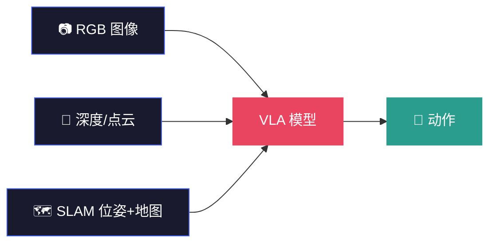
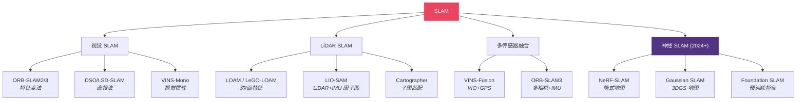

# 点云理解与 SLAM (Point Cloud Intelligence & SLAM)

> **面试场景**: "请比较 Visual SLAM 与 LiDAR SLAM 的区别；点云特征网络有哪些？实际工程如何选择？"
>
> **VLA 场景**: 机器人需要在未知环境中建图定位、理解 3D 空间、规划无碰撞路径——点云和 SLAM 是这一切的基础。

<table><tr><td>

**上次更新**：2026-04-09 · Claude Opus 4.6 × [Pulsar 照见](https://github.com/sou350121/Pulsar-KenVersion)

</td></tr></table>

---

## 0. 为什么 VLA 需要点云和 SLAM

VLA 模型的 "V" 通常是 2D 图像。但机器人操作发生在 **3D 空间**——抓取需要知道深度，避障需要知道占据，规划需要知道自身位置。



**三种用法**：
1. **操作空间感知**：点云告诉 VLA "物体在哪、形状是什么" → 抓取规划
2. **导航定位**：SLAM 告诉 VLA "我在哪、周围有什么" → 移动操作
3. **3D 世界模型输入**：点云是 [VLOA](../world-model/vloa_embodied_world_model_3d_point_cloud_trajectory_2026.md) 等 3D 世界模型的原生输入

→ 也见 [视觉感知技术](perception_techniques.md) · [空间数学](spatial_math.md) · [状态估计](state_estimation.md)

---

## 1. 数学核心

> **第一性原理**: **Consistency Maximization (一致性最大化)**

如果世界是静止的，那么无论机器人怎么动，观测到的环境特征之间的相对几何关系应该保持不变。SLAM 的本质就是寻找一条轨迹，使得所有观测数据在几何上**最自洽**。

**配准（Registration）**：

$$
T^* = \arg\min_T \sum_{i} \|p_i - T \cdot q_i\|^2
$$

寻找变换矩阵 T，使两个点云重合度最高（ICP 的核心）。

**图优化（Graph Optimization）**：

$$
x^* = \arg\min_x \sum_{(i,j)} \|z_{ij} - f(x_i, x_j)\|^2_{\Sigma_{ij}}
$$

将机器人位姿作为节点、观测约束作为边，构建因子图，迭代求解消除累积误差。

→ 数学细节见 [VLA 数学必备](../foundation/math_for_vla.md)（SE(3) 变换、Jacobian）

---

## 2. 点云表示与特征提取

### 2.1 常用表示

| 表示 | 描述 | 优势 | 劣势 | 代表网络 |
|------|------|------|------|---------|
| 原始点云 | 无结构 (x,y,z,r,g,b) 集合 | 完整保留几何 | 不规则，不能直接用 CNN | PointNet |
| 体素 | 3D 网格 | 结构化，可用 3D CNN | 高维稀疏 | VoxelNet |
| 点柱 | 沿 z 轴积分为柱 | 兼顾稀疏+结构 | z 信息损失 | PointPillars |
| Range Image | 极坐标投影到 2D | 适合 LiDAR | 有失真 | RangeNet++ |
| BEV | 鸟瞰投影 | 规划友好 | 高度信息损失 | BEVFusion |
| **3D Gaussian** | 各向异性高斯椭球 | 可微渲染、高质量 | 计算量大 | 3DGS (2024+) |

### 2.2 特征提取网络演进

```
2017  PointNet (MLP + 全局 pooling)
  ↓
2017  PointNet++ (局部区域层级聚合)
  ↓
2019  KPConv (可变形点卷积核)
  ↓
2020  MinkowskiNet (稀疏卷积，大规模点云)
  ↓
2022  Point Transformer (自注意力)
  ↓
2023  Point-BERT / Point-MAE (自监督预训练)
  ↓
2024+ 3D Foundation Models (统一 3D 表征)
```

**VLA 里用哪种？** 大多数 VLA 不直接处理点云——而是用 RGB-D 相机获取深度，投影到 3D 后做几何推理。但 [DP3 (3D Diffusion Policy)](https://arxiv.org/abs/2403.03954) 证明了**直接在点云上做 action prediction** 比 2D 方法泛化更好。

---

## 3. 点云语义理解

### 3D 目标检测

| 算法 | 输入 | 特点 | 适用场景 |
|------|------|------|---------|
| PointRCNN | 点云 | Two-stage，精度高 | 室内 |
| PV-RCNN | 体素+点 | 混合特征 | 自动驾驶 |
| CenterPoint | BEV | Anchor-free，快速 | 自动驾驶 |

### 3D 语义分割

- **RangeNet++**：LiDAR → range image → 2D CNN
- **MinkowskiNet**：稀疏卷积，多任务
- **PolarNet**：极坐标分割，速度与精度兼顾

### 场景流（动态理解）

- **FlowNet3D**：学习帧间点云速度场
- **BEVFlow**：BEV 中估计场景流（自动驾驶主流）

---

## 4. 点云配准

| 方法 | 类型 | 核心思想 | 优缺点 |
|------|------|---------|--------|
| ICP | 经典 | 最近邻对齐 + 最小二乘 | 简单但需好初始化 |
| G-ICP | 经典 | 高斯分布 ICP | 精度更好 |
| NDT | 经典 | 高斯体素建模 | 收敛范围大 |
| TEASER++ | 鲁棒 | 鲁棒估计，抗离群点 | 计算开销大 |
| DCP | 学习 | Deep Closest Point | 端到端 |
| Predator | 学习 | 重叠区域检测 | 低重叠场景 |
| **GeoTransformer** | 学习 | 几何 Transformer 配准 | 2024 SOTA |

---

## 5. SLAM 技术谱系



### 5.1 视觉 SLAM 流程

```
图像 → 特征提取 (ORB) → 匹配 → 位姿估计 (PnP+RANSAC) →
滑动窗口 BA → 回环检测 (DBoW2) → 图优化 (g2o)
```

### 5.2 LiDAR SLAM

| 系统 | 传感器 | 特点 |
|------|--------|------|
| LOAM | LiDAR | 边/面特征分离 |
| LeGO-LOAM | LiDAR | 地面分割优化 |
| LIO-SAM | LiDAR + IMU (+GPS) | 因子图后端 (GTSAM)，高精度，开源标杆 |
| Cartographer | LiDAR + IMU + Wheel | Google 开源，子图匹配 |

### 5.3 神经 SLAM（2024-2026 新方向）

传统 SLAM 用显式几何（点、线、面）建图。神经 SLAM 用**神经隐式表示**建图——地图存在网络权重里。

| 方法 | 地图表示 | 核心优势 | VLA 相关性 |
|------|---------|---------|-----------|
| **iMAP / NICE-SLAM** | NeRF (MLP) | 稠密光滑重建 | 可生成任意视角的虚拟观测 |
| **SplaTAM** | 3D Gaussian | 高质量实时渲染 | 可微渲染 → 可端到端训练 |
| **GS-SLAM** | 3D Gaussian | 大规模场景 | 与 VLA 的 3D 表征兼容 |
| **Foundation SLAM** | 预训练特征 | 语义 + 几何统一 | 与 VLM 特征共享 |

**为什么神经 SLAM 对 VLA 重要？** 因为隐式地图是**可微的**——可以作为 VLA 训练的一部分参与梯度优化。传统 SLAM 的显式地图（点云/占据栅格）不可微，只能作为 VLA 的外部输入。

---

## 6. 多传感器融合策略

| 融合方式 | 描述 | 代表 | 适用 |
|---------|------|------|------|
| 松耦合 | 分别估计，EKF 融合 | robot_localization | 实时性优先 |
| 紧耦合 | 同一优化框架联合估计 | VINS-Fusion, LIO-SAM | 高精度 |
| 因子图 | 所有约束统一建模 | GTSAM 系列 | 多传感器冗余 |

---

## 7. 与 VLA 研究的深层连接

### 连接 1：DP3 — 直接在点云上做 Diffusion Policy

DP3 (3D Diffusion Policy) 证明了在点云空间做动作生成比 2D 图像空间泛化更好——因为 3D 表示消除了视角依赖、尺度模糊和遮挡歧义。

**含义**：VLA 的 Vision Encoder 可能应该输出 3D 点云特征，而不只是 2D 图像特征。

### 连接 2：VLOA — 3D 点云轨迹作为世界模型输出

[VLOA 具身世界模型](../world-model/vloa_embodied_world_model_3d_point_cloud_trajectory_2026.md)的输出就是 **3D 点云运动轨迹**——物体未来在三维空间中的运动路径。这直接建立在点云理解的基础上。

### 连接 3：自模型 — 从视频重建自身 3D 结构

[Lipson 的自模型](../world-model/teaching_robots_build_simulations_of_themselves_self_model_dissection.md)从单目视频重建机器人自身的 3D 运动学模型——本质是一种"自身的 3D 重建 + SLAM"。

### 连接 4：Sim2Real 的桥梁

仿真器（Isaac Lab）输出的是完美的点云/深度。真实世界的深度传感器有噪声、遮挡、反射。SLAM 提供的位姿精度直接决定了 Sim2Real 标定的质量。

→ 详见 [Isaac Lab](../deployment/isaac_lab.md) · [Fast-FoundationStereo](fast_foundation_stereo_real_time_zero_shot_stereo_matching_2026.md)

---

## 8. 工程落地 Checklist

- [ ] **时间同步**：硬件触发 / PTP / 时戳对齐
- [ ] **传感器标定**：外参 (Hand-eye)，内参 (LiDAR-to-Camera)
- [ ] **地图管理**：关键帧稀疏化、循环检测
- [ ] **动态物体**：语义分割剔除行人/车辆
- [ ] **异常检测**：监控轨迹残差、速度跳变
- [ ] **回环策略**：Scan Context / OverlapNet / 学习型场景识别
- [ ] **深度质量**：对透明/反光物体做补洞（[DKT](dkt_transparency_perception.md) 方向）

---

## 9. 代码片段

### Open3D ICP

```python
import open3d as o3d
import numpy as np

source = o3d.io.read_point_cloud("scan1.pcd")
target = o3d.io.read_point_cloud("scan2.pcd")

reg = o3d.pipelines.registration.registration_icp(
    source, target, max_correspondence_distance=0.05,
    init=np.eye(4),
    estimation_method=o3d.pipelines.registration.TransformationEstimationPointToPlane()
)
print(f"Fitness: {reg.fitness:.3f}, RMSE: {reg.inlier_rmse:.4f}")
print(reg.transformation)
```

### LIO-SAM Launch (ROS2)

```yaml
# lio_sam_params.yaml
lio_sam:
  ros__parameters:
    sensor: velodyne
    imu_topic: /imu/data
    pointCloudTopic: /velodyne_points
    gpsTopic: /gps/fix
```

---

## 10. 面试 Q&A

<details>
<summary><b>Q1: Visual SLAM vs LiDAR SLAM？</b></summary>

- **视觉**：信息丰富、成本低，但受光照/纹理影响
- **LiDAR**：几何精确、鲁棒，但成本高、分辨率有限
- **融合**：LiDAR 提供全局几何，视觉提供语义和精细结构
- **趋势**：深度基础模型（Depth Anything V2）让纯视觉方案精度逼近 LiDAR
</details>

<details>
<summary><b>Q2: 点云中的动态物体怎么处理？</b></summary>

1. 语义分割剔除动态类别（车/人）
2. RANSAC / 运动一致性检测异常速度
3. 多传感器（IMU）区分静态 vs 动态
4. 学习型方法：场景流估计 → 速度阈值筛选
</details>

<details>
<summary><b>Q3: ICP 何时失败？怎么改？</b></summary>

- 初始估计差 → NDT 先粗对齐，或全局配准（TEASER++）
- 动态物体多 → 预处理剔除
- 噪声大 → 点到平面 + 鲁棒核函数
- 对称场景 → 加语义约束（"这是墙"vs"这是地面"）
</details>

<details>
<summary><b>Q4: 为什么神经 SLAM 对 VLA 很重要？</b></summary>

传统 SLAM 输出显式地图（点云/占据栅格），不可微。神经 SLAM 输出隐式地图（NeRF/3DGS），可微 → 可以作为 VLA 训练的一部分参与梯度优化。这意味着 VLA 可以"学会更好地建图"，而不只是"用别人给的地图"。
</details>

---

## 11. Opus 的反思

### 🔮 点云是 VLA 被低估的"第三模态"

当前 VLA 的输入是 Image + Language → Action。但如果加入 Point Cloud 作为第三模态（Image + Language + Point Cloud → Action），理论上可以消除 2D 图像的视角依赖和深度模糊。DP3 已经初步验证了这一点。

问题是：**怎么高效融合？** 点云是无序集合，图像是有序网格，两者的 Transformer 融合还没有成熟方案。BEVFusion 在自动驾驶中的成功可能可以借鉴。

### 🔮 SLAM 可能被"大力出奇迹"取代

如果 VLA 模型足够大、训练数据足够多，它是否能隐式地学会"定位"——不需要显式的 SLAM 模块？Tesla 的纯视觉方案在自动驾驶中已经初步做到了这一点（用端到端网络替代了传统感知 pipeline）。

但机器人操作的精度要求比自动驾驶更高（毫米级 vs 厘米级），短期内显式 SLAM 仍然不可替代。长期来看，"SLAM as a loss function"（用 SLAM 的一致性作为训练信号而不是运行时组件）可能是一个有趣方向。

---

## 延伸阅读

| 方向 | 推荐 |
|------|------|
| 感知主线 | [感知研究总纲](perception_mainline.md) |
| 深度估计 | [Fast-FoundationStereo](fast_foundation_stereo_real_time_zero_shot_stereo_matching_2026.md) |
| 透明物体 | [DKT](dkt_transparency_perception.md) |
| 3D 生成 | [Zero-1-to-3](zero_1_to_3_zero_shot_one_image_to_3d_object_2023.md) |
| 空间数学 | [空间智能与坐标系](spatial_math.md) |
| SE(3) 变换 | [VLA 数学必备](../foundation/math_for_vla.md) |
| 世界模型 | [VLOA 3D 点云轨迹](../world-model/vloa_embodied_world_model_3d_point_cloud_trajectory_2026.md) |
| 自模型 | [Lipson 自模型](../world-model/teaching_robots_build_simulations_of_themselves_self_model_dissection.md) |
| Sim2Real | [Isaac Lab](../deployment/isaac_lab.md) |

---

[← Back to Explorer's Map](../README.md)
