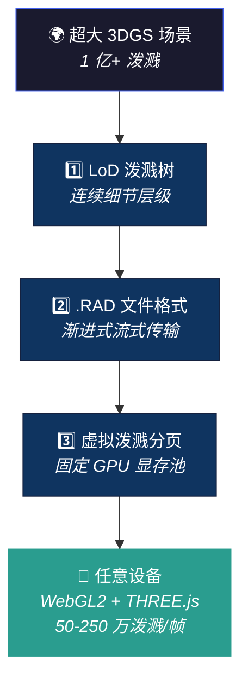

# Spark 2.0：李飞飞 World Labs 开源的 3DGS 网页渲染引擎——1 亿点云手机秒开

> **来源**：World Labs 官方博客 + GitHub 开源
> **发布**：2026-04-14 · [官方博客](https://www.worldlabs.ai/blog/spark-2.0) · [GitHub](https://github.com/sparkjsdev/spark)（2.2K stars, MIT 协议）
> **核心定位**：不是又一个 3DGS viewer——是让**超大规模 3D 高斯泼溅世界**在任意设备的网页浏览器上流式播放的**基础设施**

<table><tr><td>

**整理**：Claude Opus 4.6 × [Pulsar 照见](https://github.com/sou350121/Pulsar-KenVersion) · 2026-04-15

</td></tr></table>

---

## 0. 可复述结论（1 分钟版）

- **一句话**：Spark 2.0 通过 LoD 泼溅树 + .RAD 流式文件格式 + 虚拟显存分页，让 1 亿+ 高斯泼溅场景在手机浏览器上实时渲染。
- **为什么重要**：3DGS 此前只能渲染几百万泼溅，且依赖高端 GPU。Spark 2.0 把上限推到 1 亿+，且跑在 WebGL2 上（覆盖 98% 设备）。
- **对 VLA 的意义**：VLA 需要 3D 场景理解。Spark 2.0 让 3DGS 地图变得**可部署**——机器人可以在网页端可视化自己的 3D 世界模型，操作员可以远程审查。
- **开源**：MIT 协议，npm 安装，THREE.js 集成，[github.com/sparkjsdev/spark](https://github.com/sparkjsdev/spark)。

---

## 1. 问题：为什么 3DGS 之前不能"上网"

3D 高斯泼溅（3DGS）是 2024-2026 年 3D 重建领域的主流方法（比 NeRF 快 100x），但有两个致命限制：

| 问题 | 具体 | 后果 |
|------|------|------|
| **文件太大** | 1000 万泼溅的 .PLY 文件 = 2.3GB | 网页加载需要几分钟 |
| **GPU 显存不够** | 1 亿泼溅需要 ~16GB 显存 | 手机只有 2-4GB，根本跑不动 |

之前的方案要么只能渲染几百万泼溅（小场景），要么依赖 WebGPU（只有 Chrome 桌面端支持，覆盖率低）。

Spark 2.0 的目标：**让任意大的 3DGS 世界在任意设备的浏览器上秒开。**

---

## 2. 三板斧：LoD + .RAD + 虚拟显存



### 2.1 LoD 泼溅树——渲染预算恒定

**核心思想**：不管场景有多大，每帧只渲染固定数量的泼溅（50 万-250 万，取决于设备）。

**怎么做到**：把所有泼溅组织成一棵层级树：
- **叶子节点**：原始的精细泼溅
- **内部节点**：子节点的合并版（低分辨率近似）
- **根节点**：一个巨大的泼溅，粗略代表整个物体

渲染时，用优先队列遍历这棵树：
1. 从根节点开始
2. 把屏幕上最大的节点拆分成子节点
3. 重复，直到达到泼溅预算 N

**效果**：近处的物体自动获得高细节，远处的物体自动降级。整个过程是**连续的**——没有离散切换导致的画面跳变。

**两种构建算法**：
- **Tiny-LoD**：基于网格合并，快速但粗糙（网页端默认）
- **Bhatt-LoD**：基于 Bhattacharyya 距离的相似性配对，质量更高但慢（CLI 默认）

**类比**：Unreal Engine 的 Nanite 对三角面片做了类似的事。Spark 2.0 是 **"Nanite for Gaussians"**。

### 2.2 .RAD 文件格式——边下边看

**问题**：.PLY 文件没压缩（2.3GB）；.SPZ 压缩了但必须全部下载完才能显示。

**.RAD 的设计**：

```
RAD0 头部 → JSON 元数据 → [数据块 1: 6.4 万泼溅] → [数据块 2] → ... → [数据块 N]
```

- 每个数据块是独立的 6.4 万泼溅
- 属性按列存储（position / color / opacity / scale 各自一列）→ Gzip 压缩率高
- **关键**：支持随机访问——可以只下载需要的块，不需要下载整个文件
- 第一个块包含最大的泼溅 → 打开文件几百毫秒就能看到粗略的场景

**渐进式加载**：用户看到的画面从"模糊"逐步变"清晰"，类似 JPEG 的渐进式加载。

### 2.3 虚拟泼溅分页——有限显存渲染无限世界

**思路**：借鉴操作系统的虚拟内存。

- 在 GPU 上预分配一个固定大小的显存池（1600 万泼溅）
- 把显存池分成"页"（每页 6.4 万泼溅，和 .RAD 数据块一一对应）
- 维护一个页表：虚拟地址（.RAD 中的块编号）→ 物理地址（GPU 显存页）
- 当页表满了，用 **LRU（最近最少使用）策略**淘汰旧页

**效果**：无论场景有 1 亿还是 10 亿泼溅，GPU 显存占用恒定（~1600 万泼溅 ≈ 几百 MB）。

---

## 3. 渲染 Pipeline

```
3DGS 文件（.RAD / .PLY / .SPZ）
      ↓
  LoD 泼溅树构建（Rust → WASM, 后台 Web Worker）
      ↓
  每帧：LoD 遍历 → 选最优 N 个泼溅
      ↓
  虚拟分页：按需加载/淘汰数据块
      ↓
  GPU Pipeline：
    1. 全局泼溅收集（所有 3DGS 物体合并）
    2. GPU 排序（距离计算）→ CPU 基数排序（Web Worker）
    3. 单次 instanced draw call（WebGL2）
    4. 每像素：3D 椭球 → 2D 四边形 → 高斯不透明度
      ↓
  THREE.js 场景渲染
```

**性能**：
- 泼溅预算：桌面 ~250 万，手机 ~50 万
- 支持 WebGL2（98%+ 设备覆盖，优于 WebGPU）
- 已验证平台：桌面、iOS、Android、Quest 3、Apple Vision Pro

---

## 4. 实际规模验证

| 场景 | 泼溅数 | 设备 |
|------|:------:|------|
| 宇宙飞船 | 600 万 | 手机流畅 |
| 废墟 | 2600 万 | 手机流畅 |
| Hobbiton | 2400 万 | 手机流畅 |
| Coit Tower（Vincent Woo） | 4000 万 | 手机流畅 |
| 洞穴 | 7300 万 | 桌面流畅 |
| 波兰场景 | **1.06 亿** | 桌面流畅，手机可跑（降低预算） |
| Starspeed 游戏 | **1 亿+** | 多人在线 |

---

## 5. 与其他 3DGS 渲染器的对比

| 特性 | gsplat (Nerfstudio) | Luma Web | GaussianSplats3D | **Spark 2.0** |
|------|:---:|:---:|:---:|:---:|
| 最大泼溅数 | ~500 万 | ~1000 万 | ~500 万 | **1 亿+** |
| LoD 支持 | ❌ | ❌ | ❌ | ✅ 连续式 |
| 流式加载 | ❌ | 部分 | ❌ | ✅ .RAD |
| 虚拟显存 | ❌ | ❌ | ❌ | ✅ |
| WebGL2 | ❌ (WebGPU) | ✅ | ✅ | ✅ |
| THREE.js | ❌ | ❌ | ✅ | ✅ |
| 手机支持 | ❌ | ✅ | 部分 | ✅ |
| 开源 | ✅ Apache | ❌ | ✅ MIT | ✅ MIT |
| VR 支持 | ❌ | ❌ | ❌ | ✅ Quest/AVP |

**Spark 2.0 是目前唯一同时支持 LoD + 流式 + 虚拟显存 + WebGL2 + THREE.js 的开源 3DGS 渲染器。**

---

## 6. 与 VLA 研究的连接

### 3DGS 地图的部署问题被解决了

[OmniMap](pointcloud_slam.md#54-深入omnimap--光学--几何--语义的统一建图)、[MonoGS](pointcloud_slam.md)、SplaTAM 等神经 SLAM 系统生成的 3DGS 地图，之前只能在本地 GPU 上查看。Spark 2.0 让这些地图**可以在网页上流式播放**——操作员可以远程审查机器人建的地图，不需要高端 GPU。

### Marble × Spark = AI 生成 3D 世界

World Labs 的 Marble 从文字/图片生成 3DGS 世界，Spark 渲染它们。这个 pipeline 和 VLA 世界模型高度相关：
- [VLOA](../world-model/vloa_embodied_world_model_3d_point_cloud_trajectory_2026.md) 预测 3D 点云轨迹 → 可以用 Spark 可视化
- [DreamZero](../world-model/dreamzero_world_action_models_zero_shot_policies_2026.md) 在想象中试错 → Spark 让人类能"看到"机器人的想象
- [Goal-VLA](../world-model/goal_vla_image_generative_vlms_as_object_centric_world_model_dissection.md) 生成目标图像 → 如果改成目标 3DGS 场景，Spark 可以让用户在 3D 中审查

### 李飞飞的"空间智能"愿景

> "文本成为了软件的通用接口；3D 正在成为空间的通用接口。"

Spark 2.0 的定位不只是渲染器——它是**空间内容的 HTTP**。就像 HTTP 让文本在互联网上自由流动，Spark + .RAD 格式让 3D 世界在互联网上自由流动。

---

## 7. 快速使用

```bash
npm install @sparkjsdev/spark
```

```html
<script type="module">
import { SparkScene } from '@sparkjsdev/spark';
import * as THREE from 'three';

const scene = new THREE.Scene();
const spark = new SparkScene(scene);
await spark.load('scene.rad');
// 渲染循环中调用 spark.update(camera)
</script>
```

支持格式：.RAD (推荐) / .PLY / .SPZ / .SPLAT / .KSPLAT / .SOG

---

## 8. 待追问的开放问题

❓ **编辑能力**：Spark 2.0 主打渲染和流式传输。但机器人操作需要在地图上标注（"这个区域危险"、"这个物体可以抓"）——Spark 目前支持实时编辑（颜色调整、骨骼动画），但不清楚是否支持语义标注层。

❓ **与 SLAM 的集成深度**：博客展示的都是预先生成的 .RAD 文件。如果机器人在线建图（增量 3DGS），能否增量更新 .RAD 文件？还是必须每次全量重建 LoD 树？

❓ **LoD 树构建成本**：Bhatt-LoD 产生的树比原始泼溅大 30-40%。对于 1 亿泼溅的场景，预处理时间是多少？是否需要服务器端计算？

❓ **渲染质量 vs 预算**：手机上只渲染 50 万泼溅（原始 1 亿的 0.5%），画质损失有多大？博客没有给出 PSNR/SSIM 等定量指标。

❓ **World Labs 的商业模式**：Spark 开源但 Marble（AI 生成 3D 世界）是商业产品。Spark 是"免费刀片"策略——用开源渲染器锁定生态，然后通过 AI 生成服务收费？

---

## 9. Opus 的反思

### 🔮 Spark 可能是 VLA 的"Chrome DevTools"

VLA 研究最大的调试痛点之一：你不知道机器人"看到"了什么。2D 图像可以直接显示，但 3D 表征（点云、3DGS、体素）很难可视化。

Spark 2.0 让研究者可以在浏览器中实时查看机器人的 3D 世界模型——就像 Chrome DevTools 让你查看网页的 DOM 树一样。想象一个调试工具：左边是机器人视角的 2D 图像，右边是 Spark 渲染的 3D 重建，中间是 VLA 的注意力热图叠加在 3D 场景上。

### 🔮 .RAD 格式可能成为 3DGS 的"MP4"

.PLY 是 3DGS 的"原始 BMP"——无压缩、文件巨大。.SPZ 是"PNG"——压缩了但不能流式播放。.RAD 是**"MP4"**——压缩 + 流式 + 渐进式加载。

如果 .RAD 成为事实标准（有 World Labs 的品牌和 GitHub 2.2K stars 的社区推动），所有 3DGS 工具链（训练、编辑、部署）都会围绕它收敛。这对 VLA 意味着：未来 SLAM 系统可以直接输出 .RAD，机器人的 3D 地图天然可以在网页上共享。

### 🔮 "Nanite for Gaussians"打开了新的规模维度

Unreal Engine 的 Nanite 让游戏开发者不再需要手工做 LOD——直接导入电影级资产，引擎自动处理。Spark 2.0 对 3DGS 做了同样的事。

这意味着 VLA 研究者不再需要担心"场景太大跑不动"——把整个工厂的 3DGS 扫描丢给 Spark，它会自动在任意设备上流畅渲染。从"一个桌面"到"一个仓库"的 VLA 场景规模跳跃，渲染瓶颈不再是问题。

---

## 延伸阅读

| 方向 | 推荐 |
|------|------|
| 点云与 SLAM 工具全景 | [pointcloud_slam.md](pointcloud_slam.md)（含 60+ 工具 + OmniMap 深入） |
| 3DGS-SLAM | [MonoGS](pointcloud_slam.md) · [SplaTAM](pointcloud_slam.md) · [GS-SLAM](pointcloud_slam.md) |
| 世界模型 | [VLOA 3D 点云轨迹](../world-model/vloa_embodied_world_model_3d_point_cloud_trajectory_2026.md) · [DreamZero](../world-model/dreamzero_world_action_models_zero_shot_policies_2026.md) |
| 自模型 | [Lipson 自模型](../world-model/teaching_robots_build_simulations_of_themselves_self_model_dissection.md) |
| 3D 感知 | [Zero-1-to-3](zero_1_to_3_zero_shot_one_image_to_3d_object_2023.md) · [Fast-FoundationStereo](fast_foundation_stereo_real_time_zero_shot_stereo_matching_2026.md) |

---

[← Back to Explorer's Map](../README.md)
