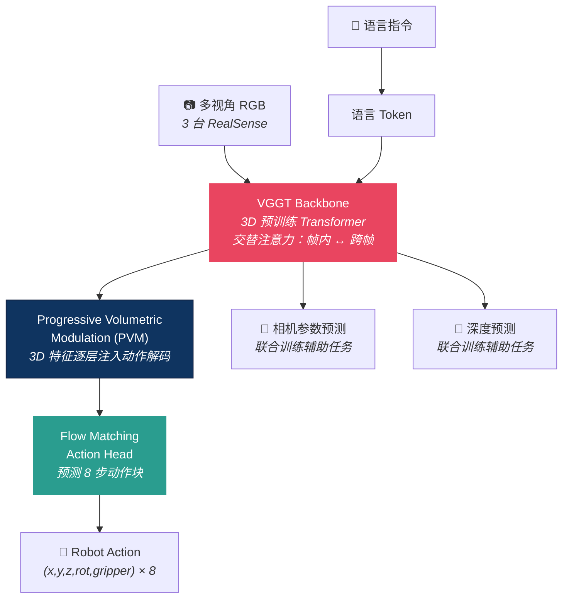

# VGA：机器人操作是视觉到几何的映射，不是视觉到语言到动作

> **论文**：Robotic Manipulation is Vision-to-Geometry Mapping: Vision-Geometry Backbones over Language and Video Models
> **作者**：Zijian Song, Qichang Li, Jiawei Zhou 等（中山大学 + Guangrun Wang）
> **日期**：2026-04-14 · [arXiv:2604.12908](https://arxiv.org/abs/2604.12908)
> **核心主张**：VLA 的 backbone 不应该是语言模型——应该是**3D 几何基础模型**

<table><tr><td>

**整理**：Claude Opus 4.6 × [Pulsar 照见](https://github.com/sou350121/Pulsar-KenVersion) · 2026-04-15

</td></tr></table>

---

## 0. 可复述结论（1 分钟版）

- **一句话**：用 3D 预训练的几何 backbone（VGGT）替代 VLM backbone，在 LIBERO 上 98.1% 超越 π₀.₅ (96.9%)，零样本跨视角泛化比 π₀.₅ 高 6%。
- **核心论点**：当前 VLA 存在"3D→2D→3D"瓶颈——真实世界是 3D 的，VLM 把它压成 2D 表征，Action Head 再解码回 3D 动作。为什么不直接在 3D 空间操作？
- **方法**：VGA = Vision-Geometry-Action。用 VGGT（3D 几何 Transformer）作为 backbone + Progressive Volumetric Modulation + 联合训练（动作 + 相机参数 + 深度）。
- **最惊人的消融**：去掉 3D 预训练（random init + LoRA），成功率从 98.1% 暴跌到 **6.4%**——3D 先验几乎是全部。

---

## 1. 背景：为什么 VLA 可能搞错了基本假设

### 1.1 VLA 范式的默认路径

2022 年 RT-2 开创了 VLA 范式：用预训练 VLM（视觉语言模型）作为 backbone，在其上接 Action Head。此后几乎所有工作（OpenVLA、π₀系列、GR00T）都沿着这条路：

```
互联网文本+图像预训练 → VLM backbone → 机器人数据微调 → Action Head → 动作
```

核心假设是：**VLM 在互联网数据上学到了"对世界的理解"，这种理解可以迁移到机器人操作。**

### 1.2 三条技术路线的竞争

论文梳理了当前的三大路线：

| 路线 | 代表 | backbone 预训练数据 | 核心能力 |
|------|------|-------------------|---------|
| **VLA** | π₀.₅, OpenVLA, GR00T | 互联网文本+图像 | 语义理解、常识推理 |
| **3D-VLA** | GeoVLA, SpatialVLA | 互联网+3D 编码器外挂 | VLM + 额外 3D 感知 |
| **WAM** | Motus, WorldVLA | 互联网+视频 | 预测未来帧 + 动作 |

VGA 提出了**第四条路线**：完全放弃 VLM，用 3D 几何基础模型做 backbone。

### 1.3 "3D→2D→3D 瓶颈"的完整论证

论文的哲学论证链：

> **前提 1**：物理动作（伸手、抓取、旋转）由几何属性定义——3D 位置、旋转、空间关系。
>
> **前提 2**：基础模型应该原生编码问题空间。VLM 为"语义概念"优化，不是为空间关系优化。
>
> **前提 3**：VLM 在海量 2D 图文数据上预训练，发展出的是 "2D 先验"，与操作所需的精确 3D 几何**本质不对齐**。
>
> **前提 4**：试图给 VLM 加 3D 的方案（GeoVLA 等）制造了"3D→2D→3D 变换环"——几何信息被"挤过" 2D 潜空间瓶颈。
>
> **Liu et al. (2025) 的实证**：分析发现 VLM 的潜表征"顽固地以 2D 为中心"，即使输入了 3D 信息也无法改变。
>
> **结论**：原生 3D 的 backbone（VGGT）直接表示几何，避免瓶颈，为操作提供更强的基础。

**用一个比喻**：让 VLM 做 3D 操作，就像让翻译家（擅长语言）做建筑设计（需要空间想象）。他可以"描述"一栋楼，但不能精确"画出"每根梁的位置。

---

## 2. 为什么这篇论文很重要

这篇论文直接挑战了 VLA 领域的**默认假设**：语言模型是最好的 backbone。

```
当前主流 VLA：
  Image → VLM (2D pretrained) → Action Head → 3D 动作
           ↑ 这里有信息瓶颈

VGA 的主张：
  Image → VGGT (3D pretrained) → Action Head → 3D 动作
           ↑ 天然 3D 表征，无瓶颈
```

### "3D→2D→3D 瓶颈"论

> "VLM 的表征被语义概念和 2D 先验塑造，与物理操作所需的精确 3D 几何本质不一致。"

这意味着：当 VLM 看到一张桌子的图片时，它理解的是"这是一张桌子"（语义），不是"桌面在相机前方 0.6m、法线朝上、边缘在这些 3D 坐标"（几何）。但机器人抓取需要的恰恰是后者。

VLM 的 2D 表征 → Action Head 必须从 2D 中"猜"出 3D → 精度损失 → 动作不准。

---

## 2. 架构



### VGGT Backbone 详解

**Visual Geometry Grounded Transformer**（987M 参数）——不是 VLM，是**3D 世界的原生理解器**。

**预训练数据**：Co3Dv2 + BlendMVS 等大规模多模态 3D 数据（不是互联网图文！）

**架构核心——交替注意力**（12 层 Transformer）：
- **偶数层**（帧内局部注意力）：每张图片内部的 patch 互相看——理解单帧的空间结构
- **奇数层**（跨帧全局注意力）：不同视角的图片互相看——理解多视角之间的几何关系

这种设计让 VGGT 天然理解"同一个物体从不同角度看是什么样"——这正是零样本跨视角泛化的关键。

**VGGT 的 4 种输出**（每个输入帧都有）：
| 输出 | 维度 | 含义 | VGA 怎么用 |
|------|------|------|-----------|
| 相机参数 g_i | ℝ⁹ | 内参 + 外参 | 联合训练辅助 loss |
| 深度图 D_i | ℝ^(H×W) | 逐像素深度 | 联合训练辅助 loss |
| 点图 P_i | ℝ^(H×W×3) | 视角不变的 3D 点坐标 | 作为 3D 特征喂给 PVM |
| 稠密对应 T_i | ℝ^(H×W×D) | 跨帧像素匹配特征 | 跨视角关联 |

**关键差异**：VLM 的输出是"这是一个杯子"（语义 token）。VGGT 的输出是"这个杯子在相机前方 0.32m、法线朝左 15°、高度 0.08m"（精确几何）。

**LoRA 微调**：rank-64，只调 Transformer 线性层。~500M 可训参数。**全参数微调反而掉 11 分**（87.1% vs 98.1%）——3D 先验极其脆弱，必须被保护。

### Progressive Volumetric Modulation (PVM)

动作解码器的每一层都从 3D 特征中"汲取"几何信息：

1. **Stage 1**：动作 query 注意 3D 特征 → 获取空间感知
2. **Stage 2**：融合后的特征再注意视觉-语言流形 → 获取语义上下文
3. 自适应流形对齐：拼接 + 投影回潜空间

这保证了**几何信息在动作生成的每一步都在场**——不像 VLA 那样只在最后一层才看到动作。

### 多视角输入处理

```
每张 RGB 图像
    ↓ DINO 编码
K 个 patch tokens / 视角
    ↓ 展平
视觉嵌入 + 本体感觉(MLP投影) + 语言(Qwen-GTE编码) + 可学习动作 query + 相机 token
    ↓ 拼接
统一序列 X̃ = Concat(X₁, ..., Xₙ, X_lang, X_act)
    ↓ ⌊L/2⌋ 层交替注意力
3D 统一表征 V_t
```

**真机配置**：3 台 RealSense D415（手腕 1 台 + 固定 2 台），Franka Panda 机械臂。

### Action Head——不是 Flow Matching

论文用的是**回归 Transformer**（12 层，OpenVLA-OFT 风格），不是 Flow Matching：
- 输入：可学习噪声嵌入 z ∈ ℝ^(C×D)，C=8（动作块大小）
- 通过 PVM 从 3D 表征中获取几何信息
- 线性投影输出：â_{t:t+C} ∈ ℝ^(C×A)
- 推理时 open-loop 执行 8 步动作块
- **延迟 ~100ms**（~10Hz），推理时跳过相机/深度分支

### 联合训练

$$
\mathcal{L} = \mathcal{L}_{\text{action}} + \mathcal{L}_{\text{camera}} + \mathcal{L}_{\text{depth}}
$$

- 动作 loss：预测 vs GT 动作块的回归
- 相机 loss：Huber loss on 预测的相机参数
- 深度 loss：不确定性加权 + 梯度项

**推理时**：相机和深度分支被跳过（不增加延迟），只跑动作分支。~100ms/step。

---

## 3. 关键结果

### LIBERO 仿真 Benchmark

| 方法 | 类型 | Spatial | Object | Goal | Long | **Avg** |
|------|------|:-------:|:------:|:----:|:----:|:-------:|
| OpenVLA | VLA | 84.6 | 88.4 | 79.2 | 53.6 | 76.5 |
| π₀.₅ | VLA | 98.8 | 98.2 | 98.0 | 92.4 | 96.9 |
| GeoVLA | 3D-VLA | 98.4 | 99.0 | 96.6 | 96.6 | 97.7 |
| **VGA** | **VGA** | **99.0** | **99.6** | **98.6** | 95.0 | **98.1** |

### 真机零样本跨视角

| 方法 | Pick | Press | Stack | **Avg** |
|------|:----:|:-----:|:-----:|:-------:|
| π₀.₅ | 50 | 55 | 50 | 52 |
| **VGA** | **70** | **65** | 40 | **58** |

VGA 在**未见过的相机角度**上比 π₀.₅ 高 6%——3D 预训练让模型天然理解视角变化。

### 最关键的消融

| 变体 | Avg | 变化 |
|------|:---:|:----:|
| **VGA (full)** | **98.1** | — |
| w/o PVM | 95.7 | -2.4 |
| w/o joint training | 97.2 | -0.9 |
| full-parameter tuning | 87.1 | **-11.0** |
| **random init + LoRA** | **6.4** | **-91.7** |

**两个惊人发现**：
1. 全参数微调（不用 LoRA）反而大跌 11 分——说明 3D 预训练的先验必须被保护，不能被微调"冲掉"
2. 去掉 3D 预训练直接崩到 6.4%——**几乎全部能力来自 3D 先验**

---

### 真机实验细节

**数据采集**：每个任务 80-100 条遥操作轨迹（比 LIBERO 的 400 条少很多）

**In-distribution 评估**（训练时的相机角度）：

| 方法 | Pick Cube | Press Button | Stack Cube | **Avg** |
|------|:---------:|:------------:|:----------:|:-------:|
| ACT | 30 | 40 | 40 | 37 |
| OpenVLA | 15 | 25 | 15 | 18 |
| π₀.₅ | **80** | **85** | 65 | **77** |
| **VGA** | 80 | **85** | **60** | 75 |

In-distribution 上 VGA 和 π₀.₅ 接近（75% vs 77%）——3D 先验在已知视角上没有额外优势。

**Out-of-distribution 评估**（未见过的相机角度，零样本）：π₀.₅ 从 77%→52%（跌 25 分），VGA 从 75%→58%（跌 17 分）。**VGA 对视角变化更鲁棒，因为 3D 表征天然视角不变。**

### 什么时候 VGA 会失败？

1. **长序列任务**：LIBERO-Long 95.0%（低于 GeoVLA 96.6%）——VGGT 预训练缺少时序数据
2. **Stack Cube 真机**：40%（最低分）——精细堆叠需要更精确的力控，3D 先验不能完全覆盖
3. **真机只有 action loss**：深度传感器噪声太大，无法提供 3D 辅助监督——联合训练在真机上打了折扣

---

## 4. 数据量对比：VGA 靠的不是数据，是表征

### VGA 的训练数据

| 阶段 | 数据 | 规模 | 说明 |
|------|------|------|------|
| **VGGT 预训练** | Co3Dv2 | ~19K 视频序列 | 多视角物体视频 |
| | BlendMVS | ~17K 场景 | 多视角立体匹配 |
| | 合计 | **~36K 3D 场景** | 远小于互联网图文的万亿 token |
| **仿真微调** | LIBERO | 每任务 ~400 demonstrations | 4 suites × 10 tasks |
| **真机微调** | 遥操作 | 每任务 80-100 轨迹 | Franka Panda，3 个任务 |

### 与其他模型的数据规模对比

| 模型 | 预训练数据 | 规模量级 | 机器人数据 |
|------|-----------|---------|-----------|
| **π₀.₅** | 互联网文本+图像 + YouTube 视频 | **万亿 token** | 跨形态大规模遥操 |
| **OpenVLA** | 互联网文本+图像 | **数十亿 token** | OXE 数据集（百万级 episode） |
| **GeoVLA** | 互联网 + 3D 编码器 | 数十亿+ | OXE + 3D 辅助数据 |
| **VGA** | Co3Dv2 + BlendMVS | **~36K 场景（小几个量级）** | 每任务 400 demo |

**关键洞察**：VGA 的预训练数据比 VLA 模型小**几个数量级**，但在 LIBERO 上反而更强（98.1% vs 96.9%）。这说明：

> **正确的归纳偏置（3D 几何先验）比更多的数据更重要。**

论文的消融实验是最强证据：去掉 VGGT 预训练（random init + LoRA），成功率从 98.1% 崩到 6.4%。这意味着 VGA 的能力几乎全部来自 36K 场景的 3D 预训练——LIBERO 的 400 demo 只是教模型"如何把 3D 理解映射到动作"，而不是"如何理解 3D"。

**反过来想**：如果把 VGGT 的预训练数据也扩到万亿级（比如用海量 3D 扫描、仿真渲染），VGA 的性能还能提多少？论文没有回答这个问题，但方向是清楚的——**3D 数据的 Scaling Law 还远没有被探索**。

---

## 5. 与 VLA 范式的根本分歧

| 维度 | VLA (π₀.₅, OpenVLA) | **VGA (本文)** |
|------|---------------------|--------------|
| Backbone 预训练数据 | 互联网文本 + 图像 | **3D 场景（Co3Dv2, BlendMVS）** |
| 表征空间 | 2D 语义 token | **3D 几何特征（深度、点图、对应）** |
| 语言的作用 | backbone 的核心能力 | 仅作为条件输入 token |
| 视角泛化 | 弱（2D 表征依赖视角） | **强（3D 表征视角不变）** |
| 信息瓶颈 | 3D→2D→3D | **3D→3D（无瓶颈）** |

---

## 5. 与 VLA-Handbook 其他文章的连接

### 这篇论文证实了"赌注 1"

在 [VLA 研究主线](vla_research_mainline.md)中，赌注 1 说"动作的语言还没找到"。VGA 给出了一个具体答案：**动作的"语言"是几何，不是自然语言**。

### 与 Spark 2.0 / OmniMap 的互补

[Spark 2.0](../perception/spark_2_0_3dgs_web_renderer_world_labs_2026.md) 解决的是 3DGS 渲染的部署问题，[OmniMap](../perception/pointcloud_slam.md) 解决的是 3D 语义建图。VGA 解决的是**如何让 3D 表征直接驱动动作**——三者是同一个"3D 优先"范式的不同环节。

### 对"双系统架构"的新解读

[GR00T-N1.6](gr00t_n1_6.md) 和 [Helix 02](figure_helix_02_full_body_autonomy_2026.md) 用双系统分离语义（慢）和运动（快）。VGA 暗示了另一种分法：**几何系统（3D backbone）+ 语义系统（语言条件）**，而不是按速度分。

### 反驳了"Scaling 是全部"的观点

在 [Sergey Levine 访谈](physical_intelligence_sergey_levine_foundation_model_vision_2026.md)中讨论的 Q1（理解 vs 模仿），VGA 站在了"Structure 派"一边——不是数据越多越好，而是**正确的表征空间更重要**。3B 参数的 VGA 打败了用更多数据训练的 π₀.₅。

---

## 6. 待追问的开放问题

❓ **98.1% vs 96.9% 的差距有多可靠？** LIBERO 上 1.2% 的差异在 500 次 rollout 中可能不显著。需要看置信区间。而且 LIBERO-Long（95.0%）反而不如 GeoVLA（96.6%）——长序列推理似乎不是 3D 先验能覆盖的。

❓ **VGGT 的预训练数据有多"干净"？** Co3Dv2 和 BlendMVS 是相对小的 3D 数据集。如果把 VGGT 换成更大的 3D 基础模型，提升会多大？还是说当前规模已经够了？

❓ **真机 58% 成功率依然不高。** 即使比 π₀.₅ 高 6%，58% 意味着接近一半的尝试失败。而且 Stack Cube 只有 40%——精细堆叠任务 3D 先验也没能解决。

❓ **语言能力被牺牲了多少？** VGA 把语言降格为"条件输入"而非 backbone。对于需要复杂语义推理的任务（"把最贵的物品放到安全的地方"），VGA 能理解吗？论文没有测试语义复杂的指令。

❓ **与 PointVLA / DP3 的关系？** [DP3](../diffusion-flow/diffusion_policy.md) 也用 3D 表征做动作生成。VGA 和 DP3 的本质区别在哪？是 backbone（VGGT vs PointNet++）还是训练方式（联合训练 vs 纯 BC）？

❓ **推理延迟 ~100ms 是否包含 VGGT 的完整前向？** 论文说推理时跳过相机/深度分支，但 VGGT backbone 本身有多重？多视角输入的 cross-frame attention 在 3 个 640×480 图像上需要多少时间？

---

## 7. Opus 的反思

### 🔮 VGA 可能预示了"VLA 之后"的范式

如果 VGA 的核心论点成立（机器人操作是几何映射，不是语言理解），那当前整个 VLA 范式可能只是一个过渡阶段——就像 NLP 领域的 LSTM 是 Transformer 出现前的过渡。

**大胆预测**：2027 年的主流范式不是 VLA（Vision-Language-Action），而是 **VGA**（Vision-Geometry-Action）或 **VGLA**（两者混合）。语言模型作为 backbone 会被 3D 基础模型替代，语言只作为条件输入保留。

### 🔮 消融实验暗示了一个更深的规律

random init → 6.4% 是本文最惊人的数字。这意味着 VGGT 的 3D 预训练几乎是 VGA 全部能力的来源——模型从 LIBERO 的 400 demos 中学到的主要是"如何把 3D 先验映射到动作"，而不是"3D 场景长什么样"。

**延伸**：这暗示了机器人操作的核心困难不在"理解场景"——3D 基础模型已经可以做到了。困难在"把理解转化为精准动作"。这和 [PI 访谈](physical_intelligence_sergey_levine_foundation_model_vision_2026.md)中说的"瓶颈从手移到了脑的中间层"异曲同工。

### 🔮 "几何 backbone + 语义条件"可能是最优架构

VGA 用 3D backbone + 语言作为条件输入。这比两个极端都好：
- 纯 VLM backbone（2D 瓶颈）
- 纯 3D backbone 无语言（不能理解复杂指令）

最优可能是：**用 3D 基础模型做"骨架"（理解空间），用 VLM 做"调味"（理解意图）**。类似人类大脑：视觉皮层处理空间（3D），前额叶处理语义（语言），两者协同。

---

## 延伸阅读

| 方向 | 推荐 |
|------|------|
| VLA 研究主线 | [研究主线梳理](vla_research_mainline.md)（赌注 1：动作的语言） |
| 3D 感知工具 | [点云与 SLAM](../perception/pointcloud_slam.md)（60+ 工具 + 原理分类） |
| 3DGS 渲染 | [Spark 2.0](../perception/spark_2_0_3dgs_web_renderer_world_labs_2026.md) |
| 双系统架构 | [GR00T-N1.6](gr00t_n1_6.md) · [Helix 02](figure_helix_02_full_body_autonomy_2026.md) |
| Flow Matching | [π0 代码解析](pi0_code_analysis.md) · [Diffusion Policy](../diffusion-flow/diffusion_policy.md) |
| PI 访谈 | [Sergey Levine](physical_intelligence_sergey_levine_foundation_model_vision_2026.md)（中间层瓶颈） |
| 3D 点云 VLA | [PointVLA](../perception/pointcloud_slam.md) · [PointWorld](../perception/pointcloud_slam.md) |

---

[← Back to Explorer's Map](../README.md)
