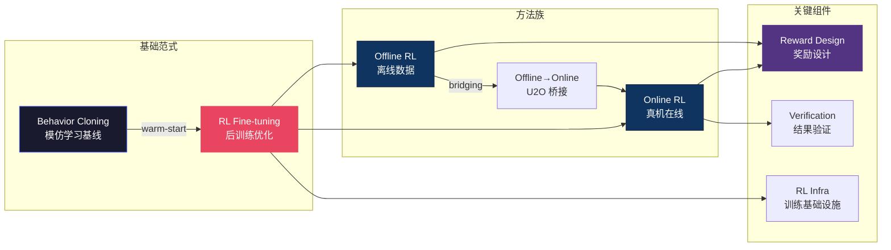

# 🎮 强化学习 — VLA 后训练主线总纲

> **模仿学习只能做到"和人一样好"，强化学习让机器人"比示教更好"。** 2025-2026 年 VLA 领域最大的范式转变之一就是 BC→RL：先用 Behavior Cloning 做 warm-start，再用 RL fine-tuning 突破天花板。π*0.6 Recap、GR-RL 等工作证明这条路线可行，但奖励设计、样本效率、真机在线训练的工程挑战仍然巨大。

---

## 概念关系图

---

## 研究主线

### 1. BC→RL 范式转移 — π*0.6 开路

Physical Intelligence 的 π*0.6 Recap 是标志性工作：先 SFT 再 RL，成功率从 ~60% 提升到 >90%。这条路线已成为 VLA 后训练的默认 playbook。

- [强化学习基础](reinforcement_learning.md)
- [VLA+RL 实战指南](vla_rl_practical_guide.md)
- [π*0.6 Recap — RL as Supervised Learning](pi0_6_recap_rl_as_supervised_learning.md)
- [GR-RL 解剖](gr_rl_dissection.md)

### 2. Online RL — 真机在线训练

在真实机器人上做 online RL 是终极目标，但面临样本效率低、安全约束、硬件磨损等实际问题。EVO-RL 等工作探索了开放世界的在线学习。

- [EVO-RL — 开放世界 RL](evo_rl_open_real_world_rl_recap_pistar06_so101_2026.md)
- [π-StepNFT — 更细步长的在线 RL](pi_stepnft_wider_space_needs_finer_steps_in_online_rl_for_fl_dissection.md)
- [RLInf — VLA RL 训练框架](rlinf_vla_rl_training.md)

### 3. Offline RL — 从历史数据中学习

当真机交互成本过高时，Offline RL 从已有 demo 数据中提取策略。核心挑战是分布偏移（OOD actions）。

- [VLGOR — 视觉语言引导的离线 RL](vlgor_visual_language_knowledge_guided_offline_reinforcement_dissection.md)
- [U2O — 从无监督到在线 RL 的桥梁](unsupervised_to_online_reinforcement_learning_u2o_2024.md)
- [Posterior Optimization](posterior_optimization_with_clipped_objective_for_bridging_e_dissection.md)
- [Prioritized Generative Replay](prioritized_generative_replay_pgr_2025.md)

### 4. 奖励设计 — RL 的灵魂

奖励函数决定 RL 学什么。VLA 场景中稀疏奖励（成功/失败）太慢，密集奖励又难定义。自动奖励发现和验证式奖励是两条前沿路线。

- [Reward Discovery](reward_discovery_rl.md)
- [Scaling Verification > Scaling Policy](scaling_verification_can_be_more_effective_than_scaling_poli_dissection.md)
- [CausalGDP — 因果引导的扩散策略](causalgdp_causality_guided_diffusion_policies_for_reinforcem_dissection.md)

### 5. RL 基础设施与方法论

训练稳定性、算力效率、SFT-RL 的最优切换时机——这些工程问题同样重要。

- [VLA-OPD — 离线 SFT 与在线 RL 的桥接](vla_opd_bridging_offline_sft_and_online_rl_for_vision_langua_dissection.md)
- [RLInf — 训练框架详解](rlinf_vla_rl_training.md)

---

## 方法对比速查

| 方法类型 | 样本效率 | 真机可行性 | 安全保障 | 适用阶段 |
|---------|---------|-----------|---------|---------|
| Online RL (真机) | 低 | ✅ 直接 | ⚠️ 需约束 | 后训练最后一步 |
| Offline RL | 高 | ✅ 无需真机 | ✅ 安全 | SFT 后、Online 前 |
| U2O 桥接 | 中 | ✅ 渐进过渡 | ✅ 较安全 | Offline→Online |
| Verification RL | 高 | ✅ | ✅ | 替代 reward shaping |

---

## 开放问题

1. **SFT→RL 的最优切换点** — 过早切换 RL 会丢失 BC 的多样性，过晚则收敛慢。目前全靠经验调参，缺乏理论指导。
2. **VLA 的奖励泛化** — 一个好的奖励函数能否跨任务迁移？Vision-language reward models 是有希望的方向，但验证不足。
3. **安全约束下的 Online RL** — 真机 RL 需要保证不损坏机器人和环境，如何在 constraint RL 和探索效率之间取得平衡？

---

## 延伸阅读

- 🌊 [扩散与流匹配区](../diffusion-flow/) — RL 优化的动作生成基础
- 🌍 [世界模型区](../world-model/) — 用世界模型做 model-based RL
- 🔧 [部署区](../deployment/) — RL 策略的真机部署
- 🗺️ [返回 Explorer's Map](../theory-readme.md)
