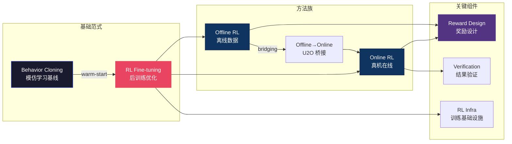

# 🎮 强化学习 — VLA 后训练主线总纲

> **模仿学习只能做到"和人一样好"，强化学习让机器人"比示教更好"。** 2025-2026 年 VLA 领域最大的范式转变之一就是 BC→RL：先用 Behavior Cloning 做 warm-start，再用 RL fine-tuning 突破天花板。π*0.6 Recap、GR-RL 等工作证明这条路线可行，但奖励设计、样本效率、真机在线训练的工程挑战仍然巨大。
>
> 最后更新：2026-06-10。4-6 月的新进展集中在三处：奖励来源（推理型 VLM 奖励 vs 奖励模型校准危机）、轻量在线适配（冻结 VLA + 小 RL 头）、训练系统效率（异步基础设施 + 梯度计算分配）。

---

## 概念关系图

---

## 研究主线

### 1. BC→RL 范式转移 — π*0.6 开路

Physical Intelligence 的 π*0.6 Recap 是标志性工作：先 SFT 再 RL，成功率从 ~60% 提升到 >90%。这条路线已成为 VLA 后训练的默认 playbook。

- [强化学习基础](reinforcement_learning.md)
- [VLA+RL 实战指南](vla_rl_practical_guide.md)
- [π*0.6 Recap — RL as Supervised Learning](pi0_6_recap_rl_as_supervised_learning.md)
- [GR-RL 解剖](gr_rl_dissection.md)

### 2. Online RL — 真机在线训练

在真实机器人上做 online RL 是终极目标，但面临样本效率低、安全约束、硬件磨损等实际问题。EVO-RL 等工作探索了开放世界的在线学习。

4-5 月成势的新路线是**冻结 VLA + 轻量 RL 头**：不动数十亿参数的 backbone，在冻结的 π0.6 内部插入压缩表示层（RL Token），仅训 <1M 参数的 actor-critic，配合参考动作正则化把在线 RL 变成"局部动作编辑"——2-4 小时真机训练就把精密任务（螺丝安装）成功率从 ~20% 提到 65%，关键阶段提速最高 3 倍。判断：与全模型 RL 微调（RECAP/GR-RL 路线）形成清晰两端——全模型换上限，冻结+轻量头换速度与成本；其前提是 VLA 对任务已有基础能力（~20% 成功率起步）。

- [EVO-RL — 开放世界 RL](evo_rl_open_real_world_rl_recap_pistar06_so101_2026.md)
- [π-StepNFT — 更细步长的在线 RL](pi_stepnft_wider_space_needs_finer_steps_in_online_rl_for_fl_dissection.md)
- [RL Token — 冻结 VLA 上的轻量在线 RL](rl_token_bootstrapping_online_rl_with_vision_language_action_dissection.md)
- [RLInf — VLA RL 训练框架](rlinf_vla_rl_training.md)

### 3. Offline RL — 从历史数据中学习

当真机交互成本过高时，Offline RL 从已有 demo 数据中提取策略。核心挑战是分布偏移（OOD actions）。

- [VLGOR — 视觉语言引导的离线 RL](vlgor_visual_language_knowledge_guided_offline_reinforcement_dissection.md)
- [U2O — 从无监督到在线 RL 的桥梁](unsupervised_to_online_reinforcement_learning_u2o_2024.md)
- [Posterior Optimization](posterior_optimization_with_clipped_objective_for_bridging_e_dissection.md)
- [Prioritized Generative Replay](prioritized_generative_replay_pgr_2025.md)

### 4. 奖励设计 — RL 的灵魂

奖励函数决定 RL 学什么。VLA 场景中稀疏奖励（成功/失败）太慢，密集奖励又难定义。自动奖励发现和验证式奖励是两条前沿路线。

4 月时本总纲把 vision-language reward models 列为"有希望但验证不足"；5-6 月的两篇工作把这个判断同时向两个方向推进，张力值得记录：

- **正面证据（SOLE-R1）**：专门训练的 8B 视频推理 VLM，每步输出 CoT + 进度估计，直接作为在线 RL 的**唯一**稠密奖励，零真实奖励、零演示从零学会 40 个任务中的 24 个——而通用大模型 GPT-5 只有 7/40、Gemini-3-Pro 5/40。关键不是模型大小而是显式的时间对比推理（"相比上一步什么变了、对目标有利还是有害"）；失败模式从 reward hacking 变成 signal-limited，说明 CoT 让奖励更难被欺骗。
- **反面证据（坏行为数据 position paper, ICML 2026 spotlight）**：现有 SOTA 具身奖励模型（ReWind/GVL/Dopamine）在复杂任务（工具使用）上的偏好排序准确率接近 0.5 随机猜测；根因不是架构而是数据分布——训练集只有成功演示，模型从未见过"什么是坏的"。一句话：奖励模型的校准上限 = 训练数据中的负样本覆盖率。

综合判断：奖励问题正从"怎么手写函数"转向"给奖励模型喂什么数据、让它做什么推理"。推理型奖励能泛化，但泛化的前提是校准，而校准的瓶颈是失败数据稀缺——这两篇恰好互为对方的待解条件。

- [Reward Discovery](reward_discovery_rl.md)
- [Scaling Verification > Scaling Policy](scaling_verification_can_be_more_effective_than_scaling_poli_dissection.md)
- [SOLE-R1 — 视频推理作为唯一在线奖励](sole_r1_video_language_reasoning_as_the_sole_reward_for_on_r_dissection.md)
- [好的具身奖励模型需要坏行为数据](position_good_embodied_reward_models_need_bad_behavior_data_dissection.md)
- [CausalGDP — 因果引导的扩散策略](causalgdp_causality_guided_diffusion_policies_for_reinforcem_dissection.md)

### 5. RL 基础设施与方法论

训练稳定性、算力效率、SFT-RL 的最优切换时机——这些工程问题同样重要。

5 月的两篇工作把"RL 训练 VLA 首先是系统问题"坐实，且分别打在算力浪费的两个不同位置：

- **仿真-训练资源竞争（D-VLA）**：物理仿真和模型训练抢同一块 GPU 才是吞吐瓶颈。把数据面（仿真/采样, NCCL）与控制面（权重同步, CPU 侧 Gloo）物理隔离 + 四线程异步流水线，在 π0.5/OpenVLA-OFT 上吞吐提升 22%–86%——完全不改 GRPO 算法本身。代价是单步权重陈旧，且仅在 ManiSkill 仿真验证。
- **梯度计算分配（PCM）**：反直觉的实测——GRPO 训练里梯度计算占 78% 时间（rollout 只占 21%），且大量浪费在策略已学会的阶段。只对成功/失败轨迹真正分化的 <20% chunks 算梯度（Neyman 分配 + 夹爪 phase 标注），LIBERO 上 2.38× 墙钟加速、激活内存降 60%，最终成功率不降。

判断：加速 rollout（世界模型/更快仿真/异步基础设施）与加速梯度（PCM 类 compute allocation）是正交的，可叠加；VLA RL 的卡点正从"算法收敛"转向"单位 GPU 时间能买到多少有效学习信号"。

- [D-VLA — 高并发分布式异步 RL 框架](d_vla_a_high_concurrency_distributed_asynchronous_reinforcem_dissection.md)
- [PCM — 只在结果分化处算梯度](learn_where_outcomes_diverge_efficient_vla_rl_via_probabilis_dissection.md)
- [VLA-OPD — 离线 SFT 与在线 RL 的桥接](vla_opd_bridging_offline_sft_and_online_rl_for_vision_langua_dissection.md)
- [RLInf — 训练框架详解](rlinf_vla_rl_training.md)

---

## 方法对比速查

| 方法类型 | 样本效率 | 真机可行性 | 安全保障 | 适用阶段 |
|---------|---------|-----------|---------|---------|
| Online RL (真机) | 低 | ✅ 直接 | ⚠️ 需约束 | 后训练最后一步 |
| Offline RL | 高 | ✅ 无需真机 | ✅ 安全 | SFT 后、Online 前 |
| U2O 桥接 | 中 | ✅ 渐进过渡 | ✅ 较安全 | Offline→Online |
| Verification RL | 高 | ✅ | ✅ | 替代 reward shaping |
| 冻结 VLA + 轻量 RL 头 | 高（数小时真机） | ✅ 已真机验证 | ✅ 参考动作正则约束探索 | VLA 有基础能力后的快速适配 |
| VLM 推理奖励（在线） | 中 | ✅ 零真实奖励/零演示 | ⚠️ 推理延迟 + 残余感知盲区 | 无法手写奖励函数的新任务 |

---

## 开放问题

1. **SFT→RL 的最优切换点** — 过早切换 RL 会丢失 BC 的多样性，过晚则收敛慢。目前全靠经验调参，缺乏理论指导。
2. **VLA 的奖励泛化** — 一个好的奖励函数能否跨任务迁移？Vision-language reward models 是有希望的方向，但验证不足。（6 月更新：[SOLE-R1](sole_r1_video_language_reasoning_as_the_sole_reward_for_on_r_dissection.md) 给出第一个强正面证据——推理型 VLM 奖励跨任务、跨 embodiment、跨视角泛化到 24/40 个未见任务；但[坏行为数据 position paper](position_good_embodied_reward_models_need_bad_behavior_data_dissection.md) 同时表明现有奖励模型在复杂任务上接近随机。问题从"能否泛化"细化为"校准先于泛化"。）
3. **安全约束下的 Online RL** — 真机 RL 需要保证不损坏机器人和环境，如何在 constraint RL 和探索效率之间取得平衡？
4. **坏行为数据的规模化收集**（2026-06 新增）— 奖励模型校准需要真实失败/次优/危险行为数据，但物理采集成本高、有安全风险，合成负样本（扰动/打乱/时间反转）又不等于真实失败。谁先建出"坏行为数据集 + 合成引擎"，谁就握住具身 RLHF 的裁判席。

---

## 延伸阅读

- 🌊 [扩散与流匹配区](../diffusion-flow/) — RL 优化的动作生成基础
- 🌍 [世界模型区](../world-model/) — 用世界模型做 model-based RL
- 🔧 [部署区](../deployment/) — RL 策略的真机部署
- 🗺️ [返回 Explorer's Map](../README.md)
