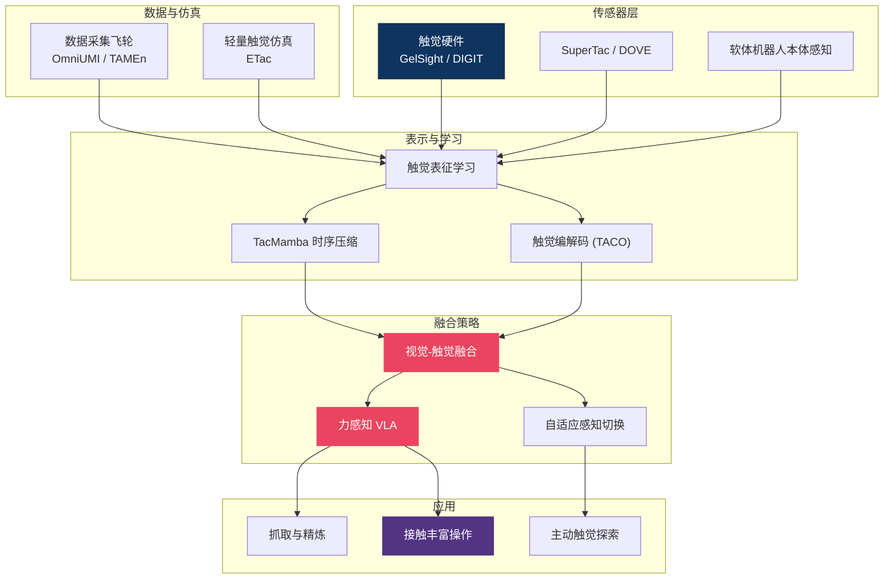

# 🤚 触觉感知 — 多模态触觉主线总纲

> **纯视觉机器人拿起一个鸡蛋——用了 10N 的力。** 这个区域解释为什么视觉不够、触觉不可替代。从传感器硬件（GelSight、DIGIT）到触觉-视觉融合策略，从接触丰富操作到生物学启发，29 篇文章覆盖了触觉 VLA 的完整技术栈。对于需要精细力控的任务（装配、食品处理、医疗），触觉是通往通用操作的必经之路。（最后更新：2026-06-10）

---

## 概念关系图

---

## 研究主线

### 1. 触觉传感器硬件 — 从光学到多模态

GelSight 和 DIGIT 开启了高分辨率光学触觉时代，SuperTac/DOVE 进一步实现多模态（力+滑动+温度）。软体机器人的本体感知也可视为广义触觉。

仿真端 4 月后有实质进展：[ETac](etac_a_lightweight_and_efficient_tactile_simulation_framewor_dissection.md) 用"指数衰减线性传播 + 残差网络"把 FEM 保真度蒸馏进粒子级框架（曲面 RMSE 从 0.445mm 降到 0.116mm），单张 4090 跑 4096 个并行环境——触觉 RL 训练的算力瓶颈基本解除。但其训练数据全来自 FEM、材料属性泛化未验证，"快"的问题解了，"真"的问题还在（见开放问题 1）。

- [触觉 VLA 综述](tactile_vla.md)
- [SuperTac DOVE 多模态传感器](supertac_dove_multimodal_tactile_sensor.md)
- [软体机器人本体感知](soft_robot_proprioception_gvs_sensitivity_ellipsoid.md)
- [UniVTac — 统一视触觉仿真](univtac_unified_visuo_tactile_simulation_platform_2026.md)
- [ETac — 轻量高效触觉仿真](etac_a_lightweight_and_efficient_tactile_simulation_framewor_dissection.md)

### 2. 触觉-视觉融合策略 — 什么时候该"摸"，以及触觉信号放在哪一层

并非所有时刻都需要触觉。关键问题是如何融合视觉和触觉信号，以及何时主动切换感知模态。

4-6 月最强的收敛信号：**融合位置正在从特征层持续下移**。三条独立证据指向同一判断——把触觉直接拼进特征层不仅无益、可能有害：[Policy Consensus 深扒](multi_modal_manipulation_via_multi_modal_policy_consensus_dissection.md) 实测特征拼接在遮挡抓取上只有 5%、还不如纯视觉的 35%（错误融合比不融合更糟），其策略级组合（模态专属扩散专家 + 路由器共识权重）达到 65%；[From Reach to Insert](from_reach_to_insert_tactile_augmented_precision_assembly_un_dissection.md) 更激进——触觉只进 critic 不进 actor，把触觉从"控制信号"重新定位为"评估信号"以隔离抓握偏移噪声，0.05mm 间隙插入 67% 成功率；[TouchGuide 深扒](touchguide_inference_time_steering_of_visuomotor_policies_vi_dissection.md) 则在推理时用接触可行性梯度引导动作采样，基策略（DP/π0.5）零修改即获触觉能力。判断：触觉融合的设计空间已从"拼在哪个 encoder 后面"扩展为"进 actor、进 critic、还是进采样器"，且后两者在接触期表现更稳。

- [触觉为何不可替代](tactile_irreplaceable.md)
- [FaVLA — 力自适应快慢 VLA](favla_a_force_adaptive_fast_slow_vla_model_for_contact_rich_dissection.md)
- [Learning When to See and Feel](learning_when_to_see_and_when_to_feel_adaptive_vision_torque_fusion_dissection.md)
- [Policy Consensus 多模态操作](policy_consensus_multimodal_manipulation_2025.md) ｜ [深扒版](multi_modal_manipulation_via_multi_modal_policy_consensus_dissection.md)
- [TAF-VLA — 触觉力对齐](taf_vla_tactile_force_alignment_2026.md)
- [From Reach to Insert — 触觉仅入 critic 的非对称设计](from_reach_to_insert_tactile_augmented_precision_assembly_un_dissection.md)

### 3. 触觉表征学习 — 把触觉变成可用特征

原始触觉信号（图像序列、力曲线）需要编码为紧凑表征才能接入 VLA。TacMamba 和 TACO 分别从时序压缩和编解码角度解决这个问题。

5 月的新动向是**物理 grounded 的结构化表示**：[语义接触场 SCFields](semantic_contact_fields_for_category_level_generalizable_tac_dissection.md)（RSS 2026）把语义特征、接触概率和接触力向量拼成统一 3D 字段，抓住"同类工具几何千变万化、有效部位的接触模式不变"这一不变量，在未见工具实例上零样本泛化（10 种容器刮平面平均 87%）。判断：触觉表征的下一站可能不是更好的编码器，而是把"在哪接触、用多大力"显式编进表示——但其两阶段 Sim-to-Real 依赖几何启发式伪标签，复杂曲面下仍不可靠。

- [TacMamba — 触觉历史压缩](tacmamba_a_tactile_history_compression_adapter_bridging_fast_dissection.md)
- [TACO — 触觉编解码基准](taco_a_benchmark_for_lossless_and_lossy_codecs_of_heterogene_dissection.md)
- [Visual-Tactile Pretraining](visual_tactile_pretraining_online_multitask_learning_2026.md)
- [Self-supervised Multisensory Pretraining](self_supervised_multisensory_pretraining_for_contact_rich_ro_dissection.md)
- [SCFields — 语义接触场](semantic_contact_fields_for_category_level_generalizable_tac_dissection.md)

### 4. 接触丰富操作 — 触觉的主战场

插拔、装配、擦拭——这些任务的共同点是需要持续的接触反馈。GenForce、TouchGuide 等工作聚焦这类场景。

触觉世界模型正从"建模"走向"接入 VLA 决策闭环"：[DreamTacVLA](learning_to_feel_the_future_dreamtacvla_for_contact_rich_man_dissection.md) 的 Think-Dream-Act 让策略先用世界模型"梦"到 draft 动作的触觉后果、再修正动作，peg-in-hole 达 95%——与 OmniVTA 的视触觉世界建模一脉相承，但首次把高分辨率触觉预测做成 VLA 的一等公民（此前触觉 VLA 多用低维力/扭矩信号）。判断：接触丰富操作的竞争焦点正从"感知当前接触"转向"预测未来接触"，代价是两遍推理的延迟，高速动态接触场景仍不适用。

- [GenForce — 触觉力迁移](genforce_tactile_force_transfer_2026.md)
- [TouchGuide — 推理时触觉引导](touchguide_inference_time_steering_touch_guidance_2026.md) ｜ [深扒版](touchguide_inference_time_steering_of_visuomotor_policies_vi_dissection.md)
- [TacRefineNet — 纯触觉抓取精炼](tacrefinenet_tactile_only_grasp_refinement_2026.md)
- [OmniVTA — 视触觉世界建模](omnivta_visuo_tactile_world_modeling_for_contact_rich_roboti_dissection.md)
- [DreamTacVLA — 触觉世界模型入 VLA](learning_to_feel_the_future_dreamtacvla_for_contact_rich_man_dissection.md)
- [UniTachHand — 统一灵巧手触觉](unitachhand.md)

### 5. 生物学启发 — 从人类触觉中学习

人的触觉系统远比当前传感器复杂。Vicarious Body Maps 和主动探索策略从神经科学中汲取灵感。

- [Vicarious Body Maps — 替代身体映射](vicarious_body_maps.md)
- [主动触觉探索 — 刚体位姿估计](active_tactile_exploration_for_rigid_body_pose_and_shape_est_dissection.md)
- [主动触觉探索 — EIG 2026](active_tactile_exploration_rigid_body_pose_shape_eig_2026.md)

### 6. 触觉数据采集 — 从"加传感器"到数据飞轮（2026-04 起成势）

4-6 月新成势的主题：触觉 VLA 的瓶颈正在从模型与融合架构转向**数据采集范式本身**。两条互补路线：[OmniUMI](omniumi_towards_physically_grounded_robot_learning_via_human_dissection.md) 把 UMI 类手持接口扩展为六模态同步采集（RGB/深度/轨迹/触觉/内部夹持力/外部 wrench），关键洞察是"不是加传感器，而是让人类感知力"——双边夹爪力反馈使演示力波动降低约 62%；[TAMEn](tamen_tactile_aware_manipulation_engine_for_closed_loop_data_dissection.md) 则构建闭环数据飞轮：在线可行性验证把演示重放率从 26% 提到 100%，AR 触觉恢复遥操作采集真实失败下的修正数据，双臂成功率 34%→75%。TouchGuide 配套的 TacUMI（约 $720）也属此线。最尖锐的判断来自 TAMEn：**10% 在线恢复数据比 50% 额外演示更有效——触觉数据是质量问题，不是规模问题**。这直接关联开放问题 3：在谈 scaling law 之前，先要解决"采什么、怎么采"。

- [OmniUMI — 六模态人类对齐采集接口](omniumi_towards_physically_grounded_robot_learning_via_human_dissection.md)
- [TAMEn — 闭环触觉数据飞轮](tamen_tactile_aware_manipulation_engine_for_closed_loop_data_dissection.md)

---

## 融合策略对比

| 方法 | 融合方式 | 实时性 | 适用场景 | 代表工作 |
|------|---------|--------|---------|---------|
| Early Fusion | 拼接原始信号 | ✅ 快 | 简单接触 | TacMamba |
| Adaptive Fusion | 动态权重切换 | ✅ 快 | 混合任务 | FaVLA, When-to-See |
| Force Alignment | 力-动作对齐 | ⚠️ 中 | 精细装配 | TAF-VLA |
| Policy Consensus | 多策略投票 / 扩散分数组合 | ⚠️ 中 | 高安全要求、模态主导失衡 | Policy Consensus |
| Critic-only 注入 | 触觉仅入价值函数 | ✅ 快 | 亚毫米装配（抓握噪声大） | From Reach to Insert |
| Inference-time Guidance | 动作采样梯度引导 | ⚠️ 中 | 给已部署纯视觉策略加触觉 | TouchGuide |
| World-model Dream | 预测未来触觉再修正动作 | ❌ 慢（两遍推理） | 准静态接触丰富任务 | DreamTacVLA |

---

## 开放问题

1. **触觉 Sim-to-Real Gap** — 触觉仿真（UniVTac 等）仍远不如视觉仿真成熟，仿真中训练的触觉策略迁移到真机效果有限。**张力**：4 月时这个判断偏悲观；5-6 月的证据把问题切成了两半——[ETac](etac_a_lightweight_and_efficient_tactile_simulation_framewor_dissection.md) 表明"效率"一半已被突破（FEM 保真度 + 4096 并行环境），但 [SCFields](semantic_contact_fields_for_category_level_generalizable_tac_dissection.md) 的 Sim-Only 基线 F1 接近零，说明"真实传感器信号对齐"一半依然是硬 gap：仿真变快了，还没变真。
2. **全身触觉覆盖** — 当前工作集中在指尖，但人形机器人需要全身触觉（手臂、躯干）。传感器密度、布线、计算开销都是未解难题。（ETac 的盲抓实验提供了侧面证据：全手触觉 84.45% vs 仅指尖 72.90%，扩大覆盖确有收益。）
3. **触觉预训练的 scaling law** — 视觉有 ImageNet/LAION，触觉的大规模预训练数据集和 scaling 规律尚未建立。新进展指向"先质量后规模"：[TAMEn](tamen_tactile_aware_manipulation_engine_for_closed_loop_data_dissection.md) 实测 10% 在线恢复数据胜过 50% 额外演示，FreeTacMan 3M 触觉-视觉对的预训练也已显效（+10% 成功率）——scaling 路线可能要先经过数据采集范式（见研究主线 6）。
4. **任务特定组件的泛化** — 新方法普遍带着"每任务/每几何一个模块"的尾巴：TouchGuide 的 CPM 任务特定、From Reach to Insert 每个孔几何需单独训练 reach policy、SCFields 不能跨类别泛化。触觉的类别级泛化刚起步，跨任务/跨形态泛化仍是空白。

---

## 延伸阅读

- 👁️ [视觉感知区](../perception/) — 触觉的"搭档"：视觉如何互补
- 🔧 [部署区](../deployment/) — 灵巧手硬件与抓取算法
- 🌍 [世界模型区](../world-model/) — 触觉世界模型
- 🗺️ [返回 Explorer's Map](../README.md)
