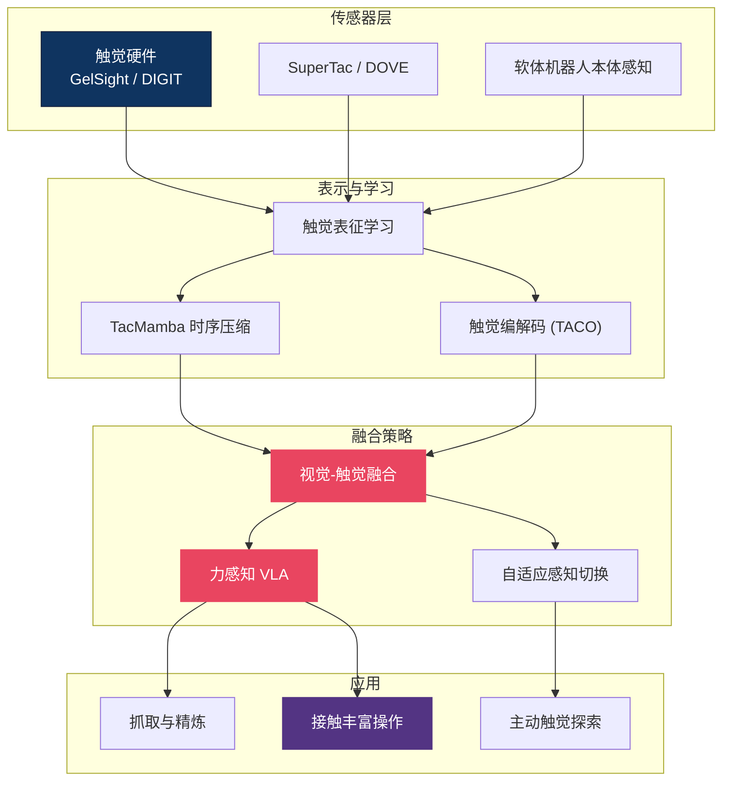

# 🤚 触觉感知 — 多模态触觉主线总纲

> **纯视觉机器人拿起一个鸡蛋——用了 10N 的力。** 这个区域解释为什么视觉不够、触觉不可替代。从传感器硬件（GelSight、DIGIT）到触觉-视觉融合策略，从接触丰富操作到生物学启发，21 篇文章覆盖了触觉 VLA 的完整技术栈。对于需要精细力控的任务（装配、食品处理、医疗），触觉是通往通用操作的必经之路。

---

## 概念关系图

---

## 研究主线

### 1. 触觉传感器硬件 — 从光学到多模态

GelSight 和 DIGIT 开启了高分辨率光学触觉时代，SuperTac/DOVE 进一步实现多模态（力+滑动+温度）。软体机器人的本体感知也可视为广义触觉。

- [触觉 VLA 综述](tactile_vla.md)
- [SuperTac DOVE 多模态传感器](supertac_dove_multimodal_tactile_sensor.md)
- [软体机器人本体感知](soft_robot_proprioception_gvs_sensitivity_ellipsoid.md)
- [UniVTac — 统一视触觉仿真](univtac_unified_visuo_tactile_simulation_platform_2026.md)

### 2. 触觉-视觉融合策略 — 什么时候该"摸"

并非所有时刻都需要触觉。关键问题是如何融合视觉和触觉信号，以及何时主动切换感知模态。

- [触觉为何不可替代](tactile_irreplaceable.md)
- [FaVLA — 力自适应快慢 VLA](favla_a_force_adaptive_fast_slow_vla_model_for_contact_rich_dissection.md)
- [Learning When to See and Feel](learning_when_to_see_and_when_to_feel_adaptive_vision_torque_fusion_dissection.md)
- [Policy Consensus 多模态操作](policy_consensus_multimodal_manipulation_2025.md)
- [TAF-VLA — 触觉力对齐](taf_vla_tactile_force_alignment_2026.md)

### 3. 触觉表征学习 — 把触觉变成可用特征

原始触觉信号（图像序列、力曲线）需要编码为紧凑表征才能接入 VLA。TacMamba 和 TACO 分别从时序压缩和编解码角度解决这个问题。

- [TacMamba — 触觉历史压缩](tacmamba_a_tactile_history_compression_adapter_bridging_fast_dissection.md)
- [TACO — 触觉编解码基准](taco_a_benchmark_for_lossless_and_lossy_codecs_of_heterogene_dissection.md)
- [Visual-Tactile Pretraining](visual_tactile_pretraining_online_multitask_learning_2026.md)
- [Self-supervised Multisensory Pretraining](self_supervised_multisensory_pretraining_for_contact_rich_ro_dissection.md)

### 4. 接触丰富操作 — 触觉的主战场

插拔、装配、擦拭——这些任务的共同点是需要持续的接触反馈。GenForce、TouchGuide 等工作聚焦这类场景。

- [GenForce — 触觉力迁移](genforce_tactile_force_transfer_2026.md)
- [TouchGuide — 推理时触觉引导](touchguide_inference_time_steering_touch_guidance_2026.md)
- [TacRefineNet — 纯触觉抓取精炼](tacrefinenet_tactile_only_grasp_refinement_2026.md)
- [OmniVTA — 视触觉世界建模](omnivta_visuo_tactile_world_modeling_for_contact_rich_roboti_dissection.md)
- [UniTachHand — 统一灵巧手触觉](unitachhand.md)

### 5. 生物学启发 — 从人类触觉中学习

人的触觉系统远比当前传感器复杂。Vicarious Body Maps 和主动探索策略从神经科学中汲取灵感。

- [Vicarious Body Maps — 替代身体映射](vicarious_body_maps.md)
- [主动触觉探索 — 刚体位姿估计](active_tactile_exploration_for_rigid_body_pose_and_shape_est_dissection.md)
- [主动触觉探索 — EIG 2026](active_tactile_exploration_rigid_body_pose_shape_eig_2026.md)

---

## 融合策略对比

| 方法 | 融合方式 | 实时性 | 适用场景 | 代表工作 |
|------|---------|--------|---------|---------|
| Early Fusion | 拼接原始信号 | ✅ 快 | 简单接触 | TacMamba |
| Adaptive Fusion | 动态权重切换 | ✅ 快 | 混合任务 | FaVLA, When-to-See |
| Force Alignment | 力-动作对齐 | ⚠️ 中 | 精细装配 | TAF-VLA |
| Policy Consensus | 多策略投票 | ⚠️ 中 | 高安全要求 | Policy Consensus |

---

## 开放问题

1. **触觉 Sim-to-Real Gap** — 触觉仿真（UniVTac 等）仍远不如视觉仿真成熟，仿真中训练的触觉策略迁移到真机效果有限。
2. **全身触觉覆盖** — 当前工作集中在指尖，但人形机器人需要全身触觉（手臂、躯干）。传感器密度、布线、计算开销都是未解难题。
3. **触觉预训练的 scaling law** — 视觉有 ImageNet/LAION，触觉的大规模预训练数据集和 scaling 规律尚未建立。

---

## 延伸阅读

- 👁️ [视觉感知区](../perception/) — 触觉的"搭档"：视觉如何互补
- 🔧 [部署区](../deployment/) — 灵巧手硬件与抓取算法
- 🌍 [世界模型区](../world-model/) — 触觉世界模型
- 🗺️ [返回 Explorer's Map](../theory-readme.md)
