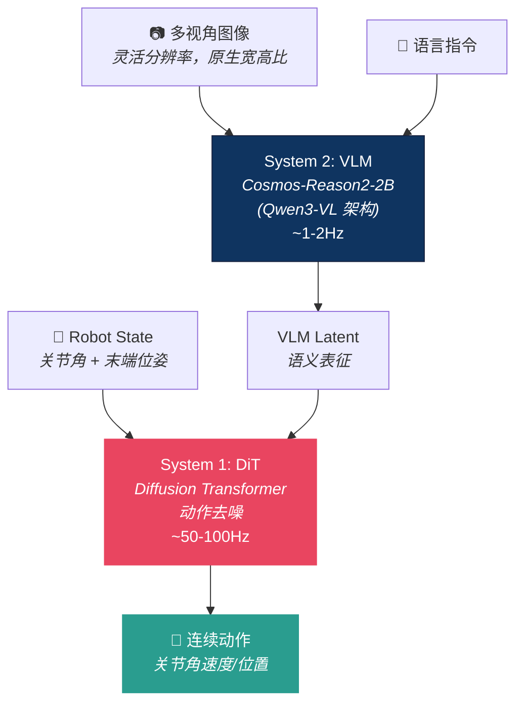

# GR00T-N1.7：NVIDIA 的开源通用机器人基础模型——从人形到任意形态

> **仓库**：[NVIDIA/Isaac-GR00T](https://github.com/NVIDIA/Isaac-GR00T) · 6.7K ⭐ · Apache-2.0
> **模型**：[nvidia/GR00T-N1.7-3B](https://huggingface.co/nvidia/GR00T-N1.7-3B)（HuggingFace）
> **论文**：[GR00T N1: An Open Foundation Model for Generalist Humanoid Robots](https://arxiv.org/abs/2503.14734)
> **定位**：NVIDIA 机器人 AI 生态的核心——Isaac Lab（仿真）× GR00T（策略）× SONIC（运动）× Cosmos（世界模型）

<table><tr><td>

**整理**：Claude Opus 4.6 × [Pulsar 照见](https://github.com/sou350121/Pulsar-KenVersion) · 2026-04-19

</td></tr></table>

---

## 0. 可复述结论

- **一句话**：3B 参数的双系统 VLA（VLM 做语义 + Diffusion Transformer 做动作），Apache-2.0 完全商用许可，**目前开源生态最完整的 VLA**。
- **N1.7 vs N1.6**：换了 VLM backbone（Eagle → Cosmos-Reason2-2B/Qwen3-VL），加了 20K 小时 EgoScale 人类视频预训练，支持 ONNX/TensorRT 导出。
- **开源程度**：🟡 半开源——权重 ✅ + 微调代码 ✅ + 推理/部署 ✅ + 预训练代码 ❌ + 预训练数据 ❌。但在所有商业 VLA 中开放程度最高。
- **硬件覆盖**：从 Jetson Orin（边缘）到 H100（训练），全线支持。

---

## 1. 架构：双系统 + 扩散动作生成



### 为什么是双系统

| | System 2 (VLM) | System 1 (DiT) |
|--|---------------|----------------|
| **做什么** | 理解场景 + 语言指令 | 生成连续动作轨迹 |
| **频率** | ~1-2Hz（慢） | ~50-100Hz（快） |
| **参数** | ~2B | ~1B |
| **关键** | 语义推理、常识 | 运动平滑、精细控制 |

> 7B VLM 跑一次 500ms，做不到 100Hz 控制。所以把"理解"和"执行"分开——VLM 偶尔给一个语义 latent，DiT 高频做动作。
> → 这和 [Helix 02 的 S0/S1/S2](figure_helix_02_full_body_autonomy_2026.md)、[OneTwoVLA](onetwovla.md) 是同一个架构趋势

### N1.6 → N1.7 的关键变化

| 变化 | N1.6 | N1.7 |
|------|------|------|
| VLM backbone | Eagle | **Cosmos-Reason2-2B (Qwen3-VL)** |
| 参数量 | ~2.2B | **~3B** |
| 图像处理 | 固定分辨率 | **灵活分辨率，原生宽高比** |
| 人类视频预训练 | — | **+20K 小时 EgoScale** |
| 导出 | — | **ONNX + TensorRT** |
| 商用 | 研究许可 | **Apache-2.0 商用许可** |

---

## 2. 你实际能做什么

### ✅ 能做

| 功能 | 怎么做 | 一行命令 |
|------|--------|---------|
| **零样本推理** | 在预训练形态上直接跑 | `python scripts/deployment/standalone_inference_script.py` |
| **微调** | 用你的数据适配新机器人 | `python gr00t/experiment/launch_finetune.py` |
| **开环评估** | 对比预测 vs 真实动作 | `python scripts/eval/run_open_loop_eval.py` |
| **闭环部署** | Server-Client 架构到真机/仿真 | `scripts/deployment/` |
| **TensorRT 加速** | 导出 ONNX → TensorRT | 支持 |
| **LIBERO benchmark** | 仿真评估 | `examples/libero/` |

### ❌ 不能做

| 限制 | 说明 |
|------|------|
| **从头预训练** | 预训练代码不公开。你只能微调，不能复现预训练过程 |
| **预训练数据** | 不公开。只有几个 demo 数据集（3-5 episodes） |
| **自定义 VLM** | VLM backbone 是冻结的，不能换成其他 VLM |

---

## 3. 支持的机器人形态

### 预训练形态（零样本可用）

| 形态 | 机器人 | 说明 |
|------|--------|------|
| 人形 | Unitree G1, AgiBOT G1, YAM | 全身控制 |
| 双臂 | 多种 | 双臂协同 |
| 半人形 | — | 上半身 |

### 微调形态（需要你的数据）

| Tag | 机器人 | Demo 数据 |
|-----|--------|----------|
| `LIBERO_PANDA` | Franka Panda | ✅ 5 episodes |
| `OXE_DROID_RELATIVE` | DROID | ✅ 3 episodes |
| `SIMPLER_ENV_WIDOWX` | WidowX | ✅ 有 |
| `SIMPLER_ENV_GOOGLE` | Google Robot | ✅ 有 |
| `NEW_EMBODIMENT` | **你的机器人** | 需要自己采集 |

---

## 4. 数据格式：LeRobot v2 变体

```
your_dataset/
├── meta/
│   ├── info.json           # 数据集元信息
│   ├── episodes.jsonl      # episode 列表
│   ├── tasks.jsonl         # 任务描述
│   └── modality.json       # ← GR00T 特有：state/action/video 映射
├── data/chunk-000/         # parquet 格式的数值数据
└── videos/chunk-000/       # mp4 格式的视频
```

**`modality.json` 是关键**——它定义了哪些列是 state、哪些是 action、哪些是视频。这让 GR00T 能适配任意机器人，不需要改代码。

---

## 5. 硬件需求

| 用途 | GPU | VRAM | 平台 |
|------|-----|:----:|------|
| 推理 | RTX 4090 / L40 / H100 | 16GB+ | x86_64 |
| 推理（边缘） | **Jetson Orin / Thor / DGX Spark** | — | ARM |
| 微调 | H100 / L40 | **40GB+** | x86_64 |
| 多卡微调 | 多× H100 | — | torchrun |

> 💡 **Jetson 部署是 GR00T 的差异化优势**——π0/OpenVLA 都不能在 Jetson 上跑。对于真机部署，这可能是决定性的。

---

## 6. NVIDIA 机器人 AI 生态全景

GR00T 不是独立存在的——它是 NVIDIA 机器人 AI 全栈的一环：

```
┌─────────────────────────────────────────────────┐
│  NVIDIA 机器人 AI 全栈                            │
│                                                 │
│  Cosmos (世界模型/推理) ← VLM backbone 来源       │
│       ↓                                         │
│  GR00T N1.7 (VLA 策略) ← 你在这里                │
│       ↓                                         │
│  SONIC (全身运动控制) ← 底层运动先验              │
│       ↓                                         │
│  Isaac Lab (GPU 仿真) ← 训练环境                 │
│       ↓                                         │
│  Jetson (边缘部署) ← 推理硬件                    │
└─────────────────────────────────────────────────┘
```

**SONIC** 特别值得注意——它是从大规模人类运动数据训练的**运动基础模型**，给 GR00T 提供底层运动技能。类似 [Helix 02 的 S0 层](figure_helix_02_full_body_autonomy_2026.md)——"不知道任务是什么，只负责让身体协调"。

→ 详见 [SONIC (GR00T-WholeBodyControl)](https://github.com/NVlabs/GR00T-WholeBodyControl)

---

## 7. 与其他 VLA 的对比

| 维度 | GR00T-N1.7 | π0 (openpi) | OpenVLA | SmolVLA |
|------|-----------|------------|---------|---------|
| 参数 | 3B | 3B | 7B | 450M |
| Action Head | **Diffusion Transformer** | Flow Matching | Linear | Flow |
| 双系统 | **✅** | ❌ | ❌ | ❌ |
| 微调代码 | **✅** | ✅ | ✅ | ✅ |
| 预训练代码 | ❌ | ❌ | ✅ | ✅ |
| 商用许可 | **Apache-2.0** | Apache-2.0 | MIT | Apache-2.0 |
| Jetson 部署 | **✅** | ❌ | ❌ | ❌ |
| TensorRT | **✅** | ❌ | ❌ | ❌ |
| 人形支持 | **✅ 原生** | 有数据 | ❌ | ❌ |
| 维护 | **🟢 极活跃** | 🟢 | 🟡 停更 | 🟢 |

**GR00T 的独特优势**：双系统 + Jetson 部署 + TensorRT + 人形原生支持 + NVIDIA 全栈生态。
**GR00T 的劣势**：不能从头训、预训练数据不公开、生态锁定 NVIDIA。

---

## 8. 快速开始

```bash
# 克隆（含子模块）
git clone --recurse-submodules https://github.com/NVIDIA/Isaac-GR00T
cd Isaac-GR00T

# 安装
curl -LsSf https://astral.sh/uv/install.sh | sh
uv sync --python 3.10

# 零样本推理（DROID 数据）
uv run python scripts/deployment/standalone_inference_script.py \
  --model_path nvidia/GR00T-N1.7-3B \
  --embodiment_tag OXE_DROID_RELATIVE_EEF_RELATIVE_JOINT \
  --dataset_path demo_data/droid_sample

# 微调到你的机器人
uv run python gr00t/experiment/launch_finetune.py \
  --dataset_path your_data/ \
  --embodiment_tag NEW_EMBODIMENT \
  --num_gpus 1
```

---

## 9. 待追问的开放问题

❓ **N1.7 的 LIBERO 数字呢？** N1.6 声称 SOTA，但 N1.7 的具体数字没有在公开文档中找到。是提升了还是持平？

❓ **真机成功率。** 论文展示了 Fourier GR-1 人形机器人的双臂操作，但没有给出定量成功率。多少 trials？成功率多少？

❓ **EgoScale 20K 小时数据的影响。** N1.7 加了 20K 小时人类视频预训练。这对性能的提升有多大？有没有消融？

❓ **NVIDIA 生态锁定。** GR00T 深度绑定 Isaac Lab + Cosmos + SONIC + Jetson。如果你不用 NVIDIA GPU，整个生态对你没有价值。

❓ **Early Access 的含义。** N1.7 标注 "Early Access"——不接受 PR、稳定性不保证、API 可能变。生产部署的风险？

❓ **`state_dropout_prob` 的影响。** 默认值 0.8（预训练）/ 0.2（微调），文档说"if your task heavily depends on state, reduce"。但到底什么时候算"heavily depends"？

### 内容类型可信度

| 来源 | 可信度 | 说明 |
|------|--------|------|
| GitHub 代码 + README | 高 | 可直接验证，Apache-2.0 |
| NVIDIA 技术博客 | 中-高 | 有技术细节，但可能选择性呈现 |
| 论文 (N1 whitepaper) | 高 | 有消融和对比，但主要针对 N1/N1.5 |
| N1.7 性能声称 | ⚠️ 低 | Early Access，无完整 benchmark 公开 |

---

## 10. Opus 的反思

### 🔮 GR00T 的真正价值不在模型——在生态

π0 的模型可能更强（Flow Matching > Diffusion 在速度上），OpenVLA 的代码可能更干净。但 GR00T 的不可替代优势是**整个 NVIDIA 生态**：

- 训练在 Isaac Lab（最快的 GPU 仿真器）
- VLM 用 Cosmos（NVIDIA 的世界模型）
- 运动用 SONIC（大规模运动预训练）
- 部署在 Jetson（边缘 AI）
- 加速用 TensorRT（最快的推理引擎）

**选 GR00T = 选 NVIDIA 全栈。** 如果你的实验室/公司已经在用 NVIDIA GPU，GR00T 是阻力最小的选择。如果不是——SmolVLA 或 ACT 可能更灵活。

### 🔮 Diffusion Transformer 作为 Action Head 的权衡

GR00T 用 Diffusion Transformer（DiT）做动作生成，π0 用 Flow Matching。两者对比：

- **DiT**：更擅长多模态动作分布 · 去噪过程自带时间平滑 · 但需要多步（~10步）
- **FM**：路径更直（直线 vs 曲线）· 1-5 步 · 但对训练数据质量更敏感

GR00T 选 DiT 可能是因为**人形机器人的动作分布比机械臂更复杂**（更多自由度 = 更多合理动作）——DiT 处理多模态的能力在这里更重要。

---

## 延伸阅读

| 方向 | 推荐 |
|------|------|
| VLA 架构全景 | [VLA 核心架构](vla_arch.md) |
| 开源 VLA 选型 | [完全开源 VLA 指南](open_source_vla_guide.md) |
| 双系统架构 | [Helix 02](figure_helix_02_full_body_autonomy_2026.md) · [OneTwoVLA](onetwovla.md) |
| Flow Matching 对比 | [π0 代码解析](pi0_code_analysis.md) · [Diffusion Policy](../diffusion-flow/diffusion_policy.md) |
| 运动基础模型 | [SONIC (WholeBodyControl)](https://github.com/NVlabs/GR00T-WholeBodyControl) |
| 部署与硬件 | [Isaac Lab](../deployment/isaac_lab.md) · [机械臂控制](../deployment/robot_control.md) |
| PI 对比 | [Sergey Levine 访谈](physical_intelligence_sergey_levine_foundation_model_vision_2026.md) |

---

[← Back to Explorer's Map](../README.md)
