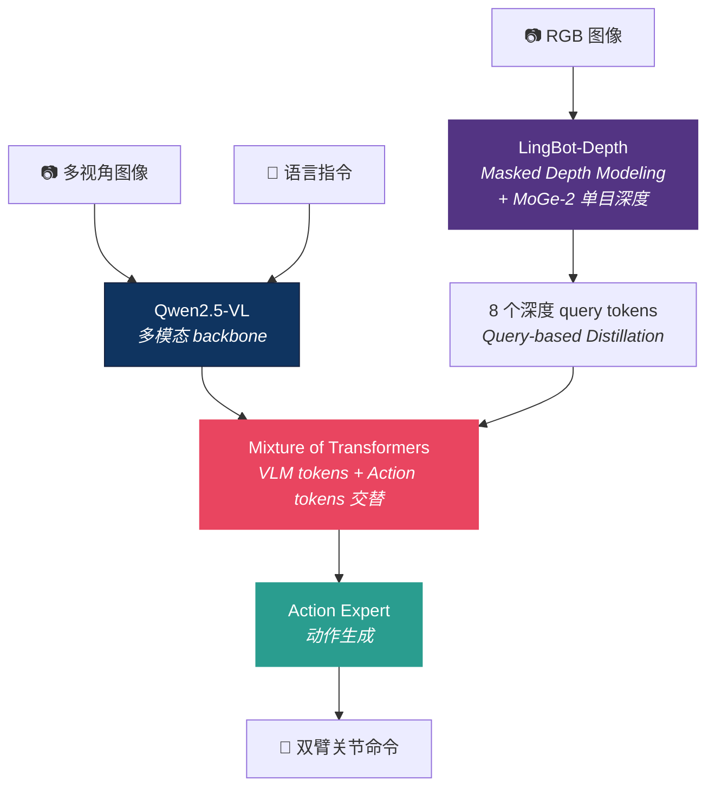

# LingBot-VLA：20,000 小时真实数据预训练的实用主义 VLA

> **仓库**：[Robbyant/lingbot-vla](https://github.com/Robbyant/lingbot-vla) · 1.1K ⭐ · Apache-2.0
> **模型**：[robbyant/lingbot-vla-4b](https://huggingface.co/robbyant/lingbot-vla-4b) · [lingbot-vla-4b-depth](https://huggingface.co/robbyant/lingbot-vla-4b-depth)
> **论文**：[A Pragmatic VLA Foundation Model (arXiv:2601.18692)](https://arxiv.org/abs/2601.18692)
> **团队**：千寻智能 / Robbyant（蚂蚁集团旗下具身 AI 公司）· 上海交通大学
> **关键词**：实用主义 · 20K 小时真实数据 · 9 种双臂配置 · 深度蒸馏 · GM-100 真机 benchmark

<table><tr><td>

**整理**：Claude Opus 4.6 × [Pulsar 照见](https://github.com/sou350121/Pulsar-KenVersion) · 2026-04-19

</td></tr></table>

---

## 0. 可复述结论

- **一句话**：4B 参数 VLA，在 **20,000 小时真实双臂数据**上预训练——目前公开的最大真实机器人预训练规模。
- **"实用主义"体现在**：不追求仿真 SOTA（LIBERO 没报），而是在 **GM-100 真机 benchmark**（3 个平台 × 100 任务）上验证，比 π₀.₅ 高 7.76%。
- **训练效率**：比 StarVLA/OpenPI 快 1.5-2.8x（同等 GPU 配置下）。
- **开源程度**：🟢 完全开源（权重 + 训练 + 推理 + GM-100 数据 + Apache-2.0）。

---

## 1. 为什么这篇值得关注

### 大多数 VLA 的数据困境

| 模型 | 预训练数据 | 真实 vs 仿真 |
|------|-----------|:----------:|
| π₀ | 7 个平台 + 互联网 | 混合 |
| OpenVLA | OXE（970K episodes） | 大部分仿真/遥操 |
| GR00T-N1.7 | 多形态 + 20K hrs EgoScale **视频** | 混合（视频不是操作数据） |
| **LingBot-VLA** | **20,000 小时真实遥操作** | **全部真实** |

**关键区别**：GR00T 的 20K 小时是人类**视频**（EgoScale，看人做事），LingBot 的 20K 小时是机器人**遥操作轨迹**（有动作标签）。后者对 VLA 训练的直接价值高得多。

### GM-100：真机 benchmark 才是真的

| benchmark | 类型 | 任务数 | 机器人数 | 评估方式 |
|-----------|------|:------:|:-------:|---------|
| LIBERO | 仿真 | 4×10 | 1 (Franka) | 500 rollouts |
| **GM-100** | **真机** | **100** | **3 平台** | 130 轨迹/任务/平台 |

> 💡 当 LIBERO 已经饱和（所有人 95-99%），GM-100 这种真机 benchmark 才能区分方法优劣。LingBot 团队选择在真机上验证，不在仿真上刷数字——这是"实用主义"的体现。

---

## 2. 架构



### 三个关键设计

**1. Qwen2.5-VL 作为 backbone**
- 不是 Gemma（π₀ 用的），不是 Llama（OpenVLA 用的）
- Qwen2.5-VL 在中文多模态理解上更强——对中国市场的双臂机器人更友好

**2. 深度蒸馏（可选）**
- **LingBot-Depth**：自监督 Masked Depth Modeling，在大规模 RGB-D 数据上预训练
- 用 8 个可学习的 query tokens 将深度信息注入 VLM
- **不需要推理时的深度相机**——深度信息被"蒸馏"进模型，推理时只需 RGB

> 这解决了一个实际问题：很多部署场景没有深度相机，但训练时可以用。深度蒸馏让模型从深度中"学到"空间理解，部署时不再需要。

**3. Mixture of Transformers**
- VLM tokens 和 Action tokens 在 Transformer 中交替处理
- 不是简单的"VLM 输出 → Action Head 输入"（像 OpenVLA 那样），而是两者**深度交织**

---

## 3. 数据：20,000 小时的分量

### 预训练数据

| 维度 | 详情 |
|------|------|
| 总量 | **20,000 小时**真实遥操作 |
| 机器人 | **9 种双臂配置** |
| 采集方式 | 遥操作（有完整的 state-action 标签） |
| 格式 | LeRobot 兼容 |

### GM-100 Benchmark 数据

| 维度 | 详情 |
|------|------|
| 任务数 | 100 个真实世界操作任务 |
| 机器人 | Agibot G1 · AgileX · Galaxea R1Pro |
| 每任务 | 130 条遥操作轨迹 |
| 开源 | ✅ [robbyant/lingbot-GM-100](https://huggingface.co/datasets/robbyant/lingbot-GM-100) |

---

## 4. 性能

### GM-100 真机结果

| 模型 | 平均成功率 (SR) | 部分成功 (PS) |
|------|:-------------:|:-----------:|
| π₀.₅ | ~10% | — |
| **LingBot-VLA (w/ depth)** | **~18%** | **~35%** |

> ⚠️ **GM-100 的成功率看起来很低**——但这是 **100 个真机任务**的平均，不是 LIBERO 的 10 个仿真任务。真机 100 任务的 18% 可能比仿真 40 任务的 97% 更有意义。

**比 π₀.₅ 高 +7.76%**（真机，跨 3 个平台）。

### RoboTwin 2.0 仿真结果

| 环境 | LingBot-VLA | LingBot-VLA-Depth |
|------|:-----------:|:-----------------:|
| 干净环境 | 86.50% | 88.56% |
| 随机化 | 85.34% | 86.68% |

### 训练效率

| 对比对象 | 加速比 |
|---------|:------:|
| vs StarVLA | **2.8x** |
| vs OpenPI | **1.5x** |

在 8×GPU 配置下达到 **261 samples/sec** 吞吐。

---

## 5. 你实际能做什么

### ✅ 能做

| 功能 | 说明 |
|------|------|
| **推理** | 加载预训练权重直接跑 |
| **微调** | 在你的双臂数据上适配 |
| **GM-100 评测** | 完整 benchmark 数据 + 评估脚本 |
| **深度蒸馏** | 训练时用 RGB-D，部署时只需 RGB |
| **Docker 部署** | 容器化配置 |
| **多卡训练** | 8-256 GPU 配置 |

### ❌ 限制

| 限制 | 说明 |
|------|------|
| **预训练数据不公开** | 20K 小时数据不公开（只有 GM-100 benchmark 数据） |
| **主要面向双臂** | 预训练全是双臂配置，单臂/人形需要微调 |
| **硬件门槛** | 实际训练需要 8+ GPU |

---

## 6. 安装与快速开始

```bash
# 克隆（含子模块）
git clone --recurse-submodules https://github.com/Robbyant/lingbot-vla.git
cd lingbot-vla

# 安装依赖
pip install -r requirements.txt
# 安装 LeRobot（指定 commit）
pip install git+https://github.com/huggingface/lerobot@0cf864870cf29f4738d3ade893e6fd13fbd7cdb5
# 安装 Flash Attention
pip install flash-attn==2.8.3 --no-build-isolation

# 下载预训练权重
python scripts/download_model.py --model robbyant/lingbot-vla-4b-depth

# 推理
python deploy/inference.py --model_path robbyant/lingbot-vla-4b-depth

# 微调（8×GPU）
bash train.sh --config configs/finetune_robotwin.yaml --num_gpus 8
```

---

## 7. 与其他开源 VLA 的对比

| 维度 | LingBot-VLA | GR00T-N1.7 | SmolVLA | OpenVLA |
|------|-----------|-----------|---------|---------|
| 参数 | 4B | 3B | 450M | 7B |
| VLM backbone | Qwen2.5-VL | Cosmos-Reason2 | SmolVLM | Llama 2 |
| 预训练数据 | **20K hrs 真实操作** | 混合(视频+操作) | 社区数据 | OXE |
| 真机 benchmark | **GM-100 (100 任务)** | 有但数字不公开 | ❌ | LIBERO 仿真 |
| 深度蒸馏 | **✅** | ❌ | ❌ | ❌ |
| 双臂原生 | **✅ 9 种配置** | 部分 | ❌ | ❌ |
| 训练速度 | **1.5-2.8x 快** | — | — | baseline |
| 许可证 | Apache-2.0 | Apache-2.0 | Apache-2.0 | MIT |
| 维护 | 🟢 活跃 | 🟢 极活跃 | 🟢 极活跃 | 🟡 停更 |

**LingBot 的独特优势**：最大真实数据 + 真机 benchmark + 深度蒸馏 + 双臂原生。
**LingBot 的劣势**：预训练数据不公开 · 主要面向双臂 · 社区比 LeRobot/GR00T 小。

---

## 8. 待追问的开放问题

❓ **20K 小时数据不公开的影响。** 代码开源但数据不开源——你能微调但不能从头复现。这和 π₀ openpi 的限制类似。什么条件下会公开？

❓ **GM-100 的 18% 成功率如何解读？** 100 个真机任务的 18% 成功率——是任务太难了（GM-100 包含哪些任务？），还是模型太弱？需要看任务分布和难度分层。

❓ **深度蒸馏的消融。** 有深度 vs 无深度的差异有多大？在什么任务类型上深度帮助最大？论文给了 RoboTwin 的数据（86.5% vs 88.6%，差 2%），但真机 GM-100 上呢？

❓ **9 种双臂配置的细节。** 哪 9 种？各占多少数据？如果你的机器人不在这 9 种里，迁移效果如何？

❓ **千寻智能的商业定位。** 蚂蚁集团旗下，30 亿累计融资。开源是生态策略还是纯研究贡献？会不会像 OpenVLA 一样开源后停更？

### 内容类型可信度

| 来源 | 可信度 | 说明 |
|------|--------|------|
| GitHub 代码 | 高 | Apache-2.0，可直接验证 |
| 论文 (arXiv) | 中-高 | 有 GM-100 真机数据，但无同行评审 |
| GM-100 数据 | 高 | HuggingFace 公开，可独立验证 |
| "20K 小时"的声称 | 中 | 数据本身不公开，无法独立核实 |

---

## 9. Opus 的反思

### 🔮 "实用主义"可能是被低估的方向

VLA 社区过度关注 LIBERO 数字（99.6% vs 98.1% vs 96.9%），而 LingBot 团队选择**不报 LIBERO**，转而在 GM-100 真机 100 任务上评测。

这是一个正确的判断：当仿真已饱和，**真机 benchmark 才是区分方法的战场**。LingBot 在真机上比 π₀.₅ 高 7.76%——这 7.76% 比 LIBERO 上 VGA 的 98.1% vs π₀.₅ 的 96.9%（差 1.2%）更有意义。

> **GM-100 可能成为 VLA 领域的下一个标准 benchmark**——就像 LIBERO 取代了 RLBench，GM-100 可能取代 LIBERO。

### 🔮 深度蒸馏是一个值得复制的技巧

"训练时用深度相机，部署时不需要"——这是一种免费的性能提升：
1. 训练数据采集时加一个 RealSense（$300）
2. 训练时用 LingBot-Depth 蒸馏深度信息到模型中
3. 部署时只需要 RGB 相机

这对你的 NIR + F/T 融合方向也有启示：**训练时可以用所有传感器（NIR + F/T + RGB + Depth），部署时只保留最便宜的子集**。蒸馏让你在训练和部署之间做不同的传感器权衡。

### 🔮 双臂是一个被低估的细分市场

大多数 VLA 论文只做单臂。但工业场景（装配、搬运、分拣）大量使用双臂。LingBot 的 9 种双臂配置预训练给了它在这个市场的先发优势。

如果你做双臂操作，LingBot-VLA 是目前**唯一一个在大规模真实双臂数据上预训练的开源 VLA**。

---

## 延伸阅读

| 方向 | 推荐 |
|------|------|
| 开源 VLA 选型 | [完全开源 VLA 指南](open_source_vla_guide.md) |
| VLA 架构对比 | [VLA 核心架构](vla_arch.md) |
| GR00T 对比 | [GR00T-N1.7](groot_n1_7_nvidia_open_foundation_model_2026.md) |
| 深度感知 | [Depth Anything V3](../perception/pointcloud_slam.md) · [VGA 3D backbone](../perception/vga_vision_geometry_action_over_language_video_2026.md) |
| 触觉融合 | [FAVLA](../tactile/favla_a_force_adaptive_fast_slow_vla_model_for_contact_rich_dissection.md) · [TaF-VLA](../tactile/taf_vla_tactile_force_alignment_2026.md) |
| 研究主线 | [VLA 赌注清单](vla_research_mainline.md) |

---

[← Back to Explorer's Map](../README.md)
