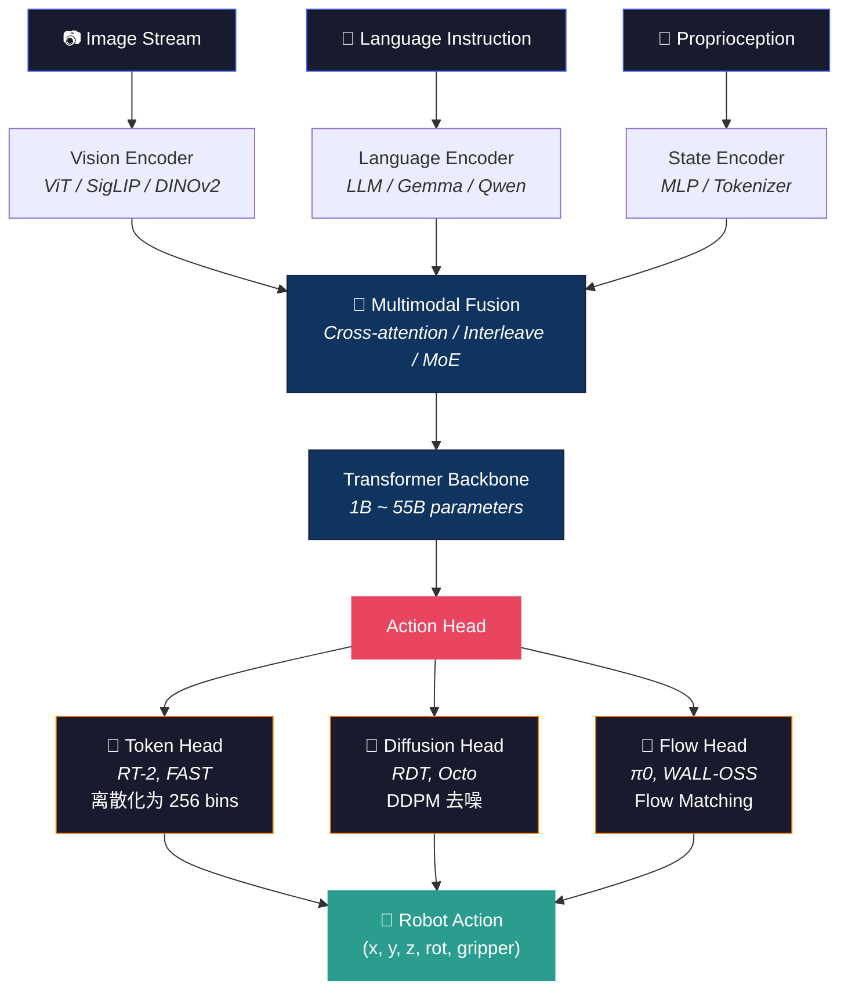

# VLA 核心架构 (VLA Core Architectures)

> **VLA = Vision + Language + Action**。把一个视觉语言模型（VLM）装上"手"，让机器人看懂世界、听懂指令、做出动作。
>
> 本文是 VLA 架构的**全景导航**，从 2022 年的 RT-1 到 2026 年 4 月的最新模型。每个模型附有深度解析链接。

<table><tr><td>

**上次更新**：2026-04-17 · Claude Opus 4.6 × [Pulsar 照见](https://github.com/sou350121/Pulsar-KenVersion)
**⚠️ 仿真饱和警告**：LIBERO benchmark 已饱和（95-99%），本文标注了各模型的真机验证状态

</td></tr></table>

---

## 通用 VLA 架构模板

**所有 VLA 共享同一个骨架**，差异只在三个选择上：



**三个关键选择**：

| 选择 | 选项 | 代表模型 | 权衡 |
|------|------|---------|------|
| **VLM Backbone** | 小 (~1B) vs 大 (~55B) | OpenVLA (7B) vs RT-2 (55B) | 推理速度 vs 语义理解 |
| **Action Head** | Token vs Diffusion vs Flow | RT-2 vs RDT vs π0 | 简单性 vs 多模态动作 vs 速度 |
| **训练策略** | 纯 BC vs Co-train vs RL | RT-1 vs RT-2 vs π*0.6 | 数据效率 vs 泛化 vs 性能上限 |

> 💡 **关键洞察**：VLA 的演进不是模型越大越好，而是在这三个维度上找到最优组合。π0 用 3B 参数 + Flow Matching 打败了 RT-2 的 55B + Token，靠的是更好的 Action Head 设计。

---

## 三代演进

### 第一代：专用模型（2022-2023）

> *"先证明 Transformer 能控制机器人。"*

&nbsp;

#### RT-1 — 开山之作

> **核心思想**：把机器人控制建模为 Token 生成问题。

- **架构**：EfficientNet + FiLM conditioning + TokenLearner + Transformer
- **动作表示**：连续动作离散化为 256 bins → 输出离散 Token 序列
- **数据**：130K episodes，17 个月的 Everyday Robots 数据
- **TokenLearner**：把 81 个视觉 token 压缩到 8 个，推理速度快 2x
- **局限**：只在自家数据上有效，换个桌子就不行——没有互联网知识的迁移

&nbsp;

#### RT-2 — VLA 概念的诞生

> **核心思想**：**VLA = VLM + Action Tokens**。直接微调 PaLI-X (55B)，让大语言模型"说出"动作。

- **关键创新**：动作被编码为特殊文本 token（如 `"1 128 90 ..."`），与自然语言共享词表
- **Co-fine-tuning**：混合训练互联网 VQA 数据 + 机器人数据，防止灾难性遗忘
- **涌现能力**：能理解 "pick up the extinct animal"（抓恐龙玩具）——VLM 的语义理解迁移到了动作
- **局限**：55B 参数推理太慢，无法实时控制

> 💡 **这是一个范式转折点**：RT-2 证明了预训练 VLM 的知识可以直接迁移到机器人控制。之后所有 VLA 都沿着这条路走。

&nbsp;

---

### 第二代：开源浪潮（2024）

> *"让所有人都能训练自己的 VLA。"*

&nbsp;

#### ACT — 动作分块变换器

> 📖 **[Deep Dive: ACT 详解](act.md)**

- **核心数学**：**CVAE（条件变分自编码器）** — 假设动作序列由低维"意图"变量 z 生成
- **Action Chunking**：不是预测下一步，而是一次预测未来 k 步的动作块
- **硬件民主化**：ALOHA 平台只需 ~$20K，双臂遥操作
- **影响**：ACT 是最被广泛复现的 VLA baseline，代码简洁优雅

&nbsp;

#### OpenVLA — 7B 开源 VLA

- **架构**：Llama 2 (7B) + DINOv2/SigLIP
- **Action Head**：不用文本 token，而是专门的线性层 + Action Detokenization
- **优化**：支持 4-bit QLoRA 训练，消费级显卡可跑
- **数据**：Open X-Embodiment (OXE) 数据集

&nbsp;

#### RDT — 扩散变换器

> 📖 **[Deep Dive: RDT 详解](rdt.md)**

- **核心思想**：把 Diffusion Transformer（DiT）从图像生成搬到动作生成
- **规模**：RDT-1B 是首个 **10 亿参数**的扩散策略模型
- **Scalable Transformer**：统一处理不同机器人的异构状态/动作空间
- **开发者**：清华 MARS Lab + 字节跳动

&nbsp;

#### FAST — 高效动作 Token 化

> 📖 **[Deep Dive: FAST 详解](fast.md)**

- **问题**：简单分 bin 丢失高频信息，Diffusion 又太慢
- **方案**：DCT（离散余弦变换）+ BPE（字节对编码）— 频域压缩 + 子词粒度
- **效果**：OpenVLA 训练加速 5x，保持动作精度
- **已被 π0.5 采用**（预训练阶段用 FAST，推理阶段切 Flow Matching）

&nbsp;

---

### 第三代：基础模型竞赛（2025-2026）

> *"从'能用'到'好用'——跨形态、双系统、RL 自我提升。"*

这一代的关键趋势：**双系统架构**（快慢分离）、**跨形态**（一个模型控制多种机器人）、**RL 后训练**（超越模仿学习的天花板）。

&nbsp;

#### π0 → π0.5 → π0.6 / π*0.6 — Physical Intelligence

> 📖 Deep Dive: [π0 代码解析](pi0_code_analysis.md) · [π0.5 解剖](pi0_5_dissection.md) · [π0.6 解剖](pi0_6_dissection.md)

**三步演进**：

| 版本 | 核心升级 | Action Head | 关键创新 |
|------|---------|------------|---------|
| π0 | 基础 VLA，Flow Matching | Flow Matching | 首个用 FM 的 VLA，速度 > Diffusion |
| π0.5 | 开放世界泛化 | FAST (pretrain) + FM (infer) | 统一模型同时做语义规划和电机控制 |
| π0.6 | 5B 参数 VLM 升级 | Flow + Action Expert | 专门的"动作专家"模块解决大模型"手笨" |
| π\*0.6 | **RL 后训练** | 同上 + Recap | Offline RL 复盘成功/失败，吞吐量翻倍 |
| **π0.7** | **组合泛化 + 可操控** | 同上（推测） | **技能重组解决未见任务 · 语言指令实时引导** |

> 💡 **π0.7（2026-04-16 发布）是 PI 系列的最新突破**：首次展示组合泛化——把不同场景学到的技能重新组合解决从未训练过的任务（如用空气炸锅烤红薯，训练数据中从未出现过这个完整任务）。Levine 称"一旦跨过这个门槛，能力的增长是超线性的"。
> → 详见 [π0.7 深度解析](pi0_7_steerable_compositional_generalization_2026.md) · [Sergey Levine 访谈](physical_intelligence_sergey_levine_foundation_model_vision_2026.md)

&nbsp;

#### GR00T-N1.6 — NVIDIA 的人形机器人大脑

> 📖 **[Deep Dive: GR00T-N1.6 解剖](gr00t_n1_6.md)**

- **双系统架构**：
  - **System 2**（慢）：VLM 处理语义指令 → 生成子任务描述（~2Hz）
  - **System 1**（快）：Diffusion Transformer 处理视觉+本体感觉 → 输出关节动作（100Hz）
- **为什么分开**：语义理解不需要 100Hz，运动控制必须达到这个频率。解耦后各自优化。
- **数据**：跨形态训练（Unitree H1、Fourier GR1、自家人形机器人）

&nbsp;

#### Figure Helix 02 — 全身端到端 VLA

> 📖 **[Deep Dive: Helix 02 解剖](figure_helix_02_full_body_autonomy_2026.md)**

- **三层系统**（比 GR00T 多一层）：
  - **S2**（~1Hz）：语义目标
  - **S1**（200Hz）：全身关节目标——视觉 + 触觉 + 掌心相机
  - **S0**（1kHz）：底层扭矩控制——人类运动先验（learned prior）
- **核心突破**：解决了 **loco-manipulation 耦合**——走路和抓东西同时做时不崩溃
- **关键设计**：S0 的人类运动先验承接稳定性，S1 的 visuomotor policy 解决耦合

&nbsp;

#### WALL-OSS — 开源具身 VLA

> 📖 **[Deep Dive: WALL-OSS 详解](wall_oss.md)**

- **架构**：Qwen2.5 VLMoE backbone + **双分支** Action Head
  - **Flow 分支**：精细连续控制（Flow Matching）
  - **FAST 分支**：粗粒度快速动作（离散 token）
- **CoT 推理**：模型先输出中间推理步骤，再生成动作——VLA 级别的思维链
- **定位**："具身 AI 的 Linux"——完全开源，支持 Cross-Embodiment

&nbsp;

#### VGA — 挑战 VLM Backbone 的"异端"

> 📖 **[Deep Dive: VGA 解析](../perception/vga_vision_geometry_action_over_language_video_2026.md)** · [3D 优先原则](../perception/3d_first_principle_vga_spark_embodied_representation_revolution.md)

**VGA 不是 VLA**——它主张用 3D 几何 backbone（VGGT）**替代** VLM backbone：

| | VLA (π₀.₅) | VGA |
|--|-----------|-----|
| Backbone | VLM（2D 预训练） | **VGGT（3D 预训练）** |
| 预训练数据 | 万亿 token | **36K 3D 场景** |
| LIBERO | 96.9% | **98.1%** |
| 零样本跨视角 | 52% | **58%** |

**最惊人的消融**：去掉 3D 预训练 → 98.1% 暴跌到 6.4%。能力几乎全部来自 3D 先验。
**⚠️ 真机**：75%（in-dist），58%（OOD）——仿真优势在真机上缩小。

&nbsp;

#### WVA — 价值函数隐式规划

> **论文**：World-Value-Action Model · [arXiv:2604.14732](https://arxiv.org/abs/2604.14732) · 2026-04-18 · ⚡

WVA 在 VLA 中引入**价值函数做隐式规划**：世界模型预测未来状态 → 价值函数评估轨迹好坏 → 在潜空间中渐进优化。

- **LIBERO**：**99.6%**（当前最高，但 ⚠️ 仿真已饱和）
- **LIBERO-Long**：98.1%（长程推理最优）
- **真机**：75.6%（双臂 Piper，⚠️ 非实时闭环）
- **参数**：2.2B（对比表中最小）

→ 详见 [VLA 研究主线](vla_research_mainline.md)

&nbsp;

#### 更多值得关注的模型

<details>
<summary>展开查看 8 个其他重要模型</summary>

&nbsp;

| 模型 | 定位 | 特色 | Deep Dive |
|------|------|------|----------|
| **Spirit-v1.5** | 小模型高效 VLA | 轻量级架构，适合边缘部署 | [解剖](spirit_v1_5_dissection.md) |
| **SimVLA** | 简洁 baseline | "最简单能跑的 VLA"——实验室复现首选 | [解析](simvla_simple_vla_baseline_robotic_manipulation_2026.md) |
| **Galaxea G0** | 双系统 VLA | 快慢思维分离架构 | [解析](galaxea_g0.md) |
| **OneTwoVLA** | 双系统 VLA | System 1/2 解耦 | [解析](onetwovla.md) |
| **LingBot-VLA** | 实用主义 VLA | 高吞吐训练栈，工程导向 | [解析](lingbot_vla_pragmatic_vla_foundation_model_2026.md) |
| **UnifoLM-VLA-0** | Unitree 开源 VLA | 四足+机械臂的 VLA 实现 | [解析](unifolm_vla_0_unitree_2026.md) |
| **StarVLA** | Lego 式 VLA 代码库 | 模块化研发框架 | [解析](starvla_lego_like_vla_codebase_2026.md) |
| **ABot-M0** | 动作流形学习 | Action Manifold VLA | [解析](abot_m0_action_manifold_learning_vla_foundation_2026.md) |

</details>

&nbsp;

---

## 关键架构趋势

### 趋势 1：双系统架构（快慢分离）

```
System 2 (慢/语义)                    System 1 (快/运动)
┌──────────────────┐                 ┌──────────────────┐
│  VLM (~2Hz)      │  子任务描述 →   │  Action Model    │
│  "把杯子放到架上" │  ─────────→     │  (~100-200Hz)    │
│  → "先抬起杯子"  │                 │  → 关节角度序列   │
└──────────────────┘                 └──────────────────┘
```

**为什么分开？** 语义理解和运动控制的时间尺度差 50-100 倍。一个 7B VLM 跑 100Hz 是不现实的，但 200M 的 Action Model 可以。

**采用的模型**：GR00T-N1.6、Figure Helix 02、Galaxea G0、OneTwoVLA

> → 另见 [小模型 VLA 研究方向](small_vla_models.md)——System 1 天然适合小模型

&nbsp;

### 趋势 2：Action Head 从 Token 走向 Flow

| 方式 | 速度 | 多模态动作 | 精度 | 代表 |
|------|------|-----------|------|------|
| **Token** (离散化) | ⚡⚡⚡ 最快 | ❌ 不行 | 🔶 粗糙 | RT-1, RT-2 |
| **Diffusion** (DDPM) | ⚡ 慢 | ✅ 很好 | 🟢 精细 | RDT, Octo |
| **Flow Matching** | ⚡⚡ 快 | ✅ 很好 | 🟢 精细 | π0, WALL-OSS |
| **FAST** (DCT+BPE) | ⚡⚡⚡ 最快 | 🔶 一般 | 🟢 精细 | FAST tokenizer |

> 💡 **核心权衡**：Token 快但不能处理多模态动作（同一任务的多种做法）。Diffusion 能处理但太慢。Flow Matching 是目前的最优解——速度接近 Token，精度接近 Diffusion。
>
> → 详见 [Diffusion Policy 详解](../diffusion-flow/diffusion_policy.md) · [Flow Matching (π0)](pi0_code_analysis.md) · [Compression Gap](../diffusion-flow/the_compression_gap_why_discrete_tokenization_limits_vision_dissection.md)

&nbsp;

### 趋势 3：RL 后训练成为标配

| 阶段 | 方法 | 效果 | 代表 |
|------|------|------|------|
| Stage 1 | 互联网预训练 | VLM 语义能力 | 所有模型 |
| Stage 2 | 模仿学习 (BC/SFT) | 基本操作能力 | 所有模型 |
| Stage 3 | **RL 后训练** | **超越示范者** | π*0.6, GR-RL |

π*0.6 的 Recap 算法证明了 VLA 可以通过复盘（offline RL）自我提升。这打开了 VLA 的 "post-training" 时代——类似 LLM 从 SFT 到 RLHF 的演进。

> → 详见 [VLA+RL 实战教程](../rl/vla_rl_practical_guide.md) · [GR-RL 解剖](../rl/gr_rl_dissection.md)

&nbsp;

---

### 趋势 4：3D Backbone 挑战 VLM Backbone（2026.04 新方向）

VGA 证明了 3D 几何 backbone 可以用**小几个量级**的预训练数据超越 VLM backbone。核心论点：

> 机器人操作是 Vision→Geometry 映射（f(v)→G），不是 Vision→Language→Action 映射。

VLM 的 2D 表征存在"3D→2D→3D 瓶颈"——3D 世界被压成 2D 潜空间再解码回 3D 动作，信息丢失。

**这是否意味着 VLM backbone 会被淘汰？** 不一定。π₀.₇ 用 VLM 实现了组合泛化——这依赖 VLM 的**语义知识**（"空气炸锅是什么"），3D backbone 做不到。最终可能是融合：**3D backbone 做几何 + VLM 做语义**。

→ 详见 [VGA 解析](../perception/vga_vision_geometry_action_over_language_video_2026.md) · [3D 优先原则](../perception/3d_first_principle_vga_spark_embodied_representation_revolution.md)

&nbsp;

### 趋势 5：从 Token 空间到潜空间（全面迁移）

VLA 的演进本质上是一个**从离散 token 空间到连续潜空间**的迁移过程：

| 组件 | Token 空间（旧） | 潜空间（新） |
|------|------------|-----------|
| 动作 | RT-2 的 256 bins | Flow Matching（π₀） |
| 推理 | CoT 文字输出 | 潜思维链（π₀.₇ 可能已在用） |
| 规划 | 语言子目标 | 潜空间价值函数（WVA） |
| 记忆 | 无 | 潜空间记忆向量（未来方向） |

Token 是人类的语言，不是机器的语言。模型的"母语"是连续向量。

→ 详见 [潜空间综述](../foundation/latent_space_survey_foundation_evolution_mechanism_ability_2026.md)

&nbsp;

---

## ⚠️ 仿真饱和警告（2026-04）

LIBERO benchmark 已饱和——多数方法 95-99%，1-2% 的差异可能只是随机种子的区别。

| 模型 | LIBERO Avg | 真机 | **Sim→Real 跌幅** |
|------|:---------:|:----:|:--:|
| π₀.₅ | 96.9% | 77% / 52%(OOD) | -20~-45 |
| VGA | 98.1% | 75% / 58%(OOD) | -23~-40 |
| WVA | 99.6% | 75.6% | -24 |

**读这张表要看右边两列，不是左边。** 仿真 99.6% 和 96.9% 的差距（2.7%）在真机上可能完全不存在。

---

## 模型全景对比

| 模型 | 年份 | 参数 | Action Head | 开源 | 特色 |
|------|:----:|-----:|------------|:----:|------|
| RT-1 | 2022 | ~35M | Token (256 bins) | ❌ | 开山之作 |
| RT-2 | 2023 | 55B | Text Token | ❌ | 涌现语义能力 |
| ACT | 2023 | ~80M | CVAE Chunk | ✅ 全 | 动作分块，$20K 硬件 |
| Octo | 2024 | ~93M | Diffusion | ✅ 全 | 多形态 Diffusion |
| OpenVLA | 2024 | 7B | Linear Head | ✅ 全 | 4-bit QLoRA |
| RDT-1B | 2024 | 1B | Diffusion Transformer | ✅ 全 | 首个 1B 扩散策略 |
| π0 | 2024 | 3B | Flow Matching | ⚠️ 部分 | 首个 FM VLA |
| π0.5 | 2025 | 3B | FAST + FM | ⚠️ 部分 | 开放世界泛化 |
| π\*0.6 | 2025 | 5B | FM + Action Expert | ❌ | **Recap RL** |
| GR00T-N1.7 | 2025 | ~2B | Diffusion Transformer | ✅ 全 | 双系统 100Hz |
| WALL-OSS | 2025 | ~7B | Dual (Flow + FAST) | ⚠️ 部分 | CoT + 双分支 |
| Helix 02 | 2026 | ? | S0/S1/S2 分层 | ❌ | 全身 loco-manipulation |
| **π0.7** | **2026** | ~5B | FM + Action Expert | ❌ | **组合泛化 · 可操控** |
| **VGA** | 2026 | 987M | 回归 Transformer | ❌ | **3D backbone > VLM** |
| **WVA** | 2026 | 2.2B | FM + Value Function | ❌ | **隐式规划 · 99.6%** |

### 开源状态详解（⚠️ 细看——"开源"不等于"全部开放"）

| 模型 | 权重 | 训练代码 | 推理代码 | 训练数据 | 许可证 | 实际能做什么 |
|------|:----:|:------:|:------:|:------:|--------|-----------|
| **ACT** | ✅ | ✅ | ✅ | ✅ demo | MIT | **完全可复现**。代码干净，社区最大。金标准。 |
| **Octo** | ✅ | ✅ | ✅ | ✅ OXE | MIT | **完全可复现**。OXE 数据集公开。 |
| **OpenVLA** | ✅ | ✅ | ✅ | ✅ OXE | MIT | **完全可复现**。支持 QLoRA 微调。但 2025-03 后停更。 |
| **OpenVLA-OFT** | ✅ | ✅ | ✅ | ✅ OXE | MIT | 推理 25-50x 加速。多图输入 + 双臂。1.1K stars。 |
| **RDT-1B** | ✅ | ✅ | ✅ | ✅ OXE | MIT | **完全可复现**。清华 MARS Lab 维护积极。 |
| **SmolVLA (LeRobot)** | ✅ | ✅ | ✅ | ✅ 社区 | Apache-2.0 | **450M 参数，消费级 GPU 可训**。LIBERO 82-90%。**23K stars，最大社区**。 |
| **CogACT** | ✅ S/M/L | ✅ | ✅ | ⚠️ 部分 | MIT | Microsoft。认知+动作协同。HuggingFace 完整权重。419 stars。 |
| **CrossFormer** | ✅ | ✅ | ✅ | ✅ OXE | MIT | Berkeley。30 种形态跨形态策略。282 stars。 |
| **HybridVLA** | ✅ | ✅ | ✅ | ⚠️ 部分 | MIT | 北大。Diffusion + Autoregressive 混合。346 stars。 |
| **HPT** | ✅ | ✅ | ✅ | ✅ 多源 | MIT | 异构预训练 Transformer。534 stars。 |
| **LingBot-VLA** | ✅ | ✅ | ✅ | ✅ 20K hrs | Apache-2.0 | **20K 小时真实数据**。9 种双臂。生产级工具链。1.1K stars。 |
| **GR00T-N1.7** | ✅ | ✅ 微调 | ✅ | ⚠️ 部分 | Apache-2.0 | **可微调**。NVIDIA 官方 + LeRobot 格式。6.7K stars。 |
| **StarVLA** | ✅ | ✅ | ✅ | ⚠️ 部分 | 未声明⚠️ | Lego 框架。Qwen3.5 backbone。许可证不明确。1.9K stars。 |
| **π0 (openpi)** | ✅ π0+π0.5 | ⚠️ 仅微调 | ✅ | ❌ | Apache-2.0 | **可微调但不可从头训**。预训练代码/数据不公开。11K stars。 |
| **WALL-OSS** | ✅ Flow+FAST | ⚠️ 有限 | ✅ | ❌ | 未声明⚠️ | HuggingFace 有权重。训练代码有限。许可证不明确。 |
| **π\*0.6** | ❌ | ❌ | ❌ | ❌ | — | **完全不可用**。Recap RL 只有论文描述。 |
| **π0.7** | ❌ | ❌ | ❌ | ❌ | — | **完全不可用**。只有博客+媒体报道，连论文都还没发。 |
| **Helix 02** | ❌ | ❌ | ❌ | ❌ | — | **完全不可用**。Figure AI 闭源。 |
| **VGA** | ❌ | ❌ | ❌ | ❌ | — | **完全不可用**。但 VGGT backbone 本身开源（Meta，Apache-2.0）。 |
| **WVA** | ❌ | ❌ | ❌ | ❌ | — | **完全不可用**。刚发论文。 |

### 开源等级总结

| 等级 | 含义 | 模型 |
|:----:|------|------|
| 🟢 **完全开源** | 权重+训练+推理+数据+宽松许可 | ACT, Octo, OpenVLA(-OFT), RDT-1B, **SmolVLA/LeRobot**, CrossFormer, HPT, HybridVLA, **LingBot-VLA**, CogACT |
| 🟡 **可微调** | 有权重+推理+微调代码，但预训练不可复现 | π0 (openpi), GR00T-N1.7, WALL-OSS, StarVLA⚠️ |
| 🔴 **闭源** | 只有论文/博客，无法使用 | π\*0.6, π0.7, Helix 02, VGA, WVA |

> ⚠️ = 许可证未声明，商用前需确认

> 💡 **选型建议**：
> - **初学/快速原型** → SmolVLA（450M，消费级 GPU，23K 社区）或 ACT（代码最干净）
> - **学术研究 baseline** → RDT-1B（1B 扩散，MIT）或 OpenVLA-OFT（推理最快）
> - **跨形态预训练** → CrossFormer（30 形态）或 HPT（异构 Transformer）
> - **工程部署/产品** → GR00T-N1.7（NVIDIA 生态）或 LingBot-VLA（20K 小时数据，生产级）
> - **加新模态（触觉等）** → LeRobot 框架最容易扩展，ACT 代码最好改
> - **了解前沿** → 🔴 等级的论文有参考价值但不可执行

&nbsp;

---

## FAQ

<details>
<summary><b>VLA 和传统机器人控制有什么区别？</b></summary>

传统控制（PID、MPC）需要人手工建模环境和设计控制器。VLA 从数据中端到端学习——输入是摄像头图像和语言指令，输出是关节角度。不需要人工建模，但需要大量示范数据。

两者不是对立的：Helix 02 的 S0 层就用了传统控制作为安全兜底。
</details>

<details>
<summary><b>VLA 能实时控制吗？</b></summary>

取决于 Action Head 和模型大小：
- **Token Head (RT-1)**：~5ms/step → 200Hz ✅
- **Flow Matching (π0)**：~30ms/step → 30Hz ✅
- **Diffusion (RDT)**：~100ms/step → 10Hz 🔶（需要 action chunking 补偿）
- **大 VLM 推理 (RT-2)**：~500ms+ → 2Hz ❌（不够快）

双系统架构解决了这个问题：大 VLM 跑 2Hz 做语义，小模型跑 100Hz 做动作。
</details>

<details>
<summary><b>我应该选哪个模型作为 baseline？</b></summary>

- **快速原型**：[SimVLA](simvla_simple_vla_baseline_robotic_manipulation_2026.md)——最简单
- **学术研究**：[ACT](act.md)——代码最干净，社区最大
- **工程部署**：[OpenVLA](https://openvla.github.io/)——支持量化，文档好
- **追求 SOTA**：π0.6 或 GR00T-N1.6——性能最强但资源需求大
- **代码框架**：[StarVLA](starvla_lego_like_vla_codebase_2026.md)——模块化 Lego 式
</details>

<details>
<summary><b>VLA 十大挑战是什么？</b></summary>

→ 详见 [VLA 十大挑战](../planning/vla_challenges.md)

简要：泛化、实时性、安全、长程任务、多模态融合、数据效率、Sim2Real、评估标准、可解释性、跨形态迁移。
</details>

<details>
<summary><b>LIBERO 99% 了还有意义吗？</b></summary>

**对仿真 benchmark 的排名——意义不大了。** 95-99% 区间的差异可能只是超参数调优。

**真正有意义的是**：
1. 真机成功率（典型 Sim→Real 跌幅 20-40%）
2. 零样本跨视角/跨物体泛化
3. 长程任务（>10 步）的成功率
4. 组合泛化（做训练中从未出现的任务组合）

→ 2026-04 起，本文标注了各模型的真机验证状态
</details>

<details>
<summary><b>VLA 还是 VGA？VLM backbone 会被 3D backbone 替代吗？</b></summary>

**短期不会。** VGA 在几何精度上更强（跨视角 +6%），但 π₀.₇ 用 VLM 实现了组合泛化——这需要互联网语义知识，3D backbone 提供不了。

**最可能的方向**：两者融合。3D backbone 做空间推理（"杯子在哪、怎么抓"），VLM 做语义推理（"这是空气炸锅、应该先打开盖子"）。

→ 详见 [VGA 解析](../perception/vga_vision_geometry_action_over_language_video_2026.md) · [3D 优先原则](../perception/3d_first_principle_vga_spark_embodied_representation_revolution.md)
</details>

&nbsp;

---

## 进一步阅读

| 方向 | 推荐 |
|------|------|
| 研究主线 | [VLA 赌注清单](vla_research_mainline.md) |
| π0.7 | [组合泛化 · 可操控](pi0_7_steerable_compositional_generalization_2026.md) |
| PI 访谈 | [Sergey Levine 深度访谈](physical_intelligence_sergey_levine_foundation_model_vision_2026.md) |
| 3D backbone | [VGA](../perception/vga_vision_geometry_action_over_language_video_2026.md) · [3D 优先原则](../perception/3d_first_principle_vga_spark_embodied_representation_revolution.md) |
| 潜空间理论 | [潜空间综述](../foundation/latent_space_survey_foundation_evolution_mechanism_ability_2026.md) |
| 动作生成 | [动作生成范式](../diffusion-flow/action_representations.md) · [Compression Gap](../diffusion-flow/the_compression_gap_why_discrete_tokenization_limits_vision_dissection.md) |
| 小模型 | [小模型 VLA 深度分析](small_vla_models.md) |
| 3D 工具 | [点云与 SLAM](../perception/pointcloud_slam.md)（60+ 工具） · [Spark 2.0](../perception/spark_2_0_3dgs_web_renderer_world_labs_2026.md) |

---

[← Back to Explorer's Map](../README.md)
