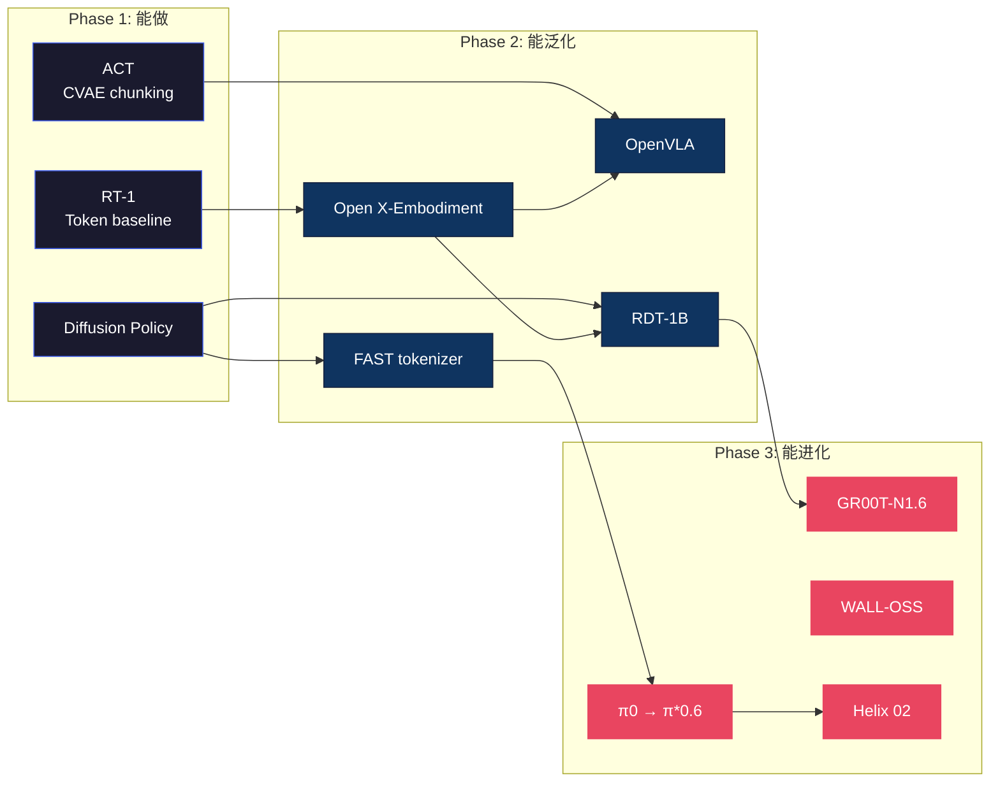

# VLA 研究主线梳理

> 这篇不是分类法，而是一个**赌注清单**。
>
> VLA 研究走到 2026 年中，底下有几条暗流：有些路被反复验证、有些路悄悄收敛、有些路看起来繁荣但可能是死胡同。这篇试图画出这些暗流，帮你判断——**如果你只有 6 个月的时间和一台机器人，该赌哪条路**。

---

## 两个根本问题

在讨论任何技术细节之前，VLA 社区其实在争论两个更深的问题：

### Q1：机器人需要"理解"吗，还是"足够多的模仿"就够了？

一派认为（Scaling 派）：给模型看够多人类操作视频 + 机器人轨迹数据，它自然会学到"物理直觉"——不需要显式的世界模型、不需要推理模块、不需要符号表示。证据：π0.5 在 YouTube 视频上 co-training 后获得了开放世界泛化。

另一派认为（Structure 派）：纯 imitation 有天花板——compounding error、OOD fragility、没有 recovery 能力。必须加入结构化组件：世界模型做预演、CoT 做推理、RL 做自我提升。证据：BEHAVIOR-1K 的 1000 任务中，纯 BC 模型的成功率在第 5 步之后断崖式下跌。

**现实是两边都对一半**。π\*0.6 的 Recap 证明了 Scale + Structure 的组合拳最强——先 scale up BC，再用 RL 补结构性缺陷。这可能是未来 3 年的主旋律。

### Q2："大脑"应该是一个还是两个？

2024 年的 VLA 是一个端到端模型（一个 forward pass 从图像到动作）。2025 年开始，几乎所有新模型都变成了**双系统**。

这不是时髦——是被物理逼的。一个 7B VLM 跑一次 500ms，而机器人手臂需要 100Hz (10ms) 的控制信号。你不可能让一个大模型同时做语义推理和高频运动控制。

但双系统带来新问题：两个系统之间的**接口**是什么？文字（GR00T）？latent vector（Helix）？子目标图像（Goal-VLA）？这个接口的设计可能比两个系统各自的架构更重要——它决定了信息在"理解"和"执行"之间是否会断裂。

→ 详见 [GR00T-N1.6](gr00t_n1_6.md) · [Helix 02](figure_helix_02_full_body_autonomy_2026.md) · [OneTwoVLA](onetwovla.md) · [Galaxea G0](galaxea_g0.md) · [Goal-VLA](../world-model/goal_vla_image_generative_vlms_as_object_centric_world_model_dissection.md)

---

## 演进时间线



- **Phase 1（2022-23）**：证明 Transformer 能控制机器人。RT-1 用 token，ACT 用 CVAE，DP 用 diffusion。三个 baseline 至今仍在用。
- **Phase 2（2024）**：开源 + 统一数据集。OXE 让跨形态预训练成为可能，OpenVLA/RDT/FAST 让所有人都能跑 VLA。
- **Phase 3（2025-26）**：基础模型竞赛开始。核心不再是"能不能做"，而是"能不能在新环境/新任务/新机器人上 work"。

---

## 六个赌注

> 不叫"主线"了——叫**赌注**。每个赌注背后都有一个假设，如果假设成立就是重大突破，如果不成立就是沉没成本。

&nbsp;

### 赌注 1：动作的"语言"还没找到

**假设**：VLA 性能的瓶颈不在 VLM backbone，而在 Action Head。

RT-2 用 55B 参数的 PaLI-X，π0 只用 3B，但 π0 在操作任务上赢了。区别不在"脑子大小"，而在"怎么说动作"。

目前的演进：

| 时期 | 方式 | 比喻 | 问题 |
|------|------|------|------|
| 2022 | Token (256 bins) | 用 256 个字符写诗 | 词汇太少，表达不了微妙动作 |
| 2023 | Diffusion (DDPM) | 从白噪声里"雕"出动作 | 雕得慢，要 10-100 步 |
| 2024 | Flow Matching | 从噪声拉一条直线到目标 | 目前最优，但 1-5 步仍不算快 |
| 2025 | FAST (DCT+BPE) | 把动作当"语言"压缩 | 快但不处理多模态 |
| 2025 | 双分支 (WALL-OSS) | 两种语言按需切换 | 复杂度上升 |

**未被探索的方向**：
- 把动作看成**连续流形上的测地线**（不是欧氏空间的直线）→ [ABot-M0 动作流形](abot_m0_action_manifold_learning_vla_foundation_2026.md)
- 用**神经隐式场**表示动作（不是离散序列）→ [Neural Implicit Action Fields](../diffusion-flow/neural_implicit_action_fields_from_discrete_waypoints_to_con_dissection.md)
- **像素运动**代替关节命令（让模型"画"出未来图像，再反推动作）→ [DAWN](../diffusion-flow/pixel_motion_diffusion_is_what_we_need_for_robot_control_dissection.md)

→ 更多见 [Diffusion Policy](../diffusion-flow/diffusion_policy.md) · [π0 代码解析](pi0_code_analysis.md) · [FAST](fast.md) · [Compression Gap](../diffusion-flow/the_compression_gap_why_discrete_tokenization_limits_vision_dissection.md) · [动作生成范式](../diffusion-flow/action_representations.md)

&nbsp;

### 赌注 2：RL 后训练是 VLA 的 "RLHF 时刻"

**假设**：BC 是 VLA 的 SFT，RL 是 VLA 的 RLHF。两者缺一不可。

LLM 领域已经证明了这条路：GPT-4 的能力大幅提升不是来自预训练的增量，而是 RLHF/DPO 后训练。VLA 正在走同一条路——π\*0.6 的 Recap 是第一个明确的成功案例。

| | LLM | VLA |
|--|-----|-----|
| 预训练 | 网络文本 | 互联网视频 + 机器人数据 |
| SFT | 指令微调 | 行为克隆 (BC) |
| **后训练** | **RLHF / DPO** | **Recap / Online RL** |
| 核心改善 | 对齐 + 安全 + 推理 | **Recovery + 精度 + 长程** |

**争论点**：RL 在真实机器人上太危险（试错 = 摔坏机器人）。解法有三：
1. **仿真先行**：Isaac Lab + Domain Randomization → [Isaac Lab](../deployment/isaac_lab.md)
2. **Offline RL**：不做新探索，只从历史数据中"复盘" → [π\*0.6 Recap](../rl/pi0_6_recap_rl_as_supervised_learning.md)
3. **安全护栏**：力/速度限位的 safety controller 永远在 policy 外层 → 不是研究问题，是工程问题

**我的判断**：这条路会走通，但不是 online RL on real robots（太贵太危险），而是 **仿真 RL + 世界模型 RL + offline replay**。Scale of RL data 会成为下一个竞争维度。

→ 详见 [VLA+RL 实战](../rl/vla_rl_practical_guide.md) · [Evo-RL](../rl/evo_rl_open_real_world_rl_recap_pistar06_so101_2026.md) · [GR-RL](../rl/gr_rl_dissection.md) · [RL 主线总纲](../rl/rl_mainline.md)

&nbsp;

### 赌注 3：世界模型让数据效率跳一个量级

**假设**：如果机器人能在"脑子里"模拟 10000 次，就不需要在现实中做 10000 次。

DreamZero 证明了世界模型不只是规划工具，它**本身就可以当策略用**。AtomVLA 更进一步——用世界模型把长程任务自动拆成"原子步骤"，每个步骤独立验证。

**但这里有一个根本矛盾**：世界模型的预测精度受限于训练数据。如果真实世界的数据不够，世界模型就会"hallucinate"——在想象中做出物理上不可能的事。这和 LLM 的幻觉问题本质相同。

**激进预测**：2027 年，VLA 训练的大部分"轨迹数据"将来自世界模型的仿真，而非真实机器人。就像 AlphaGo 的自我对弈一样——真实数据只提供 seed，合成数据提供 scale。

→ 详见 [World Model 主线](../world-model/world_model_mainline.md) · [DreamZero](../world-model/dreamzero_world_action_models_zero_shot_policies_2026.md) · [AtomVLA](../world-model/atomvla_offline_post_training_predictive_latent_world_models_2026.md) · [EgoSim](../world-model/egosim_egocentric_world_simulator_for_embodied_interaction_g_dissection.md)

&nbsp;

### 赌注 4：触觉是 VLA 从"演示"到"真实"的最后一道门

**假设**：纯视觉 VLA 在接触操作上有不可逾越的天花板。

折衣服、拧瓶盖、插 USB——这些任务的共同点：关键信息不在图像里，在手指上。人类做这些事时 80% 靠触觉。但目前 95%+ 的 VLA 论文只用视觉。

**为什么触觉研究进展慢**：
1. 硬件不统一（每种传感器的数据格式不同）→ [TaCo Benchmark](../tactile/taco_a_benchmark_for_lossless_and_lossy_codecs_of_heterogene_dissection.md)
2. 没有"ImageNet for touch"（缺少大规模触觉数据集）
3. 融合架构没有共识（早期融合/自适应融合/独立通道 → [触觉主线](../tactile/tactile_mainline.md)）

**转折点可能在**：当触觉传感器像摄像头一样便宜时（~$50/个），触觉数据的规模瓶颈就打破了。SuperTac 和 UniVTAC 正在朝这个方向走。

→ 详见 [触觉 VLA](../tactile/tactile_vla.md) · [FAVLA](../tactile/favla_a_force_adaptive_fast_slow_vla_model_for_contact_rich_dissection.md) · [OmniVTA](../tactile/omnivta_visuo_tactile_world_modeling_for_contact_rich_roboti_dissection.md) · [TacMamba](../tactile/tacmamba_a_tactile_history_compression_adapter_bridging_fast_dissection.md)

&nbsp;

### 赌注 5：感知不再是瓶颈——接口才是

**假设**：Vision Encoder 已经足够好了。真正的瓶颈是信息从感知到动作的传递损耗。

DINOv2 和 SigLIP 已经能从图像中提取非常好的语义特征。但 VLA 的失败往往发生在"看到了但没用上"——注意力没聚焦到正确的物体、跨模态对齐不够强、语言指令的语义没有传递到动作层。

**三个证据**：
1. **LangGap** 发现 VLA 的语言理解能力比 VLM 差很多——动作训练"冲淡"了语言能力 → [LangGap](langgap_diagnosing_and_closing_the_language_gap_in_vision_la_dissection.md)
2. **ReconVLA** 用重建监督强迫注意力聚焦目标，不改 action head 就提升了成功率 → [ReconVLA](reconvla_implicit_grounding_by_reconstruction.md)
3. **FocusVLA** 用 gaze-like 机制选择性处理视觉信息，减少无关干扰 → [FocusVLA](focusvla_focused_visual_utilization_for_vision_language_acti_dissection.md)

**延伸思考**：这和人类的注意力问题一样——你看到了房间里的一切，但如果大脑没有"注意到"桌上的杯子，你就抓不到它。VLA 的 cross-attention 就是它的"注意力分配器"。

→ 也见 [视觉感知技术](../perception/perception_techniques.md) · [EyeVLA](../perception/look_zoom_understand_the_robotic_eyeball_for_embodied_percep_dissection.md) · [语言如何改写视觉](../perception/language_shapes_perception.md)

&nbsp;

### 赌注 6：VLA 和自动驾驶正在收敛

**假设**：VLA（机器人操作）和 AD（自动驾驶）在架构上正在走向同一条路。

这不是预测——已经在发生：
- **DriveDreamer-Policy** 把 World-Action Model 用在自动驾驶上 → [DriveDreamer](../world-model/drivedreamer_policy_a_geometry_grounded_world_action_model_f_dissection.md)
- **DVGT-2** 提出 Vision-Geometry-Action 架构，从 AD 反哺 VLA → [DVGT-2](../perception/dvgt_2_vision_geometry_action_model_for_autonomous_driving_a_dissection.md)
- **GigaBrain** 用世界模型原生 RL，思路与 Waymo 的 simulation-based planning 一脉相承 → [GigaBrain](../rl/gigabrain_0_5m_star_world_model_based_rl_ramp_2026.md)

**为什么会收敛**：因为核心问题是一样的——**从多模态感知到连续控制**。区别只在 action space（方向盘/油门 vs 关节角度）和 embodiment（车 vs 机械臂）。

**含义**：自动驾驶的数据规模（万亿帧）和工程成熟度远超机器人。如果架构收敛，VLA 可以直接复用 AD 的基础设施。这可能是 VLA scale up 最快的路径。

---

## 可能的死胡同

诚实地说，有些方向可能不会走通：

| 方向 | 为什么可能是死胡同 | 但也许不是死胡同如果... |
|------|------------------|---------------------|
| **纯端到端大模型** | 100Hz 控制和 VLM 推理无法共存在一个 forward pass 中 | ...量化/剪枝让 7B 模型跑到 100Hz |
| **纯 offline RL** | 不做真机探索就学不到真正的 recovery | ...世界模型仿真足够逼真 |
| **纯视觉** | 接触操作的物理信息不在图像里 | ...超分辨率/多视角能间接推断力 |
| **跨形态预训练** | Embodiment mismatch 可能无法被 alignment 解决 | ...统一的 action representation 出现 |
| **符号规划** | 太脆弱，不适应 open-world | ...LLM 级别的常识推理弥补了脆弱性 |

---

## 如果我只有 6 个月

**最高 ROI 的赌注排序**（个人判断，不代表社区共识）：

1. **RL 后训练** — 最确定的改善路径，π\*0.6 已经 proof of concept
2. **双系统架构** — 物理约束决定了这是必然，剩下的只是接口设计
3. **世界模型合成数据** — 数据效率的量级跳升，可能改变游戏规则
4. **触觉融合** — 蓝海但硬件成本在快速下降
5. **Action Head 创新** — 高风险高回报，可能出 10x 改善也可能颗粒无收
6. **跨域（AD↔VLA）** — 长期最大的杠杆，但需要两个社区的协同

---

## 闭环：数据飞轮

所有赌注不是独立的，它们通过**数据飞轮**连成闭环：

```
  预训练 (互联网 + OXE)
       ↓
  BC 微调 (人类演示)
       ↓
  部署 → 收集 on-policy 数据 (成功 + 失败)
       ↓
  RL 后训练 (从失败中学)
       ↓
  世界模型训练 (从 on-policy 数据学物理)
       ↓
  合成数据 (世界模型生成 10000x 轨迹)
       ↓
  更好的预训练 → 回到顶部
```

**飞轮的关键**：每一轮都比上一轮有更多、更好的数据。π0 → π0.5 → π\*0.6 就是这个飞轮转了三圈的结果。

→ 详见 [数据飞轮与跨模态迁移](../foundation/data_flywheel_and_cross_modal.md)

---

## 进一步阅读

| 方向 | 推荐 |
|------|------|
| 架构总览 | [VLA 核心架构](vla_arch.md) |
| 数学基础 | [VLA 数学必备](../foundation/math_for_vla.md) |
| 动作表示 | [动作生成范式详解](../diffusion-flow/action_representations.md) |
| 小模型路线 | [小模型 VLA 研究方向](small_vla_models.md) |
| 物理学视角 | [Physics of AI](../frontier/physics_of_ai_liuziming.md) |
| 产业观点 | [Jim Fan 三条教训](../frontier/jim_fan_2025_robotics_lessons.md) · [Ken Goldberg](../frontier/ken_goldberg_data_quality_infrastructure.md) |
| VLA 十大挑战 | [Open Challenges](../planning/vla_challenges.md) |

---

[← Back to Explorer's Map](../README.md)
