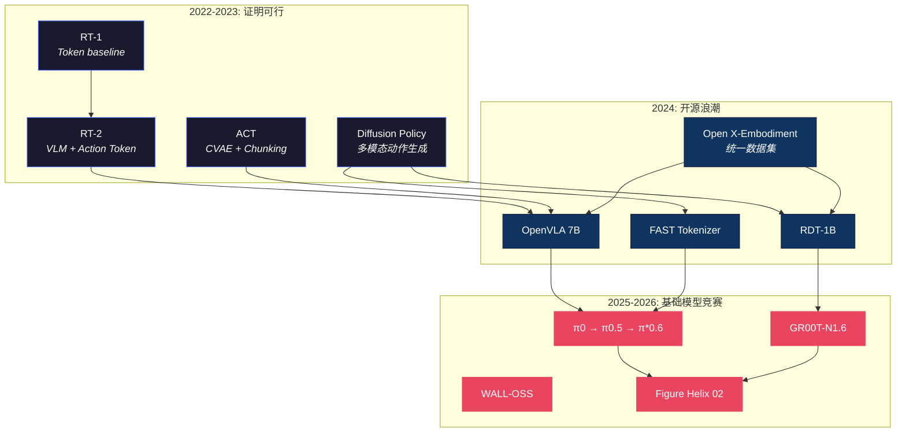

# VLA 研究主线梳理

> **从 ACT/DP 基线到"数据 × 架构 × 后训练"的工程化闭环**
>
> 这篇不重复解释每个模型怎么实现（那些在各自的 Deep Dive 里），而是回答一个更高层的问题：**VLA 研究这两年走了哪些路、哪些路走通了、下一步最可能往哪走**。

---

## 0. 一张图看全局



---

## 1. 为什么 ACT 和 Diffusion Policy 仍是默认 baseline

在 2026 年的今天，实验室里新项目的第一个实验仍然是"先跑个 ACT 或 DP 看看"。原因不是没有更好的模型，而是：

**ACT** 覆盖了最常见的工程约束：
- 推理路径短（无迭代去噪）→ 实时控制友好
- 代码干净（CVAE + Transformer，<1K 行）→ 调试容易
- 对小数据集（50-100 demos）已经能出不错的效果
- ALOHA 硬件生态成熟，复现成本低 (~$20K)

→ 详见 [ACT 详解](act.md)

**Diffusion Policy** 覆盖了另一类需求：
- 天然处理**多模态动作分布**（同一任务多种做法）
- 动作轨迹更平滑（去噪过程自带 temporal smoothing）
- 在标准 benchmark 上被反复验证为强基线

→ 详见 [Diffusion Policy 详解](../diffusion-flow/diffusion_policy.md)

> 💡 **现实里的大多数"改进工作"都在做同一件事**：让 ACT 更稳更泛化，或让 Diffusion 更快更可控。理解 baseline 的边界，才能判断改进是否值得。

---

## 2. 七条研究主线

### 主线 ① — 数据规模化：预训练 + 适配

> *从"训练一个任务"到"预训练一个基座，适配所有任务"。*

**核心假设**：把足够多的机器人数据（跨任务、跨形态）+ 互联网数据（视频、语言）喂给一个大模型，它就能学到通用的"物理直觉"。

**里程碑**：
| 时间 | 事件 | 意义 |
|------|------|------|
| 2023 | Open X-Embodiment (OXE) | 首个百万级跨形态机器人数据集 |
| 2024 | OpenVLA / Octo | 首批在 OXE 上预训练的开源 VLA |
| 2025 | π0.5 | 引入 YouTube 视频 co-training → 开放世界泛化 |
| 2026 | RoboGene | 用 Agent 自动生成多样化训练数据 |

**为什么"大数据不一定万能"**：
- **Embodiment mismatch**：不同机械臂的动作空间、控制频率、夹爪形状差异巨大。同一条轨迹在另一个平台上可能不可执行。
- **动作语义漂移**：同一句 "pick up the cup" 在不同机器人上对应完全不同的关节序列。
- **解法**：动作表示对齐（统一用 end-effector delta pose）+ 控制频率 resample + 元数据记录

→ 详见 [数据处理](../foundation/data.md) · [动作生成范式](../diffusion-flow/action_representations.md) · [RoboGene](../foundation/robogene_boosting_vla_pre_training_via_diversity_driven_agen_dissection.md)

---

### 主线 ② — Action Head 演进：Token → Diffusion → Flow Matching

> *动作怎么"生成"？这个选择决定了速度、精度和多模态能力的上限。*

```
2022  Token (RT-1)          ← 简单但粗糙，不能处理多模态动作
  ↓
2023  Diffusion (DP/RDT)    ← 多模态精细，但需要 10-100 步去噪，慢
  ↓
2024  Flow Matching (π0)    ← 多模态精细 + 只需 1-5 步，快 10x
  ↓
2025  FAST + Flow 混合       ← 预训练用 FAST (快)，推理用 FM (精)
  ↓
2025  双分支 (WALL-OSS)      ← Flow 做精细 + FAST 做粗粒度，按需切换
```

**关键洞察**：Action Head 的选择比 VLM backbone 的大小更重要。π0 用 3B 参数 + Flow Matching 打败了 RT-2 的 55B + Token，靠的是更好的动作生成机制。

→ 详见 [Diffusion Policy](../diffusion-flow/diffusion_policy.md) · [π0 Flow Matching 代码解析](pi0_code_analysis.md) · [FAST](fast.md) · [Compression Gap](../diffusion-flow/the_compression_gap_why_discrete_tokenization_limits_vision_dissection.md)

---

### 主线 ③ — 双系统架构：快慢分离

> *语义理解不需要 100Hz，运动控制必须达到 100Hz。把它们分开。*

这是 2025 年最重要的架构趋势。几乎所有最新的基础模型都采用了某种形式的快慢分离：

| 模型 | 慢系统 (语义) | 快系统 (运动) | 频率比 |
|------|-------------|-------------|:------:|
| GR00T-N1.6 | VLM → 子任务文字 | Diffusion Transformer → 关节 | 2Hz : 100Hz |
| Figure Helix 02 | S2 语义 latent | S1 视觉运动 (200Hz) + S0 扭矩 (1kHz) | 1Hz : 200Hz : 1kHz |
| OneTwoVLA | System 2 规划 | System 1 执行 | 低频 : 高频 |
| Galaxea G0 | 慢思考 | 快反应 | 低频 : 高频 |

**为什么这么做**：
1. **物理约束**：7B VLM 跑一次推理要 ~500ms，做不到 100Hz。但 200M 的 Action Model 可以。
2. **认知科学启示**：人类大脑也是双系统——System 2（有意识推理）驱动 System 1（本能反射）。
3. **工程优势**：两个系统可以独立训练、独立部署、独立更新。

→ 详见 [GR00T-N1.6 解剖](gr00t_n1_6.md) · [Helix 02 解剖](figure_helix_02_full_body_autonomy_2026.md) · [小模型 VLA](small_vla_models.md)

---

### 主线 ④ — RL 后训练：超越模仿的天花板

> *模仿学习让机器人学会"像人一样做"，但永远不会比示范者更好。RL 打破这个天花板。*

**BC（行为克隆）的系统性失败**：
- 训练数据覆盖的是一个很窄的"成功流形"
- 真实世界有噪声，系统必然会进入**分布外（OOD）状态**
- 长任务中误差累积，缺少 recovery 行为 → 不可逆失败

**RL 后训练的三步范式**（类比 LLM 的 SFT → RLHF）：

| 阶段 | 方法 | 类比 LLM | VLA 代表 |
|------|------|---------|---------|
| Stage 1 | 互联网预训练 | GPT 预训练 | 所有 VLA |
| Stage 2 | 模仿学习 (BC) | SFT | 所有 VLA |
| Stage 3 | **RL 后训练** | **RLHF** | **π\*0.6 Recap** |

**π\*0.6 的 Recap 是里程碑**：它证明了 VLA 可以通过复盘（offline RL）过去的成功/失败经验自我提升。吞吐量翻倍，失败率降低 50%。这打开了 VLA 的 "post-training" 时代。

**工程上的 on-policy 数据流水线**：
1. **触发式采集**：只在"置信度下降/接触异常/末端偏差超阈值"时开启高频记录
2. **分阶段 reward**：把任务拆成 approach → pre-contact → contact → manipulate → retreat
3. **Recovery skill 库**：把"重新定位、轻微抖动、换抓取点"当独立技能学
4. **安全护栏**：力/速度/关节限位的 safety controller 永远在 policy 外层兜底

→ 详见 [VLA+RL 实战教程](../rl/vla_rl_practical_guide.md) · [π0.6/RECAP 解析](../rl/pi0_6_recap_rl_as_supervised_learning.md) · [GR-RL 解剖](../rl/gr_rl_dissection.md) · [强化学习基础](../rl/reinforcement_learning.md)

---

### 主线 ⑤ — 感知增强：把"看得更稳"作为成功率下限

> *很多真实世界失败不是"动作模型不会做"，而是"输入端不稳定"。*

常见的感知失败：遮挡、反光、背景干扰、视角变化、运动模糊、对称物体姿态歧义。

**三层增强策略**：

| 层 | 方法 | 效果 | 代表 |
|:--:|------|------|------|
| 表征层 | 更强的 VFM/VLM backbone | 降低 domain shift | SigLIP, DINOv2 |
| 几何层 | 3D 点云 / 多视角融合 | 空间泛化 + 消歧 | DP3, 3D Diffusion Policy |
| 注意力层 | 隐式视觉接地 | 让注意力聚焦目标 | ReconVLA, FocusVLA |

**关键判断**：感知增强提升的是**鲁棒性下限**（不那么容易崩），但不会自动"发明新的动作逻辑"。想要新能力，还得靠数据和后训练。

→ 详见 [视觉感知技术](../perception/perception_techniques.md) · [ReconVLA](reconvla_implicit_grounding_by_reconstruction.md) · [FocusVLA](focusvla_focused_visual_utilization_for_vision_language_acti_dissection.md) · [LangGap](langgap_diagnosing_and_closing_the_language_gap_in_vision_la_dissection.md)

---

### 主线 ⑥ — 世界模型：在脑中模拟

> *不需要真的试错——在"想象"中规划，然后一步到位。*

世界模型让机器人在执行动作前"预演"结果，在心理仿真中试错。DreamZero 甚至证明了纯世界模型可以直接当策略用（zero-shot）。

**两种用法**：
1. **World Model as Planner**：预测多条未来轨迹 → 选最好的执行
2. **World Model as Policy**（DreamZero）：不需要单独的 policy 网络，世界模型自己就是策略

**开放问题**：世界模型预测的"未来"够不够准？如果预测偏了，执行也会偏。目前还没有很好的"预测可信度"度量。

→ 详见 [World Model 主线总纲](../world-model/world_model_mainline.md) · [DreamZero](../world-model/dreamzero_world_action_models_zero_shot_policies_2026.md) · [EgoSim](../world-model/egosim_egocentric_world_simulator_for_embodied_interaction_g_dissection.md)

---

### 主线 ⑦ — 触觉融合：光看不够

> *闭上眼睛你也能系鞋带——因为手指在"看"。*

当任务涉及力控（不捏碎鸡蛋）、滑动检测（东西快掉了）、柔软物操作（折衣服）时，纯视觉 VLA 不够用。触觉传感器提供接触力、滑动、形状估计。

**融合范式**：
- **早期融合**：触觉特征和视觉特征在 backbone 内融合（OmniVTA）
- **自适应融合**：模型自动学习"什么时候该看、什么时候该摸"（FAVLA）
- **快反射通道**：触觉走独立的低延迟通道，不经过大 VLM（TacMamba）

→ 详见 [触觉 VLA](../tactile/tactile_vla.md) · [OmniVTA](../tactile/omnivta_visuo_tactile_world_modeling_for_contact_rich_roboti_dissection.md)

---

## 3. 主线之间的关系：工程化闭环

七条主线不是独立的，它们构成一个**迭代闭环**：

```
┌──────────────────────────────────────────────────────────────┐
│                                                              │
│  ① 数据规模化                                                │
│  (更多数据 + 更多形态)                                        │
│       │                                                      │
│       ▼                                                      │
│  ② Action Head 升级  ──→  ③ 双系统架构                       │
│  (Token → FM)           (快慢分离)                            │
│       │                     │                                │
│       ▼                     ▼                                │
│  ④ RL 后训练   ◄──────  ⑤ 感知增强                          │
│  (超越模仿)           (看得更稳)                              │
│       │                     │                                │
│       ▼                     ▼                                │
│  ⑥ 世界模型    ◄──────  ⑦ 触觉融合                          │
│  (脑中模拟)           (多模态感知)                             │
│       │                                                      │
│       └──→ 新一轮数据采集 + 模型迭代 ──→ 回到 ①              │
│                                                              │
└──────────────────────────────────────────────────────────────┘
```

**闭环的关键**：RL 后训练产生的 on-policy 数据（包括失败和恢复）反馈回数据池，成为下一轮预训练的高质量数据。这就是 VLA 的"数据飞轮"。

→ 详见 [数据飞轮与跨模态迁移](../frontier/data_flywheel_and_cross_modal.md)

---

## 4. 下一步往哪走？（2026 开放问题）

| 问题 | 当前状态 | 可能的突破方向 |
|------|---------|-------------|
| **通用性 vs 专用性** | 基础模型强但贵，专用小模型快但窄 | 双系统 + LoRA 适配可能是最优解 |
| **数据效率** | 仍需 50-1000 demos/task | 世界模型仿真数据 + few-shot 适配 |
| **长程任务** | >10 步任务成功率急剧下降 | 层级规划 + recovery skill + 世界模型验证 |
| **安全** | 几乎没有形式化保证 | 安全约束层（独立于 policy） + 对抗测试 |
| **评估** | 没有统一标准 | BEHAVIOR-1K 方向对但还不够 |

→ 详见 [VLA 十大挑战](../planning/vla_challenges.md) · [BEHAVIOR-1K](../planning/behavior_1k_human_centered_embodied_ai_benchmark_omnigibson_2024.md)

---

## 相关导读

| 方向 | 推荐 |
|------|------|
| 架构总览 | [VLA 核心架构](vla_arch.md) |
| 数学基础 | [VLA 数学必备](../foundation/math_for_vla.md) |
| Loss 函数 | [VLA Loss Functions Handbook](../foundation/vla_loss_functions_handbook.md) |
| 动作表示 | [动作生成范式详解](../diffusion-flow/action_representations.md) |
| 小模型路线 | [小模型 VLA 研究方向](small_vla_models.md) |
| 思维链 | [CoT for VLA](../planning/chain_of_thought.md) |
| Sim2Real | [Isaac Lab](../deployment/isaac_lab.md) · [机械臂控制](../deployment/robot_control.md) |

---

[← Back to Explorer's Map](../README.md)
