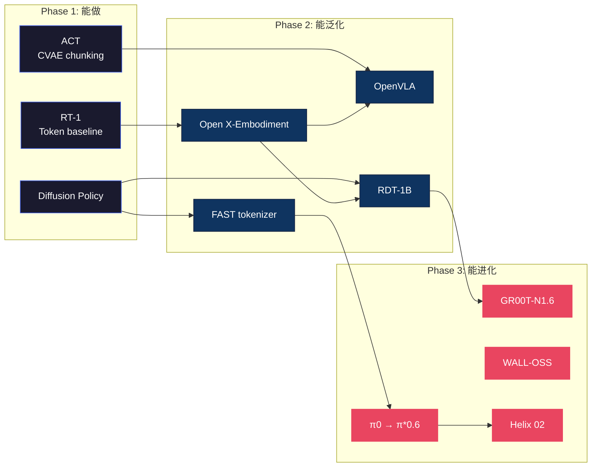

# VLA 研究主线梳理

> 这篇不是分类法，而是一个**赌注清单**。
>
> VLA 研究走到 2026 年中，底下有几条暗流：有些路被反复验证、有些路悄悄收敛、有些路看起来繁荣但可能是死胡同。这篇试图画出这些暗流，帮你判断——**如果你只有 6 个月的时间和一台机器人，该赌哪条路**。

<table><tr><td>

**上次更新**：2026-06-10 · **作者**：Claude Opus 4.6 × [Pulsar 照见](https://github.com/sou350121/Pulsar-KenVersion) · **基于** 203 篇 VLA-Handbook 理论文档 + 15 个方法族趋势数据 + Physical Intelligence CEO Sergey Levine 深度访谈交叉分析 · **2026-06-10 修订**：综合 4-6 月新进的 28 篇 vla-core 深度解剖（π0.7 / GR00T-N1.7 / 评测危机 / 持续学习浪潮等），在原有判断框架内更新，新旧冲突处显式保留张力

*本文由 Claude Opus 4.6 (Anthropic) 基于 VLA-Handbook 全量语料撰写，每个判断都附有仓库内文章链接供验证。观点代表撰写时的分析，不代表任何机构立场。欢迎提 Issue 讨论。*

</td></tr></table>

---

## 两个根本问题

在讨论任何技术细节之前，VLA 社区其实在争论两个更深的问题：

### Q1：机器人需要"理解"吗，还是"足够多的模仿"就够了？

一派认为（**Scaling 派**）：给模型看够多人类操作视频 + 机器人轨迹数据，它自然会学到"物理直觉"——不需要显式的世界模型、不需要推理模块、不需要符号表示。证据：π0.5 在 YouTube 视频上 co-training 后获得了开放世界泛化。

另一派认为（**Structure 派**）：纯 imitation 有天花板——compounding error、OOD fragility、没有 recovery 能力。必须加入结构化组件：世界模型做预演、CoT 做推理、RL 做自我提升。证据：BEHAVIOR-1K 的 1000 任务中，纯 BC 模型的成功率在第 5 步之后断崖式下跌。

**Sergey Levine（Physical Intelligence 联创）的判断很有意思**：他认为"在通用层面求解，可能比逐一特化更容易"——就像 NLP 领域，与其分别优化翻译、情感分析等单点任务，不如直接在自然语言的整体层面上建模。机器人领域的类比是：与其分别训练洗碗、叠衣等 policy，不如训练一个真正理解物理交互的模型。

**现实是两边都对一半**。π\*0.6 的 Recap 证明了 Scale + Structure 的组合拳最强——先 scale up BC，再用 RL 补结构性缺陷。这可能是未来 3 年的主旋律。

**5-6 月的新证据让这场争论更尖锐了**。一边，[LIBERO-PRO](libero_pro_towards_robust_and_fair_evaluation_of_vision_lang_dissection.md) 证明 LIBERO >90% 的成绩大半是死记硬背——把指令换成无意义字符模型照样执行原轨迹，四维扰动下成功率坍缩到 0-40%；机制分析进一步发现 SOTA VLA 在组合外推任务上全部 <21%。另一边，同一篇机制分析显示模型内部其实学到了**可组合的技能表征**——在 residual stream 手动插值（TLI）就能把 π0 的组合任务成功率从 9% 拉到 83% → [VLAs are Confined](vlas_are_confined_yet_capable_of_generalizing_to_novel_instr_dissection.md)；而 [π0.7](pi0_7_steerable_compositional_generalization_2026.md) 声称组合泛化已在闭源旗舰上"涌现"。**当前最合理的解读**：可组合的积木已经在权重里，缺的是自主拼装机制——这更像训练 recipe 问题而非架构问题，也部分解释了为什么 π0.7 的 strategy-metadata 蒸馏（一种 recipe 创新）能解锁组合行为。另外，Structure 派添了一条训练时证据：在 diffusion VLA 损失里加显式几何可行性项（FK + 有符号距离），可同时提升物理可靠性与成功率，且推理零开销 → [显式物理可行性](can_explicit_physical_feasibility_benefit_vla_learning_an_em_dissection.md)。

### Q2："大脑"应该是一个还是两个？

2024 年的 VLA 是一个端到端模型（一个 forward pass 从图像到动作）。2025 年开始，几乎所有新模型都变成了**双系统**。

这不是时髦——是被物理逼的。一个 7B VLM 跑一次 500ms，而机器人手臂需要 100Hz (10ms) 的控制信号。你不可能让一个大模型同时做语义推理和高频运动控制。

但双系统带来新问题：两个系统之间的**接口**是什么？文字（GR00T）？latent vector（Helix）？子目标图像（Goal-VLA）？这个接口的设计可能比两个系统各自的架构更重要——它决定了信息在"理解"和"执行"之间是否会断裂。

**5-6 月的信号：接口正在向"生成图像/子目标"收敛**。π0.7 把一个 14B BAGEL 世界模型放在旁路，按需生成多视角 subgoal 图像回注主模型；[AnySlot](anyslot_goal_conditioned_vision_language_action_policies_for_dissection.md) 则证明把高层推理结果直接**画进图像**（在目标位置渲染一个视觉标记）而非输出坐标数字，能把零样本槽位放置从个位数拉到 ~90%——图像作为推理-控制接口保留了空间一致性和局部几何上下文，坐标和文字都做不到。两条独立证据指向同一结论：**最好的接口可能就是观察空间本身**。

→ 详见 [GR00T-N1.6](gr00t_n1_6.md) · [GR00T-N1.7](groot_n1_7_nvidia_open_foundation_model_2026.md) · [Helix 02](figure_helix_02_full_body_autonomy_2026.md) · [OneTwoVLA](onetwovla.md) · [Galaxea G0](galaxea_g0.md) · [Goal-VLA](../world-model/goal_vla_image_generative_vlms_as_object_centric_world_model_dissection.md) · [AnySlot](anyslot_goal_conditioned_vision_language_action_policies_for_dissection.md)

---

## 演进时间线



- **Phase 1（2022-23）**：证明 Transformer 能控制机器人。RT-1 用 token，ACT 用 CVAE，DP 用 diffusion。三个 baseline 至今仍在用。
- **Phase 2（2024）**：开源 + 统一数据集。OXE 让跨形态预训练成为可能，OpenVLA/RDT/FAST 让所有人都能跑 VLA。
- **Phase 3（2025-26）**：基础模型竞赛开始。核心不再是"能不能做"，而是"能不能在新环境/新任务/新机器人上 work"。
- **2026 Q2 格局速记**：闭源端 [π0.7](pi0_7_steerable_compositional_generalization_2026.md)（可操控 + 组合泛化 + 世界模型旁路）一骑绝尘；开源端形成三强——[GR00T-N1.7](groot_n1_7_nvidia_open_foundation_model_2026.md)（NVIDIA 全栈 + Jetson 部署）、[LingBot-VLA](lingbot_vla_pragmatic_foundation_model_2026.md)（20K 小时真实双臂数据，最大公开真实预训练规模）、[Xiaomi-Robotics-0](xiaomi_robotics_0_dissection.md)（异步推理 80ms + Apache-2.0）。选型见 [完全开源 VLA 指南](open_source_vla_guide.md)——"开源"一词被严重滥用，三级制（完全/半/闭源）是必要的过滤器。

---

## 七个赌注

> 每个赌注背后都有一个假设，如果假设成立就是重大突破，如果不成立就是沉没成本。

&nbsp;

### 赌注 1：动作的"语言"还没找到

**假设**：VLA 性能的瓶颈不在 VLM backbone，而在 Action Head。

RT-2 用 55B 参数的 PaLI-X，π0 只用 3B，但 π0 在操作任务上赢了。区别不在"脑子大小"，而在"怎么说动作"。

目前的演进：

| 时期 | 方式 | 比喻 | 问题 |
|------|------|------|------|
| 2022 | Token (256 bins) | 用 256 个字符写诗 | 词汇太少，表达不了微妙动作 |
| 2023 | Diffusion (DDPM) | 从白噪声里"雕"出动作 | 雕得慢，要 10-100 步 |
| 2024 | Flow Matching | 从噪声拉一条直线到目标 | 目前最优，但 1-5 步仍不算快 |
| 2025 | FAST (DCT+BPE) | 把动作当"语言"压缩 | 快但不处理多模态 |
| 2025 | 双分支 (WALL-OSS) | 两种语言按需切换 | 复杂度上升 |

**未被探索的方向**：
- 把动作看成**连续流形上的测地线**（不是欧氏空间的直线）→ [ABot-M0 动作流形](abot_m0_action_manifold_learning_vla_foundation_2026.md)
- 用**神经隐式场**表示动作（不是离散序列）→ [Neural Implicit Action Fields](../diffusion-flow/neural_implicit_action_fields_from_discrete_waypoints_to_con_dissection.md)
- **像素运动**代替关节命令（让模型"画"出未来图像，再反推动作）→ [DAWN](../diffusion-flow/pixel_motion_diffusion_is_what_we_need_for_robot_control_dissection.md)
- **给潜在动作加代数结构**（5 月新入场）：[ALAM](alam_algebraically_consistent_latent_action_model_for_vision_dissection.md) 证明无标签视频的时间关系本身（一段过渡 = 两段之和；反向 = 符号翻转）就足以约束出"策略友好"的潜在动作空间——π0 在 MetaWorld MT50 从 47.9% 拉到 85.0%，长程任务收益最大。这暗示动作的"语言"可能需要的不是新表示，而是**好的语法约束**。

→ 更多见 [Diffusion Policy](../diffusion-flow/diffusion_policy.md) · [π0 代码解析](pi0_code_analysis.md) · [FAST](fast.md) · [Compression Gap](../diffusion-flow/the_compression_gap_why_discrete_tokenization_limits_vision_dissection.md) · [动作生成范式](../diffusion-flow/action_representations.md)

&nbsp;

### 赌注 2：RL 后训练是 VLA 的 "RLHF 时刻"

**假设**：BC 是 VLA 的 SFT，RL 是 VLA 的 RLHF。两者缺一不可。

LLM 领域已经证明了这条路：GPT-4 的能力大幅提升不是来自预训练的增量，而是 RLHF/DPO 后训练。VLA 正在走同一条路——π\*0.6 的 Recap 是第一个明确的成功案例。

| | LLM | VLA |
|--|-----|-----|
| 预训练 | 网络文本 | 互联网视频 + 机器人数据 |
| SFT | 指令微调 | 行为克隆 (BC) |
| **后训练** | **RLHF / DPO** | **Recap / Online RL** |
| 核心改善 | 对齐 + 安全 + 推理 | **Recovery + 精度 + 长程** |

**争论点**：RL 在真实机器人上太危险（试错 = 摔坏机器人）。解法有三：
1. **仿真先行**：Isaac Lab + Domain Randomization → [Isaac Lab](../deployment/isaac_lab.md)
2. **Offline RL**：不做新探索，只从历史数据中"复盘" → [π\*0.6 Recap](../rl/pi0_6_recap_rl_as_supervised_learning.md)
3. **安全护栏**：力/速度限位的 safety controller 永远在 policy 外层 → 不是研究问题，是工程问题

**我的判断**：这条路会走通，但不是 online RL on real robots（太贵太危险），而是 **仿真 RL + 世界模型 RL + offline replay**。Scale of RL data 会成为下一个竞争维度。

**5-6 月进展：实操形态已经收敛为"冻结主干 + 轻量外挂"**。三条具体路线落地：
1. **噪声空间 + 人类引导**：[UniSteer](unified_noise_steering_for_efficient_human_guided_vla_adapta_dissection.md) 把人类矫正动作经流匹配解码器反演回噪声空间，与噪声 RL 共享同一个轻量 actor——4 个真机任务平均 66 分钟从 20%→90%，每轮人类干预不到 1 条轨迹。
2. **价值引导选择而非微调**：[VGAS](vgas_value_guided_action_chunk_selection_for_few_shot_vision_dissection.md) 发现少样本适配的瓶颈是几何精度而非语义理解，用几何感知 critic 做 Best-of-N 选择（"生成负责想对，选择负责选准"），LIBERO 少样本 39.8%→49.0%。
3. **免奖励的测试时自监督**：[T3VF](test_time_training_for_visual_foresight_vision_language_acti_dissection.md) 利用视觉预见 VLA 的"预测-到达"图像对在推理时微调查询向量，无需奖励模型。

π0.7 的 RECAP-蒸馏进一步证实：RL specialist 的收益可以通过 strategy metadata 回流 generalist——4 月判断的方向成立，且比预期更快进入工程化阶段。

→ 详见 [VLA+RL 实战](../rl/vla_rl_practical_guide.md) · [Evo-RL](../rl/evo_rl_open_real_world_rl_recap_pistar06_so101_2026.md) · [GR-RL](../rl/gr_rl_dissection.md) · [RL 主线总纲](../rl/rl_mainline.md)

&nbsp;

### 赌注 3：世界模型让数据效率跳一个量级

**假设**：如果机器人能在"脑子里"模拟 10000 次，就不需要在现实中做 10000 次。

DreamZero 证明了世界模型不只是规划工具，它**本身就可以当策略用**。AtomVLA 更进一步——用世界模型把长程任务自动拆成"原子步骤"，每个步骤独立验证。

**但这里有一个根本矛盾**：世界模型的预测精度受限于训练数据。如果真实世界的数据不够，世界模型就会"hallucinate"——在想象中做出物理上不可能的事。这和 LLM 的幻觉问题本质相同。

**激进预测**：2027 年，VLA 训练的大部分"轨迹数据"将来自世界模型的仿真，而非真实机器人。就像 AlphaGo 的自我对弈一样——真实数据只提供 seed，合成数据提供 scale。

**2026-04/06 验证**：这个赌注被旗舰模型直接押注了——π0.7 把一个 **14B BAGEL 世界模型放进推理回路**（按需生成多视角 subgoal 图像，4×H100 / 1.25s 一张），是第一个把世界模型当生产组件而非研究玩具的前沿 VLA → [π0.7](pi0_7_steerable_compositional_generalization_2026.md)。注意它的用法是"推理时规划锚点"而非"训练时合成数据"——世界模型的第一个商业化角色可能跟 4 月预测的不一样，但方向一致。

→ 详见 [World Model 主线](../world-model/world_model_mainline.md) · [DreamZero](../world-model/dreamzero_world_action_models_zero_shot_policies_2026.md) · [AtomVLA](../world-model/atomvla_offline_post_training_predictive_latent_world_models_2026.md) · [EgoSim](../world-model/egosim_egocentric_world_simulator_for_embodied_interaction_g_dissection.md)

&nbsp;

### 赌注 4：触觉是 VLA 从"演示"到"真实"的最后一道门

**假设**：纯视觉 VLA 在接触操作上有不可逾越的天花板。

折衣服、拧瓶盖、插 USB——这些任务的共同点：关键信息不在图像里，在手指上。人类做这些事时 80% 靠触觉。但目前 95%+ 的 VLA 论文只用视觉。

**为什么触觉研究进展慢**：
1. 硬件不统一（每种传感器的数据格式不同）→ [TaCo Benchmark](../tactile/taco_a_benchmark_for_lossless_and_lossy_codecs_of_heterogene_dissection.md)
2. 没有"ImageNet for touch"（缺少大规模触觉数据集）
3. 融合架构没有共识（早期融合/自适应融合/独立通道 → [触觉主线](../tactile/tactile_mainline.md)）

**转折点可能在**：当触觉传感器像摄像头一样便宜时（~$50/个），触觉数据的规模瓶颈就打破了。SuperTac 和 UniVTAC 正在朝这个方向走。

→ 详见 [触觉 VLA](../tactile/tactile_vla.md) · [FAVLA](../tactile/favla_a_force_adaptive_fast_slow_vla_model_for_contact_rich_dissection.md) · [OmniVTA](../tactile/omnivta_visuo_tactile_world_modeling_for_contact_rich_roboti_dissection.md) · [TacMamba](../tactile/tacmamba_a_tactile_history_compression_adapter_bridging_fast_dissection.md)

&nbsp;

### 赌注 5：感知不再是瓶颈——接口才是

**假设**：Vision Encoder 已经足够好了。真正的瓶颈是信息从感知到动作的传递损耗。

DINOv2 和 SigLIP 已经能从图像中提取非常好的语义特征。但 VLA 的失败往往发生在"看到了但没用上"——注意力没聚焦到正确的物体、跨模态对齐不够强、语言指令的语义没有传递到动作层。

**三个证据**：
1. **LangGap** 发现 VLA 的语言理解能力比 VLM 差很多——动作训练"冲淡"了语言能力 → [LangGap](langgap_diagnosing_and_closing_the_language_gap_in_vision_la_dissection.md)
2. **ReconVLA** 用重建监督强迫注意力聚焦目标，不改 action head 就提升了成功率 → [ReconVLA](reconvla_implicit_grounding_by_reconstruction.md)
3. **FocusVLA** 用 gaze-like 机制选择性处理视觉信息，减少无关干扰 → [FocusVLA](focusvla_focused_visual_utilization_for_vision_language_acti_dissection.md)

**延伸思考**：这和人类的注意力问题一样——你看到了房间里的一切，但如果大脑没有"注意到"桌上的杯子，你就抓不到它。VLA 的 cross-attention 就是它的"注意力分配器"。

**5-6 月的三个强化证据——断裂方式比 4 月预想的更具体**：
1. [VLA-Trace](vla_trace_diagnosing_vision_language_action_models_through_r_dissection.md) 解剖 π0.5 发现：动作解码几乎只走视觉通路（去掉语言成功率仍有 39%，去掉视觉直接归零），且改指令里的物体名动作往往不跟着变——**语义跟随缺陷是系统性的**，而性能相近的 OpenVLA 内部却走双通路，"高成功率"掩盖了路由策略的根本差异。
2. [VLA-Pruner](bridging_the_semantic_action_gap_in_visual_token_pruning_for_dissection.md) 发现 prefill 语义注意力与 action-decode 注意力只有 ~50% 重合——VLA 内部其实有**两张"关注地图"**，这是 VLM 剪枝方法直接搬到 VLA 上崩溃的根因。
3. [3DThinkVLA](3dthinkvla_endowing_vision_language_action_models_with_laten_dissection.md) 识别出 "prompt-induced reasoning gap"——即使做了 3D co-training，动作提示词也会让模型走捷径绕过已学到的空间先验；需要共享锚点 token + 潜空间蒸馏才能把推理接进动作通路（推理时零 3D 依赖，LIBERO-PLUS SOTA）。

→ 也见 [视觉感知技术](../perception/perception_techniques.md) · [EyeVLA](../perception/look_zoom_understand_the_robotic_eyeball_for_embodied_percep_dissection.md) · [语言如何改写视觉](../perception/language_shapes_perception.md)

&nbsp;

### 赌注 6：VLA 和自动驾驶正在收敛

**假设**：VLA（机器人操作）和 AD（自动驾驶）在架构上正在走向同一条路。

这不是预测——已经在发生：
- **DriveDreamer-Policy** 把 World-Action Model 用在自动驾驶上 → [DriveDreamer](../world-model/drivedreamer_policy_a_geometry_grounded_world_action_model_f_dissection.md)
- **DVGT-2** 提出 Vision-Geometry-Action 架构，从 AD 反哺 VLA → [DVGT-2](../perception/dvgt_2_vision_geometry_action_model_for_autonomous_driving_a_dissection.md)
- **GigaBrain** 用世界模型原生 RL，思路与 Waymo 的 simulation-based planning 一脉相承 → [GigaBrain](../world-model/gigabrain_0_5m_star_world_model_based_rl_ramp_2026.md)

**为什么会收敛**：因为核心问题是一样的——**从多模态感知到连续控制**。区别只在 action space（方向盘/油门 vs 关节角度）和 embodiment（车 vs 机械臂）。

**含义**：自动驾驶的数据规模（万亿帧）和工程成熟度远超机器人。如果架构收敛，VLA 可以直接复用 AD 的基础设施。这可能是 VLA scale up 最快的路径。

**5 月补充：收敛甚至越出了地面**。[USIM+U0](usim_and_u0_a_vision_language_action_dataset_and_model_for_g_dissection.md) 把 VLA 带进水下 3D 域（推进器 + 机械臂统一动作空间，从 GR00T-N1.5 初始化），证明范式可跨介质迁移——但也标出了跨域的真实代价：陆地 VLA zero-shot 在水下基本失效，必须靠领域数据 + 显式位姿辅助任务才压得住感知域偏移。"架构收敛"不等于"权重免费迁移"。

&nbsp;

### 赌注 7：机器人的"下意识"比"意识"更重要

**假设**：VLA 研究过度关注"高层推理"，忽略了"低层反射"——而真正决定成败的往往是后者。

人类在接住飞来的球时，不会先想"球的抛物线方程是什么"。脊髓和小脑在 50ms 内完成了大部分工作——大脑皮层甚至来不及参与。但几乎所有 VLA 论文都在讨论 VLM 的语义推理，很少有人关注底层的运动原语（motor primitives）。

**证据**：
- Figure Helix 02 的 **S0 层**就是一个"无意识"的 1kHz 运动先验——它不知道任务是什么，只负责让机器人不摔倒 → [Helix 02](figure_helix_02_full_body_autonomy_2026.md)
- 神经科学表明，**皮层下回路**（不经过大脑皮层）控制了大量本能行为——打架、求偶、逃跑 → [皮层下控制](../frontier/subcortical_control_knobs_neuropeptides_temporality.md)
- 鸽子的**内耳前庭系统**直接感应磁场进行导航，完全不需要"理解"磁场是什么 → [鸽子磁感](../frontier/pigeon_magnetoreception_vestibular_electrosense.md)
- Sergey Levine 引用的猴子工具使用实验：当猴子用工具操作时，大脑中追踪"手位置"的神经元，会**自动切换到追踪工具尖端的位置**。"工具是身体的延伸"不是比喻，是真实的神经机制。这意味着通用具身模型应该能学会控制任何"身体"——包括未见过的工具

**创想**：未来的 VLA 可能不是一个更大的 VLM，而是一个**三层蛋糕**：
- **底层（1kHz）**：learned motor primitives，不知道任务是什么，只保证身体协调和安全
- **中层（100Hz）**：visuomotor policy，看到什么就做什么，不需要语言
- **顶层（1Hz）**：VLM 语义推理，决定"下一步做什么"

Helix 02 的 S0/S1/S2 已经在走这条路。但大多数研究者还在把全部精力放在顶层（VLM），忽略了底层可能才是真正的"护城河"——因为底层决定了机器人**能不能平滑地动**，而顶层只决定了**往哪动**。

→ 也见 [Physics of AI](../frontier/physics_of_ai_liuziming.md)——统计力学视角理解不同"尺度"的控制

&nbsp;

---

## 评测正当性危机（2026-06 新增）

> 这是 4 月版本没有、但 5-6 月证据密度最高的主题：我们引以为据的分数，可能大部分在测"记忆力"。

- **LIBERO 高分 ≈ 死记硬背**。[LIBERO-PRO](libero_pro_towards_robust_and_fair_evaluation_of_vision_lang_dissection.md) 用四维正交扰动（物体/位置/指令/环境）系统性暴露 memorization：OpenVLA/π0 在位置偏移 >0.2 单位时归零，目标物体被换成无关物品仍执行抓取，指令换成 "fdsgfdsgsd" 照样跑完原轨迹。**本总纲里所有 LIBERO 数字从今往后都应按此打折解读**；新论文若只报标准 LIBERO，应默认其泛化声明存疑。
- **trade-off 有理论天花板**。[能力-鲁棒性信息论边界](capability_and_robustness_cannot_both_be_free_an_information_dissection.md) 首次证明：对任何 VLA 策略，能力 + 对抗鲁棒性 ≤ 任务熵 + 攻击信道容量——与架构和训练方法无关。鲁棒性不是免费的，任何防御声明都该对照这个预算报 slack。
- **诊断与自省工具开始成型**。[VLA-Trace](vla_trace_diagnosing_vision_language_action_models_through_r_dissection.md) 提供"表征几何→因果通路→行为表现"的三段 CT 扫描；[INSIGHT](insight_inference_time_sequence_introspection_for_generating_dissection.md) 证明 VLA 的 token 级不确定性本身就含"我快不行了"的信号——300K 参数的小分类器即可在失败前触发求助，VLA 从"盲目执行"走向"知所进退"的第一块基石。
- **出路之一：真机 benchmark**。[LingBot-VLA](lingbot_vla_pragmatic_foundation_model_2026.md) 干脆不报 LIBERO，在 GM-100（3 平台 × 100 真机任务）上比 π0.5 高 7.76%。100 个真机任务的 18% 比 40 个饱和仿真任务的 97% 信息量更大——GM-100 有机会成为下一个标准基准。

**判断**：2026 下半年，评测方法学本身会升格为 VLA 的一条研究主线。"能证明自己是真泛化"将成为与"分数更高"同级的竞争力。

---

## 从一次性微调到终身适配（2026-06 新增）

4 月时"记忆"还只是思想实验 B；5-6 月它长成了一个真实子领域——短短数周内出现四套互相竞争的 VLA 持续学习/先验保留方案：

| 方案 | 机制 | 关键数字 |
|------|------|---------|
| [CLARE](clare_continual_learning_for_vision_language_action_models_v_dissection.md) | 适配器旁路 + 自编码器重构误差路由 + 动态扩展 | 零遗忘、无需任务 ID/历史数据，参数每任务仅 +~2% |
| [Stellar VLA](continually_evolving_skill_knowledge_in_vision_language_acti_dissection.md) | Dirichlet Process 知识空间 + 知识引导 MoE 路由 | 仅 1% 数据回放即超 20% 回放的 ER 基线 |
| [DMPEL](dynamic_mixture_of_progressive_parameter_efficient_expert_li_dissection.md) | LoRA 专家库 + MLP 路由 + 系数回放（只存低维路由系数） | 近零遗忘，可训练参数 <0.7% |
| [PriorVLA](priorvla_prior_preserving_adaptation_for_vision_language_act_dissection.md) | 冻结先验专家 + 平行适配专家 + Query 接口 | 25% 可训练参数，10-shot OOD 从 10%→32% |

四篇共同的结构判断与赌注 2 的 RL 外挂化是同一股潮流：**冻结主干 + 轻量外挂模块 + 某种"路由"决定何时用谁**。预训练权重正在变成"只读先验源"，下游一切（新任务、新机器人、RL、人类矫正）都以可插拔模块的形式叠加。

**仍然空着的位置**：这些都是"参数化技能库"——真正的个性化情景记忆（"你家杯子在右边第二个柜子"）还是没人做。思想实验 B 的方向被证实，但形态走偏了一档。

---

## 三个未被认真讨论的思想实验

> 以下不是主流共识，而是值得认真对待的边缘假设。

### 🧪 思想实验 A："VLA 的 Bitter Lesson"

Rich Sutton 的 Bitter Lesson 说：AI 历史上，利用计算规模的通用方法总是打败人类设计的巧妙结构。

这对 VLA 意味着什么？也许所有的"巧妙设计"——双系统架构、世界模型、触觉融合、CoT 推理——最终都会被**更大规模的端到端训练 + 更多数据**击败。也许 2030 年的 VLA 就是一个 100B 参数的模型，输入原始像素和关节角，输出关节力矩，中间什么结构都不需要。

反驳：机器人不是语言——它有**物理约束**（关节极限、力矩极限、接触动力学）。这些约束可能要求某种形式的结构化先验，不是纯 scale 能解决的。但谁知道呢。

### 🧪 思想实验 B："记忆比推理重要"

Claude Code 的记忆系统用文件系统做持久化存储 → VLA 机器人是否也需要类似的长期记忆？

想象一个在你家厨房工作了一年的机器人。它不需要每次都"推理"杯子在哪——它**记得**你习惯把杯子放在右边第二个柜子里。它不需要重新学怎么开你家的微波炉——它**记得**你家那个按钮要用力按。

当前的 VLA 没有记忆——每次推理都是无状态的。这也许解释了为什么它在"自家厨房"和"陌生厨房"之间的泛化如此困难。不是泛化能力不够，而是**缺少了个性化记忆**。

**2026-06 注**：这个思想实验正在两条线上变成现实。短时记忆——[DySta](efficient_long_horizon_vision_language_action_models_via_sta_dissection.md) 用动静 token 解耦（94% 的视觉 token 是静态可缓存的）首次让 LLM backbone 直接对多帧历史推理，上下文砍掉 94%、推理快 2.2×，记忆依赖任务 +24.5%；π0.7 的 400M MEM 视觉编码器同样是给主模型装短时视觉记忆。技能级长期记忆——以持续学习的形态落地（见上节）。仍缺的是中间那层：跨 episode 的情景记忆。

→ 详见 [Claude Code Memory → VLA](../frontier/claude_code_memory_architecture_applied_to_vla_2026.md) · [SOMA 记忆增强](../planning/soma_strategic_orchestration_and_memory_augmented_system_for_dissection.md) · [终身学习](../foundation/lifelong_imitation_learning_with_multimodal_latent_replay_an_dissection.md)

### 🧪 思想实验 C："硬件是被低估的变量"

VLA 社区 90% 的论文关注模型和算法，但也许**硬件设计**才是决定商业化成败的变量。

Ken Goldberg 说"GOFE 回归"——Good Old-Fashioned Engineering（传统工程）在 AI 时代比以前更重要，不是更不重要。一个设计精良的夹爪可能比一个更大的 VLM 更能提升抓取成功率。一个 $50 的触觉传感器可能比 $50000 的 GPU 训练更能提升折衣服的能力。

→ 详见 [Ken Goldberg](../frontier/ken_goldberg_data_quality_infrastructure.md) · [Jim Fan 三条教训](../frontier/jim_fan_2025_robotics_lessons.md) · [灵巧手机械学](../deployment/dexterous_hand_mechanics.md) · [House of Dextra](../deployment/house_of_dextra_cross_embodied_co_design_for_dexterous_hands_dissection.md)

---

## 可能的死胡同

诚实地说，有些方向可能不会走通：

| 方向 | 为什么可能是死胡同 | 但也许不是死胡同如果... |
|------|------------------|---------------------|
| **纯端到端大模型** | 100Hz 控制和 VLM 推理无法共存在一个 forward pass 中 | ...量化/剪枝让 7B 模型跑到 100Hz |
| **纯 offline RL** | 不做真机探索就学不到真正的 recovery | ...世界模型仿真足够逼真 |
| **纯视觉** | 接触操作的物理信息不在图像里 | ...超分辨率/多视角能间接推断力 |
| **跨形态预训练** | Embodiment mismatch 可能无法被 alignment 解决 | ...统一的 action representation 出现 |
| **符号规划** | 太脆弱，不适应 open-world | ...LLM 级别的常识推理弥补了脆弱性 |

**2026-06 张力：第一行正在被快速侵蚀**。4 月时"端到端无法实时"看起来很稳，但 5-6 月的效率浪潮给出了反例链：[CogVLA](cogvla_cognition_aligned_vision_language_action_model_via_in_dissection.md) 用指令驱动稀疏化做到 8× 视觉压缩同时 LIBERO 97.4% + 87.9Hz 吞吐（压缩反而涨分）；[RhinoVLA](rhinovla_technical_report_dissection.md) 把视觉 token 压到 64/图、在 500 TOPS 边缘 SoC 上跑出 11.69Hz；[Xiaomi-Robotics-0](xiaomi_robotics_0_dissection.md) 用异步推理 + 三招（RoPE 偏移/Λ-mask/动态 loss）封死 action-prefix shortcut，80ms/RTX4090。**关键认知更新：延迟瓶颈是视觉 token 数量而非参数量**——减 4× token 比减 4× 参数更有效。这不等于双系统已死，但"单模型 + 激进 token 稀疏化 + 异步执行"已经成为双系统之外的第二条可行路线。部署侧还多了一个新自由度：把执行速度本身变成显式控制通道（0.5×–2× 调速，且 1.25× 比 1× 更稳——演示数据里有"节奏冗余"）→ [TempoVLA](tempovla_learning_speed_controllable_vision_language_action_dissection.md)。

**跨形态预训练那一行也有了正面进展**：RhinoVLA 的 72D 统一槽位空间 + 实例 LoRA、LingBot 的 9 种双臂配置预训练，都在用"统一物理语义接口 + 本体残差外挂"的方式绕过 embodiment mismatch——和上一行"也许不是死胡同如果...统一 action representation 出现"正在对上。

---

## 来自 Physical Intelligence 的一手信号

> 以下观点来自 Sergey Levine（PI 联创、UC Berkeley 教授）2026 年 4 月的深度访谈，是当前 VLA 领域最核心的一手判断之一。

### "真实数据 vs 仿真"的大分裂

Levine 指出了一个领域内尚未被充分讨论的事实：**操作领域和人形领域使用的方法论几乎完全相反**。

- **人形机器人**（后空翻、体操动作）：几乎完全依赖仿真，真实数据用量接近零
- **机器人操作**（叠衣服、清理厨房）：几乎完全依赖真实数据，很少使用仿真

> "有意思的是，在这两个子领域中，占主导地位的方法论竟然如此不同。"

这意味着"仿真 vs 真实"不是一个有标准答案的问题，而是一个**取决于具体领域的开放选择**。未来可能出现的结果：某一条路径胜出成为统一解法，或者两者融合形成新范式。

### 瓶颈已经从"手"移到了"脑的中间层"

PI 团队最近的关键发现：

> "大约 6 个月前，我们发现模型已经发展到一个阶段，可以**仅通过高层指令的监督来持续改进**。不再增加遥操作数据，而是只对机器人已有的执行过程加上语义标注——把它经历过的过程用语言描述出来。结果发现，这种方式同样可以提升泛化能力。"

**翻译成技术语言**：底层动作能力不再是瓶颈。瓶颈在**中间层**——对场景的理解、任务分解、下一步行动的选择。而这一层可以用**语言**来监督。

**含义**：如果这个发现具有普遍性，那么 VLA 的改进路径会变成：
1. 用遥操作数据训练**底层动作能力**（一次性投入）
2. 用**语言标注 + CoT**持续改进**中间层推理**（边际成本极低）
3. 用 RL 打磨**长程执行**的稳定性

这彻底改变了数据收集的优先级——**标注比遥操更值钱**。

### Bootstrap 问题：数据飞轮的"冷启动"

Levine 坦承最大的不确定性是**时间线**：

> "这项技术本身具有一种冷启动难题。需要先达到'足够有用'的水平，机器人才能被部署、才能大规模获取数据。一旦跨过这个门槛，就会出现跃迁式变化。"

他用 Tesla 做类比：Tesla 不担心数据不够，因为已经有大量车在路上跑，问题反而是数据太多。VLA 的挑战是**还没到达那个门槛**。一旦到了，飞轮就会自动加速。

### 硬件成本的 100 倍跳水

| 时间 | 设备 | 成本 |
|------|------|------|
| ~2014 | PR2 机器人 | ~$400,000 |
| ~2019 | Berkeley 实验室机械臂 | ~$30,000 |
| 2025+ | 低成本机械臂 | ~$3,000 |

> "如果学习方法足够好，可以在一定程度上弥补感知能力的不足。例如手腕上的摄像头可以在一定程度上替代触觉传感器——因为在接触物体时，可以通过视觉观察到局部形变。"

这意味着**便宜的硬件 + 强大的 AI = 昂贵硬件的替代品**。这也是为什么赌注 4（触觉）的硬件成本门槛正在快速下降。

### Moravec's Paradox 的极端案例

Levine 给出了一个令人深思的判断：**换尿布可能是 VLA 最后才能解决的任务之一**。

> "那些涉及人与人互动的行为，比如真正去帮助别人、扶人下床、照顾婴幼儿——其实比大多数人的预期还要难。因为人类在与他人互动和物理操作方面是高度进化过的能力。"

这提醒我们：**VLA 的商业化路径应该避开"人类很擅长"的领域，优先进入"人类觉得无聊或危险"的领域**。工厂物流、仓库拣货、危险环境巡检——这些才是 VLA 最先创造价值的地方。

---

## 如果我只有 6 个月

**最高 ROI 的赌注排序**（个人判断，不代表社区共识）：

1. **RL 后训练** — 最确定的改善路径，π\*0.6 已经 proof of concept
2. **双系统架构** — 物理约束决定了这是必然，剩下的只是接口设计
3. **世界模型合成数据** — 数据效率的量级跳升，可能改变游戏规则
4. **底层运动先验** — 被忽视的蓝海，Helix 的 S0 证明了价值
5. **触觉融合** — 硬件成本在快速下降，窗口期正在打开
6. **Action Head 创新** — 高风险高回报，流形/隐式场可能是下一代
7. **跨域（AD↔VLA）** — 长期最大的杠杆，但需要两个社区的协同

**2026-06 修订**：排序大体不变，但加两条、改一条——
- **(+) 评测与诊断工具**（LIBERO-PRO / VLA-Trace / INSIGHT 这一族）：评测危机时代，能证明"真泛化"本身就是稀缺竞争力，且工程门槛低（小分类器、扰动基准、knockout 探针都是单卡级工作）。
- **(+) 持续学习外挂**（CLARE / DMPEL / PriorVLA 这一族）：冻结主干 + 轻量路由已是低成本高确定性的工程红利，真实部署的刚需。
- **(改) 第 1 条的实操形态已细化**：不是泛泛的"RL 后训练"，而是"噪声空间 + 人类引导 + 价值选择"（UniSteer / VGAS 路线）——单 A100、一小时级别就能把真机任务从 20% 拉到 90%。

---

## 闭环：数据飞轮

所有赌注不是独立的，它们通过**数据飞轮**连成闭环：

```
  预训练 (互联网 + OXE)
       ↓
  BC 微调 (人类演示)
       ↓
  部署 → 收集 on-policy 数据 (成功 + 失败)
       ↓
  RL 后训练 (从失败中学)
       ↓
  世界模型训练 (从 on-policy 数据学物理)
       ↓
  合成数据 (世界模型生成 10000x 轨迹)
       ↓
  更好的预训练 → 回到顶部
```

**飞轮的关键**：每一轮都比上一轮有更多、更好的数据。π0 → π0.5 → π\*0.6 就是这个飞轮转了三圈的结果。

**5 月补充：飞轮的"自我标注"环节有了具体机制**。[LACY](lacy_a_vision_language_model_based_language_action_cycle_for_dissection.md) 把单向 L2A 扩展为 L2A↔A2L↔L2C 双向循环——模型自主生成动作、反向描述、用循环一致性 + 多数投票过滤低质量样本，仅 1000 条演示起步即提升 50+ 个百分点。Levine 说"标注比遥操更值钱"，LACY 是把标注本身也自动化的第一步——尽管要警惕"自洽但错误"的映射（循环一致性验证的是语义一致性，不是物理正确性）。

→ 详见 [数据飞轮与跨模态迁移](../foundation/data_flywheel_and_cross_modal.md)

---

## 进一步阅读

| 方向 | 推荐 |
|------|------|
| 架构总览 | [VLA 核心架构](vla_arch.md) |
| 开源选型 | [完全开源 VLA 指南](open_source_vla_guide.md)（三级开源制 + 按场景选型） |
| 2026 基础模型 | [π0.7](pi0_7_steerable_compositional_generalization_2026.md) · [GR00T-N1.7](groot_n1_7_nvidia_open_foundation_model_2026.md) · [LingBot-VLA](lingbot_vla_pragmatic_foundation_model_2026.md) · [Xiaomi-Robotics-0](xiaomi_robotics_0_dissection.md) |
| 评测与诊断 | [LIBERO-PRO](libero_pro_towards_robust_and_fair_evaluation_of_vision_lang_dissection.md) · [VLA-Trace](vla_trace_diagnosing_vision_language_action_models_through_r_dissection.md) |
| 数学基础 | [VLA 数学必备](../foundation/math_for_vla.md) |
| 动作表示 | [动作生成范式详解](../diffusion-flow/action_representations.md) |
| 小模型路线 | [小模型 VLA 研究方向](small_vla_models.md) |
| 物理学视角 | [Physics of AI](../frontier/physics_of_ai_liuziming.md) |
| 产业观点 | [Jim Fan 三条教训](../frontier/jim_fan_2025_robotics_lessons.md) · [Ken Goldberg](../frontier/ken_goldberg_data_quality_infrastructure.md) |
| VLA 十大挑战 | [Open Challenges](../planning/vla_challenges.md) |

---

[← Back to Explorer's Map](../README.md)
