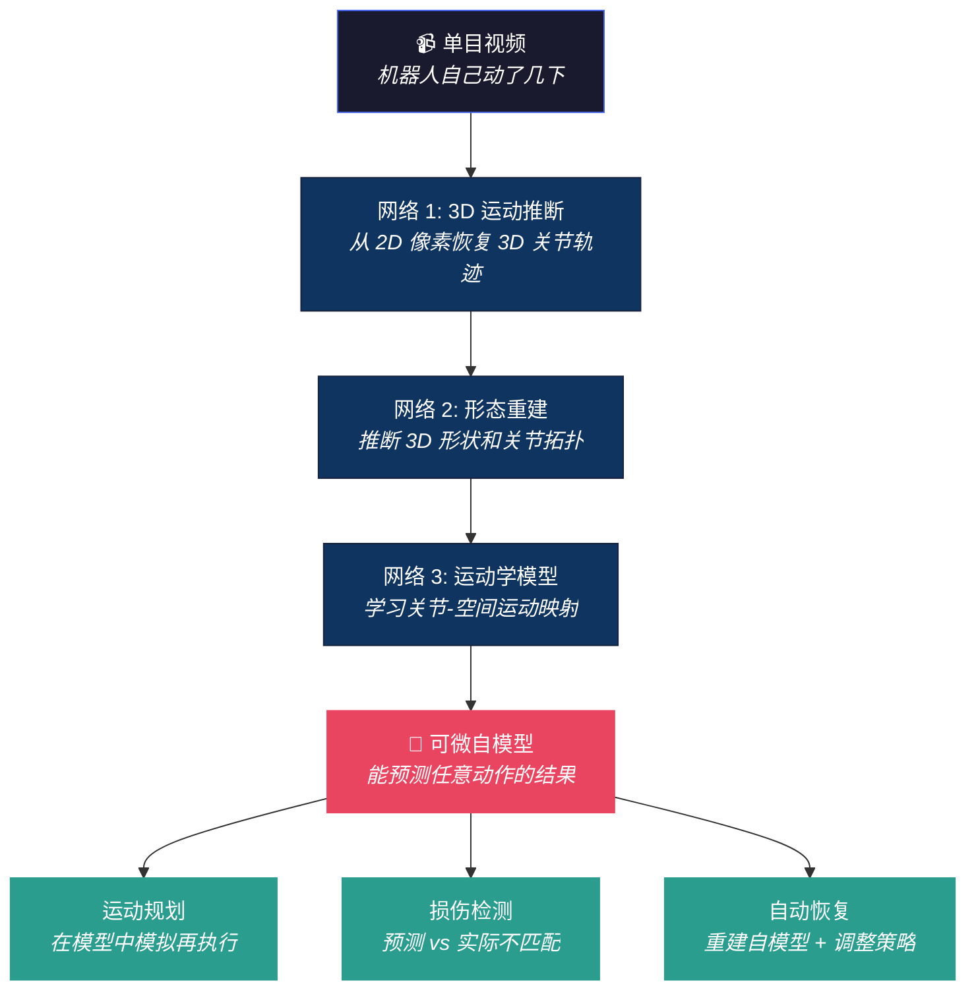

# 机器人"照镜子"学会模拟自己：从单目视频到运动学自模型

> **论文**：Teaching Robots to Build Simulations of Themselves
> **作者**：Yuhang Hu, Jiong Lin, Hod Lipson（Columbia University, Creative Machines Lab）
> **发表**：*Nature Machine Intelligence* 7, 484–494 (2025)
> **DOI**：[10.1038/s42256-025-01006-w](https://doi.org/10.1038/s42256-025-01006-w) · **arXiv**：[2311.12151](https://arxiv.org/abs/2311.12151)
> **关键词**：自模型 (self-model)、运动学推断、单目 3D 重建、损伤恢复、可微渲染

---

## 0. 可复述结论（1 分钟版）

- **一句话**：机器人通过**一个普通摄像头拍摄的短视频**（类似照镜子），自主学会自己的 3D 形状、关节结构和运动规律——不需要 CAD 模型、URDF 文件或任何先验知识。
- **核心能力**：学到的自模型可用于运动规划（在"脑中"模拟再执行）、异常检测（发现手臂弯了）和损伤恢复（自动调整动作补偿损伤）。
- **最小数据需求**：一段短视频。不需要大规模数据集。
- **Nature MI 发表意义**：这是"机器人自我意识"方向在顶级期刊的里程碑——从 2006 年的火柴人自模型到 2025 年的完整运动学重建。

---

## 1. 为什么这篇重要

### 传统做法的痛点

目前让机器人工作的标准流程是：

```
人类用 CAD 建模 → 导出 URDF → 加载到仿真器 → 调参 → 部署真机
```

每个步骤都**依赖人类工程师**。如果机器人被撞弯了一个关节、换了一个夹爪、或者磨损了，整个 pipeline 要重新来。

### 这篇论文的做法

```
机器人自己动一动 → 单目摄像头录一段视频 → 三个神经网络自动推断 3D 形状 + 运动学
                                            → 得到可微的自模型
                                            → 用自模型做规划 / 检测损伤 / 自动恢复
```

**关键突破**：不需要 URDF、不需要 CAD、不需要多个摄像头、不需要先验知识。一个普通摄像头 + 一段短视频就够了。

---

## 2. 方法：三个网络的协作

### 核心架构

系统使用**三个深度神经网络**协同工作：



### 自监督学习：无需标注

关键在于整个过程是**自监督**的：
- 机器人自己发送随机运动命令
- 摄像头录下运动过程
- 网络从视频中推断 3D 结构——**监督信号来自视频本身**（如果重建的 3D 模型能正确预测下一帧画面，说明模型是对的）
- 类似 NeRF 的可微渲染思路：从 3D 表示渲染出 2D 图像，与实际图像对比作为 loss

### 从 2D 到 3D 的跳跃

这是技术上最关键的一步。人类照镜子时能从 2D 镜像"理解"自己的 3D 身体——这需要大量的发育经验。机器人用深度网络实现了类似功能：

- **输入**：2D 视频帧序列
- **中间表示**：体素/点云级别的 3D 重建
- **输出**：关节化的运动学模型（关节位置、旋转轴、连杆长度）

这比传统 NeRF 更进一步——不只是"看起来像"，而是学到了**可操作的运动学结构**。

---

## 3. 三个核心应用

### 3.1 运动规划：先想再做

学到自模型后，机器人可以在**内部仿真中**测试动作序列，而不需要在物理世界中实际执行。

```
目标: 把手臂移到 (x, y, z)
  → 在自模型中搜索关节角序列
  → 选择碰撞最少、能量最低的路径
  → 执行
```

这和传统运动规划的区别：传统方法需要人类提供精确的 URDF 和碰撞模型；这里的模型是**自主学到的**。

### 3.2 损伤检测：预测与现实不匹配 = 出了问题

```
自模型预测: "关节 3 转 30° 后，末端应该在 A 点"
实际观测:    "末端在 B 点"
差异超过阈值 → 发出"损伤"警报
```

这是一种优雅的异常检测方法——不需要专门的传感器或规则，只需要比较"我以为会发生什么"和"实际发生了什么"。

### 3.3 损伤恢复：重新照镜子

当检测到损伤后，机器人执行一次**自模型更新**：
1. 重新随机运动一小段时间
2. 从新视频中重建更新后的自模型
3. 用新模型重新规划动作
4. 继续执行任务

> Lipson："人类不可能一直像保姆一样照顾这些机器人、修理零件、调整性能。机器人需要学会自己照顾自己。"

---

## 4. 历史脉络：Lipson 实验室的 20 年追求

| 年份 | 成就 | 自模型精度 |
|------|------|-----------|
| **2006** | 首次机器人自模型（Bongard et al., Science） | 火柴人级别 |
| ~2015 | 多摄像头 3D 自模型 | 粗略几何 |
| 2019 | 可微物理仿真器用于自模型 | 动力学级别 |
| **2025** | **单目视频 $\to$ 完整运动学模型** | **关节级精度** |

这不是一篇突然冒出来的论文——是 Hod Lipson 团队 **20 年**持续研究"机器人自我意识"的最新成果。从 2006 年发表在 Science 的那篇开创性论文算起，每一代都在逼近"人类照镜子"的能力。

---

## 5. 与 VLA 研究的深层连接

这篇论文表面上不是 VLA 论文，但它与 VLA-Handbook 的多条研究主线深度相关：

### 连接 1：自模型 = 自身的世界模型

VLA 领域的世界模型（DreamZero、EgoSim）试图预测**外部世界**的变化。这篇论文做的是预测**自身**的变化——本质上是一种"内向型世界模型"。

两者结合才是完整的画面：
```
外部世界模型 (DreamZero)  → 预测"如果我推杯子，杯子会往哪移"
自身模型 (本文)            → 预测"如果我转关节 3，手指会到哪"
完整世界模型               → 两者联合 → "如果我转关节 3，杯子会被推到哪"
```

$\to$ 详见 [World Model 主线](world_model_mainline.md) · [DreamZero](dreamzero_world_action_models_zero_shot_policies_2026.md) · [EgoSim](egosim_egocentric_world_simulator_for_embodied_interaction_g_dissection.md)

### 连接 2：跨形态适配的基础设施

Sergey Levine 在最近访谈中说"不存在'人形机器人问题'和'机械臂问题'，只有统一的一个问题"。但要实现跨形态，模型必须能自动理解当前身体的结构。

这篇论文提供了一条路径：**让机器人自己搞清楚自己是什么形态**，而不是人类手工写 URDF 告诉它。

$\to$ 详见 [VLA 核心架构](../vla-core/vla_arch.md) · [PI Sergey Levine 访谈](../vla-core/physical_intelligence_sergey_levine_foundation_model_vision_2026.md)

### 连接 3：损伤恢复 = 一种 online adaptation

VLA 领域讨论的"在线适配"通常指任务层面（新环境、新物体）。但身体层面的适配同样重要——关节磨损、夹爪更换、负载变化。

这篇论文提供的方法可以无缝融入 VLA pipeline：
- **部署前**：自动学习自模型，替代手工 URDF
- **运行中**：持续比较预测 vs 实际，检测异常
- **损伤后**：自动更新自模型，无需人类干预

$\to$ 详见 [终身学习](../foundation/lifelong_imitation_learning_with_multimodal_latent_replay_an_dissection.md)

### 连接 4：赌注 7 的生物学验证

在 [研究主线梳理](../vla-core/vla_research_mainline.md) 的赌注 7 中，我们讨论了"机器人的'下意识'比'意识'更重要"以及猴子使用工具时大脑自动追踪工具尖端的神经机制。

这篇论文是这一思路的工程实现——**让机器人建立对自身身体的内部表征**，就像人类的本体感觉（proprioception）。有了这个表征，机器人才能真正"知道自己的手在哪"、"知道自己能做什么"。

---

## 6. Opus 的反思

### 🔮 这篇论文暗示了一个更大的方向："自我感知基础模型"

当前 VLA 的 Vision Encoder 看的是外部世界。但如果加一个"自我观察"通道——一个朝向自身的摄像头——VLA 就能同时理解外部环境和自身状态。

**创想**：未来的 VLA 架构可能有两套视觉流：
- **外向视觉**（看世界）：SigLIP / DINOv2 特征
- **内向视觉**（看自己）：本文的自模型特征

两者在 Transformer 中交叉注意力融合，让模型同时知道"桌上有什么"和"我的手在哪、我能够到哪"。

### 🔮 自模型可能是"通用 embodiment conditioning"的答案

VLA 跨形态适配的核心难题是：模型怎么知道当前控制的是什么机器人？当前的做法是在输入中加 embodiment token 或 proprioception vector。

但如果机器人先"照镜子"学到自模型，这个自模型本身就可以作为**最丰富的 embodiment conditioning**——它不是一个抽象的编码，而是一个可微的运动学仿真器。Policy 可以在这个仿真器中"想象"动作的后果，而不需要在真实世界中试错。

### 🔮 从"照镜子"到"看队友"

如果机器人能从单目视频中理解自己的身体，那它也应该能用同样的技术理解**其他机器人**的身体。

想象一个场景：一个新机器人被放进工厂，它观察已经在工作的老机器人几分钟，自动理解老机器人的形态和运动能力，然后**模仿老机器人的动作但适配到自己的身体**上。这是 cross-embodiment imitation learning 的一种全新实现方式。

---

## 参考与延伸

| 方向 | 推荐 |
|------|------|
| 世界模型总纲 | [World Model 主线](world_model_mainline.md) |
| 机器人自模拟 | [EgoSim](egosim_egocentric_world_simulator_for_embodied_interaction_g_dissection.md) |
| 零样本策略 | [DreamZero](dreamzero_world_action_models_zero_shot_policies_2026.md) |
| 跨形态 | [VLA 核心架构](../vla-core/vla_arch.md) · [RDT](../vla-core/rdt.md) |
| 损伤适配 | [终身学习](../foundation/lifelong_imitation_learning_with_multimodal_latent_replay_an_dissection.md) |
| PI 访谈 | [Sergey Levine 深度访谈](../vla-core/physical_intelligence_sergey_levine_foundation_model_vision_2026.md) |
| 研究主线 | [VLA 研究主线梳理](../vla-core/vla_research_mainline.md)（赌注 7：底层运动先验） |
| 3D 感知 | [点云与 SLAM](../perception/pointcloud_slam.md) · [Zero-1-to-3](../perception/zero_1_to_3_zero_shot_one_image_to_3d_object_2023.md) |
| 生物启示 | [皮层下控制](../frontier/subcortical_control_knobs_neuropeptides_temporality.md) · [鸽子磁感](../frontier/pigeon_magnetoreception_vestibular_electrosense.md) |

---

<table><tr><td>

**整理**：Claude Opus 4.6 $\times$ [Pulsar 照见](https://github.com/sou350121/Pulsar-KenVersion) · 2026-04-09
**原始论文**：Hu, Y., Lin, J. & Lipson, H. Teaching robots to build simulations of themselves. *Nat Mach Intell* **7**, 484–494 (2025). [DOI](https://doi.org/10.1038/s42256-025-01006-w)

</td></tr></table>

[← Back to Explorer's Map](../README.md)
