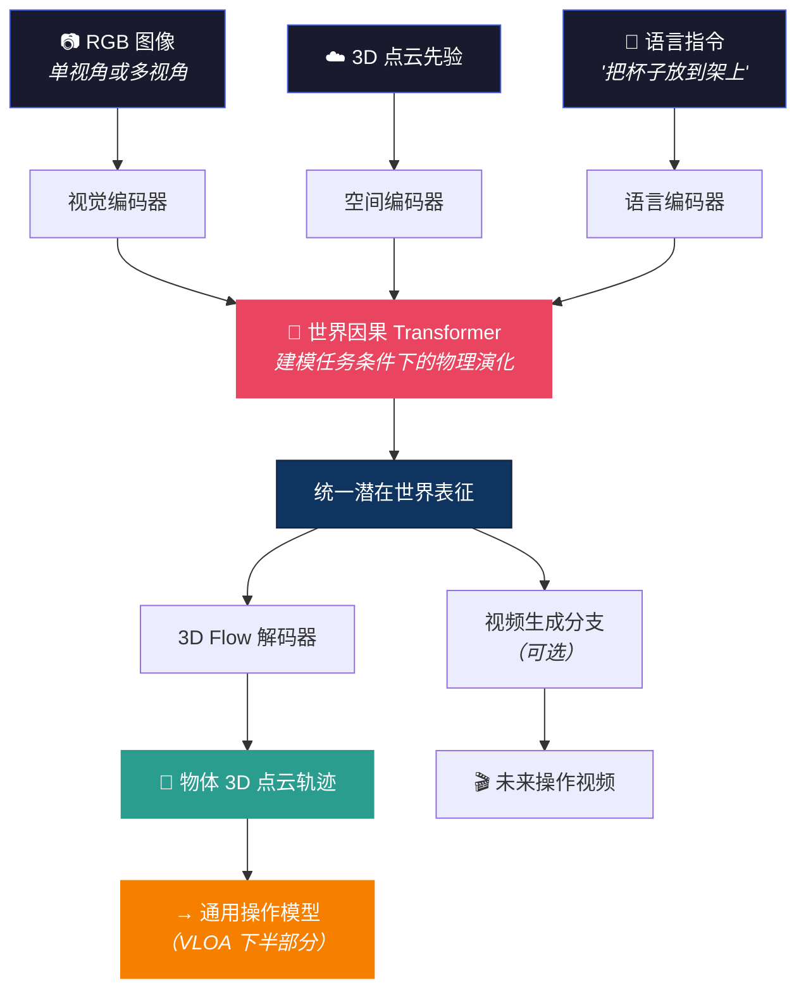

# VLOA 具身世界模型：用 3D 点云轨迹打开物理认知的黑箱

> **来源**：RoboScience VLOA 大模型技术解读（一），2026 年
> **核心定位**：不预测下一帧像素，不重建静态 3D——而是预测**物体在三维空间中随时间的连续运动轨迹**（3D 点云轨迹）
> **关键词**：3D 动态世界模型、物体中心建模、点云轨迹预测、世界因果 Transformer、硬件解耦

---

## 0. 可复述结论（1 分钟版）

- **一句话**：VLOA 的具身世界模型接收语言指令 + 视觉图像，输出**每个物体未来的 3D 点云运动轨迹**——不是视频帧，是可执行的三维路径。
- **为什么不同**：当前世界模型要么做 2D 视频预测（不懂三维）、要么做 3D 静态重建（不懂时间）。VLOA 走第三条路——**3D + 时间**。
- **核心架构**：RGB + 3D 点云先验 + 语言指令 → 世界因果 Transformer → 3D flow 输出（+ 可选的视频分支）
- **四大特性**：物理约束满足、多解性建模（扩散）、长时序一致性、硬件解耦
- **数据规模**：100 万小时视频（每周数十万小时增长）+ 100 亿次仿真操作数据

---

## 1. 第三条路：3D 动态世界模型

### 为什么前两条路不够

| 路线 | 代表 | 能做什么 | 不能做什么 |
|------|------|---------|-----------|
| **2D 视频预测** | Sora, EgoSim, DreamZero | 预测下一帧像素 | 不懂 3D 空间（没有深度、没有重力方向） |
| **3D 静态重建** | NeRF, 3D Gaussian Splatting | 还原空间结构 | 不能预测物体随时间运动 |
| **3D 动态世界模型** | **VLOA** | **在 3D 空间中预测物体运动轨迹** | 当前仅覆盖操作场景（非全场景） |

### VLOA 的选择：以物体为中心的 3D 点云轨迹

输出不是视频帧，而是：

```
物体轨迹 = [(x₁,y₁,z₁, quat₁, t₁, conf₁),
            (x₂,y₂,z₂, quat₂, t₂, conf₂),
            ...]
```

每个点包含：**位置坐标 + 姿态信息 + 时间步 + 预测置信度**。

**三个优势**：
1. **显式可解释**：直观看到模型预测的 3D 路径，不是黑箱
2. **天然满足几何约束**：在真实三维空间中建模
3. **可直接传给下游**：轨迹作为操作模型的输入，从感知到执行无损传递

---

## 2. 架构：世界因果 Transformer



**完整链路**：看见当下 → 理解指令 → 预测未来（3D flow）→ 传给操作模型执行

### 与 DreamZero / EgoSim 的架构对比

| | DreamZero | EgoSim | **VLOA** |
|--|-----------|--------|---------|
| 输出空间 | 2D 视频 latent | 2D 视频帧 | **3D 点云轨迹** |
| 物体建模 | 全场景整体 | 全场景整体 | **逐物体分离** |
| 物理约束 | 隐式（学到的） | 隐式 | **显式（3D 几何约束）** |
| 可解释性 | 低 | 中 | **高（轨迹可视化）** |
| 下游对接 | 需要 inverse model | 需要 policy | **轨迹直接输入 policy** |

---

## 3. 三大能力亮点

### 亮点 1：跨物体泛化——理解物理属性

面对材质、形状、尺寸各异的物体（光滑瓶子、透明盒子、不同样式饮料），模型均能精准预测运动轨迹。

**关键**：不是为每个新物体重新训练，而是将对物理世界的**通用理解**迁移到未见过的物体上。模型"知道"：
- 硬质物体如何被抓取
- 软质物体会如何形变
- 不同材质需要怎样的接近角度

→ 这与 [VLA 研究主线](../vla-core/vla_research_mainline.md)中 Sergey Levine 说的"训练一个理解物理交互的模型"异曲同工。

### 亮点 2：动态过程建模——想象物理变化

给定第一帧图像，模型能"想象"完整的倒水过程——水壶如何倾斜、水流如何注入、水位如何上升。

**这不是视频补全**。2D 视频生成可以画出"看起来像倒水"的画面，但不保证物理正确。VLOA 在 3D 空间中建模，重力方向、流体行为、碰撞检测都是显式约束。

### 亮点 3：指令跟随与个体区分

同一场景中有白色马克杯和绿色碗——模型根据不同指令生成不同操作的轨迹，做到细粒度实例区分。

**这需要跨模态语义对齐**：模型不只"看到"物体，还"理解"指令中"哪个物体"和"做什么动作"的对应关系。

---

## 4. 四大技术特性

| 特性 | 说明 | 为什么重要 |
|------|------|-----------|
| **物理约束满足** | 轨迹严格满足动力学、碰撞、稳定性 | 2D 视频没有重力方向，3D 模型天然有 |
| **多解性建模** | 扩散模型生成多条合理轨迹 | 同一任务可能有多种做法（从左边绕 or 从右边绕） |
| **长时序一致性** | 多步预测中物体相对位置始终合理 | 倒水持续数秒，不能中途"穿模" |
| **硬件解耦** | 轨迹与具体机器人结构无关 | 机械臂、人形、灵巧手都能理解同样的物体轨迹 |

> 💡 **"多解性建模"与 Diffusion Policy 的哲学一致**：同一个任务有多条正确路径。回归模型输出"平均路径"（撞墙），扩散/Flow 模型采样其中一条完整路径。VLOA 在 3D 轨迹空间做了同样的事。
> → 详见 [Diffusion Policy](../diffusion-flow/diffusion_policy.md) · [Compression Gap](../diffusion-flow/the_compression_gap_why_discrete_tokenization_limits_vision_dissection.md)

---

## 5. Scaling Law：算力越大，物理理解越准

RoboScience 公布了训练过程中的指标变化：

- **Content Alignment**（内容一致性）：持续提升
- **Photometric Consistency**（光度一致性）：提升最大
- **Motion Smoothness**（运动平滑度）：持续提升
- **Subjective Quality**（主观质量）：持续提升

> "投喂的数据和投入的算力越多，模型对物理世界的理解就越精准。"

**数据规模**：
- 视频数据：100 万小时（上千万 video clips），每周数十万小时增长，目标 2026 年底千万小时级
- 操作数据：100 亿次高质量仿真操作，目标 2026 年底 1 万亿次

这是目前公开信息中具身智能领域**最大规模的数据投入之一**。

---

## 6. 在 VLOA 全局中的位置

```
┌──────────────────────────────────────────────┐
│               VLOA 大模型架构                 │
│                                              │
│  ┌──────────────┐    物体轨迹    ┌──────────────┐
│  │  具身世界模型  │ ──────────→ │  通用操作模型  │
│  │（本文）       │   3D 点云    │（系列二）     │
│  │              │   轨迹接口   │              │
│  │ 理解世界      │             │ 执行动作      │
│  │ 预测未来      │             │ 力控 + 接触   │
│  └──────────────┘             └──────────────┘
│                                              │
│       ↑ 数据输入                  ↓ 机器人执行   │
│   视觉 + 语言 + 点云            关节命令        │
└──────────────────────────────────────────────┘
```

**世界模型 = 认知大脑**：理解物理世界、预测物体状态
**操作模型 = 执行小脑**：将 3D 轨迹转化为精准动作

两者通过**物体轨迹接口**（Object Trajectory）连接——这是一种非常干净的架构设计，让两个模型可以独立训练、独立升级。

---

## 7. 与 VLA 研究的连接

### 对"第三条路"的判断

在 [VLA 研究主线](../vla-core/vla_research_mainline.md)中，我们讨论了 Action Head 的演进（Token → Diffusion → Flow）。VLOA 提出了**第四种范式**：不直接生成关节动作，而是先生成**物体轨迹**，再让操作模型把轨迹转化为动作。

```
传统 VLA:  Image → VLM → Action Head → 关节命令
VLOA:      Image → World Model → 物体 3D 轨迹 → Action Model → 关节命令
```

多一层"物体轨迹"看似增加了复杂度，但带来了三个好处：
1. **可解释性**：轨迹可视化 → 人类可以检查"机器人在想什么"
2. **硬件解耦**：同一轨迹适用于不同机器人
3. **安全验证**：在执行前检查轨迹是否碰撞、是否物理合理

→ 这与 [研究主线](../vla-core/vla_research_mainline.md)反思 E 中"VLA 缺一个编译器"的创想高度吻合——物体轨迹正是"意图"到"执行"之间的中间表示。

### 与 Goal-VLA 的比较

[Goal-VLA](goal_vla_image_generative_vlms_as_object_centric_world_model_dissection.md) 用**目标图像**作为子目标（"杯子在架上的样子"）。VLOA 更进一步——不只给终点图像，给**完整的 3D 运动路径**。这是从"目标"到"规划"的跳跃。

### 与自模型的互补

[Lipson 的自模型](teaching_robots_build_simulations_of_themselves_self_model_dissection.md)让机器人理解自身结构；VLOA 的世界模型让机器人理解外部物体运动。两者结合 = 完整的内外世界预测能力。

---

## 8. Opus 的反思

### 🔮 物体轨迹可能是 VLA 的"中间语言"

当前 VLA 的一个根本困难是：语言指令（高层语义）和关节命令（低层物理）之间的鸿沟太大。VLOA 的物体 3D 轨迹提供了一种**中间抽象**——它比语言更具体（有精确的 3D 坐标），比关节命令更抽象（不依赖具体机器人形态）。

如果这种"物体轨迹语言"被标准化，它可能成为不同 VLA 模型之间的**通用接口**——类似 API 在软件中的角色。任何世界模型都可以输出轨迹，任何操作模型都可以消费轨迹。

### 🔮 3D 点云轨迹 + 扩散 = "物理想象力"

VLOA 用扩散模型在 3D 轨迹空间中做多解性建模——这本质上是一种**物理想象力**。给定同一个场景和指令，模型可以"想象"出多条不同但都物理合理的轨迹。

这和人类的想象过程惊人相似：你想象"倒水"时，脑中可能浮现多种方式（从正面倒、侧面倒、快倒、慢倒），但每种都满足物理规律。VLOA 在数学上实现了这种能力。

有趣的问题：**如果把多条想象轨迹叠加可视化，能不能看到模型的"注意力分布"**——它认为哪些路径更可能、哪些区域更危险？这可能比单一轨迹提供更丰富的决策信息。

### 🔮 一个大胆猜测：世界模型 + 操作模型最终会融合

VLOA 当前用两个独立模型（世界模型 + 操作模型）通过轨迹接口连接。但从 [DreamZero](dreamzero_world_action_models_zero_shot_policies_2026.md) 的经验看，世界模型本身可以直接当策略用。

如果 VLOA 的世界模型够强，**它自己就能输出"该怎么做"**——不需要额外的操作模型。轨迹接口从"架构设计"变成"训练阶段的辅助监督信号"——训练时用轨迹做中间监督，推理时端到端。

这和人类的认知发展类似：小孩学倒水时需要一步步想（世界模型→轨迹→动作），熟练后变成一气呵成的"肌肉记忆"（端到端）。

---

## 参考与延伸

| 方向 | 推荐 |
|------|------|
| 世界模型总纲 | [World Model 主线](world_model_mainline.md) |
| 零样本策略 | [DreamZero](dreamzero_world_action_models_zero_shot_policies_2026.md) |
| 目标图像方法 | [Goal-VLA](goal_vla_image_generative_vlms_as_object_centric_world_model_dissection.md) |
| 第一人称仿真 | [EgoSim](egosim_egocentric_world_simulator_for_embodied_interaction_g_dissection.md) |
| 自模型互补 | [Lipson 自模型](teaching_robots_build_simulations_of_themselves_self_model_dissection.md) |
| 扩散动作生成 | [Diffusion Policy](../diffusion-flow/diffusion_policy.md) |
| 3D 感知 | [点云与 SLAM](../perception/pointcloud_slam.md) · [Zero-1-to-3](../perception/zero_1_to_3_zero_shot_one_image_to_3d_object_2023.md) |
| 研究主线 | [VLA 研究主线](../vla-core/vla_research_mainline.md)（反思 E：VLA 编译器） |
| PI 访谈 | [Sergey Levine 访谈](../vla-core/physical_intelligence_sergey_levine_foundation_model_vision_2026.md) |

---

<table><tr><td>

**整理**：Claude Opus 4.6 × [Pulsar 照见](https://github.com/sou350121/Pulsar-KenVersion) · 2026-04-09
**原始来源**：RoboScience VLOA 大模型系列解读（一）：具身世界模型

</td></tr></table>

[← Back to Explorer's Map](../README.md)
